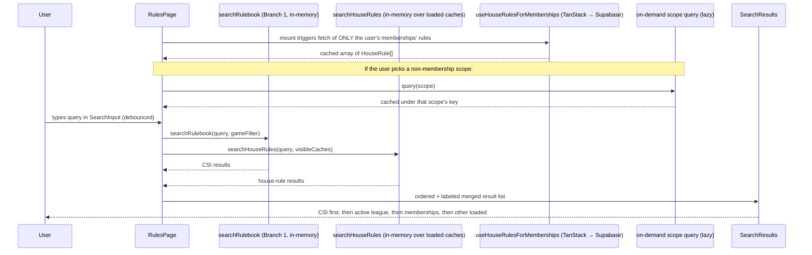

# feat: League House Rules (Branch 2)

## Overview

Add LO-authored house rules to the rackem-leagues app, layered on top of the CSI official rulebook that Branch 1 ships. Players get a new **"House rules"** filter in the existing `/rules` reader that surfaces overrides / enhancements / standalones scoped to the league they are currently playing in (with scope-switching for cross-league comparison and a **differences-only** mode for onboarding to a new league). LOs author rules from two existing surfaces: `OrganizationSettings` (via the repurposed `LeagueRules.tsx` stub, for org-wide rules) and `LeagueSettings` (new section, for league-specific rules).

**Branch:** `feature/league-house-rules` (already created, stacked on `feature/official-rulebook-reader`).

**PR base (stacked):** targets `feature/official-rulebook-reader` until Branch 1 merges; rebase to `main` afterwards.

## Problem Frame

Carried from [origin doc](../brainstorms/league-house-rules-requirements.md). Three player jobs (disputes, joining a new league, reference reading) and one LO job (authoring at three levels of rigor — lazy, typical, meticulous). A league's house rules **are** the effective rules for that league; CSI serves as the shared substrate Branch 3's AI helper will retrieve against.

## Requirements Trace

All 30 requirements from the origin doc. This plan covers each one; explicit trace is under each unit. Deepening pass strengthened coverage of R4 (plain-text body shape parity with Branch 1 `Rule.body` — now called out in Unit 2), R22–R26 (added form dirty-state guard + differences-only empty state), R27 (RLS hardening via SECURITY DEFINER function + read-only `league_rep`), and R28 (multi-overlay visual specificity ordering).

## Scope Boundaries

- No **season-scoped** rules.
- No automatic **merge / conflict resolution** (R28 — specificity ordering only).
- No **AI-assisted authoring** (deferred).
- No **version history** — delete-with-undo (10s window, UUID-preserving re-INSERT) is the only safety net.
- No **draft / publish** workflow.
- No **multi-CSI linking** per rule in v1 (R5).
- No **rich-text body** — plain-text paragraphs only. React renders the `body: string[]` as individual `<p>` children with default auto-escaping. No `dangerouslySetInnerHTML` anywhere in this feature, ever. Any future rich-text upgrade must ship its own sanitization contract.
- No **stale-rule flagging** on CSI edition change (connects to Branch 1's deferred redirect map).
- No **Season Settings** page.
- `league_rep` position is **read-only** for house rules in v1 (see Key Technical Decisions + R27). Promoting a `league_rep` to write requires new infrastructure (`organization_staff.league_id` scope column) out of scope for this branch.

### Deferred to Separate Tasks

- **Season tier:** extend `scope_type` check constraint and add a nullable `season_id` when the need surfaces.
- **Branch 3 AI rules helper** — retrieves from this branch's cleaned data.
- **AI-assisted authoring refinement** for Scenario 3.
- **Stale-rule flagging** when CSI publishes a new edition.
- **Multi-CSI linking** (`related_rule_ids[]`) if the one-to-one shape proves limiting.
- **Rich-text / markdown body** — if it ships, must bring its own sanitization layer.
- **league_rep write privileges scoped to assigned leagues** — requires an `organization_staff.league_id` column + UI to manage assignments.
- **Auto-selection of active league** based on recent match activity (v1 uses `localStorage` + explicit picker).
- **Rate limiting on anonymous event INSERT** — current constraint-only posture inherited from Branch 1; hardening is a separate operational pass.

## Context & Research

### Relevant Code and Patterns

- **Branch 1 primitives (fully reusable):**
  - `src/rules/useRulebook.ts`, `src/rules/resolveRuleId.ts`, `src/rules/useRulebookSearch.ts` — typed loader + CSI search.
  - `src/officalBCARulebook/cleaned/index.ts` — `idMap` for CSI rule validation and the game registry used by the form's game picker.
  - `src/rules/RulesPage.tsx`, `src/rules/RuleDetailPage.tsx`, `src/rules/RuleView.tsx`, `src/rules/CopyLinkButton.tsx`, `src/rules/RulesErrorBoundary.tsx`, `src/rules/RulesSkeleton.tsx`, `src/rules/SearchInput.tsx`, `src/rules/SearchResults.tsx`, `src/rules/SearchSnippet.tsx`, `src/rules/Attribution.tsx`, `src/rules/GameTOC.tsx`, `src/rules/AllGamesAccordion.tsx`, `src/rules/RuleCard.tsx`.
  - `src/components/ui/filter-chip.tsx`, `src/components/ui/sheet.tsx` — reusable UI primitives.
  - `src/rules/rulebook.types.ts` — `Rule`, `Game`, `Rulebook` types.
  - `src/rules/useRulesEvents.ts` — instrumentation hook (extended here).
- **Existing settings surfaces to modify:**
  - `src/operator/LeagueRules.tsx` — stub at `/league-rules/:orgId`; has an obsolete "Official BCA Rules" section (broken external bca-pool.com links — delete) and a "coming soon" House Rules placeholder (expand into the real manager).
  - `src/operator/OrganizationSettings.tsx` — already deep-links to `/league-rules/:orgId`; link retained.
  - `src/operator/LeagueSettings.tsx` — new "House rules" section added.
- **Existing access-control pattern:**
  - `organization_staff` table: `{ id, organization_id, member_id, position CHECK IN ('owner', 'admin', 'league_rep'), added_by, added_at }` (per `supabase/migrations/20251130010824_baseline.sql:1803`). In this feature `owner` and `admin` grant house-rule write; `league_rep` is **read-only** (see Key Technical Decisions + R27).
- **Instrumentation precedent:**
  - `supabase/migrations/20260419000000_rules_page_events.sql` — the check-constraint table we extend.
  - `src/__tests__/database/rulesPageEvents.rls.test.ts` — pattern for RLS tests on append-only logs.
- **Form patterns (react-hook-form + zod):**
  - `src/wizards/league-v2/LeagueWizardV2Page.tsx` and siblings — existing form patterns using react-hook-form + zod.
- **Command-palette picker:**
  - `src/components/MemberSearchCombobox.tsx` — `shadcn Command` palette pattern reused by `CsiRulePicker`.
- **Test patterns:** `src/__tests__/{unit,integration,database}/` — established from Branch 1.
- **Routing:** `src/navigation/NavRoutes.tsx` Public Routes block — `/rules` and `/rules/:game/:ruleId` landed here; the new `/rules/house/:scope/:scopeId/:ruleId` route slots in alongside them (also public per R6).

### Institutional Learnings

- No `docs/solutions/` entries yet in this repo.
- From Branch 1 shipping: shadcn `Input` doesn't forward refs — use an `id` + `document.getElementById` pattern for programmatic focus (see `src/rules/SearchInput.tsx`). Applies to the CSI rule picker inside the LO form.
- From Branch 1: integration tests must mock `@/components/PageHeader` because it depends on TanStack Query not wired into the shared test helper. Same applies here.
- From Branch 1 testing: `userEvent.setup()` installs its own clipboard mock that can shadow test-owned spies; setup user-event BEFORE `vi.spyOn(navigator.clipboard, 'writeText')`.

### External References

None needed. The work is self-contained over the existing stack + Branch 1 data.

## Key Technical Decisions

### Load strategy: scoped lazy load (revised after review)

Load only the house rules immediately relevant to the player's context; fetch other scopes on demand. Specifically:

- On `/rules` mount: TanStack Query fetches house rules where `scope_type = 'league' AND scope_id IN (user's league memberships)` OR `scope_type = 'organization' AND scope_id IN (user's organization memberships via team_players → teams → leagues.organization_id, ∪ organization_staff.organization_id)`. For logged-out users or members of nothing: the query returns an empty set (no preload).
- When the user narrows the filter to a league/org they are **not** a member of (cheat-sheet flow): a second TanStack Query fires with that scope as its key and fetches just those rules. Cached per scope so switching back is instant.
- Search composition: CSI via Branch 1's in-memory `searchRulebook`; house rules via the currently-loaded caches (membership + any on-demand scope). A query "spanning all orgs globally" is not supported in v1 — the scoped-load model means search operates within the user's current visibility. This is a trade-off vs. the original brainstorm's "always inclusive across every org" — but in practice players search to answer *their* dispute, not to compare every league in the world. The scope picker remains the way to expand visibility.

### Data model: two nullable scope FKs with a check constraint

The original "polymorphic `scope_id`" design had two problems: no referential integrity (orphan rows on org/league delete) and PostgREST couldn't embed a JOIN through it. Revised:

- `house_rules` has **two** nullable FK columns: `organization_id uuid REFERENCES organizations(id) ON DELETE CASCADE` and `league_id uuid REFERENCES leagues(id) ON DELETE CASCADE`.
- CHECK constraint: **exactly one is non-null** (`(organization_id IS NOT NULL) != (league_id IS NOT NULL)`).
- `scope_type` becomes a computed/virtual view concept, not a column. Client code derives it from which column is populated.
- `scope_name` resolution: a DB VIEW `house_rules_with_scope_name` LEFT JOINs both `organizations` and `leagues` and produces a single `scope_name text` column. Clients SELECT from the view.

### RLS: SECURITY DEFINER function + read-only league_rep

- Write access (INSERT/UPDATE/DELETE) requires `can_write_house_rule(organization_id_or_owning_org uuid) RETURNS boolean LANGUAGE sql SECURITY DEFINER` that checks `EXISTS (SELECT 1 FROM organization_staff os JOIN members m ON m.id = os.member_id WHERE m.user_id = auth.uid() AND os.organization_id = <target> AND os.position IN ('owner', 'admin'))`. `league_rep` is deliberately excluded pending league-scoped assignment infrastructure.
- SECURITY DEFINER removes the caller-RLS-on-leagues concern (subquery runs as function owner). The function is `STABLE` and takes a single org-id argument; callers compute the target org from `organization_id` (direct) or `league_id` → `leagues.organization_id`.
- Read access is world-readable per R6 — `SELECT to anon, authenticated using (true)`.

### XSS posture (explicit contract)

- Body and title are **plain text**. The `RuleView` component renders `rule.body` as React children via `{rule.body.map((p, i) => <p key={i}>{p}</p>)}`. Title renders as `<h1>{rule.title}</h1>`. React's default auto-escaping is the entire sanitization story.
- **No `dangerouslySetInnerHTML` anywhere in this feature.** Code review gate.
- A length cap is enforced in the DB: `title ≤ 120 chars`, each `body[]` element ≤ 4000 chars, `body[]` has at most 50 entries (prevents blobs that don't fit the plain-text story).
- If a future change introduces rich-text or markdown rendering, that change must supply its own sanitization layer (DOMPurify, markdown-it with safe config, or similar). This is noted in Deferred to Separate Tasks.

### Deep-link stability across Delete + Undo

- Delete performs a real DB DELETE; the row snapshot (including original `id`) is held in client memory for **10 seconds exactly**.
- Undo fires an INSERT that passes the **original `id`** back explicitly. RLS allows this because the actor is the same org staff member with write rights; the `id` column is not in the subset of columns RLS cares about.
- Consequence: any deep link copied during the 10s window still resolves after Undo (R19 / R18 promise preserved).
- If the 10s window expires (toast dismissed, user navigates away, app backgrounded), the Undo is no longer available and the row is gone.

### One shared mutations module, sonner at call sites

- Mutations live in `src/api/mutations/houseRules.ts` (create / update / delete). Optimistic updates and cache invalidation live there.
- Sonner toasts fire at the **call site** (form submit handlers, delete-confirm dialog) — not in a second hook layer. `useHouseRuleMutations.ts` from the earlier draft is dropped.

### Inline-first for small single-use components

- `HouseRulesDiscoveryNudge` lives inline inside `RulesPage.tsx` until it gets a second consumer.
- `HouseRuleAttribution` lives inline inside `HouseRuleDetailPage.tsx` until it gets a second consumer.
- Extract only when reuse materializes.

### Active-league localStorage cleared on sign-out

- `rackem:rules:activeLeague` is cleared by the existing sign-out flow (a small hook into `supabase.auth.onAuthStateChange`). Prevents cross-user scope leakage on shared devices.

### Event-log rate limiting deferred

- `rules_page_events` anonymous INSERT remains permissive, bounded only by CHECK constraints on columns. Rate limiting / size cap / anti-abuse is a separate operational pass (same posture Branch 1 shipped with).

## Open Questions

### Resolved During Planning

- **Schema:** two nullable FK columns (`organization_id`, `league_id`) with a mutual-exclusion CHECK, both `ON DELETE CASCADE`.
- **`scope_name` resolution:** DB VIEW `house_rules_with_scope_name` joining both org + league.
- **Write-access RLS:** `SECURITY DEFINER` function restricted to `owner` + `admin`; `league_rep` read-only.
- **Eager-load vs per-keystroke:** scoped lazy load — memberships preloaded, non-memberships on demand.
- **Deep-link shape:** `/rules/house/:scope/:scopeId/:ruleId` with UUIDs.
- **Scope-picker UI:** shadcn `Sheet` reused from Branch 1. On mobile: full-height bottom sheet with the filter search input pinned to the top so the keyboard does not push it off-screen.
- **Discoverability nudge mechanism:** `localStorage` flag `rackem:rules:houseFilterNudgeDismissed` (per-device).
- **Ordering within result groups:** `updated_at DESC`.
- **Event-type extension:** migration drops + recreates `event_type` CHECK, adds optional `scope_type` + `scope_id` columns.
- **Fate of `LeagueRules.tsx` obsolete section:** delete external CSI links; replace with a "View the official rulebook →" link to `/rules`.
- **Delete + Undo:** UUID preserved on re-INSERT; 10-second window; toast dismissal or tab background ends the window.
- **XSS posture:** plain-text only, React auto-escaping only, no `dangerouslySetInnerHTML`, DB length caps.
- **Multi-overlay visual treatment (R28):** when multiple house rules apply to one CSI rule, stack them as sibling cards immediately below the CSI card, ordered league-specific first then org-wide. Each card carries its origin label. No collapse, no badge count.
- **Chip mobile truncation:** chip label format `House rules · {scope-short-name}` with `scope-short-name` truncated to 20 chars with a tooltip revealing the full name on tap-hold.

### Deferred to Implementation

- Exact zod schema shape for the form (field-level messages).
- Exact optimistic-update rollback behavior on constraint failure (e.g., the CHECK that enforces exactly-one-scope-populated — unlikely to trigger from the UI, but worth confirming once forms exist).
- Precise error-message copy for constraint violations and missing-CSI-rule link errors.
- The exact CSI rule picker's result list height on mobile (depends on scope-picker `Sheet` sizing in practice).
- Whether the form's dirty-state guard uses `react-router` `useBlocker` or a plain `beforeunload` listener (decide after seeing browser-back behavior in the app's existing forms).

## High-Level Technical Design

> *This illustrates the intended approach and is directional guidance for review, not implementation specification. The implementing agent should treat it as context, not code to reproduce.*

**Data model (ERD-ish):**

```
organizations ─┬─< organization_staff (position: owner|admin|league_rep)
               │         └── member_id ──> members ──> auth.users
               │
               └─< leagues ─< seasons ─< teams ─< team_players >── members

                 ┌─────────────── house_rules ───────────────┐
                 │  id uuid pk                               │
                 │  organization_id uuid nullable FK         │
                 │    → organizations(id) ON DELETE CASCADE  │
                 │  league_id uuid nullable FK               │
                 │    → leagues(id)        ON DELETE CASCADE │
                 │  CHECK (exactly one of the above is null) │
                 │  game text, effect_type text              │
                 │  related_rule_id text (→ cleaned idMap)   │
                 │  title text, body text[]                  │
                 │  updated_at, updated_by                   │
                 └───────────────────────────────────────────┘

VIEW house_rules_with_scope_name =
  LEFT JOIN organizations ON organization_id
  LEFT JOIN leagues        ON league_id
  produces scope_name text

rules_page_events (extended):
  event_type ∈ { page_open, search_query, deep_link_open,
                 house_filter_activated, differences_only_activated,
                 house_rule_opened, scope_changed }
  + optional scope_type, scope_id for the new event types
```

**Search-merge flow (mermaid):**



**Active-league resolution (decision matrix):**

| User state | Memberships | `activeLeague` in localStorage | Behavior on filter toggle |
|---|---|---|---|
| Logged out | n/a | absent | Open scope picker |
| Logged out | n/a | present | **Discard the stored value** (can't validate without auth) and open picker |
| Logged in, 0 leagues | 0 | absent | Open scope picker |
| Logged in, 1 league | 1 | absent | Auto-pick that league silently |
| Logged in, 2+ leagues | 2+ | absent | Open scope picker |
| Logged in, any | any | present + still a valid membership | Honor it |
| Logged in, any | any | present but no longer a valid membership | Discard + re-pick per rules above |

## Implementation Units

- [x] **Unit 1: Database migration — `house_rules` table + view + RLS + extended `rules_page_events`**

**Goal:** Create the `house_rules` table with two-nullable-FK scoping, foreign keys with ON DELETE CASCADE, check constraints, length caps, a `house_rules_with_scope_name` view, RLS via a `SECURITY DEFINER` write-permission function, and the extension of `rules_page_events`. Regenerate typed DB types.

**Requirements:** R1, R2, R3, R5, R6, R27, R29.

**Dependencies:** None (data foundation).

**Files:**
- Create: `supabase/migrations/20260419120000_house_rules.sql`
- Modify: `src/types/database.types.ts` (regenerated via `pnpm run db:types`)
- Test: `src/__tests__/database/houseRules.rls.test.ts`
- Test: extend `src/__tests__/database/rulesPageEvents.rls.test.ts`

**Approach:**
- `house_rules` columns: `id uuid pk default gen_random_uuid()`, `organization_id uuid null references organizations(id) on delete cascade`, `league_id uuid null references leagues(id) on delete cascade`, `game text not null check (char_length(game) <= 40)` (accepts any Branch 1 game slug + `'general'`), `effect_type text not null check (effect_type in ('override','enhance','standalone'))`, `related_rule_id text check (related_rule_id is null or char_length(related_rule_id) <= 40)`, `title text not null check (char_length(title) between 1 and 120)`, `body text[] not null default '{}'` with `check (array_length(body, 1) is null or array_length(body, 1) <= 50)` and a per-element length check via a small trigger (each element ≤ 4000 chars), `created_at timestamptz not null default now()`, `updated_at timestamptz not null default now()`, `updated_by uuid references auth.users(id)`.
- Exclusivity check: `check ((organization_id is null) != (league_id is null))`.
- R3 effect-type check: `check (effect_type = 'standalone' and related_rule_id is null) or (effect_type in ('override','enhance') and related_rule_id is not null)`.
- Indexes: `(organization_id) where organization_id is not null`, `(league_id) where league_id is not null`, `(related_rule_id) where related_rule_id is not null`, `(game)`.
- View `house_rules_with_scope_name`: `SELECT hr.*, COALESCE(o.name, l.name) AS scope_name, CASE WHEN hr.organization_id IS NOT NULL THEN 'organization' ELSE 'league' END AS scope_type FROM house_rules hr LEFT JOIN organizations o ON hr.organization_id = o.id LEFT JOIN leagues l ON hr.league_id = l.id`.
- Write-permission function `can_write_house_rule_org(target_org_id uuid) returns boolean language sql security definer stable as $$ select exists (select 1 from organization_staff os join members m on m.id = os.member_id where m.user_id = auth.uid() and os.organization_id = target_org_id and os.position in ('owner','admin')) $$;`
- RLS: `SELECT to anon, authenticated using (true)`. `INSERT/UPDATE/DELETE to authenticated using (can_write_house_rule_org(coalesce(organization_id, (select organization_id from leagues where id = league_id)))) with check (can_write_house_rule_org(coalesce(organization_id, (select organization_id from leagues where id = league_id))))`.
- Trigger to bump `updated_at` and stamp `updated_by = auth.uid()` on UPDATE.
- `rules_page_events` changes: drop + recreate `event_type` CHECK with the seven values; add `scope_type text null check (scope_type is null or scope_type in ('organization','league'))` and `scope_id uuid null`. All changes in a single transactional DDL block — brief AccessExclusiveLock on the table is acceptable for this log's traffic profile.

**Execution note:** Run `pnpm run db:reset` after writing the migration; commit the regenerated `database.types.ts` alongside.

**Patterns to follow:**
- `supabase/migrations/20260419000000_rules_page_events.sql` — log-style table with RLS + role-check predicate.
- `supabase/migrations/20251130010824_baseline.sql:699` — existing role-check predicate form.

**Test scenarios:**
- Happy path: anon SELECT on `house_rules_with_scope_name` returns seeded rows with `scope_name` populated from either source table.
- Happy path: `owner` or `admin` staff of the owning org INSERTs org-scoped and league-scoped rules successfully.
- Edge case: INSERT with both `organization_id` and `league_id` non-null → CHECK rejects.
- Edge case: INSERT with both `organization_id` and `league_id` null → CHECK rejects.
- Edge case: INSERT with `effect_type='override'` and `related_rule_id=NULL` → CHECK rejects.
- Edge case: INSERT with `effect_type='standalone'` and `related_rule_id='8-ball:2-2'` → CHECK rejects.
- Edge case: INSERT with `title` length = 121 → CHECK rejects.
- Edge case: INSERT with `body` array containing 51 elements → CHECK rejects.
- Edge case: INSERT with any `body[]` element longer than 4000 chars → trigger raises.
- Error path: `league_rep` staff INSERT is rejected by RLS (read-only posture).
- Error path: authenticated non-staff user INSERT is rejected by RLS.
- Error path: anon INSERT is rejected by RLS.
- Integration: deleting the owning organization cascades — `house_rules` rows with that `organization_id` are removed.
- Integration: deleting a league cascades — `house_rules` rows with that `league_id` are removed; rules for the owning organization (different scope) remain.
- Integration: UPDATE bumps `updated_at` and sets `updated_by` via trigger.
- Integration (extended `rulesPageEvents.rls.test.ts`): all four new `event_type` values accepted; unknown types still rejected; optional `scope_type` / `scope_id` accept valid UUIDs and reject over-length `scope_type`.

**Verification:**
- `pnpm run db:reset` applies cleanly.
- RLS tests pass.
- `src/types/database.types.ts` includes `house_rules` and the updated `rules_page_events`.

---

- [x] **Unit 2: Data access layer — types, loaders, search, mutations, active-league, memberships, event types**

**Goal:** Expose typed read + write access to house rules (scoped lazy loading per the decision), DB-backed search, an active-league hook, a memberships hook, and the extended event logger. All UI units consume this module.

**Requirements:** R1, R4, R6, R10, R14, R17, R27, R29, R30.

**Dependencies:** Unit 1.

**Files:**
- Create: `src/rules/house-rules.types.ts` (`HouseRule`, `HouseRuleScope`, `HouseRuleEffectType`, form-payload types)
- Create: `src/rules/useHouseRules.ts` (`useHouseRulesForMemberships()`, `useHouseRulesForScope(scope)` — both pull from the view)
- Create: `src/rules/searchHouseRules.ts` (pure function)
- Create: `src/rules/useActiveLeague.ts` (localStorage-backed, clears on auth change)
- Create: `src/rules/useMyMemberships.ts` (derived from `team_players` + `organization_staff`)
- Create: `src/api/mutations/houseRules.ts` (create/update/delete with optimistic updates)
- Modify: `src/rules/useRulesEvents.ts` (add `logHouseFilterActivated`, `logDifferencesOnlyActivated`, `logHouseRuleOpened`, `logScopeChanged`)
- Test: `src/__tests__/unit/searchHouseRules.test.ts`
- Test: `src/__tests__/unit/useActiveLeague.test.ts`
- Test: `src/__tests__/unit/useMyMemberships.test.ts`
- Test: `src/__tests__/unit/houseRulesMutations.test.ts`

**Approach:**
- `HouseRule` type mirrors `Rule` shape (`{ id, game, title as heading, body: string[], order? }`) **plus** `scope_type`, `organization_id | null`, `league_id | null`, `scope_name`, `effect_type`, `related_rule_id | null`, `updated_at`. A `toRule(houseRule)` helper adapts it for `RuleView` consumption (R4).
- `useHouseRulesForMemberships()` — reads from `house_rules_with_scope_name` filtered by `organization_id IN (user's memberships orgs) OR league_id IN (user's memberships leagues)`. Single TanStack Query keyed on the user id; long staleTime.
- `useHouseRulesForScope(scope)` — on-demand query keyed on the scope's org/league id. Fires only when the user picks a non-membership scope in the picker.
- `searchHouseRules(query, rules)` — pure case-insensitive substring matcher over title + body paragraphs. Returns the same `SearchResult` shape as Branch 1's `searchRulebook` with an extra `origin` descriptor `{ scope_type, scope_id, scope_name }`.
- `useActiveLeague()` — `{ activeLeague, setActiveLeague, clear }`. Reads `rackem:rules:activeLeague` on mount; validates against `useMyMemberships()` when logged in; discards stale or cross-user cached values on sign-out via a `supabase.auth.onAuthStateChange(SIGNED_OUT)` listener.
- `useMyMemberships()` — two parallel queries (player via `team_players` → `teams` → `leagues`; staff via `organization_staff`). Deduplicated. Cached.
- Mutations (`createHouseRule`, `updateHouseRule`, `deleteHouseRule`, `reinsertHouseRule`) — optimistic updates on the membership cache. `reinsertHouseRule` passes the original `id` back for the Undo flow.
- Event helpers each take an explicit payload; no hidden state.

**Patterns to follow:**
- `src/api/mutations/matches.ts` (TanStack mutation pattern).
- `src/rules/useRulebookSearch.ts` (pure function + hook wrapper).

**Test scenarios:**
- Happy path: `searchHouseRules("8 on break", rules)` returns matching rules.
- Happy path: `searchHouseRules("", rules)` returns `[]`.
- Edge case: regex-special chars are literal, do not throw.
- Happy path: `useActiveLeague` reads from localStorage on mount.
- Edge case: stored ID not in memberships → discarded.
- Edge case: exactly one membership → auto-select.
- Edge case: sign-out event clears `rackem:rules:activeLeague`.
- Happy path: `useMyMemberships` merges player + staff leagues without duplicates.
- Happy path: create mutation optimistically inserts into the cache, confirms on success.
- Error path: create mutation failure rolls back the optimistic insert.
- Happy path: `reinsertHouseRule` with a preserved `id` re-creates the exact same primary key (verifies Undo's deep-link-stability guarantee).
- Integration: `logHouseFilterActivated({ scope_type: 'league', scope_id: 'L1' })` produces a well-formed row payload.

**Verification:**
- Unit tests pass. `pnpm run build` typechecks cleanly with no `any` in new modules.

---

- [x] **Unit 3A: Filter chip + scope picker + merged search (reader part 1)**

**Goal:** Add the House rules filter chip + chevron disclosure, the `HouseRulesScopePicker` (Sheet-based), and merge house-rule search results into `SearchResults` with correct ordering and labeling. Fire `house_filter_activated` + `scope_changed` events.

**Requirements:** R7, R8, R9, R10, R11, R14, R15, R16, R27 (read paths).

**Dependencies:** Unit 2.

**Files:**
- Modify: `src/rules/RulesPage.tsx`
- Create: `src/rules/HouseRulesScopePicker.tsx` (shadcn `Sheet` with search input)
- Modify: `src/rules/SearchResults.tsx`
- Modify: `src/rules/SearchSnippet.tsx`
- Modify: `src/rules/RuleCard.tsx` (accept an explicit `to` prop instead of hardcoding `/rules/:game/:id`)
- Create: `src/rules/HouseRuleCard.tsx` (CSI-parallel card that links to `/rules/house/...`)
- Test: extend `src/__tests__/integration/RulesPage.test.tsx`
- Test: `src/__tests__/integration/HouseRulesScopePicker.test.tsx`

**Approach:**
- `RuleCard` is upgraded to accept `to?: string` (fallback computes the CSI path as today). `HouseRuleCard` wraps the card with a `/rules/house/...` route; both call the upgraded card.
- House rules chip sits in the existing chip row; label dynamically reflects the active scope (`House rules · {scope-short-name}`, truncated to 20 chars with tooltip for the full name).
- `HouseRulesScopePicker` opens as a `Sheet` — full-height bottom sheet on mobile with the filter search input pinned to the top. Search filters the list as the user types. List content: "My memberships (all)" option first (if logged in with ≥1 membership), then each league the user is a member of grouped under its org, then a collapsed "Other leagues" section (with lazy child-list hydration to avoid loading hundreds of league names in memory on mount).
- `SearchResults` accepts both CSI and house-rule result arrays; applies R16 ordering. Each result card renders an origin badge (`<Badge>` for CSI, `<Badge variant>` for house rules showing the scope name).
- Events: fire `house_filter_activated` on toggle, `scope_changed` on picker selection.

**Patterns to follow:**
- `src/rules/RulesPage.tsx` existing chip architecture.
- `src/rules/RuleDetailPage.tsx` sheet-drawer pattern (mirror for the picker).
- `src/components/MemberSearchCombobox.tsx` for the picker's search-within-a-list pattern.

**Test scenarios:**
- Happy path: logged-in member clicks House rules chip → picker opens → picks their league → merged reader state active.
- Happy path: search returns CSI results first, then active league's rules, then other memberships, then any other loaded house rules.
- Edge case: user with zero memberships clicks chip → picker opens empty memberships section; "Other leagues" still accessible.
- Edge case: stored `activeLeague` is stale → chip falls back to auto-select (1 membership) or picker.
- Edge case: picker search filters the list as the user types; clearing returns full list.
- Integration: toggling chip fires `house_filter_activated` with scope metadata; picking a scope fires `scope_changed`.
- a11y: picker has proper landmark + focus-trap; mobile-keyboard does not hide search input.

**Verification:**
- Manual: `pnpm run dev`, open `/rules` as a member, click chip, pick scope, search, see merged results.
- Integration tests pass.

---

- [x] **Unit 3B: TOC / Accordion interleave + differences-only + discovery nudge (reader part 2)**

**Goal:** When the filter is on AND a single scope is active (not search), interleave matching house rules beneath the CSI rules they override/enhance in `GameTOC` / `AllGamesAccordion`, specificity-ordered (league > org). Add the differences-only toggle with empty state. Ship the first-time discovery nudge.

**Requirements:** R12, R13, R28.

**Dependencies:** Unit 3A.

**Files:**
- Modify: `src/rules/GameTOC.tsx` (accept loaded house rules + differencesOnly + scope)
- Modify: `src/rules/AllGamesAccordion.tsx` (same)
- Add: inline `DiscoveryNudge` component inside `src/rules/RulesPage.tsx` (not a separate file)
- Modify: `src/rules/RulesPage.tsx` (add differences-only toggle)
- Test: extend `src/__tests__/integration/RulesPage.test.tsx`

**Approach:**
- Grouping helper: given CSI rules + house rules + scope, build a `TocEntry[]` where each CSI rule carries an array of matching house rules (by `related_rule_id`). Standalone house rules form their own entries at the top of the list, labeled *"League-specific additions"*.
- TOC render: CSI rule card first, then any matching house-rule cards indented below, specificity-ordered (league-scoped first).
- Differences-only toggle appears only when a single-scope is active. When ON, hide CSI entries with no matching house rules; standalones stay visible.
- **Differences-only empty state:** when scope has zero house rules, show a friendly panel — *"{Scope name} uses the standard CSI rules — no house rules on file."* with a "View the full rulebook →" link that disables differences-only.
- Discovery nudge: inline component in `RulesPage.tsx` — renders only when `isLoggedIn && hasMemberships && !localStorage['rackem:rules:houseFilterNudgeDismissed']`. Dismiss button + 8-second auto-hide after filter is first interacted with.
- Events: fire `differences_only_activated` on toggle.

**Patterns to follow:**
- Existing TOC/Accordion shape from Branch 1 — extend don't replace.

**Test scenarios:**
- Happy path: filter on, scope = league with overrides on CSI 2-1 and 2-3 → TOC shows all CSI rules; the overrides appear indented under 2-1 and 2-3.
- Happy path: differences-only ON → only CSI rules with overrides + standalones render; other CSI rules hidden.
- Edge case: scope with 0 house rules + differences-only ON → empty state copy renders with the "View full rulebook" link.
- Edge case: multiple overrides on the same CSI rule → stacked as siblings, league-scoped first, then org-scoped.
- Edge case: standalone house rule (no `related_rule_id`) → appears in its own "League additions" section at the top.
- Integration: toggling differences-only fires `differences_only_activated`.
- Integration: discovery nudge appears on first visit for a logged-in member; dismissing it persists across reload; toggling the filter auto-hides after 8 seconds.
- a11y: nudge has `role="status"` + dismiss button; focus management respects filter interaction.

**Verification:**
- Manually: as a member of a league with some house rules, see interleaving in the TOC and differences-only working.
- Integration tests pass.

---

- [x] **Unit 4: House rule detail page + deep-link route**

**Goal:** `/rules/house/:scope/:scopeId/:ruleId` renders a single house rule using the shared `RuleView` shape (via the `toRule` adapter), with drawer + Copy-link + inline attribution + unknown-ID fallback. Fires `house_rule_opened`.

**Requirements:** R18, R19.

**Dependencies:** Unit 2.

**Files:**
- Create: `src/rules/HouseRuleDetailPage.tsx` (includes inline Attribution block — no separate file)
- Modify: `src/navigation/NavRoutes.tsx` (add public route wrapped in `RulesErrorBoundary` + `Suspense`)
- Test: `src/__tests__/integration/HouseRuleDetailPage.test.tsx`

**Approach:**
- Page reads `:scope`, `:scopeId`, `:ruleId` via `useParams`. Resolves via `useHouseRulesForScope(scope)` or a targeted `useHouseRule(ruleId)` — returns null if no match.
- Mirrors `RuleDetailPage` structure: `PageHeader` (backTo `/rules`), toolbar (drawer trigger for "Rules in this scope", Copy-link button), `RuleView` rendering `toRule(houseRule)`, inline attribution footer.
- Drawer lists every house rule in the same scope. Current rule highlighted.
- Inline attribution: *"{Scope name}"* + effect-type banner ("Overrides CSI Rule 2-2" / "Enhances CSI Rule 2-2") with a link to the CSI rule's URL when applicable.
- Unknown-ID handling mirrors Branch 1's R9c — `navigate('/rules', { replace: true })` + sonner toast.
- Fires `logHouseRuleOpened` on successful mount with resolved `scope_type`, `scope_id`, `rule_id`.

**Patterns to follow:**
- `src/rules/RuleDetailPage.tsx` for structure + error handling.

**Test scenarios:**
- Happy path: valid URL renders heading, body, attribution, drawer button, Copy-link button.
- Happy path: drawer lists siblings in the same scope; current one highlighted; clicking a sibling navigates.
- Happy path: override rule's attribution banner links to the correct CSI rule; link resolves.
- Edge case: `effect_type='standalone'` rule has no CSI banner.
- Edge case: unknown rule id → redirect + toast.
- Edge case: unknown scope → redirect + toast.
- Integration: Copy-link button copies `window.location.href`, shows success toast.
- Integration: `logHouseRuleOpened` fires once with correct payload.
- a11y: `<h1>` is unique; attribution link has accessible name.

**Verification:**
- Manual: open a house rule via reader + direct URL; paste in another tab; both resolve.
- Integration tests pass.

---

- [x] **Unit 5: Shared `HouseRuleForm` + org-wide authoring via repurposed `LeagueRules.tsx`**

**Goal:** Build the reusable LO authoring form (with dirty-state guard). Repurpose `LeagueRules.tsx` as the org-wide manager. Delete the obsolete external-links section; replace with a link to `/rules`.

**Requirements:** R20, R21, R22, R23, R24, R25, R26, R27.

**Dependencies:** Unit 2.

**Files:**
- Create: `src/rules/HouseRuleForm.tsx` (add/edit form with zod + react-hook-form, dirty-state guard)
- Create: `src/rules/HouseRulesList.tsx` (reusable list with inline add/edit/delete)
- Create: `src/rules/CsiRulePicker.tsx` (shadcn Command palette picker)
- Modify: `src/operator/LeagueRules.tsx`
- Test: `src/__tests__/unit/houseRuleForm.test.tsx`
- Test: `src/__tests__/integration/LeagueRulesPage.test.tsx`

**Approach:**
- `HouseRuleForm` accepts `scope: { type: 'organization' | 'league', id: string }` + optional `initial: HouseRule`. Fields per R22. Uses zod schema for validation; react-hook-form for state. Switching effect-type between Override/Enhance and Standalone **hides** `related_rule_id` (does not clear state) — matches R25.
- **Dirty-state guard:** `useBlocker` from react-router intercepts navigation when the form has unsaved changes; shows a confirm dialog. Cancel button checks dirty state before closing.
- "Copy official text as starting point" button shows when an Override/Enhance rule has a CSI rule picked. If textarea non-empty, shows confirm before overwrite (R25).
- `HouseRulesList` renders a list scoped to the given `scope` prop, with Add/Edit/Delete controls (Add/Edit/Delete hidden for non-writers — RLS is the real enforcement). Optional game-filter tabs at top. Delete opens `AlertDialog`; confirmed delete calls `deleteHouseRule` and shows sonner toast with **Undo** action that calls `reinsertHouseRule` (preserving `id`).
- `LeagueRules.tsx` after repurpose: `PageHeader` back to operator settings, short intro block with a *"View the official rulebook →"* link to `/rules`, then `<HouseRulesList scope={{ type: 'organization', id: orgId }} />`.
- Sonner toasts fire at the call sites (submit success, delete-with-undo).

**Execution note:** Write the effect-type-switch and copy-text-confirm tests first — those are the subtle interactions.

**Patterns to follow:**
- `src/components/MemberSearchCombobox.tsx` for the Command palette picker.
- `src/wizards/league-v2/LeagueWizardV2Page.tsx` for react-hook-form + zod usage.
- `src/rules/CopyLinkButton.tsx` for sonner toast conventions.

**Test scenarios:**
- Happy path: add Standalone rule; submit → row appears in list.
- Happy path: Override + pick CSI 8-Ball 2-2 + title + body + submit → saved with `related_rule_id='8-ball:2-2'`.
- Happy path: Override + pick CSI rule + empty textarea + click Copy official text → textarea populated.
- Edge case: Copy official text with existing content → confirm dialog; cancel preserves, confirm overwrites.
- Edge case: Switch effect type Override → Standalone with CSI rule picked → related rule hidden but preserved; switching back restores.
- Edge case: Form is dirty + user clicks PageHeader back → blocker confirms before navigating; cancel stays on the form.
- Edge case: Form is dirty + user refreshes tab → `beforeunload` prompts. Cancel preserves form state (TanStack draft cache or re-prompt on next visit — deferred implementation detail).
- Error path: Validation (empty title / Override without CSI rule) shows field-level errors on blur, not only on submit.
- Error path: Save failure → toast with retry; form preserved.
- Integration: Delete → confirm → Undo clicked within 10s → row re-appears with ORIGINAL `id` (deep-link stability test asserts `id` equality).
- Integration: Delete → confirm → toast expires → row permanently gone; new INSERT of the same title gets a different `id`.
- a11y: fields have labels; radios use fieldset/legend; delete dialog traps focus.

**Verification:**
- Manually test org-wide CRUD at `/league-rules/:orgId` as `owner`; confirm reader shows the rules.
- Load as `league_rep` → list is read-only (no Add/Edit/Delete buttons).
- `pnpm run build` passes.

---

- [x] **Unit 6: League-specific authoring in `LeagueSettings`**

**Goal:** Add a "House rules" section to `LeagueSettings` scoped to a single league. Reuses `HouseRulesList` from Unit 5.

**Requirements:** R20, R21, R22, R23, R24, R25, R26, R27.

**Dependencies:** Unit 5.

**Files:**
- Modify: `src/operator/LeagueSettings.tsx` (add section)
- Test: `src/__tests__/integration/LeagueSettingsHouseRules.test.tsx`

**Approach:**
- Import `HouseRulesList`. Render a new section with heading "House rules" and copy *"Rules specific to this league. Org-wide rules are managed from Organization Settings."*.
- `<HouseRulesList scope={{ type: 'league', id: leagueId }} />`.
- Add-button visibility: show for `owner` + `admin`; hide for `league_rep` (RLS is the real gate).

**Patterns to follow:**
- Existing section-style blocks in `LeagueSettings.tsx`.

**Test scenarios:**
- Happy path: `owner` or `admin` of the owning org opens the page, sees the section with Add button.
- Happy path: Create a league-specific rule; verify it appears in `/rules` when filter is scoped to that league.
- Edge case: `league_rep` opens the page → section renders read-only.
- Edge case: non-staff user opens the page → section renders read-only (same as above, but this path is guarded also by page-level `withOperator` wrapping).
- Integration: creating a rule then navigating to its deep-link fires `house_rule_opened` (via HouseRuleDetailPage mount).
- Integration: the form's submit payload has `scope_type='league'` and `league_id=leagueId` (verifies the prop routing — mock the mutation and assert).

**Verification:**
- Add a rule at the league level; confirm it surfaces in `/rules` scoped to that league.
- All rules-feature tests green; full `pnpm run build` clean.

---

## System-Wide Impact

- **Interaction graph:** New DB reads/writes on `house_rules`. New event rows on `rules_page_events`. No changes to existing routes' behavior when the filter is off. `LeagueRules.tsx` loses its obsolete external links (low blast radius — those were already broken).
- **Error propagation:** House-rule load failures surface via the existing `RulesErrorBoundary`. Form save failures fire sonner error toasts and keep the form open with values preserved. Event logger errors swallowed silently (matches Branch 1).
- **State lifecycle risks:** New `localStorage` keys — `rackem:rules:activeLeague` (cleared on sign-out) and `rackem:rules:houseFilterNudgeDismissed`. Both per-device and validated on read.
- **API surface parity:** None — Branch 1's exported signatures unchanged. `RuleCard` gains an optional `to` prop but defaults to today's behavior (additive change).
- **Integration coverage:** Copy-link → paste → open flow covered in Unit 4 tests. LO authoring round-trip (create → appears in reader) covered across Units 3, 5, 6. Delete→Undo deep-link stability explicitly tested in Unit 5.
- **Unchanged invariants:** All existing Branch 1 routes behave identically when the filter is off. `/rules/:game/:ruleId` untouched. `preferences` table untouched. Official-rule detail page untouched.

## Risks & Dependencies

| Risk | Mitigation |
|------|------------|
| `related_rule_id` silently breaks when CSI publishes a new edition | Accepted per origin scope; connects to deferred Branch 1 redirect map |
| `league_rep`-as-read-only may frustrate users currently doing admin work | Decision locked for v1; escalating a user to `admin` is the workaround. Future `league_id`-scoped writes deferred. |
| Scoped lazy load means search doesn't span every org globally | Product decision — searches cover user's scope + any explicitly-picked scope. The "every league in the world" scenario is rare and unnecessary for the core jobs |
| View-based `scope_name` resolution adds a layer between client and table | Negligible runtime cost; simpler than two parallel queries; documented in the migration |
| RLS function `can_write_house_rule_org` uses SECURITY DEFINER — bug here = auth bypass | Code review gate; the function body is 4 lines; unit-tested via the `owner`/`admin`/`league_rep`/non-staff matrix in Unit 1 |
| Delete-and-Undo requires the LO to keep the tab open | Documented behavior; 10 seconds is a conservative window. If persistence becomes a requirement, soft-delete with `deleted_at` is the deferred path |
| Anonymous event-log INSERT has no rate limit | Inherited Branch-1 posture; columns bounded by CHECK. Hardening deferred |
| Stacked-PR drift if Branch 1 changes before merging | Rebase early and often |

## Plan-Level Threat Model

| Threat | Mitigation (in v1) |
|---|---|
| Stored XSS via LO body/title rendered to anonymous visitors | Plain text only. React auto-escaping. DB length caps. No `dangerouslySetInnerHTML`. Code-review gate. |
| Privilege inflation (low-trust staff editing org-wide rules) | `league_rep` is read-only in v1. Only `owner` and `admin` can write. Via `SECURITY DEFINER` function. |
| Destructive action without audit trail | Delete is logged via trigger on `updated_by` at DELETE time (optional; otherwise the delete is silent — flagged as residual risk). Undo preserves `id`. Version history deferred. |
| Orphan house rules after org/league deletion | `ON DELETE CASCADE` on both FKs — rows vanish when parent is removed. |
| Event-log poisoning via anonymous INSERT | CHECK constraints bound `event_type`, `scope_type`, `scope_id` and column lengths. Rate limiting deferred — noted. Events table is not trusted for security decisions. |
| `scope_id` pointing at a non-existent org/league | FKs enforce referential integrity; no orphan possible. |
| Revalidation of "house rules are world-readable" now that content is LO-authored | Explicitly reaffirmed: LO content is intended to be public (published rules), same trust posture as CSI. Violations caught by the plain-text contract above. |

## Documentation / Operational Notes

- Update `TABLE_OF_CONTENTS.md` to index: the new `src/rules/HouseRule*` / `house-rules*` / `useHouseRules*` / `searchHouseRules*` / `useActiveLeague*` / `useMyMemberships*` / `CsiRulePicker*` / `HouseRulesList*` / `HouseRulesScopePicker*` files, the new migration, and the new tests.
- No new environment variables.
- No feature flag — additive, safe to ship all-on.
- Post-launch: query `rules_page_events` for the four new `event_type` values + their `scope_type`/`scope_id` metadata to measure feature engagement (per R30).
- Update `LeagueRules.tsx`'s page-level JSDoc — current doc says "Official BCA rules and optional house rules"; rewrite to reflect the post-repurpose purpose (org-wide house-rules management + a link back to `/rules` for the official rulebook).

## Shipped Status

All units shipped via PR #77 (merged 2026-04-21 into `feature/official-rulebook-reader`).
Full browser smoke-test was **skipped at ship time** by author decision and should be
folded into the eventual rulebook-reader branch review. 134/134 automated tests pass.

## Future / Deferred (not shipping in v1)

Ideas surfaced during build-out but parked. Not commitments — capture the thinking
so a future plan can pick them up with context intact.

- **League rule overrides a *specific* org rule.** Today a league can opt out of all
  org rules via the "Use the official CSI rulebook only" toggle on LeagueSettings.
  It cannot nullify one specific org rule while keeping the others. Proposed shape:
  extend `related_rule_id` (or add a sibling column like `overrides_house_rule_id`)
  so a league rule can target a *house rule's* UUID, not just a CSI key. Reader
  then hides / greys out the org rule when a league rule points at it.
  **Why parked:** the org-wide opt-out covers the primary pro-hall use case; per-rule
  nullification is a niche refinement and adds reader-UX decisions (hide? grey? both-shown
  with annotation?).

- **Copy / apply-to-other-leagues.** When an LO has 10 leagues and wants a rule to
  apply to 8 of them (but not at the org level), they currently have to author the
  same rule 8 times. Proposed shape: at submit time or via a per-rule "Copy to…"
  action, present a multi-select of the LO's leagues and duplicate the rule into
  each. Could also be an "Apply from league X" direction on LeagueSettings.
  **Why parked:** first need signal that LOs actually hit this pain — if most rules
  are naturally org-wide or truly league-specific, the in-between case may be rare.

- **Bookstyle reader mode.** Today's `/rules` is chunked into collapsible sections
  with filters, search, and interleaved house rules — optimized for "look something
  up mid-dispute." A player who just wants to *read the rulebook cover-to-cover*
  like the source PDF has no cleaner path than expanding every accordion. Proposed
  shape: a "Read the whole book" toggle that renders every game end-to-end with
  proper typography (generous spacing, clear heading hierarchy, optional page
  breaks), house-rule overlays off by default, no filter chips. Essentially a web
  version of the PDF experience. **Why parked:** the dispute-sharing use case
  drove v1 and is served well by the current UI. This is a different audience
  (studious readers, new players learning the game) and can be built without
  touching any of the shipped primitives — it's a new view over the same data.

## Sources & References

- **Origin document:** [docs/brainstorms/league-house-rules-requirements.md](../brainstorms/league-house-rules-requirements.md)
- Branch 1 primitives (completed in feature/official-rulebook-reader): `src/rules/*`, `src/officalBCARulebook/cleaned/*`, `src/components/ui/filter-chip.tsx`, `src/components/ui/sheet.tsx`.
- RLS role-check pattern: `supabase/migrations/20251130010824_baseline.sql` (baseline), `supabase/migrations/20260419000000_rules_page_events.sql` (developer role check).
- `organization_staff` table definition: `supabase/migrations/20251130010824_baseline.sql:1803`.
- Form patterns (react-hook-form + zod): `src/wizards/league-v2/LeagueWizardV2Page.tsx`.
- Command palette picker pattern: `src/components/MemberSearchCombobox.tsx`.
- Test pattern references: `src/__tests__/{unit,integration,database}/`.
- Related PR (stacked base): feature/official-rulebook-reader (`jacked-apps/rackem-leagues` PR #71).
