# Lineup Race-Condition Fix (Match-Preparation Gating)

## Overview

Replace the current "fire-as-soon-as-both-lineups-locked" match-preparation
flow with a 4-step readiness gate that waits for lineup completeness,
optional handicap-system agreement (Fargo), threshold+games writes, and
realtime-confirmed game-row visibility before navigating. The fix closes
three correctness holes seen on `main`:

1. Games created with substitute placeholder UUIDs when double-duty
   wasn't yet resolved by the opposing captain.
2. Away client navigating before game rows existed (blind 2s timeout).
3. Stale Fargo consensus surviving a pre-prep lineup unlock.

This is a **correctness fix**, not a new feature. Scope is tight to the
match-preparation seam; the broader lineup UX polish is a separate
brainstorm.

## Problem Frame

Live testing on `main` produced `match_games` rows where
`home_player_id` / `away_player_id` equaled `SUB_HOME_ID` or
`SUB_AWAY_ID` — shown as "Unknown" in scoring. Root cause:
`useMatchPreparation` fires on `bothLineupsLocked` and races the
opposing captain's `OpponentSubstituteModal` mutation. The Fargo
start-points negotiation (PR #72) already solves this class of race
for the Fargo case via `fargoNegotiationBlocking`; this plan
generalizes the pattern and closes the remaining seams.

See origin: `docs/brainstorms/lineup-race-condition-fix-requirements.md`.

## Requirements Trace

- **R1.** Match preparation never runs against an incomplete lineup.
  Completeness is the test — not "no placeholder UUID." Step 1
  criteria (per origin doc): slot count matches `lineup_size`, every
  slot has a player selection and a handicap, anonymous subs have a
  captain-entered handicap, double-duty subs are resolved by the
  opposing captain's modal. Invariant across format, handicap
  system, and sub type. Drives Units 2, 3, 4.
- **R2.** Away team never navigates before game rows exist. Realtime-
  driven, not timer-driven. Drives Unit 5.
- **R3.** Idempotent re-entry: browser-back after successful prep never
  re-runs writes. Drives Unit 4.
- **R4.** Preparation overlay is dismissible via "Back to Schedule"
  without killing the flow. Drives Unit 7.
- **R5.** Every waiting state has visible, named UI — no silent
  spinners. Drives Unit 7.
- **R6.** At most one substitute per lineup (anonymous OR double-duty,
  not both, not two of either). Drives Unit 2.
- **ARCH.** New code keys off preferences (`handicap_type`,
  `lineup_size`, `max_roster_size`, `game_generation`). No `team_format` /
  `'5_man'` / `'8_man'` in new logic. Drives Unit 8 and is a
  cross-cutting constraint on every other unit.

## Hard Invariants (do not violate during implementation)

- **No manual "Proceed to Scoring" button.** Navigation to the
  scoring page is always triggered by an observed ready-state, never
  by user action. The current code already lacks this button
  (`MatchLineup.tsx:1062` has a comment confirming it was removed);
  do not reintroduce one during any unit's work.
- **Navigation never happens on a timeout.** Both home and away
  transitions to `/match/:matchId/score` are gated on knowledge,
  not hope:
  - **Home:** navigates only after the `prep_match` RPC returns
    success. The RPC is transactional — success means the writes
    committed, full stop.
  - **Away:** navigates only when it observes
    `matchGamesQuery.data?.length >= expectedGameCount` (realtime-
    driven). The 10s fallback timer only triggers a `refetch()`,
    never a navigate. After 3 failed refetches, the captain sees a
    toast and the overlay dismisses — but the client does NOT
    navigate speculatively.
- **No `setTimeout(...) → navigate(...)` anywhere.** Verification
  (Unit 5): grep for `setTimeout` in `useMatchPreparation.ts` should
  show only the 10s refetch-retry timer.

## Scope Boundaries

- **In scope:** the lineup → match-prep seam, the Fargo hook's
  activation condition, the `handleUnlockLineup` cleanup contract, the
  preparation overlay UX, the at-most-one-sub rule, and the sub-type
  discriminator mechanism.
- **Out of scope:** mobile visibility/density, nickname tooltips,
  idiot-proof UX pass, visual polish, Fargo card visual redesign,
  OpponentSubstituteModal visual redesign, operator-set lineup
  deadlines / auto-forfeit, auto-pick or timeout-forfeit escape
  hatches, scoring-page behavior.

### Deferred to Separate Tasks

- **Narrow-scope lineup mutations after prep** (single-slot swap, etc.)
  — future feature, explicit non-goal here but NOT allowed to be
  precluded by this fix's invariants or data shape (see Unit 6 notes).
- **Mobile / density / UX polish pass on the lineup page** — follow-up
  brainstorm (separate PR, not this one).

## Context & Research

### Relevant Code and Patterns

- `src/player/MatchLineup.tsx` (~1097 lines on `origin/main`) — host
  component. Local state includes `substituteType: 'anonymous' |
  'double_duty' | null` (line ~135) and `showOpponentSubModal` effect
  (lines ~604–632). Loading overlay ~line 1072+.
- `src/hooks/lineup/useMatchPreparation.ts` — home/away branches,
  `matchPreparedRef`, current `fargoNegotiationBlocking` flag,
  `await new Promise(setTimeout(2000))` in the away branch, and
  `supabase.from('match_games').insert(gameRows)` with the
  `.includes('duplicate key')` swallow.
- `src/hooks/lineup/useFargoStartPointsNegotiation.ts` —
  `initialWriteFiredRef`, `applicable = handicapType === 'fargo' &&
  bothLineupsLocked`, propose/confirm methods, DB race-guard
  (`.is('fargo_start_points', null)`).
- `src/hooks/lineup/useLineupPersistence.ts` — `handleLockLineup`
  hardcodes "Please select all 3 players" (deprecated 3v3
  assumption); `handleUnlockLineup` today only writes `locked=false,
  locked_at=null` + duplicate-player cleanup; `autoSaveLineup` only
  covers slots 1–3.
- `src/hooks/lineup/useLineupValidation.ts` — existing `hasSub` scans
  only slots 1–3; scoped to the lock-button gate. Not reusable as-is
  for the new Step 1 function.
- `src/components/lineup/OpponentSubstituteModal.tsx` — opens when
  `opponentLineup.locked && hasPlaceholder(opponentLineup)`. Currently
  gated on `is5v5 = team_format === '8_man'` — this guard needs to be
  replaced with a sub-type-aware check.
- `src/components/lineup/FargoStartPointsCard.tsx` — renders when
  `negotiation.applicable && !negotiation.bothConfirmed`. Activation
  condition will change; internals stay intact.
- `src/realtime/useMatchRealtime.ts` — single channel subscribing
  `matches`, `match_lineups`, `match_games` with `event: '*'` filtered
  on `match_id`. Ready to drive the away-team wait in Step 4.
- `src/utils/gameOrder.ts::generateGameOrder(playersPerTeam,
  useDoubleRoundRobin)` — canonical source of `expectedGameCount`.
- `src/api/hooks/useMatchLineups.ts` / `useMatchGames.ts` — TanStack
  Query wrappers used across the flow; both expose `.refetch()`.
- `src/utils/logger.ts` — internal monitoring log used for
  non-user-facing error paths. Used by the pre-insert placeholder
  guard.
- `sonner` toast library — pattern for `toast.error`,
  `toast(message, { action: { label, onClick } })` for Retry-style
  toasts.

### Schema / Migrations (verified)

- `match_games` has `UNIQUE(match_id, game_number)` (baseline
  migration, line 2257: `match_games_match_id_game_number_key`). No
  new migration needed for the `ON CONFLICT DO NOTHING` strategy.
- `matches.fargo_start_points` (int), `..._confirmed_by_home` (uuid
  → members.id), `..._confirmed_by_away` (uuid → members.id) all
  exist from `20260419000000_add_fargo_start_points_negotiation.sql`.
- `match_lineups` rows are auto-created on match insert by a trigger
  (see baseline + `20251213000000_sync_match_lineups_with_matches.sql`).
  Handicap columns default to 0. No `substitute_type` column.
- `matches.home_games_to_win` / `home_games_to_tie` /
  `home_games_to_lose` / `away_*` columns exist from baseline — these
  are the threshold columns Step 3 writes.

### Institutional Learnings

`docs/solutions/` is empty on this branch — no recorded prior
incidents directly relevant. The prior Fargo negotiation PR (#72)
itself is the most load-bearing precedent and is already captured in
the origin doc.

### External References

No external research needed. The patterns (React Query + Supabase
Realtime, `sonner` toasts, `handle*Lineup` mutation shape) are
well-established in-repo.

## Key Technical Decisions

- **Sub-type discriminator = sentinel-UUID encoding.** Introduce four
  constants: existing `SUB_HOME_ANON_ID` / `SUB_AWAY_ANON_ID`
  (repurposing the current `SUB_HOME_ID` / `SUB_AWAY_ID`) plus new
  `SUB_HOME_DD_ID` / `SUB_AWAY_DD_ID`. The type is encoded in the
  UUID itself. Rationale: zero schema change; self-describing
  persisted state both clients can read; immune to `substituteType`
  React-state loss on refresh; doesn't rely on `team_format`.
  **Rejected alternatives:** (a) `substitute_type` column — more
  robust but needs a migration and changes every insert path, (b)
  handicap-null convention — fragile because 0 is a valid points
  handicap AND the DB trigger auto-initializes to 0.
- **At-most-one-sub enforcement at the lock gate, not the dropdown.**
  The roster dropdown stays permissive (any slot can pick either sub
  type); the lock button is disabled with a validation message when
  the lineup has >1 placeholder slot. Rationale: keeps the
  PlayerSelectionRow simple; validation lives in the Step 1 function
  that all callers already use. Future narrow-scope mutations can
  relax this without touching UI choreography.
- **Transactional match preparation via a new Postgres RPC
  `prep_match(...)`.** Thresholds UPDATE + game-rows INSERT are
  wrapped in a single server-side transaction. All-or-nothing: any
  failure rolls back every write from that attempt automatically, so
  the client can never observe partial prep state. Client retries
  the RPC up to 3 times (exponential backoff); between retries, DB
  state is clean. If all retries fail, toast + dismiss overlay —
  captain can reload or back out. Uses `INSERT ... ON CONFLICT
  (match_id, game_number) DO NOTHING` inside the function so a late
  rerun (e.g., after manual reload) is also idempotent.
- **Unlock is forbidden once both lineups are locked** (client-side
  check only, NOT a DB constraint). Rationale: matches
  league-night reality — once both captains commit, the flow
  proceeds through sub resolution → Fargo agreement → games → scoring
  without a re-do path. This also eliminates every "Fargo cleanup"
  edge case, because `fargo_start_points*` columns can never become
  stale via the unlock path. No cleanup mutation exists. The DB
  remains permissive (no CHECK / trigger) so future narrow-scope
  mutations remain possible as a clean feature extension.
- **`PrepBlockedReason` discriminated union with single precedence
  function.** One `computePrepBlockedReason(...)` returns the
  highest-priority variant: `lineup_incomplete` >
  `waiting_on_sub_resolution` > `fargo_pending` > `null`. The hook
  receives one value; UI and logs derive from it.
- **Away-team Retry count N = 3.** Each retry calls
  `matchGamesQuery.refetch()` and resets the 10s timer. After 3
  exhausted retries, dismiss overlay and show persistent toast.
- **`expectedGameCount` derived from prefs.**
  `generateGameOrder(lineupSize, leaguePrefs.game_generation ===
  'double_round_robin').length`. Both home and away compute
  identically from the same inputs.

## Open Questions

### Resolved During Planning

- **UNIQUE constraint on `match_games`:** exists
  (`match_games_match_id_game_number_key`). Verified in baseline
  migration line 2257.
- **Sub-type mechanism:** sentinel-UUID encoding (above).
- **Retry count N:** 3.
- **Unlock semantics:** forbidden once both lineups are locked. No
  Fargo-cleanup contract needed — the stale-state class of bugs
  can't be reached if unlock is impossible from the committed
  state.

### Deferred to Implementation

- **Exact layout of the `ComputeStep1Result` type** (slot-level
  reasons vs a single `reasons: string[]`) — pick whatever gives the
  clearest UI message during Unit 2.
- **Whether `autoSaveLineup` should be rewritten in this fix or
  deferred.** It's a 3v3-hardcoded function not directly on the
  race-condition path. Recommend deferring unless Unit 8's
  `team_format`-removal pass naturally touches it.
- **Display text for the `computePrepBlockedReason` → UI mapping
  details** (exact banner wording beyond what the requirements
  waiting-states table already specifies).
- **Whether the preparation overlay's "Setting up the match…"
  message cycles through sub-phases** (computing thresholds, inserting
  games) — decide during Unit 7; simplest is one static message.

## High-Level Technical Design

> *This illustrates the intended approach and is directional guidance
> for review, not implementation specification. The implementing agent
> should treat it as context, not code to reproduce.*

```mermaid
stateDiagram-v2
    [*] --> LineupEditing
    LineupEditing --> LineupLocked: both captains lock
    LineupLocked --> Step1Waiting: has placeholder(s)
    LineupLocked --> Step2: Step1 complete
    Step1Waiting --> Step2: opposing captain resolves modal
    Step2 --> Step3Home: non-Fargo OR fargo bothConfirmed
    Step2 --> Step2Fargo: Fargo, not yet both-confirmed
    Step2Fargo --> Step3Home: bothConfirmed
    Step3Home --> Step4: idempotency hit OR writes complete
    Step4 --> Scoring: home navigates immediately; away waits on realtime
    LineupLocked --> LineupEditing: unlock (pre-prep only; clears fargo state)
```



### `PrepBlockedReason` shape

```
type PrepBlockedReason =
  | { kind: 'lineup_incomplete'; team: 'home'|'away'; reasons: string[] }
  | { kind: 'waiting_on_sub_resolution'; awaitingTeam: 'home'|'away' }
  | { kind: 'fargo_pending'; myConfirmed: boolean; oppConfirmed: boolean }
  | null; // null = ready to prepare
```

Precedence in `computePrepBlockedReason(...)`:
`lineup_incomplete` > `waiting_on_sub_resolution` > `fargo_pending` >
`null`.

### Sub-type discrimination via sentinel UUIDs

```
SUB_HOME_ANON_ID = '00000000-0000-0000-0000-000000000001'  // existing
SUB_AWAY_ANON_ID = '00000000-0000-0000-0000-000000000002'  // existing
SUB_HOME_DD_ID   = '00000000-0000-0000-0000-000000000011'  // new
SUB_AWAY_DD_ID   = '00000000-0000-0000-0000-000000000012'  // new

// Step 1 check on a slot:
//   real UUID → complete
//   SUB_*_ANON → complete (anonymous = final)
//   SUB_*_DD   → incomplete (awaiting opposing captain)
//   OpponentSubstituteModal opens ONLY when opponent lineup contains
//   a SUB_*_DD sentinel — anonymous subs never trigger it.
```

## Implementation Units

**Test file convention for all units below:** Place new unit tests in a
co-located `__tests__/` directory next to the module under test (e.g.,
`src/utils/lineup/__tests__/`, `src/hooks/lineup/__tests__/`). This
matches the existing repo precedent at `src/systems/__tests__/` and
`src/utils/handicap/__tests__/`. Do not create the directories under
`src/__tests__/unit/...`; that convention is used for cross-cutting
suites only.

- [ ] **Unit 1: Sub-type discrimination via sentinel UUIDs**

**Goal:** Replace the single placeholder UUID pair with a 4-UUID
system that self-describes anonymous vs double-duty, eliminating the
dependency on React-local `substituteType` state and the 5v5-only
modal gate.

**Requirements:** R1, R6, ARCH

**Dependencies:** None (foundational).

**Files:**
- Modify: `src/player/MatchLineup.tsx` (rename/add sentinel
  constants; update `handlePlayerChange` to pick the right sentinel
  based on `DOUBLE_DUTY_VALUE` vs `ANON_SUB_VALUE`; update the
  `showOpponentSubModal` effect to gate on presence of a DD sentinel
  in the opponent lineup, not on `team_format === '8_man'`)
- Modify: `src/components/lineup/OpponentSubstituteModal.tsx`
  (replace any remaining `is5v5`/`team_format` reads with
  sentinel-presence checks; update `subPosition` detection to match
  DD sentinels only)
- Delete: `src/components/lineup/LineupSelector.tsx` — confirmed
  dead code (zero importers repo-wide). Has its own local
  `SUB_HOME_ID`/`SUB_AWAY_ID` copies that would otherwise need the
  same sentinel rework; removing it avoids that entirely.
- Modify: `src/player/MatchLineup.tsx` — replace the local
  `const SUB_HOME_ID` / `SUB_AWAY_ID` declarations (lines 55–56 on
  origin/main) with imports from `@/utils/lineup/substituteHelpers`.
  Otherwise the ~15 direct `=== SUB_HOME_ID` comparisons in this
  file continue to resolve against the component-local constant and
  the aliasing strategy has no effect.
- Modify: `src/utils/lineup/substituteHelpers.ts` (add a pure helper
  `isDoubleDutySentinel(id)` / `isAnonSubSentinel(id)` /
  `isAnySubSentinel(id)`; used by Step 1 function in Unit 2 and by
  the modal trigger)
- Modify: `src/hooks/lineup/useLineupValidation.ts` (update `hasSub`
  / `lineupHasSubstitute` to iterate all lineup positions and use
  the new helpers; remove the slot-1-to-3 limitation)
- Modify: `src/utils/lineup/index.ts` (export helpers if new)
- Test: `src/utils/lineup/__tests__/substituteHelpers.test.ts` (new
  file, follow existing repo test convention if present; Vitest)

**Approach:**
- Keep `SUB_HOME_ID` / `SUB_AWAY_ID` as aliases for the anonymous
  sentinels to avoid touching untouched callers. Add
  `SUB_HOME_DD_ID` / `SUB_AWAY_DD_ID` as new exports.
- `handleOpponentSubChoice` already overwrites the placeholder with a
  real UUID — that behavior is correct; no change needed there.
- `setShowOpponentSubModal(hasDoubleDutySentinel(opponentLineup))`
  replaces the combined `is5v5 && hasSubstitute` check.

**Patterns to follow:**
- Existing sentinel constants in `MatchLineup.tsx` lines 54–56.
- `updateLineupMutation.mutate` flow for lineup writes.

**Test scenarios:**
- Happy path: anonymous sub in a slot → `isAnonSubSentinel` true,
  `isDoubleDutySentinel` false.
- Happy path: double-duty sub in a slot → `isDoubleDutySentinel`
  true, `isAnonSubSentinel` false.
- Happy path: real UUID → both helpers false, `isAnySubSentinel`
  false.
- Edge case: null/undefined / empty string slot value → all helpers
  return false without throwing.
- Integration: `lineupHasSubstitute` across all 5 positions correctly
  returns true when any position has a sub sentinel, regardless of
  slot index.

**Verification:**
- `OpponentSubstituteModal` opens in 3v3 when opponent picked
  double-duty, and does NOT open in 5v5 when opponent picked
  anonymous.
- Grep shows no `team_format` reads remain in
  `OpponentSubstituteModal.tsx` or in the modal-trigger effect in
  `MatchLineup.tsx`.

---

- [ ] **Unit 2: Step 1 completeness function + at-most-one-sub rule**

**Goal:** A new pure function that reads a persisted lineup row and
reports whether Step 1 is complete, including the at-most-one-sub
rule. Callers: `MatchLineup.tsx`'s `computePrepBlockedReason`, Unit 3's
Fargo hook input, and the lock button gate.

**Requirements:** R1, R6, ARCH

**Dependencies:** Unit 1 (needs the sentinel helpers).

**Files:**
- Create: `src/utils/lineup/lineupCompleteness.ts` — the new pure
  function.
- Modify: `src/hooks/lineup/useLineupPersistence.ts` — replace the
  hardcoded `"Please select all 3 players"` error with a call to the
  new completeness function; derive lock-button eligibility from it;
  enforce at-most-one-sub at lock time.
- Modify: `src/hooks/lineup/useLineupValidation.ts` — scope it to
  local lock-button UX only; the match-prep gate uses the new
  function directly (no reuse).
- Test: `src/utils/lineup/__tests__/lineupCompleteness.test.ts`

**Approach:**
- Signature:
  `computeLineupCompleteness(lineupRow, lineupSize) → { complete: boolean; reasons: string[] }`.
- Called by Unit 3's `computePrepBlockedReason` for BOTH my lineup
  and the opponent's lineup before evaluating Fargo state — this is
  the authoritative data source for the `lineup_incomplete` variant.
- Iterates slots `1..lineupSize` (from resolved prefs, passed in).
- For each slot: non-empty `player{N}_id` AND meaningful
  `player{N}_handicap` AND not a DD sentinel.
- Counts placeholder slots across both sentinel types; fails if > 1.
- The function is DB-row-shaped — not coupled to React state, usable
  by any client.

**Patterns to follow:**
- Existing pure utilities in `src/utils/lineup/` (named exports, no
  side effects).
- `useLineupValidation`'s existing reason-string pattern for error
  messages, but extracted to pure form.

**Test scenarios:**
- Happy path: 3v3 all real players, all handicaps ≥ 0 → complete.
- Happy path: 5v5 with anonymous sub in slot 4 + captain handicap →
  complete.
- Edge case: 5v5 with DD sentinel in slot 2, all others real →
  incomplete with "waiting on opposing captain" reason.
- Error path: slot 3 has null `player3_id` → incomplete with
  "missing player" reason.
- Error path: slot 2 has a real player but `handicap = null` →
  incomplete with "missing handicap" reason.
- Edge case: 3v3 with anonymous sub slot 2 AND double-duty sub slot
  3 → incomplete with "at most one sub per lineup" reason.
- Edge case: lineup_size = 3 but `player4_id` has a value (legacy
  data) → function ignores slots beyond `lineup_size`.
- Integration: `handleLockLineup` rejects with the function's reason
  string when completeness fails.

**Verification:**
- Lock button is disabled when the function reports incomplete.
- Lock attempt with 2 subs fails with the correct error message.

---

- [ ] **Unit 3: `PrepBlockedReason` + `bothLineupsReady` Fargo input**

**Goal:** Replace `fargoNegotiationBlocking` with a discriminated
`PrepBlockedReason` computed by a single pure function; propagate the
Step-1-aware `bothLineupsReady` input into the Fargo hook so its
initial-write effect can't fire against incomplete lineups.

**Requirements:** R1, ARCH

**Dependencies:** Unit 2.

**Files:**
- Create: `src/utils/lineup/computePrepBlockedReason.ts` — the pure
  precedence function.
- Modify: `src/hooks/lineup/useMatchPreparation.ts` — accept
  `blockedReason: PrepBlockedReason | null`; early-return when
  non-null; remove `fargoNegotiationBlocking`.
- Modify: `src/hooks/lineup/useFargoStartPointsNegotiation.ts` — add
  input `bothLineupsReady: boolean`; replace `bothLineupsLocked` in
  the `applicable` derivation with `bothLineupsReady`; keep the
  existing initial-write effect but key it on the new input.
- Modify: `src/player/MatchLineup.tsx` — compute
  `step1CompleteBothSides`, derive `bothLineupsReady`, compute
  `blockedReason`, pass to both hooks.
- Test: `src/utils/lineup/__tests__/computePrepBlockedReason.test.ts`

**Approach:**
- `computePrepBlockedReason({myLineup, oppLineup, lineupSize,
  handicapType, fargoState})` → `PrepBlockedReason | null`.
- Precedence: lineup_incomplete > waiting_on_sub_resolution >
  fargo_pending > null. Exported as a constant so tests can assert
  it.
- `waiting_on_sub_resolution` differentiated from `lineup_incomplete`
  by: the only incompleteness is DD-sentinel waiting.

**Patterns to follow:**
- Existing `fargoNegotiationBlocking` pattern in
  `useMatchPreparation` — same early-return behavior, new input
  shape.
- Existing hook prop-type patterns (typed interface, named export).

**Test scenarios:**
- Happy path: both complete, non-Fargo → returns `null`.
- Happy path: both complete, Fargo both-confirmed → returns `null`.
- Happy path: my lineup complete, opponent has DD placeholder →
  `waiting_on_sub_resolution` with `awaitingTeam: 'opponent side'`.
- Edge case: my lineup missing a handicap → `lineup_incomplete` with
  reasons array.
- Edge case: Fargo match, both complete, only home confirmed →
  `fargo_pending` with `myConfirmed` / `oppConfirmed` set.
- Edge case: Fargo match AND opponent has DD placeholder →
  `waiting_on_sub_resolution` (precedence; Fargo waits).
- Integration: Fargo hook's initial-write effect does NOT fire when
  `bothLineupsReady` is false even if `bothLineupsLocked` is true
  (verifies the semantic swap).

**Verification:**
- `fargoNegotiationBlocking` is fully removed from
  `useMatchPreparation` parameters and call site.
- Fargo hook's signature now takes `bothLineupsReady` and the
  initial-write race against placeholder-contaminated ratings is
  closed.

---

- [ ] **Unit 4: Idempotent Step 3 — thresholds + games insert with `ON CONFLICT`**

**Goal:** Rewrite the home-team match-preparation path so it's
partial-insert-safe, idempotent on re-entry, reads fresh lineup data,
and uses the existing UNIQUE constraint instead of error-message
string matching.

**Requirements:** R1, R3, ARCH

**Dependencies:** Unit 3 (blockedReason is the gate).

**Files:**
- Create: `supabase/migrations/YYYYMMDDHHMMSS_prep_match_rpc.sql`
  — new Postgres function `prep_match(p_match_id uuid, p_thresholds
  jsonb, p_game_rows jsonb)` that performs threshold UPDATE + game
  INSERT ... ON CONFLICT DO NOTHING in a single transaction. Returns
  VOID. Any error inside rolls back the whole function automatically.
- Modify: `src/hooks/lineup/useMatchPreparation.ts` (home-team
  branch) — replace the two separate Supabase writes with a single
  `supabase.rpc('prep_match', ...)` call wrapped in a retry loop (3
  attempts, exponential backoff).
- Test: `src/hooks/lineup/__tests__/useMatchPreparation.test.ts`
  (new or extend existing; use repo's Supabase mocking conventions).

**Approach:**
- Home-team path order becomes:
  1. **Synchronous idempotency short-circuit — runs BEFORE
     `setIsPreparingMatch(true)` to avoid a one-frame overlay flash.
     Captain re-entering a completed match gets redirected with zero
     visible prep UI.**
     Read `matchGamesQuery.data?.length` from the current cache. If
     `length >= expectedGameCount`, skip all writes and navigate
     directly. Using `>=` (not `===`) covers the tiebreaker case where
     rows 19–21 have been added post-prep; both that and the
     regular-re-entry case are handled by the same short-circuit.
     Preserve the current code's explicit tiebreaker branch — if
     `existingGames.some(g => g.is_tiebreaker)`, treat as "prep
     already complete" regardless of count.
  2. Partial-insert repair: if `0 < length < expectedGameCount`,
     proceed through normal path; the `.upsert` with
     `ignoreDuplicates: true` backfills missing rows safely.
  3. Verify prep gate: AWAIT `refetchLineups()` (and `refetchMatch()`
     for Fargo) — never read from stale cache. Compute `blockedReason`
     from the returned fresh data; abort if non-null.
  4. Build `gameRows` from the awaited fresh lineup data, not stale
     props or unresolved query state.
  5. Pre-insert placeholder guard: scan `gameRows` for ANY sub
     sentinel UUID. If found: emit a monitoring log, surface a
     user-facing toast ("Match setup hit an unexpected state — please
     report this. Returning to lineup."), dismiss the overlay, and
     abort. No silent limbo. No writes have happened yet, so nothing
     needs rolling back. Step 1 should prevent this path — a trip here
     means a latent bug and the user deserves to see it.
  6. Compute thresholds + game rows client-side from the awaited
     fresh data.
  7. Call a new Postgres RPC `prep_match(p_match_id, p_thresholds,
     p_game_rows)` via `supabase.rpc(...)`. The RPC wraps threshold
     UPDATE + game-rows INSERT in a single Postgres transaction —
     all-or-nothing. Inside the RPC: UPDATE on matches row, then
     INSERT ... ON CONFLICT (match_id, game_number) DO NOTHING on
     match_games (for partial-repair safety; the UNIQUE constraint
     already exists, baseline migration line 2257). Any failure
     anywhere in the function triggers an automatic Postgres
     rollback — the client can never observe a partial prep.
  8. Client-side retry: wrap the `supabase.rpc('prep_match', ...)`
     call in a retry loop (up to 3 attempts, with exponential
     backoff starting at ~300ms). On each failed attempt, Postgres
     has already rolled back — no cleanup needed. After 3 failed
     attempts, surface a user-facing toast ("Match setup failed —
     please try again."), dismiss the overlay, and log the error.
     The captain can reload the page to re-trigger prep (or
     navigate Back to Schedule).
  9. Remove the client-side `gamesError.message.includes('duplicate
     key')` swallow — the RPC handles conflicts internally.
- `expectedGameCount = generateGameOrder(lineupSize,
  leaguePrefs.game_generation === 'double_round_robin').length`.

**Patterns to follow:**
- Existing `supabase.from(...).insert(...)` pattern elsewhere in the
  codebase.
- Logger usage in other error paths.

**Test scenarios:**
- Happy path: both lineups complete, non-Fargo → thresholds written,
  games inserted with expected count, navigates.
- Happy path: Fargo both-confirmed → thresholds written using
  `fargo_start_points`, games inserted.
- Idempotency: `match_games` already has `expectedGameCount` rows →
  no writes, navigation proceeds.
- Partial repair: `match_games` has 12 of 18 rows → insert with ON
  CONFLICT fills the missing 6; no error thrown.
- Error path: `blockedReason` non-null after refetch → prep aborts,
  no writes.
- Error path: placeholder guard trips (simulate stale fresh-read
  with a DD sentinel) → insert is skipped, monitoring log emitted,
  no toast.
- Edge case: double-round-robin 3v3 (18 games) vs single-round-robin
  3v3 (9 games) — `expectedGameCount` comes from
  `leaguePrefs.game_generation`, not `lineup_size`.
- Integration: a mid-prep crash simulated by aborting after
  threshold write but before insert → re-entry recomputes thresholds
  (deterministic) and inserts games successfully.

**Verification:**
- Grep the modified file for any remaining hardcoded 18/25/9 game
  counts — should be zero.
- Grep for `'duplicate key'` string — should be zero.
- Grep for `team_format` — should be zero in touched code.

---

- [ ] **Unit 5: Realtime-driven away-team wait + retry policy**

**Goal:** Replace the blind `await new Promise(setTimeout(2000))` in
the away-team path with a realtime-observed wait for game rows,
gated by `expectedGameCount`, with a 10s fallback timeout and a
3-retry policy.

**Requirements:** R2

**Dependencies:** Unit 4 (games get inserted correctly) and Unit 3
(blockedReason gates away-team too).

**Files:**
- Modify: `src/hooks/lineup/useMatchPreparation.ts` (away-team
  branch).
- Test: `src/hooks/lineup/__tests__/useMatchPreparation.test.ts`
  (extend with away-team scenarios; mock realtime or drive via
  query-state transitions).

**Approach:**
- Away-team path becomes: wait for
  `matchGamesQuery.data?.length >= expectedGameCount` (use `>=` so
  tiebreaker row additions don't fail the condition) via a
  subscription to query data changes (React Query's
  `onSuccess`/`select` or an effect with dep on
  `matchGamesQuery.data?.length`). First-crossing of the threshold is
  the trigger.
- Fallback timer: after 10s without the condition, call
  `matchGamesQuery.refetch()` and restart the 10s timer. Count
  retries; after 3 retries, dismiss overlay and show a persistent
  sonner toast with copy from the requirements waiting-states table.
- On the condition meeting the target, navigate.
- Do NOT navigate if `blockedReason` becomes non-null during the
  wait (opponent unlocked etc.).

**Patterns to follow:**
- `useMatchRealtime` in `src/realtime/useMatchRealtime.ts` already
  refetches `matchGamesQuery` on match_games events; this unit relies
  on those refetches driving the length check.
- `sonner` toast patterns elsewhere (search for `toast.error`,
  `toast(...)` with action).

**Test scenarios:**
- Happy path: games appear via realtime within 1s → away navigates.
- Edge case: home client slow → realtime delivers all 18 rows at
  ~8s → away navigates cleanly.
- Edge case: home client crashes mid-insert, no rows appear → 10s
  fallback refetch succeeds on the first retry → navigate.
- Error path: 3 failed refetches (no rows materialize) → overlay
  dismisses; persistent toast appears with "Match setup didn't
  complete" copy.
- Edge case: during wait, opponent unlocks their lineup (games
  would then be 0) → wait stops, `blockedReason` becomes non-null,
  overlay clears naturally; no speculative navigation.
- Edge case: game count stalls at 12/18 (partial insert repair
  window) → wait continues without timing out prematurely; once
  repair completes, condition meets and navigates.

**Verification:**
- Grep `useMatchPreparation.ts` for `setTimeout.*2000` — zero hits.
- Grep for `setTimeout` more generally — only the 10s fallback is
  justified.

---

- [ ] **Unit 6: Disable unlock once both lineups are locked**

**Goal:** Once both teams have locked, neither captain can unlock.
They're in a holding pattern (sub resolution → Fargo agreement →
games created → scoring) until scoring begins. This eliminates every
"unlock cleanup" edge case the prior review flagged — if unlock is
impossible while Fargo consensus exists, no cleanup contract is
needed. A captain navigating away and back is auto-forwarded to
scoring via the idempotency short-circuit from Unit 4.

**Requirements:** R1, ARCH; preserves future-narrow-scope-mutation
option.

**Dependencies:** Unit 1 (sentinel helpers are unchanged by unlock
but the failure path emits them).

**Files:**
- Modify: `src/hooks/lineup/useLineupPersistence.ts`
  (`handleUnlockLineup`) — add a guard: if both lineups are locked,
  reject with a toast. Also add the same gate to the UI so the
  Unlock button is hidden / disabled in that state.
- Modify: `src/player/MatchLineup.tsx` / `LineupActions` — hide or
  disable the Unlock button when both `myLineup.locked` AND
  `opponentLineup.locked` are true.
- Test: `src/hooks/lineup/__tests__/useLineupPersistence.test.ts`
  (new or extend).

**Approach:**
- Guard at the top of `handleUnlockLineup`: if
  `myLineup.locked && opponentLineup.locked`, `toast.error('Both
  lineups are locked — cannot unlock. Work out substitutes or Fargo
  start-points from this screen, or contact an operator.')` and
  return. No DB write. The UI should already have hidden the button
  in this state; this is a defense-in-depth check.
- UI-level: the Unlock button is only shown when the user's own
  lineup is locked AND the opponent's lineup is NOT yet locked.
  Captains who lock first can still unlock while waiting on the
  opponent; the moment opponent locks, everyone is committed.
- NO Fargo-columns cleanup needed anywhere: because unlock is
  impossible while both are locked, Fargo consensus columns can
  never become stale via the unlock path. The original "cleanup
  contract" section is dropped.
- NO `initialWriteFiredRef` reset useEffect needed: the ref can
  only ever be set when both lineups are locked, and we never exit
  that state without progressing forward to scoring.
- Keep the DB permissive (no CHECK constraint, no trigger) — future
  narrow-scope mutations remain possible as a clean feature
  extension.

**Patterns to follow:**
- Existing sonner toast patterns for user-facing errors.
- Existing conditional-render / disabled patterns on `LineupActions`
  for the lock button.

**Test scenarios:**
- Happy path: my lineup locked, opponent NOT locked → Unlock button
  visible; clicking it succeeds; lineup returns to editable.
- Happy path: both lineups locked → Unlock button hidden/disabled in
  the UI; calling `handleUnlockLineup` directly (defense) rejects
  with a toast; no DB write.
- Edge case: captain A locks, captain B locks (both locked), captain
  A navigates away and returns → auto-forwarded to scoring via
  Unit 4 idempotency; no lineup-page dwell time.
- Integration: Fargo match, both locked → unlock is not possible,
  so `fargo_start_points` consensus columns never become stale from
  an unlock path.

**Verification:**
- No Fargo-cleanup mutation exists anywhere in the lineup flow
  (simpler than the original plan).
- No DB-level CHECK or trigger on `match_lineups.locked` (keeps DB
  permissive for future narrow-scope mutations).
- No new DB migration files created by this unit.

---

- [ ] **Unit 7: Dismissible preparation overlay + waiting banners**

**Goal:** Implement the UI changes: "Back to Schedule" button in the
preparation overlay, waiting-state banners per the requirements
table, and the canceled-modal banner + re-open affordance.

**Requirements:** R4, R5

**Dependencies:** Unit 3 (`blockedReason` drives banner copy).

**Files:**
- Modify: `src/player/MatchLineup.tsx` — overlay JSX and new banner
  placements.
- Create: `src/components/lineup/PrepStatusBanner.tsx` — small
  component for the named waiting states. Extraction is required,
  not optional: `MatchLineup.tsx` is already ~1097 lines and user
  memory targets ≤100 lines per file. Inlining banners would push
  the file further out of policy.
- Create: `src/components/lineup/SubResolutionBanner.tsx` — the
  "Waiting for opponent to pick your substitute" and canceled-modal
  "Choose" variants, both with format-agnostic copy.
- Test: `src/player/__tests__/MatchLineup.waiting.test.tsx` (new) or
  extend existing component tests if present. If component tests
  don't exist in the repo, the verification is manual + dev-server
  smoke per project convention.

**Approach:**
- Preparation overlay: add `<Button variant="outline"
  onClick={handleBackToSchedule}>Back to Schedule</Button>` inside
  the existing `<div className="fixed inset-0 ...">` overlay JSX.
  `handleBackToSchedule` = `setIsPreparingMatch(false);
  navigate(\`/team/${userTeamId}/schedule\`)` — both in the same
  handler, one frame.
- Overlay messages are static strings (no sub-phase cycling):
  home shows "Setting up the match…", away shows "Waiting for match
  to be set up…". `setPreparationMessage` is kept in the hook
  signature for future use but is called once. Simpler to implement,
  less visual noise, and no flicker from rapid phase transitions.
- Banner map per waiting-states table (use shadcn `Card` or a
  simple div with Tailwind — match existing MatchInfoCard styling
  weight).
- **Both-sides-have-subs stacking rule:** when the
  `OpponentSubstituteModal` is open, the captain's own
  SubResolutionBanner ("waiting for opponent to pick your
  substitute") is NOT rendered. The modal already provides
  sufficient context. The banner reappears only if the captain
  closes/cancels the modal and their own DD sentinel is still
  unresolved.
- Canceled-modal banner: persists when `showOpponentSubModal` is
  false AND `opponentLineup` still has a DD sentinel. The trailing
  re-open button is `<Button variant="secondary">Choose</Button>`
  (secondary because the banner itself is the primary affordance).
- Retry-exhausted toast (`sonner`, `duration: Infinity`, dismiss
  action): while visible, keep a `useEffect` on
  `matchGamesQuery.data?.length` — if the count crosses
  `expectedGameCount` (home finally finished), auto-dismiss the
  toast and navigate to scoring. No stale-error limbo. Manual
  dismiss also available via the toast's X.

**Patterns to follow:**
- Existing overlay JSX in `MatchLineup.tsx` near line 1072+ for the
  `fixed inset-0` layout.
- shadcn `Button` and `Card` usage from CLAUDE.md component rules.
- `sonner` toast patterns in other parts of the app.

**Test scenarios:**
- Happy path: Back-to-Schedule during home prep → lands on
  `/team/:id/schedule`, overlay dismisses, no flash of lineup page.
- Happy path: canceled OpponentSubstituteModal → banner with
  "Choose" button appears; clicking reopens modal; opponent
  resolves → banner disappears via realtime.
- Edge case: both teams have DD placeholder simultaneously → both
  see banner for own + modal for opponent's; modal takes priority
  visually.
- Edge case: realtime update while modal is open and opponent
  resolves their placeholder (my placeholder) → banner clears;
  modal stays (or closes if their resolution also addressed that
  sub, which it does). No duplicate banner.
- Edge case: away-team retry exhausted → overlay dismisses; toast
  appears with manual X to dismiss; toast survives a rerender; does
  NOT auto-navigate.
- Integration: preparation overlay on away side shows "Waiting for
  match to be set up..." message during Step 4 wait.

**Verification:**
- Manual dev-server smoke on 3v3 and 5v5 matches (both user
  feedback preferences).
- No file in the lineup folder exceeds ~100 lines after extraction
  (per user memory); if any does, split further.

---

- [ ] **Unit 8: Deprecate `team_format` / `'5_man'` / `'8_man'` in touched files**

**Goal:** Across all files modified by Units 1–7, replace any
`team_format` / `'5_man'` / `'8_man'` reads with the
preferences-driven equivalents (`lineup_size`, `max_roster_size`,
`handicap_type`, `game_generation` from `useResolvedLeaguePrefs`).
Leaves untouched callers alone (grandfathered).

**Requirements:** ARCH

**Dependencies:** Should run concurrently with each unit above as a
discipline, but verified at the end.

**Files:**
- Audit all files touched by Units 1–7. Expected touch points:
  - `src/player/MatchLineup.tsx` — `teamFormat = (matchData.league?.team_format || '5_man')`, `getPlayerCount(teamFormat)`, any `=== '8_man'` branches.
  - `src/components/lineup/OpponentSubstituteModal.tsx` — already gone after Unit 1.
  - `src/hooks/lineup/useMatchPreparation.ts` — `teamFormat === '8_man'` branches.
  - `src/hooks/lineup/useLineupValidation.ts` — `teamFormat`-gated branches in `hasSub` scoping.
- Do NOT touch files outside the Unit 1–7 surface unless a compiler
  error forces it.

**Approach:**
- Replace reads with `leaguePrefs.lineup_size`,
  `leaguePrefs.handicap_type`, etc. `useResolvedLeaguePrefs(leagueId)`
  is the hook.
- Where `getPlayerCount(teamFormat)` is called, switch to
  `leaguePrefs.lineup_size`.
- **No TODO escape.** If a `team_format` branch in a touched file
  has no clean per-prefs substitute, scope-split: move that specific
  branch / function OUT of this fix's file list, leaving it
  grandfathered. Do NOT leave a `team_format` read behind a TODO in
  any file we touch. The verification grep (below) expects literal
  zero hits in the final diff.

**Patterns to follow:**
- `useResolvedLeaguePrefs` / the resolved-preferences view usage
  elsewhere in the repo (see `src/api/hooks/useTopShooters.ts` and
  operator preference components).

**Test scenarios:**
- Regression grep on the diff: `git diff main...HEAD -- src/ |
  grep -E "^\\+" | grep -E "team_format|'5_man'|'8_man'"` must
  return zero lines. Untouched legacy code outside this branch's
  diff keeps its references (grandfathered).
- Happy path: feature works end-to-end under a league whose
  preferences specify `lineup_size=5, handicap_type='fargo',
  game_generation='single_round_robin'` — verifies prefs flow end
  to end.

**Verification:**
- Before merging, run the diff grep and attach the result (expected
  empty) to the PR description.

## System-Wide Impact

- **Interaction graph:** `MatchLineup.tsx` (orchestrator) →
  `useMatchPreparation`, `useFargoStartPointsNegotiation`,
  `useLineupPersistence`, `useMatchRealtime`,
  `OpponentSubstituteModal`, `FargoStartPointsCard`. All but realtime
  are hooks; `blockedReason` is computed in the orchestrator and
  threaded down.
- **Error propagation:** Pre-insert guard emits a monitoring log but
  aborts silently (no user-facing toast) — opposite of the current
  noisy fallback. Unlock rejection shows a user-facing toast because
  the captain explicitly took that action.
- **State lifecycle risks:**
  - Partial insert repair path trusts the unique constraint. If the
    constraint is ever dropped, the fix silently reintroduces
    duplicates.
  - The client-side forbid-unlock-when-both-locked check is a soft
    guard (UI hides the button; `handleUnlockLineup` double-checks).
    If a future narrow-scope mutation forgets to preserve it,
    captains might retroactively change lineups after commitment —
    ensure that feature adds its own path, doesn't reuse
    `handleUnlockLineup`.
- **API surface parity:** `useMatchPreparation` prop signature
  changes (`fargoNegotiationBlocking` → `blockedReason`); all
  callers must update. `useFargoStartPointsNegotiation` gains a new
  `bothLineupsReady` prop. Check for any non-`MatchLineup.tsx`
  callers.
- **Integration coverage:** Unit tests mock Supabase; integration
  paths (realtime delivering games to the away client) need a
  manual dev-server smoke on 3v3 + 5v5, plus Fargo and non-Fargo.
- **Unchanged invariants:** `match_games`'s UNIQUE constraint, the
  auto-create-match-lineups trigger, the Supabase realtime channel
  shape, and the existing `FargoStartPointsCard` UX all stay intact.

## Risks & Dependencies

| Risk | Mitigation |
|------|------------|
| Away-team retry-exhausted edge: captain gets stuck on a toast with no clear next step. | Toast includes explicit "Contact the opposing captain or try again" copy; overlay dismisses so Back-to-Schedule is reachable. |
| Sentinel-UUID discriminator forgets to update a caller that reads `player{N}_id` and compares to the old `SUB_HOME_ID`. | Replace local const declarations in `MatchLineup.tsx` with imports from `@/utils/lineup/substituteHelpers`; delete dead `LineupSelector.tsx`. Helper functions (`isAnySubSentinel`) become the canonical check; grep for direct `SUB_HOME_ID ===` comparisons as part of code review. |
| Future narrow-scope mutation feature is precluded by some invariant we baked in without realizing. | Architecture constraint in this plan explicitly leaves DB permissive; all forbid-logic is client-side on `handleUnlockLineup`. Reviewers should check for any DB-level lock constraints added accidentally. |
| `autoSaveLineup` still only covers slots 1–3 (legacy 3v3). | Flagged in Deferred-to-Implementation; not on the race-condition path but worth a cleanup ticket. |

## Documentation / Operational Notes

- **Deploy discipline.** This is a pre-release dev build with no live
  users. Deploys happen only when no matches are mid-setup (locked
  with placeholder, games not yet created). That removes the need for
  a legacy-data migration for the sentinel-UUID rename AND removes
  the concern about operator-toggled `game_generation` /
  `lineup_size` between prep runs — neither can occur during an
  active match under the deploy-discipline rule.
- **One new migration required**: the `prep_match` RPC function
  (see Unit 4 Files). No new tables or columns. The existing
  UNIQUE constraint on `match_games` is reused inside the function.
- No env var changes, no CI changes, no external dependencies.
- Manual smoke test matrix: {3v3, 5v5} × {Fargo, points, percentage}
  × {no sub, anonymous, double-duty} = 18 combinations; prioritize
  5v5+Fargo+double-duty (primary regression target) and
  3v3+percentage+anonymous (second most common league setup).
- PR description should include the `team_format` grep result (Unit
  8 verification).

## Sources & References

- **Origin document:** [docs/brainstorms/lineup-race-condition-fix-requirements.md](../brainstorms/lineup-race-condition-fix-requirements.md)
- Related code: `src/hooks/lineup/useMatchPreparation.ts`,
  `src/hooks/lineup/useFargoStartPointsNegotiation.ts`,
  `src/hooks/lineup/useLineupPersistence.ts`,
  `src/player/MatchLineup.tsx`,
  `src/components/lineup/OpponentSubstituteModal.tsx`,
  `src/components/lineup/FargoStartPointsCard.tsx`,
  `src/realtime/useMatchRealtime.ts`,
  `src/utils/gameOrder.ts`
- Related migrations:
  `supabase/migrations/20251130010824_baseline.sql` (match_games
  UNIQUE constraint, line 2257),
  `supabase/migrations/20260419000000_add_fargo_start_points_negotiation.sql`
  (Fargo columns).
- Related PRs: #72 (Fargo 5v5 end-to-end — the precedent for
  activation-blocking hooks).
