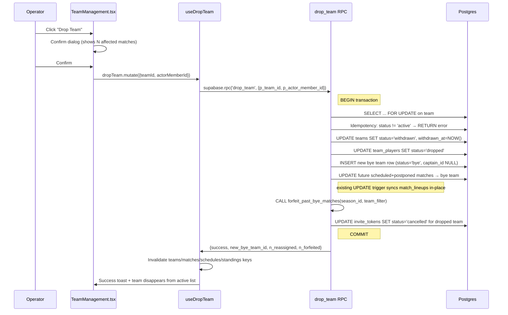

# Team Deletion Cascade Fix — Three-PR Implementation Plan

## Overview

Three sequential PRs eliminate the destructive `ON DELETE CASCADE` behavior on `matches.home_team_id`, `matches.away_team_id`, and `match_lineups.team_id`, then build a unified bye/withdrawn/replace workflow on top. PR 0 is independently shippable today as a minimal safety net; PR 1 turns byes into real team rows and adds eager forfeit writes; PR 2 adds the drop/replace operator workflow.

## Problem Frame

The matches table has `ON DELETE CASCADE` on both team FKs. Clicking "Delete Team" in `src/operator/TeamManagement.tsx` issues a raw `DELETE FROM teams` (an existing `deleteTeam` soft-delete helper at `src/api/mutations/teams.ts:261-274` is wired into `useTeamMutations.ts:143` and called from `src/dev/RLSTestPage.tsx`, but the production team-management UI bypasses it with the raw delete), which silently destroys all of that team's matches — and their `match_lineups` rows via a third cascading FK. Mid-season drops and originally-bye matches (currently represented as `home_team_id = NULL`) need a coherent data model so operators can drop teams and replace byes without losing historical truth or breaking standings.

See origin: `docs/brainstorms/team-deletion-cascade-fix-requirements.md`.

## Requirements Trace

The brainstorm defines R1–R23 across schema safety, bye-as-real-team, drop, replace, hard delete, display, read-time helpers, makeup override, operator UI, and captain/player communication. This plan satisfies all of them across three PRs:

- **PR 0:** R1, R1a, R1b, R12 (cascade safety net)
- **PR 1:** R2, R3, R3a, R3b, R4, R5, R13, R14, R15, R15a, R16
- **PR 2:** R6, R6a, R7, R8, R9, R10, R11, R15b, R17, R18, R19, R20, R21, R22, R23, R24

## Scope Boundaries

- Out: captain flake-flag feature (LIST_FOR_ED.md item #7, separate PR)
- Out: configurable bye points and auto-completion of bye matches (deferred from `memory-bank/plans/bye-team-enhancement-plan.md`)
- Out: cross-week swap support in the schedule editor (R18 accepts bye-vs-bye as an edge case)
- Out: dedicated bulk-makeup wizard (R17 uses existing schedule editor)
- Out: backfill of historical drops for the captain flake-flag

### Deferred to Separate Tasks

- Captain flake-flag write site inside `drop_team` RPC: separate PR landing item #7 from `LIST_FOR_ED.md`
- `memory-bank/plans/bye-team-enhancement-plan.md`'s configurable-bye-points / auto-complete sections: future work; mark superseded portions when PR 1 ships
- `LIST_FOR_ED.md` item #5 (refactor `TeamManagement.tsx` to <100 lines): out of scope here but PR 2's new hook (`useTeamLifecycle`) extracts logic so the file gets smaller, not larger

## Context & Research

### Relevant Code and Patterns

**FK swap + nullability + CHECK update precedents:**
- `supabase/migrations/20260422000014_invite_tokens_fk_set_null.sql` — bare `DROP CONSTRAINT` + `ADD CONSTRAINT` with new `ON DELETE` action. Mirror for R1.
- `supabase/migrations/20260422000006_invite_tokens_rejected_status.sql` — adding a value to a CHECK constraint. Mirror for R2.
- `supabase/migrations/20251213000000_sync_match_lineups_with_matches.sql:15` — `ALTER COLUMN ... DROP NOT NULL` precedent. Mirror for R3a.
- `supabase/migrations/20260420000000_relax_teams_roster_size_check.sql` — clean CHECK rebuild with `IF EXISTS`.

**RPC migration template:**
- `supabase/migrations/20260422000005_undo_merge_placeholder_rpc.sql` — full structure: `CREATE OR REPLACE FUNCTION`, `RETURNS TABLE(success BOOLEAN, ..., error_message TEXT)`, `LANGUAGE plpgsql SECURITY DEFINER`, `DECLARE`, validation gates with early `RETURN QUERY SELECT FALSE`, `BEGIN ... EXCEPTION` catch-all, `GRANT EXECUTE`, `COMMENT ON FUNCTION`. Mirror for `drop_team` (PR 2).
- `supabase/migrations/20260424000000_prep_match_rpc.sql` — simpler RPC returning `VOID` with `RAISE EXCEPTION`. Mirror for `convert_match_to_makeup`.
- `supabase/migrations/20251217144653_invite_tokens.sql:99-102` — `SELECT ... FOR UPDATE` row-lock idempotency pattern. Mirror for `drop_team` lock + status check.

**TanStack mutation/hook layering:**
- `src/api/mutations/teams.ts` — pure async functions; named-params interfaces; throw on error.
- `src/api/hooks/useTeamMutations.ts` — `useMutation` wrappers with `queryClient.invalidateQueries`.
- `src/api/queryKeys.ts` — canonical query-key factory; never use hardcoded strings.
- `src/api/mutations/conversations.ts:65-130` — RPC call pattern from the client.

**Test infrastructure:**
- `src/__tests__/database/teams.rls.test.ts` — RLS test pattern with `createTestClient`.
- `src/__tests__/database/placeholderLifecycle.db.test.ts` — RPC integration test pattern (BEGIN/ROLLBACK isolation, direct Postgres `Pool`). Mirror for `drop_team` and `convert_match_to_makeup` tests.
- `src/test/dbTestUtils.ts` — `getPostgresPool` and `createTestClient` helpers.

**Filter-default chokepoints:**
- `src/api/queries/teams.ts` — `getTeamsByLeague`, `getTeamsBySeason`, `getTeamDetails`, `getPlayerTeams`. Add `includeInactive?: boolean` parameter.

**UI surfaces:**
- `src/operator/TeamManagement.tsx:366` — `handleDeleteTeam`.
- `src/components/modals/DeleteLeagueModal.tsx:140-149` — bulk team delete relying on cascade.
- `src/components/TeamCard.tsx` — Edit/Delete buttons.
- `src/components/schedule/WeekEditorView.tsx`, `useWeekEditor.ts`, `TeamSelect.tsx` — schedule editor (R17).
- `src/player/TeamSchedule.tsx:322` — Score Match button bug guard.

### Institutional Learnings

- **No `docs/solutions/` post-mortem store.** Knowledge lives in `LIST_FOR_ED.md`, `memory-bank/`, prior-migration header comments.
- **Migration version-number collisions broke staging deploy** (commit `2cb2d7c`). Use distinct `_NNNNNN` sequence numbers per PR; verify uniqueness against `main` before merge.
- **RLS is globally disabled** (`RLS_ANALYSIS.md`, `disable_all_rls.sql`). Authorization lives at UI + Edge Function + query layer. Do not write new RLS policies for the bye-row INSERT.
- **Cache-invalidation gotcha** (`LIST_FOR_ED.md` #6, `memory-bank/API-HOOKS-USAGE.md`): mutations must invalidate every consumer's query key. Use the `queryKeys` factory at `src/api/queryKeys.ts`; never hardcoded strings.
- **Two parallel hook trees** (`@/hooks` vs `@/api/hooks`) silently bypass caching — verify imports.
- **`/database/` directive in `CLAUDE.md` is stale.** Actual practice is `supabase/migrations/`. Plan uses `supabase/migrations/` exclusively.
- **TABLE_OF_CONTENTS.md must be updated** when files are added/moved.
- **Repo does not use `NOT VALID` + `VALIDATE CONSTRAINT`** for FK swaps. Use bare DROP/ADD; `CASCADE → RESTRICT` is a tightening so existing rows can't violate it.
- **`@/api/hooks` is the canonical hook tree** for mutations + caching.

## Key Technical Decisions

- **Three PRs, not two.** PR 0 is a minimal safety net independently shippable today; the urgent fix is decoupled from the larger refactor.
- **All three FKs flip to RESTRICT in PR 0**, not just the two `matches` FKs. Flipping only `matches.*` leaves `match_lineups.team_id` as a silent data-loss path on raw `DELETE FROM teams`.
- **Bye uses `teams.status = 'bye'`**, not a separate `is_bye_team` boolean column. (Supersedes `memory-bank/plans/bye-team-enhancement-plan.md` Option A.)
- **`teams.captain_id` becomes nullable** rather than introducing a sentinel "system bye" member row. Less invasive — code that joins via `captain:members!captain_id(...)` must handle the null case (audit list in PR 1).
- **`team_players` for a dropped team get `status = 'dropped'`**, not DELETE. The existing `team_players_status_check` already supports this value. Preserves per-player `individual_wins`/`individual_losses` history.
- **Eager forfeit write (Path i) for past unplayed bye matches.** Triggers: (a) inside `drop_team` RPC for past-dated scheduled matches it absorbs, (b) operator-initiated "close past byes" action exposed on the team-management page or tied to existing week-completion flow. No automated cron in this work.
- **Drop and Replace are atomic Postgres RPCs** with `SELECT ... FOR UPDATE` row locks and idempotency checks. Mirror `undo_merge_placeholder_rpc.sql`.
- **`match_lineups` reassignment uses UPDATE-in-place via the existing `trigger_sync_match_lineups_on_update`.** When `matches.home_team_id` or `away_team_id` changes, the existing UPDATE trigger (defined at `supabase/migrations/20251213000000_sync_match_lineups_with_matches.sql:107`) automatically does `UPDATE match_lineups SET team_id = NEW.<side>_team_id WHERE id = NEW.<side>_lineup_id`. The RPC just UPDATEs `matches`; no separate DELETE/INSERT of lineup rows. **Note:** the `auto_create_match_lineups` trigger only fires on `INSERT ON matches` (verified at `supabase/migrations/20251130010824_baseline.sql:2832`), so DELETE-then-recreate would leave dangling `home_lineup_id`/`away_lineup_id` references on the matches row.
- **Filter at query layer**, not 17 sprinkled `.eq('status', 'active')` calls. Add `includeInactive?: boolean` to the four helpers in `src/api/queries/teams.ts` (default `false` for list helpers, `true` for `getTeamDetails`); audit and route inline `.from('teams')` call sites through these.
- **No new RLS policies.** The schedule generator's bye-row INSERT works without policy changes because RLS is globally disabled.
- **R10 enforcement is operator-trust + UI shape across BOTH the team-management page and the schedule editor.** Replace UI never offers a previously-withdrawn team's row as a re-target; it always creates a new row. The `WeekEditorView` team picker filters its dropdown options to `status IN ('active', 'bye')` only — never includes `'withdrawn'` rows — so the schedule editor cannot be used to recycle a withdrawn team's identity onto a fresh match. RPCs additionally enforce idempotency (drop_team refuses if status != 'active') as a backstop.
- **All three RPCs (`drop_team`, `convert_match_to_makeup`, `forfeit_past_bye_matches`) include an authorization gate as their first body step**, before any locks or state changes. Pattern: derive `v_actor_member_id` from `auth.uid()` via `members.user_id`, then verify membership in `organization_staff` for the target team's / match's / season's organization with `position IN ('owner', 'admin')`. Reject early with structured error or `RAISE EXCEPTION`. The `p_actor_member_id` parameter (where present) is cross-checked against the derived value to prevent impersonation. Mirror `can_write_house_rule_org()` helper at `supabase/migrations/20260419120000_house_rules.sql`. Without this gate, RLS-disabled means any authenticated user can call the RPCs against any team.
- **Pending invites (`invite_tokens`) for a dropped team are revoked** as part of `drop_team` (set `status = 'cancelled'`).

## Open Questions

### Resolved During Planning

- **Schedule generator: INSERT bye row at gen-time vs lazily** → INSERT at gen-time. Matches the "real team row" mental model.
- **NULL-bye backfill production audit** → Pre-flight `DO $$` block in the migration counts and reports affected rows before doing the work; abort on unexpected state.
- **`match_lineups` reassignment approach** → UPDATE-in-place via the existing `trigger_sync_match_lineups_on_update`. The drop / replace / makeup RPCs UPDATE `matches.home_team_id` / `away_team_id`; the trigger automatically updates the corresponding `match_lineups.team_id`. No DELETE-then-recreate. (The auto_create trigger only fires on INSERT, so DELETE-then-recreate would leave dangling lineup_id references.)
- **R11/R19/R20 UI logic location** → New hook `src/api/hooks/useTeamLifecycle.ts` containing branching logic; `TeamCard` and `TeamManagement.tsx` stay thin.
- **WeekEditorView `showByeOption`** → Replace boolean prop with a status-aware filter that includes `status IN ('active', 'bye')` only; **never includes `'withdrawn'` rows** (the primary R10 enforcement on the schedule-editor surface — withdrawn teams cannot be reassigned to any match here). Bye rows surface as named options (e.g., "BYE", "BYE — replaced Sharks wk 6").
- **`teams.captain_id` null audit** → Performed in PR 1 Unit 1.5; covers all `captain:members!captain_id(...)` joins and `team.captain_id` reads.
- **R10 enforcement mechanism** → Two-surface UI guard. (1) Replace UI never offers withdrawn rows as Replace targets — always creates a new active row. (2) Schedule editor team picker filters `status IN ('active', 'bye')` only — never includes withdrawn rows. (3) RPC idempotency check (drop_team refuses if status != 'active') is the backstop. No DB trigger.
- **FK migration `NOT VALID` + `VALIDATE`** → Skip. Repo precedent is bare DROP/ADD; `CASCADE → RESTRICT` is a tightening.
- **Pending invites on drop** → Revoke automatically inside `drop_team` RPC.
- **Eager-forfeit-write trigger** → Part of `drop_team` RPC for absorbed past-due matches; operator-initiated action for original-schedule byes.

### Deferred to Implementation

- **Exact `captain_id` audit list** — must be enumerated by grep during PR 1; estimated count is 10–15 sites based on `captain:members!captain_id` join references.
- **Standings query restructure for bye filtering** — R13 affects `src/api/queries/standings.ts`; exact filter placement (helper vs inline) decided when implementing.
- **WeekEditorView UI prop renaming** — Behavior fixed; exact component-API shape decided when implementing R17.
- **Migration version-number sequencing** — Each PR uses distinct `_NNNNNN` suffix at the day-of-merge date, not today's date, to avoid collisions with parallel work. Verify uniqueness against `main` before merging.

## High-Level Technical Design

> *This illustrates the intended approach and is directional guidance for review, not implementation specification. The implementing agent should treat it as context, not code to reproduce.*

**Team lifecycle states** (introduced by PR 1, exercised by PR 2):

```mermaid
stateDiagram-v2
    [*] --> active: createTeam (operator)
    [*] --> bye: schedule generation OR drop_team creates one
    active --> withdrawn: drop_team RPC
    bye --> abandoned: replace (Bye_v_v reassigns matches)
    withdrawn --> abandoned: drop_team completes
    abandoned --> [*]: row frozen (R10: never recycled)
    active --> [*]: hard delete (only if 0 matches; PR 0)
```

**Drop operation orchestration** (PR 2 — `drop_team` RPC):

## Implementation Units

---

### PR 0 — fix-team-cascade-deletion (minimal cascade safety net)

**Branch:** `fix-team-cascade-deletion`

**Goal:** Make the destructive cascade physically impossible and add a UI guard. Independently shippable.

- [ ] **Unit 0.1: Flip three FKs from CASCADE to RESTRICT**

**Goal:** Database refuses any team deletion that would orphan a match or its lineup rows.

**Requirements:** R1, R12

**Dependencies:** None

**Files:**
- Create: `supabase/migrations/<merge-date>NNNNNN_team_fks_cascade_to_restrict.sql`
- Test: `src/__tests__/database/teams.rls.test.ts` (update existing test at line 236)

**Approach:**
- Single migration with three `DROP CONSTRAINT` + `ADD CONSTRAINT` pairs for `matches_home_team_id_fkey`, `matches_away_team_id_fkey`, `match_lineups_team_id_fkey`. Bare DROP/ADD per repo precedent (no `NOT VALID`/`VALIDATE`).
- Migration header comment block explains: previous behavior (silent destruction), bug it caused, application-code semantics after the change (UI must Drop instead of Delete for teams with matches).
- `COMMENT ON CONSTRAINT` after each ADD documenting the new behavior.

**Patterns to follow:**
- `supabase/migrations/20260422000014_invite_tokens_fk_set_null.sql` — DROP/ADD shape and header style.

**Test scenarios:**
- Happy path: `DELETE FROM teams WHERE id = X` against a team with no matches succeeds.
- Error path: `DELETE FROM teams WHERE id = X` against a team with at least one `matches.home_team_id = X` row fails with FK violation.
- Error path: same against `matches.away_team_id = X`.
- Error path: same against `match_lineups.team_id = X` (i.e., a team that has lineup rows but no parent match references — synthesize this state in the test).

**Verification:**
- All three RLS test scenarios pass.
- Local schema diff shows only the three FK constraints changed.

---

- [ ] **Unit 0.2: UI guard in `handleDeleteTeam`**

**Goal:** Operator gets a clear error message instead of an FK violation when trying to delete a team with matches.

**Requirements:** R1a

**Dependencies:** Unit 0.1

**Files:**
- Modify: `src/operator/TeamManagement.tsx` (`handleDeleteTeam`, lines ~366–392)

**Approach:**
- Before issuing the `supabase.from('teams').delete()` call, query `matches` for any row where `home_team_id = teamId OR away_team_id = teamId`.
- If `count > 0`: show a `toast.error` explaining the team has N matches and the Drop workflow (PR 2) will be the right tool, then return early without calling delete.
- If `count = 0`: existing delete path proceeds (true delete works under RESTRICT because no matches reference the team).
- Update the existing confirmation dialog message to remove the cascade warning (it's no longer accurate; the cascade is gone).
- Remove the inline `⚠️ TODO` comments at the function level.

**Patterns to follow:**
- Existing pre-flight count queries in `src/operator/TeamManagement.tsx` (`getTeamsAtVenue` at line 420 is a similar count pattern).

**Test scenarios:**
- Happy path: clicking Delete on a team with no matches succeeds (existing behavior preserved).
- Error path: clicking Delete on a team with matches shows toast and does NOT issue the DELETE.

**Verification:**
- Manual operator-page test: a real team with matches cannot be deleted; toast explains why.
- Type check passes.

---

- [ ] **Unit 0.3: Update `DeleteLeagueModal` to delete child matches/lineups before teams**

**Goal:** League teardown still works under the new RESTRICT regime.

**Requirements:** R1b

**Dependencies:** Unit 0.1

**Files:**
- Modify: `src/components/modals/DeleteLeagueModal.tsx` (around line 140–149)

**Approach:**
- Before deleting teams, delete child rows in dependency order: `match_lineups` → `matches` → `team_players` → `teams` → `seasons`/`leagues`.
- Wrap in a try/catch that surfaces partial-failure messages.
- Existing modal pattern is hand-rolled; do not refactor to shadcn here (out of scope) — minimal change to preserve behavior.

**Patterns to follow:**
- Existing modal's delete sequencing.

**Test scenarios:**
- Happy path: deleting a league with active teams (and their matches/lineups) succeeds end-to-end without FK errors.
- Error path: simulated mid-delete failure (e.g., one league_venue row failing) leaves the rest intact and surfaces a coherent message.

**Verification:**
- Manual test: delete a small test league with 2 teams and 4 matches; all rows gone, no FK errors in console.

---

- [ ] **Unit 0.4: Update `teams.rls.test.ts` cascade test**

**Goal:** Existing test at line 236 currently expects cascade success. Replace with the new behavior.

**Requirements:** R1, R1a (verification)

**Dependencies:** Unit 0.1, Unit 0.2

**Files:**
- Modify: `src/__tests__/database/teams.rls.test.ts`

**Approach:**
- Split the existing "should allow deleting a team" test into two: "deletes a team with no matches" and "refuses to delete a team with matches".
- Add a third test asserting that deleting a team with `match_lineups` rows but no matches (constructed test fixture) also fails — to prove all three FKs are honored.

**Test scenarios:**
- See Approach above.

**Verification:**
- `pnpm test:run src/__tests__/database/teams.rls.test.ts` passes.

---

### PR 1 — bye-as-real-team (Piece 1)

**Branch:** `bye-as-real-team`

**Goal:** Bye matches use real `teams` rows. Schedule generator, filtering, and the eager forfeit write all assume real bye rows.

- [ ] **Unit 1.1: Schema migrations — status enum + `captain_id` nullable**

**Goal:** Database can hold bye rows.

**Requirements:** R2, R3a

**Dependencies:** PR 0 merged

**Files:**
- Create: `supabase/migrations/<merge-date>NNNNNN_teams_status_add_bye.sql`
- Create: `supabase/migrations/<merge-date>NNNNNN_teams_captain_id_nullable.sql`

**Approach:**
- Migration A: drop `teams_status_check`, recreate with `'active' | 'withdrawn' | 'forfeited' | 'bye'`. Header comment notes additive change, no data migration needed.
- Migration B: `ALTER TABLE teams ALTER COLUMN captain_id DROP NOT NULL`. Header comment notes bye rows justify nullable. `COMMENT ON COLUMN teams.captain_id` updated.

**Patterns to follow:**
- `supabase/migrations/20260422000006_invite_tokens_rejected_status.sql` for migration A.
- `supabase/migrations/20251213000000_sync_match_lineups_with_matches.sql:15` for migration B.

**Test scenarios:**
- Happy path: INSERT a `teams` row with `status = 'bye'` and `captain_id = NULL` succeeds.
- Edge case: INSERT with `status = 'invalid_value'` still fails (CHECK still works).
- Edge case: existing `(active|withdrawn|forfeited)` rows untouched.

**Verification:**
- Migrations apply cleanly to a fresh local DB.
- Schema dump diff shows only the two intended changes.

---

- [ ] **Unit 1.2: Schedule generator inserts real bye rows**

**Goal:** New schedules with odd team counts produce a real bye row instead of `'BYE'` → `null`.

**Requirements:** R3, R3b

**Dependencies:** Unit 1.1

**Files:**
- Modify: `src/utils/scheduleGenerator.ts` (lines ~167–179)
- Modify: `src/operator/ScheduleSetup.tsx` (BYE temporary-object creation, lines ~66–82)
- Test: `src/__tests__/database/byeTeam.db.test.ts` (new file)

**Approach:**
- In `ScheduleSetup.tsx`: when an odd team count is detected, INSERT a `teams` row with `status = 'bye'`, `captain_id = NULL`, `team_name = 'BYE'`, `roster_size` = league's roster size, no home venue. Use the returned UUID.
- In `scheduleGenerator.ts`: replace the `'BYE' → null` conversion with the real bye team UUID. Remove the TODO comment.
- Bye row creation is a single Supabase insert; the schedule generator runs client-side (RLS is disabled, so this works).

**Patterns to follow:**
- Existing team-create patterns in `src/api/mutations/teams.ts`.

**Test scenarios:**
- Happy path: generating a schedule for 7 teams produces 8 active teams + 1 bye team in the DB.
- Happy path: every match references real team UUIDs, no NULL team_ids.
- Edge case: even team count produces no bye row.

**Verification:**
- New DB test passes.
- Manual: create a season with odd team count; verify a bye team row appears in the DB.

---

- [ ] **Unit 1.3: NULL-bye backfill migration**

**Goal:** Existing `matches` rows with `home_team_id = NULL` or `away_team_id = NULL` point at real bye rows.

**Requirements:** R4

**Dependencies:** Unit 1.1, Unit 1.2

**Files:**
- Create: `supabase/migrations/<merge-date>NNNNNN_backfill_null_bye_matches.sql`

**Approach:**
- Pre-flight `DO $$` block: count matches with NULL team_ids, group by `season_id`, RAISE NOTICE with totals. Enumerate explicit abort conditions (RAISE EXCEPTION):
  - Matches with both `home_team_id IS NULL AND away_team_id IS NULL` (would produce bye-vs-bye debris)
  - Matches with `season_id IS NULL` (no season to associate a bye row with)
  - Seasons where `league_id` resolves to a deleted league or yields a NULL `roster_size`
  - Orphan `match_lineups.team_id = NULL` rows whose `match_id` doesn't exist
- CTE-based INSERT: one bye row per affected `season_id` (use `team_name = 'BYE'`, roster_size from the season's league).
- UPDATE matches: set `home_team_id` / `away_team_id` from NULL to the appropriate season's bye-row UUID. The existing `trigger_sync_match_lineups_on_update` (defined at `supabase/migrations/20251213000000_sync_match_lineups_with_matches.sql:107`) automatically updates the corresponding `match_lineups.team_id` from NULL to the bye row's UUID. **No separate match_lineups DDL needed.**
- RAISE NOTICE summary at end with counts.
- Wrap entire migration in an explicit `BEGIN; ... COMMIT;` so partial failure rolls back deterministically (Supabase migration runner does not always wrap migrations in a transaction by default).

**Patterns to follow:**
- `supabase/migrations/20260422000003_add_match_lineups_player_fk.sql` — `DO $$` orphan check.
- `supabase/migrations/20260415000000_seed_apa_2026.sql` — CTE-based seed pattern.

**Test scenarios:**
- Happy path: against a fresh DB seeded with a few NULL-bye matches across 2 seasons, migration creates 2 bye rows and zero NULL team_ids remain.
- Edge case: against a DB with no NULL-bye matches, migration is a no-op (RAISE NOTICE "0 affected").
- Error path: simulated orphan `match_lineups.team_id = NULL` with no parent match → migration aborts before touching data.

**Verification:**
- Migration runs against staging clone (or representative seed data) without errors.
- After migration, `SELECT COUNT(*) FROM matches WHERE home_team_id IS NULL OR away_team_id IS NULL` returns 0.

---

- [ ] **Unit 1.4: Filter helpers — `getTeamsBy*` opt-in for inactive**

**Goal:** Active-only is the default at the query layer; bye/withdrawn rows surface only on explicit opt-in.

**Requirements:** R13

**Dependencies:** Unit 1.1

**Files:**
- Modify: `src/api/queries/teams.ts` (`getTeamsByLeague`, `getTeamsBySeason`, `getTeamDetails`, `getPlayerTeams`)

**Approach:**
- Add `includeInactive?: boolean` to each helper. Default `false` for list helpers; default `true` for `getTeamDetails` (single-team fetch usually wants the team regardless of status).
- When `includeInactive !== true`, append `.eq('status', 'active')` to the query.
- Update JSDoc to describe the parameter.

**Patterns to follow:**
- Existing helper signatures in the same file.

**Test scenarios:**
- Happy path: `getTeamsBySeason(seasonId)` returns only `status='active'` teams when a bye row exists in that season.
- Happy path: `getTeamsBySeason(seasonId, { includeInactive: true })` returns active + bye + withdrawn rows.
- Edge case: `getTeamDetails(byeTeamId)` returns the row by default (single-team fetch).

**Verification:**
- Existing standings/schedule pages render correctly without bye rows in active lists.
- `pnpm run typecheck` passes.

---

- [ ] **Unit 1.5: Filter audit — route inline `.from('teams')` calls through helpers**

**Goal:** No more long-tail "every new component must remember to filter."

**Requirements:** R13, R3a (captain_id-null audit)

**Dependencies:** Unit 1.4

**Files:**
- Modify (route through `getTeamsBy*`):
  - `src/operator/TeamManagement.tsx`
  - `src/wizards/league-v2/useFlowStageDetection.ts`
  - `src/components/operator/LeagueOverviewCard.tsx`
  - `src/components/operator/LeagueStatusCard.tsx`
  - `src/wizards/matchups-v2/steps/PositionsStep.tsx`
  - `src/api/hooks/useOrganizationInvites.ts`
  - `src/api/queries/players.ts`
  - `src/api/queries/standings.ts` (filter bye rows from rankings)
  - `src/api/queries/leagues.ts`
  - `src/utils/playoffGenerator.ts`
  - `src/utils/teamQueries.ts`, `src/utils/playerQueries.ts` (legacy — confirm migration status)
- Modify (handle `team.captain_id = NULL`):
  - All sites currently joining `captain:members!captain_id(...)` — enumerate via `grep -r "captain:members" src`
  - All sites reading `team.captain_id` directly — enumerate via `grep -rn "\.captain_id" src`
  - Bye rows have `captain_id = NULL`; UI should render "—" or hide the captain field

**Approach:**
- For each filter site: replace inline `.from('teams').select(...)` with a `getTeamsBy*` call.
- For each captain_id site: add a null guard.
- Special case: `src/components/MatchCard.tsx`, `src/components/schedule/MatchCard.tsx`, `src/components/lineup/MatchInfoCard.tsx` already do `if (!opponent)` checks — change to `if (!opponent || opponent.status !== 'active')`.
- `src/player/TeamSchedule.tsx:322` — covered by Unit 1.6.

**Patterns to follow:**
- The four filter helpers from Unit 1.4.

**Test scenarios:**
- Edge case: standings page renders with one bye team in the season and shows only active teams.
- Edge case: captain dropdown in the team editor does not show bye rows.
- Edge case: a bye row's `captain` reference renders gracefully (no JS error, no "undefined").

**Verification:**
- Grep for `\.from\('teams'\)` shows only call sites that legitimately need direct access (mutations, helpers).
- `pnpm run typecheck` passes.
- Manual: navigate to standings, schedule, team-management, league overview pages on a season with a bye row — no bye rows in active lists, no errors.

---

- [ ] **Unit 1.6: Score Match button bug fix + bye match display**

**Goal:** Players can't click into a bye-week match's lineup page; "vs BYE" displays consistently.

**Requirements:** R5, R14

**Dependencies:** Unit 1.5

**Files:**
- Modify: `src/player/TeamSchedule.tsx` (line 322 TODO, opponent rendering)
- Modify: `src/components/schedule/MatchCard.tsx`, `src/components/MatchCard.tsx`, `src/components/lineup/MatchInfoCard.tsx`

**Approach:**
- Replace `if (!opponent)` checks with `if (!opponent || opponent.status === 'bye' || opponent.status === 'withdrawn')`.
- Score Match button: hidden when opponent is non-active.
- Match display label: "vs BYE" when opponent.status === 'bye' or 'withdrawn'; show team_name otherwise.
- R14: hide past-dated matches with non-active opponents from the schedule view (filter in the page-level query or the rendering loop).

**Test scenarios:**
- Happy path: future bye match shows "vs BYE", no Score Match button.
- Happy path: past bye match (date passed) is hidden from the schedule list.
- Happy path: past completed match against a now-withdrawn team still shows the original team name (because it's `status='completed'`, not `'scheduled'`).

**Verification:**
- Manual: load a player's schedule with a future bye and a past bye; confirm correct rendering.

---

- [ ] **Unit 1.7: Eager-forfeit-write helper** — **MOVED TO PR 2** (originally placed in PR 1; document review surfaced that the helper has no caller until PR 2 ships, so PR 1's success criterion was unachievable in isolation. Numbering preserved for cross-reference stability.)

**Goal:** A reusable helper that flips a past-due `'scheduled'` match against a non-active opponent to `'completed'` with proper winner/points/games (so the standings query at `src/api/queries/standings.ts:60` picks it up).

**Ships in:** PR 2 (alongside Unit 2.2 `drop_team` and Unit 2.8 "Close Past Byes" button — its only callers).

**Requirements:** R15, R15a, R16

**Dependencies:** PR 1 merged (status enum + nullable captain_id), so the bye rows the helper finds actually exist as real teams.

**Files:**
- Create: `supabase/migrations/<merge-date>NNNNNN_forfeit_past_bye_matches_function.sql` (Postgres helper function `forfeit_past_bye_matches(p_season_id UUID)`)
- Create: `src/api/mutations/matches.ts` if not present, or add to existing — `forfeitPastByeMatches(seasonId: string)` wrapping the RPC
- Test: `src/__tests__/database/forfeitPastByeMatches.db.test.ts`

**Approach:**
- Postgres function: `forfeit_past_bye_matches(p_season_id UUID, p_team_filter UUID DEFAULT NULL)`.
- **Authorization gate (FIRST step):** derive `v_actor_member_id` from `auth.uid()`; verify org_staff membership for the season's organization (`seasons → leagues → organization_id`). `RAISE EXCEPTION` if not authorized. Mirror `can_write_house_rule_org()` helper. (When called from `drop_team` which has its own gate, the second check is redundant but defensive — both functions can be called independently.)
- Scans `matches` joined with `season_weeks` for past-dated `status = 'scheduled'` matches where exactly one of `home_team_id` / `away_team_id` references a team with `status IN ('bye', 'withdrawn')` (the active-opponent check). When `p_team_filter` is NOT NULL, additionally restricts to matches where the dropped team's `id = p_team_filter` was the original side (drop-scoped). When NULL, processes all such matches in the season (operator-initiated sweep).
- **Forfeit-write semantics (resolves the standings-credit gap surfaced in review):** writes `status = 'completed'` (not `'forfeited'`), sets `winner_team_id = <active opponent's team_id>`, and writes the `home_points_earned` / `away_points_earned` values consistent with the league's existing forfeit handling. Standings query at `src/api/queries/standings.ts:60` filters by `status = 'completed'`, so this is the path that gets the active opponent credited correctly. The choice of `'completed'` over `'forfeited'` matches the existing forfeit-recording convention in match scoring (search code for `status = 'forfeited'` to confirm; if it sets `'completed'` after the forfeit is verified, mirror that pattern).
- **Forfeit point/game value source:** point values come from `leagues.forfeit_points` if such a column exists, OR from a hardcoded constant pair (e.g., 0 for the forfeiter, full match-points for the active opponent — exact constants confirmed during implementation by reading existing forfeit-record code). Add a deferred-to-implementation note: if no league-level config column exists, this PR may need to add `leagues.forfeit_points` and `leagues.forfeit_games` columns to a migration in PR 1.
- Bye-vs-bye matches (both sides non-active) are skipped (R15a).
- Function returns row count of matches forfeited.
- Idempotent: running twice on the same season is a no-op the second time (matches already `'completed'` aren't re-touched).
- **Caller wiring:** PR 2's `drop_team` calls this helper with `p_team_filter = <dropped team id>` so it only forfeits the matches it just reassigned. Unit 2.8's "Close Past Byes" button calls it with `p_team_filter = NULL` for the season-wide sweep.

**Patterns to follow:**
- `supabase/migrations/20260424000000_prep_match_rpc.sql` — RPC that returns VOID with RAISE-on-error.
- The repo's existing forfeit-recording behavior in match scoring (search `status = 'forfeited'`).

**Test scenarios:**
- Happy path: a past-due scheduled match between active Team A and bye row → after running, status is 'forfeited' and Team A has the standard forfeit win in their record.
- Edge case: future bye match → not touched.
- Edge case: bye-vs-bye past-due match → not touched (no one credited).
- Edge case: past-due completed match → not touched (already has a real result).
- Idempotency: second invocation produces no further changes.

**Verification:**
- DB integration test passes.
- Standings query against a season with one forfeited bye match shows the active opponent with the expected forfeit win + points.

---

- [ ] **Unit 1.8: Mark superseded plan + update memory**

**Goal:** Future engineer doesn't implement the rejected `is_bye_team` boolean column from the old plan.

**Requirements:** Documentation hygiene

**Dependencies:** Unit 1.1–1.7 merged

**Files:**
- Modify: `memory-bank/plans/bye-team-enhancement-plan.md` (add SUPERSEDED banner at top)
- Modify: `memory-bank/activeContext.md` (remove cascade warning callout)
- Modify: `LIST_FOR_ED.md` (move item #1 cascade-bug to "Resolved" section or strike through)
- Modify: `TABLE_OF_CONTENTS.md` (add new files)

**Approach:**
- Add a banner to the old plan: "SUPERSEDED by `docs/brainstorms/team-deletion-cascade-fix-requirements.md` and `docs/plans/2026-04-29-001-fix-team-cascade-deletion-plan.md`. Configurable bye points and auto-completion remain future work."
- Cascade warning at the top of `activeContext.md` is no longer applicable post-PR 0; remove or relocate to a historical section.

**Test scenarios:**
- Test expectation: none — documentation only.

**Verification:**
- Files updated, manual review.

---

### PR 2 — team-drop-replace-workflow (Piece 2)

**Branch:** `team-drop-replace-workflow`

**Goal:** Operator can drop teams safely and replace bye/withdrawn slots with new teams. Captains and players see appropriate context.

- [ ] **Unit 2.1: Schema — `teams.withdrawn_at` column + bye name convention**

**Goal:** Persistent audit field for drop date; bye name format supports drop-attribution.

**Requirements:** R3b, R22

**Dependencies:** PR 1 merged

**Files:**
- Create: `supabase/migrations/<merge-date>NNNNNN_teams_add_withdrawn_at.sql`

**Approach:**
- `ALTER TABLE teams ADD COLUMN withdrawn_at timestamptz NULL`.
- `COMMENT ON COLUMN teams.withdrawn_at` describing semantics ("Set by `drop_team` RPC; NULL for active or original-bye teams").
- No data migration needed (column is nullable).
- Bye name convention enforced in `drop_team` RPC (Unit 2.2), not at the schema level — names like `'BYE — replaced Sharks wk 6'` are computed per drop.

**Test scenarios:**
- Happy path: column accepts timestamps and NULL.

**Verification:**
- Migration applies cleanly.

---

- [ ] **Unit 2.2: `drop_team` RPC**

**Goal:** Atomic, idempotent operator action that withdraws a team, clears its roster, creates a bye, reassigns scheduled matches, forfeits past-due matches, and revokes pending invites.

**Requirements:** R6, R6a, R7, R8, R10, R22

**Dependencies:** Unit 2.1; Unit 1.7 (now first unit shipped in PR 2 — `forfeit_past_bye_matches` helper); PR 1 merged (status enum + nullable captain_id)

**Files:**
- Create: `supabase/migrations/<merge-date>NNNNNN_drop_team_rpc.sql`
- Test: `src/__tests__/database/teamDropReplace.db.test.ts`

**Approach:**
- `CREATE OR REPLACE FUNCTION drop_team(p_team_id UUID, p_actor_member_id UUID) RETURNS TABLE(success BOOLEAN, new_bye_team_id UUID, matches_reassigned INT, matches_forfeited INT, error_message TEXT)`.
- `LANGUAGE plpgsql SECURITY DEFINER`.
- Header comment block (per `undo_merge_placeholder_rpc.sql` pattern): purpose, authz, transaction guarantee ("all-or-nothing"), idempotency contract, references to plan.
- Body steps:
  0. **Authorization gate (FIRST step, before any locks or state reads):** derive `v_actor_member_id` from `auth.uid()` via `(SELECT id FROM members WHERE user_id = auth.uid())`; reject if NULL. Verify `p_actor_member_id = v_actor_member_id` (rejects impersonation). Verify membership in `organization_staff` (position `'owner'` or `'admin'`) for the team's organization (`teams → leagues → organization_id`). Reject with `(false, null, 0, 0, 'Not authorized to drop this team')` if any check fails. Mirror `can_write_house_rule_org()` helper.
  1. `SELECT * FROM teams WHERE id = p_team_id FOR UPDATE` (row lock).
  2. Idempotency: if status != 'active' → return `(false, null, 0, 0, 'Team already withdrawn or not active')`.
  3. UPDATE the team: `status = 'withdrawn'`, `withdrawn_at = NOW()`.
  4. UPDATE `team_players` for the team: `status = 'dropped'`.
  5. INSERT new bye team row: `status = 'bye'`, `captain_id = NULL`, `team_name = 'BYE — replaced ' || v_old_name || ' wk ' || v_current_week_number`, same `season_id`/`league_id`/`roster_size`. `v_current_week_number` = the season-week number derived from the current date or the next upcoming `season_weeks` row (decided during implementation; favor the operator-action date for clarity).
  6. UPDATE `matches` where `home_team_id = p_team_id AND status IN ('scheduled', 'postponed')`: set `home_team_id = v_new_bye_id`. Same for `away_team_id`. The existing `trigger_sync_match_lineups_on_update` (`supabase/migrations/20251213000000_sync_match_lineups_with_matches.sql:107`) automatically propagates the team_id change to the corresponding `match_lineups` rows in-place. Capture row counts.
  7. CALL `forfeit_past_bye_matches(v_season_id, p_team_id)` (drop-scoped — the helper accepts an optional team_id filter to forfeit only the matches just reassigned by this drop, not all season-wide past byes).
  8. UPDATE `invite_tokens` for the dropped team: `status = 'cancelled'`.
- Wrap body in `BEGIN ... EXCEPTION WHEN OTHERS THEN RETURN QUERY SELECT FALSE, ...` catch-all.
- `GRANT EXECUTE ON FUNCTION drop_team(UUID, UUID) TO authenticated`.
- `COMMENT ON FUNCTION drop_team` summarizing.

**Execution note:** Test-first. Drop flow is high-risk (irreversible production data shape changes); write the integration tests before the SQL.

**Patterns to follow:**
- `supabase/migrations/20260422000005_undo_merge_placeholder_rpc.sql` — full structure.
- `supabase/migrations/20251217144653_invite_tokens.sql:99-102` — `FOR UPDATE` pattern.

**Test scenarios:**
- Happy path: drop an active team with 6 played + 4 future scheduled matches → status flips to withdrawn, 4 matches reassigned to new bye, past-due ones (if any) forfeited, roster cleared, invites cancelled.
- Idempotency: dropping an already-withdrawn team returns `success=false` with explanatory message.
- Edge case (concurrency): two parallel `drop_team` calls on the same team → one succeeds, one returns idempotency error.
- Edge case: drop a team with zero matches → still marks withdrawn but reassigns 0 matches.
- Edge case: drop a team with only completed matches → no reassignment, just status flip + roster clear.
- Integration: after drop, `getTeamsBySeason(seasonId)` does not return the dropped team or the new bye row (both filtered).

**Verification:**
- All test scenarios pass.
- Rolling back the test transaction returns DB to original state (BEGIN/ROLLBACK isolation per `placeholderLifecycle.db.test.ts`).

---

- [ ] **Unit 2.3: `convert_match_to_makeup` RPC**

**Goal:** Single-match operator action that reassigns a past-bye/forfeited match to a real team and resets state for play.

**Requirements:** R15b, R17

**Dependencies:** Unit 2.1

**Files:**
- Create: `supabase/migrations/<merge-date>NNNNNN_convert_match_to_makeup_rpc.sql`
- Test: `src/__tests__/database/convertMatchToMakeup.db.test.ts`

**Approach:**
- `CREATE OR REPLACE FUNCTION convert_match_to_makeup(p_match_id UUID, p_new_team_id UUID, p_side TEXT)` where `p_side IN ('home', 'away')`. `RETURNS VOID`.
- **Authorization gate (FIRST step):** derive `v_actor_member_id` from `auth.uid()`; verify org_staff membership for the match's organization (`matches → seasons → leagues → organization_id`). `RAISE EXCEPTION` if not authorized. Mirror `can_write_house_rule_org()` helper.
- Validates: match exists; **match's current `status` is one of `'forfeited'` or `'scheduled'`** (rejects `'completed'`, `'awaiting_verification'`, `'in_progress'` to prevent wiping a real result); current side's team has `status IN ('bye', 'withdrawn')`; new team has `status = 'active'`; new team is in the same season; **no `match_games` rows exist with non-NULL scores for this match** (defense-in-depth against the prior status check passing on a half-played match).
- Updates: side's `team_id` from old to new; resets `status` to `'scheduled'`; clears `home_points_earned` / `away_points_earned` / `home_team_score` / `away_team_score` / `winner_team_id`.
- The existing `trigger_sync_match_lineups_on_update` propagates the team_id change to `match_lineups` automatically. No DELETE needed.
- `RAISE EXCEPTION` on validation failures.
- `GRANT EXECUTE TO authenticated` (subject to the authorization-gap finding — see Open Questions / Resolve Before Implementation).

**Execution note:** Test-first.

**Patterns to follow:**
- `supabase/migrations/20260424000000_prep_match_rpc.sql` — VOID-returning RPC with RAISE.

**Test scenarios:**
- Happy path: convert a `'forfeited'` past bye match to scheduled with new active team → status='scheduled', points cleared, lineup recreated.
- Error path: target team has `status = 'bye'` → RAISE.
- Error path: match's current side has `status = 'active'` (not bye/withdrawn) → RAISE.
- Error path: target team is in a different season → RAISE.

**Verification:**
- Integration tests pass.

---

- [ ] **Unit 2.4: Mutation + hook layer for drop, replace, makeup**

**Goal:** TanStack mutation/hook pair for each new operation.

**Requirements:** R6, R9, R15b, R17

**Dependencies:** Units 2.2, 2.3

**Files:**
- Modify: `src/api/mutations/teams.ts` — add `dropTeam(params: DropTeamParams)`, `replaceTeam(params: ReplaceTeamParams)`. The existing `deleteTeam` soft-delete helper at lines 261–274 is wired into `useDeleteTeam` and called from `src/dev/RLSTestPage.tsx`. Either: (a) leave it in place with a `@deprecated` JSDoc note pointing to `dropTeam`, or (b) update `RLSTestPage.tsx` to call `dropTeam` instead and remove the helper. Decision deferred to implementation.
- Modify: `src/api/mutations/matches.ts` — add `convertMatchToMakeup(params: ConvertMatchToMakeupParams)`.
- Modify: `src/api/hooks/useTeamMutations.ts` — add `useDropTeam`, `useReplaceTeam`.
- Modify: `src/api/hooks/useMatchMutations.ts` — add `useConvertMatchToMakeup`.

**Approach:**
- Each mutation function: thin wrapper around `supabase.rpc(...)` returning the structured response; throws on `success === false` with `error_message`.
- `replaceTeam`: orchestration — call `createTeam` to create the new active row, then UPDATE matches to reassign from old bye to new team (this is a multi-step client-side transaction; consider promoting to its own RPC later if races become a concern, but at v1 the LO won't race themselves).
- Each hook: `useMutation` wrapper with `onSuccess` invalidating `queryKeys.teams.all`, `queryKeys.matches.all` (or `.detail(matchId)` for the match RPC), `queryKeys.schedules.bySeason(seasonId)`, `queryKeys.stats.standings(seasonId)`, `queryKeys.stats.teamStats(seasonId)`.
- Use `queryKeys` factory exclusively; never hardcoded strings.

**Patterns to follow:**
- Existing `useDeleteTeam` / `useUpdateTeam` shape in `src/api/hooks/useTeamMutations.ts`.
- Existing RPC call shape in `src/api/mutations/conversations.ts`.

**Test scenarios:**
- Test expectation: thin layer over the DB-tested RPCs; type-level tests are sufficient. Manual verification through the UI in subsequent units.

**Verification:**
- `pnpm run typecheck` passes.
- Hooks integrate with `useMutation` correctly (no cache shape errors).

---

- [ ] **Unit 2.5: `useTeamLifecycle` hook + branched delete UI**

**Goal:** Operator UI offers Delete vs Drop based on team state; logic lives in a reusable hook so `TeamManagement.tsx` doesn't grow.

**Requirements:** R11, R19

**Dependencies:** Unit 2.4

**Files:**
- Create: `src/api/hooks/useTeamLifecycle.ts` (~80 lines)
- Modify: `src/components/TeamCard.tsx` — replace single Delete button with a button whose label/handler depends on the lifecycle state from the hook
- Modify: `src/operator/TeamManagement.tsx` — replace `handleDeleteTeam` with `useTeamLifecycle` invocation; remove the inline `supabase.from('teams').delete()` call

**Approach:**
- `useTeamLifecycle(team)` returns `{ action: 'delete' | 'drop' | 'restricted', execute, isLoading, error, matchCount }`.
- `action` derived by counting matches per state, evaluated in this exact priority order (first match wins):
  1. **Any `'in_progress'` match exists** → `'restricted'` (live scoring is active; refuse drop until match completes). Tooltip explains.
  2. 0 matches in any state → `'delete'`.
  3. All matches are `'scheduled'` or `'postponed'` (no results-bearing) → `'drop'`.
  4. At least one results-bearing match (`'completed'`, `'awaiting_verification'`, `'forfeited'`) and no `'in_progress'` → `'drop'` (drop preserves history; hard delete not offered).
- This priority ordering resolves the ambiguity that surfaced in review for cases like "1 in_progress + 5 scheduled + 3 completed" — the `'in_progress'` rule (priority 1) overrides everything else. An LO must wait for the live match to complete before dropping the team.
- `TeamCard` renders the button label based on `action`.
- Confirmation dialog uses `useConfirmDialog` (already in `TeamManagement.tsx`); message is parameterized with `matchCount`.

**Patterns to follow:**
- Existing `useTeamMutations` shape.
- `useConfirmDialog` usage.

**Test scenarios:**
- Happy path: TeamCard for a 0-match team shows "Delete Team", click executes hard delete.
- Happy path: TeamCard for a team with scheduled matches shows "Drop Team", confirmation mentions match count, click executes RPC.
- Edge case: TeamCard for a team with only completed matches shows "Drop Team" (history preserved on drop).
- Error path: drop_team RPC fails (e.g., already withdrawn) → error toast.

**Verification:**
- Manual: test all three action paths against fixture data.
- `pnpm run typecheck`.

---

- [ ] **Unit 2.6: Replace UI surface**

**Goal:** Operator can replace a bye row (original or drop-created) with a new active team.

**Requirements:** R9, R20, R21

**Dependencies:** Unit 2.4

**Files:**
- Modify: `src/operator/TeamManagement.tsx` — add an "Inactive Slots" collapsed section listing bye + withdrawn rows for the season, each with a "Replace" button
- Modify: `src/operator/TeamEditorModal.tsx` (existing) or create `src/operator/ReplaceTeamModal.tsx` — operator picks captain, names team, fills roster (or schedules later)
- Possibly modify: `src/components/TeamCard.tsx` to render a slim "bye/withdrawn" variant for the inactive section

**Approach:**
- The "Inactive Slots" section uses `getTeamsBySeason(seasonId, { includeInactive: true })` and filters to `status IN ('bye', 'withdrawn')` client-side.
- Each row shows the team name (e.g., "BYE", "BYE — replaced Sharks wk 6", "Sharks (withdrawn)") and a Replace button.
- Replace button opens a modal that creates a new active team row (existing `TeamEditorModal` flow) and on success calls `useReplaceTeam` to reassign matches.

**Patterns to follow:**
- Existing `TeamEditorModal` for team-creation UX.
- shadcn `Dialog` / `Card` components per CLAUDE.md.

**Test scenarios:**
- Happy path: replace a bye row → new active team appears in active list, bye row disappears from inactive list (its matches are gone, but the row is still there in DB; UI shows it only if it has matches).
- Edge case: try to replace a row that has no remaining scheduled/postponed matches → modal shows informational message ("This bye has no remaining matches; nothing to replace").
- Edge case: race — two operators try to replace the same bye → second one sees an error/empty state.

**Verification:**
- Manual: full flow on test data.

---

- [ ] **Unit 2.7: Captain/player communication touches**

**Goal:** Captains and players viewing a "vs BYE" match can tell whether it was an original schedule bye or a mid-season replacement.

**Requirements:** R23

**Dependencies:** Unit 2.2 (which sets the bye name)

**Files:**
- Modify: `src/player/TeamSchedule.tsx`, `src/components/MatchCard.tsx`, `src/components/schedule/MatchCard.tsx`, `src/components/lineup/MatchInfoCard.tsx` — when opponent is a bye row whose name starts with `'BYE — replaced'`, show the full descriptive name instead of just "BYE"

**Approach:**
- The bye row's `team_name` already encodes the attribution (set by `drop_team` RPC, Unit 2.2). UI just renders it.
- Optionally show a small info icon with hover/tap-to-reveal explanation: "This team dropped on <withdrawn_at date>." Sourced from the dropped team's `withdrawn_at` (look up via the bye's name reference, or join through season).

**Test scenarios:**
- Happy path: original schedule bye displays as "vs BYE".
- Happy path: drop-created bye displays as "vs BYE — replaced Sharks wk 6".

**Verification:**
- Manual: schedule view on a season with both an original bye and a drop-created bye.

---

- [ ] **Unit 2.8: Operator-initiated "close past byes" action**

**Goal:** LO can sweep up original-schedule byes that have aged past their date without being made up.

**Requirements:** R15

**Dependencies:** Unit 1.7's `forfeit_past_bye_matches` helper

**Files:**
- Modify: `src/operator/TeamManagement.tsx` (or wherever season-management lives) — add a button "Close Past Byes" that calls the `forfeit_past_bye_matches` RPC

**Approach:**
- Button shows in the season's team-management view; calls the RPC for the current `season_id`.
- Confirmation dialog explains what will happen ("N past bye matches will be marked as forfeit wins for opponents").
- Pre-call query counts affected matches to populate the dialog.
- After execution, toast with count.

**Test scenarios:**
- Happy path: button on a season with 3 past-due unmade-up bye matches → all 3 forfeit, opponents credited.
- Edge case: button on a season with 0 affected matches → toast "Nothing to do."

**Verification:**
- Manual.

---

- [ ] **Unit 2.10: Multi-bye warning banner**

**Goal:** When a season has 2+ bye teams (from drops, or original-schedule + drops), the operator sees a non-blocking notice prompting them to consolidate so byes play each other and real teams play every week.

**Requirements:** R24

**Dependencies:** Unit 1.4 (`getTeamsBySeason` with `includeInactive: true`)

**Files:**
- Modify: `src/operator/TeamManagement.tsx` — add banner near the top of the page when the season has 2+ bye teams
- Optional: `src/components/operator/MultiByeWarning.tsx` (~30 lines) if the banner has any complexity worth extracting

**Approach:**
- Query bye teams for the season: `getTeamsBySeason(seasonId, { includeInactive: true }).filter(t => t.status === 'bye')`
- Show banner only when `byeCount >= 2`
- Copy: "This season has N bye teams. You can edit the schedule so byes play each other for the remaining weeks, freeing real teams to play every week."
- Primary action: link to the schedule editor (existing `WeekEditorView` flow).
- Dismissable for the session (sessionStorage flag); reappears on next page load until count drops to ≤1.
- Use shadcn `Alert` from `@/components/ui/alert` (per CLAUDE.md shadcn-only convention).

**Patterns to follow:**
- Existing notice patterns in `TeamManagement.tsx` (e.g., the "Maximum teams reached" warning).
- shadcn `Alert` component.

**Test scenarios:**
- Happy path: season with 0 byes → banner hidden.
- Happy path: season with 1 bye (original odd-team-count) → banner hidden.
- Happy path: season with 2+ byes → banner visible with correct count.
- Edge case: dismissing the banner hides it for the session but reappears on page reload.
- Edge case: replacing one of the byes drops count to 1 → banner disappears on next render.

**Verification:**
- Manual: drop two teams in a test season; banner appears with "This season has 2 bye teams."
- Manual: replace one bye via Inactive Slots; banner disappears.

---

- [ ] **Unit 2.9: Update `LIST_FOR_ED.md` and TABLE_OF_CONTENTS**

**Goal:** Documentation hygiene.

**Files:**
- Modify: `LIST_FOR_ED.md` — strike through item #1 / move to a Resolved section
- Modify: `TABLE_OF_CONTENTS.md` — add new files
- Modify: `memory-bank/activeContext.md` — final cleanup of cascade-related warnings

**Test scenarios:**
- Test expectation: none — documentation only.

---

## System-Wide Impact

- **Interaction graph:** PR 0's FK flip silently changes behavior for any code path that issues raw `DELETE FROM teams`. Audited: only `handleDeleteTeam` (PR 0 Unit 0.2) and `DeleteLeagueModal` (Unit 0.3). The existing `deleteTeam` soft-delete helper (`src/api/mutations/teams.ts:261-274`) is wired into `useDeleteTeam` and called from `src/dev/RLSTestPage.tsx` — Unit 2.4 either deprecates it or migrates the test page to `dropTeam`.
- **Error propagation:** RPC structured-return pattern surfaces failures as `(success: false, error_message: ...)`. Hooks throw on `success === false`; `useMutation`'s `onError` lands in toast handlers per existing convention.
- **State lifecycle risks:** `match_lineups` reassignment uses the existing UPDATE trigger for in-place team_id changes; lineup state (`lineup_locked`, player slots) survives the transition. Drop RPC is wrapped in a single transaction so partial failures roll back. Empty/locked lineup edge cases for newly-reassigned matches handled by existing scoring-page logic.
- **API surface parity:** Filter helpers extended in PR 1 cover the chokepoint; ad-hoc `.from('teams')` call sites audited in Unit 1.5. Verify mobile app parity is not implicated (web-only operator features per CLAUDE.md).
- **Integration coverage:** RPC integration tests in `placeholderLifecycle`-style format cover drop_team, convert_match_to_makeup, and forfeit_past_bye_matches. Cross-layer scenarios that mocks won't prove (trigger interactions on match_lineups recreation) are tested at the DB level.
- **Unchanged invariants:** `matches` table schema beyond the FK actions; `match_games` structure; `team_players_status_check` enum (no new value); existing forfeit-recording behavior in match scoring; the schedule editor's per-match team assignment UI.

## Risks & Dependencies

| Risk | Mitigation |
|---|---|
| FK flip on populated `matches` table briefly takes AccessExclusiveLock | Migration runs in low-traffic window (operator-driven; small DB). No `NOT VALID`/`VALIDATE` per repo convention. |
| Migration version-number collision with parallel work | Use distinct `_NNNNNN` suffixes per PR; verify against `main` before merge. (Avoids the staging-deploy bug from commit `2cb2d7c`.) |
| `match_lineups` UNIQUE collision on reassignment | Existing UPDATE trigger handles in-place team_id propagation; collision is impossible because home/away always have distinct team_ids in a sane schedule. |
| Cache invalidation gaps after drop/replace | Use `queryKeys` factory exclusively; invalidate the full `teams` + `matches` + `schedules` + `stats` subtree. Audit imports for `@/api/hooks` (not `@/hooks`). Mirrors the placeholder-wizard fix pattern. |
| Captains/players surprised by silently-changed schedules | R22 (`withdrawn_at`) + R23 (descriptive bye names) provide context. Plan ships these as part of PR 2. |
| Junior dev navigating multi-PR sequencing | PR 0 is independently shippable; PR 1 and PR 2 each have explicit dependency callouts. Branch names match `LIST_FOR_ED.md` conventions. |
| `bye-team-enhancement-plan.md` not getting marked superseded → future engineer implements rejected `is_bye_team` boolean | Unit 1.8 explicitly handles this. |
| Schedule generator's bye-row INSERT failing under future RLS re-enablement | Out of scope here (RLS is globally disabled). When RLS is re-enabled, the bye-row INSERT will need a service-role path or a permissive policy — flag for that future work. |

## Documentation / Operational Notes

- Each PR updates `TABLE_OF_CONTENTS.md` per CLAUDE.md convention.
- `LIST_FOR_ED.md` item #1 closed by PR 0; full closure noted in PR 2.
- `memory-bank/activeContext.md` cascade warning removed after PR 0.
- `memory-bank/plans/bye-team-enhancement-plan.md` marked SUPERSEDED in PR 1 Unit 1.8.
- No deployment topology changes; migrations roll out via standard Supabase CI flow.
- Production NULL-bye backfill (Unit 1.3) needs a one-time review of staging dump counts before applying to production.

## Sources & References

- **Origin document:** [docs/brainstorms/team-deletion-cascade-fix-requirements.md](docs/brainstorms/team-deletion-cascade-fix-requirements.md)
- **Superseded plan (partial):** `memory-bank/plans/bye-team-enhancement-plan.md`
- **Related issue tracker:** `LIST_FOR_ED.md` items #1 (this PR set), #5 (TeamManagement.tsx refactor — Unit 2.5 partially helps), #7 (captain flake-flag — separate)
- **Migration precedents:** `supabase/migrations/20260422000014_*` (FK swap), `supabase/migrations/20260422000006_*` (CHECK update), `supabase/migrations/20260422000005_*` (RPC template), `supabase/migrations/20260424000000_prep_match_rpc.sql` (simpler RPC), `supabase/migrations/20251217144653_*` (FOR UPDATE row lock)
- **Test infrastructure:** `src/__tests__/database/placeholderLifecycle.db.test.ts`, `src/__tests__/database/teams.rls.test.ts`, `src/test/dbTestUtils.ts`
- **Filter chokepoints:** `src/api/queries/teams.ts`
- **UI surfaces:** `src/operator/TeamManagement.tsx`, `src/components/modals/DeleteLeagueModal.tsx`, `src/components/TeamCard.tsx`, `src/components/schedule/WeekEditorView.tsx`, `src/player/TeamSchedule.tsx`
- **Project conventions:** `CLAUDE.md` (junior-dev tone, ~100 lines/file, shadcn-only, pnpm, repo-relative paths), `RLS_ANALYSIS.md` (RLS globally disabled)
