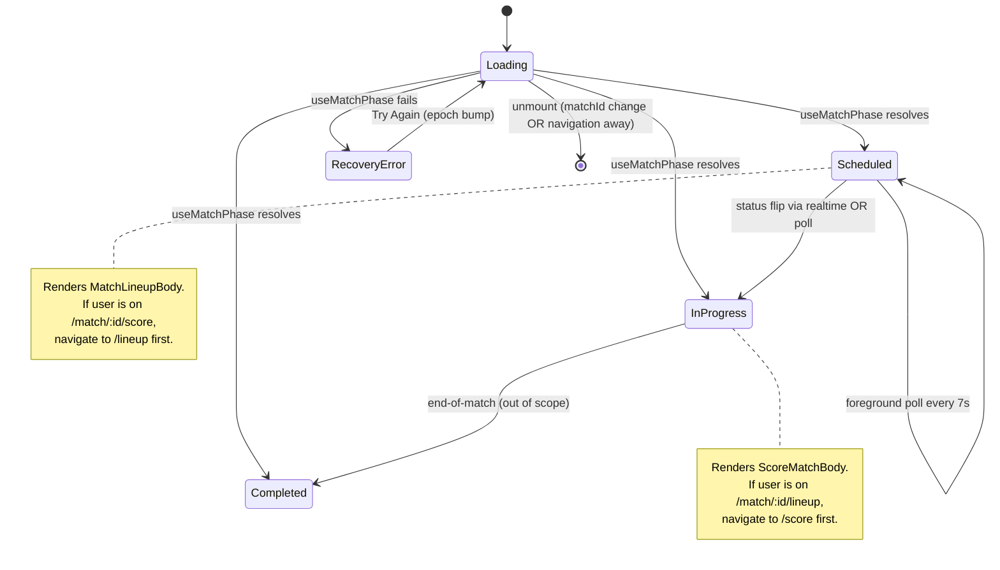

# fix: Lineup → Scoring Transition Stability

## Overview

The transition from `MatchLineup` to `ScoreMatch` has been intermittently failing for ~6 months, recovering only on full browser refresh. Root causes are a TanStack-cache key collision (`src/player/ScoreMatch.tsx:516` invalidates an off-factory key), a 10-minute `staleTime` on match-state data (`src/api/hooks/useMatches.ts:219`), component-level state (refs, memos) that survives `invalidateQueries` but not full unmount, a Fargo confirmation column that's overloaded with threshold meaning, and unguarded threshold writes in the `prep_match` RPC.

This plan implements seven independent defenses (route guard on `matches.status`, compound-key remount, decoupled Fargo confirmation columns, unified recovery surface, cache hygiene, RPC write guards, foreground polling) to make the transition deterministic — no retry loops, no stale cache poisoning, no within-match state bleed, no terminal "Match Preparation Failed" surface under normal operation.

**Defenses split into two layers**:
- **Root-cause repairs** (Defenses 5 + 6): the cache-key collision, the 10-minute `staleTime`, and the unguarded threshold writes are the literal bugs. Fixing these is necessary and arguably sufficient for the smoking-gun observable symptom.
- **Structural insurance** (Defenses 1, 2, 4, 7): a route guard, compound-key remount, unified recovery surface, and foreground polling. Each addresses a distinct architectural weakness that has *enabled* the recurring bug pattern. They are not strictly necessary to close bugs #21/#22 but they prevent the next instance of this bug class.

Both layers ship together because the user has explicitly chosen rock-solid stability over minimal scope. A future maintainer should know which is which: cache hygiene is the bug fix; the rest is the architectural reshape that prevents this from being the fourth lineup fix in eight months.

**Originally proposed Defense 3 (decoupled Fargo confirmation columns) has been dropped from this plan.** The user surfaced that the entire Fargo start-points negotiation feature is short-lived (it exists only to mirror an external app's behavior while validating the math; if the math is correct, the feature will be removed). Adding permanent schema baggage for a feature that may not survive is wasteful. The actual mechanism for bug #22 is stale `matchData` reads at prep time, which Defense 5.1's `staleTime` fix closes directly. The column overload of `*_to_lose` (dual-purpose for Fargo confirmation AND threshold values) is preserved as-is and documented as intentionally temporary. When the negotiation feature is removed, the React code goes away cleanly with no schema migration.

## Problem Frame

See origin: `docs/brainstorms/lineup-to-scoring-transition-requirements.md`.

The structural issue is that every prior fix patched a downstream symptom. Adding more retries doesn't help when the retry loop's invalidation references the wrong cache key. Adjusting `staleTime` doesn't help when component refs survive the invalidation. The fix has to address state ownership, not retry semantics.

## Requirements Trace

- R1. (Goal 1) No "Match Preparation Failed" terminal state under normal operation. The 10-retry polling loop is deleted, not tuned. — origin §Goals
- R2. (Goal 2) In-app recovery == page-reload recovery. Try Again clears refs/memos/cache the same way `window.location.reload()` does. — origin §Goals
- R3. (Goal 3) Cross-match state bleed eliminated (closes LIST_FOR_ED #19 family). — origin §Goals
- R4. (Goal 4) Fargo confirmation persists across `prep_match` (closes #22). — origin §Goals
- R5. (Goal 5) One unified failure-recovery surface; today's Path B and Path C collapse into one. — origin §Goals
- R6. (Goal 6) Multi-device captain race resilience. Slow device discovers the win and follows. — origin §Goals
- R7. (Goal 7) No new behavior depends on `team_format`, `'5_man'`, `'8_man'` (inherited). — origin §Goals
- R8. (Defense 7) Realtime-drop self-healing — slow device recovers within ~10 seconds without manual action. — origin §Defense 7

## Scope Boundaries

- Score-entry / winner-selection modal correctness (LIST_FOR_ED #23) — separate branch.
- Unified scoreboard internals (PR #99). Just shipped; do not touch.
- Mid-match anything: tiebreaker, completion, score-entry mutations.
- Mobile / visual polish on the lineup page.
- Renaming or removing `started_at` (same class of bug as #22; deferred to a follow-up — see Adjacent Work in origin doc).

### Deferred to Separate Tasks

- LIST_FOR_ED items #9, #12, #14, #15 — same root-cause family but explicitly out of scope. May be incidentally improved by Defenses 1/2/5 but will not be tested for here.
- LIST_FOR_ED #23 (winner-selection modal calculator-from-snapshot fallback) — separate branch.
- Generalizing the route-guard pattern to spectate views (`src/player/SpectateMatchCard.tsx`) — follow-up.

## Context & Research

### Relevant Code and Patterns

- `src/components/ProtectedRoute.tsx` — closest precedent for a wrapper component that gates rendering on state. New `MatchPhaseGuard` (Unit 3) mirrors its shape but reads server state via TanStack Query.
- `src/api/hooks/useMessages.ts:171` — only `refetchInterval` precedent in the repo. Defense 7's polling will mirror this shape (function-form `refetchInterval`), not introduce a `setInterval` hook.
- `src/api/hooks/useMatches.ts:49` — `useMatchById` returns the match row including `status`. Plan introduces a sibling `useMatchPhase(matchId)` (Unit 3) that fetches a minimal `{ id, status, started_at }` slice with `staleTime: 0` and `refetchOnMount: 'always'` — separate from `useMatchById` to avoid affecting other consumers.
- `src/api/queryKeys.ts:129-141` — match query keys are hierarchical (`matches.detail(id)` is a parent of `matches.lineup(id)` and `matches.games(id)`). TanStack v5 partial-key matching means invalidating `matches.detail(matchId)` cascades. Plan exploits this in Unit 2's realtime invalidation map.
- `src/api/client.ts` — QueryClient defaults already export `STALE_TIME.MATCH_LIVE = 0`. Defense 5.1's fix is one constant swap.
- `src/realtime/useMatchRealtime.ts:130-270` — Realtime channel pattern with refs to keep callbacks stable. Plan layers polling alongside, does not replace.
- `supabase/migrations/20260424000000_prep_match_rpc.sql` and `20260502000002_prep_match_rpc_renamed_columns.sql` — current `prep_match` definition. Per project memory `feedback_consolidate_migrations_in_pr.md`, Defense 6's write-guard change ships as a single new migration that replaces the function body, rather than as an add-then-tweak pair.
- `src/player/MatchLineup.tsx:1239-1260` — current Path B overlay (Back to Schedule only). Deleted in Unit 7.
- `src/player/ScoreMatch.tsx:507-529` (retry loop) and `599-643` (Path C card). Both deleted in Unit 7; replaced by `MatchPhaseGuard` + `MatchTransitionRecovery`.

### Institutional Learnings

- `docs/plans/2026-04-24-001-fix-lineup-race-condition-plan.md` (PR #87) established the transactional `prep_match` RPC pattern with idempotent inserts (`ON CONFLICT DO NOTHING`). This plan adds the matching threshold-write guards (Defense 6) that PR #87 didn't address. The realtime-driven away-team navigation pattern from PR #87 is preserved; foreground polling (Defense 7) is a backstop for when that channel drops messages.
- `docs/brainstorms/lineup-race-condition-fix-requirements.md` is partially superseded by the origin doc for cache and recovery aspects. Lineup-completeness gating (which PR #87 shipped) is unchanged.
- Project memory: all app data is disposable test data — no backfill plumbing for new columns. Migration drops the overload from `*_to_lose` and starts the new columns clean.
- Project memory: consolidate within-PR migrations before merge. Defense 3 (new columns) and Defense 6 (RPC body) should each be one clean migration in this PR, not patches on top of patches.
- `CLAUDE.md` rules: target file size ~100 lines; shadcn/ui mandatory for UI; `TABLE_OF_CONTENTS.md` updated when files are added/moved/deleted; pre-approved commands include `pnpm run typecheck`, `pnpm run lint`.

### External References

None used. Local patterns are sufficient — the unknowns here are codebase-specific (cache key shapes, route structure, Realtime conventions).

## Key Technical Decisions

- **Route guard as wrapper component, NOT nested-route restructure** (resolves origin Open Q #2). `src/navigation/NavRoutes.tsx` uses flat sibling routes with a single `RootLayout` outlet — there is no `/match/:matchId/*` parent. Restructuring to nested routes would introduce a new pattern with no other consumers. Wrapping each leaf with `<MatchPhaseGuard>` mirrors the existing `withMember`/`ProtectedRoute` HOC shape and requires no router restructure. The compound key (Defense 2) lives on the guard's children, not on the route.
- **Fargo confirmation column shape: captain `system_player_number`, NULL = not confirmed** (resolves origin Open Q #1). Matches today's "non-null = confirmed" semantics with no migration of intent. Two new columns: `home_fargo_start_points_confirmed_by` (INTEGER NULL), `away_fargo_start_points_confirmed_by` (INTEGER NULL).
- **Foreground polling shape: TanStack `refetchInterval` with function form** (resolves origin Defense 7 mechanism). Mirrors `src/api/hooks/useMessages.ts:171`, the only polling precedent. Function form: `refetchInterval: (query) => query.state.data?.status === 'scheduled' ? 7000 : false` — polls only while waiting, stops automatically when status flips. No separate `setInterval` hook.
- **Realtime invalidation keys** (resolves origin Open Q #5):
  - `matches` table events → `invalidateQueries({ queryKey: queryKeys.matches.detail(matchId) })` (cascades to lineup + games via partial matching)
  - `match_lineups` events → `invalidateQueries({ queryKey: queryKeys.matches.lineup(matchId) })` (partial-matches all suffix variants used by `useMatchLineups`)
  - `match_games` events → `invalidateQueries({ queryKey: queryKeys.matches.games(matchId) })`
- **`prep_match` write-guard mechanism** (resolves origin Open Q #7 and Defense 6). All UPDATE writes in the RPC are guarded by `WHERE status = 'scheduled'`. Combined with `INSERT ... ON CONFLICT DO NOTHING` already on game inserts, the RPC becomes fully idempotent — a second call from any race-loser is a true no-op.
- **Recovery component name**: `MatchTransitionRecovery` (resolves origin Open Q #6). Named for what it does (recovers a stuck transition), located at `src/components/match/MatchTransitionRecovery.tsx`.
- **Branch base / merge sequencing** (resolves origin Open Q #3). This branch is off `main`; PR #99 (`feature/unified-scoreboard`) is open and modifies `useMatchPreparation.ts`. The user has chosen to ship this branch first because PR #99 introduces bug #22 (cache and column overload combination) into every Fargo points-mode match. PR #99 will rebase on top of this branch when this lands. No coordinated-merge dance needed.

## Open Questions

### Resolved During Planning

- **Open Q #1** (column shape): captain `system_player_number`. See Key Technical Decisions.
- **Open Q #2** (key prop placement): wrapper component, not route restructure. See Key Technical Decisions.
- **Open Q #3** (branch base): this branch ships first. PR #99 rebases when this lands.
- **Open Q #4** (staleTime change scope): resolved during document review — codebase audit confirms safe across all 5 consumers.
- **Open Q #5** (realtime invalidation keys): see Key Technical Decisions.
- **Open Q #6** (recovery component name): `MatchTransitionRecovery`.
- **Open Q #7** (Try Again semantics + write guards): yes to RPC write guards; smart Try Again re-fetches first via the route guard's `useMatchPhase` query.

### Deferred to Implementation

- Exact pseudo-code of how `MatchLineupBody` and `ScoreMatchBody` are extracted from their current files. Refactoring will reveal the right seam — likely the existing default exports become the new wrapper-using exports, and the bodies become local constants.
- Which existing tests need to update their setup to inject a `MatchPhaseGuard` wrapper. Will be apparent once the guard is in place.
- Whether `useMatchById`'s 10-minute `staleTime` (a separate hook from `useMatchWithLeagueSettings`) should also drop to `MATCH_LIVE`. Today its consumers are dashboard/list cards that benefit from cached data; do not change without evidence. Flag during Unit 2 if any guard-adjacent reader uses it.

## High-Level Technical Design

> *This illustrates the intended approach and is directional guidance for review, not implementation specification. The implementing agent should treat it as context, not code to reproduce.*

The transition state machine (driven by the route guard, all reads from server):



The compound key on the guard's children is `${matchId}:${recoveryEpoch}`. Two triggers cause a remount:
1. `matchId` changes — cross-match navigation (closes LIST_FOR_ED #19).
2. `recoveryEpoch` increments — Try Again click on the recovery surface (closes the "refs survive across attempts" failure mode).

Storage shape for Fargo confirmation, after Defense 3:

| Column | Today's meaning | After this branch |
|---|---|---|
| `matches.home_to_lose` | Threshold value AND home captain confirmed flag | Threshold value only |
| `matches.away_to_lose` | Threshold value AND away captain confirmed flag | Threshold value only |
| `matches.home_fargo_start_points_confirmed_by` | (does not exist) | NULL or home captain `system_player_number` |
| `matches.away_fargo_start_points_confirmed_by` | (does not exist) | NULL or away captain `system_player_number` |

## Implementation Units

Three phases. Each phase ends at a verifiable checkpoint where the user can validate before the next phase starts.

### Phase 1 — Foundation: storage and cache hygiene

- [x] **Unit 1: Database migration — `prep_match` write guards (no schema changes)**

**Goal:** Replace the `prep_match` RPC body so all UPDATE writes are guarded by `WHERE status = 'scheduled'`. This makes a race-loser's second call a true no-op instead of silently overwriting threshold values. **No new columns, no new tables, no schema changes.** The Fargo confirmation column overload (`*_to_lose` doing dual duty) is preserved as-is — it's tied to a temporary feature and adding permanent schema for it would be wasteful.

**Requirements:** R6 (multi-device threshold race closure)

**Dependencies:** None.

**Files:**
- Create: `supabase/migrations/20260504000000_harden_prep_match_write_guards.sql` ✅ DONE
- Verification: existing prep_match SQL migrations under `supabase/migrations/` (do not edit; they remain history)

**Approach:**
- Replace `prep_match` body. All UPDATE writes — threshold columns, `status`, `started_at` — guarded by `WHERE id = p_match_id AND status = 'scheduled'`. The prior version's `CASE WHEN status='scheduled' THEN 'in_progress' ELSE status END` becomes unnecessary because the WHERE clause filters at the row level.
- **Drop the `IF NOT FOUND THEN RAISE EXCEPTION` block** from the prior version. With the new WHERE clause, NOT FOUND fires on every race-loser call (which is exactly the no-op case we want). Raising would defeat the purpose. Callers needing a "match exists?" check do their own SELECT first.
- **Wrap the INSERT in `IF FOUND THEN ... END IF`** so race-losers don't enter the INSERT path at all. The `ON CONFLICT DO NOTHING` clause is retained as belt-and-suspenders.
- No column changes, no comments needed on `*_to_lose` — those columns continue working as they do today.

**Patterns to follow:**
- `supabase/migrations/20260502000002_prep_match_rpc_renamed_columns.sql` — current RPC body, file format, function-replacement pattern (`CREATE OR REPLACE FUNCTION`).
- Migration filename convention `YYYYMMDDHHMMSS_snake_case.sql`.

**Test scenarios:**
- Happy path: call `prep_match` once on a `'scheduled'` match. Status flips to `'in_progress'`, `started_at` stamps, thresholds written, games inserted.
- Idempotency: call `prep_match` twice in succession on the same match. Second call is a true no-op — no row updates, no exception raised, no duplicate games. NO `RAISE EXCEPTION` from the dropped `IF NOT FOUND` block.
- Edge case: call `prep_match` on a match already `'in_progress'` (race-loser scenario). All writes filtered by WHERE; INSERT path skipped via `IF FOUND`; no error.
- Edge case: call `prep_match` on a `'completed'` or `'forfeited'` match. WHERE clause filters; no writes; no error.
- Edge case: call `prep_match` with a non-existent match ID. Silently no-ops (no error). The client-side route guard surfaces "match not found" via its own error path (Defense 1) — server-side prep_match doesn't need to.

**Verification:**
- `pnpm run typecheck` passes after types are regenerated (Supabase types may need regeneration if the codebase tracks them).
- Manual: `supabase db reset` or migration apply succeeds on local Supabase.
- Manual: SQL probe — `SELECT column_name, data_type, is_nullable FROM information_schema.columns WHERE table_name = 'matches' AND column_name LIKE '%fargo_start_points_confirmed_by%'` returns the two new columns.

---

- [ ] **Unit 2: Cache hygiene fixes (the smoking-gun fixes)**

**Goal:** Fix the three TanStack-cache bugs that have been making cache invalidation a no-op for ~6 months: wrong staleTime, refetch-instead-of-invalidate in realtime callbacks, and missing on-unmount cleanup. After this unit, cache reads are consistent with server state and realtime updates actually invalidate.

**Requirements:** R1, R2, R3

**Dependencies:** None (independent of Unit 1).

**Files:**
- Modify: `src/api/hooks/useMatches.ts` (line 219 — `useMatchWithLeagueSettings` staleTime)
- Modify: `src/realtime/useMatchRealtime.ts` (callback-resolution at lines ~144, 159, 175 — switch refetch to invalidate)
- Modify: `src/hooks/useMatchScoring.ts` (the parent that hands refetch handlers to `useMatchRealtime`) — change to pass `queryClient.invalidateQueries` calls keyed correctly per Realtime event
- Test: `src/realtime/__tests__/useMatchRealtime.test.ts` (new) — pure-function test of the invalidation key map

**Approach:**
- Defense 5.1: change `useMatchWithLeagueSettings` from `STALE_TIME.SCHEDULES` (10 min) to `STALE_TIME.MATCH_LIVE` (0). Single constant swap.
- Defense 5.2: realtime channel handlers in `useMatchRealtime` currently call refetch via parent-supplied callbacks. Replace each with a `queryClient.invalidateQueries` call keyed correctly per event:
  - `matches` event → `invalidateQueries({ queryKey: queryKeys.matches.detail(matchId) })`. Note: this cascades via TanStack v5 partial matching to `matches.lineup(matchId)` and `matches.games(matchId)` AND to the new `useMatchPhase` query (whose key extends `detail(matchId)` — see Unit 3) AND to `useMatchById` (which uses the bare `matches.detail(matchId)` key). After this change, `useMatchById` will refetch on every `matches` realtime tick — currently it doesn't. Confirm this is acceptable for `useMatchById`'s consumers (dashboard cards) before merging; if they regress under the new refetch frequency, add an `exact: true` flag to the realtime invalidation.
  - `match_lineups` event → `invalidateQueries({ queryKey: queryKeys.matches.lineup(matchId) })` (partial-matches all suffix variants used by `useMatchLineups`).
  - `match_games` event → `invalidateQueries({ queryKey: queryKeys.matches.games(matchId) })`.
- **Stable callback identity for the parent that supplies these handlers**: `src/hooks/useMatchScoring.ts` currently uses refs to keep callbacks stable across renders so `useMatchRealtime`'s subscription doesn't tear down on every parent render. Preserve this. The new `invalidateQueries` calls must be wrapped in `useCallback` (or kept inside the existing ref pattern) so `useMatchRealtime`'s `useEffect` deps at line ~270 don't invalidate the channel subscription on every render. Document this constraint in the parent file's hook header.
- Defense 5.3: in the route guard's cleanup effect (added in Unit 3) and any match-scoped consumer that unmounts on navigation, add `queryClient.removeQueries({ queryKey: queryKeys.matches.detail(matchId) })`. Belt-and-suspenders alongside Defense 2's component teardown.
- Comment the `removeQueries` call explicitly. The repo only uses `removeQueries` in 2 other places — readers will need to know it's intentional, not accidental.

**Patterns to follow:**
- `src/api/hooks/useMatchLineupMutations.ts` — invalidation conventions (uses factory keys correctly).
- `src/api/client.ts` — `STALE_TIME.MATCH_LIVE` constant is already defined.

**Test scenarios:**
- Pure function: realtime invalidation map maps each table name to the correct `queryKeys.matches.*(matchId)` shape. Test by passing in a fake event and asserting the invalidation key.
- Integration (manual or scripted): on the lineup page, write to `matches.status` server-side via SQL. Within ~1 second the route guard reflects the new status (when realtime delivers).
- Edge case: realtime event with malformed payload (no matchId). Handler does not call `invalidateQueries`; no crash.

**Verification:**
- `pnpm run typecheck` passes.
- `pnpm run lint` passes.
- Manual: open DevTools, navigate from match A's lineup to match B's lineup. The TanStack DevTools cache panel shows match A's queries gone (after Unit 6 wires the cleanup; for this unit alone, just verify the staleTime + invalidation changes don't regress today's behavior).

> **Phase 1 does NOT close bugs #21 or #22 by itself.** The retry loop at `src/player/ScoreMatch.tsx:507-529` is still alive after Phase 1 (it's deleted in Unit 7). Path B and Path C error surfaces still exist. A user testing Phase 1 in isolation may still hit the failure cards. Phase 1 establishes the cache-correctness preconditions; do not declare victory at the Phase 1 checkpoint.

---

### Phase 2 — New components

- [ ] **Unit 3: `MatchPhaseGuard` wrapper component (Defense 1 + Defense 2 + Defense 7 polling)**

**Goal:** Create the wrapper component that gates rendering on `matches.status`, holds the recovery epoch state, and applies the compound key to its children. This is the single component that all three of Defenses 1, 2, and 7 hang off.

**Requirements:** R1, R2, R3, R6, R8

**Dependencies:** Unit 1 (the new confirmation columns are not strictly needed yet, but landing the migration first keeps the units in dependency order).

**Files:**
- Create: `src/components/match/MatchPhaseGuard.tsx`
- Create: `src/api/hooks/useMatchPhase.ts` — minimal status query (separate from `useMatchById`)
- Create: `src/components/match/__tests__/MatchPhaseGuard.test.tsx`
- Create: `src/api/hooks/__tests__/useMatchPhase.test.ts`

**Approach:**
- `useMatchPhase(matchId)` is a small query: SELECT `id, status, started_at` FROM `matches` WHERE `id = matchId`. `staleTime: 0`, `refetchOnMount: 'always'`, function-form `refetchInterval` returning 7000 when status is 'scheduled' else false. Mirrors `useMessages.ts:171` shape.
- **Cache key**: `useMatchPhase` MUST use a distinct query key from `useMatchById` even though they read the same row. Use `[...queryKeys.matches.detail(matchId), 'phase']`. Reasoning: `useMatchById` (consumed by dashboard cards) uses `staleTime: STALE_TIME.SCHEDULES` (10 min, intentional caching); `useMatchPhase` uses `staleTime: 0`. If they shared the cache slot, TanStack would use whichever options were registered first — surprising and brittle. The `'phase'` suffix means realtime invalidation on `queryKeys.matches.detail(matchId)` still cascades to both via partial matching. Document this reasoning in the new hook's file header so a future contributor doesn't consolidate them and reintroduce the conflict.
- `MatchPhaseGuard` reads `useMatchPhase(matchId)` and `useParams().matchId`. It holds `recoveryEpoch` state (`useState(0)`).
- Branches (computed inline, navigate side-effects deferred to a `useEffect` per React rules — never call `navigate` during render):
  - `isPending` → render fullscreen spinner (use shadcn pattern; status message "Loading match…").
  - `isError` → derive reason from the error: `error.code === 'PGRST116'` (or equivalent "no rows" signal from Supabase) → `reason='match_not_found'`; auth/RLS errors (`401`, `403`, JWT expired) → `reason='auth_expired'`; everything else → `reason='connection'`. Render `<MatchTransitionRecovery reason={...} ... />`.
  - `data.status === 'scheduled'` → if current path is `/match/:id/score`, schedule `navigate('/match/:id/lineup', { replace: true })` via `useEffect` and return spinner this render. Else render children with the compound key on a wrapping `<div>` (NOT a Fragment — Fragments are transparent to React reconciliation and the key has no effect).
  - `data.status === 'in_progress'` → if current path is `/match/:id/lineup`, schedule `navigate('/match/:id/score', { replace: true })` via `useEffect` and return spinner this render. Else render children with the compound key on a wrapping `<div>`.
  - `data.status === 'completed' | 'forfeited' | 'postponed'` → defer to existing post-match surfaces (these already exist; the guard just renders children for them).
  - `data.status` is any other value (null, future enum) → render `<MatchTransitionRecovery reason="unknown_status" ... />`.
- The `data === undefined && !isPending && !isError` branch is unreachable in practice — Supabase's not-found surfaces as `isError` with code `PGRST116`, handled in the `isError` branch. Drop this from the dispatch logic.
- Cleanup effect on unmount: `queryClient.removeQueries({ queryKey: queryKeys.matches.detail(matchId) })`. **Why this is here even though Defense 2's component teardown already runs**: the route guard's children remount on `matchId` change OR `recoveryEpoch` bump, but TanStack's gcTime (10 min default) keeps cached queries alive for a long time after components unmount. Cross-match navigation should evict the prior match's queries proactively so a fast back-button doesn't serve stale data from the gc'd-but-not-yet-removed cache slot. This is NOT redundant with the key prop — the key prop resets the React subtree, `removeQueries` resets the cache. Different surfaces, both needed. Comment this reasoning at the call site so future readers don't assume it's dead code.
- Pass to `MatchTransitionRecovery`: `matchId`, `userTeamId` (read from `useUserProfile()`'s returned profile, which exposes `current_team_id` — verify shape during implementation; fall back to `null` and let the recovery surface route to `/dashboard`), `reason` (derived from error), `availableActions: { canBackToLineup: !location.pathname.endsWith('/lineup') }`, `softRetryFailed`, `onTryAgainSoft`, `onTryAgainHard`.
- **Two-level Try Again wiring**:
  - `softRetryFailed` is a `useState(false)` in the guard, reset to `false` on every fresh `useMatchPhase` success or on every fresh error (i.e., a new error after a soft retry succeeded once and then failed again starts the cycle over).
  - `onTryAgainSoft = async () => { const result = await phase.refetch(); if (result.isError) setSoftRetryFailed(true); }`. The recovery surface stays mounted; if the refetch succeeded, the guard's render cycle naturally hides the recovery as `phase.isError` becomes false.
  - `onTryAgainHard = () => { setSoftRetryFailed(false); setRecoveryEpoch(e => e + 1); }`. Bumps the compound key; subtree remounts.
  - The recovery surface only renders the **Hard Reset** button when `softRetryFailed === true`, so the first appearance offers only soft Try Again. This is the "soft first, escalate on second failure" contract.

**Execution note:** Test-first on the guard's branching logic — the dispatch table is dense and easy to miss a case. Start with a failing test asserting "loading state renders spinner, no children visible" and walk through each branch.

**Technical design:** *(directional, not implementation spec)*

```ts
// Pseudo-code shape — note: navigate() is in a useEffect, not in render;
// compound key is on a real DOM element (<div>) not a Fragment.
const MatchPhaseGuard: React.FC<{ children: React.ReactNode }> = ({ children }) => {
  const { matchId } = useParams();
  const { profile } = useUserProfile();
  const userTeamId = profile?.current_team_id ?? null;
  const navigate = useNavigate();
  const location = useLocation();
  const queryClient = useQueryClient();
  const [recoveryEpoch, setRecoveryEpoch] = useState(0);
  const phase = useMatchPhase(matchId);

  // Cleanup queries when matchId changes (cross-match nav).
  useEffect(() => () => {
    queryClient.removeQueries({ queryKey: queryKeys.matches.detail(matchId) });
  }, [matchId, queryClient]);

  // Status-based redirect: side-effect in useEffect, not in render.
  useEffect(() => {
    if (!phase.data) return;
    const onLineup = location.pathname.endsWith('/lineup');
    const onScore = location.pathname.endsWith('/score');
    if (phase.data.status === 'scheduled' && onScore) {
      navigate(`/match/${matchId}/lineup`, { replace: true });
    } else if (phase.data.status === 'in_progress' && onLineup) {
      navigate(`/match/${matchId}/score`, { replace: true });
    }
  }, [phase.data, location.pathname, matchId, navigate]);

  if (phase.isPending) return <FullScreenSpinner message="Loading match…" />;
  if (phase.isError) {
    const reason = deriveReasonFromError(phase.error);
    return <MatchTransitionRecovery reason={reason} matchId={matchId!} userTeamId={userTeamId}
                                    onTryAgain={() => setRecoveryEpoch(e => e + 1)}
                                    availableActions={{ canBackToLineup: !location.pathname.endsWith('/lineup') }} />;
  }
  // ... status-value branches return either spinner (mid-redirect) or wrapped children.
  return (
    <div key={`${matchId}:${recoveryEpoch}`}>
      {children}
    </div>
  );
};
```

**Patterns to follow:**
- `src/components/ProtectedRoute.tsx` — wrapper-as-guard shape (read state → branch → render children or alternative).
- `src/api/hooks/useMessages.ts:171` — `refetchInterval` shape (use the function form).
- `src/api/hooks/useMatches.ts` — query factory + STALE_TIME constants pattern.

**Test scenarios:**
- Happy path: `useMatchPhase` returns `{ status: 'scheduled' }`, current path `/match/123/lineup` → renders children wrapped in keyed `<div>`.
- Happy path: `useMatchPhase` returns `{ status: 'in_progress' }`, current path `/match/123/score` → renders children wrapped in keyed `<div>`.
- Edge case: `useMatchPhase` returns `{ status: 'in_progress' }`, current path `/match/123/lineup` → effect calls `navigate('/match/123/score', { replace: true })` exactly once; this render returns spinner (not children).
- Edge case: `useMatchPhase` returns `{ status: 'scheduled' }`, current path `/match/123/score` → effect calls `navigate('/match/123/lineup', { replace: true })` exactly once.
- Loading: `useMatchPhase.isPending === true` → renders spinner, does NOT render children.
- Error path (network): mock `useMatchPhase` to return `isError: true` with a generic Error → reason='connection' → `MatchTransitionRecovery` rendered with that reason.
- Error path (not found): mock `useMatchPhase` to return `isError: true` with `error.code === 'PGRST116'` → reason='match_not_found'.
- Error path (auth): mock with `error.code === '401'` or JWT-expired signal → reason='auth_expired'.
- Error path (unknown status): `useMatchPhase.data.status` is an unknown enum value → renders `<MatchTransitionRecovery reason="unknown_status" ... />`.
- Integration: clicking Try Again in the recovery surface calls `setRecoveryEpoch(e => e + 1)` and remounts children with the new compound key (verify by asserting a child component's `useState` resets to its initial value).
- Integration: matchId changes (cross-match navigation) — cleanup effect fires, `queryClient.removeQueries` called with the OLD matchId's key, children remount with new key.
- Polling: `useMatchPhase`'s `refetchInterval` function returns 7000 when `data.status === 'scheduled'`, returns false on every other status, returns false when `data === undefined`. (Folded in from former Unit 7.)
- Integration polling (with `vi.useFakeTimers()`): mount with `data.status='scheduled'`, advance 7s, assert query function called a second time. Advance again, query called a third time. Transition `data.status` to `'in_progress'`; advance 7s, query function NOT called again.
- Compound key correctness: assert the keyed wrapper element has `key={`${matchId}:${recoveryEpoch}`}` AND that incrementing `recoveryEpoch` causes a child component's local state to reset (proves the remount actually fires — would not fire if the key were on a Fragment).

**Verification:**
- All test scenarios above pass.
- `pnpm run typecheck` and `pnpm run lint` pass.
- The component file size is at or under ~100 lines (per CLAUDE.md target). If it grows past, factor the branching into a small pure helper.

---

- [ ] **Unit 4: `MatchTransitionRecovery` recovery surface (Defense 4)**

**Goal:** Create the unified recovery component that replaces today's Path B (lineup overlay, Back to Schedule only) and Path C (scoring page failure card with Try Again + Back to Lineup). One component, used in two places, with the same buttons and copy everywhere.

**Requirements:** R5

**Dependencies:** Unit 3 (the guard renders this component on error states; both arrive together for testability).

**Files:**
- Create: `src/components/match/MatchTransitionRecovery.tsx`
- Create: `src/components/match/__tests__/MatchTransitionRecovery.test.tsx`

**Approach:**
- Inputs: `matchId: string`, `userTeamId: string | null`, `reason: RecoveryReason`, `onTryAgain: () => void`, `availableActions: { canBackToLineup: boolean }`.
- `RecoveryReason` enum: `'connection' | 'match_not_found' | 'auth_expired' | 'server_error' | 'unknown_status'`. Extensible — new reasons added via the same enum + copy table. The guard (Unit 3) maps `useMatchPhase` errors to a reason value via `deriveReasonFromError()`.
- Reason → headline + body copy mapping. Copy register is league-night practical, not generic SaaS — captains are at a pool table and need actionable information, not soft euphemisms. Final copy is a planning placeholder; product/copy review may refine, but these are the intended tone:
  - `connection` → "Connection Lost" / "We couldn't reach the server. Tap Try Again when your signal's back."
  - `match_not_found` → "Match Not Found" / "This match isn't where it should be. It may have been deleted, or you might not have access."
  - `auth_expired` → "Session Expired" / "You've been signed out. Sign in again to keep going." (Back to Schedule navigates to login path; Try Again is hidden in this case since it won't help.)
  - `server_error` → "Something Broke On Our End" / "The server hit an error. Try again — if it keeps happening, ping support."
  - `unknown_status` → "Match State Unclear" / "The match is in a state we don't recognize. Try again, or head back to the schedule."
- Buttons (use shadcn `Button`). **Two recovery levels** to avoid wiping in-progress lineup work on every transient blip:
  - **Try Again** (primary, conditional — hidden when `reason='auth_expired'`): calls `onTryAgainSoft`, a soft refetch that re-runs `useMatchPhase` only. Cheap, fast, preserves form state on the lineup body. While in-flight: button disabled, label changes to "Re-checking…", minimum disabled time 400ms to prevent flicker. If the soft refetch resolves the error (status query succeeds, status valid), the recovery surface unmounts and the user lands back on the appropriate body with their lineup intact. If the soft refetch FAILS (still erroring, or returns the same error reason), the recovery surface re-renders with the **Hard Reset** button now visible (see below).
  - **Hard Reset** (destructive, conditional — only visible after a soft Try Again has failed at least once): calls `onTryAgainHard`, which bumps `recoveryEpoch` and triggers the full subtree remount (clears all refs, memos, in-progress form state). Confirmation prompt before firing: "This will clear any unsaved lineup changes. Continue?" — dialog or inline confirm. After confirmation, the remount happens and the recovery surface unmounts as a side effect.
  - **Back to Lineup** (outline, conditional on `availableActions.canBackToLineup`): `navigate(\`/match/${matchId}/lineup\`)`. Shown when on scoring; hidden when on lineup. The guard computes `canBackToLineup` from `useLocation()`.
  - **Back to Schedule** (outline, always): `navigate(\`/team/${userTeamId}/schedule\`)` matching the pattern at `src/player/MatchLineup.tsx:1253`. Falls back to `/dashboard` when `userTeamId` is null.
- The guard (Unit 3) holds two state values to drive this: `softRetryFailed: boolean` (toggles after the first failed soft refetch) and `recoveryEpoch: number` (incremented only on Hard Reset). `onTryAgainSoft` calls `phase.refetch()` and, on error, sets `softRetryFailed=true`. `onTryAgainHard` increments the epoch.
- Visual: shadcn `Card` + `CardHeader` + `CardContent`. Fullscreen, not overlay (matches `src/player/ScoreMatch.tsx:608` style).
- Mobile layout: buttons stack vertically on `<sm` breakpoint (matching `ErrorFallback.tsx`'s `flex-col sm:flex-row` pattern). All three buttons get full width on mobile; minimum touch target 44px (use shadcn default `Button` size or larger). Recovery card is centered; padding sufficient that the card doesn't touch the screen edges on small phones.
- Component does NOT contain any retry logic. It is a pure view layer; `onTryAgain` is the entire mechanism.

**Patterns to follow:**
- `src/components/ErrorFallback.tsx` — visual style for fullscreen recovery cards (Card + AlertTriangle icon + buttons).
- `src/player/ScoreMatch.tsx:599-643` — the existing Path C card for visual reference (will be deleted in Unit 7).
- shadcn `Button` and `Card` via `@/components/ui/*`.

**Test scenarios:**
- Happy path: render with `reason='connection'`, `availableActions.canBackToLineup=true` → headline shows "Connection Lost", all three buttons visible.
- Edge case: render with `availableActions.canBackToLineup=false` → Back to Lineup button NOT in DOM (use `queryByRole('button', { name: /back to lineup/i })` to confirm null).
- Edge case: render with `userTeamId=null` → Back to Schedule routes to `/dashboard`.
- Edge case: render with `reason='auth_expired'` → Try Again is NOT in DOM; Hard Reset is NOT in DOM; Back to Schedule navigates to login.
- Happy path: clicking Try Again calls `onTryAgainSoft` exactly once; button label changes to "Re-checking…" and `disabled=true` for at least 400ms.
- Happy path: render with `softRetryFailed=false` → Hard Reset button is NOT in DOM (queryByRole returns null).
- Edge case: render with `softRetryFailed=true` → Hard Reset button IS in DOM, distinct from Try Again, with confirmation prompt before firing.
- Happy path: clicking Hard Reset shows confirmation, then calls `onTryAgainHard` exactly once on confirm.
- Edge case: clicking Hard Reset → "Cancel" on confirmation → `onTryAgainHard` is NOT called.
- Happy path: clicking Back to Lineup calls `navigate(\`/match/${matchId}/lineup\`)`.
- Happy path: clicking Back to Schedule calls `navigate(\`/team/${userTeamId}/schedule\`)`.
- Each `reason` value renders distinct headline copy (validates the reason → copy map: 5 reasons × distinct headlines).
- Mobile layout (jsdom or `@testing-library` viewport mock): buttons stack vertically below `sm` breakpoint, full width.

**Verification:**
- All test scenarios pass.
- `pnpm run typecheck`, `pnpm run lint` pass.
- File size ~100 lines or under.

---

### Phase 3 — Integrate

> *(Unit 5 was originally "Update Fargo negotiation hook to use decoupled columns." It has been **removed from the plan** because the user surfaced that the entire Fargo start-points negotiation feature is short-lived. Defense 3 was dropped (see Overview), and with it the column-decoupling work in this unit. `useFargoStartPointsNegotiation.ts` and `useMatchPreparation.ts:254-272` stay untouched — the existing "preserve `*_to_lose`" pattern is correct, and Defense 5.1's staleTime fix in Unit 2 ensures the matchData read at prep time is fresh, which closes the actual mechanism behind bug #22.)*

---

- [ ] **Unit 6: Wire `MatchPhaseGuard` around `MatchLineup` and `ScoreMatch` (Defense 1 + Defense 2 placement)**

**Goal:** Wrap the existing match-scoped pages with the new guard. Extract the page bodies as `MatchLineupBody` and `ScoreMatchBody`; the original named exports become `<MatchPhaseGuard><Body/></MatchPhaseGuard>`. This is the integration point where Defenses 1, 2, and 7 go live for users.

**Requirements:** R1, R2, R3, R6, R8

**Dependencies:** Units 3, 4 (guard and recovery component must exist).

**Files:**
- Modify: `src/player/MatchLineup.tsx` (refactor to extract body; export the wrapped version)
- Modify: `src/player/ScoreMatch.tsx` (same)
- Modify: `src/navigation/NavRoutes.tsx` (no structural change; the route still points at `MatchLineup`/`ScoreMatch`, but those exports are now guard-wrapped)
- Test: `src/player/__tests__/MatchLineup.guarded.test.tsx` (new) — integration test that the guard wraps lineup correctly
- Test: `src/player/__tests__/ScoreMatch.guarded.test.tsx` (new)

**Approach:**
- In each page file, rename the existing default-export component to `MatchLineupBody` / `ScoreMatchBody` (local consts, not re-exported).
- New default export: a small wrapper that returns `<MatchPhaseGuard><MatchLineupBody/></MatchPhaseGuard>` (and same for ScoreMatch).
- The body components remain functionally unchanged in this unit. They will still see today's stale-cache symptoms internally; Unit 7 will delete the now-redundant retry/overlay paths.
- `MatchPhaseGuard` decides which body to render via children prop. Today both pages exist and the guard simply delegates to whichever is mounted; the guard's redirect logic (Unit 3) catches mismatches between current path and `matches.status`.

**Execution note:** Refactor first, no behavior change. Verify existing tests pass before continuing. Commit refactor and behavior change separately if helpful.

**Patterns to follow:**
- `withMember` HOC pattern in `src/navigation/NavRoutes.tsx:87-129` — wrap-an-element idiom.
- `src/components/ProtectedRoute.tsx` consumer sites — show how a wrapper composes around real page components.

**Test scenarios:**
- Refactor: existing test suite still passes after the body extraction (no behavioral change in this unit — refactor only).
- Integration: navigate to `/match/123/lineup` with `status='scheduled'` → renders `MatchLineupBody`.
- Integration: navigate to `/match/123/lineup` with `status='in_progress'` → guard navigates to `/match/123/score`, never renders `MatchLineupBody`.
- Integration: navigate to `/match/123/score` with `status='scheduled'` → guard navigates to `/match/123/lineup`.
- Integration: cross-match navigation (`/match/A/lineup` → `/match/B/lineup`) → guard for B mounts fresh; A's queries removed via cleanup effect (Unit 2's `removeQueries`).

**Verification:**
- Existing component tests pass without modification.
- New integration tests pass.
- Manual: open `/match/:id/lineup` for a scheduled match. Page renders. Server-side flip status to `'in_progress'` (via SQL or partner device's `prep_match`). Within ~7 seconds (poll cadence) or immediately on realtime, the page navigates to scoring.
- `pnpm run typecheck`, `pnpm run lint`, `pnpm run build` pass.

---

> *(Unit 7 was previously a tests-only stub for Defense 7 polling. Folded into Unit 3 — polling logic and its tests both live there.)*

- [ ] **Unit 7: Delete old retry loop, Path B overlay, and the off-factory invalidation (cleanup)**

**Goal:** Remove all the now-redundant paths that the new architecture replaces. The retry loop has been a no-op for 6 months; the Path B overlay was a dead-end; the off-factory cache key was the smoking gun. After this unit, the new architecture is the only path.

**Requirements:** R1, R3, R5

**Dependencies:** Units 3, 4, 6 (the new components must be wired in before the old paths are removed).

**Files:**
- Modify: `src/player/ScoreMatch.tsx` — delete lines ~507-529 (retry loop + state), ~599-643 (Path C card), and the `MAX_RETRIES`, `retryCount`, `waitingForPreparation` references throughout. The off-factory invalidation at line ~516 disappears with the loop.
- Modify: `src/player/MatchLineup.tsx` — delete lines ~1239-1260 (Path B overlay). Repurpose `isPreparingMatch` (do NOT remove): the Lock-Lineup button reads this state and renders as a spinner+disabled while it's true. See Approach below for the in-flight UX contract.
- Modify: `src/hooks/lineup/useMatchPreparation.ts` — preserve the `setIsPreparingMatch` calls during the prep_match RPC execution (they wrap lines ~219, ~373, ~384). These now drive the Lock-Lineup button's spinner state, not an overlay.
- Modify: `src/hooks/useMatchScoring.ts` — remove the retry-related callbacks if any are passed in for the loop.
- Modify: `TABLE_OF_CONTENTS.md` — add the new files (`MatchPhaseGuard.tsx`, `MatchTransitionRecovery.tsx`, `useMatchPhase.ts`) and remove references to deleted code if any.

**Approach:**
- **In-flight prep UX contract**: during the 1-3 seconds (up to ~5s with all 3 retry attempts of `prep_match`) that the home captain's RPC is running, the Lock-Lineup button itself shows a spinner and is disabled. No separate overlay. shadcn `Button` supports this via the existing `loadingText` / disabled prop pattern; mirror however the codebase already does loading buttons (e.g., `src/components/ui/button.tsx` or wrapper hooks). When the RPC succeeds and status flips, the route guard's redirect navigates to scoring; the button never re-enables on the lineup page (because the user is no longer on the lineup page).
- Grep-driven cleanup: find every reference to `MAX_RETRIES`, `retryCount`, `waitingForPreparation`, and the Path B overlay markup (the `{isPreparingMatch &&` block at MatchLineup.tsx:1239). Delete the overlay; keep the `isPreparingMatch` state since Lock-Lineup now reads it.
- Verify no orphaned imports remain (Loader2 from lucide-react may become unused in MatchLineup if Path B was its only consumer — remove if so).
- Run typecheck after deletion to surface any newly-unreferenced symbols.

**Patterns to follow:**
- N/A — this is deletion. Nothing to mirror.

**Test scenarios:**
- Test expectation: existing tests must still pass without modification (the new architecture, landed in earlier units, supplies the behavior these deletions remove).
- Manual: walk through bug #21's reproducer (multi-device prep race). The slow device sees the route guard's spinner during status load, then either auto-navigates to scoring (if status flipped) or shows `<MatchTransitionRecovery>` on a real error. No "Back to Schedule"-only overlay, no 10-retry "Match Preparation Failed" card.
- Manual: walk through the page-refresh-fixes-it bug. With Defenses 1+2+5 in place, in-app Try Again should work in every case where reload works. Verify with at least 5 manual test cycles.
- Grep test: `grep -rn "MAX_RETRIES\|retryCount\|waitingForPreparation" src/player/` returns nothing.

**Verification:**
- All existing tests pass.
- `pnpm run typecheck`, `pnpm run lint`, `pnpm run build` pass.
- Manual smoke test: complete one full BCA 3v3 match end-to-end (lineup → scoring → completion). No regressions.
- Manual smoke test: complete one full Fargo 10-7 points-mode match end-to-end. No regressions, no Fargo re-prompt.
- `TABLE_OF_CONTENTS.md` reflects the new file structure.

---

## System-Wide Impact

- **Interaction graph:** `MatchPhaseGuard` is a new top-level surface that all match-scoped page routes pass through. Any future match-scoped page (e.g., a per-match spectate route, future operator views) should also wrap in this guard for consistency. Documented in the guard component's file header.
- **Error propagation:** TanStack query errors on `useMatchPhase` route to `<MatchTransitionRecovery reason="connection" ... />` instead of an unhandled error or infinite spinner. The recovery surface itself never crashes — its own button click handlers are pure React state updates and `navigate()` calls.
- **State lifecycle risks:** The compound key (`${matchId}:${recoveryEpoch}`) means **Hard Reset** is a destructive reset of the lineup or scoring body subtree — refs, memos, in-progress form input all lost. This is intentional (matches `window.location.reload()` semantics) but is now reserved for the second-level recovery action. The first-level **Try Again** is a soft refetch only, preserving form state. Captains who hit a transient blip get soft refetch first; only if that fails does the recovery surface offer Hard Reset (with explicit confirmation). This two-level recovery is the result of the document review's UX feedback — single-button always-hard-remount loses captains' lineup work on every transient blip.
- **API surface parity:** `useMatchById` and `useMatchPhase` both read the matches row but for different purposes. `useMatchById` continues to serve dashboard/list cards with cached data; `useMatchPhase` is the route-guard fast read. Keep them separate; do not consolidate. Documented in `useMatchPhase`'s file header.
- **Integration coverage:** Unit 5's "complete negotiation, run prep, navigate back" test is the canonical bug #22 regression test. Unit 7's manual smoke tests are the bug #21 + page-refresh-fixes-it regression tests. Add both to the team's manual test checklist for future PRs touching this area.
- **Unchanged invariants:** `prep_match`'s game-row insert pattern (ON CONFLICT DO NOTHING) is preserved. The lineup-completeness gating from PR #87 (`computePrepBlockedReason`, `useFargoStartPointsNegotiation`'s applicable flag) is preserved. Realtime channel scoping (per-match channels, cleanup on unmount) is preserved. `started_at` writes in `useLineupPersistence.ts:182` are preserved as-is (out of scope cleanup; flagged in origin doc).

## Risks & Dependencies

| Risk | Mitigation |
|------|------------|
| `useMatchPhase` separate from `useMatchById` doubles the matches-row reads when both fire on the same page mount | Acceptable. Both queries hit the same cached row server-side (Postgres query cache); client-side they use different cache keys (Unit 3 mandates the `'phase'` suffix). Total network traffic increase is negligible. |
| Foreground polling adds load (~1 request per 7s per active lineup page) | Acceptable for ≤50 concurrent captains across the league system (≈7 reads/sec on `matches.status`). Polling stops automatically when status flips to `'in_progress'`. Note: lineup-page time can stretch beyond 2 minutes during Fargo negotiation or sub resolution — extended-time polling is still well within Postgres capacity for this scale. |
| `prep_match` write-guard change conflicts with PR #99's open work on `useMatchPreparation.ts` | PR #99 modifies the *client* (`useMatchPreparation.ts`) significantly. It does NOT modify `prep_match` SQL. However, this branch's Unit 5 ALSO modifies `useMatchPreparation.ts` (lines 254-272) — likely conflict surface with PR #99's edits. Mitigation: when PR #99 rebases on top of this branch, expect conflicts in `useMatchPreparation.ts`'s Fargo points-mode threshold dispatch. Resolve by keeping this branch's "decoupled columns + write NULL to `*_to_lose`" semantics. |
| Realtime invalidation cascade affects `useMatchById` | After Unit 2's switch from `refetch()` to `invalidateQueries`, every `matches` realtime tick will invalidate `useMatchById` (currently silent). `useMatchById` consumers are dashboard cards; if they regress under new refetch frequency, add `exact: true` to the realtime invalidation. Verify during Phase 1 testing. |
| Unit 5's audit misses a non-obvious `home_to_lose`/`away_to_lose` reader | Audit closed during planning — see Unit 5's Files section. Three legitimate threshold readers identified and flagged as no-touch (`useMatchScoring`, `useSpectateMatch`, `matchLineups` mutations). One confirmation reader identified for modification (`useMatchPreparation.ts:254-272`). Grep test in Unit 5 verifies the closure. |
| Migration adds two columns to a table with row-level-security policies | Verify in Unit 1's manual verification that existing RLS policies on `matches` still apply to the new columns. New columns inherit table-level RLS; no new policy needed. |
| Bug #22 regression after this lands | Unit 5's integration test is the canonical regression test. Add to CI if available; otherwise to the team manual-test checklist. |
| Operator-led match reset (deferred feature) interacts badly with `WHERE status='scheduled'` guard | If a future operator-reset feature reverts a match from `'in_progress'` back to `'scheduled'`, it must also clear `match_games` rows AND clear thresholds. The `prep_match` `INSERT ... ON CONFLICT DO NOTHING` would otherwise silently no-op against stale game rows on the second prep. Document this requirement in the migration comment so the operator-reset PR knows the contract. Out of scope for this branch but flagged here. |

## Documentation / Operational Notes

- Update `TABLE_OF_CONTENTS.md` in Unit 7 with the new files: `src/components/match/MatchPhaseGuard.tsx`, `src/components/match/MatchTransitionRecovery.tsx`, `src/api/hooks/useMatchPhase.ts`. The TOC is currently dated 2026-05-02 with table-row entries per file — add entries under the components and hooks sections in matching format.
- File header on `MatchPhaseGuard.tsx` explicitly notes this is a NEW pattern (server-state route guard) — first of its kind in the repo. Future contributors should know it's intentional, not an outlier.
- File header on `useMatchPhase.ts` explains why it's separate from `useMatchById` (different consumers, different staleTime needs).
- No operational rollout concerns. This is a stability fix that lands in one PR, ships behind no flag, and rolls out atomically with the migration.
- Manual test checklist for the team after merge. This is a third-attempt stability fix on a recurring intermittent bug — single-pass smoke testing has historically not been enough. Treat the checklist as a release gate, not a smoke test:
  1. **10 consecutive BCA 3v3 lineup→scoring transitions** across at least 2 captain devices. No retry-loop failures, no "Match Preparation Failed" surface, no Fargo re-prompts.
  2. **10 consecutive Fargo 10-7 points-mode transitions** across 2 devices. Both captains complete start-points negotiation, prep runs, both devices land in scoring without re-prompt.
  3. **Cross-match navigation**: open match A in any state, navigate to dashboard, open match B (fresh). 5 cycles. Match B never displays match A's data; LIST_FOR_ED #19 reproducer no longer reproduces.
  4. **Bug #22 reproducer**: complete a Fargo start-points confirmation → simulate a prep failure (e.g., briefly disable network on the home device's RPC call) → recovery surface appears → click Try Again. Verify lineup page does NOT re-prompt for confirmation. 5 cycles.
  5. **Bug #21 multi-device race**: 3 authenticated captain devices on the same match (e.g., phone + laptop + tablet). All three complete lineup. Race the lock action. Verify the slowest device follows to scoring within 10 seconds (Defense 7 polling) even if the realtime tick was missed. 3 cycles.
  6. **Realtime-drop simulation** (the explicit Defense 7 test): on the away device, open DevTools → Network → set throttling to "Offline" briefly during the home device's `prep_match` execution. Verify the away device's `useMatchPhase` polling auto-discovers `status='in_progress'` within ~7 seconds and navigates. 3 cycles.
  7. **Recovery surface error path**: force `useMatchPhase` to error (e.g., delete the match row server-side mid-flight, or block the network). Verify the recovery surface renders with appropriate copy per reason (`connection`, `match_not_found`, `auth_expired`). Click Try Again — verify the in-app recovery matches what `window.location.reload()` produces. 3 cycles per error type.

## Sources & References

- **Origin document:** [docs/brainstorms/lineup-to-scoring-transition-requirements.md](../brainstorms/lineup-to-scoring-transition-requirements.md)
- **Predecessor plan:** [docs/plans/2026-04-24-001-fix-lineup-race-condition-plan.md](2026-04-24-001-fix-lineup-race-condition-plan.md) (PR #87 — race-condition fix; this plan extends it)
- **Predecessor brainstorm:** [docs/brainstorms/lineup-race-condition-fix-requirements.md](../brainstorms/lineup-race-condition-fix-requirements.md) (partially superseded for cache and recovery aspects)
- **Related PR (open):** PR #99 — `feature/unified-scoreboard`. This branch ships first; #99 rebases on top.
- **Related LIST_FOR_ED items:** #21, #22 (closed by this plan), #19 (closed structurally), #9, #12, #14, #15 (same family, deliberately deferred).
- Key code references:
  - `src/player/ScoreMatch.tsx:507-529, 599-643, 516` (retry loop, Path C card, off-factory key)
  - `src/player/MatchLineup.tsx:1239-1260` (Path B overlay)
  - `src/api/hooks/useMatches.ts:219` (the staleTime smoking gun)
  - `src/hooks/lineup/useFargoStartPointsNegotiation.ts:127-131, 165-176, 220-233` (column overload)
  - `src/realtime/useMatchRealtime.ts:144, 159, 175` (refetch-instead-of-invalidate)
  - `src/navigation/NavRoutes.tsx:211-212` (the flat routes)
  - `supabase/migrations/20260502000002_prep_match_rpc_renamed_columns.sql` (RPC body to replace)
