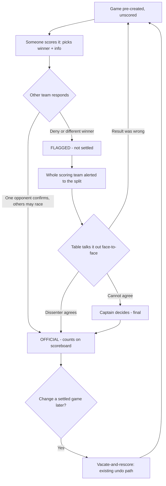

# Robust Multi-Device Live Match Scoring (Connection Resilience + Concurrency Correctness)

## Problem Frame

Live match scoring is the most-used and most load-bearing feature in the app. A single match is scored in real time by potentially **every player on both teams (30+ people), each on their own phone**, all watching the same match — in pool halls with flaky, in-and-out wifi. This is launch-critical robustness: if the app stumbles, people who traveled to play fall back to paper.

Two problem areas exist today:

1. **Resilience** — when a connection drops or degrades (weak wifi, app backgrounded, the realtime subscription torn down and re-set-up), a device can silently fall out of sync until someone manually refreshes. There is no user-facing indicator and no scoring-data fallback. React StrictMode's dev double-mount currently breaks the propose/confirm handshake, which is a free, reproducible symptom of this fragility.
2. **Concurrency** — with many devices acting at once: team totals can flash wrong (concurrent recompute-and-save is last-writer-wins and can persist to match-end); two people scoring different winners for the same game silently overwrite each other with no warning; and match completion is only 2-team-safe, not N-device-safe.

### North Star — Invisible Robustness

The guiding principle, stated by the product owner and governing every decision below:

> **It just works, always, no matter what — and looks like nothing is ever wrong.** The app only ever interrupts a human when a human genuinely has to decide something, and even then it stays calm, not alarming. It tracks as accurately as possible, with no easy way to cheat or make a mistake.

A critical enabling fact: **all the players are physically co-located around one pool table.** They can talk face-to-face. So when there is a genuine disagreement, the app's job is **not to referee it — only to make the table *notice* it.** The app is a smoke detector, not a judge. This is what lets the design stay simple: almost all adjudication machinery is unnecessary.

### Non-Negotiable Constraints

- Never lose a score — games-won is sacred and always correct (or visibly unsettled, never quietly wrong).
- Never hard-crash mid-match.
- Many devices, one match.
- Must survive dropped connections and recover **without a manual refresh**.

## Requirements

**Connection Resilience**

- R1. A device must detect when its live connection is unhealthy and distinguish two states: (a) **realtime push is down but the server is still reachable** (reads/writes still succeed), versus (b) **the server is briefly unreachable** (writes fail). The two states drive different behavior.
- R2. While realtime push is down but the server is reachable, **scoring continues normally** and the device keeps itself in sync by another means (e.g., periodic refresh) so it never silently shows stale data.
- R3. A score tap made during a brief drop is **never lost**: it is held on the device and sent automatically when the connection returns, with a calm "saving… → saved" confirmation to the person who tapped. (This is a short hold of a tap or two during a blip — not full offline scoring; see Scope Boundaries.)
- R4. A device **recovers on its own** when the connection returns — it re-syncs to true server state with no manual refresh and resolves any held taps. No device stays permanently out of sync.
- R5. The live subscription and the propose/confirm handshake must **cleanly survive teardown → immediate re-setup**. Acceptance check: React StrictMode's double-mount must stop breaking the handshake.
- R6. Outward appearance stays **as invisible as possible**: watchers see a scoreboard that quietly catches up with no alarms; the only routine feedback is the positive "saving → saved" shown to the active scorer; only a *sustained* server outage shows the person trying to score a single calm note. (A genuine disagreement is the one deliberate, louder exception — see R11.)

The three connection states and their behavior:

| Connection state | Server reachable? | Scoring | Stays in sync via | What people see |
|---|---|---|---|---|
| Healthy | Yes, with instant push | Normal | Realtime push | Nothing unusual |
| Realtime down, server OK | Yes (reads/writes work) | Continues normally | Periodic refresh (fallback) | Nothing alarming; board quietly catches up |
| Briefly offline | No | Tap held, sent on return | Auto-resync on reconnect | Scorer sees "saving…"; a *sustained* outage shows one calm note |

**Concurrency & Agreement Correctness**

- R7. A game becomes **official the instant one person from each team confirms the same winner.** This smooth, normal-case path is unchanged. ("Official" and "settled" are used interchangeably in this document for this same state.)
- R8. A winner can **never be silently overwritten.** If two devices independently score the same game (e.g., during a drop) with different winners, the system must not quietly accept the second over the first and count a mismatched result.
- R9. When responses **disagree**, the app records who said what (which people picked which winner, or denied) so the split can be shown (R11). On the smooth happy path it only needs the one confirmer per side. The fuller "many-eyes" layer — recording *every* confirmer even when everyone agrees, a visible confidence count ("3 confirmed"), and a standing audit trail — is **deferred to a Layer-2 follow-up** (see Scope Boundaries): it is the most expensive piece for the least launch-critical benefit.
- R10. When responses disagree (a deny, or different winners picked), the game is treated as **not settled** — it does not quietly count as a clean result — and is visibly flagged "check this — you don't all agree."
- R11. A disagreement **alerts the whole scoring group on the affected team** (everyone who scored for that team), not just the lone dissenter, and shows the split ("Sarah said John, Mike said Jack"). The app surfaces the problem loudly enough to notice; the co-located humans resolve it out loud.
- R12. A disagreement is **resolved by the humans, not the software.** The dissenter can change their answer (flag clears, game counts), or the result is redone via the existing path. **No score is destroyed by a single dissent** — nobody's input gets wiped.
- R13. If a team genuinely cannot agree, the **team captain has final say when present.** Final resolution always rests on the two sides agreeing in person (the table sorts it out), so the captain is an *additive* backstop, not a hard dependency — we do **not** build an authority-delegation chain for when the captain is absent. A frozen game is extremely unlikely in practice: the players are at the table, and one person from each side agreeing settles it.
- R14. Once a game is official, changing it does **not** use confirm/deny — it reuses the existing **vacate-and-rescore** ("undo a finished game") flow. There is exactly one deliberate way to reopen a settled game.
- R15. Within an *unsettled* game, a **deny is never lost to a race**: in any race between simultaneous confirms and a deny, the deny takes precedence — the game lands in the flagged "not settled" state, never in a clean "official" state.

A game's full lifecycle:

**Totals & Match Completion Integrity**

- R16. Team totals must **always be correct — never show a clean wrong number.** Concurrent confirms on different games must not race the recompute-and-save such that a wrong total can persist (today this can persist to match-end if it is the last action). Games-won is always correct; derived points are recoverable and unconditionally correct at completion.
- R17. Match completion must be **safe with any number of devices acting at once**: exactly one completion happens, with no error noise, regardless of how many devices — including multiple devices of the *same* team — try to finalize simultaneously.
- R18. Under a flurry of concurrent actions, the games-won count is **never lost or double-counted.** The existing property that guarantees this — pre-created game rows that only count once both teams confirm, plus totals recomputed from confirmed rows — must be **preserved, not redesigned.**

**Participation Modes**

- R19. Each person can be in one of three modes for a match: **actively scoring** (gets confirm popups), **"I'm not scoring"** (a *sticky* toggle that blocks all confirm popups until the person turns it back off — for players who simply don't want to score, so they are never bugged), or **auto-confirm** (auto-accepts with no popup). Both "I'm not scoring" and auto-confirm are sticky per-person settings that persist until changed (like a saved preference), not per-game choices.
- R20. A confirm popup **never forces a decision**: a person who doesn't know can simply dismiss it ("sit this one out") with no effect on the game. Only explicit confirms and denies count.
- R21. **Mode lifetime is asymmetric, by safety:**
  - **Auto-confirm** survives a page refresh, but switches **off automatically** the moment the scorer navigates away from the scoring page, leaves the app, or the screen loses focus / is backgrounded. It can only ever be active while the scoring screen is actually in front of the person (returning requires turning it back on). This is deliberate: auto-confirm accepts scores *on the person's behalf* and must never run unattended.
  - **"I'm not scoring"** is scoped to the **current match** and is a hair stickier: it survives a refresh *and* survives backgrounding/returning, ending only when the match ends or the person leaves that match. It only suppresses that person's own popups (no score risk), so it does not need auto-confirm's aggressive auto-off.

| Mode | Gets confirm popups? | Behavior |
|---|---|---|
| Scoring | Yes | Confirms or denies; may dismiss if unsure |
| Not scoring | No | Opted out; never interrupted |
| Auto-confirm | No (auto) | Automatically accepts (existing setting) |

*Dismiss is **not** a fourth mode — it's an action available within Scoring mode (R20): sitting a single popup out with no effect on the game.*

## Success Criteria

- 30+ co-located players score a full match over flaky / in-and-out wifi **without anyone resorting to paper** and **without anyone manually refreshing.**
- No score is ever lost or double-counted; the games-won total is always correct.
- A winner is never silently overwritten; a disagreement is always surfaced to the team, never quietly resolved the wrong way.
- Every game can reach a final answer — one person from each side agreeing settles it in person, with the captain as an extra tie-breaker when present.
- On the happy path, players see nothing alarming — it "just works."
- StrictMode's double-mount no longer breaks the handshake.
- The match completes exactly once regardless of device count, with no error noise.

## Scope Boundaries

- **Full offline scoring** (no internet for a whole match — each phone keeping its own record, the league operator reconciling later; e.g. a single-phone-per-side fallback) is a **separate future brainstorm**, not this one. This work covers weak / in-and-out connections where the server is reachable at least intermittently.
- **Auth / RLS** — a separate, deliberate pre-launch pass.
- **Local-dev Supabase container restart** quirks.
- **Rewriting the already-hardened subscription hook** — extend it, do not rewrite it.
- **Building a StrictMode on/off test toggle** — a testing chore, not a design question; StrictMode already exercises the bug automatically.
- **The full "many-eyes" layer is deferred to a Layer-2 follow-up** (not this scope): recording *every* confirmer when everyone already agrees, a visible "3 confirmed" confidence count, and a standing anti-cheat audit trail. This scope records who-said-what only to surface a disagreement (R9/R11). Rationale: it is the most expensive piece (a data-shape change) for the least launch-critical benefit, and it is the one item that would fight "preserve, don't redesign" (R18).
- **Explicitly rejected as fragility** (do not build): a "pause to gather more deciders" step, clear-and-revote loops, a second/parallel undo system, and any app-side auto-adjudication of who is right. The table decides; the app only surfaces.

## Key Decisions

- **Invisible robustness + smoke-detector-not-judge.** Players are co-located and can talk; the app surfaces problems for humans to resolve face-to-face rather than refereeing in software. Fewer moving parts = more stable, which directly serves the never-break goal.
- **Hold-and-send taps over block-on-drop.** Rationale: never force paper; the scorer taps once and walks away; the tap sends itself when wifi returns.
- **Official at one-per-side.** Keeps the happy path instant. Recording who-said-what is kept only for surfacing a disagreement; the fuller many-eyes confidence/audit layer is deferred to Layer 2 (deliberately reined in — most cost, least launch-critical value).
- **Reuse vacate-and-rescore for settled-game changes.** One deliberate undo path; avoids a parallel system and respects existing scorekeeper-accountability protocol.
- **Captain as final decider when present, not a hard dependency.** Closes the rare "they never agree" case when the captain is there; otherwise the in-person agreement requirement is the real safety. No authority-delegation chain — kept deliberately simple.
- **A dissent flags, never wipes.** Nobody's input is destroyed by one tap; a lone confused dissenter can't blow up a game, and a real objection still stops a wrong result from counting cleanly.

## Dependencies / Assumptions

- **Team captain is known** — verified: `captain_id` exists on `teams` (operator UI enforces it is set) and is carried on the match record for both home and away (`src/types/match.ts`). R13 depends on this.
- **Games are pre-created rows; totals recompute-from-confirmed** — verified present (`src/hooks/lineup/useMatchPreparation.ts` via the `prep_match` RPC; `updateMatchRunningTotals` in `src/api/queries/matches.ts`; both-confirmed filter in `src/types/match.ts`). R18 requires preserving this.
- **Subscription hook already hardened vs re-subscribe churn** (`src/realtime/useMatchRealtime.ts`) — extend, do not rewrite (R5).
- **A narrow polling precedent exists** — `src/components/match/MatchPhaseGuard.tsx` polls `matches.status` every ~7s ("Defense 7") to recover phase transitions when realtime drops, but it only runs while `status='scheduled'` and stops once the match is `in_progress` — so an in-progress scoring-data poll (R2) is genuinely new, not a reuse. There is no scoring-data fallback or user-facing indicator today.
- **Today's confirm shape is single-slot-per-side** — `confirmed_by_home` / `confirmed_by_away` each hold one member ID; recording multiple confirmers/deniers (R9) is a data-shape change.
- **Auto-confirm today is transient, not persisted** — it is an in-session local toggle (`autoConfirm` in `ScoreMatch`) that resets on refresh; there is no stored preference. Persisting any participation mode (R19) so it survives reconnects across 30+ devices is new work, not an existing setting.
- **Today's deny RESETS the game** — `denyOpponentScore` (`src/hooks/useMatchScoringMutations.ts`) clears the winner and both confirmations. R10–R12's non-destructive "flag, don't wipe" is therefore a change from current behavior, not a preserved property.

## Outstanding Questions

### Resolve Before Planning
- (none — the product decisions are settled)

### Deferred to Planning
- [Affects R3][Technical] How held taps are stored and de-duplicated so a re-tap (scorer unsure it saved) cannot double-write or create a phantom second game.
- [Affects R16][Technical] How to make totals recompute race-safe (e.g., atomic / server-side recompute) without breaking the preserved pre-made-rows + recompute-from-confirmed property (R18).
- [Affects R17][Technical] How to make completion N-device-safe beyond today's 2-team "first verifier" guard.
- [Affects R9][Technical] In *this* scope only the disagreement case needs who-said-what — how to store that minimally (without the full multi-confirmer data-shape change, which is the Layer-2 follow-up) is a planning question.
- [Affects R1, R2][Technical][Needs research] How to reliably distinguish "realtime down but server reachable" from "server unreachable" in practice, and the polling cadence for the fallback.
- [Affects R3, R10][Technical] How a held-then-auto-sent tap interacts with the disagreement/flag logic if the game state changed while the tap was held.
- [Affects R6][Technical] What duration counts as a "sustained" outage before the single calm note appears (tuning).
- [Affects R7, R13] No-opposing-confirmer path: a game where the other side never responds (all dismissed / all "not scoring" / short-handed) must persist visibly and never silently count — define how it still reaches a final answer (this is silence, not disagreement, so the R13 captain path does not currently cover it).
- [Affects R16, R17] Whether match completion is blocked or visibly withheld while any game is still in the not-settled (flagged) state, so a match can't finalize over an unresolved game.
- [Affects R3, R14][Technical] A held tap must carry the game version/winner it was made against and be rejected or re-routed if the game was vacated-and-rescored or otherwise changed while held — never a blind write by game id alone.
- [Affects R8][Technical] Two same-team devices scoring the same game with different winners during a drop: detect the conflict and route to the flagged state rather than silently overwriting (there is no temporal "first" to defer to).
- [Affects R1][Technical] When the device cannot cleanly classify "reachable" vs "unreachable," default to the safe hold-and-retry behavior rather than assuming a clean three-way split.
- [Affects R21][Technical] "Survive a refresh but clear on leave/background" needs logic to tell a reload apart from a genuine navigate-away/backgrounding (a reload momentarily looks like leaving to the browser), plus tuning of how sensitive "loses focus" is (a brief glance vs a real app-switch).

## Next Steps
-> `/ce:plan` for structured implementation planning
