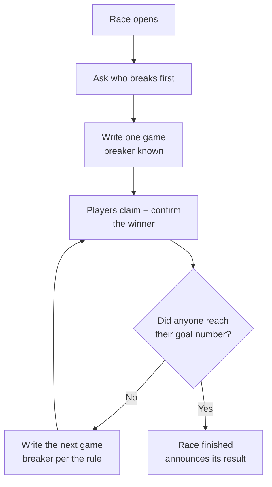

# Self-Scoring for Individual Races

> Successor to `docs/brainstorms/2026-09-08-self-scoring-primer.md`. The primer
> holds the background and the verified starting facts; this document holds the
> decisions.

## Problem Frame

Today one person records every result. In a tournament that person is the
organizer, tapping a winner into the bracket for every match all night. In a
league it is the two captains in the scoring room.

`self_scoring` is a premium tournament feature already sold in the catalog —
"each pair confirms their own winner from their phones" — but the durable target
is larger and is the reason to build it carefully now:

**Individual-race play is coming to leagues.** A league night where each team
puts up one player at a time, that pair plays a race, and both are done for the
night. Five players, five races, no round robin. A design that works for
brackets and gets ported to leagues later is the wrong answer.

Two things make an individual race genuinely different from everything the app
scores today, and neither is about teams:

1. **The number of games is not known in advance.** A race to 5 takes between 5
   and 9 games. Every match the app scores today has a fixed, pre-written game
   list.
2. **The two players may not both have accounts.** A tournament walk-up has no
   login, and today has no server-side identity at all.

## The Race Loop

The race announces. It does not act on the announcement — see R11.

## Requirements

**The race as a primitive**

- R1. A race is **self-sufficient**: it carries everything its loop needs, stamped
  on by whoever creates it, so it never reads outward to a parent. That is: the
  two participants, a **goal number per side**, the **break rule**, the **game
  type**, and the **scoring list** (R12) — plus the ordered list of games that
  grows as they are played. Equal goals is the unhandicapped case; unequal goals
  is what a future handicap feature sets. Nothing else about the race changes
  between those two cases.
- R2. Games are **appended, never pre-created**. The next game is written only
  when every existing game is confirmed *and* neither side has reached its goal.
  A game that was never played must never exist as a row. The append is a
  **single serialized server-side operation** in the same transaction as the
  confirmation that satisfies the gate — both phones evaluate the gate at the
  same instant, so a client-side append would race and write two game 6s. A
  uniqueness constraint on (race, game number) makes the duplicate impossible
  rather than merely unlikely, and the finish announcement (R4) is idempotent so
  a double announce is a no-op.
- R3. Each game records who broke and who won, and becomes official through the
  claim-and-confirm flow. The guarantee is: **one official score per game at all
  times**; an unconfirmed or disputed game is visibly marked as such on both
  phones; a missed realtime message can delay agreement but can never lose it.
  (Not "the two phones are never different" — the reused layer's own contract is
  "delay possible, loss impossible," and a disputed game differs visibly by
  design.)
- R4. When a side reaches its goal, the race is finished and announces its
  result.
- R5. Vacating a confirmed game un-finishes the race as a consequence of R2 —
  the score drops below the goal, the vacated game sits unconfirmed, and no new
  game appears until it is re-scored. Games played after it remain, because they
  really were played. Under winner-breaks their recorded breaker may no longer
  match the rule; that is a historical footnote, not a wrong score.
  **Result rule when a re-score runs past a goal:** re-scoring a vacated
  mid-list game to the other player can push that player to their goal at an
  earlier game number while later games still exist. The winner is the side that
  **first reached its goal in game order**; games after that point are retained
  as history and excluded from the announced score. This matters more with
  unequal goals, where it also decides which side got there first.
- R6. A race opens by naming **who breaks first** — someone taps a name.
  However that was decided (lag, flip, roshambo) happened at the table. After
  that, the break rule takes over and nobody is asked again.

**Ownership and reuse**

- R7. **A race does not know what it belongs to.** Whoever wants a race points
  at one: a bracket match points at its race, a league matchup points at its
  several races, a practice race is pointed at by nobody.
- R8. **The race is built standalone — that is the method, not a feature.** A
  race with no parent must work, and the race is developed and tested that way
  first, so it never entangles with tournament concerns. Tournaments then use it;
  leagues use the same code after. There is **no user-facing practice mode in
  v1** — no button, no lifecycle, no sweep policy to settle. A practice entry
  point later is a small addition precisely because the parentless case is how
  the thing was built.
- R9. **Live league scoring keeps its current behavior.** The `matches` /
  `match_games` tables, `src/player/ScoreMatch.tsx` and
  `src/hooks/useMatchScoringMutations.ts` gain no changes to their write paths.
  Where a shared helper must be widened (R10), it is widened **additively**, with
  the existing team-based call preserved as a thin wrapper, and the existing
  scoring test suite is the verification that round-robin behavior is unchanged.
  (The earlier claim that *nothing in the league path is edited* was too strong:
  R10 and R33 both touch shared code.)
- R10. The race room **reuses** the existing confirmation layer rather than
  reimplementing it — but the reuse is not uniform, and the difference is a real
  cost that must not be discovered mid-build:
  - **Reusable as-is** — `ConfirmationDialog`, `VacateModal`, `DissentFlag`,
    `DisputeBanner` are fully prop-driven (game number, names, flags, callbacks),
    and `deriveDissents.ts` / `deriveDisputes.ts` are pure with no team or table
    knowledge.
  - **Team-shaped, must be widened** — `src/utils/match/pendingConfirmations.ts`
    is not table-agnostic: `gameNeedsMyConfirmation`, `decidePendingAction` and
    `gameHasPendingVacateForMe` each take `userTeamId` and `homeTeamId` and type
    the game as `MatchGame` (which requires `home_position` / `away_position`).
    The team ids are used for exactly one thing — deriving `mySide` — so the
    widening is small: accept a caller-supplied `mySide` and a minimal row shape,
    keeping the team-based signature as a wrapper. See Outstanding Questions;
    the alternative (a race-local predicate) is a second implementation.
- R35. **Race confirmations get their own storage.** `game_confirmations` cannot
  hold them: `confirmer_id` is NOT NULL with a foreign key to `members` (a
  ticket-holding walk-up has none), and `match_id` / `game_id` point at
  `matches` / `match_games`. The race's confirmation table mirrors it — the same
  result-snapshot columns and the same `action` / `is_initiator` semantics — with
  the confirmer expressed as **member id or claim ticket** and the side expressed
  per race participant, so it can be mapped onto the `ConfirmationWithResult`
  shape that `deriveDissents` / `deriveDisputes` already read. This is the
  largest schema decision in the feature and R10's reuse is not free without it.
- R40. The new race tables are added to the `supabase_realtime` publication with
  `REPLICA IDENTITY FULL`, mirroring
  `supabase/migrations/20260525000000_game_confirmations.sql`. Without it the
  room only updates on refresh. Locally this needs a full `supabase stop && start`
  for the realtime container to pick the tables up.
- R11. A finished race **announces**; it never acts. The bracket advances per
  R29. A league counts the matchup per its own existing end-of-night
  verification. The race knows about neither.

**Who may score**

- R12. A race carries an **explicit list of who may score it**, resolved when
  the race is created — not derived from "the two opponents."
- R13. **Both hold an identity** (each is either a logged-in member or a claim
  ticket holder per R18) → both are on the list and both must agree, exactly as
  league scoring works today. This covers registered-vs-registered *and* two
  walk-ups who each scanned the poster.
- R14. **Exactly one holds an identity** → if the organizer allows one-sided
  scoring (R26), the list is that one player; otherwise the list is the
  organizer.
- R15. **Neither holds an identity** → the list is the organizer. Not
  configurable.
- R36. **The organizer is always able to score any race in his own bracket**,
  regardless of the list, and the list **re-resolves** when a participant gains
  an identity (a ticket issued after the race was created adds its holder).
  Without this, R13 has no fallback at all — two registered players, one dead
  phone, and the race is unscoreable and the bracket cannot move.
- R16. A game made official on a **single vouch** is visibly marked as such. A
  one-sided result must not look identical to a mutually-confirmed one. The
  marking must **not rely on hue alone** — it carries a shape, icon, or words —
  per the project's colour-blindness constraint.
- R37. A participant who is **not** on the scoring list still sees the race,
  read-only, and is told who is scoring it. Otherwise a player standing at the
  table who just won a game sees nothing and assumes the app is broken.
- R17. The list must be able to hold **someone on neither side** — the neutral
  scorekeeper wanted for leagues later — by adding a name, not by redesign.

**Walk-up identity**

- R18. **Three kinds of human, not two.** Every entrant is a real player; what
  differs is what they can prove.
  - **A — registered user.** Has an account. Identity is their login.
  - **B — has a phone, can scan, no account.** Identity is a **claim ticket**: a
    server-generated, non-enumerable id issued by scanning the QR, kept in their
    browser alongside the name already stored by
    `src/brackets/paid/walkupMemory.ts`.
  - **C — no phone, no internet.** Can never hold an identity. The organizer
    scores for them.

  Once a ticket counts as an identity, the scoring layer stops caring which kind
  someone is — it asks only "are you on the list?" So A-vs-A, B-vs-B and any
  mixture of the two run the identical path; only C forces the organizer in.
- R43. **Scanning the QR issues a ticket, always — before any name is typed.**
  The ticket says "this device is somebody," not yet "this device is Joe." From
  there the holder either types a new name to enter the waiting room, or enters a
  validation code to attach to an entry that already exists (R44).
- R44. **The organizer validates an entrant he typed in.** Joe Smith is already
  in the tournament because the organizer added him; Joe scans the generic QR and
  holds an unattached ticket. The organizer taps Joe's name — wherever it lives,
  waiting room or bracket — picks **Validate** from the menu, and gets a **large
  6-digit code for Joe Smith specifically**, which he can show, read out, or text.
  Joe enters it and his ticket binds to that participant.
  - The code is **single-use and burns on claim**, so someone who overhears it
    cannot attach themselves to Joe afterwards.
  - Tapping Validate again issues a fresh code, for a leak or a fumbled entry.
  - Validation **binds a ticket to an existing participant**; it never creates a
    new one. Keeping that separate from the join path is what stops a second Joe
    Smith appearing.
- R38. The ticket is issued on the **hopper** row (self-add writes to
  `bracket_hopper`, not `bracket_participants`) and **carried onto the
  participant row** when the organizer admits them and `start_bracket` runs —
  and likewise by `add_late_entry`. Without that carry-over the ticket names an
  identity that no longer exists once the bracket starts, and R21's guard has no
  column to compare against.
- R19. Scoring identity resolves as **a logged-in member OR a valid ticket**,
  and both branches are written together, the first time, as one security
  boundary.
- R20. A participant the **organizer typed in** never joined by QR, so no
  browser holds their ticket; the organizer scores for them. Ticket loss by a
  QR joiner (cleared storage, borrowed phone, second device) degrades the same
  way — the fallback that exists today.
- R39. The organizer can **invalidate and reissue** a participant's ticket. A
  ticket is a bearer credential living in localStorage for the life of the
  tournament; without revocation, a shared venue phone or a screenshotted link
  is unrecoverable except by noticing a bad result afterwards.
- R21. The anonymous scoring write is guarded at least as tightly as
  `add_self_as_walkup`: the race must be live and not complete, and the resolved
  identity (member or ticket) must be **on that race's scoring list** — not
  merely a participant in the race. Checking race membership alone would let the
  walk-up whom R14 deliberately excluded record results anyway, defeating the
  protection. A junk name on a waiting list is an annoyance the organizer tidies;
  a junk result moves a bracket.

**Organizer settings — the Scoring tab**

- R22. A **third setup tab**, alongside Info and Players. Named "Scoring" for
  now (see Outstanding Questions). `src/brackets/paid/BracketSetupPage.tsx`
  already anticipates growth here.
- R23. **Break rule** — alternating break or winner breaks.
- R24. **Race length per bracket side** — e.g. winners side races to 5, losers
  side races to 3. A double-elimination bracket has **three sides**: winners,
  losers, and the grand final; single elimination has one. The grand final
  inherits the winners-side values unless overridden.
- R25. **Game type per bracket side.** `brackets.game_type` already exists and is
  already edited on the Info tab, so it stays the **tournament-wide value** and
  the per-side settings are **optional overrides that fall back to it** — the
  same inherit-unless-overridden pattern as R24. There are never two competing
  sources of truth.
- R26. **Single-player scoring policy** — governs the R14 case only, where
  exactly one side holds an identity (someone with a phone against a category-C
  player who has none). Three positions, the same shape as R27:
  - **Allow** — that player's word stands.
  - **Allow, but confirm with me** — it stands once the organizer okays it.
  - **Manual** — the organizer enters the result himself. The default.

  It does not govern R13 (both hold an identity — they confirm each other, no
  policy needed) or R15 (neither does — organizer only, not configurable).
- R45. **Auto-Confirm carries over unchanged.** A player who trusts their
  opponent can already switch on Auto-Confirm
  (`src/hooks/useScoringParticipationModes.ts`), which accepts the opponent's
  scores with no modal while still recording a real vouch flagged
  `auto_confirmed` — trust is logged, not invisible. Keep its deliberate
  perishability: it survives a refresh but switches off on leaving the scoring
  screen. That matters more in a race than in league play, since one race can run
  nine games off a single tap of trust.
- R27. **Advance policy** — automatic, confirm, or manual (see R29).
- R28. Every setting has a default that produces a runnable tournament. An
  organizer who opens no tabs and touches nothing still gets a working night.

**Bracket integration**

- R29. When a race finishes, the bracket reacts according to the organizer's
  advance policy:
  - **Automatic** — the tree moves; the organizer watches.
  - **Confirm** — "Al beat Dee 5–3. Advance?" arrives on his phone; one tap.
  - **Manual** — nothing arrives; he goes to the bracket and taps the winner
    himself, with the race result sitting there as information.

  **The default is Automatic** (Ed, 2026-09-10). It is the only setting that
  delivers what the feature is sold for, and it fires only after both players
  have already agreed on the deciding game. Confirm and Manual exist for the
  organizer who wants more control; Manual is deliberately the free tier's
  posture, with the players' scores arriving as information.

  Under **Automatic**, the advance executes **server-side inside the same
  ticket-guarded race-scoring function that recorded the goal-reaching
  confirmation**, in one transaction. It is not a client call:
  `advance_bracket_winner` is `REVOKE`d from `anon` and granted only to
  `authenticated`, so the anonymous walk-up finishing the flagship scenario
  physically cannot execute it. The anon path never calls it directly.
- R46. **An unfinished race never blocks the organizer.** Dee walks out at 3–2;
  John tells the organizer, who taps John's name and sets him as the winner —
  the same manual path the free tier uses for every match. No forfeit ceremony,
  no void state, no scoring the remaining games on her behalf: in a tournament,
  someone who leaves is simply gone. The abandoned race keeps the games that were
  actually played, as history.
- R30. **Scoring is always the players'. Advancing is always the organizer's
  dial.** These are two different acts with two different owners, and the
  setting governs only the second.
- R41. **A race whose bracket match is reopened starts over.** Under Automatic,
  a vacate un-finishes a race the tree has already advanced. The organizer clears
  that matchup with `reopen_bracket_match` and the pair score it again from
  scratch — `advance_bracket_winner` cannot correct an already-decided match on
  its own (its guard returns false once `winner_participant_id` is set), so
  reopen is the path, not a fallback. The race room says so plainly rather than
  showing a result the bracket no longer agrees with.
- R31. `reopen_bracket_match` is the way back, but its guard is narrower than it
  looks: it refuses only when the downstream match's `status = 'complete'`. That
  was sound when playing a match was one instantaneous organizer tap. Self-scoring
  makes playing a **duration** — a downstream race four games into a race to five
  is `ready`, not `complete`, so reopen would proceed and NULL a live opponent out
  of a match two people are mid-race in. **Extend the guard**: a bracket match
  with a live race counts as being played.
- R42. **A match going in progress is what creates its race.** The organizer
  taps it ("Ed and Claude, table 5"); both players' pages see the flip live —
  `bracket_matches` is already published for realtime with full row data — and
  the race becomes enterable. This settles several things at once: both seats are
  filled by then so the scoring list (R12) can be resolved, byes and empty seats
  never get a race because they cannot be started, no anonymous player has to
  create anything, and `add_late_entry`'s existing `in_progress` guard already
  protects a match being played. When table assignment ships, whatever frees a
  table sets the flag instead of the organizer's thumb — same door, different
  hand on it.

**League translation**

- R32. The same race, unchanged, must serve a league night of N individual
  races. This is the acceptance test for the whole design: if the league case
  needs a second implementation of the loop or the confirm flow, the design
  failed.
- R33. A league running individual races will need standings and stats to read
  race games as well as `match_games`. That is read-side work only, so it cannot
  take live scoring down, and round-robin leagues are entirely unaffected.

**Display (v1)**

- R34. A minimal race scoreboard: the two names, games won, and each side's goal.
  The per-game list shows game number, who broke, and who won — which is
  informative for a race, unlike showing the same two names nine times.
  Deliberately provisional; the modular scoreboard supersedes it.

## Success Criteria

- An organizer buys the feature, sets nothing, starts a tournament, and every
  race between two identity-holding players is scored by those players without
  him entering a result. (What an *untouched* walk-up tournament delivers depends
  on R26's default — see Outstanding Questions.)
- Two strangers who both scanned the poster — neither with an account — can
  score their own race against each other.
- There is one official score per game at all times, and a disagreement surfaces
  at the game where it happened rather than at the end.
- The race storage and the confirm loop need no change to run a league night of
  five individual races; only standings and stats readers do.
- Round-robin league scoring behaves identically before and after this work,
  verified by the existing scoring test suite — shared helpers are widened
  additively and no league write path changes.

## Scope Boundaries

Deliberately **not** in this work:

- **Notifications** ("you're up on table 5") and **venue/tables** (assignment,
  the live board of tables in progress) — two separate unbuilt premium features.
  This design leaves sockets for them; it does not build them.
- **Handicapped races** — a separate premium feature. It will *set* the per-side
  goal numbers of R1. Unhandicapped self-scoring must not depend on it.
- **Break-and-run and golden-break tracking** inside a race. Later.
- **The modular scoreboard.** R34 is a placeholder by agreement.
- **Phase D saved setups.** Phase D is a save/load mechanism layered over
  whatever settings exist by then — not the home for these settings.
- **A user-facing practice mode.** Parentless races work by construction (R8),
  but no button ships in v1. A later practice feature reuses the same code, and
  "keep my practice stats" on top of that becomes simply *don't sweep this one*.
- **A house-rules tab.** A good later use of the word "Rules", next to the
  existing BCA rulebook in `src/officalBCARulebook/`.
- **Editing `ScoreMatch.tsx` or the league scoring tables.** Non-negotiable.

## Key Decisions

- **The race gets its own storage, and parents point at it.** The alternative —
  reusing the league match tables — is blocked outright: `matches` requires both
  `season_id` and `season_week_id`, so a tournament match would need a fake
  season, a fake week, fake teams and fake lineups. Four fabrications. The other
  alternative, loosening those constraints, modifies the one path that must
  never break.
- **Append-as-you-go, gated on "all confirmed and no goal met."** One rule that
  also delivers correct vacate behavior for free, and forces break assignment to
  happen when the breaker is actually knowable — which is what winner-breaks
  requires anyway.
- **Per-side goal numbers rather than one race length.** The app already models
  this shape (`matches.home_games_to_win` / `away_games_to_win`), and it means
  the handicap feature later changes numbers rather than structure.
- **A second, smaller room — not a generalized one.** `ScoreMatch.tsx` is 1,485
  lines, with 87 lines mentioning teams, 118 mentioning lineups and 34 mentioning
  positions; a race needs none of them. Its confirmation *components* are fully
  prop-driven and reusable as-is, but the predicates in `pendingConfirmations.ts`
  are team-shaped and need widening, and race confirmations need their own table
  (R10, R35). Separate room, shared parts — with the shared parts honestly
  priced.
- **Who-may-score stored as a list.** Ed's three cases produce three different
  lists, and the future neutral scorekeeper is a fourth. Deriving it from "the
  two opponents" would have to be undone later.
- **Claim tickets built into v1, guest UI optional.** The identity check is one
  branch in a function being written from scratch either way; adding it later
  means a second security pass on a live scoring path. The token column, the
  join returning it, and the browser storing it are near-free and avoid any
  "participants without tickets" case.
- **The app does not referee the first break.** No in-app lag, no coin flip in
  v1. The `coin_flip` Tiebreak Mechanism in the locked canon is deliberately
  *not* reused — its job is picking a match winner from a tie, which is a
  different job; a separate coin-flip mechanism is being built elsewhere.
- **Conservative defaults, and the paywall is the gate.** Self-scoring is a
  purchased opt-in feature, which is gate enough; no second feature flag. Within
  it, walk-up self-scoring defaults off.

## Dependencies / Assumptions

- **The QR join door ships with `self_scoring`.** Today
  `src/brackets/paid/JoinQrPoster.tsx:45` renders nothing without the separate
  "Real players & sign-up" feature (`real_players`), and
  `src/brackets/paid/BracketSetupPage.tsx:101` short-circuits the whole setup
  page without it — so the QR and the Scoring tab would both be unreachable. That
  is a gating choice in our own code, not a technical limit, and self-scoring
  cannot function without the QR: every category-B identity starts with a scan
  (R43). So buying self-scoring makes the QR door available. Note the pricing
  consequence: the two features now overlap, which may deserve a look before real
  money is wired up.
- Assumes leagues always have at least one registered player per team (usually
  the captain), so the walk-up identity problem is tournament-only.
- `in_progress` on `bracket_matches` is no longer purely the organizer's manual
  signal — R42 has the first confirmed race game set it, which is what
  `add_late_entry`'s guard already anticipates. The perfect-world version where a
  match *starts* itself still depends on table assignment, a different feature.
- Assumes bracket data stays disposable (swept). Note that a race is not
  reachable from a bracket's cascade delete, because R7 points the key the other
  way — see Outstanding Questions.

## Outstanding Questions

### Resolve Before Planning

*(none — all blocking questions resolved.)*

### Deferred to Planning

- [Affects R10][Technical] Widen `pendingConfirmations.ts` to take a
  caller-supplied `mySide` (keeping the team-based signature as a wrapper), or
  write a race-local predicate. The first edits a file on the live scoring path;
  the second is a second implementation.
- [Affects R7][Technical] **Orphaned races.** `sweep_stale_brackets` cascades to
  `bracket_matches`, but a race those matches pointed *at* is not reachable from
  that delete and survives — and a surviving parentless race is indistinguishable
  Likely fix: give the race its own `last_activity_at` so an orphan can age out
  without a parent. Same question decides where the anon write path reads the
  purchased-feature gate from.
- [Affects R22][User decision] **Tab name and placement.** "Scoring" is
  provisional. Ed named the real tension and it should not be lost: race length
  and game type read as *format* and could arguably live on the Info tab, while
  the one-sided and advance policies are organizer preferences and are objectively
  not rules — yet splitting them scatters one coherent setup. "Rules" is ruled
  out; it belongs to the BCA rulebook and future house rules.
- [Affects R23, R24, R25, R27][User decision] R28 requires every setting to have
  a default, but only R26's is named. Pick the shipped default for break rule,
  race length per side, game type per side, and advance policy.
- [Affects R22][User decision] The catalog already promises buyers "You'll pick
  one thing" (`src/brackets/paid/premiumFeatures.ts:65`), and this design delivers
  five settings. Either collapse the format settings behind an "Advanced"
  disclosure so the one-sided policy is the visible choice, or update the blurb
  before it is charged against.
- [Affects R29][Technical] How the confirm-mode prompt reaches the organizer with
  no notification feature built. Likely an in-app pending-advance queue on the
  bracket he already has open.
- [Affects R32][Needs research] Write the league individual-race night out
  concretely — five races, one matchup, who scores each, what standings read — so
  R32's acceptance test can be walked during *this* build rather than discovered
  during the league one.
- [Affects R33][Technical] Which standings and stats readers need to learn about
  race games, and whether that is in scope for the league phase rather than this
  one.
- [Affects R18][Technical] What the QR joiner sees while ticket issuance is in
  flight or has failed.
- [Affects R16][Technical] Whether the single-vouch mark propagates beyond the
  race room — onto a bracket advanced from a single-vouch race, or a standings
  row fed by one.

## Next Steps

-> `/ce:plan` for structured implementation planning.
