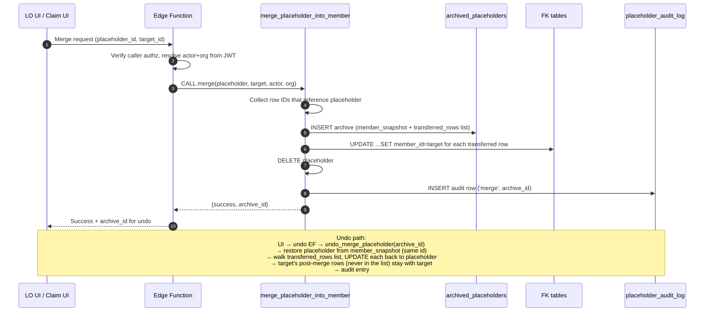
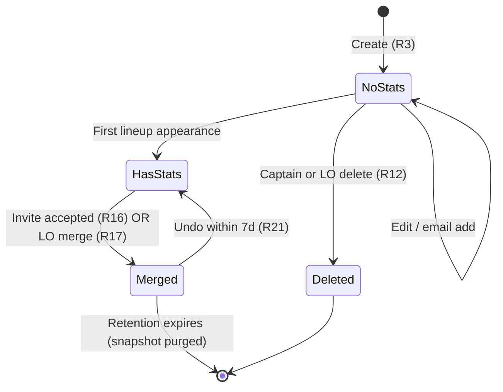

# feat: Rebuild placeholder-player lifecycle (creation, merge, audit)

## Overview

Rebuild the placeholder-player lifecycle end-to-end: faster creation, visual tagging, safe deletion, LO-driven merge with archive-based undo, and first-class audit logging. Live-league testing surfaced placeholder management as the single biggest friction point. This plan extends the shipped claim/merge pipeline (`src/login/ClaimPlayer.tsx` → `supabase/functions/claim-placeholder/` → `merge_placeholder_into_member` RPC) rather than replacing it, fixes one latent data-integrity bug (`match_lineups.playerN_id` columns are plain UUIDs, not declared FKs, so the schema-aware merge loop silently misses them), and adds three new primitives: a `placeholder_has_stats` SQL predicate, an `archived_placeholders` table (snapshot + transferred-row-IDs), and a `placeholder_audit_log` table. An unused `merge_requests` table from a prior feature attempt is removed.

## Problem Frame

Placeholders are `members` rows with `user_id = NULL` — captain- or LO-created stand-ins used so matches can be played before everyone signs up. Live testing exposed five failures, carried forward from the origin document:

1. **Creation is a maze.** Modal-on-modal with 7 required fields, some (city, state) that captains don't know.
2. **Wizard cache bug.** New placeholders don't appear in the slot or dropdown until page refresh.
3. **No visual tag.** Placeholders are indistinguishable from registered users on every surface, including live scoring.
4. **No disposable vs. stats-carrying distinction.** No-stats placeholders should be captain-deletable; stats-carrying ones must be merged, never deleted.
5. **No LO-facing merge UI.** Only an email-invite path exists; operators have no direct tool to resolve the backlog.

Scope also includes two safety gates established during document review: confirm-before-send on invite dispatch, and accepting-user confirmation before auto-merge fires.

**UX principles layered on during planning** (direct user guidance, captured here since it changes several rules from the origin brainstorm):

- **Captains manage their own team, period.** A captain can add, remove, or swap any player on their team — registered or placeholder, with or without stats. Removal from a team ≠ deleting the person. Previous "contact your LO to remove this player" wall is gone.
- **No permission walls where a safety net works.** Anywhere the system might have said "you can't do that," it now says "here's what will happen — confirm?" and makes the action reversible.
- **Undo everywhere.** Every destructive action (remove from team, delete placeholder, merge) drops into a **Recently Removed** panel on the relevant page for 24 hours with one-click restore. After 24h, LO can still restore from the 1-year archive.
- **Plain-language inline help at every decision point.** "When they sign up, their stats will link automatically." "This player has 8 games. They'll be archived for a year — your LO can restore them." No cryptic errors, no buried contact-support messages.
- **The system should never be the reason something is hard.** If a 90-year-old LO or a distracted captain at a bar can't figure it out in 5 seconds, the UI is wrong.

(see origin: `docs/brainstorms/placeholder-player-improvements-requirements.md`)

## Requirements Trace

R1–R22 map back to the origin document. R23–R26 were added during planning based on direct user guidance — captured here rather than sent back through the brainstorm because they tighten the "easy, idiot-proof" philosophy the origin implied but didn't spell out.

**Creation & combobox**
- **R1–R7** — Creation UX (no-results state, inline add, reduced fields, save-and-add-another, combobox cleanup)

**Wizard fix**
- **R8** — Wizard stale-cache fix

**Visual tagging**
- **R9–R11** — Two-state visual tag everywhere

**Roster & delete (expanded from origin)**
- **R12** — Captain or LO may delete a placeholder with zero stats directly
- **R13** — A placeholder with stats may be removed from a team by the captain or LO. If the captain removes one from its only team, the placeholder is **archived** (soft-deleted, restorable for 1 year), not hard-deleted. The LO can restore or merge it at any point.
- **R23** (new) — A team captain may remove **any** member from their team's roster, registered or placeholder. Removing a registered player takes them off this team but keeps their account and historical stats intact. No LO permission required for this action.

**Invite & merge**
- **R14–R21** — LO merge pipeline (listing, picker, archive, undo, confirmations)

**Audit & safety net (expanded)**
- **R22** — First-class audit log
- **R24** (new) — Every destructive action (remove from team, delete placeholder, merge) appears in a **Recently Removed / Recently Changed** panel on the relevant page for 24 hours with one-click restore. After 24h, LO can restore from the 1-year archive.
- **R25** (new) — Every destructive or confirming UI surface uses plain-language inline copy explaining what will happen and what is reversible. No cryptic errors. No "contact your LO" dead-ends — if the action can't be done, the UI explains who can do it and offers a one-click "ask your LO" path.
- **R26** (new) — Empty roster slots, new placeholder rows, and unresolved merges all surface inline helper prompts ("Player not registered? Invite them." / "Suggested: merge this placeholder with Bob Smith?"). The UI nudges the next obvious action rather than waiting for the user to find it.

## Scope Boundaries

Preserved from the origin document:

- Not building a public "claim yourself by name" flow
- Not supporting cross-organization merges
- Not building a full merge history browser (single-level undo is enough)
- Not addressing placeholder-to-placeholder deduping
- Not redesigning the claim/invite email template
- Not introducing a new auth path for placeholder-only users

### Deferred to Separate Tasks

- **Broader `MemberCombobox` redesign** (keyboard navigation, mobile tap-target pass, full affordance rework): follow-up brainstorm. This plan addresses only the R7 items (dead chip removal, legible states).
- **RLS re-enablement for placeholder tables**: a separate project-wide security pass. Org-scope in this plan is enforced in the Edge Function + query args, which is the project's current convention.
- **Placeholder-to-placeholder dedup UI**: follow-up after first production merges expose how often this occurs.
- **`send-invite` retry/bounce handling**: existing behavior preserved; improvement is a separate task.

## Context & Research

### Relevant Code and Patterns

Files the plan extends or references (all paths repo-relative):

**Frontend:**
- `src/components/MemberCombobox.tsx` — single player-selection surface; has dead filter chips (lines 166–179) and a raw `<button>` trigger (lines 120–126) that violates the project's shadcn-everywhere rule
- `src/components/CreatePlaceholderModal.tsx` — current 7-field form, to be simplified and inlined
- `src/components/PlayerNameLink.tsx` — already branches on `isPlaceholder`; central extension point for the badge rollout
- `src/components/modals/PlaceholderRemovalModal.tsx` — currently blocks all captain deletes; to be split by `has_stats` predicate
- `src/login/ClaimPlayer.tsx` — existing invite-accept page; gets a confirmation screen + "This isn't me" path
- `src/operator/` — LO pages; new `LOMergeTool.tsx` lands here
- `src/navigation/NavRoutes.tsx` — operator pages are lazy-loaded via `withOperator(...)` (lines 98–107); mirror that pattern
- `src/wizards/teams-v2/steps/CaptainsTeamsStep.tsx` (line 25) — uses `queryKey: ['all-members']`, never invalidated by the mutation — the R8 root cause
- `src/api/mutations/members.ts` — `createPlaceholderMember` (lines 361–409) — invalidates `['members']` and `['availableMembers']` (keys that don't match the wizard's)
- `src/api/queryKeys.ts` — centralized key factory; standardize on `queryKeys.members.all`
- `src/api/hooks/useMemberSearch.ts` / `src/api/queries/memberSearch.ts` — member-search cache layer
- `src/types/member.ts` — `isPlaceholderMember`, `getPlayerDisplayName`, `getPlayerNickname` (88 call sites for badge audit)

**Backend / Supabase:**
- `supabase/functions/claim-placeholder/index.ts` — Edge Function that verifies `userEmail === inviteEmail` and calls the merge RPC
- `supabase/functions/send-invite/index.ts` — existing invite dispatcher with app-level dedup
- `supabase/migrations/20251217152629_merge_placeholder_player.sql` — `merge_placeholder_into_member` RPC (schema-aware FK loop via `information_schema`)
- `supabase/migrations/20251217144653_invite_tokens.sql` — `unique_pending_invite` constraint on `(member_id, email, status)`
- `supabase/migrations/20251216121115_placeholder_player_merge_system.sql` — `merge_requests` table (exists, unwired to any UI today; extend, don't recreate)
- `supabase/migrations/20251219113254_get_operator_placeholders.sql` — existing org-scope list RPC
- `supabase/migrations/20251219113430_remove_placeholder_from_team.sql` — current PP-remove RPC (basis for R12 delete path)
- `supabase/migrations/20251130010824_baseline.sql` (lines 1457+) — `match_lineups.playerN_id` columns; not declared as FKs — the data-integrity gap
- `supabase/migrations/20260418000003_add_matches_system_snapshot.sql` — `matches.system_snapshot` JSONB precedent for R18 snapshot shape

**Conventions:**
- `sonner` toasts via `import { toast } from 'sonner'`
- `useConfirmDialog` hook (alert-dialog wrapper) for destructive confirms
- Raw `useState` forms, not `react-hook-form` (installed but unused)
- shadcn `Dialog` for modals (no `sheet.tsx` exists)
- Client → Edge Function (auth) → RPC (`SECURITY DEFINER`, granted to `service_role` only)

### Institutional Learnings

- `memory-bank/API-HOOKS-USAGE.md` — 15-min `members` staleTime contributes to R8; canonical pattern is `queryClient.setQueryData` for optimistic updates + `invalidateQueries` for invalidations
- `memory-bank/CENTRAL-DATABASE-IMPLEMENTATION.md` — matches the invalidate-after-RPC pattern
- `memory-bank/PLAN-email-invites.md` — email-invite pipeline shipped in phases 1–9; phase 10 (PP removal) is in progress and overlaps R12/R13
- `memory-bank/BRANCH-placeholder-players.md` — what shipped, what was deferred; notes that `memberSearch.ts` hides placeholders already on a team (R1/R2 interaction)
- `RLS_ANALYSIS.md` — RLS is globally **disabled** in this project; authorization is at UI + Edge Function + query layer
- Two parallel hook trees (`@/hooks` vs `@/api/hooks`) exist — inconsistent imports silently bypass TanStack caching; prefer `@/api/hooks` and note any stragglers for cleanup

### External References

None. Local patterns are sufficient and well-worn.

## Key Technical Decisions

1. **Extend `merge_placeholder_into_member`; do not fork.** The shipped RPC already discovers FK columns via `information_schema` and rewrites them. Add the archive step (snapshot + transferred_rows list) inside the same function so both the LO-initiated merge (R17) and the invite-accept merge (R16) share one reversible pipeline. (see origin: Key Decisions — Snapshot-before-merge + undo)

2. **Archive model: single `archived_placeholders` table with snapshot + row-ID list.** The merge function, as it walks the `information_schema` FK loop, records each `{table, row_id}` pair it's about to rewrite. That list — plus a JSONB snapshot of the full `members` row — lives in one `archived_placeholders` table. Undo walks the list, flips those specific rows back, and restores the placeholder from the snapshot. Anything the target user did after the merge is never in the list, so it stays with the target automatically. This replaces the earlier `last_merge_id`-columns-on-every-table approach: one table instead of ten, no permanent schema tax, simpler undo semantics.

3. **Drop the unused `merge_requests` table.** A 2025-12 migration added `merge_requests` for an approval-queue workflow that was never wired to a UI. Leaving it in place alongside `archived_placeholders` creates two similar tables with overlapping purpose. The plan deletes `merge_requests` in the same migration that creates the archive table.

4. **Single `placeholder_has_stats(member_id UUID) → BOOLEAN` SQL function.** One definition, three call sites (R10 tag color, R12/R13 delete guard, R19 two-stats confirmation). Canonical rule: *the member appears as `match_lineups.playerN_id` in at least one match*. No status filter — the schema has no void/cancel concept today; if one is added later, this predicate gets updated at that time. (see origin: Key Decisions — Single "has stats" predicate)

5. **Fix the `match_lineups.playerN_id` FK gap by declaring the constraints.** Preferred over bespoke UPDATE statements: once declared, `information_schema` surfaces them and the merge RPC's existing loop rewrites them automatically. Any future lineup-like tables enroll automatically.

6. **Org scope enforced in the Edge Function and RPC args, not RLS.** RLS is disabled project-wide. The LO merge path: client → `lo-merge-placeholder` Edge Function (verifies caller's `organization_staff` row) → `merge_placeholder_into_member(..., p_org_id)` RPC (re-verifies the placeholder belongs to that org via the existing team → season → league → organization chain).

7. **Invite dispatch stays UI-gated, not mutation-hooked.** Entering an email writes to `members`; firing the invite is a separate explicit button click. No triggers on the members table, no magic. Reuses the shipped `send-invite` Edge Function — **but that Edge Function currently has no caller authz check** (see review finding: any authenticated user can fire invite emails to arbitrary addresses on behalf of any team). Before this plan ships, `send-invite` needs a Bearer-token check that verifies the caller is the captain of the supplied `teamId` or in `organization_staff` for that team's org. Add as Unit 9 prerequisite or spin as its own pre-work unit. (see origin: Key Decisions — Confirm-before-send for the claim invite)

8. **Retention: 1-year archive window, default to read-side filter over physical purge.** Archive rows carry `expires_at = created_at + 1 year`. Undo UI and LO list queries filter on `expires_at > now()`. Physical purge via a scheduled Edge Function is optional — only introduce it if archive row count grows beyond ~100k or compliance requires hard deletion. `pg_cron` has no existing use in this project; don't introduce it here.

9. **`PlaceholderBadge` is a shared component, rolled out primarily via `PlayerNameLink`.** One component, two variants (`"placeholder"` / `"needs-merge"`), coverage through the existing `PlayerNameLink` wrapper. Direct call sites of `getPlayerDisplayName` that bypass `PlayerNameLink` get audited and either wrapped or upgraded to render the badge.

10. **Wizard query-key fix is also a small cleanup pass.** Standardize the wizard, the mutation, and any adjacent callers on `queryKeys.members.all`. Remove hardcoded string keys (`['all-members']`, `['availableMembers']`) so the mismatch cannot recur.

11. **Safety nets over permission walls.** Captains manage their own teams end-to-end — add, remove, and swap any player (registered OR placeholder, with OR without stats) without needing LO approval for normal operations. Every destructive action has a 24-hour Recently Removed panel with one-click restore, plus a 1-year archive LO can restore from. Replaces the earlier "contact your LO to remove this player" rule, which was a wall, not a safety net. The LO is the recovery path, not the permission gatekeeper.

12. **Plain-language copy everywhere.** No error codes, no jargon, no "contact support." Every confirmation tells the user in one sentence what will happen and how to undo it. Every blocked action explains who can do it and offers a one-click "ask your LO" path rather than a dead end.

13. **The UI nudges the next step.** Empty roster slot shows "+ Add player." Placeholder rows have visible action icons (invite, edit, remove). LO Placeholders page surfaces "Suggested: merge with Bob Smith?" and "Jane never accepted — resend?" where applicable. Users never have to hunt for the next action.

## Open Questions

### Resolved During Planning

- **[R8] Wizard stale-cache root cause** → mismatched query keys: `CaptainsTeamsStep.tsx:25` uses `['all-members']`; `createPlaceholderMember` in `src/api/mutations/members.ts` invalidates `['members']` and `['availableMembers']`. Fix: migrate all three callers to `queryKeys.members.all`.
- **[R15] Auto-invite dedup rules** → UI-gated confirm-before-send removes the ambient-dispatch problem; the existing `unique_pending_invite` DB constraint plus app-level reuse in `send-invite/index.ts` cover (member, email) dedup.
- **[R18, R21] Archive storage format** → single `archived_placeholders` table with `member_snapshot JSONB` + `transferred_rows JSONB` (list of `{table, row_id}`). Retention window is 1 year. The unused `merge_requests` table from a prior feature is removed in the same migration.
- **[R14, R17] Org-scope chain** → verified via existing `get_operator_placeholders` RPC; chain is `team_players → teams → seasons → leagues → organization_id`. New unique-PP listing needs client-side aggregation or a slim extension RPC.
- **[R10] "Has stats" definition** → any appearance in `match_lineups.playerN_id`. No status filter (schema has no void/cancel concept). Encoded once in `placeholder_has_stats()`.
- **[R20] FK rewrite inventory** → existing dynamic loop covers declared FKs. The `match_lineups.playerN_id` gap is fixed by Unit 1 (declaring the constraints). Other tables (`conversation_participants.user_id`, `matches.swap_new_player_id`, verifier columns, `merge_requests.*`, etc.) are already declared FKs and already covered.

### Deferred to Implementation

- Exact JSONB shape of `snapshot_payload` — start with the full `members` row, plus denormalized team/handicap context for display in undo UI. Refine during Unit 3.
- `placeholder_audit_log` column set — pick during Unit 6, guided by which signals the LO merge UI surfaces.
- Inline panel layout (inside the popover vs. sibling drawer) — prototype both during Unit 8 and pick via screenshot review.
- Exact copy for the accept-invite confirmation screen, "This isn't me" routing message, delete-blocked message, and two-stats confirmation — draft during the relevant UI units.
- Mobile fallback for combobox + inline panel — **out of scope per R7**; if the lift is trivial while in the file, land it opportunistically.
- Name pre-population parser (e.g., "John Smith" → "John" / "Smith"; "Maria de la Cruz" → "Maria" / "de la Cruz"; "Lefty" → "Lefty" / "") — simple rule: first whitespace token → first name, remainder → last name, single token → first name only with empty last. Plumbed in Unit 9.

## High-Level Technical Design

> *This illustrates the intended approach and is directional guidance for review, not implementation specification. The implementing agent should treat it as context, not code to reproduce.*

### Merge + Undo data flow

### Placeholder lifecycle (state view)

## Implementation Units

Units are grouped into phases so independent pieces can ship incrementally. Phase B (wizard fix) should ship first — it unblocks live testing without waiting on any other work.

### Phase A — Backend foundations

- [ ] **Unit 1: Declare `match_lineups.playerN_id` foreign keys**

**Goal:** Close the latent data-integrity bug where the shipped merge RPC's schema-aware FK loop silently misses `match_lineups.player1_id` through `player5_id`. Declaring these as proper FKs to `members(id)` automatically enrolls them in the merge loop and in the new undo path.

**Requirements:** R20 (and foundational for R16, R17 correctness)

**Dependencies:** None

**Files:**
- Create: `supabase/migrations/YYYYMMDDHHMMSS_add_match_lineups_player_fk.sql`
- Reference: `supabase/migrations/20251130010824_baseline.sql` (lines 1457+ define `match_lineups` today)

**Approach:**
- Add FK constraints `match_lineups_player1_id_fkey` through `_player5_id_fkey` referencing `members(id)` with `ON DELETE NO ACTION` (do **not** cascade — the merge RPC rewrites references before deleting).
- Run a pre-constraint scan for orphan rows (placeholder member_ids already deleted). Log findings for manual cleanup. The migration should fail loudly if orphans exist rather than silently adding a constraint that will be violated by existing data.
- Confirm the existing `merge_placeholder_into_member` loop picks these up by examining `information_schema.referential_constraints` after the migration runs.

**Execution note:** Validate the migration against a dump of production data in a staging environment before applying — if orphan rows exist, they must be reconciled first.

**Patterns to follow:**
- FK declaration style of `supabase/migrations/20251130010824_baseline.sql` around the declared `team_id` / `match_id` FKs on `match_lineups`

**Test scenarios:**
- Happy path: Run the migration on a clean test database → `SELECT constraint_name FROM information_schema.table_constraints WHERE table_name='match_lineups' AND constraint_type='FOREIGN KEY'` returns 7 rows (team_id, match_id, player1..player5).
- Edge case: Apply the migration against a DB with a deliberately inserted orphan (lineup row with a nonexistent `player3_id`) → migration fails with a clear message naming `match_lineups.player3_id` and the offending row's `id`.
- Integration: After migration, call `merge_placeholder_into_member` with a placeholder referenced by a lineup's `player2_id` → the lineup row's `player2_id` is updated to the target member_id and no orphan remains.

**Verification:**
- All lineup columns appear in `information_schema.referential_constraints` referencing `members.id`.
- An audit query finds zero orphan player_id values in `match_lineups` post-migration.

---

- [ ] **Unit 2: `placeholder_has_stats(member_id uuid) RETURNS boolean` SQL function**

**Goal:** Single canonical predicate for "this placeholder has played" — the one definition shared by R10 tag color, R12/R13 delete guard, and R19 two-stats confirmation.

**Requirements:** R10, R12, R13, R19

**Dependencies:** Unit 1 (so the function can traverse `match_lineups` FKs consistently, though not strictly required at definition time)

**Files:**
- Create: `supabase/migrations/YYYYMMDDHHMMSS_placeholder_has_stats_function.sql`

**Approach:**
- **Definition:** `EXISTS (SELECT 1 FROM match_lineups ml WHERE ml.player1_id = $1 OR ml.player2_id = $1 OR ml.player3_id = $1 OR ml.player4_id = $1 OR ml.player5_id = $1)`. Any lineup appearance counts. No match-status filter — the project has no concept of voiding/cancelling a match today; if that concept is introduced later, this predicate gets updated at that time.
- Mark as `STABLE` and `SECURITY INVOKER` (no privilege escalation; read-only).
- Benchmark against realistic data volume before deploy — if per-row cost on a 200-placeholder LO dashboard exceeds ~100ms, materialize as a trigger-maintained `members.has_stats_cached BOOLEAN` or partial index before first production use.

**Patterns to follow:**
- Function-declaration style of `supabase/migrations/20251217152629_merge_placeholder_player.sql`
- `CREATE OR REPLACE FUNCTION` with explicit `LANGUAGE plpgsql` + SQL-safety settings

**Test scenarios:**
- Happy path: insert a placeholder, call `placeholder_has_stats(id)` → returns false. Insert a `match_lineups` row referencing them in any match → returns true.
- Edge case: member with auth account (`user_id IS NOT NULL`) and lineups → still returns true (function is indifferent to placeholder vs. registered; callers scope by `user_id IS NULL` separately).
- Error path: passing a non-existent member_id → returns false (not an error; function is total).
- Integration: after merge, the deleted placeholder's id returns false (row no longer in `match_lineups` because FK was rewritten) — informs the invariant used by the audit log.

**Verification:**
- Function exists and returns expected values for the test fixtures.
- Exactly three call sites reference it: tag-color query, delete guard, two-stats confirmation query (tracked by grep in later units).

---

- [ ] **Unit 3: `archived_placeholders` table (replaces the unused `merge_requests`)**

**Goal:** Store a complete snapshot of every placeholder at merge time — the member row plus the IDs of every row that belonged to them — so undo can restore the placeholder and pull those specific rows back from the target user.

**Requirements:** R18, R21

**Dependencies:** Unit 1

**Files:**
- Create: `supabase/migrations/YYYYMMDDHHMMSS_archived_placeholders_table.sql`
- Delete the existing unused `merge_requests` table in the same migration (it was added in `20251216121115_placeholder_player_merge_system.sql` for an approval workflow that never got wired up; leaving it creates ambiguity about which table is the source of truth).

**Approach:**
- `archived_placeholders` columns:
  - `id UUID PRIMARY KEY DEFAULT gen_random_uuid()`
  - `placeholder_member_id UUID NOT NULL` (the deleted placeholder's original id — no FK because the row is gone; used by undo to restore with the same id)
  - `target_member_id UUID NOT NULL REFERENCES members(id)` (who it was merged into)
  - `organization_id UUID NOT NULL`
  - `actor_member_id UUID NOT NULL REFERENCES members(id)` (who initiated)
  - `actor_role TEXT NOT NULL CHECK (actor_role IN ('invite_accept', 'lo_initiated'))`
  - `member_snapshot JSONB NOT NULL` (the full placeholder `members` row at merge time)
  - `transferred_rows JSONB NOT NULL` (list of `{table_name, row_id}` pairs — every row whose `member_id` pointed at the placeholder and was rewritten to the target)
  - `undone_at TIMESTAMPTZ`
  - `created_at TIMESTAMPTZ NOT NULL DEFAULT now()`
  - `expires_at TIMESTAMPTZ NOT NULL DEFAULT (now() + interval '1 year')` (archive retention for support/manual recovery; first-class UI undo surfaces recent merges at the top of the LO page)
- Indexes: `(organization_id, created_at DESC)` for LO queue scans; `(target_member_id)` for "did this user absorb a placeholder" checks; `(placeholder_member_id)` for "what happened to this PP" queries.
- **Access control** (critical since RLS is globally disabled): explicitly add an RLS policy on `archived_placeholders` DENYING SELECT/UPDATE/DELETE for `anon` and `authenticated` roles; only `service_role` reads. The `member_snapshot` contains PII. LO access (for undo UI) goes through a dedicated Edge Function that verifies org membership before reading.
- **No `last_merge_id` columns on other tables.** The row-IDs list in `transferred_rows` is the canonical record of what a merge moved. Undo walks that list and flips `member_id` back to the restored placeholder. This keeps the machinery contained to one table; the existing members-referencing tables are untouched structurally.
- If a user requests account deletion (GDPR-style), any archive rows referencing their id are purged immediately regardless of `expires_at` — separate from the retention timer.

**Patterns to follow:**
- `matches.system_snapshot` JSONB column in `supabase/migrations/20260418000003_add_matches_system_snapshot.sql`

**Test scenarios:**
- Happy path: insert a row with all fields → `expires_at` defaults to now + 1 year; required fields enforced.
- Edge case: insert without `member_snapshot` or `transferred_rows` → NOT NULL constraint fails.
- Edge case: `merge_requests` table is dropped cleanly — no downstream code references it (grep confirms).
- Access control: an `anon` or `authenticated` client SELECT on `archived_placeholders` is rejected by the DENY policy.

**Verification:**
- `archived_placeholders` exists with expected columns, indexes, and DENY policy.
- `merge_requests` no longer exists; no code references remain.

---

- [ ] **Unit 4: Extend `merge_placeholder_into_member` with snapshot + merge_id tagging**

**Goal:** Make the single shared merge procedure write an archive record (member snapshot + list of transferred row IDs) and emit an audit entry. Both R16 (invite-accept) and R17 (LO-initiated) use this same function, so both become reversible without path-specific work.

**Requirements:** R16, R17, R18, R20, R22

**Dependencies:** Units 1, 2, 3, 6

**Files:**
- Modify (or supersede via a new migration): `supabase/migrations/YYYYMMDDHHMMSS_merge_placeholder_snapshot_and_audit.sql`
- Reference: `supabase/migrations/20251217152629_merge_placeholder_player.sql`

**Approach:**
- Add parameters: `p_actor_member_id UUID`, `p_actor_role TEXT`, `p_organization_id UUID`. All three are **server-resolved** by the calling Edge Function from the caller's JWT + `organization_staff` — never accepted from client request bodies. Making them client-supplied would let a valid LO falsify audit entries or spoof another org.
- Backward compatibility: because the parameter list is changing, create a **new overload** (`merge_placeholder_into_member_v2(...)`) rather than `CREATE OR REPLACE`-ing the existing signature. Migrate `claim-placeholder` Edge Function to the v2 signature in the same release; drop the v1 signature in a follow-up migration once deploys are stable.
- Add **same-match collision detection** before FK rewrites: if the placeholder and target both appear in `match_lineups` for the same `match_id`, raise `'merge_would_create_duplicate_in_match'` with the conflicting match IDs. Silently duplicating a member across two slots of one lineup corrupts stats permanently.
- New step 1 — **build the `transferred_rows` list AS the FK loop runs**. Before each `UPDATE table SET member_id = target WHERE member_id = placeholder`, `SELECT` the row IDs that would be updated and append `{table_name, row_id}` entries to an accumulator. This becomes `archived_placeholders.transferred_rows` at merge-commit time.
- New step 2: `INSERT INTO archived_placeholders (placeholder_member_id, target_member_id, organization_id, actor_member_id, actor_role, member_snapshot, transferred_rows) VALUES (...) RETURNING id INTO v_archive_id;` with `member_snapshot` built from `SELECT to_jsonb(m.*) FROM members m WHERE id = p_placeholder_member_id`.
- FK rewrite loop runs, using the already-collected transferred_rows list to drive the UPDATEs (or as a verification after — either order works; do whichever keeps the transaction atomic).
- New step N: `INSERT INTO placeholder_audit_log (...)` with action `'merge'` and a reference to `v_archive_id`.
- Preserve the existing "preserve `invite_tokens.member_id`" carveout (stays as an audit breadcrumb; not added to transferred_rows since it isn't rewritten).
- Keep the function `SECURITY DEFINER`, callable only by `service_role` (Edge Functions).

**Execution note:** Start with a failing migration test that calls the RPC and asserts all three post-conditions (snapshot row, tagged FK rows, audit row) before modifying the function body.

**Patterns to follow:**
- Existing RPC's schema-aware loop and error-wrapping style
- `matches.system_snapshot` writes for JSONB payload shape

**Test scenarios:**
- Happy path: merge a no-stats placeholder → archive row written with empty `transferred_rows`, audit row appended, placeholder row deleted.
- Happy path: merge a placeholder with 3 lineup rows and 2 team_players rows → `archived_placeholders.transferred_rows` contains exactly those 5 `{table, row_id}` pairs; every affected row's `member_id` is now the target.
- Edge case: both-have-stats (placeholder AND target each appear in lineups for different matches) → merge succeeds; archive captures only the placeholder's rows.
- Error path: placeholder and target both in the same match's lineup → raises `'merge_would_create_duplicate_in_match'` with conflicting match IDs; no writes.
- Error path: `p_actor_role` not in `('invite_accept', 'lo_initiated')` → raises exception; no partial writes.
- Error path: `p_organization_id` does not match the placeholder's team chain → raises exception; no partial writes.

**Verification:**
- A test case that merges a placeholder with fixtures across 3 FK tables lands all three updates atomically and captures all three row IDs in `transferred_rows`.
- Archive row and audit row are present in every successful merge.

---

- [ ] **Unit 5: `undo_merge_placeholder(archive_id uuid)` RPC**

**Goal:** Reverse a completed merge by restoring the archived placeholder and pulling back exactly the rows the merge transferred. The target's post-merge activity stays with the target automatically — it was never in the archive.

**Requirements:** R21

**Dependencies:** Units 3, 4

**Files:**
- Create: `supabase/migrations/YYYYMMDDHHMMSS_undo_merge_placeholder_rpc.sql`

**Approach:**
- Check `archived_placeholders` row exists, `undone_at IS NULL`, `expires_at > now()`, `organization_id = p_caller_org_id` (org_id passed server-resolved from JWT by the Edge Function, never from client input).
- Restore the placeholder: `INSERT INTO members (id, ...) VALUES (archive.placeholder_member_id, <from archive.member_snapshot>)`. Preserves the original UUID so no other table's references need updating.
- Walk `archive.transferred_rows`: for each `{table_name, row_id}` entry, `UPDATE table_name SET member_id = archive.placeholder_member_id WHERE id = row_id` (use dynamic SQL scoped to the whitelisted set of member-referencing tables to prevent injection).
- For each archived row that no longer exists (e.g., someone deleted a lineup post-merge), log a `'row_missing_during_undo'` note in the audit entry and continue — don't block the whole undo on a single stale row.
- Write audit entry with action `'undo'` and a count of restored rows.
- Set `archived_placeholders.undone_at = now()`.
- **No post-merge-write detection needed.** The target's post-merge activity isn't in the archive, so it stays with the target by construction. The LO's mental model: "my 8 games go back to the placeholder; John's new games stay with John."
- Keep the function `SECURITY DEFINER`, callable only by `service_role`.

**Patterns to follow:**
- Same error-wrapping style as the merge RPC
- Transaction-scoped so a failure leaves no partial restore

**Test scenarios:**
- Happy path: merge a placeholder (8 lineup rows + 1 team_players row), undo within 5 minutes → placeholder row restored with original id; all 9 rows' `member_id` flips back to the placeholder; audit entry added.
- Happy path: merge, target plays a new match post-merge, undo → placeholder's original 8 rows go back; target's new match row stays with target (it was never in the archive).
- Happy path: two-stats merge (both placeholder and target had lineups in different matches), undo → placeholder's rows go back; target keeps their own.
- Edge case: one of the archived row IDs was deleted post-merge → undo logs `'row_missing_during_undo'` for that ID and continues; the rest restore normally.
- Error path: undo an archive already undone → returns `'already_undone'`.
- Error path: undo past `expires_at` → returns `'archive_expired'`.
- Error path: undo from a different org → returns `'not_authorized'`.
- Integration: after undo, `placeholder_has_stats(restored_id) = true` (lineup rows are back).

**Verification:**
- All test scenarios pass against a staging DB.
- No path leaves a partial state (every RPC invocation either fully succeeds or rolls back).

---

- [ ] **Unit 6: `placeholder_audit_log` table + audit insertions in merge/undo/delete paths**

**Goal:** First-class audit trail — required because merges, undos, and captain-initiated deletes move real data across accounts. Not derived from FK side effects.

**Requirements:** R22

**Dependencies:** None for the table; Units 4 and 5 for the insertions to have call sites.

**Files:**
- Create: `supabase/migrations/YYYYMMDDHHMMSS_placeholder_audit_log_table.sql`
- Modifications wired into Units 4, 5, and the delete RPC in Unit 11

**Approach:**
- Columns: `id`, `action TEXT CHECK (action IN ('merge','undo','delete_no_stats','remove_from_team'))`, `actor_member_id`, `placeholder_member_id` (nullable — placeholder is gone after merge), `target_member_id` (nullable), `organization_id`, `archive_id` (nullable, references `archived_placeholders`), `affected_tables JSONB`, `created_at`.
- No DELETE policy (audit trail preservation, mirroring `invite_tokens` convention).
- Index on `(organization_id, created_at DESC)` for LO audit queries; index on `(placeholder_member_id)` for "what happened to this PP" queries.
- **Access control:** add an RLS policy DENYING SELECT for `anon` and `authenticated` roles. Only `service_role` reads. LO audit access, if/when added, goes through a dedicated Edge Function that verifies org membership before reading.

**Patterns to follow:**
- `invite_tokens` as the audit-preservation precedent

**Test scenarios:**
- Happy path: each of merge, undo, delete_no_stats, remove_from_team produces exactly one audit row.
- Edge case: `affected_tables` JSONB captures the FK rewrite set (table name + row count) from the merge RPC.
- Error path: audit write failure does not leave the system in a partial state (insert is inside the same transaction as the merge).

**Verification:**
- Table exists with indexes.
- Every path (merge, undo, delete) produces an audit row in integration tests.

---

### Phase B — Quick-win fix (ship first, independent of everything else)

- [ ] **Unit 7: Wizard stale-cache fix — standardize query keys on `queryKeys.members.all`**

**Goal:** Fix R8 — a newly created placeholder appears immediately in the target slot and dropdown from every entry point (wizard, team editor, lineup).

**Requirements:** R8

**Dependencies:** None

**Files:**
- Modify: `src/wizards/teams-v2/steps/CaptainsTeamsStep.tsx` (line 25 — switch `queryKey: ['all-members']` to `queryKey: queryKeys.members.all()`)
- Modify: `src/components/CreatePlaceholderModal.tsx` (lines 100–101 — **this is where the invalidation actually lives today**; replace `['members']` / `['availableMembers']` with `queryKeys.members.all()`). Note: `src/api/mutations/members.ts` is a bare async function with no `useMutation`/`invalidateQueries` — editing it will not fix the bug. The invalidation is in the modal that calls the mutation.
- Modify: `src/api/hooks/useMemberSearch.ts` — audit; if it uses a different key, also migrate to the factory
- Modify: any adjacent callers found via `grep -r "'all-members'" src/`, `grep -r "'availableMembers'" src/`, `grep -r "'playerTeams'" src/api/hooks/usePlayerTeamCount.ts` (secondary stale key flagged in review)

**Approach:**
- Introduce the `queryKeys.members.all()` helper if it doesn't already exist (check `src/api/queryKeys.ts`).
- Rely on TanStack's key-prefix matching so `invalidateQueries({ queryKey: queryKeys.members.all() })` hits every members-based query.
- Remove the stale-time override on members queries if 15 min is inappropriate for the wizard context; otherwise leave the default — the invalidation is enough.

**Patterns to follow:**
- Existing `queryKeys` factory conventions (see other domains in `src/api/queryKeys.ts`)
- `memory-bank/API-HOOKS-USAGE.md` canonical invalidate-after-RPC pattern

**Test scenarios:**
- Happy path: in the wizard, click "Add as placeholder" → complete the form → the new placeholder appears in the target slot without a page refresh.
- Happy path: in the team editor, same flow → same outcome.
- Happy path: in match lineup, same flow → same outcome.
- Edge case: two back-to-back placeholder creations in the wizard (simulating R6 "save and add another" — even before Unit 9 lands) → both appear in order without intermediate refresh.
- Integration: after the create mutation settles, a `useMemberSearch` query that was previously stale is revalidated on next access.

**Verification:**
- Manual smoke test in dev: wizard → add placeholder → row appears without refresh.
- No `'all-members'` or `'availableMembers'` literal query keys remain in `src/`.

---

### Phase C — Creation UX rebuild

- [ ] **Unit 8: `MemberCombobox` — inline fast-add, "no results" state, dead chip removal, shadcn-correct trigger**

**Goal:** Deliver R1 (explicit "no player found" state), R2 (add-placeholder only from that state), R7 (drop dead filter chips, replace raw `<button>` with shadcn `Button`, make states legible). The fast-add UI lands here; the form content lands in Unit 9.

**Requirements:** R1, R2, R7

**Dependencies:** None (UI work against current data paths)

**Files:**
- Modify: `src/components/MemberCombobox.tsx`
- Test: `src/components/__tests__/MemberCombobox.test.tsx` (create if absent; follow existing component-test conventions)

**Approach:**
- Replace the current raw `<button>` trigger (lines 120–126) with shadcn `Button`.
- Remove the four static filter chip buttons (lines 166–179); the space becomes empty for now (revisit if real filters are introduced later).
- Introduce three explicit render branches inside the popover content:
  1. *Idle* (no query): existing full member list
  2. *Searching/has-results*: existing filtered list
  3. *No results* (query is non-empty AND filtered list is empty): distinct row with text "No player found matching '<query>'" and a prominent "Add as placeholder" action below the message
- The "Add as placeholder" action opens the inline creation panel from Unit 9. Prefill the first/last name fields from the search query using the simple parser (first whitespace token → first name, rest → last name; single token → first name only).
- Preserve the existing `preventClearPlaceholders` prop contract.
- Do NOT change mobile/keyboard-nav — those are deferred per R7 scope.

**Patterns to follow:**
- shadcn Command component conventions elsewhere in the codebase (look for other `cmdk` users)
- `PlayerNameLink` for any embedded-player-name rendering

**Test scenarios:**
- Happy path: open the combobox, type "Jon" with no match → "No player found matching 'Jon'" shows → click "Add as placeholder" → inline panel appears (target surface for Unit 9).
- Happy path: type a matching name → normal filtered list appears; no "Add as placeholder" button.
- Edge case: clear the input after a no-results state → returns to idle (full list) without the "Add as placeholder" button.
- Edge case: query that matches `preventClearPlaceholders`-hidden placeholders → still treated as "no results" for the visible list, but the "Add as placeholder" appears (captain wants to add a fresh one; dedup is a separate concern).
- Integration: with Unit 9 wired in, the full create → insert flow works end-to-end without a popover close.

**Verification:**
- Manual: all three render branches visibly distinct.
- Manual: no dead filter chips, no raw `<button>` trigger.
- Component tests pass.

---

- [ ] **Unit 9: Simplified placeholder creation panel + Confirm-before-send invite gate**

**Goal:** R3, R4, R5, R6, R15 — inline panel with first + last + optional email, Save / Save-and-add-another actions, and an explicit "Send invite now?" step when an email was entered.

**Requirements:** R3, R4, R5, R6, R15

**Dependencies:** Unit 7 (for the slot/dropdown to refresh correctly), Unit 8 (for the combobox entry point). Backend ready via `createPlaceholderMember` + `send-invite` Edge Function — both already shipped.

**Files:**
- Create: `src/components/PlaceholderQuickAddPanel.tsx` (new inline panel)
- Modify: `src/components/MemberCombobox.tsx` (hosts the panel from Unit 8's "no results" state)
- Modify: `src/components/CreatePlaceholderModal.tsx` — either deprecate entirely (if no callers remain after wizard/editor/lineup are migrated) or strip down to a thin dialog wrapper around `PlaceholderQuickAddPanel` for contexts that need the modal affordance
- Modify: `src/api/mutations/members.ts` — ensure `createPlaceholderMember` accepts `{ firstName, lastName, email? }` (drop `city` / `state` requirements)
- Modify: `supabase/functions/send-invite/index.ts` — no change expected; existing dedup against `invite_tokens` is already the right shape
- Test: `src/components/__tests__/PlaceholderQuickAddPanel.test.tsx`

**Approach:**
- Panel fields: First Name (required), Last Name (required), Email (optional). City/state/nickname/handicap are NOT in this form.
- Actions: Save, Save and add another, Cancel.
- Save: create placeholder → insert into target slot → close panel → focus next slot if available (R6).
- Save and add another: same backend effect, but panel stays open with fields cleared and focus returned to First Name. If the host (team editor/wizard) exposes "next empty slot" semantics, advance the cursor; otherwise simply stay in add-mode.
- If Email was entered, immediately after successful save show a modal confirmation: *"Send claim invite to jane@foo.com right now?"* with **Send** (calls `send-invite` Edge Function) and **Not yet** (closes, email is still saved on the record).
- Re-entering a previously-saved email on a later edit shows the confirm step only if no open invite exists for that (member, email) pair (check via `invite_tokens` on the read side).
- Name parser for prefill: `const parts = query.trim().split(/\s+/); firstName = parts[0] ?? ''; lastName = parts.slice(1).join(' ');`

**Patterns to follow:**
- `src/components/modals/PlaceholderRemovalModal.tsx` shadcn Dialog style
- `useConfirmDialog` hook for the Send/Not-yet confirmation (or a purpose-built small dialog if the confirmation needs richer content)
- `sonner` toasts for the post-save feedback

**Test scenarios:**
- Happy path: enter first + last, no email → Save → placeholder created, panel closes, row appears in the slot.
- Happy path: enter first + last + email → Save → confirmation modal shows with the email → Send → `send-invite` called → toast "Invite sent to jane@foo.com".
- Happy path: Save-and-add-another repeated five times in a wizard → five placeholders created across five slots in under a minute (origin success criterion).
- Edge case: missing required field (first or last name) → submit disabled or inline error; no network call.
- Edge case: email field has invalid format → inline validation error (simple regex or `type="email"` native).
- Edge case: Save-and-add-another in a context with no remaining empty slots → panel shows "no more empty slots" and closes, or the host determines behavior via a callback.
- Edge case: re-save same email on an already-invited placeholder → confirmation does not re-prompt (existing open invite); toast "invite already pending."
- Error path: `createPlaceholderMember` fails → inline error; panel stays open with fields preserved so the captain doesn't re-type.
- Error path: `send-invite` fails after successful create → toast "Could not send invite; you can retry from the placeholder row"; placeholder still exists.
- Integration: end-to-end in the wizard with Unit 7 landed — five placeholders added via Save-and-add-another, all visible immediately without a page refresh.

**Verification:**
- `pnpm run build` passes.
- Manual smoke: all three hosts (wizard, team editor, lineup) can fast-add placeholders.
- Success criterion: five placeholders in under a minute on a realistic dev laptop.

---

- [ ] **Unit 10: `PlaceholderBadge` component + `PlayerNameLink` tag propagation + call-site audit**

**Goal:** R9, R10, R11 — two-state visual tag attached to every player-name surface, driven by `placeholder_has_stats` (Unit 2) and `isPlaceholderMember`.

**Requirements:** R9, R10, R11

**Dependencies:** Unit 2 (for the `has_stats` predicate), no hard UI dependency

**Files:**
- Create: `src/components/PlaceholderBadge.tsx` (new shared component)
- Modify: `src/components/PlayerNameLink.tsx` (lines 110, 316, 324, 347, 369 already branch on `isPlaceholder` — extend to render `PlaceholderBadge`)
- Modify: `src/types/member.ts` — add `hasStats?: boolean` to the `Member` / `PartialMember` types (populated by the query that drives rendering)
- Modify: relevant query projections in `src/api/queries/` to select `placeholder_has_stats(id) AS has_stats` alongside members data
- Audit + modify: every direct call site of `getPlayerDisplayName` that bypasses `PlayerNameLink` — audit via `grep -r "getPlayerDisplayName" src/`; wrap in `PlayerNameLink` or render `PlaceholderBadge` inline
- Test: `src/components/__tests__/PlaceholderBadge.test.tsx`

**Approach:**
- `PlaceholderBadge` props: `variant: "placeholder" | "needs-merge"` — wraps shadcn `Badge` with fixed Tailwind classes (gray/neutral vs amber).
- Tag is always visible alongside the name; size is small (`text-xs`, compact padding) so it doesn't break narrow cells. For very narrow cells (live-scoring row), consider an icon-only fallback with accessible label — prototype during implementation.
- `PlayerNameLink` computes variant: `isPlaceholder && hasStats ? "needs-merge" : isPlaceholder ? "placeholder" : null` (render nothing for registered members).
- Fix the fragility of `isPlaceholderMember` (requires `user_id` in projection) by ensuring all query callers select `user_id` — audit in this unit.

**Patterns to follow:**
- shadcn `Badge` from `src/components/ui/badge.tsx`
- `PlayerNameLink` branching on `isPlaceholder`

**Test scenarios:**
- Happy path: placeholder with zero stats → gray "Placeholder" badge renders.
- Happy path: placeholder with stats → amber "Needs Merge" badge renders.
- Happy path: registered member → no badge renders.
- Edge case: a member-data projection that lacks `user_id` → `PlayerNameLink` logs a warning (dev-only) and renders without a badge rather than crashing.
- Integration: the badge appears in all named surfaces — team roster, lineup, live scoring, opponent view, box score, standings, LO merge UI.

**Verification:**
- All known surfaces render the badge for placeholder members.
- Snapshot tests or visual-regression for the badge variants.
- Grep confirms no `getPlayerDisplayName` call site ignores `isPlaceholder`.

---

- [ ] **Unit 11: Captain roster management — remove any player, delete/archive placeholders, with Recently Removed safety net**

**Goal:** R12, R13, R23. Replace the old "captain cannot remove players from their team" rule with a much more permissive model that leans on undo/archive instead of permission walls. A captain can take any player off their roster with one click; every removal is restorable for 24h from the page's Recently Removed panel, and stays in the archive for a year.

**Requirements:** R12, R13, R23, R24 (UI side — Recently Removed panel implementation is in Unit 16)

**Dependencies:** Unit 2 (`placeholder_has_stats`), Unit 3 (`archived_placeholders`), Unit 6 (audit log)

**Files:**
- Rewrite: `src/components/modals/PlaceholderRemovalModal.tsx` → rename to `RosterMemberRemovalModal.tsx` (handles both registered and placeholder members); branch UI by member type and stats presence
- Create: `supabase/migrations/YYYYMMDDHHMMSS_roster_member_management_rpcs.sql` — three RPCs:
  - `remove_from_team(p_member_id, p_team_id, p_actor_member_id, p_organization_id)` — detaches any member (registered OR placeholder) from one team. Deletes their `team_players` row only. If the member is a placeholder on their last team, also archive them (insert into `archived_placeholders` with `transferred_rows` capturing their lineup rows) — this lets LO restore within 1 year.
  - `delete_no_stats_placeholder(p_member_id, p_actor_member_id, p_organization_id)` — for placeholders with zero stats, direct DELETE. Transactional has-stats check guards against TOCTOU.
  - `archive_stats_placeholder(p_member_id, p_actor_member_id, p_organization_id)` — for placeholders WITH stats that a captain wants to retire. Archives the placeholder + their rows, soft-deleting. LO can restore from the Placeholders page.
- Modify: `src/api/mutations/members.ts` → add `removeFromTeam`, `deleteNoStatsPlaceholder`, `archiveStatsPlaceholder` mutations, each invalidating `queryKeys.members.all()` + team-scoped keys
- Modify: team roster UIs (team editor, wizard roster step, captain team page) → every roster row gets an **X Remove** button next to the name. On click: confirm dialog with plain-language summary, then RPC call, then a toast with Undo (routes through the Recently Removed panel from Unit 16)

**Approach:**
- **RPC-level authz**: each RPC verifies `p_actor_member_id` is either the captain of the team (via `teams.captain_id`) OR in `organization_staff` for `p_organization_id`. All three parameters server-resolved from JWT in the Edge Function layer.
- **Removal always works.** The UI never says "you can't do that" — it says "here's what happens, confirm?" and gives an undo. For registered members: `DELETE FROM team_players WHERE member_id = X AND team_id = Y`, keeping the account. For no-stats placeholders: same team_players cleanup, then DELETE the member row. For stats-carrying placeholders on their last team: team_players cleanup, then archive (soft-delete via the archive table). For stats-carrying placeholders still on other teams: team_players cleanup only — placeholder lives on those other rosters until merged or removed there.
- **Captain-facing copy (R25):**
  - Remove registered player: *"Remove [Name] from your roster? They'll stay in the app, but they won't be on this team anymore. You have 24 hours to undo."*
  - Delete no-stats placeholder: *"Remove [Name] from your roster? They've never played, so they'll be deleted. You have 24 hours to restore them."*
  - Archive stats-carrying placeholder: *"Remove [Name]? They've played [N] games. We'll keep their record for a year so your LO can restore or merge them if needed. You have 24 hours to restore from here."*
- **Transactional safety:** delete RPC re-checks `placeholder_has_stats` in the same transaction; if stats appear between UI click and DELETE, it raises `'has_stats_just_recorded'` and the UI routes to the archive path automatically ("we noticed they just played a game — we're archiving instead of deleting").

**Patterns to follow:**
- Existing `remove_placeholder_from_team` RPC in `supabase/migrations/20251219113430_remove_placeholder_from_team.sql` (extended into the three RPCs above)
- `useConfirmDialog` for destructive confirms
- `sonner` toast with undo button for the 24-hour window

**Test scenarios:**
- Happy path: captain removes a registered teammate → team_players row deleted; the teammate's account, stats, and other team rosters untouched; toast with Undo appears.
- Happy path: captain removes a no-stats placeholder → placeholder is deleted; toast with Undo; click Undo within 24h → placeholder restored on the roster.
- Happy path: captain removes a stats-carrying placeholder that was only on their team → placeholder archived; LO's Placeholders page shows a "Recently Archived" entry with Restore button; captain's Recently Removed panel shows the same entry for 24h.
- Happy path: captain removes a stats-carrying placeholder that's on 2 teams → only their own team_players row deleted; placeholder still exists, still on the other team.
- Happy path: LO removes any player from any team in their org → same flows; no-op differences from captain path.
- Edge case: captain attempts to remove a player from another team they don't captain → RPC raises `'not_authorized'`; UI routes the confirm dialog through a friendly "this isn't your team" message with a link to their own teams.
- Edge case: TOCTOU — captain clicks Delete on no-stats placeholder; stats arrive mid-transaction → RPC auto-routes to archive instead; UI surfaces "we noticed they just played, archiving instead."
- Integration: after any removal, the roster UI, combobox list, and standings all refresh to reflect the change immediately (Unit 7 key standardization carries this).

**Verification:**
- Captain can manage their own roster end-to-end without ever hitting a "contact your LO" wall for normal operations.
- LO can still do everything the captain can, plus cross-team operations.
- Every removal has a 24-hour undo and a 1-year archive restore.

---

### Phase D — Invite-accept safety

- [ ] **Unit 12: Accept-invite confirmation screen + server auth-email match enforcement**

**Goal:** R16 — clicking the invite link shows a confirmation screen; merge only fires after Confirm; server rejects when the logged-in user's auth email doesn't match the invited email.

**Requirements:** R16

**Dependencies:** Unit 4 (merge RPC with snapshot lands inside the shared pipeline, so this path is automatically reversible)

**Files:**
- Modify: `src/login/ClaimPlayer.tsx` — add a confirmation screen that renders placeholder details (name, nickname, team, game count, current handicap) with **Confirm** and **This isn't me** actions. Only Confirm triggers the claim API call.
- Modify: `supabase/functions/claim-placeholder/index.ts` — reinforce the `userEmail === inviteEmail` check with a clear rejection path (return HTTP 403 with body `{ error: 'email_mismatch', expected_email_domain_hint }`). Partially implemented today; confirm it's enforced and add a test.
- Modify: the invite-token status handling — add `rejected` status for the "This isn't me" path; update `invite_tokens` enum and `send-invite` logic accordingly.
- Test: `src/login/__tests__/ClaimPlayer.test.tsx`

**Approach:**
- Claim page fetches placeholder details (a lightweight RPC/endpoint that does NOT merge) → renders the confirmation card.
- Confirm button → calls existing `claim-placeholder` Edge Function → merge fires via the extended RPC (Unit 4) → snapshot recorded automatically.
- "This isn't me" → marks the invite_token `status = 'rejected'`, posts a note to the placeholder's LO queue, and shows a friendly message.
- Server email mismatch: Edge Function short-circuits; do not call the merge RPC at all.

**Patterns to follow:**
- Existing `ClaimPlayer.tsx` flow
- Existing `claim-placeholder` Edge Function auth verification

**Test scenarios:**
- Happy path: correct user clicks link → sees placeholder details → Confirm → merge succeeds → redirected to dashboard with success toast.
- Edge case: user clicks link, sees details, clicks "This isn't me" → invite marked rejected; placeholder returns to the LO merge queue with a note.
- Error path: wrong user (different auth email) clicks link → sees details → Confirm → server rejects with 403; UI shows "This invite is for a different email; please log in as [masked hint]."
- Error path: expired invite → UI shows "This invite expired; ask the league operator to resend."
- Integration: a successful Confirm produces an archive row in `archived_placeholders` (free, because Unit 4 is upstream).

**Verification:**
- Manual smoke across the three flows (Confirm, This-isn't-me, wrong-user).
- All invite tokens are in a recognized status after the UI action.

---

### Phase E — LO merge tooling

- [ ] **Unit 13: LO Placeholders management page (`LOMergeTool`)**

**Goal:** R14, R17, R19 — dedicated operator page listing every placeholder in the org, sorted amber-first; side-by-side merge picker; two-stats confirmation step.

**Requirements:** R14, R17, R19

**Dependencies:** Units 2, 3, 4, 6. Optional: Unit 10 for in-list badges.

**Files:**
- Create: `src/operator/LOMergeTool.tsx`
- Create: `src/operator/components/LOPlaceholderList.tsx`
- Create: `src/operator/components/LOPlaceholderMergePicker.tsx`
- Create: `src/operator/components/LOTwoStatsConfirmDialog.tsx`
- Modify: `src/navigation/NavRoutes.tsx` — add the route under `withOperator(...)` (mirror the existing operator-page pattern around lines 98–107)
- Modify or create: an Edge Function `supabase/functions/lo-merge-placeholder/index.ts` — authz check + call to extended `merge_placeholder_into_member` RPC
- Modify (if needed): `supabase/migrations/YYYYMMDDHHMMSS_operator_placeholders_with_stats.sql` — extend `get_operator_placeholders` (or add a sibling RPC) to return one row per unique placeholder with `has_stats`, team list (aggregated), recent-game summary, and an optional `merge_request_id` if one already exists.

**Approach:**
- **List page:** default sort puts `needs-merge` (amber) above `placeholder` (gray); supports filtering by team, by invite status, by "has email yes/no."
- **Picker view (per placeholder):** left column shows the placeholder; right column is a searchable list of registered users scoped to the org (hard authz boundary, not a UI filter). State may narrow the result list within the org but cannot widen beyond it.
- **Merge flow:** LO picks a target → Preview dialog shows what will move → if both have stats, the flow adds `LOTwoStatsConfirmDialog` with a visible checkbox "I understand stats from both accounts will be combined. Undo is available from the Placeholders page." (disabled Confirm until checked) → on final confirm, calls the Edge Function.
- **Post-merge:** navigate back to the list with a top-of-page banner "Merged <placeholder name> into <target name> — Undo" (banner ties into Unit 14).
- Use `useConfirmDialog` for single-stats confirmations; custom dialog for two-stats.

**Patterns to follow:**
- Existing `withOperator` wrapping in `NavRoutes.tsx`
- Operator page styles from `src/operator/` neighbors
- Edge Function → RPC authz split as the project's convention

**Test scenarios:**
- Happy path: LO lands on the page; amber rows are above gray; counts are correct.
- Happy path: LO picks a no-stats placeholder, searches for a registered user by name, picks, previews, confirms → merge succeeds; banner offers Undo.
- Happy path: LO picks a stats-carrying placeholder with a stats-carrying registered target → two-stats dialog appears; Confirm is disabled until the checkbox is checked.
- Edge case: empty placeholder list → empty-state "No placeholders in your organization."
- Edge case: right-column registered-user search returns no results within the org → "No matches; try removing the state filter."
- Error path: LO attempts to merge a placeholder from another org (URL tampering) → Edge Function 403.
- Integration: merging produces snapshot + audit entries (free, upstream units do this).

**Verification:**
- Manual: complete a merge end-to-end; verify audit and snapshot rows.
- Org-scope boundary cannot be bypassed via URL manipulation.

---

- [ ] **Unit 14: Undo last merge UI**

**Goal:** R21 — expose undo at the right moments: immediately post-merge banner, persistent row on the Placeholders page, retention-expiry messaging.

**Requirements:** R21

**Dependencies:** Units 5 (RPC), 13 (the page it lands on)

**Files:**
- Modify: `src/operator/LOMergeTool.tsx` — add the post-merge banner + the "Last merge" persistent row
- Create: `src/operator/components/LOUndoMergeDialog.tsx` — handles the post-merge-writes-detected case with its force confirmation
- Modify (or create): Edge Function `supabase/functions/lo-undo-merge/index.ts` — calls `undo_merge_placeholder` RPC

**Approach:**
- After a successful merge, `LOMergeTool` renders a dismissible banner at the top of the page: "Merged <placeholder> into <target> — Undo." The persistent row on the Placeholders page keeps the undo action available for the full 1-year archive window.
- The Placeholders page persistently shows the last merge for this LO at the top until it expires; past-expiry row is grayed with "Undo window closed on <date>."
- Undo click: if `undo_merge_placeholder` returns `post_merge_writes_detected`, open `LOUndoMergeDialog` showing a summary ("<Target> has played <N> games since this merge. Undoing keeps those games with them and moves the earlier stats back to the placeholder.") with an explicit Confirm Undo action.
- On success: replace the banner with "Merge undone — <placeholder> restored." Write audit; invalidate queries.

**Patterns to follow:**
- Existing banner/toast conventions (`sonner`)
- `useConfirmDialog` / custom dialog pattern from Unit 13

**Test scenarios:**
- Happy path: merge → banner shows → click Undo (clean case) → banner replaces with undo confirmation.
- Happy path: merge → target plays a new match post-merge → LO clicks Undo → dialog explains the split → LO confirms → pre-merge rows revert, post-merge stays.
- Edge case: LO dismisses the banner before undoing; the persistent row on the Placeholders page still offers Undo until the window expires.
- Error path: attempt to Undo after expiry → "Undo window closed on <date>"; button disabled.
- Error path: undo RPC fails → error toast; no visible state change.
- Integration: audit log has an `undo` entry after each successful undo.

**Verification:**
- Manual smoke across the three paths (clean, split, expired).

---

### Phase F — Safety net + housekeeping

- [ ] **Unit 16: Recently Removed / Recently Changed panel (cross-cutting safety net)**

**Goal:** R24. Deliver the "undo everywhere" promise as a consistent, reusable UI pattern rather than ad-hoc toasts. Every page where destructive actions happen (team roster, wizard, LO Placeholders page) shows a collapsible "Recently Removed" panel at the bottom listing anything the current user removed in the last 24 hours, with one-click Restore.

**Requirements:** R24

**Dependencies:** Units 3, 6, 11, 13, 14 (all destructive actions need to feed into this)

**Files:**
- Create: `src/components/RecentlyRemovedPanel.tsx` — shared component; takes a scope (team_id, org_id, or member_id) and renders a list of reversible recent actions for that scope
- Create: `src/api/queries/recentRemovals.ts` — reads `placeholder_audit_log` filtered to actions in the last 24h where `undone_at IS NULL`
- Create: `supabase/functions/restore-recent-removal/index.ts` — Edge Function that authz-checks the caller and dispatches to the appropriate restore path (re-insert team_players row, undo merge, un-archive placeholder)
- Modify: roster-bearing UIs (team editor, wizard roster step, captain team page, LO Placeholders page) → add `<RecentlyRemovedPanel scope={...} />` below the main content
- Modify: the three removal RPCs from Unit 11 + `merge` + `undo_merge` to ensure their audit log entries carry enough context to enable restore (action type, original state reference, target team/member)

**Approach:**
- Panel renders as collapsed by default with a count badge: *"Recently Removed (2)"*. Click to expand.
- Each row shows: what was removed, when, who did it, and a **Restore** button.
- Click Restore → confirm dialog (*"Restore [Name] to [Team]?"*) → Edge Function does the inverse operation → panel refreshes.
- After 24h, entries disappear from the panel. For anything archived (stats-carrying placeholders, merges), the LO's Placeholders page has a separate "Archived" filter that surfaces the 1-year window.
- Scope rules: a captain sees Recently Removed for their team; an LO sees Recently Removed for the whole org on the Placeholders page.
- Copy (R25): plain-language throughout. *"You removed John Smith from Team Hustlers 10 minutes ago. Restore him?"*

**Patterns to follow:**
- shadcn `Accordion` or collapsible `Card` for the panel
- `useConfirmDialog` for the Restore confirm
- Edge Function → RPC authz split for the restore path

**Test scenarios:**
- Happy path: captain removes a player → 2 seconds later, Recently Removed panel shows the entry → click Restore → player is back on the roster; panel entry disappears.
- Happy path: captain deletes a no-stats placeholder → Recently Removed entry; Restore re-inserts the placeholder AND their team_players row.
- Happy path: captain archives a stats-carrying placeholder → Recently Removed entry; Restore un-archives via `undo_merge_placeholder`-style logic (or a direct inverse for the archive RPC).
- Happy path: LO undoes a merge → Recently Removed entry on the Placeholders page.
- Edge case: entry older than 24h → not shown; user routed to Archived view instead for placeholder-type entries, or "no longer restorable" message for team_players removals (24h is the hard limit for registered-player roster restores; those aren't archived).
- Edge case: removing a player from a team whose captain is no longer the current user (e.g., captain changed) → Recently Removed shows the entry for the original actor only.
- Error path: Restore fails (e.g., team deleted in the meantime) → friendly error, entry remains until 24h elapses.

**Verification:**
- Every destructive path from Units 11, 13, 14 surfaces in the panel.
- Restore works end-to-end for each type.
- The panel is consistent across all three host pages visually and in copy.

---

- [ ] **Unit 15: Archive retention (read-side filter, optional scheduled purge)**

**Goal:** Handle the 1-year retention window on `archived_placeholders` — default to read-side filtering (no physical purge); introduce a scheduled Edge Function only if row count or compliance requires it.

**Requirements:** R18 (retention clause)

**Dependencies:** Unit 3

**Files:**
- Create (optional): `supabase/functions/purge-expired-archives/index.ts` + scheduled-function registration. Skip if going with read-side filter only.

**Approach:**
- `pg_cron` has no existing use in this project. Two options:
  1. *Supabase scheduled Edge Function* `purge-expired-archives` invoked daily. Runs `DELETE FROM archived_placeholders WHERE expires_at < now() AND undone_at IS NULL` plus any rows whose snapshot references a user who has requested account deletion.
  2. *Read-side filter only* — skip physical deletion; filter on `expires_at > now()` in undo and LO list queries. Simplest option; archive table grows slowly (small rows, 1-year retention already limits it).
- Default to option 2 unless compliance or storage growth forces physical deletion. Revisit if archive row count exceeds ~100k.

**Patterns to follow:**
- Mirror `supabase/functions/send-invite/` structure if option 1 is chosen

**Test scenarios:**
- Happy path (option 1): insert an `archived_placeholders` row with `expires_at` yesterday → scheduled function runs → row is deleted.
- Happy path (option 2 / read-side filter): insert an expired archive row → LO undo UI does not surface it; undo RPC returns `archive_expired`.
- Edge case: row with `undone_at IS NOT NULL` is NOT purged (kept for audit history).
- Edge case: row within retention window is NOT purged.

**Verification:**
- Whichever option is chosen, expired archive rows don't appear in the LO undo UI.
- No compliance/PII retention violation in typical load (1-year + account-deletion purge).

---

## System-Wide Impact

- **Interaction graph:** `MemberCombobox` is the single selection surface — changes ripple to wizard, team editor, lineup, and scoring. `PlayerNameLink` is the central display surface — the badge rollout touches every place a player name renders. The merge RPC changes affect both invite-accept and LO-initiated paths equally.
- **Error propagation:** RPC-level exceptions (`not_authorized`, `has_stats_just_recorded`, `merge_already_recent`, `post_merge_writes_detected`, `merge_expired`) must travel through Edge Functions to UI toasts/dialogs without leaking raw SQL errors.
- **State lifecycle risks:**
  - TanStack invalidation must fire for every members-touching mutation (create, delete, merge, undo).
  - Archive insertion and FK rewrites happen inside a single transaction; any incomplete merge must roll back cleanly.
  - Two-stats merges: archive only the placeholder's row IDs; the target's own rows are not in the list and stay with the target on undo.
- **API surface parity:** Edge Function contracts (`lo-merge-placeholder`, `lo-undo-merge`, extended `claim-placeholder`) should return consistent error shapes for UI consumption.
- **Integration coverage:** End-to-end test in staging — create → add to lineup → record a game result → tag flips to amber → LO merges → snapshot present → target has stats → undo → placeholder restored → tag returns to amber.
- **Unchanged invariants:** The existing `remove_placeholder_from_team` RPC semantics for PP-on-multiple-teams are preserved (extended in Unit 11 but backward-compatible). Registered member accounts and their stats are never deleted by captain actions — only their `team_players` row on a specific team is removed. The `invite_tokens` schema is extended (new `rejected` status) but backward-compatible. The `merge_placeholder_into_member` function signature gets a v2 overload; existing callers in `claim-placeholder` Edge Function migrate in the same release; the v1 signature stays available until the next migration drops it cleanly.

## Risks & Dependencies

| Risk | Likelihood | Impact | Mitigation |
|------|-----------|--------|------------|
| Unit 1's FK-declaration migration fails in prod due to existing orphan rows | Medium | High | Pre-migration dry run against a prod dump; produce an orphan report; reconcile before the constraint lands |
| Unit 4 changes the merge RPC signature; in-flight invite claims during deploy break | Low | High | Add the new parameters as nullable; update `claim-placeholder` in the same release; ship behind a transaction |
| Unused `merge_requests` table has hidden downstream references | Low | Medium | Grep the codebase before the migration drops it; if any code references remain, update those before the DROP |
| TanStack key standardization missed a caller → stale list bug survives | Low | Medium | Grep audit is part of Unit 7's verification; add a lint rule or unit test asserting no hardcoded member query keys |
| Two-stats merge produces a conflicting post-merge state on the target (e.g., same match scored by both) | Low | High | Same-match collision detection in Unit 4 blocks this pre-merge; two-stats confirmation dialog explicitly summarizes what moves where; undo available from the archive for 1 year |
| Accept-invite email-mismatch check is bypassable via a client-side flag | Low | High | Server-side enforcement in the Edge Function is the only gate; UI check is a convenience; test covers the 403 path |
| Retention purge deletes a snapshot while an undo is in flight | Very Low | Medium | Cron runs once daily; undo RPC re-checks `expires_at` inside its transaction |
| Broader `MemberCombobox` mobile/keyboard issues surface during live testing of the new fast-add | Medium | Low | Out of scope per R7; document as a follow-up; do not expand here |
| `PlaceholderBadge` rollout misses call sites that bypass `PlayerNameLink` | Medium | Low | Unit 10 includes an explicit grep audit of `getPlayerDisplayName` call sites |
| Captain accidentally removes the wrong player; discovers it only after the 24-hour undo window | Medium | Medium | Recently Removed panel is prominent, not buried; LO can restore from the 1-year archive for placeholder-type removals; for registered-player `team_players` removals beyond 24h, captain re-adds them (registered account still exists) |
| Expanded Unit 11 scope (captain can remove registered players, not just placeholders) touches more code than the origin implied | Medium | Low | All three removal RPCs share authz patterns; UI change is additive (new buttons, new modal branches); no existing "registered-players-are-immovable" code path to migrate — the current restriction was a UI-only wall, not a DB constraint |
| `RosterMemberRemovalModal` rewrite (was `PlaceholderRemovalModal`) breaks existing imports | Low | Low | Keep a deprecation stub at the old path that re-exports the new component for one release; remove in a follow-up |

## Phased Delivery

- **Phase B first (Unit 7)** — ships the wizard fix standalone, likely within hours. Gives live testing immediate relief while backend work is in progress.
- **Phase A (Units 1–6)** — the backend foundation. Can land as a single PR or broken up; Unit 1 is the most sensitive (prod data migration).
- **Phase C (Units 8–11)** — creation UX rebuild + expanded captain roster management. Depends on Phase B for the refresh guarantee, Unit 2 for the badge predicate, and Unit 3 for the archive.
- **Phase D (Unit 12)** — invite-accept safety. Independent of Phase C; can land in parallel once Unit 4 is deployed.
- **Phase E (Units 13–14)** — LO merge tooling. Depends on Phases A and D.
- **Phase F (Units 15–16)** — Recently Removed panel (cross-cutting safety net) and archive retention housekeeping. Unit 16 depends on Units 11, 13, 14 — ships after the destructive actions they feed from. Unit 15 is optional/lowest urgency.

## Documentation / Operational Notes

- Update `TABLE_OF_CONTENTS.md` with new files (project convention).
- Add an entry to `memory-bank/PLAN-email-invites.md` noting that Phase 10 (PP removal) lands via Units 11 and 12 here.
- Supabase Edge Functions added: `lo-merge-placeholder`, `lo-undo-merge` — deploy alongside the matching migration rollouts.
- Monitor `placeholder_audit_log` row counts during first live-league test week as a proxy for merge/delete adoption.
- Archive table growth: at 1-year retention with typical league merge volume, table size is trivial (few KB per row, ~5K rows/year for a busy org). Revisit if row count approaches 100K.

## Sources & References

- **Origin document:** [docs/brainstorms/placeholder-player-improvements-requirements.md](../brainstorms/placeholder-player-improvements-requirements.md)
- Related code:
  - `src/components/MemberCombobox.tsx`
  - `src/components/CreatePlaceholderModal.tsx`
  - `src/components/PlayerNameLink.tsx`
  - `src/login/ClaimPlayer.tsx`
  - `src/wizards/teams-v2/steps/CaptainsTeamsStep.tsx`
  - `src/api/mutations/members.ts`
  - `supabase/functions/claim-placeholder/index.ts`
  - `supabase/functions/send-invite/index.ts`
  - `supabase/migrations/20251217152629_merge_placeholder_player.sql`
  - `supabase/migrations/20251216121115_placeholder_player_merge_system.sql`
  - `supabase/migrations/20251130010824_baseline.sql`
- Institutional learnings:
  - `memory-bank/API-HOOKS-USAGE.md`
  - `memory-bank/PLAN-email-invites.md`
  - `memory-bank/BRANCH-placeholder-players.md`
  - `RLS_ANALYSIS.md`
