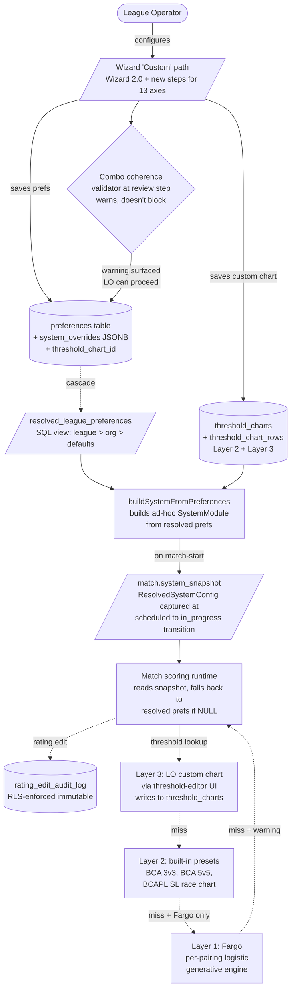

# feat: Refactor to fully modular league system

## Overview

Replace the hardcoded `5_man` / `8_man` league type tags with a fully modular league configuration system. League operators (LOs) can configure 13 independent axes — lineup size, match structure, per-pairing format, per-game scoring, win condition, handicap rating system, handicap mechanism, threshold source, standings sort, tiebreaker, mid-season locking, per-game achievements, roster size — and the app produces sensible behavior via a layered defaults strategy (Fargo generative → built-in preset → LO custom). Adds BCAPL Skill Level (the BCA Pool League's national headline handicap system) as a fifth handicap rating system, plus a rating-edit audit log (R21) to address BCA's #1 software anxiety: sandbagging.

The work is scoped to enable a credible BCA pitch (a meeting is in the works) while honoring **graceful degradation** as the load-bearing design principle: when the system doesn't have a perfect answer for a configured combo, it warns and proceeds with a sensible fallback rather than blocking the LO. The bar is "match doesn't break, gets played, honest labels about what's a guess vs official" — not "every combination is mathematically optimal."

This refactor builds on the architecture shipped by the April 18 plan (`docs/plans/2026-04-18-001-refactor-modular-handicap-scoring-systems-plan.md`) — which delivered the `SystemModule` interface, `system_overrides` JSONB, `match.system_snapshot` JSONB, and the four-tier preference cascade. Most of that architecture survives; this work expands it to cover all 13 axes, wires the existing `threshold_charts` DB infrastructure (which has zero runtime callers today), and addresses scope items the April 18 plan deferred.

## Problem Frame

The app today recognizes only two league shapes (`5_man` for 3v3, `8_man` for 5v5) baked into a `leagues.team_format` column referenced across ~25 src files plus 4 migrations and the resolved view. A third preset (Fargo 5v5 with 10-7 points scoring) was added recently as a SystemModule but the underlying type tag still flows through the codebase. The April 18 brainstorm chose "ship my leagues, keep the door open" and locked the UI to three presets. That framing has been superseded (see origin doc) for two reasons:

1. **The Fargo league we built for is changing match format for next season.** Same handicap system, same lineup geometry, but switching from 10-7 points scoring to games-won. The three-preset lock cannot express this; the previous "ship one preset at a time" cadence doesn't scale.

2. **A BCA meeting is in the works** and selling to BCA has been the goal from day one. The user is a 20-year sanctioned BCAPL operator (paid annual fees, shipped results to BCA, sent teams to nationals) — multi-decade direct evidence that BCA-sanctioned leagues vary widely on rules, scoring, and handicap, and that the current preset-only architecture can't serve that ecosystem.

External research and the user's lived experience confirm there is no canonical Fargo team-format threshold formula — every league invents its own bands. The system must be **data-driven**, not formula-hardcoded.

## Requirements Trace

This plan satisfies all 21 requirements from the origin document (R1–R21) plus the success criteria. Mapping to implementation units below:

**Modular axes (R1–R13):** Phases 1–4 introduce schema, types, and wizard steps for all 13 axes.
**Combo coherence (R14–R16):** Phase 4 implements warnings-not-rejections at the wizard review step.
**Migration and deprecation (R17–R20):** Phase 7 drops `team_format` after one-shot backfill and lazy-migration removal.
**Audit log (R21):** Phase 6 mirrors the existing `placeholder_audit_log` pattern for rating-edit pathways.

(see origin: `docs/brainstorms/modular-league-system-requirements.md`)

## Scope Boundaries

**In scope:**
- Modular preference columns for all 13 axes (R1–R13) with combo coherence warnings (R14–R16)
- Wiring the existing `threshold_charts` DB tables into runtime (Layer 3)
- Layer 1 generative defaults — **Fargo only**; BCA combos at non-canonical sizes use Layer 2 / Layer 3 / graceful fallback
- Built-in encoding of BCA 3v3 chart, BCA 5v5 chart (Layer 2). BCAPL Playing Handicap Chart for SL race-to-N (Layer 2) — chart values sourced during pre-implementation research from current BCAPL materials. **FargoRate Race Calculator is Layer 2 only at lineup_size=1** (individual races); Fargo team-format charts are not Layer 2 — Fargo team formats use Layer 1 generative
- LO custom threshold-chart editor UI (cherry-pick or rebuild from `lo-manual-scoring` branch — see Phase 0 research)
- Wizard "Custom" path with per-axis configuration and inline coherence warnings
- Drop of `leagues.team_format` column
- Snapshot-shape expansion on existing `match.system_snapshot` JSONB
- Standings sort + tiebreaker as first-class preferences
- BCAPL Skill Level handicap (5th `handicap_type`) + race-to-N per-pairing format + race-length-adjustment mechanism
- Rating-edit audit log (R21)
- Smoke tests confirming the three current preset modules produce expected scoring outputs post-migration

**Out of scope (explicitly deferred):**
- Lineup size = 1 (individual leagues), lineup size = 2
- APA-style alternating-pick individual-race format (architecturally extensible, not implemented)
- Head-to-head as a standings tiebreaker key
- Anti-sandbag rule expansion beyond what's already in `bca3v3.ts`
- FargoRate API integration for automatic rating fetch
- Achievement dialog redesign (breaker-vs-racker validation, Loss-on-Break, Illegal Break)
- Mid-season system changes that would affect already-scored games

### Deferred to Separate Tasks

- **Full Result Export workstream (BCA national database / LeagueSys format API integration).** Multi-week project of its own (export format negotiation, API auth, scheduling, retry, error handling). Concrete LO pain experienced firsthand during 20 years of sanctioned operation. Strategic dependency for the BCA pitch — separate follow-up requirements doc post-meeting.
- **Result Export Stub (parallel workstream — runs alongside this plan).** A minimum-viable manual CSV export of completed matches from the operator dashboard, in a documented schema format that aligns with what BCAPL / LeagueSys typically ingest. Specifically: per-match (`match_id`, `season_id`, `home_team`, `away_team`, `match_date`, `home_score`, `away_score`, `winner_team`) plus per-game-line (`match_id`, `game_number`, `home_player`, `away_player`, `winner`, `loser_balls_pocketed`, `is_break_and_run`, etc.). One operator screen with a "Download CSV" button. **In scope as a parallel workstream because it gives the BCA conversation an answer to "how do results flow back to us" without committing to the full API integration upfront.** Owner: same developer; effort estimate ~2-3 days. Schema document delivered as a deliverable separate from the CSV implementation, for BCA review.
- **Anti-sandbag rule expansion** — separate brainstorm. R21 audit log here is the *infrastructure* for anti-sandbag enforcement; rule-level expansion is the deferred piece.

## Context & Research

### Relevant Code and Patterns

- **`src/systems/types.ts`** — `SystemModule` interface (~253 lines). `SystemModule.key` is currently `'bca3v3' | 'bca5v5' | 'fargo5v5'` (closed union, must widen). Threshold output is `BCAThreshold | FargoThreshold` (discriminated by `mode: 'games_to_win' | 'start_points'`) — must restructure to discriminate on **mechanism** (extra-games / start-points / race-length-adjustment) so combos like (BCA-rating + points-scoring + start-points-mechanism) have a valid output shape.
- **`src/systems/resolver.ts`** — pure switch keyed on `handicap_type`. Default falls back to `bca5v5` with `console.warn`. Not async, no DB read. Must be extended with `buildSystemFromPreferences(prefs, overrides)` to construct ad-hoc resolved systems.
- **`src/systems/{bca3v3,bca5v5,fargo5v5}.ts`** — three preset modules. `fargo5v5.ts` calibrates `AVG_LOSER_POINTS = 4.2` against one real-match data point — Layer 1 generative engine must consciously decide to preserve or recompute (Success Criterion 4 risk).
- **`src/api/hooks/useResolvedLeaguePrefs.ts`** — preference cascade hook (~148 lines). Lazy migration logic at lines 38-56 + 96-120 derives modular fields from `team_format` on first read. Must be ported to SQL one-shot before column drop, then removed.
- **`src/api/hooks/useStandings.ts`** lines 95-108 + **`src/utils/playoffGenerator.ts`** `sortStandingsByRank()` — duplicated sort logic. Already has TODO acknowledging 8-man should sort points-first. Both refactor through a shared helper for R10.
- **`src/components/scoring/MatchEndVerification.tsx`** lines 130, 370-397 — heaviest `team_format` consumer. Line 130 hardcodes `is5v5 = teamFormat === '8_man'` for scoring routing. Lines 370-397 hardcode tiebreaker game numbers 19/20/21 (assumes 18-game 3v3 match). Must read from system_snapshot post-refactor.
- **`src/wizards/league-v2/`** — wizard collects only 4 of 13 axes today (`lineup-size`, `roster-size`, `match-format`, `handicap-system`). `presetMappings.ts` is the seam for adding more axes. `validate` callbacks per step; combo coherence is a new wizard-wide validator at the `review` step.
- **`src/utils/handicap/index.ts`** `getGamesNeeded()` — thin adapter calling `pickModule(handicapType).threshold.compute(...)` for `mode === 'games_to_win'`. This is the seam to swap for `lookup_threshold()` SQL.
- **`src/utils/handicap/get3v3GamesNeeded.ts`, `get5v5GamesNeeded.ts`** — hardcoded threshold charts. Layer 2 seeds already exist in DB (`20260410000003_seed_threshold_charts.sql`); the TS files become legacy after wiring.
- **`src/types/systemOverrides.ts`** — closed `SystemOverrides` interface (no index signature, intentional). 4 dials today; expanding to cover all 13 axes either widens this or introduces a new `ResolvedSystemConfig` snapshot type.
- **`src/components/operator/threshold-editor/`** — partially-built chart editor UI components (`PercentageThresholdChartEditor.tsx`, `RaceThresholdChartEditor.tsx`). Worth checking what they wire to.

### Threshold-Charts DB Infrastructure (already shipped, unwired)

- **`supabase/migrations/20260410000002_threshold_charts.sql`** — `threshold_charts` parent table + `threshold_chart_rows` child table + `lookup_threshold(chart_id, comp_1, comp_2)` PL/pgSQL function with exact/range modes and race-chart normalization. Three-tier ownership (global / organization / league). Triggers prevent modification of global charts.
- **`supabase/migrations/20260410000003_seed_threshold_charts.sql`** — seeds four global templates (3v3 points, 5v5 percentage, race_points, race_percentage) with rows mirroring the TS chart files. Uses a `DO $$ ... END $$` block pattern — reusable for the R17 lazy-migration port.
- **`supabase/migrations/20260410000004_add_threshold_chart_fk.sql`** — adds `preferences.threshold_chart_id` FK.
- **Confirmed zero runtime callers** for `lookup_threshold()`. Wiring is a multi-day refactor of every threshold-consuming call site, not "just turn it on."

### Snapshot Plumbing (already shipped)

- **`supabase/migrations/20260418000003_add_matches_system_snapshot.sql`** — `matches.system_snapshot JSONB` (nullable). Today's shape: `{ overrides, threshold_chart_id, snapshot_at }`.
- **Writer:** `src/api/queries/matches.ts` `populateMatchSnapshotIfNeeded(matchId, leagueId)` — best-effort, idempotent, race-safe. Triggered by `src/hooks/useMatchScoringMutations.ts` at first scoring event (NOT at scheduled→in_progress as the migration comment claims — there's a window where matches are in_progress with NULL snapshot).
- **Readers:** `MatchEndVerification.tsx`, `useSpectateMatch.ts` — pattern is `match?.system_snapshot?.overrides ?? leaguePrefs?.system_overrides ?? {}`.

### Mid-Season Lock Triggers (existing constraint)

- **`supabase/migrations/20260418000002_lock_tier1_preferences.sql`** — DB trigger `prevent_tier1_league_preference_change` blocks UPDATE of `handicap_type` and `lineup_size` on `entity_type='league'` rows **permanently**, regardless of match status. Conflicts with R13's "lock once a league has any completed matches" framing. Must be reconciled (see Key Technical Decisions).

### Audit Log Precedent

- **`supabase/migrations/20260422_*` (placeholder_audit_log)** — established pattern for R21:
  - Actor IDs server-resolved from JWT, never accepted from client
  - `SECURITY DEFINER` + `service_role`-only callable for emission RPC
  - Audit row + mutation in same transaction with post-conditions tested first
  - RPC versioning via new overload (`_v2`), not `CREATE OR REPLACE`
  - See `docs/plans/2026-04-22-001-feat-placeholder-player-lifecycle-plan.md` for the full pattern.

### Institutional Learnings

- **Characterization-first refactoring is the established pattern** (April 18 plan Unit 3). Pre-record outputs from current code over a parameter sweep, save the values, assert refactored output matches each one. Do NOT encode expected values from the doc — record from actual code output. Reuse this pattern for Success Criterion 4.
- **Per-game points are derived, not stored** — `winner_points` and `loser_points` are computed from snapshotted dials + stored `loser_balls_pocketed`. Don't add storage columns for derived values.
- **Closed-shape `SystemOverrides`** prevents typo'd dial keys from silently defaulting. Maintain that pattern for new dials.
- **`docs/solutions/` does not exist in this repo.** Consider starting one after this refactor lands.
- **`lo-manual-scoring` branch** has 15 commits of editor + lookup work that was never merged. Investigation in Phase 0 will determine cherry-pick vs rebuild.

### External References (deferred to planning-time research)

- BCAPL League Operator Manual / Playing Handicap Chart — source from playbca.com or via BCA contact (Phase 0)
- BCA Verified rollout status — verify against current materials before BCA meeting
- LeagueSys ownership / current feature scope — verify before BCA meeting

### Project Conventions (CLAUDE.md / memory)

- **shadcn-only UI** — every new wizard step / threshold-editor screen uses shadcn `Button`, `Input`, `Label`, `Select`, `Card`. No raw HTML form elements.
- **pnpm only** — never npm.
- **`TABLE_OF_CONTENTS.md` must be updated** for every new/moved/deleted file.
- **No code in chat** — describe changes; let edits convey detail.
- **Calendar component for dates**, `parseLocalDate`/`formatLocalDate` for timezone safety.
- **Tests:** Vitest 4.0 (happy-dom env, `globals: true`, `@/` alias). Co-located in `src/**/__tests__/`. Smoke pattern at `src/systems/__tests__/resolver.test.ts`. Characterization pattern at `src/utils/handicap/__tests__/getGamesNeeded.characterization.test.ts`.
- **Migrations** live in `supabase/migrations/` (NOT `database/`). User and partner run them manually on local Supabase.
- **`SystemOverrides`** has no index signature — typos fail at compile time. Maintain.
- **Vacate-and-rescore is the only fix path** for completed game data. Audit log (R21) respects this.

## Key Technical Decisions

The following decisions resolve planning-phase questions surfaced by the flow analysis and codebase research. Each shapes implementation; rationale is given inline.

- **Replace the Tier 1 lock trigger with status-aware logic.** The existing `prevent_tier1_league_preference_change` blocks edits to `handicap_type` and `lineup_size` on league-tier preferences forever, regardless of match status. R13 says lock should fire "once a league has any completed matches." Replacing the trigger with a status-aware version (only block when matches are completed) honors the graceful-degradation principle: an LO who hasn't yet started the season can still adjust the league config. The new trigger queries `matches` for any non-`scheduled` row in the league before blocking.
- **Keep internal `handicap_type` short-form values.** Code uses `'points' | 'percentage' | 'fargo' | 'skill_level' | 'none'` today. The doc and wizard use longer labels (`bca_points`, `bcapl_sl`). Internal type stays short; the wizard / display layer handles label mapping. Less migration churn, fewer breaking changes for in-flight branches. Add `'skill_level'` as the new value (already partially supported per CHECK constraint).
- **`SystemModule.key` widens from closed union to `string`.** Required for ad-hoc resolved configs (R18). Switch statements that check `key` get a default case with a `console.warn` (not a throw) — graceful degradation.
- **Threshold output union restructures from rating-system-discriminated to mechanism-discriminated.** New union: `ExtraGamesThreshold | StartPointsThreshold | RaceLengthThreshold` keyed on `mode: 'extra_games' | 'start_points' | 'race_length_adjustment'`. Existing `BCAThreshold {mode: 'games_to_win'}` becomes `ExtraGamesThreshold {mode: 'extra_games'}`. `FargoThreshold {mode: 'start_points'}` becomes `StartPointsThreshold`. New `RaceLengthThreshold` for BCAPL SL.
- **Snapshot shape expands to a full `ResolvedSystemConfig` type.** Today snapshot stores only overrides + threshold_chart_id. Post-refactor snapshot stores all 13 resolved axes (lineup_size, handicap_type, scoring_method, win_condition, mechanism, standings_sort priority, tiebreaker config, etc.). New TypeScript type `ResolvedSystemConfig` defines the shape; runtime resolver builds it from preferences and writes it on match-start (not first-scoring-event — moved earlier). Forward-compat: snapshot consumers tolerate unknown keys; missing keys fall back to module defaults with a console warning.
- **Snapshot population moves earlier, from first-scoring-event to scheduled→in_progress transition.** Closes the window where matches are in_progress with NULL snapshot. The existing best-effort idempotent writer survives — just gets called from a different lifecycle hook.
- **Standings sort priority extracts to a shared helper.** New `src/utils/standings/sortStandings.ts` consumed by both `useStandings.ts` and `playoffGenerator.ts`. Reads sort priority from resolved preferences; defaults derived from scoring method.
- **Tiebreaker game-number arithmetic abstracts from lineup geometry.** Today hardcoded to games 19/20/21 (3v3 18-game). Post-refactor: `tiebreakerGameNumbers(matchTotalGames, count)` returns `[matchTotalGames + 1, ..., matchTotalGames + count]`.
- **Layer 3 wiring uses `lookup_threshold()` RPC for BCA modules.** TS chart files (`get3v3GamesNeeded.ts`, `get5v5GamesNeeded.ts`) stay temporarily (legacy fallback during migration), then are removed once the SQL function is the proven path.
- **Layer 1 Fargo generative engine reuses the existing `fargo5v5.ts` formula calibration where possible.** New per-pairing logistic engine for any-lineup-size scenarios is a separate function; existing 5v5 10-7 combo continues to use the calibrated formula to preserve characterization equivalence.
- **Audit log mirrors `placeholder_audit_log`.** Same pattern: actor-from-JWT, `SECURITY DEFINER` + service-role-callable RPC, audit row + mutation in same transaction. New table `rating_edit_audit_log` with columns `(id, actor_user_id, actor_type, target_member_id, target_match_lineup_id, rating_system, before_value, after_value, scope, reason, source, created_at)`. RLS policies grant SELECT to org owners + sanctioning-body roles; no UPDATE/DELETE policies (immutable).
- **`team_format` drop sequencing: backfill → remove lazy-migration → update src readers → update resolved view → drop column.** Mobile-app grep is hard prerequisite (Phase 0 research). Order matters because lazy-migration depends on the column existing.
- **Mobile-app coordination via grep first, then deprecation period.** Pre-implementation grep determines whether mobile reads `team_format`. If yes, plan assumes a soft-deprecation window where the column stays as a generated column (computed from `lineup_size`) for one mobile-release cycle, then drops. If no, hard-drop is safe.
- **Combo coherence is wizard-time warnings.** Implementation lives in a new validator at the wizard `review` step, NOT as DB CHECK constraints (DB enforces structural integrity only). Post-creation edits via `LeagueDetail.tsx` re-run the same validator. Both layers warn and let the LO save anyway.
- **Per-dial mid-season-lock classification deferred to a follow-up table** (see Open Questions). Phase 1.1 ships the status-aware trigger replacement; per-axis classification (which dials are safe to change mid-season) is delivered as a planning artifact alongside Phase 4.

## Open Questions

### Resolved During Planning

- **Tier 1 trigger conflict with R13.** Resolved: replace with status-aware trigger (Unit 1.1).
- **`handicap_type` naming mismatch.** Resolved: keep internal short forms; wizard/display layer maps to user-facing labels.
- **Snapshot population timing.** Resolved: moved from first-scoring-event to scheduled→in_progress transition.
- **`SystemModule.key` widening.** Resolved: closed union → `string` with default fallback in switch statements.
- **Threshold output union shape.** Resolved: discriminated by mechanism, not rating system.
- **Audit log immutability mechanism.** Resolved: RLS-enforced (no UPDATE/DELETE policies) + `SECURITY DEFINER` RPC for emission.
- **Standings sort duplication.** Resolved: extract shared helper, refactor both call sites together.
- **Tiebreaker game-number hardcoding.** Resolved: abstract via `tiebreakerGameNumbers(matchTotalGames, count)`.

### Deferred to Implementation

- **Per-dial mid-season-lock classification.** Which preference dials are safe to change mid-season vs which require lock. Delivered as a planning artifact during Phase 4 implementation, informed by what the wizard renders. Format: a table mapping each axis to `(tier, locked-when, who-can-change)`.
- **`lo-manual-scoring` branch viability.** Cherry-pick vs rebuild for the chart editor UI. Investigated in Phase 0 research; decision drives Unit 3.4 effort estimate.
- **BCAPL Playing Handicap Chart values.** Sourced in Phase 0 research from playbca.com or BCA contact. Drives Unit 3.3 seed migration.
- **Mobile-app `team_format` reads.** Grepped in Phase 0 research; result drives the deprecation strategy in Unit 7.3.
- **Specific Fargo logistic divisor (100 vs 144).** Validated in Phase 0 research against FargoRate's own materials. Drives Unit 3.2 implementation.
- **Audit log retention policy.** Defined in Phase 6 implementation alongside the table schema.
- **`max_roster_size` upper bound.** Soft cap set in Phase 2 schema migration (suggested: 30).
- **Florida-leagues sanctioning status (informational, not blocking).** May surface during the BCA meeting.

## High-Level Technical Design

> *This illustrates the intended approach and is directional guidance for review, not implementation specification. The implementing agent should treat it as context, not code to reproduce.*

The runtime resolver consolidates the three-layer threshold resolution behind a single API. Match scoring reads from the snapshot when present (immutable per-match config) and falls back to resolved preferences for newly created matches without a snapshot. The combo-coherence validator at wizard time and post-creation edit time prevents most invalid combos by warning, but never blocks the LO from saving — the runtime is responsible for graceful behavior when an unusual combo reaches scoring.

## Phased Delivery

- **Phase 0 (pre-implementation research, blocking):** mobile-app `team_format` grep; BCAPL Playing Handicap Chart sourcing; `lo-manual-scoring` branch investigation; Fargo logistic divisor validation. No code; gates Phases 3 and 7.
- **Phase 1 (foundation):** Reconcile Tier 1 trigger; reshape `SystemModule.key` and threshold output union. Unblocks all other phases.
- **Phase 2 (schema expansion):** Add modular preference columns, new handicap_type values, expanded snapshot shape, resolved view update. Unblocks Phases 3, 4, 5.
- **Phase 3 (threshold layer wiring):** Layer 3 RPC wiring; Layer 1 Fargo generative engine; Layer 2 BCAPL SL chart seeding; chart editor UI. Unblocks Phase 5.
- **Phase 4 (wizard expansion):** New wizard steps for 9 additional axes; combo coherence validator; threshold-source UI. Independent of Phase 5; can run in parallel.
- **Phase 5 (scoring runtime refactor):** Build runtime resolver; refactor MatchEndVerification; standings sort shared helper; tiebreaker abstraction. Depends on Phases 1, 2, 3.
- **Phase 6 (audit log R21):** Audit table + RPC + RLS; wire emission to rating-edit pathways. Mostly independent; can run in parallel with Phases 4, 5.
- **Phase 7 (`team_format` drop):** SQL backfill; remove lazy-migration code; drop column + update view + remove src readers. Depends on Phase 5 (MatchEndVerification refactor completes the readers). **Explicitly post-BCA-meeting** — this is tech-debt cleanup with no demo-visible benefit; deferring removes mobile-app coordination as a meeting-window blocker.
- **Phase 8 (validation):** Characterization tests on three current presets; smoke tests for new combos.

## BCA-Pitch Demo Subset

The BCA meeting is the forcing function for this work. The 21-unit plan does not need to ship in full before the meeting. The minimum subset that constitutes a credible demo for BCA stakeholders:

**Required for the meeting:**
- **Phase 0** (research) — non-negotiable; gates everything
- **Phase 1** (foundation: trigger, types) — enables the new architecture
- **Phase 2** (schema expansion + Unit 2.4 RLS) — enables modular config storage and locks down chart-write authz
- **Unit 3.3** (BCAPL Playing Handicap Chart as Layer 2 preset) — directly demonstrates BCA-system support
- **Units 4.1 + 4.2** (wizard expansion + combo coherence) — visible LO-facing modular config story
- **Units 5.1 + 5.2** (runtime resolver + MatchEndVerification refactor) — proves the wizard's configs actually score correctly
- **Unit 6.1** (atomic rating-mutation RPCs + RLS) — the headline anti-sandbagging story
- **Plus the Result Export Stub workstream** (see Adjacent Work) — running in parallel, gives BCA an answer to "how do results flow back to us?"

**Explicitly deferred to post-meeting (not blocking the demo):**
- **Phase 7** (`team_format` drop) — pure tech-debt cleanup, no demo-visible benefit, mobile-app coordination unblocked from meeting timeline
- **Unit 3.4** (threshold-chart editor UI) — can demo Layer 2 presets without an authoring UI; LO custom tables are a "we have this and here's how it works in v2" story
- **Unit 4.3** (threshold-source step in wizard) — same; Layer 2 presets cover the demo
- **Units 5.3, 5.4** (standings sort + tiebreaker abstractions) — important but not headline; can ship in a follow-up
- **Unit 6.2** (wire audit emission to all pathways) — Unit 6.1 alone proves the architecture; full pathway sweep is not required to demo
- **Phase 8** (full characterization sweep) — smoke tests during implementation are sufficient for the demo; full characterization sweep can complete post-meeting

**Demo readiness checkpoint after Phase 5 ships:** if BCA meeting outcome contradicts plan scope (e.g., BCA's actual concern is FargoRate API integration which is out of scope), the post-meeting work re-prioritizes from this baseline rather than continuing on autopilot.

## Implementation Units

### Phase 0 — Pre-Implementation Research and Baseline Capture (blocking)

- [ ] **Phase 0a research:** Mobile-app `team_format` grep (Jack's repo); BCAPL Playing Handicap Chart sourcing (playbca.com / BCA contact); `lo-manual-scoring` branch investigation (cherry-pick viability); Fargo logistic divisor validation (FargoRate official materials). Captured as research notes; outcomes feed Phases 3, 7.
  - **Resolved 2026-04-28:** `lo-manual-scoring` branch investigated. Hybrid port recommended: keep ~4,200 lines of UI components, rebuild data layer against main's existing schema. Saves ~1.5-2.5 days for Unit 3.4. See `docs/plans/2026-04-28-001-feat-modular-league-system-plan-supplements/lo-manual-scoring-investigation.md`.
  - **Still pending:** mobile-app grep, BCAPL chart sourcing, Fargo logistic divisor validation.

- [ ] **Phase 0b: Record 3v3 (and BCA 5v5, Fargo 5v5) characterization fixtures from CURRENT code, BEFORE any refactor begins.**

**Goal:** Lock in the EXACT scoring behavior of the three current leagues by recording fixtures from the present code. These fixtures become the gate every later phase must pass — no phase ships if any 3v3 fixture diverges from baseline.

**Why this is Phase 0, not Phase 8:** if we record fixtures AFTER refactor changes have started, we've already lost the ground truth. Fixtures must be recorded against the unmodified codebase.

**Files:**
- Create: `src/systems/__tests__/characterization/fixtures/bca3v3-baseline.json`
- Create: `src/systems/__tests__/characterization/fixtures/bca5v5-baseline.json`
- Create: `src/systems/__tests__/characterization/fixtures/fargo5v5-baseline.json`
- Create: `scripts/record-characterization-fixtures.ts` (one-shot script that runs on the unmodified codebase)

**Required fixture coverage (3v3 specifically — the primary scoring-preservation target):**

- **Threshold chart lookup at every boundary, recording BOTH home_games_needed AND away_games_needed independently.** For `get3v3GamesNeeded`, record the output for every handicap diff from -12 to +12 (the chart range), including both endpoints, the zero-diff case, and every mid-range value (record all 25 entries — full chart sweep). Record output for handicap diffs that exceed the cap (-15, +15) to capture the cap-clamping behavior exactly.

  **CRITICAL — the most-broken pattern in past attempts:** never derive `away_games_needed` from `home_games_needed` (or vice versa). They are *independent lookups* from the chart. Naive reasoning ("home needs 10, so away needs 18 - 10 = 8") is the single most common 3v3 scoring failure. The chart has TWO output values per handicap diff; both must be looked up.

  **Sum rule (must be tested explicitly):**
  - For every handicap diff, `home_games_needed + away_games_needed > 18` means the match is *decisive* (cannot tie)
  - For every handicap diff where the sum equals exactly 18, the match *can* tie at 9-9 and a tiebreaker is triggered
  - The sum is a property of the chart, not derivable — looking at home alone tells you nothing about whether the match can tie
  - Test scenario must verify the sum-rule for every chart entry: assert that the recorded `home + away` matches expected behavior (decisive vs tieable)

  **Equality rule (must be tested explicitly):**
  - For handicap diff = 0 (evenly matched teams): `home_games_needed == away_games_needed` (both need 9; sum is 18; can tie)
  - For handicap diff != 0 (any imbalance): `home_games_needed != away_games_needed` (one team needs more games than the other to account for handicap)
  - Test scenario must assert this for every chart entry
- **Tiered points counting** (BCA 3v3's specific scoring): record per-game-points for matches where the team-bonus tier kicks in at the 2-game margin, the 4-game margin, the 6-game margin. The bonus calculation is "if margin >= 2, bonus = 2 * floor(margin / 2)" or whatever the current code does — record the actual output, not the formula.
- **Raw points counting** (Fargo 10-7's specific scoring): record per-game points for loser_balls_pocketed = 0, 1, 4, 7. Record both winner_points (default 10) and loser_points calculations.
- **Counting-method confusion failure cases:** record what happens if you accidentally apply Fargo 10-7 counting to a BCA 3v3 match (this fixture exists to fail tests, not to validate; it's a sanity check that the test suite would catch the conflation).
- **Achievement counting:** break-and-run, golden break, runout — record per-game scoring impact under both BCA 3v3 (where some achievements are tracked but don't change game-points) and Fargo (where break-and-run could affect points by being a winner_points override).
- **Match-result edges:** match where higher-handicap team wins exactly the games they need; match where lower-handicap team wins; match that ends in a tie at 9-9 (BCA 3v3 with tiebreaker triggered); match where one team forfeits.
- **Standings sort:** for a season with 4 teams ending with various match-wins / total-points / games-won combinations, record exactly which team is 1st, 2nd, 3rd, 4th under the current 3v3 sort logic.

**Required fixture coverage (BCA 5v5):**
- Same shape as 3v3 but using `get5v5GamesNeeded` (range-mode chart, percentage-based handicap)
- Record output at every range boundary (entries below the lowest range, above the highest, exactly at boundaries)
- Both `higherTeamWins` and `lowerTeamWins` fields for each range

**Required fixture coverage (Fargo 5v5 10-7):**
- Record start-points calculation for rating differentials of 0, 50, 100, 150, 200 with sample lineup pairings
- Record `AVG_LOSER_POINTS = 4.2` calibration point exactly
- Record per-game scoring with full balls-pocketed range (0-7)

**Verification:**
- Fixtures saved in repo as JSON; checked in alongside this Phase 0 work
- Running `pnpm test src/systems/__tests__/characterization/` against unmodified code passes 100%
- Each fixture file documents which version of the codebase it was recorded against (git SHA in the JSON)

**Hard rule across all later phases:** every phase ends with a re-run of the characterization tests against the post-phase code. If any 3v3 fixture diverges, the phase is rejected and must be fixed before moving to the next phase. No exceptions.

**Status (2026-04-29): SUBSTANTIALLY COMPLETE.** Rather than recording fixtures as JSON files for one-shot script comparison, characterization is implemented as Vitest tests that lock current behavior at every layer. Each test file's expected outputs ARE the fixture; running the test against post-refactor code is the comparison. This is functionally equivalent to the JSON+script approach and integrates cleanly with the existing test infrastructure.

Tests landed on `feature/modular-league-system` branch:

| Layer | File | Tests |
|---|---|---|
| Chart values (existing) | `src/utils/handicap/__tests__/getGamesNeeded.characterization.test.ts` | 49 |
| BCA 3v3 module | `src/systems/__tests__/bca3v3.characterization.test.ts` | 86 |
| BCA 5v5 module | `src/systems/__tests__/bca5v5.characterization.test.ts` | 104 |
| Fargo 5v5 module (existing) | `src/systems/__tests__/fargo5v5.test.ts` | 35 |
| Resolver (existing) | `src/systems/__tests__/resolver.test.ts` | 15 |
| Threshold integration (lineup → diff → chart) | `src/utils/__tests__/calculateHandicapThresholds.characterization.test.ts` | 11 |
| Standings sort | `src/utils/__tests__/playoffGenerator.standingsSort.characterization.test.ts` | 13 |
| Team handicap bonus (points-specific) | `src/utils/__tests__/getTeamHandicapBonus.characterization.test.ts` | 14 |
| Variant-aware team handicap + substitute options | `src/utils/__tests__/handicapCalculations.characterization.test.ts` | 19 |
| Fargo running scoreboard | `src/utils/__tests__/fargoMatchTotals.characterization.test.ts` | 16 |
| BCA running scoreboard (calculatePoints / calculateBCAPoints / getTeamStats) | `src/types/__tests__/match-scoring.characterization.test.ts` | 31 |
| Game order generation (with cross-combos: 3v3 SRR / 4v4 / 6v6 / etc.) | `src/utils/__tests__/gameOrder.characterization.test.ts` | 53 |
| Golden break rules | `src/utils/__tests__/goldenBreakRules.characterization.test.ts` | 16 |

**Total: ~462 tests guarding scoring math + standings + game-generation + integration.**

Coverage of the user's specific scoring-preservation concerns:
- ✅ **Home/away independent chart lookups** locked at three layers (chart, module, integration)
- ✅ **Sum rule + equality rule** locked at module layer (bca3v3 + bca5v5)
- ✅ **Tiered points counting** locked at multiple layers (BCA 3v3 calculatePoints + 5v5 BCA bonus jumps)
- ✅ **Match structure independence** (lineup size × RR mode treated as independent axes; cross-combo coverage in gameOrder tests)

**Coverage gaps that remain (lower priority, can be added later):**
- Match-result determination logic (`determineMatchResult` private function in MatchEndVerification.tsx)
- Hooks with DB+React Query dependencies (`useStandings`, `useMatchScoring`, `useMatchPreparation`)
- UI components (`ThreeVThreeScoreboard`, `MatchEndVerification` rendering)

These need integration / component-test infrastructure rather than pure unit tests.

- [ ] **Phase 0c: Record E2E intermediate-state fixtures for full match scoring (3v3, BCA 5v5, Fargo 5v5).**

**Status (2026-04-29): PARTIAL.** First spec shipped (`tests/e2e/characterization/3v3-foundation.spec.ts`, 4 tests) — locks the factory's 3v3 output shape, the auto-create-match-lineups DB trigger, and the captain's lineup-page route guards. The full per-game scoring capture (driving the scoring UI for all 18 games and asserting per-game intermediate state) remains as future work — needs a focused session because it requires understanding the scoring UI selectors AND a small piece of test infrastructure work (the `getServiceClient` cached singleton has stale-OpenAPI behavior for newly-added RPCs; documented but not yet fixed).

**Goal:** Capture the running state of a match game-by-game from the actual UI, against current code. Unit fixtures (Phase 0b) catch math drift in isolation; these E2E fixtures catch *integration* drift — the wrong scoring function being called, the wrong chart consulted, the snapshot read incorrectly, etc. Together they form a two-layer safety net.

**Dependencies:** Playwright scaffolding (separate PR) must be merged before this phase begins.

**Files:**
- Create: `tests/e2e/characterization/3v3-full-match.spec.ts`
- Create: `tests/e2e/characterization/5v5-full-match.spec.ts`
- Create: `tests/e2e/characterization/fargo-5v5-full-match.spec.ts`
- Create: `tests/e2e/characterization/fixtures/3v3-game-by-game-baseline.json`
- Create: `tests/e2e/characterization/fixtures/5v5-game-by-game-baseline.json`
- Create: `tests/e2e/characterization/fixtures/fargo-5v5-game-by-game-baseline.json`

**Approach (3v3 — pattern repeats for the other two systems):**

- Use the dev-seed scripts (`database/dev_bootstrap_full.sql`) to set up a known league + lineup state, OR drive the wizard via Playwright to create one. Whichever is more reliable across runs.
- Define a fixed sequence of ~18 game outcomes covering the cases that matter most:
  - First few games are a normal back-and-forth
  - Include a break-and-run
  - Include a golden break
  - Include a runout
  - Reach a 9-9 state to trigger the tiebreaker logic
  - Play the tiebreaker games
- After EACH game is recorded by the E2E test, capture and assert:
  - Running `home_total_points`, `away_total_points` (from the scoreboard UI)
  - Running `home_games_won`, `away_games_won` (from the scoreboard UI)
  - The per-game points awarded for that specific game (visible in the UI's game log)
  - Any handicap-derived value displayed (e.g., target games-to-win)
  - Match status (in-progress, won, tied, tiebreaker-triggered)
- Each per-game assertion produces one fixture entry. The full match becomes ~18-21 fixture entries.
- Save the entire game-by-game capture as JSON. The fixture is the *trajectory* of the match, not just the endpoint.

**Verification:**
- Running `pnpm test:e2e tests/e2e/characterization/` against unmodified code passes 100%
- Each fixture file documents the git SHA it was recorded against
- The fixture file's per-game data is human-readable so divergences are easy to debug

**Per-phase gate (extended):** in addition to the Phase 0b unit-fixture gate, every phase also re-runs these E2E fixture tests. If any per-game value diverges between baseline and post-phase code, the phase is rejected.

**Why this is a separate phase from 0b:** Phase 0b can start immediately (unit-level, no Playwright dependency). Phase 0c gates on the Playwright scaffolding PR being merged. Both are prerequisites for Phase 1 starting.

### Phase 1 — Foundation

- [ ] **Unit 1.1: Replace Tier 1 lock trigger with status-aware version**

**Goal:** Reconcile the existing permanent-lock trigger with R13's "lock once any matches completed" semantics. Allow LO edits before the season starts; block them after.

**Requirements:** R13

**Dependencies:** None

**Files:**
- Create: `supabase/migrations/YYYYMMDDHHMMSS_replace_tier1_lock_with_status_aware.sql`
- Test: `src/__tests__/database/preferenceLocking.db.test.ts`

**Approach:**
- Drop the existing `prevent_tier1_league_preference_change` trigger
- Create new trigger `prevent_tier1_league_preference_change_after_first_match` that queries `matches` for any non-`scheduled` row in the league before blocking the UPDATE
- New trigger blocks UPDATE only when at least one match has `status != 'scheduled'` (covers `in_progress`, `completed`, `vacated`, `forfeited`, and any future non-scheduled status — future-proof)
- **Required JOIN path:** matches do not have a direct `league_id` column; the trigger must query `matches m JOIN seasons s ON m.season_id = s.id WHERE s.league_id = NEW.entity_id AND m.status <> 'scheduled' LIMIT 1`. Skipping the join silently allows lock bypass.
- **Concurrency safety:** the trigger and the scheduled→in_progress lifecycle hook can race. Use `pg_advisory_xact_lock(hashtext('league_pref_change_' || NEW.entity_id::text))` at the top of the trigger to serialize concurrent updates against the same league. Same advisory lock is acquired by the lifecycle hook when transitioning a match to in_progress.

**Patterns to follow:**
- `supabase/migrations/20260418000002_lock_tier1_preferences.sql` (existing trigger structure)

**Test scenarios:**
- Happy path: League with no matches — UPDATE `handicap_type` succeeds
- Happy path: League with all-`scheduled` matches — UPDATE succeeds
- Edge case: League with one `in_progress` match — UPDATE blocked with explanatory error
- Edge case: League with `vacated`-then-rescored matches — UPDATE blocked (vacated is non-scheduled)
- Error path: Attempt to UPDATE `lineup_size` on a league with completed matches — blocked
- Edge case: Org-tier preferences row UPDATE — not blocked (trigger scope is league-tier only)

**Verification:**
- Existing leagues with completed matches keep their handicap_type/lineup_size unchanged
- New leagues can be reconfigured up until the first match transitions out of `scheduled`

- [ ] **Unit 1.2: Widen `SystemModule.key` from closed union to string**

**Goal:** Allow ad-hoc resolved SystemModule instances to have a key that isn't one of the three preset names.

**Requirements:** R18

**Dependencies:** None

**Files:**
- Modify: `src/systems/types.ts`
- Modify: `src/systems/resolver.ts`
- Modify: `src/systems/{bca3v3,bca5v5,fargo5v5}.ts`
- Test: `src/systems/__tests__/resolver.test.ts` (existing — extend)

**Approach:**
- Change `SystemModule.key: 'bca3v3' | 'bca5v5' | 'fargo5v5'` → `SystemModule.key: string`
- Update switch statements that check `module.key` to have a `default` branch with `console.warn` (not throw) — graceful degradation
- Existing module values stay the same; type widens

**Patterns to follow:**
- The graceful degradation principle from origin doc: never block, warn instead

**Test scenarios:**
- Happy path: existing modules have keys `'bca3v3'`, `'bca5v5'`, `'fargo5v5'` — no behavior change
- Edge case: ad-hoc module with key `'fargo_games_won'` — switches default to `console.warn` instead of throw
- Integration: TypeScript compilation succeeds with widened type across all consumers

**Verification:**
- `pnpm run typecheck` passes
- Existing resolver tests still pass

- [ ] **Unit 1.3: Restructure threshold output union to discriminate on mechanism**

**Goal:** Reshape `BCAThreshold | FargoThreshold` (rating-system-discriminated) to `ExtraGamesThreshold | StartPointsThreshold | RaceLengthThreshold` (mechanism-discriminated). Allows combos like (BCA-rating + 10-7 scoring + start-points-mechanism) to have a valid output shape.

**Requirements:** R8, R18

**Dependencies:** Unit 1.2

**Files:**
- Modify: `src/systems/types.ts`
- Modify: `src/systems/{bca3v3,bca5v5,fargo5v5}.ts` (rename mode tags)
- Modify: `src/utils/handicap/index.ts` (update consumers)
- Modify: `src/components/scoring/MatchEndVerification.tsx` (mode discriminator usage — partial; full refactor in Unit 5.2)
- Test: `src/systems/__tests__/threshold-shapes.test.ts` (new)

**Approach:**
- Rename `BCAThreshold {mode: 'games_to_win'}` → `ExtraGamesThreshold {mode: 'extra_games'}`. Field shape unchanged.
- Rename `FargoThreshold {mode: 'start_points'}` → `StartPointsThreshold {mode: 'start_points'}`. Field shape unchanged.
- Add new `RaceLengthThreshold {mode: 'race_length_adjustment'}` with fields `(homeRaceLength, awayRaceLength)`.
- Update consumers' switch statements
- **Note on storage:** PR #87 dropped the Fargo-specific columns (`fargo_start_points`, `fargo_start_points_confirmed_by_home/away`). Threshold values now persist in the system-agnostic columns on `matches` (`home_games_to_win`, `home_games_to_tie`, `home_games_to_lose`, plus the away counterparts). Fargo uses `*_tie` / `*_lose` for start-points and confirmation; BCA uses `*_to_win` for extra-games. The mechanism-discriminated threshold types in this unit map onto these existing columns — no new DB columns needed for storage.

**Test scenarios:**
- Happy path: BCA 3v3 module's threshold output has `mode: 'extra_games'`
- Happy path: Fargo 5v5 module's threshold output has `mode: 'start_points'`
- Happy path: Constructing a `RaceLengthThreshold` produces the new shape (BCAPL SL combo eventually consumes this)
- Integration: Type narrowing in switch statements works correctly across the union

**Verification:**
- `pnpm run typecheck` passes
- Existing characterization tests at `src/utils/handicap/__tests__/getGamesNeeded.characterization.test.ts` still pass (mode rename is internal; output values unchanged)

### Phase 2 — Schema Expansion

- [ ] **Unit 2.1: Migration — add modular preference columns and expanded handicap_type values**

**Goal:** Add the schema for the 9 new modular axes (per-pairing format, scoring method, win condition, mechanism, standings sort, tiebreaker fields, and roster size cap), plus the `'skill_level'` `handicap_type` value for BCAPL SL.

**Requirements:** R1, R2, R4, R5, R6, R7, R8, R10, R11

**Dependencies:** None

**Files:**
- Create: `supabase/migrations/YYYYMMDDHHMMSS_extend_preferences_modular_axes.sql`
- Modify: `src/types/preferences.ts` (add new fields)
- Modify: `src/types/database.types.ts` (regenerate via `pnpm db:types`)
- Test: `src/__tests__/database/preferencesModularAxes.db.test.ts`

**Approach:**
- ALTER TABLE `preferences` ADD COLUMN entries for: `pairing_format` (enum: `single_rack`, `race_to_n`), `scoring_method` (enum: `winner_takes_all`, `points_10_7`, `race_winner`), `win_condition` (enum: `first_to_games`, `first_to_pairings`, `highest_after_all_games`, `total_points_target`), `mechanism` (enum: `extra_games`, `start_points`, `race_length_adjustment`, `none`), `standings_sort` (text array — priority list of `match_wins`, `games_won`, `points_earned`), `tiebreaker_trigger` (enum: `even_total_games_only`, `never`), `tiebreaker_format` (enum: `best_of_3_short_race`, `single_short_race`, `accept_tie`), `race_length` (integer, nullable — for `pairing_format='race_to_n'`)
- ALTER CHECK constraint on `handicap_type` to include `'skill_level'` (the existing constraint already allows it per repo research; verify and adjust if needed)
- Set sensible defaults per existing presets: e.g., `bca5v5` leagues default to `(single_rack, winner_takes_all, first_to_games, extra_games, [match_wins, games_won, points_earned], never, accept_tie, NULL)`
- Add CHECK constraint for soft cap on `max_roster_size` (≤ 30)

**Patterns to follow:**
- `supabase/migrations/20260410000000_extend_preferences_modular.sql` (existing pattern for adding modular columns to preferences)

**Test scenarios:**
- Happy path: Insert preferences with full 13-axis values — succeeds
- Happy path: Insert preferences with default values — succeeds, defaults are applied
- Edge case: Insert with `max_roster_size = 50` — fails CHECK constraint
- Edge case: Insert with `pairing_format = 'race_to_n'` and NULL `race_length` — runtime should warn but DB allows (graceful)
- Error path: Insert with invalid enum value — DB rejects
- Integration: Existing preferences rows backfill with sensible defaults via migration `UPDATE` statements

**Verification:**
- `supabase db reset` succeeds with the new migration
- Generated `database.types.ts` reflects the new columns
- Existing `useResolvedLeaguePrefs` resolves the new fields (post-Unit 2.3 view update)

- [~] **Unit 2.2: Define `ResolvedSystemConfig` type and expand `system_snapshot` shape** *(2026-04-29: type defined in d66a30a; writer expanded in this commit. MatchSystemSnapshot type aliased to ResolvedSystemConfig. Deferred: lifecycle-hook move from first-scoring-event to scheduled→in_progress, one-time backfill migration, and UI banner for backfilled snapshots — all minor follow-ups; current writer is sufficient to unblock Unit 5.2b.)*

**Goal:** Define the TypeScript type that represents the full resolved per-match system configuration. Update snapshot population to capture all 13 axes, and move snapshot timing earlier (scheduled→in_progress transition).

**Requirements:** R13

**Dependencies:** Unit 2.1

**Files:**
- Create: `src/types/resolvedSystemConfig.ts`
- Modify: `src/types/systemOverrides.ts` (extend or compose)
- Modify: `src/api/queries/matches.ts` (update `populateMatchSnapshotIfNeeded` to write the new shape)
- Modify: `src/hooks/useMatchScoringMutations.ts` (no longer the snapshot trigger)
- Modify: `src/hooks/useMatchLifecycleMutations.ts` (or wherever scheduled→in_progress transition lives — call snapshot writer here)
- Test: `src/__tests__/database/snapshotShape.db.test.ts`

**Approach:**
- New `ResolvedSystemConfig` type with all 13 resolved axes plus `snapshot_at` timestamp and `backfilled_at_migration: boolean` flag
- Snapshot writer reads from resolved view + `leagues.system_overrides` and writes the full `ResolvedSystemConfig`
- Move trigger from `handleConfirmScore` (first scoring event) to the lifecycle hook that fires when a match transitions to `in_progress`. The trigger acquires the same advisory lock as the Tier 1 trigger replacement (see Unit 1.1) to prevent races against preference UPDATEs.
- **One-time backfill** (in this migration): for every match where `status != 'scheduled' AND system_snapshot IS NULL`, write the current resolved config as a best-available approximation, with `backfilled_at_migration: true`. *Note: with disposable dev data (no real users), this backfill has minimal real impact — it covers the developer's own test data only. The simpler "disposable dev data" alternative is to truncate the matches table at migration and re-seed via the existing `database/dev_bootstrap_full.sql` afterward, skipping backfill entirely. Choose the simpler path if dev data isn't worth preserving.*
- Snapshot consumers tolerate unknown keys (no schema enforcement on JSONB) and log a warning if a known key is missing — fall back to module defaults
- **Backfilled snapshots are flagged in the UI** (`MatchEndVerification`, `useSpectateMatch`): if `system_snapshot.backfilled_at_migration === true`, surface a banner to the LO indicating "this match's system was captured retroactively at migration; values may not reflect what was used during play."

**Patterns to follow:**
- Existing `populateMatchSnapshotIfNeeded` (idempotent, race-safe via `WHERE system_snapshot IS NULL`)
- Existing `prep_match` RPC (`supabase/migrations/20260424000000_prep_match_rpc.sql`) — wraps threshold update + match_games insert atomically with `ON CONFLICT DO NOTHING` idempotency. Snapshot population can be added inside this same RPC's transaction for a single atomic prep-match operation, OR called as a separate idempotent step after `prep_match` returns. Either pattern works; using the existing RPC saves us building a new transaction wrapper.

**Test scenarios:**
- Happy path: Match transitions scheduled→in_progress — snapshot is written with all 13 axes
- Edge case: Snapshot already populated (race condition) — second write is a no-op
- Edge case: Match scored with old-shape snapshot (pre-migration) — runtime falls back to module defaults for missing keys, logs warning
- Edge case: Snapshot has typo'd key (`winner_pts` instead of `winner_points`) — runtime logs warning, falls back to default
- Integration: A match scored end-to-end after this unit produces correct results regardless of mid-match preference edits

**Verification:**
- New matches have non-NULL snapshot from the moment they go in_progress
- `MatchEndVerification.tsx` (post-Unit 5.2) reads from snapshot, behaves same as today

- [ ] **Unit 2.3: Update `resolved_league_preferences` view + add audit log table scaffolding**

**Goal:** Cascade the new modular axes through the resolved view. Add the `rating_edit_audit_log` table (full RPC + RLS deferred to Phase 6).

**Requirements:** R10, R11, R21 (table only)

**Dependencies:** Unit 2.1

**Files:**
- Create: `supabase/migrations/YYYYMMDDHHMMSS_update_resolved_view_modular.sql`
- Create: `supabase/migrations/YYYYMMDDHHMMSS_create_rating_edit_audit_log.sql`
- Test: `src/__tests__/database/resolvedViewModular.db.test.ts`

**Approach:**
- Drop and recreate `resolved_league_preferences` view with COALESCE for all new columns
- Maintain the existing COALESCE on `team_format` for now (removed in Phase 7)
- Create `rating_edit_audit_log` table with columns `(id, actor_user_id, actor_type, target_member_id, target_match_lineup_id, rating_system, before_value, after_value, scope, reason, source, created_at)`. RLS policies + emission RPC come in Phase 6.

**Patterns to follow:**
- `supabase/migrations/20260417000000_add_modular_to_resolved_view.sql` (existing view-update pattern)
- `placeholder_audit_log` table from `2026-04-22-001-feat-placeholder-player-lifecycle-plan.md` (column shape and naming)

**Test scenarios:**
- Happy path: Query resolved view for a league — returns the cascaded standings_sort, tiebreaker, etc.
- Edge case: League has NULL for all modular axes — view returns org-tier or system defaults
- Integration: `useResolvedLeaguePrefs` hook reads the new columns correctly

**Verification:**
- View resolves correctly across the 3 cascade tiers
- `rating_edit_audit_log` table exists with expected columns

- [x] **Unit 2.4: Replace threshold-charts dev-only RLS with production policies** *(completed 2026-04-29)*

**Goal:** The `threshold_charts` and `threshold_chart_rows` tables shipped with placeholder RLS labeled "Dev: Allow all operations" (per `supabase/migrations/20260410000002_threshold_charts.sql` lines 275-294, with TODO to add proper policies before production). This work activates those tables in Phase 3 — the placeholder RLS must be replaced first or LOs and players could write to other leagues' charts.

**Requirements:** R9 (security prerequisite for Layer 3 wiring)

**Dependencies:** None (can run parallel with other Phase 2 units; must complete before Phase 3 starts)

**Files:**
- Create: `supabase/migrations/YYYYMMDDHHMMSS_replace_threshold_charts_rls.sql`
- Test: `src/__tests__/database/thresholdChartsRls.db.test.ts`

**Approach:**
- Drop the existing dev policies on both `threshold_charts` and `threshold_chart_rows`
- New SELECT policy: open to `authenticated` (chart values feed match scoring that all players observe)
- New INSERT/UPDATE/DELETE policy on `entity_type='league'` rows: restricted to org owners/admins of the league's organization, via the existing `organization_staff` join pattern (`auth.uid()` → `members.user_id` → `organization_staff.member_id` WHERE `organization_id = (SELECT organization_id FROM leagues WHERE id = entity_id)` AND `position IN ('owner', 'admin')`)
- New INSERT/UPDATE/DELETE policy on `entity_type='organization'` rows: same pattern, scoped to the org directly
- INSERT/UPDATE/DELETE on `entity_type='global'`: denied to all (existing global-modification trigger remains as defense in depth)

**Patterns to follow:**
- `supabase/migrations/20260419120000_*` (house_rules RLS pattern using organization_staff join)
- Existing `can_write_house_rule_org` predicate

**Test scenarios:**
- Happy path: Org owner writes a chart for their own league — succeeds
- Edge case: Org owner attempts to write chart for a different org's league — blocked
- Edge case: Authenticated player (not staff) attempts to write any chart — blocked
- Edge case: Anonymous user attempts to read any chart — blocked
- Edge case: Authenticated user reads a global preset chart — succeeds (SELECT open)
- Error path: Authenticated user attempts to INSERT a row with `entity_type='global'` — blocked
- Integration: After Unit 3.4's chart editor ships, an LO from org A can never affect org B's charts

**Verification:**
- All cross-org write attempts fail with permission errors
- Layer 2 preset SELECT still works for unauthenticated public read paths if any (verify match-scoring doesn't break)

### Phase 3 — Threshold Layer Wiring

- [ ] **Unit 3.1: Wire `lookup_threshold()` RPC for BCA modules (Layer 3 path)**

**Goal:** Replace the in-process TS chart calls (`get3v3GamesNeeded`, `get5v5GamesNeeded`) with `lookup_threshold()` RPC calls when a `threshold_chart_id` is set on the league. Falls back to TS charts otherwise (during migration).

**Requirements:** R9 (Layer 3)

**Dependencies:** Unit 1.3

**Files:**
- Modify: `src/utils/handicap/index.ts` (extend `getGamesNeeded` to accept optional `chartId`)
- Modify: `src/systems/{bca3v3,bca5v5}.ts` (threshold.compute reads chartId from overrides)
- Create: `src/api/queries/thresholdLookup.ts` (wraps the SQL function call)
- Test: `src/utils/handicap/__tests__/lookupThreshold.test.ts`

**Approach:**
- New `lookupThreshold(chartId, comp1, comp2)` async wrapper around the SQL function
- BCA modules' `threshold.compute` checks if `overrides.threshold_chart_id` is set; if yes, calls the RPC; if no, calls the TS chart (legacy path)
- Async-safe: threshold.compute becomes async (caller already in an async context for match scoring)
- *Disposable-dev-data simplification:* with no real users to protect, the "TS-chart legacy fallback" is shorter-lived than originally framed. Once the seeded BCA chart in the DB is verified to produce identical outputs to the TS chart (via Phase 0b characterization fixtures), the TS files can be deleted. No prolonged dual-path maintenance period.

**Patterns to follow:**
- Existing TanStack Query patterns in `src/api/queries/`
- The April 18 plan's "thin adapter" pattern for `getGamesNeeded`

**Test scenarios:**
- Happy path: League has `threshold_chart_id` set, BCA points handicap diff = 5 — RPC returns the row's result, scoring uses it
- Happy path: League has NULL `threshold_chart_id`, BCA points handicap diff = 5 — TS chart is used (legacy)
- Edge case: RPC returns no row (chart row missing) — fall back to TS chart with a console.warn
- Edge case: Range-mode chart with input below lowest range — RPC returns NULL, fall back to module default
- Integration: Existing matches with NULL threshold_chart_id continue scoring identically

**Verification:**
- Characterization tests at `getGamesNeeded.characterization.test.ts` still pass (TS-chart path)
- New tests cover the RPC path

- [ ] **Unit 3.2: Implement Layer 1 Fargo per-pairing logistic generative engine**

**Goal:** Build a Fargo-only generative threshold engine that works for any lineup size and any (scoring × win-condition × mechanism) combo. The existing `fargo5v5.ts` calibrated formula stays the path for the existing 5v5 10-7 combo to preserve characterization equivalence.

**Requirements:** R9 (Layer 1)

**Dependencies:** Unit 1.3, Phase 0 research (Fargo logistic divisor)

**Files:**
- Create: `src/systems/fargoLogistic.ts`
- Modify: `src/systems/fargo5v5.ts` (delegates to `fargoLogistic.ts` only for non-canonical combos; existing 10-7 combo uses the calibrated formula)
- Test: `src/systems/__tests__/fargoLogistic.test.ts`

**Approach:**
- **Fargo-only engine.** This Layer 1 path applies only when `handicap_type = 'fargo'` or `'skill_level'`. BCA points and BCA percentage handicap systems do not use Layer 1 generative; they fall through to Layer 2 / Layer 3 / graceful fallback per R9.
- Implement per-pairing win probability `P(A beats B) = 1 / (1 + 10^((B-A)/divisor))` where divisor is sourced from Phase 0 research (likely 100; verify)
- Sum expected wins across all pairings (depends on `match_structure` and `lineup_size`)
- For `mechanism = extra_games`: derive extra-games as `round(expectedWinsHigher - matchTotalGames/2)`
- For `mechanism = start_points`: derive start-points using existing `fargo5v5.ts` logic for the canonical 5v5 10-7 combo, generic logistic-derivation for others
- For `mechanism = race_length_adjustment`: not Fargo's natural mechanism; falls through to Layer 2/3
- Honest "extrapolated" labeling via a returned `confidence: 'calibrated' | 'extrapolated'` field

**Patterns to follow:**
- `fargo5v5.ts` calibration constant (`AVG_LOSER_POINTS = 4.2`)
- Origin doc Worked Examples A and C (4v4 + Fargo + games-won; 5v5 + Fargo + games-won)

**Test scenarios:**
- Happy path: 5v5 10-7 combo at 117-rating-gap — produces same start-points as today's `fargo5v5.ts` (characterization)
- Happy path: 4v4 single-RR + Fargo + games-won + extra_games — produces sensible extra-games count, marked `confidence: 'extrapolated'`
- Happy path: 5v5 single-RR + Fargo + games-won + extra_games — produces sensible extra-games count
- Edge case: Zero rating differential — extra-games = 0 / start-points = 0
- Edge case: Extreme rating differential (300+) — extra-games / start-points capped at sensible maximum (matchTotalGames - 1)
- Edge case: Lineup size = 6 — no calibration data; engine still produces output, marked `'extrapolated'`
- Integration: Layer 1 engine output can be overridden by Layer 2/Layer 3 in the resolver

**Verification:**
- Existing 5v5 10-7 characterization tests still pass
- New tests cover non-canonical combos with sane outputs

- [ ] **Unit 3.3: Seed BCAPL Playing Handicap Chart as Layer 2 preset**

**Goal:** Encode the BCAPL national Skill Level race-to-N chart as a global threshold chart, making it available as a Layer 2 preset for `handicap_type = 'skill_level'` + `pairing_format = 'race_to_n'` combos.

**Requirements:** R9 (Layer 2), R7 (`skill_level` handicap)

**Dependencies:** Unit 2.1, Phase 0 research (BCAPL chart values)

**Files:**
- Create: `supabase/migrations/YYYYMMDDHHMMSS_seed_bcapl_sl_chart.sql`
- Test: `src/__tests__/database/bcaplSlChart.db.test.ts`

**Approach:**
- INSERT INTO `threshold_charts` and `threshold_chart_rows` for the BCAPL 8-ball Playing Handicap Chart (SL → race-to-N)
- INSERT a separate chart for 9-ball (BCAPL has separate 8-ball and 9-ball charts)
- Use `chart_type = 'race_points'` (already seeded as a global template type)
- Source values from Phase 0 research; if the actual chart isn't available before this unit ships, use a placeholder chart and document where the values came from

**Patterns to follow:**
- `supabase/migrations/20260410000003_seed_threshold_charts.sql` (DO $$ block pattern for seeds)

**Test scenarios:**
- Happy path: `lookup_threshold(<bcapl_8ball_chart_id>, 5, 7)` (SL5 vs SL7) returns the expected race lengths
- Happy path: `lookup_threshold(<bcapl_9ball_chart_id>, 3, 3)` returns equal race lengths
- Edge case: SL out of range (10 or 0) — returns NULL or capped values per chart spec

**Verification:**
- Charts are queryable via the `lookup_threshold()` SQL function
- Wizard step (Phase 4) can offer them as presets

- [ ] **Unit 3.4: Threshold-chart editor UI for LO custom override (Layer 3)**

**Goal:** Surface the existing `src/components/operator/threshold-editor/` partial UI to LOs for authoring custom threshold charts. Investigate the `lo-manual-scoring` branch for cherry-pick viability before rebuilding.

**Requirements:** R9 (Layer 3)

**Dependencies:** Phase 0 research (`lo-manual-scoring` branch decision), Unit 2.3

**Files:**
- Modify or create: `src/components/operator/threshold-editor/PercentageThresholdChartEditor.tsx`
- Modify or create: `src/components/operator/threshold-editor/RaceThresholdChartEditor.tsx`
- Modify or create: `src/components/operator/threshold-editor/PointsThresholdChartEditor.tsx`
- Modify: `src/operator/LeagueDetail.tsx` (entry point button)
- Modify: `src/wizards/league-v2/steps/HandicapSystemStep.tsx` (offer "use custom chart" option)
- Test: `src/__tests__/integration/ThresholdEditor.smoke.test.tsx`

**Approach:**
- If `lo-manual-scoring` branch is viable: cherry-pick the editor commits, modernize for current shadcn version, wire to `threshold_charts` tables
- If not viable: build from scratch using shadcn `Table`, `Input`, `Button` components
- Editor allows LO to clone a Layer 2 preset and edit individual cells, or build from scratch
- Saves as a `threshold_charts` row with `entity_type = 'league'` (or `'organization'` for org-default chart); writes `threshold_chart_rows` for each entry
- Validation: warn (don't block) if chart has missing rows for expected ranges

**Patterns to follow:**
- Existing shadcn-based operator pages in `src/operator/`
- Component-First-Development principle from CLAUDE.md (check existing components first)
- `Calendar` component pattern for any date inputs (none expected here)

**Test scenarios:**
- Happy path: LO clones BCA 3v3 chart, edits one row, saves — new chart row created, league `threshold_chart_id` updated
- Happy path: LO views their custom chart in LeagueDetail — values display correctly
- Edge case: LO saves chart with missing rows — warning surfaced, save succeeds
- Edge case: LO attempts to edit a global preset chart directly — blocked (DB trigger from existing migration), suggestion to clone-and-edit instead
- Error path: LO saves chart with invalid integer values — inline validation prevents save
- Integration: A league using a custom chart scores a match using the LO's values

**Verification:**
- LO can author a complete custom chart and use it for a league
- The chart is consumed by the runtime via the Unit 3.1 RPC path

### Phase 4 — Wizard Expansion + Combo Coherence

- [x] **Unit 4.1: Add wizard steps for new modular axes** *(completed 2026-04-29 — 6 new step components (PairingFormat, ScoringMethod, WinCondition, Mechanism, StandingsSort, Tiebreaker), skill_level option on HandicapSystemStep, presetMappings extended for all 13 axes per preset, dual-write + key→DB-shape mappings (mapStandingsSort, mapTiebreaker) in useCreateLeagueV2. Tiebreaker step shows conditionally via getMatchTotalGames % 2 === 0. Race-length step deferred — race_length defaults to 7 when pairing_format=race_to_n. 46 unit tests cover the helper mappings + preset-completeness contract.)*

**Goal:** Extend the Wizard 2.0 "Custom" path to collect all 13 axes. Today's wizard collects 4 (lineup-size, roster-size, match-format, handicap-system). New steps cover per-pairing format, scoring method, win condition, mechanism, standings sort, tiebreaker.

**Requirements:** R4, R5, R6, R8, R10, R11, R19

**Dependencies:** Unit 2.1

**Files:**
- Create: `src/wizards/league-v2/steps/PairingFormatStep.tsx`
- Create: `src/wizards/league-v2/steps/ScoringMethodStep.tsx`
- Create: `src/wizards/league-v2/steps/WinConditionStep.tsx`
- Create: `src/wizards/league-v2/steps/MechanismStep.tsx`
- Create: `src/wizards/league-v2/steps/StandingsSortStep.tsx`
- Create: `src/wizards/league-v2/steps/TiebreakerStep.tsx`
- Modify: `src/wizards/league-v2/leagueWizardConfig.ts` (register new steps in the custom path)
- Modify: `src/wizards/league-v2/leagueWizardTypes.ts` (extend form data shape)
- Modify: `src/wizards/league-v2/presetMappings.ts` (extend `PRESET_MAPPINGS` to include all 13 axes for the 3 known presets)
- Modify: `src/wizards/league-v2/steps/HandicapSystemStep.tsx` (add `'skill_level'` option)
- Modify: `src/wizards/league-v2/useCreateLeagueV2.ts` (write new fields to preferences)
- Test: `src/__tests__/integration/LeagueWizardV2.customPath.smoke.test.tsx`

**Approach:**
- Follow the existing step pattern: shadcn-based component, exports a config object with `id`, `Component`, `validate`, `showIf`
- Steps appear conditionally — e.g., `TiebreakerStep` only shows when `match_structure = double_round_robin` OR `lineup_size` is even (i.e., when ties are possible)
- `StandingsSortStep` uses a drag-to-reorder list (or numbered priority dropdowns — whichever is cleaner UX with shadcn)
- `presetMappings.ts` updates: each of the 3 known presets gets explicit values for all 13 axes (e.g., `bca3v3` defaults to `single_rack`, `winner_takes_all`, `first_to_games`, `extra_games`, `[match_wins, games_won, points_earned]`, `even_total_games_only`, `best_of_3_short_race`)

**Patterns to follow:**
- Existing wizard step pattern in `src/wizards/league-v2/steps/`
- shadcn-only UI per CLAUDE.md
- ~100-line file size target

**Test scenarios:**
- Happy path: LO selects custom path, fills all 13 axes, saves — league created with all preferences populated
- Happy path: LO selects a preset card — all 13 axes pre-filled from `PRESET_MAPPINGS`, can edit any of them
- Edge case: LO selects `pairing_format = single_rack` — `race_length` step is hidden
- Edge case: LO selects `match_structure = single_round_robin` and odd `lineup_size` — tiebreaker step is hidden (no ties possible)
- Edge case: LO navigates back and changes lineup size after filling later steps — dependent steps re-validate
- Error path: LO leaves a required field blank — step-level validation prevents advance

**Verification:**
- A custom league with non-default values across all 13 axes is creatable and persists correctly
- The 3 preset cards still produce the same league config as today (characterization)

- [ ] **Unit 4.2: Combo coherence validator at wizard review step**

**Goal:** Surface non-blocking warnings for combos that don't match the 5 "clean triples" enumerated in R15. Honor graceful degradation — warn, don't block.

**Requirements:** R14, R15, R16

**Dependencies:** Unit 4.1

**Files:**
- Create: `src/wizards/league-v2/comboCoherence.ts`
- Modify: `src/wizards/league-v2/steps/ReviewStep.tsx` (or wherever the review step lives — display warnings)
- Modify: `src/operator/LeagueDetail.tsx` (re-run validator on edits — same warning UX)
- Test: `src/wizards/league-v2/__tests__/comboCoherence.test.ts`

**Approach:**
- Pure function `evaluateCombo(formData) → { isClean: boolean, warnings: string[] }`
- 5 clean triples short-circuit to `isClean: true`
- Other combos produce explanatory warnings (e.g., "Your scoring method produces points but your win condition counts games — the match will end when the game-count target is reached, ignoring point margin.")
- Genuinely impossible combos (`race_winner` + `first_to_games`) produce a hard error preventing save — bar is high; only structural mismatches block
- Review step renders warnings inline with shadcn `Alert` component
- LO clicks "Save anyway" or returns to edit

**Patterns to follow:**
- shadcn `Alert` component for warning UX

**Test scenarios:**
- Happy path: Clean triple `(winner_takes_all, first_to_games, extra_games)` — no warnings, isClean = true
- Happy path: Clean triple `(winner_takes_all, highest_after_all_games, extra_games)` — no warnings (even-total tiebreaker format)
- Happy path: Clean triple `(points_10_7, total_points_target, start_points)` — no warnings (Fargo 10-7 points)
- Happy path: Clean triple `(points_10_7, highest_after_all_games, start_points)` — no warnings (Fargo 10-7 with no early termination)
- Happy path: Clean triple `(race_winner, first_to_pairings, race_length_adjustment)` — no warnings, isClean = true (BCAPL SL combo)
- Edge case: `(points_10_7, first_to_games)` — warning surfaces, save proceeds
- Edge case: `(winner_takes_all, total_points_target)` — warning surfaces (game-wins-as-points is a counter not a unit)
- Error path: `(race_winner, first_to_games)` — structural mismatch, save blocked with explanation
- Edge case: LO edits an existing league post-creation, changes scoring_method to incoherent value — warning re-fires on save

**Verification:**
- Clean combos save without warnings
- Incoherent combos save with explanatory warnings
- Structural mismatches block save with clear error

- [ ] **Unit 4.3: Threshold-source UI in wizard with graceful fallback options**

**Goal:** When the LO picks a combo with no Layer 1 default (BCA combos at non-canonical sizes) and no Layer 2 preset, surface the three fallback options (custom table / unhandicapped / rough estimate) per R16.

**Requirements:** R9, R16

**Dependencies:** Unit 3.4, Unit 4.1, Unit 4.2

**Files:**
- Create: `src/wizards/league-v2/steps/ThresholdSourceStep.tsx`
- Modify: `src/wizards/league-v2/leagueWizardConfig.ts` (insert step after handicap-system)
- Modify: `src/wizards/league-v2/useCreateLeagueV2.ts` (write `threshold_chart_id` if applicable)
- Test: `src/wizards/league-v2/__tests__/ThresholdSourceStep.test.tsx`

**Approach:**
- Step queries available Layer 2 presets for the selected (handicap_type × lineup_size × scoring × mechanism) combo
- If a preset exists: surfaces it as the default with "use this chart" option
- If Fargo Layer 1 applies: surfaces "use Fargo logistic" as the default
- Otherwise: presents three fallback radio options:
  - "Author a custom threshold table now" → opens chart editor inline
  - "Defer — accept unhandicapped matches for now" → writes `mechanism = 'none'` with a flag noting LO chose this
  - "Use rough estimate from raw rating differential" → writes a flag indicating Layer 1 generative is acceptable even for non-Fargo (with extrapolated label)

**Patterns to follow:**
- Existing wizard step pattern
- shadcn `RadioGroup`, `Card`, `Button`

**Test scenarios:**
- Happy path: BCA 3v3 selected — Layer 2 preset surfaced, defaults to "use this chart"
- Happy path: 5v5 + Fargo + games-won — Layer 1 surfaced, defaults to "use Fargo logistic"
- Edge case: 4v4 + BCA points + 10-7 — no Layer 1, no Layer 2 — three fallback options surfaced
- Edge case: LO picks "author custom" — chart editor opens inline; LO can save with partial chart (warning)
- Edge case: LO picks "defer/unhandicapped" — `mechanism = 'none'` is written, snapshot reflects this choice
- Integration: Whatever LO picks here flows correctly into match scoring at runtime

**Verification:**
- Each fallback path produces a creatable league with sensible scoring at match time
- The graceful degradation principle holds — LO is never blocked from creating a league

### Phase 5 — Scoring Runtime Refactor

- [x] **Unit 5.1: Build runtime resolver `buildSystemFromPreferences`** *(completed 2026-04-29)*

**Goal:** Implement R18's "ad-hoc SystemModule from preferences" — a function that takes resolved preferences + system_overrides and returns a SystemModule-equivalent for runtime scoring.

**Requirements:** R18

**Dependencies:** Unit 1.2, Unit 1.3, Unit 2.2

**Files:**
- Create: `src/systems/buildSystemFromPreferences.ts`
- Modify: `src/systems/resolver.ts` (existing `pickModule` becomes a fast-path for the 3 presets; otherwise delegate to `buildSystemFromPreferences`)
- Test: `src/systems/__tests__/buildSystemFromPreferences.test.ts`

**Approach:**
- Function signature: `buildSystemFromPreferences(prefs: ResolvedSystemConfig, overrides: SystemOverrides) → SystemModule`
- Returns a SystemModule with:
  - `key` derived from preference shape (e.g., `"custom_4v4_fargo_games_won"`)
  - `teamFormat` from `lineup_size`, `max_roster_size`, `game_generation`
  - `rating.computeFromHistory` from `handicap_type` (uses existing per-rating-system functions)
  - `scoring.recordGameOutcome` from `scoring_method`
  - `scoring.computeMatchResult` from `(scoring_method, win_condition)`
  - `threshold.compute` from `(handicap_type, mechanism, threshold_chart_id, scoring_method)` — selects Layer 1/2/3 path
- Resolver: if prefs match one of the 3 known presets exactly, return the existing module (preserves characterization equivalence); otherwise build ad-hoc

**Patterns to follow:**
- Existing `pickModule` switch in `resolver.ts` (now becomes the fast-path)
- The 3 existing modules' shapes (`bca3v3.ts`, `bca5v5.ts`, `fargo5v5.ts`)

**Test scenarios:**
- Happy path: prefs matching `bca3v3` — `buildSystemFromPreferences` returns the existing `bca3v3` module (or equivalent)
- Happy path: prefs for 4v4 + Fargo + games-won — returns ad-hoc SystemModule with extrapolated Fargo Layer 1
- Happy path: prefs for 5v5 + skill_level + race_to_n — returns ad-hoc SystemModule routed through Layer 2 BCAPL chart
- Edge case: prefs with `mechanism = 'none'` — threshold.compute returns no-handicap output; scoring proceeds unhandicapped
- Edge case: prefs with NULL `threshold_chart_id` and no Layer 1 default — threshold.compute returns module-default (e.g., zero-extra-games for BCA)
- Integration: The 3 existing presets resolve to identical scoring behavior post-refactor (characterization)

**Verification:**
- Unit tests cover all 5 clean triples plus 2-3 ad-hoc combos
- Phase 8 characterization tests confirm 3-preset equivalence

- [~] **Unit 5.2: Refactor `MatchEndVerification.tsx` to read from snapshot, remove `team_format` routing** *(2026-04-29: Units 5.2a + 5.2b shipped. 5.2a — `team_format` / `is5v5` reads replaced with prefs-derived values; hardcoded `MATCH_TOTAL_GAMES = 18` replaced with `getMatchTotalGames`. 5.2b — reads now prefer `match.system_snapshot.X` over live prefs (live prefs are the fallback for legacy / pre-scoring snapshots). Refuse-to-finalize policy deferred — would block legacy dev matches with old/null snapshots, and the snapshot writer is best-effort so a hard block is risky without the lifecycle-hook move + backfill pieces of Unit 2.2.)*

**Goal:** The heaviest `team_format` consumer. Replace the line-130 `is5v5 = teamFormat === '8_man'` scoring routing with reads from `match.system_snapshot`. Replace tiebreaker hardcoding (lines 370-397) with abstracted game-number arithmetic.

**Requirements:** R17, R18

**Dependencies:** Unit 5.1, Unit 5.4

**Files:**
- Modify: `src/components/scoring/MatchEndVerification.tsx`
- Modify: `src/hooks/useSpectateMatch.ts` (same pattern; smaller scope)
- Test: `src/__tests__/integration/MatchEndVerification.smoke.test.tsx`

**Approach:**
- Replace `match?.league?.team_format` with `match?.system_snapshot?.lineup_size` and related fields
- Use the runtime resolver from Unit 5.1 to build a SystemModule from the snapshot, then call `module.scoring.computeMatchResult(...)`
- Tiebreaker game numbers: replace `[19, 20, 21]` hardcoding with `tiebreakerGameNumbers(matchTotalGames, count)` from Unit 5.4
- **Snapshot fallback policy (refuse-to-finalize):** post-migration, every match past `scheduled` status should have a snapshot (either populated at scheduled→in_progress transition by Unit 2.2's trigger, or backfilled by Unit 2.2's migration step). If a match past `scheduled` is found with NULL `system_snapshot` at scoring time, **refuse to finalize the match** and surface a clear error to the LO with a suggested action (vacate-and-rescore via the existing scoring-accountability flow). Do NOT fall back to live preferences — that resurrects the exact bug snapshots were designed to prevent. Only `scheduled` matches (no scoring yet) may use live preferences as a fallback (because no match data is yet at risk).

**Patterns to follow:**
- Snapshot read pattern: `match?.system_snapshot?.X ?? leaguePrefs?.X ?? defaults`

**Test scenarios:**
- Happy path: BCA 3v3 match scored end-to-end — same result as today's hardcoded path
- Happy path: BCA 5v5 match scored end-to-end — same result as today
- Happy path: Fargo 10-7 match scored end-to-end — same result as today
- Happy path: 4v4 ad-hoc combo scored — produces sensible result via ad-hoc resolver
- Edge case: Legacy in-flight match with NULL snapshot — falls back to live prefs, scores correctly with a warning
- Edge case: Tiebreaker triggers in a non-3v3 match — game numbers compute correctly
- Integration: A full match lifecycle (create → lineup → score all games → finalize) works for each of the 3 preset combos and at least 2 ad-hoc combos

**Verification:**
- Existing 3-preset matches score identically (characterization)
- New combos score sensibly
- No more `team_format` or `'5_man'` / `'8_man'` references in `MatchEndVerification.tsx` or `useSpectateMatch.ts`

- [ ] **Unit 5.3: Extract shared standings-sort helper, refactor `useStandings` and `playoffGenerator`**

**Goal:** Eliminate the duplication between `src/api/hooks/useStandings.ts` lines 95-108 and `src/utils/playoffGenerator.ts` `sortStandingsByRank()`. Both call a new shared helper that reads sort priority from resolved preferences.

**Requirements:** R10

**Dependencies:** Unit 2.1, Unit 2.3

**Files:**
- Create: `src/utils/standings/sortStandings.ts`
- Modify: `src/api/hooks/useStandings.ts`
- Modify: `src/utils/playoffGenerator.ts`
- Test: `src/utils/standings/__tests__/sortStandings.test.ts`

**Approach:**
- New `sortStandings(standings: TeamStanding[], priority: SortKey[]): TeamStanding[]`
- `priority` is read from `resolved_preferences.standings_sort` (already added in Unit 2.1)
- Default priority derives from scoring method: `winner_takes_all` → `[match_wins, games_won, points_earned]`; `points_10_7` → `[match_wins, points_earned, games_won]`
- Both call sites import and use the helper; remove the inline sorts

**Patterns to follow:**
- Existing pure-utility pattern in `src/utils/`

**Test scenarios:**
- Happy path: Default priority for `winner_takes_all` — sorts as today (match_wins → games_won → points)
- Happy path: Custom priority `[points_earned, match_wins, games_won]` — sorts points-first
- Edge case: Tied on all three keys — falls through to a stable sort by team_id (not changing ranking)
- Edge case: Empty standings array — returns empty
- Integration: `useStandings` and `playoffGenerator` produce the same output for the same input

**Verification:**
- Existing standings displays unchanged for the 3 preset leagues
- Custom-sort league displays correctly
- No duplication remains

- [ ] **Unit 5.4: Abstract tiebreaker game-number arithmetic from lineup geometry**

**Goal:** Today tiebreaker game numbers are hardcoded to 19/20/21 (assumes 18-game 3v3 match). Replace with `tiebreakerGameNumbers(matchTotalGames, count)` so 4v4 single-RR (16 games) gets 17/18/19 and 6v6 single-RR (36 games) gets 37/38/39.

**Requirements:** R11

**Dependencies:** Unit 2.1

**Files:**
- Create: `src/utils/tiebreaker/gameNumbers.ts`
- Modify: `src/components/scoring/MatchEndVerification.tsx` (use the new function)
- Modify: any other callers of the hardcoded numbers
- Test: `src/utils/tiebreaker/__tests__/gameNumbers.test.ts`

**Approach:**
- Pure function `tiebreakerGameNumbers(matchTotalGames: number, count: number): number[]`
- Returns `[matchTotalGames + 1, matchTotalGames + 2, ..., matchTotalGames + count]`
- Default `count = 3` for `tiebreaker_format = 'best_of_3_short_race'`, `count = 1` for `'single_short_race'`, `count = 0` for `'accept_tie'`

**Patterns to follow:**
- Pure-utility pattern

**Test scenarios:**
- Happy path: 18-game match, count=3 — returns [19, 20, 21] (preserves today's behavior)
- Happy path: 16-game match, count=3 — returns [17, 18, 19]
- Happy path: 25-game match, count=3 — returns [26, 27, 28] (Fargo 5v5 with even total games)
- Edge case: count = 0 (`accept_tie`) — returns []
- Edge case: count = 1 (`single_short_race`) — returns [matchTotalGames + 1]
- Integration: MatchEndVerification renders correct game numbers for each lineup geometry

**Verification:**
- 3v3 18-game tiebreaker UI unchanged (characterization)
- New geometries produce correct game numbers

### Phase 6 — Audit Log (R21)

- [x] **Unit 6.1: Atomic rating-mutation RPCs (mutation + audit in one transaction)** *(completed 2026-04-29 — three SECURITY DEFINER RPCs (set_match_lineup_rating, recompute_member_rating, vacate_and_rescore_audit_marker), SELECT RLS for org owners/admins, GRANT/REVOKE incl. explicit anon revoke (Supabase grants anon EXECUTE by default), TS wrappers, no-seed RLS tests. Atomicity-rollback tests + happy-path coverage deferred alongside the seed-fixture work used by other RLS suites. Wiring existing rating-edit pathways through these RPCs is Unit 6.2.)*

**Goal:** Build a small set of rating-mutation RPCs where each RPC performs the rating change AND inserts the audit row in the same PL/pgSQL transaction. This is the only architecture where the audit log can credibly claim immutability + completeness — separate client calls for the mutation and the audit cannot be rolled back together.

**Requirements:** R21

**Dependencies:** Unit 2.3b (audit table scaffolding)

**Files:**
- Create: `supabase/migrations/YYYYMMDDHHMMSS_rating_mutation_rpcs.sql`
- Create: `src/api/mutations/ratingMutations.ts` (TS wrappers for each RPC)
- Test: `src/__tests__/database/ratingMutationAtomicity.db.test.ts`

**Approach:**
- Three rating-mutation RPCs cover all current pathways:
  - `set_match_lineup_rating(p_match_lineup_id, p_rating_system, p_rating_value, p_reason)` — writes `match_lineups.<rating_field>` AND inserts an audit row with `scope = 'per_match_lineup'`, `source = 'manual'` in one transaction. Used by lineup-page Fargo entry.
  - `recompute_member_rating(p_member_id, p_rating_system, p_new_value, p_source)` — UPDATEs `members.<rating_field>` AND inserts audit row with `scope = 'persistent'` only if `before_value != p_new_value` (avoids flooding on every match). Used by `useHandicaps` BCA recompute. `p_source` is `'computed'` for automated recomputes; `'manual'` for LO override (future); `'api'` for FargoRate sync (future, BCA Verified).
  - `vacate_and_rescore_audit_marker(p_match_id, p_reason)` — inserts a marker audit row noting that rating changes from this match's vacate-rescore are coming. Subsequent `recompute_member_rating` calls in the same vacate-rescore flow correlate via the marker. Used by post-vacate-rescore flow.
- All three RPCs are `SECURITY DEFINER` with explicit `SET search_path = public, auth`
- **GRANT/REVOKE pattern:** `REVOKE EXECUTE ON FUNCTION ... FROM PUBLIC; REVOKE EXECUTE FROM authenticated; GRANT EXECUTE TO service_role` for `recompute_member_rating` (server-side only). For the user-callable RPCs (`set_match_lineup_rating`, `vacate_and_rescore_audit_marker`), `GRANT EXECUTE TO authenticated` and rely on the function body's authz check (caller must be on the team's roster or be an LO of the league)
- Each RPC reads `auth.uid()` for `actor_user_id` and validates the caller has the right to mutate the target rating
- **RLS SELECT policy** on `rating_edit_audit_log` uses the existing `organization_staff` join pattern (matches `house_rules` precedent): `auth.uid()` → `members.user_id` → `organization_staff.member_id` WHERE `organization_id` matches the audited row's org AND `position IN ('owner','admin')`. The existing role model is sufficient.
- **RLS write protection** on `rating_edit_audit_log`: no UPDATE policy, no DELETE policy. INSERT policy denies all authenticated/anon (only the SECURITY DEFINER RPCs can insert).
- TS wrappers call the RPCs; throw on failure (the parent mutation cannot complete without audit because the audit IS part of the transaction).

**Patterns to follow:**
- `placeholder_audit_log` RPC and RLS pattern from `2026-04-22-001-feat-placeholder-player-lifecycle-plan.md` (table shape, RESTRICTIVE DENY RLS for anon/authenticated, service role bypass)
- "Audit row + mutation in same PL/pgSQL transaction" — atomic by construction, not by sequencing
- **Note on actor-resolution pattern:** the placeholder_audit_log precedent passes `p_actor_member_id` as an RPC parameter (resolved by an Edge Function from the JWT). This unit deliberately uses a *different* pattern — `auth.uid()` extracted *inside* the RPC — because rating mutations are simple single-table writes called directly from authenticated client sessions, not multi-step Edge Function flows. Both patterns are equally secure when implemented correctly: the placeholder approach is right for Edge-Function-orchestrated multi-table operations (where the JWT has already been validated server-side); the JWT-extraction approach is right for direct authenticated RPC calls (where the JWT is the only trust boundary). Do not mix the two — pick one based on call pattern.

**Test scenarios:**
- Happy path: LO calls `set_match_lineup_rating` — match_lineup row updated AND audit row inserted in one transaction
- Happy path: `recompute_member_rating` called with same `before_value` and `new_value` — UPDATE skipped, no audit row inserted (avoids flooding)
- Happy path: `recompute_member_rating` with changed value — both UPDATE and audit row land
- Edge case: Inside `set_match_lineup_rating`, deliberate exception after the UPDATE but before the audit INSERT — entire transaction rolls back, no UPDATE persists, no audit row exists (atomicity test)
- Edge case: Inside `set_match_lineup_rating`, deliberate exception after the audit INSERT — same rollback semantics; neither persists
- Edge case: Client tries to INSERT directly into `rating_edit_audit_log` — blocked by RLS deny-all on INSERT
- Edge case: Authenticated user tries UPDATE on existing audit row — blocked (no UPDATE policy)
- Edge case: Authenticated user tries DELETE — blocked (no DELETE policy)
- Error path: Anonymous user calls any RPC — fails permission check
- Error path: Client-supplied `actor_user_id` ignored; server resolves from JWT
- Error path: Caller without team-roster or LO permission attempts `set_match_lineup_rating` — function body authz check fails
- Integration: An audit row is queryable by an org owner via the RLS-allowed SELECT

**Verification:**
- RLS-tampered access fails as expected
- Audit rows are queryable only by allowed roles
- Insert path works end-to-end via the RPC

- [ ] **Unit 6.2: Refactor rating-edit pathways to call the atomic RPCs**

**Goal:** Replace the existing direct-UPDATE patterns at every rating-edit pathway with calls to the atomic RPCs from Unit 6.1. After this unit, no rating change in the codebase happens via a bare client UPDATE — every change goes through an RPC that audits atomically.

**Requirements:** R21

**Dependencies:** Unit 6.1

**Files:**
- Modify: `src/player/MatchLineup.tsx` (Fargo rating entry — call `setMatchLineupRating` RPC instead of UPDATE)
- Modify: `src/hooks/useHandicaps.ts` (BCA recompute — call `recomputeMemberRating` RPC instead of UPDATE)
- Modify: `src/hooks/useMatchScoringMutations.ts` (post-vacate-rescore — call `vacateAndRescoreAuditMarker` then proceed via the existing rescore flow which now uses `recomputeMemberRating`)
- Modify: `src/hooks/useLineupMutations.ts` (lineup save path — uses the new RPC)
- Test: `src/__tests__/integration/auditEmission.smoke.test.tsx`

**Approach:**
- Each pathway is converted from `supabase.from('table').update(...)` to `supabase.rpc('set_match_lineup_rating', ...)` (or equivalent)
- TS wrappers from Unit 6.1's `src/api/mutations/ratingMutations.ts` provide typed access
- Fargo per-match-lineup rating: `source = 'manual'`, `scope = 'per_match_lineup'`
- BCA computed-rating recompute: `source = 'computed'`, `scope = 'persistent'`. (Note: `source = 'computed'` for Fargo is reserved for future FargoRate API integration, not in this plan's scope — per Unit 6.2's discriminator only BCA recomputes invoke this path today.)
- Vacate-rescore: marker + cascading recomputes; each child recompute audits independently with reference to the marker via `reason` text

**Patterns to follow:**
- Existing TanStack Query mutation patterns
- The April 18 plan's pattern of moving DB-touching code from raw UPDATEs to RPC calls

**Test scenarios:**
- Happy path: LO enters Fargo rating 600 on lineup, saves — RPC succeeds; both `match_lineups` row updated and audit row recorded with `source = 'manual'`, `scope = 'per_match_lineup'`. Verified by reading both tables in the test.
- Happy path: BCA points recomputes from +1 to +2 after a match — RPC succeeds; audit row recorded with `source = 'computed'`, `scope = 'persistent'`
- Edge case: Recompute produces same value — no UPDATE, no audit row (atomicity at the no-change case)
- Edge case: Vacate-and-rescore reverts a rating — marker row + per-rating audit rows; standings recompute reads new ratings without referencing legacy paths
- Error path: Network failure mid-RPC — entire transaction rolls back; no partial state in either table
- Error path: Caller without permission attempts RPC — call rejected, no rows touched
- Integration: After 5 various rating changes via this UI flow, audit log query returns 5 rows in chronological order, each correctly attributed

**Patterns to follow:**
- Existing TanStack Query mutation patterns

**Test scenarios:**
- Happy path: LO enters Fargo rating 600 on lineup, saves — audit row recorded with `source = 'manual'`, `scope = 'per_match_lineup'`
- Happy path: BCA points recomputes from +1 to +2 after a match — audit row recorded with `source = 'computed'`, `scope = 'persistent'`
- Edge case: Recompute produces same value — no audit emitted
- Edge case: Vacate-and-rescore reverts a rating — two audit rows (vacate set old back, rescore sets new)
- Error path: Audit emission fails — mutation also fails (audit is required)
- Integration: After 5 various rating changes, audit log query returns 5 rows in chronological order

**Verification:**
- Every rating-edit pathway has audit coverage
- Manual inspection of audit log after a test matches all expected rows

### Phase 7 — `team_format` Drop

- [ ] **Unit 7.1: One-shot SQL backfill for missing modular preferences**

**Goal:** Port the lazy-migration logic in `useResolvedLeaguePrefs.ts` to a SQL `DO` block that runs once during migration. Backfills modular preference fields for every league with NULL values, regardless of whether the lazy-migration TS code ever fired for them.

**Requirements:** R17

**Dependencies:** Phase 0 research (mobile-app coordination), all preceding phases (everything must work before we touch this)

**Files:**
- Create: `supabase/migrations/YYYYMMDDHHMMSS_backfill_modular_preferences.sql`
- Test: `src/__tests__/database/backfillModularPrefs.db.test.ts`

**Approach:**
- `DO $$ ... END $$` block iterating over all `leagues` rows
- For each league with no `preferences` row at the league tier: insert one with values derived from `team_format` (mirrors the TS lazy-migration logic)
- For leagues with a `preferences` row but NULL modular fields: UPDATE with derived values
- Conflict policy: NEVER overwrite existing non-NULL values
- Sets all 13 axes to sensible defaults per the 3-preset mapping

**Patterns to follow:**
- `supabase/migrations/20260410000003_seed_threshold_charts.sql` (DO $$ block pattern)
- The existing `deriveFromTeamFormat()` logic in `useResolvedLeaguePrefs.ts`

**Test scenarios:**
- Happy path: Pre-migration league with `team_format = '5_man'`, no preferences row — post-migration has full 13-axis prefs row matching `bca3v3` defaults
- Happy path: Pre-migration league with `team_format = '8_man'`, partial prefs row — post-migration has all NULL fields filled, existing values preserved
- Edge case: Pre-migration league with NULL `team_format` — post-migration uses system defaults (3v3-shaped)
- Edge case: Pre-migration league with custom `handicap_type` already set — preserved
- Integration: Existing leagues read identical resolved values pre/post-migration via `useResolvedLeaguePrefs`

**Verification:**
- Every `leagues` row has a corresponding `preferences` row with non-NULL modular fields after migration
- Resolved preferences for the 3 known presets match what the lazy-migration TS code would have produced

- [ ] **Unit 7.2: Remove lazy-migration code path from `useResolvedLeaguePrefs.ts`**

**Goal:** Once the SQL backfill is authoritative, the TS lazy-migration is dead code and depends on `team_format` (which is being dropped). Remove it cleanly.

**Requirements:** R17

**Dependencies:** Unit 7.1

**Files:**
- Modify: `src/api/hooks/useResolvedLeaguePrefs.ts` (remove `deriveFromTeamFormat`, the upsert-on-read logic, the `team_format` reads)
- Test: existing tests at `src/api/hooks/__tests__/` should pass after the simplification

**Approach:**
- Delete `deriveFromTeamFormat` function
- Delete the upsert-on-read block (lines 96-120 today)
- Hook becomes a pure read of the resolved view
- Remove any `team_format`-related imports

**Patterns to follow:**
- KISS / YAGNI — delete code that is no longer needed

**Test scenarios:**
- Test expectation: characterization tests on 3 presets in Phase 8 — should pass identically post-refactor (same resolved values)
- Integration: A new league created after this unit has correct resolved prefs (via the wizard, not via lazy-migration)

**Verification:**
- `pnpm run typecheck` passes
- Resolved preferences for the 3 known leagues unchanged

- [ ] **Unit 7.3: Drop `team_format` column + update all readers + remove from preset mappings**

**Goal:** Final removal of the `team_format` column and all `'5_man'` / `'8_man'` references in `src/`. Mobile-app coordination per Phase 0 research.

**Requirements:** R17

**Dependencies:** Unit 7.2, Phase 0 mobile-app grep result, Unit 5.2 (MatchEndVerification refactor — was the heaviest reader)

**Files:**
- Create: `supabase/migrations/YYYYMMDDHHMMSS_drop_team_format_column.sql` (or generated-column-bridge first if mobile needs it)
- Modify: `supabase/migrations/[updated resolved view migration]` — drop the `team_format` COALESCE
- Modify: `src/types/league.ts` — remove `TeamFormat` type
- Modify: `src/utils/lineup/getPlayerCount.ts` — change API to take `lineup_size` directly, not `TeamFormat`
- Modify: `src/wizards/league-v2/presetMappings.ts` — remove `legacy.team_format` from PRESET_MAPPINGS
- Modify: ~20 other src files that reference `team_format` or `'5_man'` / `'8_man'`
- Test: `pnpm run typecheck` + smoke tests at all callers

**Approach:**
- *Default path (no real users):* hard-drop the column, single migration. Mobile-app coordination is a courtesy notification to Jack, not a blocker. The "generated column bridge" complexity falls away when there are no production mobile users to break.
- If Phase 0a mobile-app grep surprisingly finds extensive reads in production-deployed mobile code: introduce a generated column for one mobile-release cycle, then drop in a follow-up migration. (PostgreSQL note: cannot convert a regular column to a generated column in place — sequence is: add new generated column with new name, backfill consumers, drop original. Three-step migration if this path is needed.)
- All `src/` references either read from `lineup_size` instead, or are removed entirely
- `getPlayerCount(teamFormat)` API changes to `getPlayerCount(lineupSize)` (or just inlines as `lineupSize` since the function becomes trivial)
- Update `TABLE_OF_CONTENTS.md` if any files are renamed/removed

**Patterns to follow:**
- Aggressive deletion per origin doc's "no production users" stance

**Test scenarios:**
- Happy path: After migration, `SELECT team_format FROM leagues` fails (column gone)
- Happy path: All resolved preferences unchanged (verified via Phase 8 characterization tests)
- Edge case: Existing matches with `team_format` snapshotted in their `system_snapshot` — backwards-compatible (snapshot is JSONB, doesn't break)
- Integration: A full lifecycle (create league → score matches → standings) works for all 3 presets and at least one custom combo

**Verification:**
- `grep -r "team_format\|'5_man'\|'8_man'" src/` returns zero results
- All Phase 8 smoke tests pass
- TABLE_OF_CONTENTS.md is current

### Phase 8 — Validation

- [ ] **Unit 8.1: Final characterization sweep (fixtures already recorded in Phase 0b)**

**Goal:** Final validation that the post-refactor codebase produces identical scoring outputs to the unmodified baseline. Fixtures themselves were captured in Phase 0b — this unit is the test runner against the final state.

**Requirements:** Success Criterion 4 (3v3 / BCA 5v5 / Fargo 5v5 scoring identical pre/post-refactor)

**Dependencies:** Phase 0b (fixtures recorded), Phases 1–7 (all refactor work complete)

**Files:**
- Create: `src/systems/__tests__/characterization/bca3v3.characterization.test.ts`
- Create: `src/systems/__tests__/characterization/bca5v5.characterization.test.ts`
- Create: `src/systems/__tests__/characterization/fargo5v5.characterization.test.ts`
- Read fixtures from: `src/systems/__tests__/characterization/fixtures/*-baseline.json` (Phase 0b artifacts)

**Approach:**
- Each test file iterates over its baseline fixture, calls the refactored code with the recorded inputs, asserts strict equality with the recorded outputs
- Per-phase gate: these tests run after Phase 1, after Phase 2, after Phase 3, etc. — not just at the end. Any divergence rejects the phase.
- Unit 8.1 is the FINAL pass after all phases ship; it is the single most important success criterion of the entire plan

**Patterns to follow:**
- `src/utils/handicap/__tests__/getGamesNeeded.characterization.test.ts` (existing pattern)
- April 18 plan Unit 3 (the established pattern)

**Test scenarios:**
- Test expectation: assert refactored output equals recorded fixture output for each fixture case across all 3 presets

**Verification:**
- All 150-300 characterization tests pass after every phase
- Any divergence is intentional and documented

- [ ] **Unit 8.2: Smoke tests for new combos**

**Goal:** Confirm that ad-hoc combos (4v4 + Fargo + games-won; 5v5 + skill_level + race_to_n; 3v3 + bca_points + 10-7 + custom_chart) score sensibly end-to-end.

**Requirements:** Success Criteria 1, 5

**Dependencies:** All previous phases

**Files:**
- Create: `src/systems/__tests__/newCombos.smoke.test.ts`
- Create: `src/__tests__/integration/customLeagueLifecycle.smoke.test.tsx`

**Approach:**
- Smoke pattern: create league → set up lineup → score 1 match → verify standings
- Cover at least 3 ad-hoc combos including the BCAPL SL combo (which exercises all of: skill_level handicap, race_to_n format, race_winner scoring, first_to_pairings win, race_length_adjustment mechanism, BCAPL chart Layer 2)

**Patterns to follow:**
- `src/__tests__/integration/SeasonCreationWizard.smoke.test.tsx`
- `src/systems/__tests__/resolver.test.ts`

**Test scenarios:**
- Happy path: 4v4 + Fargo + games-won — league creates, lineup saves, match scores, standings render
- Happy path: 5v5 + skill_level + race_to_n + BCAPL chart — league creates, lineup saves with SL ratings, match scores via race_winner, standings render with default sort
- Happy path: 3v3 + bca_points + 10-7 + custom Layer 3 chart — league creates with custom chart, match scores, threshold uses LO's chart values
- Edge case: Combo with no Layer 1 / no Layer 2 / no Layer 3 — match scores using graceful fallback (no handicap)
- Integration: Standings sort across the new combos uses the configured priority

**Verification:**
- All smoke tests pass
- New combos produce reasonable output (reviewed manually before signing off)

## System-Wide Impact

- **Interaction graph:** Wizard 2.0 (`src/wizards/league-v2/`) creates leagues → preferences cascade through `resolved_league_preferences` view → `useResolvedLeaguePrefs` hook → `buildSystemFromPreferences` resolver → match runtime. Snapshot writer in `useMatchLifecycleMutations` (or wherever scheduled→in_progress fires) freezes config per match. Match runtime in `MatchEndVerification`, `useSpectateMatch`, `useMatchScoringMutations` reads from snapshot. Standings sort in `useStandings` + `playoffGenerator` uses shared helper. Audit log emission from `MatchLineup` (Fargo manual entry), `useHandicaps` (BCA recompute), and post-vacate flows.
- **Error propagation:** Threshold lookup miss at any layer warns and falls back to next layer or module default. Snapshot read miss falls back to live preferences with console.warn. Audit emission failure rolls back the parent mutation (audit is required). Combo coherence warnings surface in wizard UI; never block save.
- **State lifecycle risks:**
  - Snapshot population window — moving from first-scoring-event to scheduled→in_progress closes the gap, but matches in_progress at migration time may have NULL snapshots (handled by fallback path in Unit 5.2)
  - Lazy-migration → SQL backfill transition — if any league is read between migration order steps, it must work in both states (handled by the order: backfill first, then remove TS path)
  - Mobile-app `team_format` reads during the deprecation window (if applicable) — handled by generated-column bridge if Phase 0 grep finds reads
- **API surface parity:** No external API changes. Internal type changes (`SystemModule.key` widening, threshold output union restructure) are TypeScript-only and don't affect serialized data.
- **Integration coverage:** End-to-end smoke tests in Phase 8 cover the full create-league → score-match → standings lifecycle for 3 presets + 3 ad-hoc combos.
- **Unchanged invariants:**
  - Three-tier preference cascade order (league → org → system_defaults) — unchanged
  - `system_overrides` JSONB at the league level — preserved; new dials added but existing dials' shape unchanged
  - Existing `placeholder_audit_log` + scoring-accountability-via-vacate-rescore patterns — preserved
  - shadcn-only UI policy — every new component
  - Three current modules' output for the 3 known leagues — characterization-locked

## Risks & Dependencies

| Risk | Likelihood | Impact | Mitigation |
|------|-----------|--------|------------|
| Tier 1 trigger replacement breaks an in-flight league mid-implementation | Low | High | Unit 1.1 ships first and is gated by smoke tests; rollback is reverting the migration |
| Layer 1 Fargo logistic divergence from existing `fargo5v5.ts` calibration breaks Success Criterion 4 | Medium | High | Existing 5v5 10-7 combo continues using calibrated formula (Unit 3.2 explicit decision); characterization tests in Unit 8.1 catch any drift |
| Mobile-app reads `team_format` and Phase 0 grep is incomplete | Medium | High | Phase 0 is a hard prerequisite; if any uncertainty remains, ship the generated-column bridge for one mobile cycle |
| Audit log RLS policies block legitimate read paths | Medium | Medium | Unit 6.1 includes RLS-fail and RLS-pass tests; org-owner role tested explicitly |
| Snapshot shape evolution breaks legacy in-flight matches | Low | High | Snapshot consumers tolerate unknown/missing keys with fallback to module defaults (Unit 2.2) |
| Combo coherence validator rejects a real-world combo by treating it as structural mismatch | Medium | Medium | Unit 4.2 keeps the bar HIGH for blocking; only `(race_winner, first_to_games)` and similar unit-mismatches block |
| `lookup_threshold()` RPC performance regression vs in-process TS chart | Low | Medium | Unit 3.1 keeps TS-chart path as legacy fallback; can be re-enabled if RPC latency becomes an issue |
| 13-axis wizard becomes too complex for LO use | Medium | Medium | Preset cards remain the default path; "Custom" path is opt-in; combo coherence warnings explain odd combos in plain language |
| BCAPL chart values change between research and ship | Low | Medium | Layer 2 seed is a single migration; can be updated post-ship if the actual chart differs |
| Fargo logistic divisor (100 vs 144) wrong call affects all Fargo extrapolation | Low | High | Phase 0 research mandates checking against FargoRate official materials; characterization test on 5v5 10-7 catches calibration drift |

## 3v3 Scoring Preservation — Hard Rule

The single most important success criterion of this plan is that BCA 3v3 scoring produces **bit-for-bit identical** outputs pre and post-refactor. The user has explicitly noted that prior refactors have changed 3v3 scoring behavior, requiring rework. This section captures the safeguards and what to do if they trip.

**The three specific failure modes to guard against (per user, the recurring failure patterns):**

1. **Threshold derivation must use the chart literally, never approximated.** `get3v3GamesNeeded` is a *lookup table* of 25 entries (handicap diff -12..+12). It is not a curve. There is no formula that produces these values from the inputs — the values are conventions defined by the league, not computed. Any code that "intuitively" derives games-needed from a handicap diff (e.g., `floor(diff/2)` or similar) is wrong and will diverge from the chart.

2. **Home and away targets are TWO independent chart lookups, never derived from each other.** For each handicap diff, the chart has both `home_games_needed` and `away_games_needed`. Both must be looked up directly. Naive reasoning like "home needs 10, so away needs 18 - 10 = 8" is the most common 3v3 failure mode and will produce wrong results at every non-zero handicap diff. The chart is the source of truth for both values; the sum is a *consequence* of the chart, not an input to it.
   - Sum > 18: match is decisive (one team must win)
   - Sum = 18: match can tie at 9-9 (triggers tiebreaker logic)
   - Equality: home == away only when handicap diff is 0 (evenly matched); for any other diff, the values differ

3. **Per-game point counting differs by scoring method, not by intuition.** BCA 3v3 uses tiered counting (10 base + 2 bonus per 2-game margin via `getTeamHandicapBonus`). Fargo 10-7 uses raw counting (winner=10, loser=balls pocketed). These are different `scoring_method` axis values. A code path that calls the wrong counting function for the system silently corrupts every match.

**Hard rule, enforced by Phase 0b AND Phase 0c fixtures:** every phase ends with a re-run of:
- `pnpm test src/systems/__tests__/characterization/bca3v3.characterization.test.ts` (unit-level math fixtures)
- `pnpm test:e2e tests/e2e/characterization/3v3-full-match.spec.ts` (E2E game-by-game intermediate-state fixtures — catches integration drift, not just math drift)

If any 3v3 fixture diverges from baseline at either layer, the phase is rejected. The fix is mandatory before any subsequent phase begins. There is no "we'll catch it at the end."

**If a 3v3 divergence is detected mid-implementation:**
- Stop the current phase
- Identify which specific input/output diverged (the failing fixture name and its before/after values are explicit in the test failure)
- Trace back to the code change that caused it
- Either revert that change or fix it to produce the original output
- Do not proceed to the next phase until 100% of 3v3 fixtures pass

## Documentation / Operational Notes

- **TABLE_OF_CONTENTS.md** must be updated as new files are added (CLAUDE.md mandate). Each phase's units that create files should batch the TOC update at the end of the phase.
- **Dev-seed pre-work (recommended before kickoff).** Existing dev-seed scripts already exist at `database/dev_bootstrap_full.sql`, `database/dev_bootstrap_lo.sql`, `database/seed_fake_members.sql`, and `database/staging_seeds/`. These were partially built and need refresh. Recommend reviving these as a separate task before this plan kicks off, so re-creating dev test data after migrations is a one-command operation rather than manual re-entry. Not part of this plan's scope, but a meaningful productivity gain for the implementation work that follows.
- **No-real-users implication for the plan.** Per user, dev data is disposable (annoying to re-enter but not load-bearing). The plan defaults to aggressive choices: hard-drop `team_format` (no generated-column bridge unless Phase 0a finds production-deployed mobile readers), short-lived TS-chart legacy fallback (deleted once Layer 2 chart parity is verified), and snapshot-backfill is optional (truncate-and-reseed is an acceptable alternative).
- **memory-bank/activeContext.md** updated when this plan ships, to reflect the new modular system as the live architecture.
- **Pre-meeting BCA research follow-up** (informational, not a code task): pull current BCAPL Playing Handicap Chart from playbca.com or via the BCA contact; confirm result-export format expectations; verify LeagueSys ownership status. Training-data findings should be re-verified before the meeting.
- **Mobile-app coordination protocol** is genuinely new territory for this codebase. The protocol settled on for Unit 7.3 should be documented as the precedent for future schema changes — likely as the start of `docs/solutions/`.
- **Per-dial mid-season-lock classification** delivered as a planning artifact during Phase 4 implementation. Format: a table mapping each axis to `(tier, locked-when, who-can-change)`.
- **Result Export workstream** flagged for follow-up. Strategic dependency for the BCA pitch but separate from this plan.

## Sources & References

- **Origin document:** [docs/brainstorms/modular-league-system-requirements.md](../brainstorms/modular-league-system-requirements.md)
- **Predecessor plan:** [docs/plans/2026-04-18-001-refactor-modular-handicap-scoring-systems-plan.md](2026-04-18-001-refactor-modular-handicap-scoring-systems-plan.md) — most architecture survives, scope is expanded
- **Audit-log precedent:** [docs/plans/2026-04-22-001-feat-placeholder-player-lifecycle-plan.md](2026-04-22-001-feat-placeholder-player-lifecycle-plan.md) — pattern for R21
- **Threshold-charts DB infrastructure:** `supabase/migrations/20260410000002_threshold_charts.sql`, `20260410000003_seed_threshold_charts.sql`, `20260410000004_add_threshold_chart_fk.sql`
- **Snapshot infrastructure:** `supabase/migrations/20260418000003_add_matches_system_snapshot.sql`
- **Tier 1 lock trigger (to be replaced):** `supabase/migrations/20260418000002_lock_tier1_preferences.sql`
- **SystemModule interface:** `src/systems/types.ts`
- **Resolver:** `src/systems/resolver.ts`
- **Three preset modules:** `src/systems/{bca3v3,bca5v5,fargo5v5}.ts`
- **Preference cascade hook:** `src/api/hooks/useResolvedLeaguePrefs.ts`
- **Standings duplication sites:** `src/api/hooks/useStandings.ts:95`, `src/utils/playoffGenerator.ts:39`
- **Heaviest team_format consumer:** `src/components/scoring/MatchEndVerification.tsx:130`
- **Existing chart-editor partial UI:** `src/components/operator/threshold-editor/`
- **`lo-manual-scoring` branch:** has 15 commits of editor work — investigate in Phase 0
