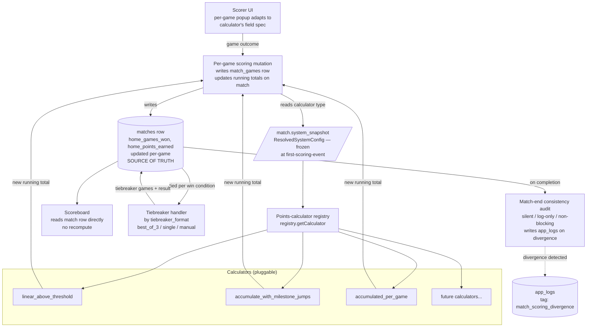

# feat: Modular league system v2 — calculator registry, decomposed runtime, BCA-pitch demo

## Overview

This plan supersedes the 2026-04-28 modular-league-system plan. ~30 commits of implementation work surfaced architectural conflations the original plan didn't catch — specifically that the existing preset modules (`bca3v3`, `bca5v5`, `fargo5v5`) bundle several axes that should be independent (handicap type, points-calculation formula, win condition, threshold mechanism). The conversation that produced the corrections is captured verbatim in the architectural reframe supplement at `docs/plans/2026-04-28-001-feat-modular-league-system-plan-supplements/architectural-reframe-2026-05-01.md` — that supplement is the load-bearing source of truth for this plan.

This plan completes the modular refactor by:
1. **Pluggable per-game calculator dispatch** — the existing hardcoded `is5v5` ternary in scoring is replaced by a calculator registry. Each calculator runs PER-GAME during scoring mutations, updating running totals on the match record. There is **no match-end recompute layer.** The match record is the source of truth, updated in real-time. (See Architectural decisions below.)
2. **Adding a points-calculator registry** — formula type + JSONB params, same shape as `threshold_charts`. LOs can edit params; runtime is parameter-blind. Each calculator declares its scoring-popup field spec (so the per-game UI adapts to the league's calculator).
3. **Renaming the schema** — `scoring_method` becomes `points_calculator`; `win_condition` collapses from 4 values to binary (games | points). Threshold columns rename to mode-neutral (`*_games_to_*` → `*_to_*`). Redundant `home_team_score` / `away_team_score` columns dropped (they were silently mirroring either games or points based on league type — semantic-shift bug surface).
4. **Reworking the wizard** — `ScoringMethodStep` becomes a calculator-type-with-params step; preset cards become "Tested Preset" UX bundles.
5. **Wiring the threshold layer** — `lookup_threshold()` RPC integration, Fargo Layer 1 generative engine, BCAPL Skill Level Layer 2 seed. **BCA points handicap also has a Layer 1 generative formula** (provided 2026-05-01: `(team_diff + total_games) / 2` with whole-number → tie-possible, .5 → no-tie. Reproduces existing chart exactly; scales to any lineup × RR mode).
6. **Match-end consistency audit (silent)** — at match completion, recompute games-won and points-earned from `match_games` rows and compare to the running columns. If divergent, log to `app_logs`. **The match record is NOT modified.** Player-facing scoreboard never changes from what they saw live; dev-facing log catches running-total bugs early.
7. **Completing audit + dropping `team_format`** — finishing Phase 6.2 and Phase 7 from the original plan

The forcing function remains the BCA pitch — the demo subset is preserved (see [BCA-Pitch Demo Subset](#bca-pitch-demo-subset)).

## Problem Frame

The original brainstorm at `docs/brainstorms/modular-league-system-requirements.md` framed the problem as: replace the hardcoded `5_man` / `8_man` league type tags with a fully modular configuration system across 13 axes (R1–R13), with rating-edit audit (R21) and graceful-degradation as the load-bearing principle.

The original 2026-04-28 plan delivered ~60% of that work. What it missed — and what this plan corrects — is the conflation between **preset bundles** (the three shipped modules) and **the runtime substrate** (which should compose from per-axis dispatch). Concretely: `is5v5 = lineup_size === 5` routes between two scoring formulas in `MatchEndVerification.tsx`, but lineup size has no causal relationship to scoring formula. Either formula should work at any lineup size. Routing on lineup size bakes in a coupling the modular model rejects.

The supplement Section 4 documents seven specific anti-patterns from the prior implementation, each with the user's correction quoted verbatim. Most importantly:

- **Lineup size is a count.** Independent of every other axis.
- **Handicap type is just a rating system.** Independent of points calculation, win condition, threshold mechanism.
- **Points calculator is a formula type with editable parameters.** Can be `null` (don't track points). Independent of handicap.
- **Win condition is binary** (games | points) — choosing which of the two metrics we always track decides the winner.
- **The three existing modules are wizard-card "Tested Preset" bundles.** Convenient axis-value snapshots, not architecture. The runtime composes from per-axis dispatch; it never branches on "is this the Fargo preset" or "is lineup size 5."

(see origin: `docs/plans/2026-04-28-001-feat-modular-league-system-plan-supplements/architectural-reframe-2026-05-01.md`)

## Requirements Trace

This plan satisfies the same R1–R21 requirements from the original brainstorm, with two corrections to terminology:

| Original | Corrected |
|---|---|
| R5: per-game scoring method (`winner_takes_all` / `points_10_7` / `race_winner`) | R5 (revised): **points calculator** — typed formula with editable JSONB params; can be NULL |
| R6: match win condition (4 values) | R6 (revised): **win condition** — binary `games \| points` |

All other requirements (R1–R4, R7–R13, R17–R21) carry forward unchanged. Mapping to phases:

- **Modular axes (R1–R13):** Phase 1 calculator registry + Phase 2 schema corrections + Phase 4 wizard rework cover the 7 corrected axes
- **Audit log (R21):** Phase 6 (Unit 6.1 already shipped; Unit 6.2 wires emission)
- **Combo coherence (R14–R16):** Phase 4 Unit 4.2 with the corrected combo enumeration
- **Migration and deprecation (R17–R20):** Phase 7 drops `team_format`
- **Tested Preset framing:** new UX layer over the existing `LeagueFormatStep` (Phase 4 Unit 4.1)

Plus new requirements from the supplement:

- **Points-calculator parameter editability** (supplement Section 2): inline editable params on the wizard's calculator-type cards; LO can override Tested Preset defaults
- **Tie-band invariance for `linear_above_threshold`** (supplement Section 4 anti-pattern): the formula's three-band behavior (above-win / tie-band / below-tie) is locked; the multiplier scales the bands but never moves the tie band off zero
- **Tiebreaker-game exclusion from points (calculator-internal rule):** the `linear_above_threshold` calculator's tie-band rule excludes tiebreaker games from its points calculation. This decision lives **inside the calculator**, not as a global filter — a future calculator could choose differently. Tests for tie-band-with-tiebreaker behavior must be written explicitly (Phase 5 Unit 5.5); existing characterization tests don't actually guard this rule despite earlier supplement claims to the contrary.
- **Per-game calculator dispatch (no recompute layer):** the per-game scoring mutation calls `registry.getCalculator(snapshot.points_calculator).compute(...)` and writes the new running totals to the match row. The match record is the source of truth in real-time. Match completion is just persistence (no recomputation). A silent post-completion audit (Phase 5 Unit 5.6) catches running-total bugs without modifying the match record.

## Scope Boundaries

### In scope

- All seven corrected modular axes with composition-correct runtime dispatch
- Points-calculator registry with three calculator types (`linear_above_threshold`, `accumulate_with_milestone_jumps`, `accumulated_per_game`) plus `null`
- JSONB params storage on `preferences` and `system_snapshot`
- Schema rename: `scoring_method` → `points_calculator`; `win_condition` value-space collapse
- Threshold-layer wiring (Phase 3 from original plan)
- Wizard rework: PointsCalculatorStep with inline param editing; WinConditionStep simplified to 2 values; "Tested Preset" UX framing on LeagueFormatStep
- Combo coherence validator with the corrected value space
- Decomposed `SystemModule` strategies + `MatchEndVerification` / `useSpectateMatch` refactor to dispatch on `points_calculator`
- Audit emission wired through existing rating-edit pathways (Unit 6.2)
- `team_format` column drop (Phase 7)
- Off-preset combination smoke tests proving the modular guarantee (supplement Section 8.2)

### Already shipped — ✅ no revision needed

| Unit | Commit | Reason status holds |
|---|---|---|
| Phase 0 (research + characterization tests) | Multiple, ending `cb035d4` | Tests still apply; fixtures protect refactor |
| Unit 1.1 (status-aware tier-1 lock) | `426e095` | Independent of scoring axes |
| Unit 1.2 (`SystemModule.key` widening) | `5cd29a5` | Type change still right |
| Unit 1.3 (mechanism-discriminated thresholds) | `5cd29a5` | Mechanism axis is correct in the new model |
| Unit 2.4 (threshold_charts production RLS) | `8f8b3f3` | Independent of scoring axes |
| Unit 5.3 (sortStandings helper) | `c924bfc` | Reads `standings_sort` priority correctly |
| Unit 5.4 (tiebreaker game numbers) | `cb035d4` | Independent of scoring axes |
| Unit 6.1 (atomic rating-mutation RPCs) | `98dcf63` | Audit infrastructure unaffected by scoring reframe |

### Already shipped — 🟡 needs revision

These units shipped functional code but used the old terminology or carry conflations that this plan corrects.

| Unit | Original commit | Revision required | Lands in |
|---|---|---|---|
| Unit 2.1 (modular preference columns) | `b27cf5a` | `scoring_method` → `points_calculator`; add `points_calculator_params` JSONB; `win_condition` value-space collapse | Phase 2 Unit 2.1 (revised) |
| Unit 2.2 (snapshot writer + ResolvedSystemConfig) | `d66a30a`, `606615e` | Match new column names; capture `points_calculator_params` | Phase 2 Unit 2.2 (revised) |
| Unit 2.3 (resolved view + audit log table) | `d66a30a` | View exposes corrected column names | Phase 2 Unit 2.3 (revised) |
| Unit 5.1 (`buildSystemFromPreferences`) | `f68ac3e` | Fast-path through preset modules works for type-resolution. The function continues to exist for non-scoring uses (rating-system display, lineup constants, etc.) — but it no longer routes scoring. Per-game scoring goes through the calculator registry directly (Phase 5 Unit 5.5). The function's role narrows. | Phase 5 Unit 5.5 |
| Unit 5.2 (snapshot reads + `team_format` removal) | `59c9ea6`, `ae29d1c` | Snapshot-first reads correct. The `is5v5 = lineup_size === 5` derivation is wrong — replaced by per-game-mutation calculator dispatch (no longer reads `is5v5` at all). MatchEndVerification reads finalized totals from the match row (no recompute). | Phase 5 Unit 5.5 |

### Already shipped — 🔴 superseded

| Unit | Original commit | Reason | Lands in |
|---|---|---|---|
| Unit 4.1 (wizard expansion) | `b907d28`, `6b2846a` | `ScoringMethodStep` options (`winner_takes_all` / `points_10_7` / `race_winner`) are conflated bundles. Needs full rework as a `PointsCalculatorStep` with calculator-type-plus-params shape. `WinConditionStep` collapses from 4 options to 2. | Phase 4 Unit 4.1 (rewrite) |

### Out of scope (deferred)

These remain deferred from the original brainstorm:

- Lineup size = 1 (individual leagues) and lineup size = 2 — architecture remains extensible
- APA-style alternating-pick individual-race format — extensibility preserved; not implemented
- Head-to-head as standings tiebreaker key
- Anti-sandbag rule expansion beyond what's in `bca3v3.ts`
- FargoRate API integration for automatic rating fetch
- Achievement dialog redesign
- Mid-season system changes that would affect already-scored games

### Deferred to separate tasks

- **Result Export workstream** (BCA national database / LeagueSys format API integration). Multi-week project of its own. Strategic dependency for the BCA pitch — separate follow-up requirements doc post-meeting.
- **Result Export Stub** (parallel workstream). Manual CSV export of completed matches from operator dashboard, in a documented schema. ~2-3 days. Schema document delivered as a deliverable separate from CSV implementation. Owner: same developer; runs alongside this plan.
- **Points-calculator parameter editing UI in League Settings** (Phase 4 Unit 4.4 below ships the wizard's inline editing; a sibling editor for post-creation editing is post-meeting work).
- **Calculator chart editor UI** (sibling to threshold chart editor) — defers to a post-meeting unit; Tested Preset defaults work out of the box for v1.

## Context & Research

### Architectural reframe supplement (load-bearing source of truth)

Read `docs/plans/2026-04-28-001-feat-modular-league-system-plan-supplements/architectural-reframe-2026-05-01.md` before any implementation work. It captures the corrected axis model (Section 1), the points-calculator architecture (Section 2), the Tested Preset framing (Section 3), seven anti-patterns with user corrections quoted verbatim (Section 4), per-unit shipped status (Section 5), planning-resolved questions (Section 6), what this plan must produce (Section 7), implementation conventions (Section 8), and pre-implementation research tasks (Section 9).

### Brainstorm requirements

`docs/brainstorms/modular-league-system-requirements.md` — the original origin doc. R1–R21 + Success Criteria + Worked Examples A/B/C still drive scope.

### Existing code patterns and reference files

- **`src/systems/types.ts`** — `SystemModule` interface. The `scoring` capability is being deprecated in favor of per-game calculator dispatch (Phase 5 Unit 5.5). The interface narrows.
- **`src/systems/buildSystemFromPreferences.ts`** — current ad-hoc resolver. Routes scoring through the existing preset modules' god-functions = wrong. Refactored in Phase 5.
- **`src/systems/{bca3v3,bca5v5,fargo5v5}.ts`** — Tested Preset modules. Survive as fully-specified axis-value bundles for the wizard's preset cards. Their existing `computeMatchResult` god-functions get replaced by composition over the new strategies.
- **`src/types/match.ts`** — contains `calculatePoints` (the existing `linear_above_threshold` formula in disguise — three-band logic with tie-band-absorbs) and `calculateBCAPoints` (the existing `accumulate_with_milestone_jumps` formula). These move into the new calculator registry; the names get fixed.
- **`src/components/scoring/MatchEndVerification.tsx`** — the heaviest scoring consumer. After Phase 5 Unit 5.5, this component reads finalized totals directly from the match row (no `is5v5` ternary, no recompute). The component still owns the verify-and-complete UI flow.
- **`src/hooks/useSpectateMatch.ts`** — same pattern, smaller scope.
- **`src/wizards/league-v2/steps/ScoringMethodStep.tsx`** — fully replaced by `PointsCalculatorStep` (Phase 4 Unit 4.1 rewrite).
- **`src/wizards/league-v2/steps/WinConditionStep.tsx`** — value space collapses from 4 to 2.
- **`supabase/migrations/20260410000002_threshold_charts.sql`** + `lookup_threshold()` SQL function — chart infrastructure already shipped, zero runtime callers. Phase 3 Unit 3.1 wires it.
- **`supabase/migrations/20260429000005_rating_mutation_rpcs.sql`** — atomic rating RPCs already shipped. Phase 6 Unit 6.2 wires existing pathways through them.

### Research artifacts

- **`docs/research/fargorate-formula.md`** — start-points formula, complete. Used by `accumulated_per_game` calculator math.
- **`docs/research/fargo-games-won-threshold.md`** — **stub, unresolved.** Web research blocked at planning time; manual research or a future agent with web access required. Gates Unit 3.2 (Fargo Layer 1 `extra_games` math). The stub documents what's known, the logical derivation that COULD work as a fallback, and where to look (FargoRate site, AzBilliards forum, LeagueSys docs).
- **BCAPL Playing Handicap Chart** — pending source from playbca.com or BCA contact. Gates Unit 3.3.
- **`docs/plans/2026-04-28-001-feat-modular-league-system-plan-supplements/lo-manual-scoring-investigation.md`** — hybrid-port recommended for Unit 3.4.

### Project conventions

From `CLAUDE.md` and project memory:

- **shadcn-only UI** — every new wizard step / editor screen uses shadcn primitives. No raw HTML form elements.
- **pnpm only** — never npm.
- **`TABLE_OF_CONTENTS.md`** updated for every new/moved/deleted file.
- **No code in chat** — describe changes; let edits convey detail.
- **Calendar component for dates**; `parseLocalDate`/`formatLocalDate` for timezone safety.
- **Tests:** Vitest 4.0 (happy-dom env, `globals: true`, `@/` alias). Co-located in `src/**/__tests__/`.
- **Migrations** live in `supabase/migrations/`. User and partner run them manually on local Supabase.
- **All app data is disposable test data** — no real users; truncate/rebuild rather than preserve.
- **Migration consolidation rule** (per supplement Section 8.1) — within a single open PR, consolidate migrations to a single forward-only intent. Each unit's verification step includes this checklist item.
- **Vacate-and-rescore is the only fix path** for completed game data. Audit log respects this.

## Key Technical Decisions

The following decisions resolve all 8 open questions in the supplement Section 6, plus several new questions surfaced by the implementation work since the original plan.

### Decisions resolving supplement Section 6 questions

- **6.1 — DB shape for points-calculator params: JSONB column on `preferences` + `system_snapshot`.** Single row per league preference. Sibling `points_calculator_charts` table deferred until LOs need swappable configs. Cheapest, simplest, sufficient for v1.

- **6.2 — Migration approach: `db reset`.** Dev data is disposable per project memory; no backfill plumbing.

- **6.3 — Threshold storage: REPURPOSE existing columns AND rename them to mode-neutral.** Same physical columns hold the threshold values; column names drop the misleading "games" prefix.

  Renames in Unit 2.1 migration:
  - `home_games_to_win` / `away_games_to_win` → `home_to_win` / `away_to_win`
  - `home_games_to_tie` / `away_games_to_tie` → `home_to_tie` / `away_to_tie`
  - `home_games_to_lose` / `away_games_to_lose` → `home_to_lose` / `away_to_lose`

  Semantic mapping by `win_condition`:
  - `win_condition='games'` — values are game counts. `*_to_win` is the games target; `*_to_tie` is the tie threshold; `*_to_lose` is the decisive-loss threshold (NULL when not applicable).
  - `win_condition='points'` — values are points-units. `*_to_win` is the points target if any (NULL for play-all-games-no-target); `*_to_tie` is the start-points credit the team begins the match with (0 for stronger team, N for weaker team in start-points mechanism). User's worded rule: "if the lower team gets 27 points initially then that is what the higher team needs to tie the match" — i.e., the credit equals the differential the higher team must close to tie. `*_to_lose` is NULL (concept doesn't map cleanly to points mode).

  The `ResolvedSystemConfig` snapshot carries `win_condition` + `mechanism`, so any consumer that reads these columns also has the unit context in the same data structure. Documentation lives on the type, not on column comments.

- **6.4 — Race-format pairings: race-to-N produces one game-win per race.** No special calculator type. The race length lives on the pairing-format axis; the winner of the race contributes one game-win exactly as a single-rack pairing would.

- **6.5 — Early termination: implicit via threshold values.** No separate axis. `*_to_win` set → match can end early once a team reaches it. NULL → play all games and compare totals at the end.

- **6.6 — Wizard params editing: inline expansion under the selected calculator card.** Default values pre-filled from the Tested Preset. LO can edit there; can also revisit later in League Settings (deferred unit). Picking the "None — don't track points" card hides the params section entirely.

- **6.7 — `accumulate_with_milestone_jumps` + even-game format: WARN at combo coherence; no variant calculator type.** The formula is monotonic (no tie band). When paired with an even-game format that can tie, the combo coherence validator surfaces "this calculator doesn't handle ties — a team that just barely tied at the threshold gets the same points as a team that blew through it." LO can save anyway.

- **6.8 — Combo coherence rules:**
  - **ERROR** (blocks save): `points_calculator: null` + `win_condition: points`
  - **ERROR** (blocks save): `pairing_format: race_to_n` + `points_calculator: accumulated_per_game` (no per-game balls-pocketed concept in race-mode)
  - **WARNING**: combo doesn't match a Tested Preset bundle (off-preset)
  - **WARNING**: combo has no calibrated formula at runtime (graceful fallback applies; results may not match LO expectations)

### Other decisions specific to this plan

- **Per-game calculator dispatch + running totals on the match record (NO match-end recompute).** The match record is the source of truth, updated in real-time as games are scored. There is no separate function that "tallies totals at match end." Concretely:
  - When a game is scored, the scoring mutation calls the league's calculator (looked up from `points_calculator` on the snapshot). The calculator returns the new running points total. The mutation writes `home_points_earned` / `away_points_earned` and `home_games_won` / `away_games_won` on the match row.
  - The scoreboard reads these columns directly (no recomputing by counting `match_games` rows).
  - At match end, no recomputation. The match-completion mutation just writes `winner_team_id`, `match_result`, `completed_at`. The scoring columns are already final from the last per-game write.
  - Tiebreaker games are scored the same way; the calculator decides whether tiebreaker games contribute to the team's points (the `linear_above_threshold` calculator's tie-band rule says they don't — that decision lives inside the calculator, not in a global filter).

  Why no recompute: a second computation path drifts. Players witness running totals during play; if a different total appears later, they gripe about a thing they can't articulate. The match record reflects what they saw; bug reports are about specific scoring events, not mysterious changes.

- **Match-end consistency audit (silent, log-only, non-blocking).** At match completion, recompute the totals from `match_games` rows and compare to the stored running columns. If divergent, write to `app_logs` with `tag: 'match_scoring_divergence'` plus context (match_id, expected, actual, calculator name from the snapshot). **The match record is NOT modified.** Match completion proceeds. The audit is purely diagnostic — it catches running-total bugs without trying to fix them. Auto-correcting would hide the bug AND change what players witnessed; both are wrong.

  Player-UX rationale (the load-bearing reason): if the scoreboard shows X at match-end and a recompute later changes it to Y, players gripe about something they can't articulate. The match record reflects exactly what they saw during play; if a divergence occurs, the dev investigates from `app_logs`, not from a player report saying "something changed."

  Engineering rationale (the secondary reason): two computation paths drift; loud canaries are better than silent ones; auto-correct hides bugs.

- **The three Tested Preset modules survive as axis-value bundles, not runtime substrate.** `bca3v3.ts`, `bca5v5.ts`, `fargo5v5.ts` keep the file path for backward compatibility but their existing `computeMatchResult` god-function is replaced by per-game calculator dispatch through the registry. `buildSystemFromPreferences` no longer routes scoring through these modules — the per-game scoring mutation looks up the calculator from `points_calculator` directly. The preset modules become convenience records that map a preset name to its full set of axis values.

- **Tie-band invariance is a calculator-internal rule, not a global strategy filter.** The `linear_above_threshold` calculator implements its three-band behavior (above-win → linear; tie-band → 0; below-tie → linear) and explicitly ignores `is_tiebreaker = true` games when summing into the team's running points total. That choice lives **inside the calculator**, not in a global "filter tiebreakers everywhere" rule. A future calculator can choose differently. This preserves the modular extensibility the architecture promises.

  **Tests for tie-band-with-tiebreaker behavior need to be written, not assumed.** The original supplement claimed existing characterization tests guard this. They don't — `getTeamHandicapBonus.characterization.test.ts` tests an unrelated function, and `match-scoring.characterization.test.ts` constructs all its fixtures with `is_tiebreaker: false`. Unit 1.2's verification step explicitly includes new tests for the tie-band-with-tiebreaker case (won 9 of 18 + won tiebreaker = 0 points; same team + lost tiebreaker = 0 points).

- **Calculator interface: flexible-input + scoring-popup field declaration.** A calculator (in the registry) declares:
  - **The math** — a function that takes whatever input shape it needs (some calculators take aggregate `games_won + thresholds`; others like `accumulated_per_game` take per-game records with balls-pocketed). The interface accepts either via discriminated input.
  - **The editable parameters** — typed via zod schema; defaults match Tested Preset values.
  - **The per-game scoring-popup field spec** — what fields the scoring popup should ask for (e.g., "balls pocketed by loser, range 0–7" for `accumulated_per_game`; just "who won" for `linear_above_threshold`). For the `accumulated_per_game` calculator, the spec is per-side: each side independently configurable as fixed-points OR counter-input with min/max.

  This must be resolved in Unit 1.1 (the interface definition) before Units 1.2–1.4 ship the individual calculators — otherwise the third calculator forces an interface revision that ripples back through the first two.

- **Manual tiebreaker option is always available.** Tiebreaker formats are pluggable (best-of-3, single short race, race-to-N, etc.) but `tiebreaker_format = 'manual'` is always one of the choices. When triggered, the system shows an LO-facing dialog: "Match has tied. Enter the winner. Optional: additional games played, additional points scored." LO records the result; system persists it. This means every league has a working tiebreaker on day one even if their specific rule isn't codified yet.

- **BCA points handicap has a Layer 1 generative formula.** The original brainstorm said "BCA points and BCA percentage handicap systems lack the probabilistic foundation for clean extrapolation." That's wrong — at least for points. Formula provided 2026-05-01:

  ```
  team_threshold = (team_handicap_diff + total_games) / 2
  whole number → that's "to_tie" (tie possible)
  .5 → no tie possible; round up to "to_win"
  ```

  Reproduces the existing 3v3 chart exactly across multiple data points. Scales to any lineup × RR mode combination (3v3, 4v4, 5v5, 6v6 across single or double round-robin). The chart in `get3v3GamesNeeded.ts` becomes optional; the formula generates the same values. Layer 1 status updated:

  | Combination | Layer 1 status |
  |---|---|
  | Points handicap + games-won + extra-games | ✅ Formula above |
  | Fargo + points-target + start-points | ✅ Documented in `docs/research/fargorate-formula.md` |
  | Fargo + games-won + extra-games | 🟡 Stub (Unit 0.1 — research) |
  | BCAPL Skill Level + games-won + race-length | 🟡 Need chart (Unit 0.2) |
  | Percentage + games-won + extra-games | 🔴 Open — no formula or chart yet |

- **Drop redundant `home_team_score` / `away_team_score` columns.** Audit of the existing schema found these columns are written to but mean different things in different leagues:
  - In Fargo: `home_team_score` is set to the Fargo points total (duplicate of `home_points_earned`).
  - In BCA: `home_team_score` is set to the games-won count (duplicate of `home_games_won`).

  Same column, two different meanings, both already stored elsewhere. Dropped in Unit 2.1 migration. Display layer reads `home_games_won` or `home_points_earned` directly based on the league's `win_condition`.

- **Points-calculator type is open-ended.** The registry pattern allows future calculator types to be added without runtime changes. Each type ships with: a name, a formula function `(games, threshold, params) → number`, a parameter schema (TS interface + zod schema for validation), default params for use as a Tested Preset value, and worked-example documentation for the wizard's info button.

- **`scoring_method` column rename is a hard rename, not an alias.** Migration drops the old column name and creates the new one. Dev data disposable; no compat shim. CHECK constraint on the new column enumerates the calculator-type values plus NULL.

- **`win_condition` value-space collapse is a hard simplification.** Migration drops the old CHECK constraint allowing 4 values and replaces with one allowing 2. Existing rows with values from the old space (`first_to_pairings`, `total_points_target`, `highest_after_all_games`) get mapped: any games-counting value becomes `games`; any points-counting value becomes `points`.

- **Threshold-source step (Phase 4 Unit 4.3) deferred from BCA-demo subset.** Layer 2 presets cover the demo; the threshold-source UI is post-meeting polish.

- **Tested Preset framing in the wizard's `LeagueFormatStep`.** Cards relabeled with a "Tested Preset" badge or similar trust signal. Card descriptions explain what the bundle locks in. Picking a preset card fills all 7 axes from the preset's mapping; wizard confirms with the LO before saving. Custom card walks through each axis individually.

## Open Questions

### Resolved during planning

All 8 supplement Section 6 questions resolved (see Key Technical Decisions above).

Plus:
- **`scoring_method` rename strategy:** hard rename, not alias. Migration drops old column, creates new. Dev data disposable.
- **`win_condition` value mapping:** four-to-two collapse with deterministic mapping per existing-value (most existing dev rows are `first_to_games` → `games`).
- **Calculator type registry location:** `src/systems/calculators/` directory with one file per calculator + an `index.ts` registry. Mirrors `src/systems/{bca3v3,bca5v5,fargo5v5}.ts` layout.
- **Decomposed strategies location:** stay on `SystemModule` interface (composition over inheritance — each preset module composes from the same strategies). Strategy implementations live in `src/systems/strategies/` directory.
- **Threshold storage semantic mapping under points mode:** documented in DB column comments and the resolved view.

### Deferred to implementation

- **Exact migration sequencing within Phase 2.** The column rename + JSONB add + value-space collapse can land in one migration or two; implementer decides based on what's cleanest. Per supplement 8.1, consolidate before PR.
- **Specific TS type shapes for each calculator's params interface.** Driven by the existing `calculatePoints` / `calculateBCAPoints` signatures. Implementer extracts.
- **Whether the `PointsCalculatorStep` shows all 4+ calculator cards always or filters by `pairing_format`** (race-format would hide `accumulated_per_game`). Implementer decides based on what feels cleanest with shadcn `CardSelector`.
- **Whether `LeagueFormatStep` cards get a "Tested Preset" badge** (visual change) or stay textually unchanged with the framing carried by description copy. Implementer decides during wizard-rework UX work.
- **Audit-log SELECT-policy behavior for `recompute_member_rating` rows with NULL `organization_id`** — supplement 6.2 of original plan flagged this; not load-bearing for the demo. Resolve when Unit 6.2 implementation lands.
- **`PointsCalculator` parameter validation surfacing:** zod errors at save time vs runtime fallback when params are malformed. Implementer chooses — recommendation is zod at save (TS type narrowing + clear LO error message).

## High-Level Technical Design

> *This illustrates the intended approach and is directional guidance for review, not implementation specification. The implementing agent should treat it as context, not code to reproduce.*

The runtime architecture is **per-game-mutation-driven**, with the match record as the running source of truth:



**Key invariants:**

1. **The match record is updated per-game-mutation, not at match-end.** `home_games_won`, `home_points_earned` (and away counterparts) reflect the running totals after each game. The scoreboard reads them directly.
2. **Calculators run during scoring, not at match-end.** Each scoring mutation calls `registry.getCalculator(snapshot.points_calculator).compute(...)`, gets the new running total, writes it to the match row.
3. **Match completion is just persistence.** `winner_team_id`, `match_result`, `completed_at` get written. No recomputation of points or games.
4. **The audit is silent.** It runs at completion, recomputes from `match_games`, compares to the row, logs to `app_logs` if divergent. The match record is **never modified** by the audit — players' witnessed scoreboard stands as truth.
5. **Tiebreaker games count toward `match_games` rows but the calculator decides whether they contribute to points.** `linear_above_threshold` excludes them (its tie-band rule). A future calculator could include them. The decision lives inside each calculator.

The points-calculator registry pattern (mirroring `threshold_charts`):

```
points_calculator (TEXT)
  ├── 'linear_above_threshold'      → aggregate-input formula:
  │                                   compute(team_games_won, thresholds, params) → points
  ├── 'accumulate_with_milestone_jumps' → aggregate-input formula:
  │                                   compute(team_games_won, thresholds, params) → points
  ├── 'accumulated_per_game'        → per-game formula:
  │                                   computeFromGames(stored_games[], params) → points
  │                                   (per-side counter config: fixed-points OR counter with min/max)
  └── NULL                          → no points; standings sort cannot include points_earned
                                       and win_condition must be 'games'

points_calculator_params (JSONB)
  └── shape varies by calculator type; validated at save by zod schema
  └── examples:
      linear_above_threshold       → { per_extra_game_multiplier: number }
      accumulate_with_milestone_jumps → { per_game_increment, milestone_percent,
                                          milestone_jump_value, win_threshold_jump_value }
      accumulated_per_game         → { winner: { use_counter: bool, points_or_min, max? },
                                       loser:  { use_counter: bool, points_or_min, max? } }
```

Runtime is parameter-blind: the per-game scoring mutation calls `registry.getCalculator(type)`, looks up which input shape it takes (aggregate vs per-game), feeds the right input + params, gets a new running total. LOs edit params; runtime doesn't know or care what the values are.

**Each calculator also declares its scoring-popup field spec.** This is what fields the per-game scoring popup should ask for. `linear_above_threshold` and `accumulate_with_milestone_jumps` only need "who won this game?" (no per-game numeric inputs). `accumulated_per_game` needs configurable counters per side based on its params (e.g., for the Tested Preset: no counter for winner — fixed 10 points; counter for loser, min 0 max 7 — points = balls pocketed).

**Achievement fields (golden break, break-and-run, runout, forfeit, early-8) are independent of scoring.** They're tracked on `match_games` per league preferences regardless of calculator choice. Today's three calculators ignore them. A future calculator that consumes achievements (e.g., "10-7 + bonus on break-and-run") would be its own distinct calculator type, not a parameter on `accumulated_per_game`.

## Implementation Units

Phases organized by dependency. Phase 0 research blocks Phase 3. Phase 1 (calculator registry foundation) unblocks Phases 2/4/5. Phase 2 schema corrections unblock Phases 3/4/5. Phase 5 decomposition is the load-bearing runtime refactor. Phase 6 audit emission completion is largely independent; Phase 7 `team_format` drop runs last.

### Phase 0 — Pre-implementation research (blocking)

- [ ] **Unit 0.1: Replace Fargo games-won threshold research stub with canonical formula or chart**

**Goal:** The stub at `docs/research/fargo-games-won-threshold.md` was created during planning when web research was unavailable. It documents the question, the logical derivation that COULD work, and where to look. This unit completes the research and replaces the stub with the canonical formula or chart values.

**Requirements:** R7 (handicap rating system), R9 (threshold source — Layer 1 generative for Fargo)

**Dependencies:** None (gating Unit 3.2)

**Files:**
- Modify: `docs/research/fargo-games-won-threshold.md`

**Approach:**
- Hand or web-research the sources listed in the stub's "Where to look" section
- Replace the "UNRESOLVED" status with the canonical formula or a documented chart-based approximation
- Add 3+ calibration test cases (real matches with confirmed thresholds)
- Note any variants observed across Fargo-using league-management tools

**Verification:**
- The doc no longer has `status: UNRESOLVED`
- Sources are cited with URLs
- Formula or chart is testable (worked examples produce specific output values)

- [ ] **Unit 0.2: Source the BCAPL Playing Handicap Chart**

**Goal:** Get the published BCAPL Skill Level → race-to-N chart from playbca.com or via BCA contact. Required for Unit 3.3 to seed the Layer 2 preset.

**Requirements:** R7, R9 (Layer 2 preset for BCAPL SL)

**Dependencies:** None (gating Unit 3.3)

**Files:**
- Create: `docs/research/bcapl-playing-handicap-chart.md`

**Approach:**
- Source the chart from playbca.com (preferred) or BCA contact
- Capture both 8-ball and 9-ball chart variants if separate
- Document each (SL_higher, SL_lower) → (race_higher, race_lower) cell
- Include any official footnotes (handicap caps, special-case rules)

**Verification:**
- Doc captures the full chart values
- Source citation is authoritative (BCAPL official document or direct BCA contact attribution)

- [ ] **Unit 0.3: Mobile-app schema-dependency grep**

**Goal:** Verify Jack's mobile app does not directly read columns we're renaming or dropping in Phase 2 Unit 2.1 or Phase 7. Required for both column-drop units.

**Requirements:** R17 (column drop), schema-rename safety

**Dependencies:** None (gating Phase 2 Unit 2.1 column rename + Unit 7.3 team_format drop)

**Files:**
- Create: `docs/plans/2026-05-01-001-feat-modular-league-system-v2-plan-supplements/mobile-schema-dependency-grep.md`

**Approach:**
- Grep Jack's mobile-app repo for these columns / strings (in queries, types, mutations):
  - **Phase 2 Unit 2.1 — being renamed:**
    - `home_games_to_win` / `away_games_to_win`
    - `home_games_to_tie` / `away_games_to_tie`
    - `home_games_to_lose` / `away_games_to_lose`
  - **Phase 2 Unit 2.1 — being dropped:**
    - `home_team_score` / `away_team_score`
  - **Phase 7 — being dropped:**
    - `team_format`, `5_man`, `8_man`
  - **Preferences column rename:**
    - `scoring_method` (renaming to `points_calculator`)
- Categorize each hit: read / write / type reference / dead code
- Coordinate with Jack on any blocking reads or writes — needs migration before the column changes ship

**Verification:**
- Memo lists each hit with classification
- Either: zero-blocking-reads documented, or each blocking read has a migration plan
- Jack confirms the migration plan before Phase 2 Unit 2.1 lands

- [ ] **Unit 0.4: Validate Fargo logistic divisor (100 vs 144)**

**Goal:** The existing `fargorate-formula.md` uses `2^(rating/100)` — a 100-point divisor. Some sources use 144. Validate against FargoRate's own current materials before Unit 3.2 ships.

**Requirements:** R9 (Layer 1 Fargo generative)

**Dependencies:** None (gating Unit 3.2)

**Files:**
- Modify: `docs/research/fargorate-formula.md` (add validation note)

**Approach:**
- Verify the divisor against FargoRate's current "Behind the Curtain" content and the official Race Calculator
- If 100 is confirmed correct, add a citation
- If 144 turns out to be the current value, update the existing fargo doc and flag the existing `fargo5v5.ts` calibration constant for re-validation

**Verification:**
- Existing `fargo5v5.ts` `transformRating` function uses the validated divisor
- All existing characterization tests still pass with the validated value (Test Case 1: 117-point gap → 56 start-points within ±1)

### Phase 1 — Calculator registry foundation (NEW)

- [x] **Unit 1.1: Define `PointsCalculator` interface and registry skeleton** *(completed 2026-05-01)*

**Goal:** Establish the type-and-params pattern. No calculator implementations yet; just the interface, the registry, and a smoke test that confirms the registry shape compiles.

**Requirements:** R5 (corrected) — points_calculator axis

**Dependencies:** None

**Files:**
- Create: `src/systems/calculators/types.ts`
- Create: `src/systems/calculators/index.ts`
- Test: `src/systems/calculators/__tests__/registry.test.ts`

**Approach:**
- Define `PointsCalculator<P>` generic interface: `{ name: string, compute: (gamesWon: number, thresholds: HandicapThresholds, params: P) => number, defaultParams: P, paramSchema: zodSchema, description: string, formulaText: string, examples: WorkedExample[] }`
- Define `PointsCalculatorType` as the union of registered calculator name strings (extensible)
- Registry: `Record<PointsCalculatorType, PointsCalculator<unknown>>` with a typed lookup helper `getCalculator(type) → PointsCalculator | null`
- Stub registry empty initially; Units 1.2–1.4 populate it
- Smoke test: registry exports compile; lookup helper returns null for unknown types

**Patterns to follow:**
- The shape is parallel to `threshold_charts` — runtime is parameter-blind, params are stored in JSONB and validated at save time
- Existing zod usage in `src/schemas/`

**Test scenarios:**
- Happy path: registry exports `getCalculator` and the lookup helper
- Edge case: `getCalculator('unknown_type')` returns null
- Integration: TS compilation succeeds across consumers

**Verification:**
- `pnpm exec tsc -b --noEmit` passes
- Registry test file passes
- Migrations within this unit consolidated to a single forward-only intent before PR opens (N/A — no migrations in this unit)

- [ ] **Unit 1.2: Implement `linear_above_threshold` calculator (with tie-band invariance)**

**Goal:** Lift the existing `calculatePoints` formula from `src/types/match.ts` into a standalone `PointsCalculator` implementation. **Tie-band rule is a locked invariant** (supplement Section 4 anti-pattern).

**Requirements:** R5 (corrected)

**Dependencies:** Unit 1.1

**Files:**
- Create: `src/systems/calculators/linear_above_threshold.ts`
- Test: `src/systems/calculators/__tests__/linear_above_threshold.test.ts`

**Approach:**
- Move the three-band logic from `calculatePoints` into the new file
- Params interface: `{ per_extra_game_multiplier: number }` (default 1)
- Three bands as documented in supplement Section 2:
  - Above-win: `(games_won - games_to_win) * multiplier` for games_won > W
  - Tie-band: 0 for T <= games_won <= W (always; multiplier doesn't move it off zero)
  - Below-tie: `(games_won - games_to_tie) * multiplier` for games_won < T
- Worked-example data structure populated for the wizard's info button
- The existing `calculatePoints` function in `src/types/match.ts` adds a deprecation comment and delegates to the new calculator (kept temporarily for backward compatibility; Phase 5 Unit 5.5 removes the indirection)

**Patterns to follow:**
- Existing `calculatePoints` formula in `src/types/match.ts:436-460`
- Tie-band invariance documented in supplement Section 4 anti-pattern
- Existing characterization tests at `src/utils/__tests__/getTeamHandicapBonus.characterization.test.ts` and `src/types/__tests__/match-scoring.characterization.test.ts`

**Test scenarios:**
- Happy path: tie possible (W=10, T=9, multiplier=1) — wins=12 → +2; wins=11 → +1; wins=10 → 0; wins=9 → 0; wins=8 → -1; wins=7 → -2 (matches supplement worked-examples table exactly)
- Happy path: tie not possible (W=13, T=null) — formula collapses to `wins - W`; wins=14 → +1; wins=13 → 0; wins=12 → -1
- Happy path: multiplier=2 — wins=12 (W=10) → +4; wins=8 (W=10, T=9) → -2 (multiplier scales the linear bands)
- Edge case: tie-band invariance under multiplier=0.5 — wins=9 still gets 0 (multiplier never moves the tie band)
- Edge case: multiplier=0 — all bands collapse to 0
- Integration: characterization tests at the existing locations stay green when `calculatePoints` delegates to this calculator

**Verification:**
- All existing characterization tests for `calculatePoints` pass with the delegated implementation
- Tie-band invariance test cases are explicit and named
- Migrations within this unit consolidated (N/A)

- [ ] **Unit 1.3: Implement `accumulate_with_milestone_jumps` calculator**

**Goal:** Lift the existing `calculateBCAPoints` formula from `src/types/match.ts` into a standalone `PointsCalculator` implementation.

**Requirements:** R5 (corrected)

**Dependencies:** Unit 1.1

**Files:**
- Create: `src/systems/calculators/accumulate_with_milestone_jumps.ts`
- Test: `src/systems/calculators/__tests__/accumulate_with_milestone_jumps.test.ts`

**Approach:**
- Move the formula from `calculateBCAPoints` (`src/types/match.ts:483-508`) into the new file
- Params interface: `{ per_game_increment: number, milestone_percent: number, milestone_jump_value: number, win_threshold_jump_value: number }` (defaults match BCA 5v5 today: 0.1, 0.7, 1.5, 3.0)
- Formula as documented in supplement Section 2 (verified against existing code)
- `calculateBCAPoints` adds a deprecation comment and delegates to the new calculator
- **No tie-band rule** — formula is monotonic (documented in supplement)

**Patterns to follow:**
- Existing `calculateBCAPoints` formula in `src/types/match.ts:483-508`
- Worked-example values from supplement Section 2 (BCA 5v5 default, team needs 13 wins, milestone target = 9)

**Test scenarios:**
- Happy path: BCA 5v5 default values, team needs 13 — wins=14 → 3.1; wins=13 → 3.0; wins=12 → 1.8; wins=10 → 1.6; wins=9 → 1.5; wins=8 → 0.8; wins=0 → 0
- Happy path: custom params (milestone_percent=0.5, milestone_jump_value=2.0) — formula still correct with edited values
- Edge case: per_game_increment=0 — pure step function with no linear contribution between jumps
- Edge case: team needs 1 to win — milestone target rounds to 1 (round(0.7) = 1), all win-states hit win-threshold
- Edge case: monotonicity — for any params, points(N+1) >= points(N) for all N (no tie-band makes this assertable)
- Integration: characterization tests for `calculateBCAPoints` stay green when delegated

**Verification:**
- All existing `calculateBCAPoints` tests pass under delegation
- Monotonicity assertion in tests
- Migrations within this unit consolidated (N/A)

- [ ] **Unit 1.4: Implement `accumulated_per_game` calculator**

**Goal:** Implement the per-game accumulation formula (Fargo 10-7 style) as a `PointsCalculator`. Today this lives inside `fargo5v5.computeMatchResult`'s god-function — extract it.

**Requirements:** R5 (corrected)

**Dependencies:** Unit 1.1

**Files:**
- Create: `src/systems/calculators/accumulated_per_game.ts`
- Test: `src/systems/calculators/__tests__/accumulated_per_game.test.ts`

**Approach:**
- Note: this calculator's compute signature is slightly different — it operates on per-game records, not just `games_won + threshold`. Extend `PointsCalculator<P>` interface to allow this OR provide an alternate `computeFromGames(games: StoredGameRecord[], params: P) => number` method. Implementer decides during 1.1 the cleanest way to model both shapes.
- Params interface: `{ winner_points: number, loser_per_ball_multiplier: number, loser_max: number }` (defaults match Fargo 10-7: 10, 1, 7)
- Formula: for each game, winner team += `winner_points`; loser team += `min(loser_balls_pocketed * loser_per_ball_multiplier, loser_max)`
- The current `fargo5v5.scoring.computeMatchResult` calls this calculation inline — Phase 5 Unit 5.5 removes the inline call and routes through this calculator
- Tested Preset value: Fargo 10-7 defaults

**Patterns to follow:**
- Existing inline calculation in `src/systems/fargo5v5.ts` (`computeMatchResult` function)
- Loser-balls-pocketed clamping (`clampLoserBalls` function in `fargo5v5.ts`)

**Test scenarios:**
- Happy path: Fargo 10-7 defaults — 5-game match, home wins 3 (away pocketed 4, 2, 1 balls), away wins 2 (home pocketed 6, 3 balls) → home_points = 3*10 + (6+3) = 39; away_points = 2*10 + (4+2+1) = 27
- Happy path: custom params (winner=15, loser_multi=1.2) — loser pockets 5 balls → 5 * 1.2 = 6 points
- Edge case: loser_max clamping — winner=10, loser_max=7, ball=8 → clamped to 7
- Edge case: zero balls pocketed — loser gets 0
- Edge case: empty games array — totals = 0
- Integration: existing fargo5v5 characterization tests still produce identical totals when routed through this calculator

**Verification:**
- All existing fargo5v5 characterization tests pass when its `computeMatchResult` delegates totals to this calculator
- Calculator handles every per-game scenario the inline code does
- Migrations within this unit consolidated (N/A)

- [ ] **Unit 1.5: Register calculators and write off-preset combo test**

**Goal:** Register the three calculators in the index. Add an off-preset combination test to prove the modular guarantee — i.e., the calculator works at lineup sizes other than its Tested Preset's lineup size.

**Requirements:** R5 (corrected); supplement Section 8.2 (off-preset test)

**Dependencies:** Units 1.2, 1.3, 1.4

**Files:**
- Modify: `src/systems/calculators/index.ts` (register the three calculators)
- Test: `src/systems/calculators/__tests__/off_preset_combinations.test.ts`

**Approach:**
- Populate the registry with the three calculator implementations
- Off-preset test: 4-player lineup using `linear_above_threshold` (3v3's calculator) — confirm it produces sensible numbers; 6-player lineup using `accumulated_per_game` (Fargo's calculator) — confirm it accumulates correctly; 3-player lineup using `accumulate_with_milestone_jumps` (5v5's calculator) — confirm it computes
- The point: lineup size is independent of calculator choice. Each calculator works on `(games_won, threshold, params)`. Tests verify this by running each calculator at multiple lineup sizes implied by varying total-game counts.

**Patterns to follow:**
- Supplement Section 8.2 — "tests verify the modular guarantee, not just the preset behavior"

**Test scenarios:**
- Off-preset: linear_above_threshold at 4v4 SRR (16 games, threshold=9) — wins=11 → +2, wins=8 → -1
- Off-preset: accumulated_per_game at 3v3 DRR (18 games) — sum of per-game points works correctly
- Off-preset: milestone_jumps at 6v6 SRR (36 games, threshold=19) — milestone_target = round(13.3) = 13; wins=18 → 1.5 + (18-13)*0.1 = 2.0
- Each test names the calculator + the lineup geometry explicitly

**Verification:**
- Registry returns the right calculator for each name
- Off-preset combos produce mathematically defensible numbers (no NaN, no negative for monotonic formulas, etc.)
- Migrations within this unit consolidated (N/A)

### Phase 2 — Schema corrections (REVISES original Phase 2)

- [ ] **Unit 2.1: Consolidated schema migration — preferences + matches columns**

**Goal:** Apply the supplement Section 5 schema corrections + the architectural-review schema cleanup in a single consolidated migration. Touches both `preferences` (axis-name corrections) and `matches` (threshold-column rename + drop redundant columns).

**Requirements:** R5 (corrected), R6 (corrected); supplement Section 8.1 (consolidate migrations within PR)

**Dependencies:** **Unit 0.3 (mobile-app schema-dependency grep) — must complete first to verify Jack's app doesn't read the columns being renamed/dropped.** Phase 2 only depends on schema being a clean target.

**Files:**
- Create: `supabase/migrations/YYYYMMDDHHMMSS_modular_axes_v2.sql`
- Modify: `supabase/seed.sql` — INSERT statements list the columns being renamed/dropped; update to match new shape (regenerate the seed or manually edit out the dropped columns + use new names)
- Modify: `src/api/mutations/preferenceTypes.ts` (rename `scoring_method` → `points_calculator`; add `points_calculator_params`)
- Modify: `src/types/database.types.ts` (regenerate via `pnpm db:types`)
- Modify: `src/types/match.ts` (`HandicapThresholds` type field renames; deprecation shims for `calculatePoints` / `calculateBCAPoints`)
- Modify: `src/types/schedule.ts` (drop `home_team_score` / `away_team_score` from `Match` type if present)
- Modify: every caller that reads/writes the renamed match-row columns (TS compiler will catch them)
- Test: `src/__tests__/database/modularAxesV2.db.test.ts`

**Confirmed-clean (no functional consumers, per supabase-side audit 2026-05-01):**
- No edge functions, RPCs, triggers, or views reference `home_team_score` / `away_team_score` or the renamed threshold columns
- `database/dev_starting_point.sql` (the active dev seed referenced in the project README) — verified safe; its match INSERTs use minimal columns only (`season_id`, `season_week_id`, team ids, `match_number`, `status`) and leave scoring/threshold columns at defaults. No update needed.
- The only cleanup needed: `supabase/seed.sql` (in the file list above) and historical comments in 3 migration files (non-functional, can be left alone or updated for cleanliness).

**Approach:**

ALTER TABLE `preferences`:
- DROP COLUMN `scoring_method`
- ADD COLUMN `points_calculator TEXT NULL` with CHECK constraint enumerating `linear_above_threshold | accumulate_with_milestone_jumps | accumulated_per_game | NULL`
- ADD COLUMN `points_calculator_params JSONB NOT NULL DEFAULT '{}'::jsonb`
- DROP CHECK constraint on `win_condition`
- ADD CHECK constraint on `win_condition` allowing only `games | points`
- UPDATE existing rows: `win_condition` value mapping (`first_to_games`, `first_to_pairings` → `games`; `total_points_target`, `highest_after_all_games` → `points`; any other value → `games` with a warning logged)
- Update default `points_calculator` per existing `handicap_type` defaults: `points` → `linear_above_threshold`; `percentage` → `accumulate_with_milestone_jumps`; `fargo` → `accumulated_per_game`; else NULL
- Update `points_calculator_params` defaults to match Tested Preset values for the matching calculator

ALTER TABLE `matches`:
- RENAME COLUMN `home_games_to_win` → `home_to_win`
- RENAME COLUMN `away_games_to_win` → `away_to_win`
- RENAME COLUMN `home_games_to_tie` → `home_to_tie`
- RENAME COLUMN `away_games_to_tie` → `away_to_tie`
- RENAME COLUMN `home_games_to_lose` → `home_to_lose`
- RENAME COLUMN `away_games_to_lose` → `away_to_lose`
- DROP COLUMN `home_team_score` (redundant — duplicated either games_won or points_earned depending on league type; semantic-shift bug surface)
- DROP COLUMN `away_team_score`

Note that `home_games_won` / `away_games_won` (running game count) and `home_points_earned` / `away_points_earned` (running points total) are KEPT — these become the per-mutation running-total columns in Phase 5 Unit 5.5. They are already present and correctly typed.

After migration: `pnpm db:reset && pnpm db:types` to regenerate.

The audit log table from Unit 6.1 already shipped — no schema changes there.

**Patterns to follow:**
- `supabase/migrations/20260429000001_extend_preferences_phase2_modular_axes.sql` (column-add pattern)
- Per supplement 8.1, this migration is the consolidated final shape — replace the existing `20260429000001` migration in place, do NOT create an add-then-rename pair (since the branch is unmerged, consolidation rule applies)

**Test scenarios:**
- Happy path: insert preferences with `points_calculator = 'linear_above_threshold'` and matching params — succeeds
- Happy path: insert preferences with `points_calculator = NULL` — succeeds (no points tracking)
- Edge case: insert preferences with invalid `points_calculator` value — fails CHECK constraint
- Edge case: insert preferences with `win_condition = 'first_to_games'` (old value) — fails CHECK constraint after migration
- Edge case: insert match with the renamed threshold columns — succeeds
- Edge case: select from match after migration — `home_to_win` exists; `home_games_to_win` does not; `home_team_score` does not
- Integration: existing leagues' `useResolvedLeaguePrefs` returns the new preference column names with correct defaults
- Integration: existing components that read match rows (MatchCard, MatchDetailCard, MatchEndVerification, useSpectateMatch) work with the renamed columns

**Verification:**
- `pnpm db:reset` succeeds
- `pnpm db:types` regenerates without errors
- `pnpm exec tsc -b --noEmit` passes (compiler catches every reference to renamed/dropped columns)
- All previously-merged unit tests still pass against the new schema
- Grep confirms zero references to `home_games_to_win` / `away_games_to_win` / `home_games_to_tie` / `away_games_to_tie` / `home_games_to_lose` / `away_games_to_lose` / `home_team_score` / `away_team_score` in `src/`
- Migrations within this unit consolidated to a single forward-only intent before PR opens

- [ ] **Unit 2.2: Update `ResolvedSystemConfig` + snapshot writer for new column names**

**Goal:** Type and writer track the schema corrections. Add `points_calculator_params` to the snapshot shape.

**Requirements:** R13 (snapshot)

**Dependencies:** Unit 2.1

**Files:**
- Modify: `src/types/resolvedSystemConfig.ts`
- Modify: `src/api/queries/matches.ts` (update `populateMatchSnapshotIfNeeded`)
- Test: `src/__tests__/database/snapshotShapeV2.db.test.ts`

**Approach:**
- Replace `scoring_method` field on `ResolvedSystemConfig` with `points_calculator: PointsCalculatorType | null` and `points_calculator_params: Record<string, unknown>`
- Update `win_condition` field type from 4-value union to `'games' | 'points'`
- Update `populateMatchSnapshotIfNeeded` to read the new columns from `resolved_league_preferences` and write the new shape
- Backwards-compat for legacy snapshots: in dev environments where data is disposable, do `db reset`. Snapshot consumers tolerate missing fields with module defaults + console.warn.

**Patterns to follow:**
- Existing `populateMatchSnapshotIfNeeded` in `src/api/queries/matches.ts`
- Backward-compat tolerance pattern from existing snapshot consumers

**Test scenarios:**
- Happy path: match transitions to in-progress — snapshot includes `points_calculator` and `points_calculator_params`
- Edge case: snapshot already has the new shape — writer is no-op (existing idempotency)
- Edge case: snapshot has legacy shape (`scoring_method` field) — runtime falls back to live prefs with console.warn (dev data only; will be reset)
- Integration: a match scored end-to-end after this unit produces correct results

**Verification:**
- Pure new-shape snapshots are written for new matches
- Legacy snapshots produce a console.warn but don't crash
- Migrations within this unit consolidated (N/A — no SQL migration in this unit)

- [ ] **Unit 2.3: Update `resolved_league_preferences` view for new column names**

**Goal:** View exposes `points_calculator` and `points_calculator_params` instead of `scoring_method`. Maintain the cascade.

**Requirements:** R10 (resolved view)

**Dependencies:** Unit 2.1

**Files:**
- Create: `supabase/migrations/YYYYMMDDHHMMSS_resolved_view_v2.sql`
- Test: `src/__tests__/database/resolvedViewV2.db.test.ts`

**Approach:**
- DROP and recreate the view with the new column names
- COALESCE chain: league_prefs → org_prefs → defaults
- Defaults match Unit 2.1's column defaults

**Patterns to follow:**
- `supabase/migrations/20260429000002_resolved_view_phase2_modular_axes.sql`

**Test scenarios:**
- Happy path: query view for a league — returns `points_calculator` and `points_calculator_params`
- Edge case: league has NULL for both — view returns org defaults; or system defaults if org also NULL
- Integration: `useResolvedLeaguePrefs` reads correctly

**Verification:**
- View resolves through the 3-tier cascade for the new fields
- Migrations within this unit consolidated to a single forward-only intent before PR opens

### Phase 3 — Threshold layer wiring

- [ ] **Unit 3.1: Wire `lookup_threshold()` RPC for BCA modules**

**Goal:** Replace the in-process TS chart calls (`get3v3GamesNeeded`, `get5v5GamesNeeded`) with `lookup_threshold()` RPC calls when a `threshold_chart_id` is set. Falls back to TS charts otherwise (during migration).

**Requirements:** R9 (Layer 3)

**Dependencies:** Unit 1.3 (no dependency on calculator registry, but ordering helps for cohesion)

**Files:**
- Modify: `src/utils/handicap/index.ts` (extend `getGamesNeeded` to accept optional `chartId`)
- Modify: `src/systems/{bca3v3,bca5v5}.ts` (threshold.compute reads chartId from overrides)
- Create: `src/api/queries/thresholdLookup.ts` (wraps the SQL function call)
- Test: `src/utils/handicap/__tests__/lookupThreshold.test.ts`

**Approach:**
- New `lookupThreshold(chartId, comp1, comp2)` async wrapper around the SQL function
- BCA modules' `threshold.compute` checks if `overrides.threshold_chart_id` is set; if yes calls RPC; else calls TS chart (legacy path)
- *Disposable-dev-data simplification:* once RPC outputs match TS-chart outputs in characterization, the TS files can be deleted in a follow-up

**Patterns to follow:**
- Existing TanStack Query patterns in `src/api/queries/`

**Test scenarios:**
- Happy path: chart_id set, BCA points handicap diff = 5 — RPC returns row's result
- Happy path: chart_id NULL — TS chart used (legacy)
- Edge case: RPC returns no row — fall back to TS chart with console.warn
- Edge case: range-mode chart with input below lowest range — RPC returns NULL, fall back to module default

**Verification:**
- Existing characterization tests pass (TS-chart path)
- New tests cover RPC path
- Off-preset combination tested: 4v4 league using a custom-uploaded chart returns chart-defined values
- Migrations within this unit consolidated (N/A — no SQL migration in this unit)

- [ ] **Unit 3.2: Implement Fargo Layer 1 generative engine (per-pairing logistic)**

**Goal:** Build a Fargo-only generative threshold engine for any lineup size and any (scoring × win-condition × mechanism) combo.

**Requirements:** R9 (Layer 1)

**Dependencies:** Unit 1.3, **Unit 0.1 (Fargo games-won threshold research)**, Unit 0.4 (logistic divisor validated)

**Files:**
- Create: `src/systems/fargoLogistic.ts`
- Modify: `src/systems/fargo5v5.ts` (delegate to `fargoLogistic.ts` for non-canonical combos)
- Test: `src/systems/__tests__/fargoLogistic.test.ts`

**Approach:**
- **Fargo-only engine.** Applies when `handicap_type = 'fargo'` or `'skill_level'`. BCA points/percentage do not use Layer 1.
- Per-pairing win probability: `P(A beats B) = 1 / (1 + 10^((B-A)/divisor))` where divisor sourced from Unit 0.4
- Sum expected wins across all pairings (depends on `match_structure` and `lineup_size`)
- For `mechanism = extra_games`: derive extra-games from research findings in Unit 0.1 (or stub formula from `docs/research/fargo-games-won-threshold.md` if research still incomplete)
- For `mechanism = start_points`: existing `fargo5v5.ts` logic for canonical 5v5 10-7; generic logistic-derivation for others
- For `mechanism = race_length_adjustment`: not Fargo's natural mechanism; falls through to Layer 2/3
- Honest "extrapolated" labeling via returned `confidence: 'calibrated' | 'extrapolated'` field

**Patterns to follow:**
- `fargo5v5.ts` calibration constant (`AVG_LOSER_POINTS = 4.2`)
- Origin doc Worked Examples A and C (4v4 + Fargo + games-won; 5v5 + Fargo + games-won)

**Test scenarios:**
- Happy path: 5v5 10-7 at 117-rating-gap — produces same start-points as today's `fargo5v5.ts` (characterization)
- Happy path: 4v4 single-RR + Fargo + games-won + extra_games — produces sensible extra-games count, marked `confidence: 'extrapolated'`
- Happy path: 5v5 single-RR + Fargo + games-won + extra_games — produces sensible extra-games count
- Edge case: zero rating differential — extra-games = 0 / start-points = 0
- Edge case: extreme rating differential (300+) — capped at sensible maximum (matchTotalGames - 1)
- Edge case: lineup size = 6 — no calibration data; engine still produces output, marked `extrapolated`
- Integration: Layer 1 engine output can be overridden by Layer 2/Layer 3 in the resolver
- Off-preset combo test (per supplement 8.2): 4v4 + Fargo + games-won + extra_games

**Verification:**
- Existing 5v5 10-7 characterization tests pass
- New tests cover non-canonical combos with sane outputs
- Research stub or canonical formula referenced correctly
- Off-preset combination tested
- Migrations within this unit consolidated (N/A)

- [ ] **Unit 3.3: Seed BCAPL Playing Handicap Chart as Layer 2 preset**

**Goal:** Encode the BCAPL national Skill Level race-to-N chart as a global threshold chart.

**Requirements:** R9 (Layer 2), R7 (`skill_level` handicap)

**Dependencies:** Unit 2.1 (schema), **Unit 0.2 (BCAPL chart values sourced)**

**Files:**
- Create: `supabase/migrations/YYYYMMDDHHMMSS_seed_bcapl_sl_chart.sql`
- Test: `src/__tests__/database/bcaplSlChart.db.test.ts`

**Approach:**
- INSERT INTO `threshold_charts` and `threshold_chart_rows` for the BCAPL 8-ball Playing Handicap Chart (SL → race-to-N)
- INSERT a separate chart for 9-ball if BCAPL has separate charts
- Use `chart_type = 'race_points'` (already seeded as a global template)
- Source values from Unit 0.2 research

**Patterns to follow:**
- `supabase/migrations/20260410000003_seed_threshold_charts.sql` (DO $$ block pattern for seeds)

**Test scenarios:**
- Happy path: `lookup_threshold(<bcapl_8ball_chart_id>, 5, 7)` returns expected race lengths for SL5 vs SL7
- Happy path: `lookup_threshold(<bcapl_9ball_chart_id>, 3, 3)` returns equal race lengths
- Edge case: SL out of range — returns NULL or capped values per chart spec

**Verification:**
- Charts queryable via `lookup_threshold()`
- Wizard step (Phase 4) can offer them as presets
- Migrations within this unit consolidated to a single forward-only intent before PR opens

- [ ] **Unit 3.4: Threshold-chart editor UI for LO custom override (Layer 3)**

**Goal:** Surface the existing `src/components/operator/threshold-editor/` partial UI to LOs. Hybrid port from `lo-manual-scoring` branch per Phase 0a memo.

**Requirements:** R9 (Layer 3)

**Dependencies:** Phase 0a investigation (already complete), Unit 2.3

**Files:**
- Modify or create: `src/components/operator/threshold-editor/PercentageThresholdChartEditor.tsx`
- Modify or create: `src/components/operator/threshold-editor/RaceThresholdChartEditor.tsx`
- Modify or create: `src/components/operator/threshold-editor/PointsThresholdChartEditor.tsx`
- Modify: `src/operator/LeagueDetail.tsx` (entry point button)
- Modify: `src/wizards/league-v2/steps/HandicapSystemStep.tsx` (offer "use custom chart" option)
- Test: `src/__tests__/integration/ThresholdEditor.smoke.test.tsx`

**Approach:**
- Cherry-pick + modernize from `lo-manual-scoring` per the investigation memo
- Editor allows LO to clone a Layer 2 preset and edit individual cells, or build from scratch
- Saves as `threshold_charts` row with `entity_type = 'league'` (or `'organization'`)
- Validation: warn (don't block) if chart has missing rows for expected ranges

**Patterns to follow:**
- Existing shadcn-based operator pages in `src/operator/`
- Component-First-Development per CLAUDE.md
- `Calendar` component pattern for any date inputs (none expected here)

**Test scenarios:**
- Happy path: LO clones BCA 3v3 chart, edits one row, saves — new chart row created, league `threshold_chart_id` updated
- Happy path: LO views their custom chart — values display correctly
- Edge case: LO saves chart with missing rows — warning surfaced, save succeeds
- Edge case: LO attempts to edit a global preset directly — blocked by DB trigger, suggestion to clone-and-edit
- Error path: invalid integer values — inline validation prevents save
- Integration: a league using a custom chart scores a match using LO's values

**Verification:**
- LO can author a complete custom chart and use it for a league
- Chart is consumed by runtime via Unit 3.1's RPC path
- Migrations within this unit consolidated (likely no SQL changes — UI only)

### Phase 4 — Wizard rework

- [ ] **Unit 4.1: Replace `ScoringMethodStep` with `PointsCalculatorStep` (calculator-type-with-params)**

**Goal:** Full rewrite of the wizard's scoring step. Each calculator type is a card with definition + formula + worked example + editable params + Tested Preset defaults pre-filled. "None — don't track points" is one of the cards.

**Requirements:** R5 (corrected); supplement Sections 2, 3 (Tested Preset framing), 6.6 (inline params editing)

**Dependencies:** Unit 1.5 (calculator registry populated), Unit 2.1 (schema)

**Files:**
- Delete: `src/wizards/league-v2/steps/ScoringMethodStep.tsx`
- Create: `src/wizards/league-v2/steps/PointsCalculatorStep.tsx`
- Create: `src/wizards/league-v2/steps/PointsCalculatorParamsForm.tsx` (inline form per calculator type)
- Modify: `src/wizards/league-v2/leagueWizardConfig.ts`
- Modify: `src/wizards/league-v2/leagueWizardTypes.ts` (replace `scoring-method` field with `points-calculator` + `points-calculator-params`)
- Modify: `src/wizards/league-v2/presetMappings.ts` (preset values use new keys)
- Modify: `src/wizards/league-v2/useCreateLeagueV2.ts` (write new fields)
- Modify: `src/wizards/league-v2/steps/WinConditionStep.tsx` (collapse from 4 options to 2: `games | points`)
- Modify: `src/wizards/league-v2/__tests__/presetMappings.test.ts` (update assertions for new keys)
- Test: `src/wizards/league-v2/__tests__/PointsCalculatorStep.test.tsx`

**Approach:**
- Step uses shadcn `CardSelector` showing each calculator type from the registry
- Card content: name, one-line description, formula text (preformatted), worked example
- Selecting a card reveals an inline form with editable params (zod-schema-driven; defaults from Tested Preset)
- Picking "None — don't track points" hides the params form and forces `win_condition = 'games'` in subsequent steps
- `WinConditionStep` becomes 2 cards: "Games decide the winner" and "Points decide the winner"
- `presetMappings.ts` updates: each Tested Preset (`bca3v3`, `bca5v5`, `fargo5v5`) maps to its calculator + params combination explicitly
- Race-format combo coherence: `pairing_format = race_to_n` + `points_calculator = accumulated_per_game` is a hard error (Unit 4.2)

**Patterns to follow:**
- Existing wizard step pattern in `src/wizards/league-v2/steps/`
- shadcn-only UI per CLAUDE.md
- ~100-line file size target

**Test scenarios:**
- Happy path: LO picks `linear_above_threshold` — form shows `per_extra_game_multiplier` field with default 1; LO accepts default; form data persists
- Happy path: LO picks `accumulated_per_game` — form shows winner_points / loser_per_ball / loser_max; LO edits to 15/1.2/7; form data persists
- Happy path: LO picks "None" — params section hides; subsequent `WinConditionStep` shows only "Games" option
- Edge case: invalid param values (negative multiplier) — zod validation blocks Next
- Edge case: LO navigates back, changes calculator type — params form refreshes with new defaults
- Integration: A custom league with chosen calculator + params is creatable; resolved view returns correct values
- The 3 preset cards on `LeagueFormatStep` still produce identical configurations when picked (characterization)

**Verification:**
- Wizard runs end-to-end with all calculator choices
- 3 Tested Presets produce same axis values as before (characterization)
- Off-preset combination test: a 4-player lineup using `linear_above_threshold` saves and resolves correctly
- Migrations within this unit consolidated (N/A — UI only)

- [ ] **Unit 4.2: Combo coherence validator with corrected value space**

**Goal:** Surface non-blocking warnings (and hard-blocking errors) for combinations per supplement 6.8.

**Requirements:** R14, R15, R16

**Dependencies:** Unit 4.1

**Files:**
- Create: `src/wizards/league-v2/comboCoherence.ts`
- Modify: `src/wizards/league-v2/steps/ReviewStep.tsx`
- Modify: `src/operator/LeagueDetail.tsx` (re-run validator on edits)
- Test: `src/wizards/league-v2/__tests__/comboCoherence.test.ts`

**Approach:**
- Pure function `evaluateCombo(formData) → { errors: string[], warnings: string[] }`
- ERROR rules:
  - `points_calculator: null` + `win_condition: 'points'` — "you can't decide by points if you're not tracking points"
  - `pairing_format: 'race_to_n'` + `points_calculator: 'accumulated_per_game'` — "race format doesn't have per-game ball-pocketed counts"
- WARNING rules:
  - Combo doesn't match a Tested Preset bundle (off-preset)
  - Combo has no calibrated formula at runtime (graceful fallback applies)
  - `accumulate_with_milestone_jumps` + even-game format — "this calculator doesn't handle ties" (per supplement 6.7)
- Review step renders each error with shadcn `Alert variant="destructive"`; each warning with `Alert variant="warning"`
- Errors block Save; warnings allow "Save anyway"

**Patterns to follow:**
- shadcn `Alert` component for warning UX
- Combo enumeration from supplement Section 4 (Tested Preset bundles)

**Test scenarios:**
- Happy path: Tested Preset combinations produce no warnings, no errors
- Happy path: BCA 3v3 (Tested Preset) — no warnings, isClean
- Edge case: `points_calculator: null + win_condition: 'points'` — errors, blocks save
- Edge case: 4v4 + Fargo + extra_games (off-preset, no calibrated chart) — warnings about uncalibrated combo, save proceeds
- Edge case: 5v5 SRR + accumulate_with_milestone_jumps + games (off-preset, even-game-irrelevant since odd-total) — no tie warning fires
- Edge case: 4v4 SRR + accumulate_with_milestone_jumps (16 games, even) — warns about tie-handling
- LO edits existing league post-creation — warnings re-fire on save

**Verification:**
- All ERROR rules block save with explanatory text
- All WARNING rules allow save with explanatory text
- 3 Tested Presets pass cleanly with no warnings
- Migrations within this unit consolidated (N/A)

- [ ] **Unit 4.4: Manual-tiebreaker fallback option**

**Goal:** Add `tiebreaker_format = 'manual'` as a wizard option and a runtime handler. When triggered, prompts the LO to enter the tiebreaker result manually (winner team, optional additional games/points scored). Always available as a fallback for leagues whose specific tiebreaker rule isn't yet codified.

**Requirements:** R11 (tiebreaker), graceful-degradation principle from origin doc

**Dependencies:** Unit 4.1 (TiebreakerStep gets the new option), Unit 5.5 (runtime dispatch on `tiebreaker_format`)

**Files:**
- Modify: `src/wizards/league-v2/steps/TiebreakerStep.tsx` (add the `manual` card to the existing options)
- Modify: `src/wizards/league-v2/__tests__/presetMappings.test.ts` (test that `manual` is a valid option for any league)
- Create: `src/components/scoring/ManualTiebreakerDialog.tsx` (the LO-facing prompt)
- Modify: tiebreaker dispatch in the scoring runtime — when `tiebreaker_format = 'manual'`, show the dialog instead of auto-running the formula
- Test: `src/components/scoring/__tests__/ManualTiebreakerDialog.test.tsx`

**Approach:**
- Wizard adds a fourth tiebreaker card: "Manual (we'll prompt you when needed)" with a description like "When ties happen, you decide the winner. Use this if your league has a tiebreaker rule we haven't built yet, or if you'd rather record the result your way."
- Runtime: when a match ties per win-condition AND `tiebreaker_format = 'manual'`, surface a modal:
  - Required: winner team (home / away — radio)
  - Optional: additional games played (number, default empty)
  - Optional: additional points scored by each team (numbers, default empty)
- LO submits the form; system writes the tiebreaker result. If additional games/points are provided, they're recorded as `match_games` rows with `is_tiebreaker = true` and a synthetic structure (the calculator decides whether they affect points; `linear_above_threshold` ignores them per the tie-band rule).
- The modal explains: "You're using manual tiebreaker for this league. The system will record what you enter as the tiebreaker result. The original regular-game scores stand as the official scoreboard."

**Patterns to follow:**
- shadcn `Dialog` component pattern
- The graceful-degradation principle: every league has a working tiebreaker on day one, even if their rule isn't pre-codified

**Test scenarios:**
- Happy path: LO selects `manual` in the wizard — saves; no error
- Happy path: tied match with `tiebreaker_format = 'manual'` — modal appears; LO picks a winner; system records the result
- Happy path: same scenario but LO also enters 2 additional games + 5 points each — system records both
- Edge case: LO cancels the manual-tiebreaker modal — match stays in tied state; can be resumed later
- Edge case: tied match with `tiebreaker_format = 'best_of_3_short_race'` — modal does NOT appear (auto-tiebreaker runs as before)
- Integration: a league using `manual` completes a full match end-to-end including a manually-resolved tiebreaker

**Verification:**
- New tiebreaker card visible in wizard
- Modal appears only for matches with `tiebreaker_format = 'manual'`
- LO can pick a winner and the match completes correctly
- Off-preset combination tested
- Migrations within this unit consolidated (N/A)

- [ ] **Unit 4.3: Threshold-source step in wizard with graceful fallback options**

**Goal:** When LO picks a combo with no Layer 1 default and no Layer 2 preset, surface fallback options (custom table / unhandicapped / rough estimate) per R16.

**Requirements:** R9, R16

**Dependencies:** Unit 3.4, Unit 4.1, Unit 4.2

**Files:**
- Create: `src/wizards/league-v2/steps/ThresholdSourceStep.tsx`
- Modify: `src/wizards/league-v2/leagueWizardConfig.ts` (insert step after handicap-system)
- Modify: `src/wizards/league-v2/useCreateLeagueV2.ts` (write `threshold_chart_id` if applicable)
- Test: `src/wizards/league-v2/__tests__/ThresholdSourceStep.test.tsx`

**Approach:**
- Step queries available Layer 2 presets for the selected combo
- If preset exists: surfaces it as default with "use this chart"
- If Fargo Layer 1 applies: surfaces "use Fargo logistic"
- Otherwise: three fallback radio options:
  - "Author a custom threshold table now" → opens chart editor inline
  - "Defer — accept unhandicapped matches for now" → writes `mechanism = 'none'`
  - "Use rough estimate from raw rating differential" → writes flag indicating Layer 1 generative is acceptable for non-Fargo (with extrapolated label)

**Patterns to follow:**
- Existing wizard step pattern
- shadcn `RadioGroup`, `Card`, `Button`

**Test scenarios:**
- Happy path: BCA 3v3 selected — Layer 2 preset surfaced, defaults to "use this chart"
- Happy path: 5v5 + Fargo + games-won — Layer 1 surfaced, defaults to "use Fargo logistic"
- Edge case: 4v4 + BCA points + 10-7 — no Layer 1, no Layer 2 — three fallback options surfaced
- Edge case: LO picks "author custom" — chart editor opens inline; LO can save with partial chart (warning)
- Edge case: LO picks "defer/unhandicapped" — `mechanism = 'none'`, snapshot reflects this
- Integration: each fallback path produces a creatable league with sensible scoring at match time

**Verification:**
- Each fallback path produces a creatable league
- LO never blocked from creating a league
- Off-preset combination tested
- Migrations within this unit consolidated (N/A)

### Phase 5 — Per-game calculator dispatch + match-record running totals

This phase replaces today's `is5v5` ternary routing with a calculator-registry dispatch that runs PER-GAME during scoring mutations. The match record's `home_games_won` / `home_points_earned` / etc. become running totals updated on each scoring mutation, not snapshots written at match-end. There is **no match-end recompute layer.** The match record is the source of truth.

The original plan called for a four-strategy decomposition (`recordGameOutcome` / `tallyMatchTotals` / `applyHandicapCredit` / `determineWinner`) running at match-end. Architectural review established that's the wrong shape — having a recompute path that runs after scoring drifts from what the live scoreboard showed players. Replaced with the per-game-mutation pattern below.

- [ ] **Unit 5.5: Per-game calculator dispatch from scoring mutation**

**Goal:** When a game is scored, the mutation calls the league's points-calculator (looked up by name from the snapshot) and writes the updated running totals to the match record. Replaces today's `is5v5` ternary in `MatchEndVerification.tsx` (and the indirect routing through `calculatePoints` / `calculateBCAPoints`).

**Requirements:** R5 (corrected), R18 (corrected)

**Dependencies:** Unit 1.5 (calculator registry populated), Unit 2.1 (column rename + snapshot shape)

**Files:**
- Modify: `src/hooks/useMatchScoringMutations.ts` (or wherever the per-game scoring mutation lives) — call calculator on each game-score event; write running totals to match row
- Modify: `src/components/scoring/MatchEndVerification.tsx` — drop `is5v5` ternary; drop direct calls to `calculatePoints` / `calculateBCAPoints`; read totals from match row directly
- Modify: `src/hooks/useSpectateMatch.ts` — drop `is5v5` derivation; read totals from match row directly
- Modify: `src/types/match.ts` — `calculatePoints` / `calculateBCAPoints` become deprecation shims that delegate to the registry, OR are deleted entirely if no callers remain
- Test: `src/hooks/__tests__/useMatchScoringMutations.runningTotals.test.ts` — verify per-game writes update running columns
- Test: existing characterization tests at `src/systems/__tests__/` for the three Tested Presets (must still pass)

**Approach:**
- Per-scoring-mutation flow:
  1. UI fires "score this game" — passes per-game outcome (winner team, balls pocketed if applicable, achievements)
  2. Mutation reads `points_calculator` from `match.system_snapshot`
  3. Mutation calls `registry.getCalculator(points_calculator)` and feeds it the appropriate input shape (aggregate or per-game)
  4. Calculator returns the new running points total for the affected team
  5. Mutation writes the new `home_points_earned` (or `away_points_earned`), increments `home_games_won` (or `away_games_won`), inserts the match_games row — all in the same transaction
- The scoreboard reads `match.home_points_earned` / `home_games_won` directly. No counting of `match_games` rows. No recomputation.
- Tiebreaker games go through the same path. The calculator chooses what to do with them — `linear_above_threshold` doesn't add points for tiebreaker games (tie-band rule); a hypothetical future calculator could.
- The `MatchEndVerification` component reads finalized totals from the match row to display the result. No recompute.
- Snapshot fallback for legacy matches: if `match.system_snapshot` is null and match is past `scheduled` status, refuse to finalize with an explanatory error suggesting vacate-and-rescore. Scheduled matches with null snapshot fall back to live `useResolvedLeaguePrefs`.

**Patterns to follow:**
- Existing per-game scoring mutation pattern in `src/hooks/useMatchScoringMutations.ts`
- `populateMatchSnapshotIfNeeded` pattern (idempotent, race-safe)

**Test scenarios:**
- Happy path: BCA 3v3 game scored — running `home_games_won` increments by 1 (if home won); `home_points_earned` recomputes from `linear_above_threshold` calculator. Same result as today's `calculatePoints`.
- Happy path: BCA 5v5 game scored — same shape, `accumulate_with_milestone_jumps` calculator runs.
- Happy path: Fargo 10-7 game scored — `accumulated_per_game` calculator runs; `home_points_earned` accumulates per-game.
- Edge case: tiebreaker game (`is_tiebreaker = true`) scored in BCA 3v3 — `match_games` row is written; running `home_games_won` does NOT increment for the tiebreaker game (it's outside regular games); `home_points_earned` does NOT change (tie-band rule per the calculator's choice).
- Edge case: snapshot is null on a non-scheduled match — mutation refuses to write totals; surfaces error.
- Off-preset (per supplement 8.2): 4-player lineup using `linear_above_threshold` + Fargo handicap — calculator runs at the non-canonical lineup size; running totals update correctly.
- Tie-band-with-tiebreaker characterization (NEW TESTS REQUIRED — see Decisions): in a 3v3 match where regular games end 9-9 and one team wins the tiebreaker, both teams' `home_points_earned` / `away_points_earned` are 0 (tie band). Match record's `winner_team_id` reflects the tiebreaker winner.
- Integration: full match lifecycle (create → lineup → score all 18 games → finalize) ends with match-row totals matching the scoreboard, no recompute step.

**Verification:**
- All existing characterization tests pass (preset behavior preserved)
- `is5v5` references removed from `MatchEndVerification.tsx` and `useSpectateMatch.ts`
- New tests for tie-band-with-tiebreaker (the supplement claimed these existed but they don't — must be written)
- Off-preset 4-player lineup test passes
- Match row updates per-game (not just at match-end) — verified in test
- Migrations within this unit consolidated (N/A)

- [ ] **Unit 5.6: Match-end consistency audit (silent, log-only, non-blocking)**

**Goal:** At match completion, recompute the running totals from `match_games` rows and compare to the row's stored values. If divergent, write a diagnostic entry to `app_logs`. **The match record is NOT modified.** This is purely a canary for running-total bugs — players' witnessed scoreboard remains the truth.

**Requirements:** new requirement — match-record consistency audit

**Dependencies:** Unit 5.5 (per-game running totals must be updated by the mutation), Unit 1.5 (calculator registry available for recompute)

**Files:**
- Create: `src/utils/match/auditScoringConsistency.ts` — pure function: read match row + match_games, recompute, compare, return `{ ok: bool, discrepancies: [] }`
- Modify: `src/hooks/useMatchScoringMutations.ts` (or wherever match-completion happens) — call audit after marking match complete; on `ok: false`, write to `app_logs`
- Test: `src/utils/match/__tests__/auditScoringConsistency.test.ts`

**Approach:**
- The audit runs at match completion (after `winner_team_id` and `match_result` are written). It is **post-completion**, not part of the completion transaction — it doesn't gate the match completing.
- For each team:
  - Recompute `games_won` by counting `match_games` rows where winner = this team and `is_tiebreaker = false` (per the locked rule that tiebreakers don't count toward regular game count).
  - Recompute `points_earned` by running the snapshot's calculator over the `match_games` rows fresh.
  - Compare to the stored row value.
- If any value differs: build a discrepancy report (match_id, calculator name, expected, actual, diff) and write it to `app_logs` with `tag: 'match_scoring_divergence'`.
- The match completion proceeds regardless. The audit log is for the dev to investigate later.
- A read-only "audit this match" tool can also call the function on-demand (for investigating reported issues post-hoc). Out of scope for v1; the function is designed to be reusable.

**Why no auto-correction:**
- Player UX: scoreboard showed X live; match record reflects X; if a recompute showed Y, players would see the change and gripe about something they can't articulate. Source of truth must match what they witnessed.
- Engineering: auto-correction hides the underlying bug. We want loud canaries, not silent recovery.
- Investigation: with the original X stored AND the diff in `app_logs`, the dev knows exactly what happened. With auto-correct, we'd never know which value was right.

**Patterns to follow:**
- Existing `app_logs` table for diagnostic writes
- The "best-effort, non-blocking" pattern from `populateMatchSnapshotIfNeeded`

**Test scenarios:**
- Happy path: in-sync match (running columns match recomputed values) → audit returns `ok: true`, no log written
- Edge case: divergent `home_games_won` — audit returns `ok: false` with discrepancy; log entry written with `tag: 'match_scoring_divergence'`; match completion still succeeds
- Edge case: divergent `home_points_earned` — same as above
- Edge case: snapshot is null (legacy match) — audit short-circuits with a different log tag; match completion still succeeds
- Edge case: audit itself throws (defensive) — match completion still succeeds; error logged separately
- Integration: full match lifecycle includes audit at the end; `ok: true` for normal flows; an injected divergence is caught + logged

**Verification:**
- Audit function pure (no side effects beyond the log write at the call site)
- Audit never modifies the match row
- Match completion never blocked by the audit
- Off-preset combination tested (an audit on a 4-player lineup with `linear_above_threshold` + custom params)
- Migrations within this unit consolidated (N/A — TS only)

### Phase 6 — Audit log emission completion

- [ ] **Unit 6.2: Wire existing rating-edit pathways through atomic RPCs**

**Goal:** Replace direct-UPDATE patterns at every rating-edit pathway with calls to the atomic RPCs from Unit 6.1.

**Requirements:** R21

**Dependencies:** Unit 6.1 (already shipped — `98dcf63`)

**Files:**
- Modify: `src/player/MatchLineup.tsx` (Fargo rating entry — call `setMatchLineupRating` RPC)
- Modify: `src/api/hooks/useHandicaps.ts` (BCA recompute — call `recomputeMemberRating` RPC)
- Modify: `src/hooks/useMatchScoringMutations.ts` (post-vacate-rescore — call `vacateAndRescoreAuditMarker` then proceed)
- Modify: `src/hooks/useLineupMutations.ts` (lineup save path — uses new RPC)
- Test: `src/__tests__/integration/auditEmission.smoke.test.tsx`

**Approach:**
- Each pathway converts from `supabase.from('table').update(...)` to `supabase.rpc('set_match_lineup_rating', ...)` (or equivalent)
- TS wrappers from `src/api/mutations/ratingMutations.ts` provide typed access (already shipped)
- Fargo per-match-lineup rating: `source = 'manual'`, `scope = 'per_match_lineup'`
- BCA computed-rating recompute: `source = 'computed'`, `scope = 'persistent'`
- Vacate-rescore: marker + cascading recomputes; each child recompute audits independently with reference to the marker via `reason` text

**Patterns to follow:**
- Existing TanStack Query mutation patterns
- April 18 plan's pattern of moving DB-touching code from raw UPDATEs to RPC calls
- Already-shipped RPC wrappers in `src/api/mutations/ratingMutations.ts`

**Test scenarios:**
- Happy path: LO enters Fargo rating 600 on lineup, saves — RPC succeeds; both `match_lineups` row updated AND audit row recorded with `source = 'manual'`, `scope = 'per_match_lineup'`. Verified by reading both tables.
- Happy path: BCA points recomputes from +1 to +2 after a match — RPC succeeds; audit row recorded with `source = 'computed'`, `scope = 'persistent'`
- Edge case: recompute produces same value — no UPDATE, no audit row (atomicity at no-change case)
- Edge case: vacate-and-rescore reverts a rating — marker row + per-rating audit rows; standings recompute reads new ratings without referencing legacy paths
- Error path: network failure mid-RPC — entire transaction rolls back; no partial state in either table
- Error path: caller without permission attempts RPC — call rejected, no rows touched
- Integration: after 5 various rating changes via this UI flow, audit log query returns 5 rows in chronological order, each correctly attributed

**Verification:**
- Every rating-edit pathway has audit coverage
- Manual inspection of audit log after a test matches expected rows
- Migrations within this unit consolidated (N/A — TS-only refactor unless RPC tweaks emerge)

### Phase 7 — `team_format` drop (post-BCA-meeting)

- [ ] **Unit 7.1: One-shot SQL backfill for missing modular preferences (or `db reset` for dev data)**

**Goal:** Port the lazy-migration logic in `useResolvedLeaguePrefs.ts` to a SQL DO block. Backfills modular preference fields for every league with NULL values. *Disposable-dev-data simplification:* per project memory, dev data can just be reset rather than backfilled.

**Requirements:** R17

**Dependencies:** Phase 0 research (Unit 0.3 mobile-app grep), all preceding phases

**Files:**
- Create: `supabase/migrations/YYYYMMDDHHMMSS_backfill_modular_preferences.sql`
- Test: `src/__tests__/database/backfillModularPrefs.db.test.ts`

**Approach:**
- DO $$ ... END $$ block iterating over `leagues` rows
- For each league with no `preferences` row at the league tier: insert one with values derived from `team_format` (mirrors TS lazy-migration logic)
- For leagues with a `preferences` row but NULL modular fields: UPDATE with derived values
- Conflict policy: NEVER overwrite existing non-NULL values
- Sets all 7 axes to sensible defaults per the 3-preset mapping
- *Alternative:* if dev data is the only data, `db reset` after the migration is sufficient (per project memory)

**Patterns to follow:**
- `supabase/migrations/20260410000003_seed_threshold_charts.sql` (DO $$ block pattern)
- Existing `deriveFromTeamFormat()` logic in `useResolvedLeaguePrefs.ts`

**Test scenarios:**
- Happy path: pre-migration league with `team_format = '5_man'`, no preferences row — post-migration has full prefs row matching `bca3v3` defaults
- Happy path: pre-migration league with partial prefs row — post-migration has all NULL fields filled, existing values preserved
- Edge case: pre-migration league with NULL `team_format` — post-migration uses system defaults (3v3-shaped)
- Edge case: pre-migration league with custom `handicap_type` — preserved
- Integration: existing leagues read identical resolved values pre/post-migration via `useResolvedLeaguePrefs`

**Verification:**
- Every `leagues` row has a corresponding `preferences` row with non-NULL modular fields after migration
- Resolved preferences for the 3 known presets match what lazy-migration TS code would have produced
- Migrations within this unit consolidated to a single forward-only intent before PR opens

- [ ] **Unit 7.2: Remove lazy-migration code path from `useResolvedLeaguePrefs.ts`**

**Goal:** Once SQL backfill is authoritative, the TS lazy-migration is dead code and depends on `team_format`.

**Requirements:** R17

**Dependencies:** Unit 7.1

**Files:**
- Modify: `src/api/hooks/useResolvedLeaguePrefs.ts` (remove `deriveFromTeamFormat`, the upsert-on-read logic, the `team_format` reads)

**Approach:**
- Delete `deriveFromTeamFormat` function
- Delete the upsert-on-read block
- Hook becomes a pure read of the resolved view
- Remove any `team_format`-related imports

**Patterns to follow:**
- KISS / YAGNI — delete unused code

**Test scenarios:**
- Test expectation: characterization tests on 3 presets pass identically post-refactor (same resolved values)
- Integration: a new league created after this unit has correct resolved prefs (via wizard, not lazy-migration)

**Verification:**
- `pnpm exec tsc -b --noEmit` passes
- Resolved preferences for the 3 known leagues unchanged
- Migrations within this unit consolidated (N/A)

- [ ] **Unit 7.3: Drop `team_format` column + update all readers + remove from preset mappings**

**Goal:** Final removal of the `team_format` column and all `'5_man'` / `'8_man'` references in `src/`. Mobile-app coordination per Unit 0.3.

**Requirements:** R17

**Dependencies:** Unit 7.2, **Unit 0.3 mobile-app grep result**, Unit 5.6 (MatchEndVerification refactor was the heaviest reader)

**Files:**
- Create: `supabase/migrations/YYYYMMDDHHMMSS_drop_team_format_column.sql`
- Modify: `supabase/migrations/[updated resolved view migration]` (drop the `team_format` COALESCE)
- Modify: `src/types/league.ts` (remove `TeamFormat` type)
- Modify: `src/utils/lineup/getPlayerCount.ts` (change API to take `lineup_size`)
- Modify: `src/wizards/league-v2/presetMappings.ts` (remove `legacy.team_format`)
- All other src readers per Phase 0 grep + this unit's audit

**Approach:**
- Drop the column
- Update view to remove COALESCE on `team_format`
- Sweep `src/` for `team_format`, `5_man`, `8_man`, `TeamFormat` references; replace with `lineup_size` based logic
- Update `getPlayerCount` signature: `getPlayerCount(lineupSize) → 3 | 5 | etc.`

**Patterns to follow:**
- Per-unit migration consolidation per supplement 8.1
- Sweep is mechanical — TS compiler catches missing updates

**Test scenarios:**
- Test expectation: post-sweep, `pnpm exec tsc -b --noEmit` passes (compiler catches missed references)
- Test expectation: full unit suite passes
- Integration: a league created end-to-end via wizard works without `team_format` column existing

**Verification:**
- `grep -r "team_format\|'5_man'\|'8_man'\|TeamFormat" src/` returns zero hits
- Schema dump confirms column dropped
- Migrations within this unit consolidated to a single forward-only intent before PR opens

### Phase 8 — Validation

- [ ] **Unit 8.1: Full characterization sweep on three Tested Presets + off-preset combos**

**Goal:** Final regression-protection pass. Every preset module's behavior preserved (locked by characterization tests). Several off-preset combos work end-to-end.

**Requirements:** Success Criterion 4 (3-preset equivalence preserved)

**Dependencies:** All preceding phases

**Files:**
- Modify: `src/systems/__tests__/{bca3v3,bca5v5,fargo5v5}.characterization.test.ts` (extend if any new edge cases surfaced)
- Create: `src/systems/__tests__/off_preset_combos.test.ts`
- Create: `tests/e2e/characterization/off-preset-4v4-fargo-games-won.spec.ts` (E2E-level)

**Approach:**
- Confirm all 462 existing characterization tests pass
- Add E2E test for at least one off-preset combo: 4-player lineup + Fargo + games-won + extra_games. Confirm wizard creates the league, lineup loads, scoring produces sensible thresholds, match end produces correct winner.

**Patterns to follow:**
- Existing characterization patterns in `src/systems/__tests__/`
- E2E patterns in `tests/e2e/characterization/`

**Test scenarios:**
- All existing characterization tests pass
- Off-preset 4v4 + Fargo + games-won — full match lifecycle works
- Off-preset 5v5 + percentage + 10-7 points — full match lifecycle works
- Off-preset 3v3 + Fargo + games-won (existing user's upcoming league) — full match lifecycle works

**Verification:**
- 462+ unit tests pass
- E2E off-preset specs pass
- 3 Tested Presets continue to produce identical scoring output (Success Criterion 4 satisfied)
- Migrations within this unit consolidated (N/A — tests only)

- [ ] **Unit 8.2: Smoke tests for new combos via wizard**

**Goal:** End-to-end smoke tests confirming the wizard's Custom path produces working leagues across the calculator-type matrix.

**Requirements:** Success Criterion 1 (any coherent combo produces a working league)

**Dependencies:** Unit 8.1

**Files:**
- Create: `tests/e2e/wizard/custom-path-calculators.spec.ts`

**Approach:**
- For each calculator type (`linear_above_threshold`, `accumulate_with_milestone_jumps`, `accumulated_per_game`, `null`):
  - Walk the wizard's Custom path
  - Pick the calculator
  - Edit at least one parameter to a non-default value
  - Save the league
  - Confirm the resulting `preferences` row has the correct `points_calculator` + `points_calculator_params`
  - Score one match in the league; confirm scoring produces results matching the calculator + params

**Patterns to follow:**
- Existing E2E tests in `tests/e2e/`

**Test scenarios:**
- Linear-above-threshold: 4v4, multiplier=2, scoring produces +4/+8 above threshold
- Milestone-jumps: 5v5, custom milestone_percent=0.5, scoring jumps at half-threshold
- Accumulated-per-game: 4v4, winner_points=15, loser_per_ball=1.2, scoring produces correct totals
- None: pure-games-won league, scoring tracks games only, no points displayed

**Verification:**
- All 4 calculator-type smoke tests pass
- Migrations within this unit consolidated (N/A)

## BCA-Pitch Demo Subset

The BCA meeting is the forcing function. The minimum subset for a credible demo:

**Required for the meeting:**

- ✅ Phase 0 research complete (especially Unit 0.1 Fargo games-won, Unit 0.2 BCAPL chart) — non-negotiable
- ✅ Phase 1 calculator registry — enables modular composition
- ✅ Phase 2 schema corrections — modular wizard configurations work correctly
- ✅ Unit 3.3 BCAPL Skill Level chart Layer 2 — directly demonstrates BCA-system support
- ✅ Phase 4 wizard rework (Units 4.1 + 4.2) — visible LO-facing modular config story
- ✅ Phase 5 per-game calculator dispatch (Unit 5.5) — proves modular works for off-preset combos. **Unit 5.6 (audit) is recommended for the demo timeframe but not strictly required** — it's diagnostic infrastructure that catches running-total bugs without affecting match outcomes.
- ✅ Unit 6.1 atomic rating-mutation RPCs — already shipped (anti-sandbagging headline)
- ✅ Result Export Stub workstream (separate, parallel) — gives BCA an answer to "how do results flow back to us"

**Explicitly deferred to post-meeting:**

- Phase 7 (`team_format` drop) — pure tech-debt cleanup
- Unit 3.4 (threshold-chart editor UI) — Layer 2 presets cover the demo; LO custom tables are a "we have this and here's how" story
- Unit 4.3 (threshold-source step) — same
- Unit 6.2 (wire audit emission to all pathways) — Unit 6.1 alone proves the architecture
- Phase 8 full characterization sweep — smoke tests during implementation are sufficient for the demo

**Demo readiness checkpoint after Phase 5 ships:** if BCA meeting outcome contradicts plan scope (e.g., BCA's actual concern is FargoRate API integration which is out of scope), post-meeting work re-prioritizes from this baseline rather than continuing on autopilot.

## Phased Delivery

### Phase 0 (research + characterization)

Already complete. The Phase 0 *blockers* in this plan (Units 0.1–0.4) are research items that gate specific later units; they are not full Phase 0 redos.

### Phase 1 (calculator registry foundation)

Lands first because it unblocks Phases 2, 4, and 5. Five small units (~50–100 lines each) — should be a fast cycle.

### Phase 2 (schema corrections)

Lands after Phase 1. Three units. The migration in 2.1 is the load-bearing schema change; consolidate before merge.

### Phase 3 (threshold layer wiring)

Lands in parallel with Phase 4 once Phase 1+2 are merged. Unit 3.2 is gated on Unit 0.1 research; Unit 3.3 is gated on Unit 0.2 research. The other units can run independently.

### Phase 4 (wizard rework)

Lands in parallel with Phase 3. Three units. Unit 4.1 is the most visible LO-facing piece; ship it as a focused PR. Unit 4.2 (combo coherence) follows. Unit 4.3 (threshold-source) is post-meeting.

### Phase 5 (decomposed runtime)

Cannot ship until Phase 1+2 are merged (depends on calculator registry + new schema). Phase 5 itself is one big architectural change but split into two units (5.5 god-function decomposition + 5.6 MatchEndVerification refactor) for review-ability.

### Phase 6 (audit emission completion)

Independent of Phases 3, 4, 5. Can ship anytime after Unit 6.1 (already shipped). Probably post-meeting.

### Phase 7 (`team_format` drop)

Last. Depends on Phase 5 (heaviest reader refactored), Unit 0.3 (mobile grep), all other phases (ensure no regression). Post-meeting.

### Phase 8 (validation)

After all other phases. Final regression-protection pass.

## System-Wide Impact

- **Interaction graph:** the runtime resolver is the central seam. Match scoring (`MatchEndVerification.tsx`, `useSpectateMatch.ts`, `useMatchScoring.ts`), wizard creation (`useCreateLeagueV2.ts`), and standings computation (`useStandings.ts`, `playoffGenerator.ts`) all consume `points_calculator` / `points_calculator_params` from `preferences` or `system_snapshot`.
- **Error propagation:** the calculator registry's `getCalculator()` returns null for unknown types — callers must handle this gracefully (console.warn + zero-points fallback). The composition strategies in Unit 5.5 should not throw on unknown calculator types; they should fall back to `points_calculator: null` behavior with a logged warning.
- **State lifecycle risks:** snapshots written before Phase 2 Unit 2.1 ships have the old `scoring_method` shape. Per project memory, dev data is disposable — `db reset` after the migration land is the simplest path. Any pre-shipped snapshot reads tolerate the old shape with a console.warn fallback to live prefs.
- **API surface parity:** `preferenceTypes.ts` exposes the new column names. Mobile app (Jack's repo) doesn't read these columns directly today — to be confirmed by Unit 0.3 grep.
- **Integration coverage:** off-preset combinations (4v4 + Fargo + games-won, etc.) need explicit smoke tests because they only exercise the composition path, not the preset fast-path. Supplement Section 8.2 mandates at least one off-preset test per per-axis-dispatch unit.
- **Unchanged invariants:**
  - The `linear_above_threshold` formula's three-band behavior (above-win | tie-band | below-tie). Multipliers scale linear bands but never move the tie band off zero. Tiebreaker games excluded from input.
  - `is_tiebreaker = true` games never count toward per-team `games_won` for points calculation.
  - The 3 Tested Presets produce identical scoring outputs pre- and post-decomposition (Success Criterion 4).
  - Vacate-and-rescore remains the only fix path for completed game data.

## Risks & Dependencies

| Risk | Likelihood | Impact | Mitigation |
|------|-----------|--------|------------|
| Unit 0.1 Fargo research stays unresolved before BCA meeting | Med | Med | Stub doc captures logical derivation as fallback; Unit 3.2 ships with `confidence: 'extrapolated'` labeling. Demo can show "we'd dial this in with your published bands." |
| Unit 0.2 BCAPL chart sourcing fails before BCA meeting | Med | Med | Pre-meeting placeholder values from publicly-known SL bands. Real chart can be substituted post-meeting. Demo focuses on the chart UI + composition; chart values can be illustrative. |
| Phase 5.5 decomposition breaks the 3 Tested Preset characterization tests | Low | High | Characterization tests guard this. Each preset module must produce identical output post-decomposition. If any test fails, decomposition is rejected — characterization is the gate, not the goalpost. |
| Tie-band-with-tiebreaker invariance accidentally lost in calculator refactor | Med | High | The supplement claimed existing characterization tests guard this. Feasibility review verified they don't (`getTeamHandicapBonus.characterization.test.ts` tests an unrelated function; `match-scoring.characterization.test.ts` constructs all fixtures with `is_tiebreaker: false`). Phase 5 Unit 5.5 verification step explicitly requires NEW characterization tests for the case (won 9 of 18 + won tiebreaker = 0 points; same team + lost tiebreaker = 0 points). Without these tests, the refactor flies blind on a load-bearing scoring rule. |
| Match-record running totals diverge from match_games row count over time | Low | High (silent) | Match-end consistency audit (Phase 5 Unit 5.6) recomputes from `match_games` and logs to `app_logs` if divergent. Match record is NOT auto-corrected — the dev investigates from the log. Player-witnessed scoreboard remains authoritative. |
| Two-paths-of-truth bug during the Phase 5.5 → 5.6 deployment window | Low | Med | Per-game running totals (5.5) ship before the audit (5.6). During that window, divergences would go undetected. Mitigation: deploy 5.5 and 5.6 together as a single PR, OR temporarily run a one-time audit script after 5.5 ships. |
| Mobile app reads `team_format` directly | Low | Med | Unit 0.3 grep is a hard prerequisite for Phase 7. If any reads exist, coordinate migration with Jack before column drop. Branch off-shoot for the mobile-coordination work if needed. |
| Migration consolidation slipped — final PR has multiple intermediate migrations | Low | Low | Per-unit verification step explicitly includes the consolidation check. Per supplement 8.1, this is a workflow rule for every DB-touching unit. |
| Calculator registry parameter validation produces poor LO error messages | Low | Med | Use zod schemas with explicit `.message()` annotations. Wizard form surfaces errors near the offending field, not at save-time only. |

## Documentation / Operational Notes

- **`TABLE_OF_CONTENTS.md`** must be updated for every new file created in any unit. Especially watch `src/systems/calculators/`, `src/systems/strategies/`, and the new wizard step files.
- **Memory updates:** if new architectural decisions emerge during implementation that contradict prior memory entries, save a feedback memory updating the prior decision rather than appending.
- **Migration logs:** the consolidated migration file from Unit 2.1 should have a clear comment block at the top explaining that it represents the modular-axes v2 schema correction (not a from-scratch addition), so future migration archaeology is simpler.
- **Dev environment refresh:** every developer pulls the branch, runs `supabase db reset` once after Phase 2 Unit 2.1 lands, then runs `pnpm db:types`. Document this in the migration's commit message.
- **Tests:** the `pnpm test:run` suite remains the regression gate. E2E tests in `tests/e2e/` cover wizard + match lifecycle scenarios.

## Sources & References

- **Origin document:** `docs/plans/2026-04-28-001-feat-modular-league-system-plan-supplements/architectural-reframe-2026-05-01.md`
- **Brainstorm:** `docs/brainstorms/modular-league-system-requirements.md`
- **Superseded plan:** `docs/plans/2026-04-28-001-feat-modular-league-system-plan.md`
- **Research artifacts:**
  - `docs/research/fargorate-formula.md` (start-points formula — complete)
  - `docs/research/fargo-games-won-threshold.md` (games-won threshold — stub, gates Unit 3.2)
- **Phase 0a research memos:**
  - `docs/plans/2026-04-28-001-feat-modular-league-system-plan-supplements/lo-manual-scoring-investigation.md`
  - `docs/plans/2026-04-28-001-feat-modular-league-system-plan-supplements/phase-0c-full-e2e-research-notes.md`
- **Branch:** `feature/modular-league-system` (30 commits ahead of main as of 2026-05-01)
- **Latest merged commits:**
  - `6b2846a` Phase 4 Unit 4.1b — wizard wiring
  - `b907d28` Phase 4 Unit 4.1a — step components
  - `98dcf63` Phase 6 Unit 6.1 — rating mutation RPCs
  - `8f8b3f3` Phase 2 Unit 2.4 — threshold-charts production RLS
  - `ae29d1c` Phase 5 Unit 5.2b — snapshot-first reads
- **Project memory:**
  - `feedback_dev_data_disposable.md`
  - `feedback_consolidate_migrations_in_pr.md`
  - `feedback_no_code_in_chat.md`
  - `feedback_commit_at_checkpoints.md`
- **Project conventions:**
  - `CLAUDE.md` (project root)
  - `TABLE_OF_CONTENTS.md`
