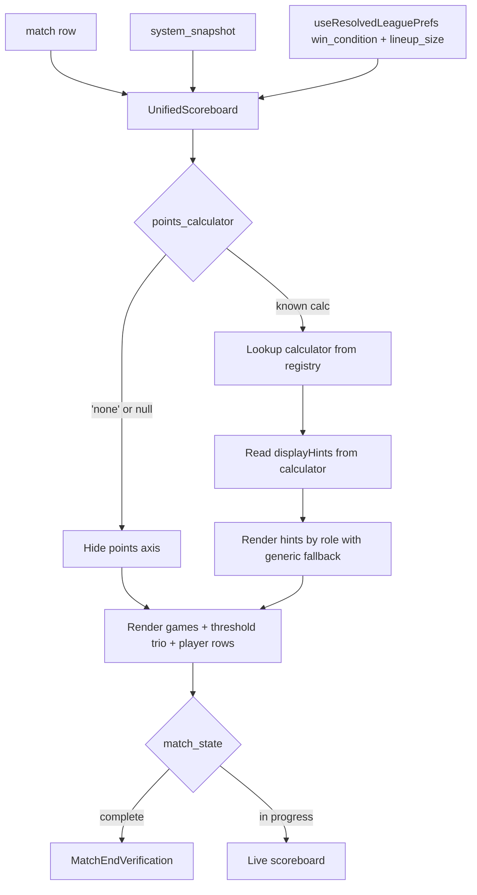

# feat: Unified Scoreboard — Replace 4 scoreboards with 1 + tiebreaker

## Overview

Collapse three live-match scoreboard components (`ThreeVThreeScoreboard`, `FiveVFiveScoreboard`, `TenSevenScoreboard`) into one `UnifiedScoreboard` that reads its data from the match row's calculator-correct fields. Keep `TiebreakerScoreboard` as a separate component but update it for team-name display in the same branch. Introduce a schema-derived display-hint pattern (each calculator's params declare optional `display_role` metadata; the scoreboard auto-renders by role with a generic fallback for unknown roles). Reduce the scoreboard's mobile vertical footprint via compact-mode layout while preserving its role as the page's main visual focus.

## Problem Frame

`src/player/ScoreMatch.tsx:776-870` routes between four scoreboards via a ternary chain keyed on `(handicap_type, lineup_size, isTiebreakerMode)`. Every new combo (e.g. Fargo + games-won, surfaced 2026-05-03 during PR #98 testing) potentially needs either a new scoreboard variant or a router exception. PR #98 made the data layer mode-neutral (threshold trio per side, both axes always tracked, calculator registry); the display layer is the last place where "BCA vs Fargo vs 10-7" is hardcoded as separate components. Three instances of the same `handicap_type === 'fargo'` conflation surfaced in one testing session — tactical guards landed in PR #98, structural fix queued here.

A second concern surfaced during the same testing pass: the live scoreboard's mobile vertical footprint pushes game rows below the fold during active matches. This branch folds the layout redesign into the architectural rebuild — both touch the same component, splitting them creates rework.

(see origin: `docs/brainstorms/unified-scoreboard-requirements.md`)

## Requirements Trace

Carrying forward from the origin document (R11, R15, R16 explicitly removed during the 2026-05-03 review pass; not in scope here):

**Component consolidation**
- R1. ONE `UnifiedScoreboard.tsx` replaces `ThreeVThreeScoreboard`, `FiveVFiveScoreboard`, `TenSevenScoreboard`.
- R2. `TiebreakerScoreboard.tsx` stays as a separate component but is updated in the same branch.
- R3. The unified scoreboard reads ALL data from the match row + `system_snapshot`. No re-computation.
- R4. The unified scoreboard never reads from legacy parallel-compute helpers; helpers themselves SURVIVE for the divergence audit's reference implementation + characterization tests.
- R4a. RESOLVED during planning: 3v3 BCA's match-row points ARE calculator-correct today (verified in research); the gap is solely at the scoreboard read site.

**Dispatch model**
- R5. Display behavior driven by `win_condition`, `points_calculator` + `points_calculator_params`, and `lineup_size` (count only).
- R6. Schema-derived display hints — each calculator's `paramSchema` gains optional `display_role` declarations (via a new sibling `displayHints` field on `CalculatorBase`).
- R7. `points_calculator === 'none'` (or `null` for legacy snapshots) → points axis hidden entirely.

**Compact-mode layout**
- R8. Inline team identity: `{TeamName} · Home` / `{TeamName} · Away`.
- R9. Games + points on same line per team; secondary axis visually subordinate per `win_condition`.
- R10. Threshold trio collapsible. Default-collapsed shows `to_win` inline; user taps to expand for full trio. **No auto-expand in v1** (review pass 2026-05-03 dropped the auto-expand-on-tie-crossing behavior; manual toggle only).
- R12. Drop "VS" / center info-button column; info button moves to corner.
- R13. Mobile-first padding.
- R14. Player-row layout auto-flexes by `lineup_size`.

**Tiebreaker treatment**
- R18. Replace `HOME` / `AWAY` labels with team names from the match row.
- R19. Tiebreaker stays minimal otherwise.
- R20. "Don't lock things down" — no new abstraction; just don't paint the component into a corner.

**Calculator cues**
- R17. Calculators MAY override the auto-derived rendering via an optional escape hatch.

**Item fold-ins**
- R21. Fix scoreboard number layout per LIST_FOR_ED #10 (duplicated thresholds, ambiguous slash format).
- R22. Surface Fargo start-points delta in the unified scoreboard's points line. Read directly from `match.home_to_tie` / `match.away_to_tie` (post Phase 2 Unit 2.1 column rename).

## Scope Boundaries

**In scope:**
- Unified scoreboard component + 3 legacy component deletions
- Tiebreaker team-name fix + R20 restraint check
- Item #10 number-layout fix
- Compact-mode layout (R8 + R9 + R10 + R12 + R13 + R14)
- Schema-derived display hints with optional escape-hatch override
- `fargoMatchTotals.ts` migration from `*_to_win` to `*_to_tie` reads (broader than the brainstorm's "comment cleanup" framing — also a stale call-site)
- Off-preset render coverage proving the unified scoreboard isn't preset-coupled

**Out of scope (deferred):**
- Mid-match clinch detection — separate brainstorm
- Sticky-thin-bar on scroll — separate branch if revisited
- Scoring modal (`ScoringDialog`) generalization — separate brainstorm
- "Richer modal vision" (per-side configurable point ranges, per-flag league toggles) — separate brainstorm
- Adjacent calculator-feature: benchmark-game param on `accumulate_with_milestone_jumps` — its display flex is in scope (auto-appears via `display_role`); the param itself is not
- Tiebreaker drawer with lineup + game totals — explicitly excluded
- Full `tiebreaker_format` axis system + additional methods — only "don't lock things down" restraint
- Legacy parallel-compute helper deletion — helpers survive; eventual deletion is its own future cleanup
- Triple-tie fallback for even-game Fargo formats
- Item #13 (tied-match scoreboard shows more info) explicit fold-in

### Deferred to Separate Tasks
- Modal generalization branch will use the same "kill `handicap_type` conflation" framing once the unified scoreboard ships.
- Eventual deletion of legacy parallel-compute helpers (gated on rewriting characterization tests to use the new calculators directly).

## Context & Research

### Relevant Code and Patterns

**Dispatch site (the central rewrite target):**
- `src/player/ScoreMatch.tsx:776-870` — single ternary chain dispatching across 4 branches. Collapses to `isTiebreakerMode ? Tiebreaker : Unified` after this branch.
- `src/player/ScoreMatch.tsx:686-695` — `fargoTotals` computed via legacy `calculateFargoMatchTotals`. Removed.
- `src/player/ScoreMatch.tsx:700-724` — `getPlayerPoints` closure for TenSevenScoreboard's per-player points column. Migrates into `UnifiedScoreboard` if the per-player drawer column survives in points-mode.
- `src/player/ScoreMatch.tsx:858-859` — passes `homePoints={calculatePoints(...)}` to `<ThreeVThreeScoreboard>`. Replace with `match.home_points_earned ?? 0` (this is the R4a fix).
- `src/player/ScoreMatch.tsx:52-53` — imports of `calculatePoints`, `calculateFargoMatchTotals`. Remove.

**Calculator infrastructure (the foundation R6/R17 build on):**
- `src/systems/calculators/types.ts` — `CalculatorBase<P>` interface; `paramSchema: z.ZodSchema<P>` field (line 168). Lines 30-37 contain an aspirational comment about display metadata living elsewhere via `CALCULATOR_DESCRIPTIONS` — that map does not actually exist (verified via grep). Free to fill the gap.
- `src/systems/calculators/index.ts` — registry; `registerTestedPresetCalculators()` self-invokes at module load (line 147).
- `src/systems/calculators/linear_above_threshold.ts:75-77` — current `paramSchema` shape (Zod, no display metadata).
- `src/systems/calculators/accumulate_with_milestone_jumps.ts:61-66` — same shape; the `multiplier_at_tie` param is the canonical `display_role: 'milestone'` candidate.
- `src/systems/calculators/accumulated_per_game.ts:63-79` — discriminated union shape per side.

**Match-row source-of-truth fields (post-PR #98):**
- `src/utils/match/computeMatchRunningTotals.ts:114-203` — calculator-correct points written to `home_points_earned` / `away_points_earned` for any non-`'none'` calculator. No 3v3-vs-5v5 branching at this layer.
- `src/api/queries/matches.ts:763-764, :821-882` — snapshot population + `updateMatchRunningTotals`.
- `src/hooks/useMatchScoringMutations.ts:251, :325, :476` — `updateMatchRunningTotals(match.id)` runs after every confirm/insert/vacate.

**Legacy helpers (callers that the unified scoreboard must NEVER read from):**
- `src/types/match.ts:455` — `calculatePoints` definition. Caller in scope: `ScoreMatch.tsx:52,858,859`.
- `src/types/match.ts:497` — `calculateBCAPoints` definition. No live callers in `src/` outside characterization tests today.
- `src/utils/fargoMatchTotals.ts:41` — `calculateFargoMatchTotals`. Caller in scope: `ScoreMatch.tsx:53,687`.
- `src/hooks/useMatchScoring.ts:13, :272-273, :439` — re-exports `calculatePoints` as `calculatePointsCallback`. **Implementation-time check:** grep consumers of `useMatchScoring().calculatePoints` before declaring helpers internal-only.

**Existing components to compose / reference:**
- `src/components/scoring/TeamStatsCard.tsx` — used today by 3v3/5v5; potentially reused inside `UnifiedScoreboard`.
- `src/components/scoring/MatchEndVerification.tsx` — "mode-aware internally" per `TenSevenScoreboard.tsx:122-128` comments. Unified scoreboard feeds it the threshold trio same as today.
- `src/components/scoring/TenSevenScoreboard.tsx:293-298, :301-310, :322-328` — primary-axis-on-points layout, race-style "x of y" display, per-player points column, start-points credit. The unified component must accommodate these for `win_condition='points'`.
- `src/components/InfoButton.tsx` — corner info-button pattern.

**Test pattern reference:**
- `src/components/PageHeader.test.tsx` — closest existing template (hook mocks via `vi.fn()`, child stubs via `vi.mock(...)`, `renderWithProviders` from `src/test/utils.tsx`). No scoreboard-component tests exist today; this branch establishes the pattern.

**Routing helpers + flags to delete:**
- `src/player/ScoreMatch.tsx:653` — `isTiebreakerMode` definition (preserved).
- `src/player/ScoreMatch.tsx:666` — `is5v5 = leaguePrefs?.lineup_size === 5` (delete; unused once dispatch collapses).
- `src/player/ScoreMatch.tsx:667` — `winCondition` (preserved; passed into UnifiedScoreboard).

### Institutional Learnings

- **Architectural reframe §10 (`docs/plans/2026-04-28-001-feat-modular-league-system-plan-supplements/architectural-reframe-2026-05-01.md`):** "Lineup size is a count. Handicap type is just a rating system. Points calculator is a formula type with editable parameters. Win condition is a binary choice." None imply any other. The runtime composes from per-axis dispatch — never branches on "is this the Fargo preset" or "is lineup size 5." Same rule applies to the display layer here.
- **PR #98 calculator self-registration is a module-load side effect.** Component tests that exercise calculator-dispatch must call `clearRegistry() + registerTestedPresetCalculators()` in `beforeEach` for hermetic state — see the established pattern in `src/utils/match/__tests__/computeMatchRunningTotals.test.ts:60-68`.
- **PR #98 risk-table line:** "supplement claimed existing characterization tests guard tie-band-with-tiebreaker. They don't." `src/types/__tests__/match-scoring.characterization.test.ts` constructs all fixtures with `is_tiebreaker: false`. Carried as a residual risk — the unified scoreboard branch doesn't depend on tie-band-with-tiebreaker correctness, but if a future calculator regresses there, the audit will catch it post-completion (too late for live UX). Out of scope here.
- **LIST_FOR_ED #12 — live-scoring re-render storm.** `ScoreMatch.tsx` was passing the full `match` object to mutations; per-game writes after PR #98 caused refetch → new `match` identity → callback identity changes → realtime resubscription. Partial fix: `stableMatchForMutations` memo (commit `825e90f`). The unified scoreboard is downstream of this exact pattern — any new fields it reads off `match` must flow through that memoization boundary. Carried in the risk table.
- **LIST_FOR_ED #11 — live-scoreboard data source.** "Match row vs in-memory recompute" was an OPEN architectural question with Jack as of 2026-05-02. R3 commits to "match row is display source-of-truth." Confirm Jack's bought in before merging this branch.
- **LIST_FOR_ED #10 — slash format ambiguity.** Today's `{threshold}/{games left}` reads as "11 out of 8" (confusing). Proposed flip: `{games won}/{threshold}` reads as "3 out of 11" naturally. Folded into R21.

### External References

None — local patterns are strong post-PR #98. No new external dependencies introduced. React + TypeScript + Tailwind + shadcn/ui + Vitest + React Testing Library are all well-established in the codebase.

## Key Technical Decisions

- **`displayHints` as a sibling field on `CalculatorBase`, not on the Zod schema.** Zod's `.describe()` is awkward for structured metadata. Add `displayHints?: Record<keyof P, ParamDisplayHint>` to `CalculatorBase` — symmetric to `paramSchema`, lives on the calculator module. The PR #98 comment about "display metadata living elsewhere" referenced descriptive STRINGS (formula text, examples, info-button content) — `display_role` is meta-data ABOUT params (closer to schema's existing role). The principle gets nuanced: display strings live in the wizard layer; display roles (structural meta-data) live with the schema.

- **Schema-derived hints with escape-hatch override.** Default behavior: scoreboard reads `displayHints` from the active calculator, recognizes known roles (`milestone`, `bonus_marker`, `progress_target`, others as needed), renders accordingly. Unknown roles fall back to a generic "label + value" rendering — never crashes. Calculators MAY also expose an optional `getDisplayHints(params)` escape hatch for genuinely-unique cases.

- **Two independent paths that audit each other (per Ed's 2026-05-03 framing).** Match row is display source-of-truth. Legacy parallel-compute helpers SURVIVE as the divergence audit's reference implementation. The bug from 2026-05-03 wasn't "two paths disagreed"; it was "scoreboard read from the wrong path." Fix the source the scoreboard reads, not the audit. Audit infrastructure (`src/utils/match/auditScoringConsistency.ts`) does NOT import the legacy helpers — it's already calculator-driven, so the helpers are isolated to characterization tests at deletion time.

- **Threshold trio is user-toggle only in v1 (resolves R10 deferred question, revised 2026-05-03 review pass):** Default-collapsed shows `to_win` inline. User taps the expand control to show the full trio (`to_win` / `to_tie` / `to_lose`); user taps again to collapse. NO auto-expand on tie/loss crossing in v1. Reviewer feedback flagged auto-expand as ungrounded in user need, edge-case-prone (vacate / re-cross / pre-empt scenarios all underspecified), and at odds with the project's scorekeeper-accountability posture (UI shouldn't mutate during scoring). Static visual cues (color/badge) on the inline `to_win` are an acceptable v1.5 addition if tie-territory communication remains a goal.

- **Compact-mode is the default — within "scoreboard as page focus" constraint.** Today's layout becomes "expanded"; the new compact mode trims height (inline team identity, games+points one line, collapsible threshold trio, tighter padding) but the scoreboard remains visually dominant. Stadium scoreboard, not sportsbook ticker.

- **`fargoMatchTotals.ts` call-site migration is broader than "comment cleanup."** Research surfaced that the helper still reads from `*_to_win` for start-points credit semantics and the caller at `ScoreMatch.tsx:690-691` maps from `match.home_to_win`/`away_to_win`. Per Phase 2 Unit 2.1, the start-points credit lives on `*_to_tie`. This branch migrates BOTH the helper's read field names AND the caller's mapping (or deletes the caller entirely if the unified scoreboard reads `*_to_tie` directly).

- **`useMatchScoring().calculatePointsCallback` survives unchanged in this branch.** The hook's public surface is downstream of unknown consumers; removing it from the hook is a separate cleanup gated on grep-confirming no external consumers. The unified scoreboard simply doesn't use it.

- **No new component decomposition.** Per CLAUDE.md "~100 line target": current scoreboards exceed it but predate the rule. UnifiedScoreboard composes `TeamStatsCard` (already exists) and `MatchEndVerification` (already exists). Don't pre-decompose into smaller subcomponents; let the scoreboard grow until it asks for splitting.

## Open Questions

### Resolved During Planning

- **R4a — Is 3v3 BCA's `match.home_points_earned` calculator-correct today?** Yes (research confirmed `computeMatchRunningTotals` writes it correctly via the calculator registry; comment in `ScoreMatch.tsx:676-678` was about the READ path, which this branch fixes in Unit 5).
- **`CALCULATOR_DESCRIPTIONS` map referenced in types.ts comment** — it doesn't exist. The comment was aspirational. Implementer is free to introduce `displayHints` on the calculator module without "violating" a pattern that was never built.
- **Threshold trio interaction (R10 deferred question)** — resolved as default-collapsed + user-toggle-only (revised 2026-05-03 review pass; auto-expand-on-tie-crossing was dropped due to underspecified edge cases and scorekeeper-accountability tension).
- **Display hints location** — sibling field on `CalculatorBase` (per Key Decision above).
- **Tested-preset coverage temporal framing** — resolved in the brainstorm review pass: Fargo points-mode is the legacy state, games-mode is the next-season target, both render correctly during transition.

### Deferred to Implementation

- **Exact `display_role` taxonomy.** Start with `milestone`, `bonus_marker`, `progress_target`. Add roles only when a calculator actually needs one (avoid pre-designing for theoretical calculators per architectural-reframe restraint).
- **Pixel-level visuals for compact mode** — exact font sizes, breakpoints, threshold-trio expand/collapse animation, info-button corner placement. Wireframe during Unit 3 implementation; constraint is "scoreboard remains page's main visual focus."
- **Match-complete state transition.** Today's scoreboards render `MatchEndVerification` above (5v5/3v3) or instead of (10-7) the score display. Unified scoreboard's match-complete behavior is implementer's call during Unit 3 — match today's pattern unless a clearer one emerges.
- **Legibility minimums + WCAG touch targets.** 44×44px minimum for tap targets (chalk-handed users); primary score number needs to be readable from across a 9-foot table. Plan calls these out; implementer measures during Unit 3.
- **`+X` label format for Fargo start-points delta** — positive-only / signed / asymmetric per side. Resolve during Unit 5 with a short test on the canonical Fargo league.
- **`useMatchScoring().calculatePointsCallback` consumer audit.** Pre-Unit 7 grep to confirm the hook's re-export has no callers outside `ScoreMatch.tsx`; if clean, the hook re-export can drop in this branch as a small fold-in.
- **Re-read PR #98 immediately before /ce:work.** PR #98 is OPEN at plan time. If review feedback materially reshapes snapshot keys, threshold-trio columns, or calculator registry signatures, this plan needs revision. Flag any drift before starting.

## High-Level Technical Design

> *This illustrates the intended approach and is directional guidance for review, not implementation specification. The implementing agent should treat it as context, not code to reproduce.*

### Calculator interface extension (Unit 1 sketch)

```text
CalculatorBase<P> {
  name: string
  paramSchema: ZodSchema<P>           // existing — pure validation
  defaultParams: P                    // existing
  compute(state, params) -> Points    // existing

  displayHints?: {                    // NEW — optional, per-param meta
    [paramKey in keyof P]?: {
      role: 'milestone' | 'bonus_marker' | 'progress_target' | string  // open enum; unknown roles fall back
      label?: string                  // optional override; default derives from key
    }
  }

  getDisplayHints?(params): HintList  // NEW — optional escape hatch for unique cases
}
```

### UnifiedScoreboard data flow (Unit 3 sketch)



### Routing collapse (Unit 5 sketch)

```text
BEFORE (ScoreMatch.tsx:776-870):
  isTiebreakerMode ? Tiebreaker
  : (handicap=='fargo' && fargoTotals && winCond=='points') ? TenSevenScoreboard
  : is5v5 ? FiveVFiveScoreboard
  : ThreeVThreeScoreboard

AFTER:
  isTiebreakerMode ? Tiebreaker
  : UnifiedScoreboard
```

## Implementation Units

### Phase 1 — Foundation (interface + calculator wiring)

- [x] **Unit 1: Extend `CalculatorBase` with `displayHints` field**

**Goal:** Add the optional sibling `displayHints` field to the calculator interface; define the initial `display_role` taxonomy and the generic-fallback rendering contract.

**Requirements:** R6, R17

**Dependencies:** None (foundation unit)

**Files:**
- Modify: `src/systems/calculators/types.ts`
- Test: `src/systems/calculators/__tests__/types.contract.test.ts` (new)

**Approach:**
- Add `displayHints?: Record<keyof P, ParamDisplayHint>` to `CalculatorBase<P>`.
- Add optional `getDisplayHints?(params: P): DisplayHint[]` escape hatch.
- Define `ParamDisplayHint` type with `role: string` (open enum) and optional `label: string`.
- Define `DisplayHint` runtime type — what the scoreboard receives after schema-derived resolution.
- Add brief JSDoc explaining when each form is appropriate.
- **`accumulated_per_game` typing note:** that calculator's `keyof P` is `'winner' | 'loser'` (whole sides, not per-field). The `displayHints` field naturally maps to per-key roles, so for `accumulated_per_game` the implementer should use the `getDisplayHints(params)` escape hatch (R17) rather than schema-derived `displayHints`. Document this in Unit 1's JSDoc as the canonical example of "when to use the escape hatch": aggregate calculators with primitive param keys use `displayHints`; per-side calculators with structural param keys use `getDisplayHints`.

**Patterns to follow:**
- Mirror `paramSchema` field placement and JSDoc style on `CalculatorBase<P>` (`src/systems/calculators/types.ts:147-179`).
- Open-enum `role: string` allows unknown roles without breaking the type system.

**Test scenarios:**
- Happy path: a calculator with `displayHints` declared on every param compiles and the inferred type matches the schema's keys.
- Edge case: a calculator with NO `displayHints` field still satisfies `CalculatorBase<P>` (optional).
- Edge case: a calculator with `displayHints` for some params but not others is allowed.
- Edge case: an unknown `role` string passes type-checking (open enum behavior verified).

**Verification:**
- TypeScript compiles.
- The interface change is purely additive; no existing calculators break.

---

- [x] **Unit 2: Add `displayHints` to existing 3 calculators**

**Goal:** Wire the new metadata onto the three currently-registered calculators so the unified scoreboard has something to render.

**Requirements:** R6, R17

**Dependencies:** Unit 1

**Files:**
- Modify: `src/systems/calculators/linear_above_threshold.ts`
- Modify: `src/systems/calculators/accumulate_with_milestone_jumps.ts`
- Modify: `src/systems/calculators/accumulated_per_game.ts`
- Test: `src/systems/calculators/__tests__/displayHints.test.ts` (new)

**Approach:**
- `linear_above_threshold`: declare `displayHints` for `per_extra_game_multiplier` with `role: 'progress_target'` (or omit; the calculator may not need a visible cue).
- `accumulate_with_milestone_jumps`: declare `displayHints` for `multiplier_at_tie` with `role: 'milestone'` and `label: '1.5x at tie'` (the canonical example).
- `accumulated_per_game`: declare `displayHints` per side via the discriminated-union shape; likely `role: 'bonus_marker'` for any per-side bonus params.
- The `'none'` sentinel calculator declares no hints (hides points axis entirely per R7).

**Patterns to follow:**
- Match the file structure of the existing calculator modules.
- Keep declarations minimal — start with what the existing UI shows today (e.g. the 1.5x marker on BCA 5v5).

**Test scenarios:**
- Happy path: each calculator declares the right roles for its params (per-calculator unit test asserting the shape).
- Edge case: a calculator with no `displayHints` (e.g. `linear_above_threshold` if no params need surfacing) renders nothing extra on the scoreboard.
- Integration: registry lookup returns the calculator with its `displayHints` intact.

**Verification:**
- TypeScript compiles.
- All existing calculator tests still pass.
- New per-calculator tests assert the declared roles match expectations.

---

- [x] **Unit 3: Build `UnifiedScoreboard` component (compact mode)**

**Goal:** New `src/components/scoring/UnifiedScoreboard.tsx` that renders any preset config or off-preset combo from the match row + system_snapshot, with compact-mode layout and schema-derived display hints.

**Requirements:** R1, R3, R5, R7, R8, R9, R10, R12, R13, R14, R17, R21, R22

**Dependencies:** Unit 1, Unit 2

**Files:**
- Create: `src/components/scoring/UnifiedScoreboard.tsx`
- Create: `src/components/scoring/__tests__/UnifiedScoreboard.test.tsx`
- Modify: `src/components/scoring/TeamStatsCard.tsx` — generalize from mode-keyed (`'5v5' | '3v3'`) to calculator-driven. Per-player points column conditional on calculator awarding per-player points; primary axis follows `win_condition`; hardcoded 70% milestone math replaced by reading `displayHints` declared in Unit 2.
- Modify: `src/components/scoring/__tests__/TeamStatsCard.test.tsx` (new — establish coverage for the generalized behavior).
- Optionally create: small subcomponents in `src/components/scoring/` if the component grows past ~200 lines (per CLAUDE.md ~100-line target — defer decomposition until the component naturally asks for it).

**Approach:**
- **Props interface:** match data, lineups, win_condition, lineup_size, calculator (resolved from `system_snapshot.points_calculator`), calculator params, isHomeTeam, swap/verify handlers.
- **Data reads:** ALL from match row (`home_games_won`, `away_games_won`, `home_points_earned`, `away_points_earned`, `home_to_win`, `home_to_tie`, `home_to_lose`, away set). NO recomputation.
- **`points_calculator === 'none'` handling:** hide points axis entirely. Treat `null` and `'none'` equivalently.
- **Win-condition-driven axis emphasis:** primary axis (matching `win_condition`) renders larger; secondary axis renders subordinate.
- **Threshold trio:** collapsed by default, shows `to_win` inline. User taps to expand the full trio; tap again to collapse. NO auto-expand in v1 (revised during 2026-05-03 review pass). State is component-local `useState` (boolean expanded/collapsed); no session-scope concerns since there's no auto-trigger to override.
- **Schema-derived hints:** read calculator's `displayHints`, resolve each param's role, render via role-renderers (start with `milestone`, `bonus_marker`, `progress_target`); fall back to generic "label + value" for unknown roles. If calculator exposes `getDisplayHints` escape hatch, prefer it over schema-derived.
- **Inline team identity (R8):** `{TeamName} · Home` / `{TeamName} · Away` inline with team-card chrome.
- **Drop center "VS" column (R12):** info button moves to corner.
- **Mobile-first padding (R13):** tighter `px`/`py`/`gap` than today's layout. Implementer measures legibility from across the table.
- **Player rows auto-flex (R14):** map over `lineup.players` regardless of count.
- **Fargo start-points (R22):** read from `match.home_to_tie` / `match.away_to_tie` directly (whichever is positive identifies the weaker team). Render as a small adjacent text on the points line.
- **Item #10 layout fix (R21):** flip slash format to `{games_won}/{to_win}` (reads as "3 out of 11"). Avoid duplicating thresholds.
- **Compose existing components, but generalize `TeamStatsCard` for points-mode (revised 2026-05-03 review pass):**
  - `TeamStatsCard` today is mode-keyed (`mode: '5v5' | '3v3'`) with hardcoded games-as-primary, "To Win" label, and a hardcoded `Math.round(0.7 * games_to_win)` for the 1.5x marker. Points-mode (today's `TenSevenScoreboard`) does NOT use it.
  - Unit 3 generalizes `TeamStatsCard` to be **calculator-driven, not mode-keyed.** Per Ed's framing: "team stats should be just like the rest of the settings — if each player earns points then show points; if it's team-based then don't show it."
  - Concretely: per-player points column appears when the active calculator awards per-player points (`accumulated_per_game`); hides when the calculator computes team-aggregate totals (`accumulate_with_milestone_jumps`, `linear_above_threshold`). Primary axis (games vs points) follows `win_condition`. Hardcoded threshold math (the 70% milestone calc) gets replaced by reading the calculator's declared `displayHints` (per Unit 1+2).
  - This generalization is non-trivial; counted toward Unit 3's scope. Reviewers flagged the original "compose existing" framing as missing this work.
- **Compose existing components (unchanged):** `MatchEndVerification`, `InfoButton`. Don't reinvent these.

**Execution note:** Build this unit characterization-first for the rendering contract — write the test file first asserting "BCA 3v3 renders points from match row, not from `calculatePoints` recomputation," then implement to satisfy. Subsequent unit tests follow normally.

**Patterns to follow:**
- `src/components/scoring/FiveVFiveScoreboard.tsx` and `TenSevenScoreboard.tsx` as visual references (NOT to copy structurally — to know what features to absorb).
- `src/components/PageHeader.test.tsx` as the testing template (hook mocks, child stubs, `renderWithProviders`).
- shadcn/ui primitives only (`Card`, `Button`, etc.) per CLAUDE.md.
- File `@fileoverview` JSDoc + per-prop documentation per CLAUDE.md.

**Technical design:** *(directional, not specification)*

```text
UnifiedScoreboard (props -> render)
├── header chrome
│   ├── inline team identity left + right (R8)
│   └── info button corner (R12)
├── score row (per team, both sides)
│   ├── primary axis (large, per win_condition)
│   ├── secondary axis (small)
│   └── start_points delta (R22, points-mode only)
├── threshold trio (collapsible, R10)
│   ├── default: to_win inline
│   ├── expanded: to_win / to_tie / to_lose
│   └── user taps to toggle; no auto-expand in v1
├── calculator hint row (schema-derived)
│   └── per role: milestone | bonus_marker | progress_target | generic
├── player rows (R14, auto-flex by lineup_size)
└── MatchEndVerification (when allGamesComplete)
```

**Test scenarios:**
- Happy path — BCA 3v3: renders games + points (small) + threshold trio (collapsed showing `to_win`); points read from `match.home_points_earned` (not recomputed).
- Happy path — BCA 5v5: same shape as 3v3 with 5 player rows; 1.5x milestone hint renders next to points.
- Happy path — Fargo points-mode: points axis primary (large); games secondary; start-points delta visible; threshold trio reads `to_win`/`to_tie`/`to_lose` correctly. Per-player points column appears in TeamStatsCard (since `accumulated_per_game` calculator awards per-player points).
- Happy path — BCA 5v5 (aggregate calculator): per-player points column does NOT appear in TeamStatsCard (since `accumulate_with_milestone_jumps` is team-aggregate). Team-total points display only.
- Happy path — Fargo games-mode: games axis primary; points secondary; no recomputation via `calculateFargoMatchTotals`.
- Happy path — `points_calculator === 'none'`: points axis hidden entirely; games-only display.
- Edge case — `points_calculator === null` (legacy snapshot): same behavior as `'none'`.
- Edge case — calculator has no `displayHints` declared: scoreboard renders nothing extra; doesn't crash.
- Edge case — calculator declares an unknown `display_role`: generic "label + value" fallback renders; doesn't crash.
- Edge case — user taps expand control: threshold trio shows full trio (`to_win` / `to_tie` / `to_lose`); tap again collapses back to inline `to_win`. No auto-expand triggered by score changes.
- Edge case — `lineup_size: 4` (off-preset): four player rows render; no preset-coupled assumptions.
- Integration — match completes mid-render: `MatchEndVerification` renders in match-complete state.
- Integration — `match.home_points_earned` updates → scoreboard re-renders with new value (verifies match-row read path, no stale legacy compute).
- **R4a parity assertion** (cross-checks the planning-time claim that 3v3 BCA's match-row points are calculator-correct): for each Tested Preset (BCA 3v3, BCA 5v5, Fargo points-mode, Fargo games-mode), construct a fixture match state and assert `match.home_points_earned` equals what the legacy `calculatePoints` would produce for the same state. If they diverge anywhere, R4a is falsified before Unit 5 deletes the legacy reads — a critical safety gate.
- Integration — scoreboard resolves the calculator from `system_snapshot.points_calculator`, NOT from current league preferences. Construct a scenario where the snapshot's calculator differs from the current preferences (e.g., simulating a mid-match preference change) and verify the scoreboard reads from snapshot.

**Verification:**
- TypeScript compiles.
- All test scenarios pass.
- Visual smoke (manual): each preset combo renders correctly on a phone-sized viewport; scoreboard remains visually dominant; more game rows visible than today.

---

### Phase 2 — Migration + integration

- [ ] **Unit 4: Migrate `fargoMatchTotals.ts` to `*_to_tie` reads + comment cleanup**

**Goal:** Resolve the broader R22 gap — the helper still reads from `*_to_win` for start-points credit semantics, and the caller at `ScoreMatch.tsx:690-691` maps from `match.home_to_win`/`away_to_win`. Per Phase 2 Unit 2.1, the credit lives on `*_to_tie`. Migrate both, OR delete the caller entirely if the unified scoreboard reads directly.

**Requirements:** R22

**Dependencies:** None (independent helper migration)

**Files:**
- Modify: `src/utils/fargoMatchTotals.ts` (comment update only)

**Approach:**
- Verified scope (review pass 2026-05-03): the helper has NO direct column reads — only descriptively-named param labels (`homeGamesToWin` / `awayGamesToWin`). The actual stale column read lives at the caller (`ScoreMatch.tsx:690-691`), which Unit 5 deletes entirely. So Unit 4 is purely a comment update.
- Update the doc comment at `src/utils/fargoMatchTotals.ts:11-15` to reflect post-Phase-2-Unit-2.1 semantics (start-points credit lives on `*_to_tie`, not `*_to_win`).
- Optionally rename helper parameter labels for descriptive clarity (cosmetic — no production caller after Unit 5).
- Existing characterization tests should pass without changes (they were testing the helper's logic, not the column source).

**Patterns to follow:**
- Phase 2 Unit 2.1 column rename pattern (in `docs/plans/2026-04-28-001-feat-modular-league-system-plan-supplements/`).

**Test scenarios:**
- Test expectation: none — comment-only update. Build + existing tests verify nothing regresses.

**Verification:**
- All existing fargoMatchTotals tests pass without changes.
- Lint passes.
- TypeScript compiles.

---

- [ ] **Unit 5: Wire `UnifiedScoreboard` into `ScoreMatch.tsx`; remove legacy reads**

**Goal:** Collapse the 4-branch dispatch in `ScoreMatch.tsx` to `isTiebreakerMode ? Tiebreaker : Unified`. Remove `fargoTotals` computation, `is5v5` flag, the 3v3 BCA `calculatePoints` reads, and the imports of `calculatePoints` + `calculateFargoMatchTotals`. Pass match-row fields directly to the unified scoreboard.

**Requirements:** R1, R3, R4, R4a, R5

**Dependencies:** Unit 3, Unit 4

**Files:**
- Modify: `src/player/ScoreMatch.tsx`
- Test: `src/player/__tests__/ScoreMatch.dispatch.test.tsx` (new — light integration test that the right scoreboard fires for each preset)

**Approach:**
- Replace the ternary chain at lines 776-870 with `isTiebreakerMode ? <TiebreakerScoreboard ... /> : <UnifiedScoreboard ... />`.
- Delete the `fargoTotals` computation block (lines 686-695).
- Delete the `is5v5` flag (line 666).
- Delete the legacy imports (lines 52-53).
- Replace `homePoints={calculatePoints(...)}` (lines 858-859) with the match-row read inside the UnifiedScoreboard's prop pass.
- Migrate `getPlayerPoints` (lines 700-724) into `UnifiedScoreboard` if the per-player points drawer column survives — OR delete if the unified component derives per-player points from `match_games` directly.
- Preserve `stableMatchForMutations` memoization boundary; add any new fields the unified scoreboard reads to whatever memo guards exist (per re-render storm risk).

**Execution note:** Characterization-first — before deleting any dispatch branch, confirm a test exercises that branch's rendering today; if not, write a quick render assertion against today's component, THEN swap to UnifiedScoreboard, THEN verify the assertion still passes.

**Patterns to follow:**
- Single-component dispatch pattern (kept the brainstorm's R5 dispatch model).
- Preserve realtime hook subscriptions exactly as today.

**Test scenarios:**
- Happy path: `isTiebreakerMode === true` → `TiebreakerScoreboard` renders.
- Happy path: each preset (`BCA 3v3`, `BCA 5v5`, `Fargo points`, `Fargo games`, `'none'`) renders `UnifiedScoreboard` with correct props; no legacy components instantiated.
- Edge case: re-render after `match.home_games_won` changes → no extra realtime resubscriptions (memoization preserved).
- Edge case: `handicap_type === 'fargo'` BUT `win_condition === 'games'` → renders games-mode UnifiedScoreboard, not legacy 10-7 path (the conflation bug from 2026-05-03 testing).
- Integration: full dispatch → render → match-row update → re-render flow works without console noise.

**Verification:**
- TypeScript compiles.
- All scoreboard-related tests pass.
- Manual smoke: `pnpm dev` → score a game in each preset combo → scoreboard updates; no `[useMatchRealtime] Cleaning up` cascade in console.

---

### Phase 3 — Cleanup + coverage

- [ ] **Unit 6: Tiebreaker scoreboard team-name fix + R20 restraint check**

**Goal:** Replace `HOME` / `AWAY` labels with team names from `match.home_team.team_name` / `match.away_team.team_name`. Verify the component's structure isn't actively painting itself into a corner that would prevent a future `tiebreaker_format` axis. NO new abstraction.

**Requirements:** R18, R19, R20

**Dependencies:** None (independent cleanup)

**Files:**
- Modify: `src/components/scoring/TiebreakerScoreboard.tsx`
- Test: `src/components/scoring/__tests__/TiebreakerScoreboard.test.tsx` (new)

**Approach:**
- Replace `HOME` with `match.home_team?.team_name ?? 'Home'`.
- Replace `AWAY` with `match.away_team?.team_name ?? 'Away'`.
- Sanity check: the "first to 2 wins" hardcode is fine as long as a future format swap could parameterize it without rewriting the component (e.g., the threshold value is a prop, not a constant). NO refactor in this branch — just don't lock it down.

**Patterns to follow:**
- `src/components/scoring/TiebreakerScoreboard.tsx` existing structure.

**Test scenarios:**
- Happy path: tiebreaker scoreboard renders with team names from match.
- Edge case: missing `team_name` → falls back to "Home" / "Away".
- Edge case: very long team names → don't break layout (truncation or wrapping acceptable).

**Verification:**
- TypeScript compiles.
- Tiebreaker tests pass.
- Manual smoke: render a tiebreaker match → see team names instead of HOME/AWAY.

---

- [ ] **Unit 7: Delete legacy scoreboard component files + TOC update**

**Goal:** Remove `ThreeVThreeScoreboard.tsx`, `FiveVFiveScoreboard.tsx`, `TenSevenScoreboard.tsx` from the codebase. Update `TABLE_OF_CONTENTS.md` to reflect deletions and the new `UnifiedScoreboard.tsx` entry.

**Requirements:** R1

**Dependencies:** Unit 5 (no callers can remain)

**Files:**
- Delete: `src/components/scoring/ThreeVThreeScoreboard.tsx`
- Delete: `src/components/scoring/FiveVFiveScoreboard.tsx`
- Delete: `src/components/scoring/TenSevenScoreboard.tsx`
- Modify: `TABLE_OF_CONTENTS.md` (per project convention — see CLAUDE.md "Table of Contents Maintenance")

**Approach:**
- Pre-deletion: grep for any remaining imports of the three components. If the only callers are the now-deleted dispatch in `ScoreMatch.tsx`, the deletion is clean.
- Drop the `useMatchScoring().calculatePointsCallback` hook re-export at `src/hooks/useMatchScoring.ts:439`. Review pass verified ZERO non-test consumers exist via grep — this is unconditional dead-code removal, not an "optional" fold-in.
- Update `TABLE_OF_CONTENTS.md`: remove the three legacy file entries; add `UnifiedScoreboard.tsx`. Update the "Last Updated" line.

**Test scenarios:**
- Test expectation: none — pure deletion. Build + typecheck verify no broken imports.

**Verification:**
- `pnpm run build` passes (no TypeScript errors from missing imports).
- `pnpm run lint` passes.
- All existing tests still pass.
- `TABLE_OF_CONTENTS.md` correctly reflects the new file structure.

---

- [ ] **Unit 8: Off-preset characterization test**

**Goal:** Add at least one render test that exercises a non-Tested-Preset combo to prove the unified scoreboard isn't preset-coupled. Per architectural-reframe §8.2: "characterization tests on the 3 Tested Presets prove backwards compatibility but DO NOT prove modular composition works."

**Requirements:** Success criterion — "A new calculator (off-preset combo or future addition) can be added without editing UnifiedScoreboard.tsx"

**Dependencies:** Unit 5

**Files:**
- Test: `src/components/scoring/__tests__/UnifiedScoreboard.offPreset.test.tsx` (new)

**Approach:**
- Pick an off-preset combo: 4v4 + Fargo handicap + games win-condition + `linear_above_threshold` calculator. None of the three Tested Presets matches this.
- Construct fixture match + lineup data for this combo.
- Assert: 4 player rows render, primary axis is games, no legacy compute paths invoked, calculator hints render correctly.
- Optional: a second off-preset combo with `accumulate_with_milestone_jumps` calculator to confirm the milestone hint renders for any lineup size.

**Patterns to follow:**
- `src/utils/match/__tests__/computeMatchRunningTotals.test.ts:60-68` for hermetic registry setup (`clearRegistry() + registerTestedPresetCalculators()` in `beforeEach`).
- `src/components/PageHeader.test.tsx` for the rendering harness.

**Test scenarios:**
- Happy path — 4v4 Fargo games-mode + linear_above_threshold: scoreboard renders 4 player rows, games-as-primary, calculator hint shape derived from schema.
- Happy path — 4v4 Fargo games-mode + accumulate_with_milestone_jumps: 1.5x milestone hint renders next to points-as-secondary.

**Verification:**
- Test passes.
- Adding a hypothetical fourth calculator with new `display_role` does not require editing `UnifiedScoreboard.tsx` — verified by inspection.
- Separate from this test: a brief code-review pass confirms no `lineup_size === 5` or `handicap_type === 'fargo'` branches survive in `UnifiedScoreboard.tsx` (this is a static check, NOT a test assertion).

## System-Wide Impact

- **Interaction graph:** `ScoreMatch.tsx` is the only entry point for the scoreboards being replaced. Realtime subscriptions via `useMatchRealtime` and `useSpectateMatch` flow through `match` prop identity — preserve `stableMatchForMutations` memoization.
- **Error propagation:** Unknown `display_role` values fall through to generic rendering. `points_calculator === 'none'` or `null` hides the points axis cleanly. Calculator registry lookup failures should never crash the scoreboard — fall back to a "calculator unknown" placeholder rendering rather than throwing.
- **State lifecycle risks:** Threshold-trio user-collapse override needs session-scoped state (component-local `useState` is sufficient; no persistence needed). Compact-mode interactions don't introduce new persistent state.
- **API surface parity:** None of the deletions break public APIs. The legacy helpers (`calculatePoints`, `calculateFargoMatchTotals`, `calculateBCAPoints`) still export from their type/utils modules; the hook re-export at `useMatchScoring.ts:439` is the only consumer-facing surface that may drop in this branch (gated on grep).
- **Integration coverage:** Off-preset render test (Unit 8) covers the modular-composition gap. Each Tested Preset gets coverage in Unit 3's component tests.
- **Unchanged invariants:** PR #98's calculator runtime contract, the `match_games` schema, the divergence audit at `src/utils/match/auditScoringConsistency.ts`, the snapshot-population logic in `src/api/queries/matches.ts`, and the realtime subscription pattern are all explicitly NOT changed by this branch.

## Risks & Dependencies

| Risk | Mitigation |
|------|------------|
| **Re-render storm (LIST_FOR_ED #12).** Adding new match-row fields the unified scoreboard reads (snapshot, params, threshold trio) could break `stableMatchForMutations` memoization → realtime resubscription cascade. | Unit 5 explicitly preserves the memoization boundary. Test scenario: "re-render after match update → no extra realtime resubscriptions." Manual smoke check for `[useMatchRealtime] Cleaning up` console noise. |
| **PR #98 reshape during review.** PR #98 is OPEN at plan time; review feedback could rename columns, change snapshot keys, or alter calculator registry signatures. | Pre-`/ce:work` step: re-read PR #98 and flag drift. Plan's deferred-to-implementation question explicitly calls this out. |
| **Tie-band-with-tiebreaker test gap (PR #98 risk-table line).** The existing characterization tests don't cover this combination. If a future calculator regresses, the audit catches it post-completion (too late for live UX). | Out of scope for this branch (calculator-level concern, not scoreboard). Carried as a residual risk for a future calculator-tests follow-up. |
| **`useMatchScoring().calculatePointsCallback` consumers.** The hook re-exports `calculatePoints`. Removing it could break unknown UI surfaces. | RESOLVED in review pass 2026-05-03 — grep confirmed zero non-test consumers. Unit 7 drops the re-export unconditionally as dead-code removal. |
| **PR #98 staleness during open-PR window.** PR #98 is OPEN at plan time. If review feedback materially reshapes calculator interface signatures, snapshot keys, or threshold-trio columns before merge, this plan needs revision. | **Pin PR #98 commit SHA before /ce:work starts.** Plan is valid against PR #98's HEAD at plan-write time (2026-05-03). Before implementation: diff PR #98's current state against the pinned SHA; if (a) `src/systems/calculators/types.ts` interface changes, (b) match-row column names for threshold-trio or snapshot change, or (c) registry registration pattern changes, this plan needs a revision pass. Otherwise proceed. |
| **R10 v1 ships without auto-expand.** Manual toggle only; reviewers found auto-expand had unspecified edge cases (vacate / re-cross / pre-empt) and was at odds with scorekeeper-accountability posture. | RESOLVED in review pass 2026-05-03. v1.5 may add static cues (color/badge on `to_win`) for tie-territory communication; not in scope here. |
| **Visual regression in compact mode.** Scoreboards are read from across a 9-foot table; legibility from distance is non-trivial. | Unit 3 includes "stadium not sportsbook" constraint as a visual smoke test on a phone-sized viewport. Implementer measures during build. |
| **Item #11 (data-source decision) requires Jack's alignment.** R3 commits to "match row is display source-of-truth" — was an open question with Jack as of 2026-05-02. | Confirm before merging this branch. Add a coordination check to the PR description. |

## Documentation / Operational Notes

- Update `TABLE_OF_CONTENTS.md` per project convention (Unit 7).
- Update `memory-bank/activeContext.md` and `memory-bank/progress.md` after this branch lands per the CLAUDE.md memory-bank update obligation ("After implementing significant changes").
- The plan does not introduce migrations, schema changes, RLS policy changes, edge functions, or environment variables. No deployment or rollout coordination needed beyond the Jack-alignment check in the risk table.
- After this branch ships, the modal-generalization brainstorm becomes the natural next branch (the scoring `ScoringDialog` has the same `handicap_type` conflation pattern; same fix shape applies).

## Sources & References

- **Origin document:** `docs/brainstorms/unified-scoreboard-requirements.md`
- **Architectural foundation (PR #98):** `docs/plans/2026-05-01-001-feat-modular-league-system-v2-plan.md`
- **Architectural reframe (mental model):** `docs/plans/2026-04-28-001-feat-modular-league-system-plan-supplements/architectural-reframe-2026-05-01.md`
- **Item fold-ins:** `LIST_FOR_ED.md` items #10, #11, #12, #13, #18
- **Test pattern reference:** `src/components/PageHeader.test.tsx`, `src/test/utils.tsx`
- **Memory note (informs R4 framing):** `~/.claude/projects/-Users-edpoplet-Programming-rackem-leagues/memory/feedback_two_paths_audit_pattern.md`
- **Related PR:** #98 (OPEN, `feature/modular-league-system`)
