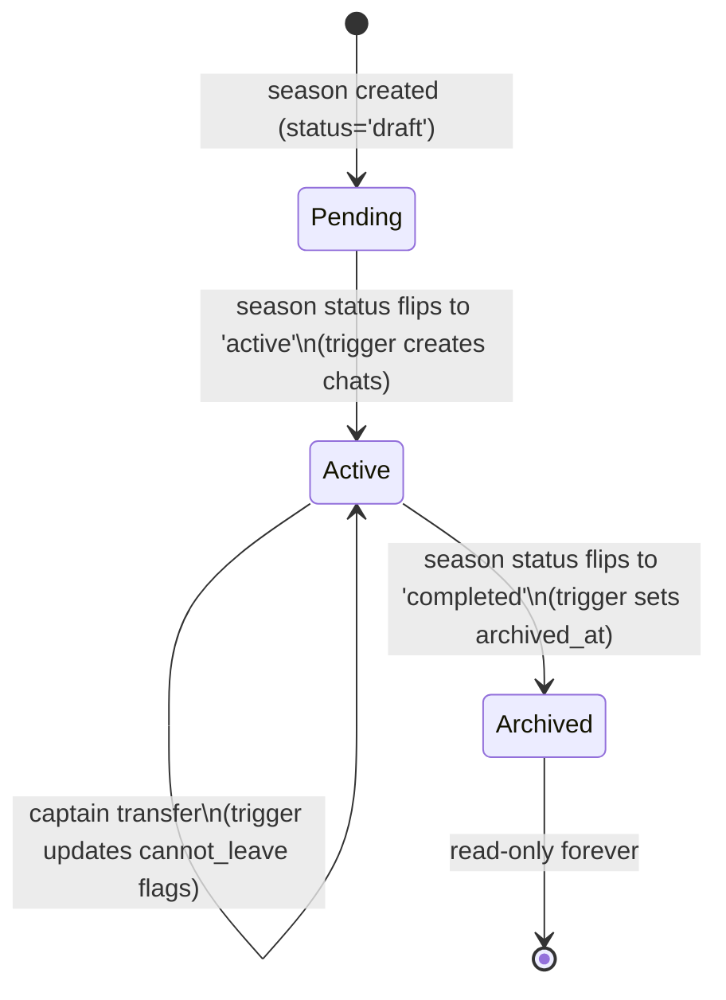

# feat: Messaging Overhaul — Phase 1 (Foundations)

## Status

**As of 2026-05-15** — code-complete on the original 9 units; **5 new polish
units (10–14)** appended after triage on 2026-05-14/15; final step is an
end-to-end test pass before merge.

| Unit | What | Status |
|------|------|--------|
| 1 | Schema Part A — conversations + participants | ✅ shipped |
| 2 | Schema Part B — messages + members | ✅ shipped |
| 3 | System-message helper + auto-creation utilities | ✅ shipped |
| 4 | Season-activation trigger | ✅ shipped |
| 5 | Roster + captain lifecycle triggers | ✅ shipped |
| 6 | Past-member + announcement read-only banner (UI) | ✅ shipped (RLS deferred — see LIST_FOR_ED #29) |
| 7 | Profanity filter wiring + system-message variant (+ DOB-aware COMMENT polish) | ✅ shipped |
| 8 | Composer failed-send recovery (inline iMessage-style) | ✅ shipped |
| 9 | Profanity onboarding modal (first Messages open, defaulted-ON) + legacy SQL archive | ✅ shipped |
| 10 | **Date dividers in message thread** | ✅ shipped |
| 11 | **Empty conversation-list state — value-prop copy** | ✅ shipped |
| 12 | **Leave button respects `cannot_leave`** | ⬜ not started |
| 13 | **Emoji messages + composer picker (12-emoji curated set)** | ✅ shipped |
| 14 | **Season-end trigger — release `cannot_leave` on completion** | ⬜ not started |
| 15 | **Auto-rename propagation — team / league / season / org renames update matching chat titles** | ⬜ not started |
| 16 | **Bounded send — AbortController + 10s timeout in `sendMessage`** | ✅ shipped |
| 17 | **Eliminate optimistic-vs-realtime double-render flash on sender side** | ⬜ not started |
| 18 | **Shorter chat titles + banner interpolation + per-user captains label** | ⬜ not started |
| 19 | **Editable team chat title (captain rename; auto-rename trigger respects user-edit)** | ⬜ not started |
| 20 | **Past-member chats visible in inbox under "Archived" section (close Unit 6 gap)** | ✅ shipped |
| 21 | **Collapsible "Archived" section in conversation list (default-collapsed)** | ✅ shipped |

**Branch:** `messaging-system-overhaul`.
**Awaits:** Units 10–14 build + final end-to-end test pass (`pnpm db:reset && pnpm test:run` + manual dev-app smoke walkthrough).

## Overview

Phase 1 of the 5-phase messaging system overhaul. This plan ships the data-model, auto-creation, and display foundations the rest of the overhaul depends on. **No push notifications, no match-night chats, no `@mentions`/reactions UI, and no Operator View sidebar in this phase** — those are Phases 2–5.

Phase 1 deliverables (revised 2026-05-09 to cut speculative future-phase scope per review):

- Schema extensions on `conversations`, `conversation_participants`, `messages`, and `members`. CHECK constraint extensions add `'match_chat'` / `'match'` (Phase 3 consumers, Phase 3 ships unconditionally) and `'observer'` (Phase 5 consumer, but the CHECK value is one trivial line and avoids re-altering the constraint later).
- A working **system-message** mechanism (so trigger-driven "Sally joined the team" lines can be posted without a sender).
- **Auto-created conversations on season activation**: one team chat per team in the season, one captain chat per league, one season-announcements chat, one org-announcements chat (if missing).
- **Mid-season roster + captain lifecycle hooks** that keep participant rows and system messages in sync without operator intervention.
- **Past-member model** (read-only access to history up to `left_at`, INSERT blocked, "Past member — read only" composer banner).
- **Profanity filter** wired to the surfaces it currently misses (conversation-list last-message preview + system messages).
- **Composer failed-send error states** with retry + preserved input.
- **Onboarding prompt at app first-load post-auth** (profanity filter only; push permission is Phase 2).
- Cleanup: archive the two stale `database/*/user_reports.sql` files now that the baseline migration owns the live schema.

**Cut from Phase 1** (deferred to the phase that actually consumes each):
- `notifications_paused_until` column → Phase 2 (where the pause picker UI ships)
- `venues.timezone`, `organizations.timezone` → Phase 3 (where the match-day midnight scheduler reads them)
- `message_mentions` table → Phase 4 (where the autocomplete UI populates it)
- `moderation_audit_log` table → Phase 5 (where the moderation review queue writes to it)
- **Staff observer-role triggers + inbox filter** → Phase 5 (alongside the Operator View UI). Phase 1 keeps only the `'observer'` CHECK value so Phase 5 just adds the trigger and policy work.

After Phase 1 ships, the messaging surface is **structurally correct** but **not yet attention-managing** — that's Phase 2 (push + tri-state notifications + rate-limit + pause picker + quiet-hours bypass).

## Problem Frame

The existing messaging system is a chat MVP — DMs and manual group chats — with the bones for team / captain / announcement / match chats sitting unused in the schema. Auto-creation isn't wired, the profanity filter is effectively inert outside `MessageBubble`, and there's no model for "this user used to be on the team." Without Phase 1, every later phase has to keep working around these gaps. Phase 1 closes the foundations so Phases 2–5 can each be a single concern. (See origin: `docs/brainstorms/2026-04-21-messaging-system-overhaul-requirements.md`.)

## Requirements Trace

Tracing to the origin document's requirements (§3 Goals, §5 by-theme):

- **R1.** Auto-create the conversations leagues need without operator intervention (§3 Goal 1; §5.1 team/captain/announcements).
- **R2.** Mid-season roster + captain churn keeps chat membership and history correct, with system messages narrating what happened (§5.1 mid-season changes; §5.6 past-member + captain lifecycle).
- **R3.** Staff oversight is transparent (banner + visible Observer presence) but doesn't clutter staff's personal Messages inbox (§5.5; D22). *(Phase 1 lays the schema groundwork via the `'observer'` CHECK value; the auto-membership trigger, inbox filter, and Operator View ship together in Phase 5.)*
- **R4.** Profanity filter behaves as a per-user display filter on every surface that renders message text — sender always sees their own words, DB stores original (§5.1 profanity; D7).
- **R5.** Past members keep read access to history they were present for; cannot post (§5.6; D23).
- **R6.** Captain force-membership rules are encoded — captains cannot leave or mute the captain chat or their match chat (D6 / D11; lock UI ships now even though match chat itself ships Phase 3).
- **R7.** Composer surfaces failed-send errors clearly, preserves typed text, offers retry (§5.3 failed-send error state).
- **R8.** First-time users see a onboarding prompt asking about profanity filtering at app first-load post-auth — *not* on first Messages-tab open (Phase 1 origin doc revision; findings doc P1).
- **R9.** Schema lands the conversation/participant CHECK extensions and the `is_system` mechanism that Phases 2–5 will build on. Items with no Phase 1 consumer (`message_mentions`, `moderation_audit_log`, `notifications_paused_until`, IANA timezone columns) are deferred to their consuming phase per the 2026-05-09 review revision.
- **R10.** No code touches `database/messaging/` legacy SQL — all changes go through `supabase/migrations/`.
- **R11.** Graceful degradation — if Unit 4's trigger fails to create a chat (rare edge case), the team is not stranded. A captain-facing "Create team chat" button (Unit 3) creates the chat manually. Trigger errors do **not** roll back the season activation.

## Scope Boundaries

**Explicit non-goals for this plan:**

- Push notifications, web-push subscriptions, dispatch worker, VAPID keys — Phase 2.
- Per-chat tri-state UI (Notify / Mentions / Mute) — Phase 2 (the `notification_mode` *column* lands now, the UI doesn't).
- Notification rate-limit, quiet hours, live-match bypass — Phase 2 / Phase 3.
- Notification pause picker UI **and the `notifications_paused_until` column** — Phase 2 (one migration).
- Match-night chats, the scheduler, "share to SMS" deep-link — Phase 3.
- **`venues.timezone` and `organizations.timezone` columns** — Phase 3 (where the scheduler reads them; default backfill belongs in the same migration as the consumer).
- `@mention` autocomplete, reactions, typing indicators, pinned messages **and the `message_mentions` table** — Phase 4 (one migration when the autocomplete ships).
- Operator View sidebar UI, report flow UI, moderation review queue **and the `moderation_audit_log` table** — Phase 5 (one migration when the queue writes to it).
- **Staff observer-role triggers + inbox filter** — Phase 5 alongside the Operator View UI. Only the `'observer'` CHECK value lands in Phase 1 (so Phase 5 just adds the trigger and the inbox-filter query change, not another CHECK alteration).
- Image attachments — cut entirely (D19).
- Any UI for staff to *act on* observer chats — Phase 5.

### Prerequisites (do BEFORE Unit 1)

- **Reconcile `memory-bank/messagingSystemProgress.md`** — that doc tracks an older Phase-3 design (different numbering scheme — that "Phase 3" is roughly this plan). Quick edit pass to remove the stale numbering before Unit 3 begins, since Unit 3 cites that doc for naming and dedup-guard patterns.

> *Note: earlier drafts of this plan listed a "Sync with Jack on schema delta" prerequisite. There is no native mobile codebase today — only the web app with mobile-first responsive design — so there's no client to coordinate with. When the React Native mobile build kicks off in a future project, the schema landed by Phase 1 is the contract it inherits.*

## Context & Research

### Relevant Code and Patterns

**Messaging surfaces touched:**
- `src/pages/Messages.tsx` — top-level layout; observer-filter awareness in inbox.
- `src/components/messages/MessageBubble.tsx` — already filters via `useProfanityFilter` / `censorProfanity`; system-message variant needs added.
- `src/components/messages/MessageInput.tsx` — composer; failed-send retry lives here.
- `src/components/messages/ConversationList.tsx` + `src/components/messages/conversationlist/` — last-message preview needs profanity filter; observer rows hidden in the underlying query.
- `src/components/messages/MessageView.tsx` — past-member banner replaces composer when current user has `left_at IS NOT NULL`.
- `src/components/messages/settings/ProfanityFilterSection.tsx` — onboarding prompt reuses this UI block.
- `src/api/queries/conversations.ts`, `src/api/queries/messages.ts` — `getUserConversations` is the inbox query; needs observer filter. Past-member SELECT pattern relaxes from `.is('left_at', null)` to "active OR past with timestamp gate."
- `src/api/mutations/conversations.ts`, `src/api/mutations/messages.ts` — system-message helper added here; auto-create utilities added here.
- `src/api/hooks/useConversationMutations.ts`, `useMessageMutations.ts`, `useMessagingRealtime.ts` — TanStack hooks layered on the mutations.
- `src/hooks/useProfanityFilter.ts` — already wired to `members.profanity_filter_enabled` via `useMemberProfanitySettings`. Simplify (remove DOB-driven branches; user is no longer collecting DOB).
- `src/utils/profanityFilter.ts` — `censorProfanity()` is ready as-is.

**Operator + roster surfaces:**
- `src/operator/SeasonSchedulePage.tsx:245` and `src/wizards/league-v2/useFlowStageHandlers.ts:160` — both do raw `seasons.update({ status: 'active' })` *bypassing* `activateSeason()`. Don't try to centralize them; rely on a Postgres trigger that fires on the column change regardless of caller.
- `src/api/mutations/seasons.ts:248` — `activateSeason()` mutation. Plus `updateSeason()` in the same file accepts a `status` param and is therefore also a path that can flip a season to `'active'`. **Treat all UPDATE paths as in-scope — the trigger fires regardless.**
- `src/api/mutations/teams.ts` (`createTeam`, `updateTeam:138`) — `updateTeam` wholesale-replaces `team_players`. JS-side diffing is awkward; rely on `team_players` AFTER INSERT/DELETE triggers.
- `src/operator/TeamEditorModal.tsx`, `src/operator/TeamManagement.tsx` — UI; no changes for Phase 1.

**Database conventions:**
- All authoritative schema in `supabase/migrations/` (run via `supabase db reset`). Latest baseline: `supabase/migrations/20251130010824_baseline.sql`. Latest migration: `supabase/migrations/20260420000000_relax_teams_roster_size_check.sql` (use as filename + header style template).
- All four `create_*_conversation` SECURITY DEFINER helpers live in baseline lines ~266–500. They reference `conversations_conversation_type_check` literals — adding `'match_chat'` to the CHECK does not break them (they only INSERT the existing values).
- RLS helper functions (`get_current_member_id()`, `is_conversation_participant(conv_id, uid)`) in baseline lines ~22–55. Reuse, do not reinvent.
- Migration filename convention: `YYYYMMDDHHMMSS_short_snake_case.sql`. Recent staging deploy broke on a timestamp collision — pick non-colliding timestamps and check the directory before naming. Use `20260509...` for this plan's migrations.

**RLS pattern (reuse, don't reinvent):**
- Every messaging RLS policy JOINs through `members.user_id = auth.uid()` first. `auth.uid()` is `auth.users.id`, NOT a `members.id`. Two production bugs were paid to learn this — don't regress (see `RLS_ANALYSIS.md`, `database/messaging/MIGRATION_messaging_fixes.sql`).

**Test scaffolding (already in place — reuse it):**
- `src/test/dbTestUtils.ts` exposes `createTestClient()` + `TEST_USERS` (player / captain / operator / owner) — uses anon key + real Supabase login, so RLS policies are exercised exactly as in production (the `auth.uid() ↔ members.user_id` indirection is real, not bypassed). All new RLS tests in this plan MUST go through this scaffolding.
- `src/__tests__/database/messaging.rls.test.ts` (563 lines) is the closest template — copy its setup pattern, not Supabase-docs examples.
- Other existing tests this plan must not break: `src/__tests__/database/members.rls.test.ts`, `src/__tests__/database/teams.rls.test.ts`, `src/__tests__/database/operator.rls.test.ts`, `src/__tests__/unit/profanityFilter.test.ts`. Each affected unit lists which of these to re-run.
- Test command: `pnpm test:run src/__tests__/database` (vitest + happy-dom + a real local Supabase started via `supabase start`).
- New RLS tests should include at least one scenario where the test user's `auth.uid()` differs from any `members.id` they appear in — this is the negative case that catches the production-bug class.

### Institutional Learnings

- **Prior Phase-3 auto-create design** in `memory-bank/messagingSystemProgress.md` already pressure-tested helper names and the operator-also-captain dedup guard: `createSeasonConversations`, `addCaptainsAndOperators`, `addTeamMembers`. Reuse the names + dedup logic; don't redesign.
- **Profanity filter is wired and working in `MessageBubble`** (per `memory-bank/profanity-filter-implementation.md`). Phase 1 work is *surface coverage* (conversation-list preview, system messages), not re-implementation. The hook also still has DOB-keyed branches that should be deleted (DOB is no longer collected).
- **Recent migration-collision incident** (`2cb2d7c fix(migrations): resolve version-number collisions blocking staging deploy`) — two 2026-04-22/04-25 migrations clashed. Pick `20260509…` timestamps and inspect the directory before merging.
- **`user_reports` "duplication" is a documentation artifact, not real schema drift.** The live schema is in `supabase/migrations/20251130010824_baseline.sql`. The two `database/*/user_reports.sql` files are stale draft scripts that don't run. Clean-up = archive them, not migrate them.

### External References

External research not pursued — Supabase RLS, schema migrations, React/TS patterns, and TanStack Query are all already heavily idiomatic in this repo. Local patterns dominate. (Decision per skill 1.2: "skip when codebase shows strong local patterns — multiple direct examples, recently touched, following current conventions.")

## Key Technical Decisions

- **DB triggers over JS-layer hooks for season activation, roster changes, and captain transfers.** Three callers exist for season activation alone, and `updateTeam` wholesale-replaces `team_players`. Triggers are the single source of truth regardless of caller path. *(Rationale: defense in depth — if a future operator UI bypasses the mutation, the chats still get created.)*
- **`is_system BOOLEAN` flag on `messages` + nullable `sender_id`** for system messages, rather than a "system pseudo-member" row. Mirrors existing `is_edited` / `is_deleted` flag style on the same table; no semantic ambiguity around a special member ID. *(Rationale: house pattern, no special-case behavior elsewhere.)*
- **Observer role is a `conversation_participants.role` value, not a separate table.** Same row shape, RLS gates SELECT and INSERT differently for `role = 'observer'`. Filtering staff inboxes is a single `WHERE role <> 'observer'` clause. *(Rationale: minimal schema delta; Phase 5 Operator View just queries the inverse.)*
- **Captain force-membership uses `conversation_participants.cannot_leave BOOLEAN`** (new column), not a join to `teams.captain_id`. Easier RLS, easier UI gate. *(Rationale: stay symmetric with existing flag-style columns; avoids cross-table joins on the lock check.)*
- **Past-member RLS allows SELECT where `messages.created_at <= conversation_participants.left_at`.** INSERT remains gated by the existing "active participant required" policy plus a new `left_at IS NULL` clause. *(Rationale: time-boundary RLS keeps history accessible to people who were present when it happened, but blocks revisionist writes.)*
- **Schema items with no Phase 1 consumer ship in their consuming phase** (revised 2026-05-09 per review). `notifications_paused_until` ships with Phase 2, `venues.timezone` / `organizations.timezone` with Phase 3, `message_mentions` with Phase 4, `moderation_audit_log` with Phase 5. *(Rationale: avoids dead schema if Phase 4/5 fail the gate; one extra additive migration per phase is cheaper than carrying speculative tables/columns. CHECK extensions for `'match_chat'` / `'match'` / `'observer'` still ship in Phase 1 because they're trivial and re-altering a CHECK costs more than the value cost.)*
- **One migration per logical concern, not one giant file.** Two schema migrations (Part A + Part B), one for triggers, one for RLS. Migration files target the project's ~100-line discipline plus auditability. *(Rationale: small migrations are easier to review and easier to revert.)*
- **Onboarding prompt persistence via a new column `members.profanity_onboarding_completed_at TIMESTAMPTZ NULL`**, not `localStorage`. User works on two computers; `localStorage` would re-prompt on each. *(Rationale: matches the user's working model — repo + DB are the sync mechanism between machines.)*
- **All UI uses shadcn/ui primitives.** No raw `<button>`, `<input>`, `<select>`. Project standing rule.

## Open Questions

### Resolved During Planning

- **System message implementation:** `is_system BOOLEAN` + nullable `sender_id` (chosen over pseudo-member) — see Key Technical Decisions.
- **Season activation hook point:** Postgres trigger on `seasons` AFTER UPDATE. Three callers exist; only a trigger reaches all of them.
- **Roster change detection:** `team_players` AFTER INSERT/DELETE triggers, not JS-side diffing of `updateTeam` payloads.
- **Operator View visibility model:** transparent observer with banner (resolved in origin doc D22; restated here for grounding).
- **`user_reports` reconciliation scope:** archive the two stale SQL files; the live schema in `supabase/migrations/20251130010824_baseline.sql` is authoritative. No data migration needed.
- **Onboarding prompt placement:** app first-load post-auth (resolved in origin doc Phase 1 revision; not first Messages-tab open).
- **Onboarding persistence mechanism:** `members.profanity_onboarding_completed_at` column, not `localStorage`. User has multi-device workflow.
- **Eager vs lazy chat creation:** eager — chats are created at season activation, not lazily on first user open. Rationale: triggers are the central enforcement mechanism (catches all UPDATE paths into `seasons`); lazy creation pushes the responsibility back to JS and re-introduces the multi-caller problem. Lazy creation can be revisited post-Phase-3 if scale demands it.
- **CHECK constraint alteration deploy posture:** `DROP CONSTRAINT IF EXISTS / ADD CONSTRAINT` is **not zero-downtime under write contention**. Deploy each schema migration during a quiet window on staging first, then production during a deploy window with no concurrent writes.

### Deferred to Implementation

- **Exact RLS policy text** for past-member SELECT and observer-role gating — write against current baseline policies and let `pnpm test:run src/__tests__/database` reject regressions.
- **System-message i18n / formatting** — start with English literals ("Sally joined the team"); revisit when localization is on the roadmap (not this overhaul).
- **Whether the captain-chat banner should differ from the team-chat one** for staff visibility — implement both with the same component, decide copy by inspection in browser before merging.
- **Tooling decision for backfilling `notification_mode` from `is_muted`/`notifications_enabled`** — straight `UPDATE` in the migration is fine since rows are bounded; no need for a batched job.
- **Whether `notifications_enabled` and `is_muted` are dropped or kept as derived columns** post-migration — leave both in place during Phase 1; revisit at end of Phase 2 when no code reads them.

## High-Level Technical Design

> *This illustrates the intended approach and is directional guidance for review, not implementation specification. The implementing agent should treat it as context, not code to reproduce.*

**Lifecycle of a team chat across Phase 1:**



**Conversation participant role/state matrix:**

| `role`        | `left_at`     | `cannot_leave` | Can SELECT messages?                               | Can INSERT messages? | Visible in inbox? |
| ------------- | ------------- | -------------- | -------------------------------------------------- | -------------------- | ----------------- |
| `participant` | NULL          | NULL/false     | Yes (all)                                          | Yes                  | Yes               |
| `participant` | NULL          | true           | Yes (all)                                          | Yes                  | Yes               |
| `participant` | timestamp     | —              | Yes, only `messages.created_at <= left_at`         | No                   | Yes (Archived)    |
| `admin`       | NULL          | —              | Yes (all)                                          | Yes                  | Yes               |
| `observer`    | NULL          | —              | Yes (all) — for read-only oversight                | No (gated)           | **No** (filtered) |

**Schema delta summary** (Phase 1 — leaner per 2026-05-09 review; additive only; old columns kept during deprecation cycle):

```
conversations:
  + archived_at TIMESTAMPTZ NULL
  ~ conversation_type CHECK adds 'match_chat'   -- Phase 3 consumes; Phase 3 ships unconditionally
  ~ scope_type CHECK adds 'match'               -- Phase 3 consumes
  -- conversations.is_archived does NOT exist; archived_at is the only archive column.

conversation_participants:
  + notification_mode VARCHAR CHECK IN ('all','mentions','none') DEFAULT 'all'
       -- Backfill: 'none' WHERE is_muted = TRUE OR notifications_enabled = FALSE; ELSE 'all'.
  + cannot_leave BOOLEAN DEFAULT false
  ~ role CHECK adds 'observer'                  -- value-only; trigger ships in Phase 5
  (existing left_at column reused for past-member model)

messages:
  + is_system BOOLEAN DEFAULT false
  ~ sender_id made nullable (system messages have no sender)
  + CHECK ((is_system AND sender_id IS NULL) OR (NOT is_system AND sender_id IS NOT NULL))
  + INSERT RLS gate: authenticated cannot set is_system = true (only triggers / service_role).

members:
  + profanity_onboarding_completed_at TIMESTAMPTZ NULL
  + deleted_at TIMESTAMPTZ NULL                 -- soft-delete; required by Unit 5 captain-deletion trigger
  -- date_of_birth stays NOT NULL for now; the "no DOB" line in this plan refers to no longer using DOB
  --   for profanity-filter gating (per origin D7), not removing the column. Revisit nullability separately.

[DEFERRED — not in Phase 1]:
  members.notifications_paused_until        → Phase 2 (with pause picker UI)
  venues.timezone, organizations.timezone   → Phase 3 (with match-day scheduler)
  message_mentions table                    → Phase 4 (with @mention autocomplete)
  moderation_audit_log table                → Phase 5 (with moderation review queue)
```

## Implementation Units

- [x] **Unit 1: Schema migration Part A — conversations + participants extensions**

**Goal:** Land all schema changes on `conversations` and `conversation_participants` in a single focused migration. Adds `archived_at`, the new tri-state `notification_mode` column with data migration from `is_muted`/`notifications_enabled`, the `cannot_leave` flag, and the CHECK-constraint extensions for `'match_chat'` (conversation_type), `'match'` (scope_type), and `'observer'` (role).

**Requirements:** R1, R3, R5, R6, R9.

**Dependencies:** None.

**Files:**
- Create: `supabase/migrations/20260509000001_messaging_phase1_conversations_participants.sql`
- Test: `src/__tests__/database/messaging-phase1-conversations.rls.test.ts`

**Approach:**
- Use the same DROP CONSTRAINT IF EXISTS / ADD CONSTRAINT pattern as `supabase/migrations/20260420000000_relax_teams_roster_size_check.sql` for all three CHECK changes.
- Backfill `notification_mode`: `'none'` WHERE `is_muted = TRUE OR notifications_enabled = FALSE`, otherwise `'all'`. **Both columns must be honored** — a user who set `notifications_enabled = FALSE` without muting still wanted notifications off, and dropping that intent in the migration would silently re-enable notifications for them. Set NOT NULL after backfill.
- Pre-migration verification step: run `SELECT count(*), is_muted, notifications_enabled FROM conversation_participants GROUP BY is_muted, notifications_enabled` against staging and surface the counts in the migration log so the user can confirm the intended mapping before merging.
- Keep `is_muted` and `notifications_enabled` columns in place — they will be dropped in a Phase 2 cleanup migration once no code references them. **During the deprecation window, `notification_mode` is authoritative**; new code reads it, old code may still read `is_muted` until Phase 2's web client refactor lands.
- CHECK alteration is run via DROP CONSTRAINT IF EXISTS / ADD CONSTRAINT, which is **not zero-downtime under write contention**. Run on staging during a quiet window, then production during a deploy window.
- Verify the four `create_*_conversation` SECURITY DEFINER functions still parse — they only INSERT existing values, so adding to the CHECK is safe.
- File header comment block follows the `=======` banner style of `20260420000000_relax_teams_roster_size_check.sql`.

**Existing tests this migration must not regress:** `src/__tests__/database/messaging.rls.test.ts` (covers the four `create_*_conversation` helpers + DM/group/announcement creation paths). Re-run after migration; failures here block the unit.

**Patterns to follow:**
- `supabase/migrations/20260420000000_relax_teams_roster_size_check.sql` (CHECK drop/add pattern + header style).
- `src/__tests__/database/messaging.rls.test.ts` (closest RLS test template).

**Test scenarios:**
- *Happy path:* migration runs cleanly on a fresh `supabase db reset`; all three CHECK constraints accept the new values.
- *Happy path:* `notification_mode` backfilled to `'all'` for rows where `is_muted = false`; `'none'` where `is_muted = true`.
- *Edge case:* CHECK constraint rejects an arbitrary string for `notification_mode`, `conversation_type`, `scope_type`, `role`.
- *Edge case:* `cannot_leave` defaults to `false` on existing rows.
- *Integration:* the four `create_*_conversation` SECURITY DEFINER functions still execute end-to-end after the migration (smoke-test by creating one DM, one group, one league announcement, one org announcement).

**Verification:**
- `supabase db reset` runs without error from a clean state.
- `pnpm test:run src/__tests__/database/messaging-phase1-conversations` passes.

---

- [x] **Unit 2: Schema migration Part B — messages + members extensions**

**Goal:** Add the system-message support (`messages.is_system` + nullable `sender_id` + INSERT RLS gate) and the new `members` columns (`profanity_onboarding_completed_at`, `deleted_at`). Verify or add row-owner-scoped UPDATE RLS on `members` covering the new columns.

**Requirements:** R2, R7, R8, R9.

**Dependencies:** Unit 1 (same migration window; sequence Part B *after* Part A so triggers in Unit 4 can rely on both being live).

**Files:**
- Create: `supabase/migrations/20260509000002_messaging_phase1_messages_members.sql`
- Test: `src/__tests__/database/messaging-phase1-messages.rls.test.ts`

**Approach:**
- Make `messages.sender_id` nullable in the same migration that adds `is_system`. Add a CHECK constraint that one must be true: `(is_system = true AND sender_id IS NULL) OR (is_system = false AND sender_id IS NOT NULL)`.
- Backfill `is_system = false` (default) on all existing rows; existing `sender_id` stays NOT NULL by data shape, just nullable by schema.
- **Add INSERT RLS on `messages`** preventing the `authenticated` role from inserting rows with `is_system = true`. System messages must originate from triggers (SECURITY DEFINER) or `service_role` only — otherwise a malicious user could spoof system announcements.
- **Verify or add row-owner-scoped UPDATE RLS on `members`** so User A cannot write User B's `profanity_onboarding_completed_at` or `deleted_at`. If the existing baseline policy already covers this, document the policy name in the migration comments; if not, add it.

**Existing tests this migration must not regress:** `src/__tests__/database/members.rls.test.ts`, `src/__tests__/database/messaging.rls.test.ts`. Re-run both after migration.

**Patterns to follow:**
- Baseline migration (`supabase/migrations/20251130010824_baseline.sql`) for table-creation conventions, RLS enable patterns, FK style.
- Existing `is_edited` / `is_deleted` boolean flags on `messages` for the `is_system` style.

**Test scenarios:**
- *Happy path:* INSERT a system message with `sender_id = NULL`, `is_system = true` succeeds (via service_role / trigger context).
- *Edge case:* INSERT with `is_system = true` AND `sender_id IS NOT NULL` is rejected by the CHECK.
- *Edge case:* INSERT with `is_system = false` AND `sender_id IS NULL` is rejected by the CHECK.
- *Happy path:* All existing rows show `is_system = false` after migration.
- *Happy path:* `members.profanity_onboarding_completed_at` and `members.deleted_at` exist and default to NULL.
- *Happy path:* RLS UPDATE policy on `members` prevents User A from setting User B's `profanity_onboarding_completed_at` or `deleted_at`.
- *Edge case:* INSERT into `messages` with `is_system = true` from `authenticated` role is rejected by RLS (only triggers / `service_role` may set `is_system = true`).

**Verification:**
- `supabase db reset` clean.
- All test scenarios green.

---

- [x] **Unit 3: System-message helper + auto-creation utilities + captain manual-fallback button**

**Goal:** Add a single `postSystemMessage(conversationId, content)` helper plus the four conversation-creation utilities (`createTeamChat`, `createCaptainChat`, `createSeasonAnnouncementsChat`, `createOrgAnnouncementsChat`) in pure-function form. **Concrete caller:** a "Create team chat" button on the captain's team-management view that invokes `createTeamChat(seasonId, teamId)` if the auto-managed team chat doesn't exist for their team yet. This button is the safety net for the rare case where Unit 4's trigger fails to create a chat — the captain can manually recover without operator intervention. The TS utilities are also reusable for any future operator "regenerate chats" admin tool.

**Requirements:** R1, R2, R11 (graceful degradation: a trigger failure doesn't strand a team without a chat).

**Dependencies:** Units 1, 2.

**Files:**
- Modify: `src/api/mutations/conversations.ts`
- Modify: `src/api/mutations/messages.ts` (add `postSystemMessage`)
- Modify: `src/operator/TeamManagement.tsx` OR a captain-facing team view (whichever is the canonical place a captain manages their team) — add a "Create team chat" button that's visible only when the captain's team has no auto-managed chat for the active season.
- Test: `src/api/mutations/__tests__/conversations.test.ts`
- Test: `src/api/mutations/__tests__/messages.test.ts`
- Test: a UI test for the manual-fallback button (placement TBD — depends on where the button lands).

**Approach:**
- `postSystemMessage(conversationId, content)`: pure async function; INSERTs a row with `is_system = true`, `sender_id = NULL`, `content` set. Returns the inserted row.
- `createTeamChat(seasonId, teamId)`: idempotent (checks for an existing chat with `auto_managed=true`, `scope_type='team'`, `scope_id=teamId` for that season; returns the existing one if present). Members: full team roster as `participant`, captain gets `cannot_leave=true`. Posts a `"Team chat created"` system message.
- `createCaptainChat(seasonId, leagueId)`: one per (league, season). Members: all team captains for that league's active season as `participant` with `cannot_leave=true`; all org staff (owner/admin/league_rep) as `participant` (NOT observer — D6: staff are full participants in captain chat).
- `createSeasonAnnouncementsChat(seasonId)`, `createOrgAnnouncementsChat(orgId)`: similar shapes; players are `participant` with `cannot_leave=true` for season announcements; staff are `participant` (announcements is the one place staff are not observers — they post here).
- **Operator-also-captain dedup guard** (reuse from `memory-bank/messagingSystemProgress.md` Phase 3 design): when adding both staff and captains to a chat, dedup by `(conversation_id, user_id)` so an operator who is also a captain gets exactly one row.
- Use existing `getOperatorAndStaffForOrg(orgId)` query (or add it if missing) for staff lookup.

**Patterns to follow:**
- `src/api/mutations/seasons.ts:248` `activateSeason()` for pure-mutation shape.
- Existing `createDmConversation` / `createGroupConversation` calls in `src/api/mutations/conversations.ts` for the SECURITY DEFINER call pattern.
- Naming convention from `memory-bank/messagingSystemProgress.md` Phase 3 design.

**Test scenarios:**
- *Happy path:* `createTeamChat(seasonId, teamId)` creates a chat with `auto_managed=true`, full roster as participants, captain has `cannot_leave=true`, and posts an opening system message.
- *Happy path:* Re-calling `createTeamChat(seasonId, teamId)` returns the existing chat without creating a duplicate (idempotent).
- *Happy path:* `createCaptainChat` adds all captains AND all staff with no duplicates when an operator is also a captain.
- *Happy path:* `postSystemMessage` inserts a row with `is_system=true`, `sender_id IS NULL`.
- *Edge case:* `postSystemMessage` against a non-existent conversation_id rejects with FK error.
- *Edge case:* `createTeamChat` against a team with zero rostered players still creates an empty chat (decision: an empty chat is harmless and may be populated by mid-season adds).
- *Error path:* `createTeamChat` against a non-existent season returns a clear error and does not partially-create.
- *Integration:* `createTeamChat` followed by `postSystemMessage` end-to-end produces a chat visible to roster members in `getUserConversations()`.

**Verification:**
- All scenarios green under `pnpm test:run src/api/mutations/__tests__/conversations.test.ts`.
- A manual smoke test in the dev app: call `createTeamChat` from the browser console, refresh Messages, see the new chat.

**Existing tests this unit must not regress:** `src/__tests__/database/messaging.rls.test.ts` (verifies the existing `create_*_conversation` helpers still work with the new code paths around them).

---

- [x] **Unit 4: Season-activation trigger + auto-creation SQL function**

**Goal:** Wire a Postgres trigger on `seasons` AFTER UPDATE that fires when `status` flips to `'active'` and creates the four chat types (team chats × N teams, captain chat × 1, season announcements × 1, org announcements × 1 if not already present). Trigger calls a SECURITY DEFINER function that mirrors the TS utilities in Unit 3.

**Requirements:** R1, R10.

**Dependencies:** Units 1, 2, 3 (TS utilities act as functional spec).

**Files:**
- Create: `supabase/migrations/20260509000003_messaging_phase1_season_activation_trigger.sql`
- Test: `src/__tests__/database/messaging-phase1-season-activation.rls.test.ts`

**Approach:**
- New SECURITY DEFINER function `auto_create_season_conversations(p_season_id UUID)` defined with `SET search_path = public, pg_catalog`. After CREATE: `REVOKE ALL ON FUNCTION auto_create_season_conversations(UUID) FROM PUBLIC; REVOKE ALL ON FUNCTION auto_create_season_conversations(UUID) FROM authenticated;` so only the trigger context can execute it.
- Function does inside SQL what the TS utilities do: insert one team chat per team in the season, one captain chat per league, one season-announcements chat, ensure one org-announcements chat exists. Reuses existing `create_*_conversation` helpers where shape matches; else INSERTs directly.
- **Failure isolation (per R11):** chat creation runs inside a `BEGIN ... EXCEPTION WHEN OTHERS THEN ... END` block per chat. A failure on one chat is logged via `RAISE WARNING` (visible in Supabase logs) and the function continues; the surrounding season-activation UPDATE does **not** roll back. If a team chat fails to create, the captain's manual-fallback button (Unit 3) is the recovery path — no operator intervention needed.
- **Scale assumption:** a single league activation creates at most ~16 team chats + 1 captain chat + 1 announcements chat (per user clarification — leagues activate one at a time, max ~16 teams per league in realistic data; an org with 20 leagues × 16 teams never activates them all simultaneously). Synchronous trigger work is bounded at ~20 chat inserts + bulk participant inserts per UPDATE — comfortably under HTTP timeout headroom. No background-job split needed for this phase.
- Trigger: `AFTER UPDATE OF status ON seasons` WHEN `OLD.status IS DISTINCT FROM 'active' AND NEW.status = 'active'`, calls `auto_create_season_conversations(NEW.id)`.
- Idempotency: function checks existing `(scope_type, scope_id)` rows before inserting; safe to re-fire (e.g., season manually re-activated).
- Posts opening system messages via INSERT directly. Order matters: insert participant rows **before** posting the opening system message — `useConversationsRealtime` doesn't subscribe to `conversation_participants` INSERT events directly, so the inbox refresh trigger is the system-message INSERT (which is published on `messages`). If the trigger order ever flips, inboxes will require a manual refresh.
- **Realtime caveat (verify before Unit 4 implementation):** The `supabase_realtime` publication includes `messages` and `conversation_participants` but NOT `conversations`. New conversation rows themselves are not published; they appear to clients via the participant + message INSERT path. Add a sanity check in the dev app before Unit 4 ships: activate a season in one browser tab, watch a logged-in test user's inbox in another tab, confirm the new chat appears within ~2 seconds without a manual refresh. If it doesn't, add `ALTER PUBLICATION supabase_realtime ADD TABLE conversations` to this migration and ensure `useConversationsRealtime` subscribes to INSERT.

**Patterns to follow:**
- Baseline migration's existing SECURITY DEFINER `create_*_conversation` helpers (lines ~266–500).
- Existing trigger patterns elsewhere in `supabase/migrations/` (search for `CREATE TRIGGER`).

**Test scenarios:**
- *Happy path:* UPDATE seasons SET status='active' fires trigger; one team chat per team appears with full roster + captain `cannot_leave=true`.
- *Happy path:* Captain chat exists with all captains + all staff, no duplicates.
- *Happy path:* Season announcements + org announcements exist.
- *Happy path:* Re-firing UPDATE seasons SET status='active' (e.g., via a second activation attempt) does NOT create duplicate chats.
- *Edge case:* Activating a season with zero teams creates the captain chat + announcements but no team chats.
- *Edge case:* Activating a season whose org already has an org-announcements chat does NOT duplicate it.
- *Error path:* If `auto_create_season_conversations` hits a per-chat error (e.g., constraint violation on a malformed roster), the inner EXCEPTION block logs the failure and continues — the season activation succeeds, the failing chat is skipped, and the captain's manual-fallback button (Unit 3) is the recovery path. Other chats in the same activation still create normally.
- *Adversarial:* Force one team chat to fail (e.g., insert a `team_players` row with a deleted member just before activation) and assert that the season still activates and the other team chats are created. The captain of the failed-chat team sees the "Create team chat" button.
- *Integration:* All season-activation paths (`useActivateSeason`, `updateSeason`, raw update in `SeasonSchedulePage.tsx:245`, raw update in `useFlowStageHandlers.ts:160`) trigger the same chat creation.
- *Integration (realtime sanity check):* activate a season in browser tab A while a logged-in test user watches their inbox in tab B; new chat appears within ~2 seconds without manual refresh. If it doesn't, this unit is incomplete — re-add `conversations` to the realtime publication and patch `useConversationsRealtime` accordingly.

**Verification:**
- All test scenarios green.
- Manual smoke: in the dev app, activate a season via the wizard; refresh Messages and confirm the chats appear.

**Existing tests this unit must not regress:** `src/__tests__/database/messaging.rls.test.ts`, `src/__tests__/integration/SeasonCreationWizard.critical.test.tsx`, `src/__tests__/integration/SeasonCreationWizard.smoke.test.tsx`. Season activation flow is heavily tested; trigger work must not break it.

---

- [x] **Unit 5: Roster + captain lifecycle triggers**

**Goal:** Add `team_players` AFTER INSERT/DELETE triggers that update participant rows on the team chat and post a system message. Add a `teams` AFTER UPDATE OF `captain_id` trigger that handles captain transfers (set `cannot_leave=true` on new captain's row, false on old).

**Requirements:** R2, R6.

**Dependencies:** Unit 4.

**Files:**
- Create: `supabase/migrations/20260509000004_messaging_phase1_roster_captain_triggers.sql`
- Test: `src/__tests__/database/messaging-phase1-roster-triggers.rls.test.ts`

**Approach:**
- `team_players` AFTER INSERT trigger: looks up the team's auto-managed team chat (`scope_type='team'`, `scope_id=NEW.team_id`); if found, INSERT a participant row using **`ON CONFLICT (conversation_id, user_id) DO UPDATE SET left_at = NULL, joined_at = NOW(), notification_mode = 'all'`** (re-activate semantics). The system message `"<first_name> <last_name> joined the team."` is posted **only when an actual INSERT happens** (not on the conflict-update path) — this prevents `updateTeam`'s wholesale-replace pattern from spamming the chat with N system messages on every routine roster save. Use the standard `xmax = 0` trick or a `RETURNING` clause to detect the insert-vs-update branch.
- `team_players` AFTER DELETE trigger: SET `left_at = now()` on the matching participant row (only when `left_at IS NULL` currently — avoid overwriting a prior departure timestamp on idempotent deletes). Post system message `"<first_name> <last_name> left the team."` only when `left_at` was newly set. Roster transfer is two events: DELETE from team A, INSERT to team B — old chat past-members them, new chat adds them.
- `teams` AFTER UPDATE OF `captain_id` trigger: in the team's auto-managed chat AND the league's captain chat, set `cannot_leave=true` on the new captain's row, `cannot_leave=false` on the old. Post system message in the team chat: `"<new_captain> is now team captain."`
- All triggers are NO-OPs if the auto-managed chat doesn't exist (defensive — works fine for teams added before chat-creation).
- Member soft-delete trigger (on `members.deleted_at` change from NULL → timestamp; the column is added in Unit 2): SET `left_at = now()` on every participant row for that member where `left_at IS NULL`. (Captain account-deletion case from D24.)
- **All trigger functions** (this unit's + Unit 4's): `SECURITY DEFINER` with `SET search_path = public, pg_catalog` to prevent search-path-hijack attacks. Migration includes `REVOKE ALL ON FUNCTION <fn>(...) FROM PUBLIC` and `REVOKE ALL ON FUNCTION <fn>(...) FROM authenticated` after each CREATE — only the trigger context (running as definer) needs EXECUTE, not arbitrary callers.

**Existing tests this migration must not regress:** `src/__tests__/database/teams.rls.test.ts`, `src/__tests__/database/messaging.rls.test.ts`. Add a new test scenario specifically for the `updateTeam` wholesale-replace pattern — call `updateTeam` with an unchanged roster, assert zero spurious system messages and zero PK conflicts.

**Patterns to follow:**
- Existing INSERT/DELETE triggers in `supabase/migrations/` (search for `CREATE TRIGGER` AFTER INSERT or DELETE).
- System-message INSERT pattern from Unit 4.

**Test scenarios:**
- *Happy path:* INSERT a row in `team_players` → participant row appears in the team's chat + system message posted.
- *Happy path:* DELETE a row in `team_players` → participant row's `left_at` is set + system message posted.
- *Happy path:* UPDATE `teams.captain_id` → both the team chat and captain chat reflect the new captain's `cannot_leave=true`, old captain's `cannot_leave=false`. System message posted in team chat.
- *Edge case:* Roster transfer (DELETE from team A, INSERT to team B) leaves the user as a past-member of team A's chat AND active in team B's chat — both system messages posted.
- *Edge case:* Adding a player to a team whose auto-managed chat doesn't exist (created before chat creation, or chat manually deleted) is a no-op (no error).
- *Edge case:* Soft-deleting a member (set `members.deleted_at`) marks them as past-member (`left_at`) on every chat they were in.
- *Edge case:* Calling `updateTeam` with the **unchanged** current roster fires DELETE then INSERT for every player but produces **zero** spurious system messages and **zero** PK conflicts (the ON CONFLICT path silently re-activates).
- *Edge case:* Calling `updateTeam` adding one player and removing one player produces exactly two system messages (`"X joined"`, `"Y left"`) — not 2N.
- *Integration:* Captain transfer fired on a team that has no captain chat yet (e.g., season activated without a chat for that league) does not error.
- *Error path:* A FK violation in the participant insert is rolled back atomically with the `team_players` insert.

**Verification:**
- Test scenarios green.
- Smoke test: in the dev app, add a player to a team via the operator UI; refresh Messages and see the new participant + system message.

---

- [x] **Unit 6: Past-member RLS + read-only composer banner**

**Goal:** Update the messaging RLS policies so past-members can SELECT messages where `messages.created_at <= conversation_participants.left_at`, and INSERT is blocked for any participant whose `left_at IS NOT NULL`. UI: when the current user has `left_at IS NOT NULL` for the open conversation, the composer is replaced with a "Past member — read only" banner.

**Requirements:** R5.

**Dependencies:** Unit 1 (uses `left_at` already on the table; row-shape unchanged).

**Files:**
- Create: `supabase/migrations/20260509000005_messaging_phase1_past_member_rls.sql`
- Modify: `src/components/messages/MessageView.tsx`
- Modify: `src/api/queries/messages.ts` (relax the `.is('left_at', null)` filter on `getMessagesForConversation` if present)
- Test: `src/__tests__/database/messaging-phase1-past-member.rls.test.ts`
- Test: `src/components/messages/__tests__/MessageView.past-member.test.tsx`

**Approach:**
- RLS SELECT policy on `messages`: `EXISTS (SELECT 1 FROM conversation_participants cp WHERE cp.conversation_id = messages.conversation_id AND cp.user_id = get_current_member_id() AND (cp.left_at IS NULL OR messages.created_at <= cp.left_at))`. **Note:** `cp.user_id` references `members.id` (FK in baseline), and `get_current_member_id()` returns `members.id`, so the comparison is direct — do NOT introduce a sub-select that compares `members.id` to `auth.users.id`. The `auth.uid() → members.user_id` indirection is handled inside `get_current_member_id()` itself.
- RLS INSERT policy on `messages`: existing "active participant" policy stays; add explicit `cp.left_at IS NULL` clause.
- **RLS UPDATE/DELETE policies on `conversation_participants`:** must explicitly forbid the `authenticated` role from writing to `left_at` directly. Only triggers (SECURITY DEFINER) and `service_role` may set `left_at`. Without this, a malicious user could push their own `left_at` into the future to read post-removal messages, or set it to `NULL` to lift the INSERT block. Migration must `REVOKE UPDATE (left_at), DELETE ON conversation_participants FROM authenticated` and add a column-level grant for the safe columns only.
- UI: in `MessageView.tsx`, query the current user's participant row. If `left_at IS NOT NULL`, render a shadcn `Alert` (default/info variant, no icon) reading "Past member — read only. You're seeing messages from when you were on this team." **The composer container is fully unmounted, not hidden** — prevents tab-order ghosts and screen-reader artifacts.
- Conversation list grouping: past-member chats appear in the standard list ordered by `last_message_at`. (No "Archived" section is needed at this point — that lands when `archived_at` starts being written at season-end, which is also Phase 1 schema-but-no-writer; verify in implementation whether a placeholder section is needed.)

**Patterns to follow:**
- Existing RLS on `messages` and `conversation_participants` in baseline.
- Existing alert/banner pattern in shadcn — search `Alert` usages in the codebase.
- `useCurrentMember` / `useMemberById` for the current-user lookup in the component.

**Test scenarios:**
- *Happy path:* User with `left_at = '2026-04-01'` SELECTs messages from before that date → success; messages from after → blocked.
- *Happy path:* INSERT message as a past-member (`left_at IS NOT NULL`) → blocked by RLS.
- *Happy path:* Active member with `left_at IS NULL` reads + writes normally.
- *Edge case:* Member with exactly `left_at = messages.created_at` can read that message (boundary inclusive).
- *Edge case:* User who was never a participant (no row in `conversation_participants`) SELECT → blocked.
- *Integration (UI):* `MessageView` shows the past-member banner instead of the composer when `left_at IS NOT NULL` on the current user's row.
- *Integration (UI):* `MessageView` shows the normal composer when `left_at IS NULL`.
- *Adversarial:* User attempts UPDATE on their own `conversation_participants` row to set `left_at = future_timestamp` or `left_at = NULL` — blocked by the column-level UPDATE RLS.
- *Adversarial:* RLS verified for a test user where `auth.uid()` differs from any `members.id` they appear in (catches the production-bug class of using `members.id = auth.uid()` instead of going through `members.user_id`).

**Verification:**
- RLS tests green; UI test green; smoke test in the dev app — set a member's `left_at` manually via SQL and confirm the banner appears.

**Existing tests this unit must not regress:** `src/__tests__/database/messaging.rls.test.ts`, `src/__tests__/database/members.rls.test.ts`. Both touch RLS on the same surfaces this unit modifies.

---

> **Unit 7 (Staff observer auto-membership + inbox filter) — DEFERRED to Phase 5** per 2026-05-09 review. The `'observer'` value is already added to the participant role CHECK in Unit 1, so Phase 5 ships only the trigger, the inbox-filter query change, and the Operator View UI — all together, when there's a user-facing surface for staff to act on observer chats. R3 (transparent staff oversight) is therefore a Phase 5 requirement; Phase 1 only lays the schema groundwork.

---

- [x] **Unit 7: Profanity filter — wire missing display surfaces + clean stale doc comment**

**Goal:** Apply `useProfanityFilter` / `censorProfanity` to the conversation list last-message preview and to system messages (which currently render raw text). Clean up the stale "Forced ON for users under 18" doc comment on `members.profanity_filter_enabled` (the hook itself has no DOB branches — confirmed by inspection — so this is a comment-only cleanup, not a code change in the hook).

**Requirements:** R4.

**Dependencies:** Unit 3 (system messages exist now).

**Files:**
- Modify: `src/components/messages/ConversationList.tsx` (or whatever child component renders the last-message snippet — likely `ConversationListItem.tsx` under `src/components/messages/conversationlist/`)
- Modify: `src/components/messages/MessageBubble.tsx` (add system-message variant rendering with profanity filter applied)
- Modify: `src/hooks/useProfanityFilter.ts` (drop DOB-keyed `canToggle` / `shouldFilter` branches)
- Test: `src/components/messages/__tests__/ConversationList.profanity.test.tsx`
- Test: `src/components/messages/__tests__/MessageBubble.system-message.test.tsx`
- Test: `src/hooks/__tests__/useProfanityFilter.test.ts`

**Approach:**
- ConversationList preview: pass the last message's content through `censorProfanity` if `members.profanity_filter_enabled` for the current user; otherwise raw. Filter applies to the **rendered preview text only** — the unread-count badge counts the raw row regardless of filter state. (Push notification body filtering is a Phase 2 server-side concern, NOT part of this unit.)
- System messages render in `MessageBubble` with a distinct visual treatment: shadcn `text-muted-foreground` color token, `text-sm` size, `italic`, centered, no avatar, no sender name, no timestamp displayed inline. Apply the same profanity filter (defensive — covers names with profanity in system messages like "Sally joined the team"). System messages **do NOT increment unread-count badges** — `"X joined the team"` notifications shouldn't appear as unread for the user (functional decision, not just visual).
- Stale doc comment cleanup: update the `COMMENT ON COLUMN public.members.profanity_filter_enabled` (currently reads "Forced ON for users under 18, optional for adults" — line 1692 of baseline) to remove the under-18 reference. This is a `COMMENT ON COLUMN` statement in the new migration, not a hook code change. The `useProfanityFilter` hook itself has no DOB branches today — verified.

**Existing tests this migration must not regress:** `src/__tests__/unit/profanityFilter.test.ts` (105 lines) — covers `censorProfanity` directly. Also re-check `src/__tests__/database/messaging.rls.test.ts` for any reads that would now show filtered preview text.

**Patterns to follow:**
- `MessageBubble.tsx` existing profanity-filter wiring.
- Existing system-message handling if any in the codebase (search for `is_system` references — likely none yet, this is the first).

**Test scenarios:**
- *Happy path:* User with `profanity_filter_enabled = true` sees `***` in the conversation list preview when the last message contains profanity; the underlying DB row is unchanged.
- *Happy path:* Same user sees raw text for their OWN sent messages (sender always sees own words).
- *Happy path:* System message renders with a distinct visual treatment AND has profanity filter applied (e.g., a system message "Sally f___ joined the team" — unlikely but the rule is consistent).
- *Edge case:* User with `profanity_filter_enabled = false` sees raw text everywhere.
- *Edge case:* When the last message contains profanity AND the user has filter enabled, the conversation row shows preview as `***` and unread-count badge still counts the row (badge counts raw, preview filters).
- *Integration:* The `COMMENT ON COLUMN public.members.profanity_filter_enabled` no longer mentions under-18 (verified post-migration via `pg_description`).

**Verification:**
- Test scenarios green; smoke test in the dev app — toggle the profanity filter in settings and confirm conversation list previews update.

---

- [x] **Unit 8: Composer failed-send error UX**

**Goal:** When a message send fails (network error, RLS rejection, rate-limit hit later), the composer keeps the typed text, the failed message bubble appears with a "Failed to send — Retry" affordance, and tapping retry re-attempts the send.

**Requirements:** R7.

**Dependencies:** None (independent of other Phase 1 work).

**Files:**
- Modify: `src/components/messages/MessageInput.tsx`
- Modify: `src/components/messages/MessageBubble.tsx` (add failed-state visual variant)
- Modify: `src/api/hooks/useMessageMutations.ts` (return failure metadata instead of silently swallowing)
- Test: `src/components/messages/__tests__/MessageInput.failed-send.test.tsx`

**Approach:**
- TanStack Query mutation: `useSendMessage` returns the failed message in the `onError` callback; component layer keeps it in local state with a `pending: false, failed: true` flag.
- `MessageBubble` renders a failed variant: distinct color (shadcn `destructive` palette), a small "Retry" button, and a tooltip showing the error.
- `MessageInput` does NOT clear its text until the optimistic send succeeds; on failure, the text stays.
- Retry: re-runs `useSendMessage.mutate` with the failed payload.
- No new realtime channel — failed messages are local state only until success (per `archive/realtime-strategy.md` boundary).

**Patterns to follow:**
- Existing optimistic-update pattern in `useSendMessage` if it exists; if not, follow `useSeasonMutations.ts:activateSeason` for the optimistic / rollback shape.
- shadcn `destructive` Button variant for the Retry action.

**Test scenarios:**
- *Happy path:* Successful send clears the composer; bubble shows normal state.
- *Happy path:* Failed send keeps the composer text; bubble shows failed variant with Retry.
- *Happy path:* Tapping Retry re-attempts the send; success swaps the bubble to normal state.
- *Edge case:* Multiple failed sends in a row each show their own failed bubble with their own Retry.
- *Edge case:* Composer text isn't cleared if the user types another message after a failure (the failed message and the new draft are separate).
- *Error path:* RLS rejection (e.g., user is past-member trying to send) shows the failed state with a clear error message.

**Verification:**
- Test scenarios green; smoke test in the dev app — disconnect network, try to send, see the failed bubble with Retry.

**Existing tests this unit must not regress:** `src/__tests__/database/messaging.rls.test.ts` (covers the message INSERT path the retry exercises).

**Note on Tooltip:** the failed-bubble tooltip showing the error must use shadcn `Tooltip`, NOT a native `title` attribute (per project standing rule — see memory: tooltips use InfoButton or shadcn Tooltip, never native).

---

- [x] **Unit 9: Onboarding prompt at app first-load + cleanup of legacy SQL files**

**Goal:** Show a one-time onboarding modal at app first-load post-auth that asks the user about profanity filtering. Persists the answer via `members.profanity_onboarding_completed_at` (column added in Unit 2). Reuses `ProfanityFilterSection` for the actual toggle. Includes a "Don't show again" / permanent-decline option (per findings doc — re-prompting every session is a dark pattern). Cleanup: archive the two stale `database/messaging/user_reports.sql` and `database/reporting/user_reports.sql` files now that the live schema lives in the baseline migration.

**Requirements:** R4, R8.

**Dependencies:** Unit 2 (column).

**Files:**
- Create: `src/components/onboarding/ProfanityOnboardingModal.tsx`
- Modify: `src/App.tsx` (or whatever the post-auth shell component is — likely `src/components/AppShell.tsx`) to mount the modal once after auth completes
- Modify: `src/api/mutations/members.ts` (add `markProfanityOnboardingComplete` mutation)
- Modify: `archive/` — move `database/messaging/user_reports.sql` → `archive/database-messaging-user_reports.sql`; move `database/reporting/user_reports.sql` → `archive/database-reporting-user_reports.sql`. Update each file's header comment to point to `supabase/migrations/20251130010824_baseline.sql` as the authoritative source.
- Modify: `database/messaging/README.md` and `database/reporting/README.md` — note that `user_reports.sql` was archived on 2026-05-09 and the live schema is in the baseline migration.
- Modify: `TABLE_OF_CONTENTS.md` — reflect the file moves (per project standard).
- Test: `src/components/onboarding/__tests__/ProfanityOnboardingModal.test.tsx`

**Approach:**
- Modal mount logic: after auth completes AND the current-member query has resolved, check `profanity_onboarding_completed_at`. If NULL, show the modal once. **Do NOT render the modal in a loading state** — wait until the member data is in hand, then conditionally mount. Avoids both flash-of-modal for returning users and a forced loading waterfall on every app load.
- Modal content: shadcn `Dialog` with three actions:
  - **"Yes, filter profanity"** — flips `members.profanity_filter_enabled = true` AND writes `profanity_onboarding_completed_at = now()`.
  - **"No, show me everything"** (replaces "No thanks") — leaves `profanity_filter_enabled` at its default AND writes `profanity_onboarding_completed_at = now()`. Equal visual weight to the Yes button (no destructive styling, no nudge).
  - **"Decide later"** (tertiary, text-only) — closes the modal WITHOUT writing the column. Will re-appear on next app load. Escape and backdrop click also map to this behavior. The shadcn `Dialog` X button stays visible and behaves the same way.
- Modal explanatory copy (one sentence above the buttons): *"Filter profanity in messages? This only changes what **you** see — it never changes what others can send."* Required to fix the mental-model mismatch where users think filtering would censor others.
- Push permission ask is NOT in this modal — that's Phase 2.
- Cleanup is a quick housekeeping commit at the end of the unit; no functional change.

**Patterns to follow:**
- shadcn `Dialog` patterns elsewhere in the project.
- `useMemberMutations` for the new mutation.
- `ProfanityFilterSection.tsx` for the toggle UI block.

**Test scenarios:**
- *Happy path:* New user with `profanity_onboarding_completed_at IS NULL` sees the modal at app first-load post-auth.
- *Happy path:* User taps "Yes, filter profanity" — `members.profanity_filter_enabled` flips true AND `profanity_onboarding_completed_at` is set.
- *Happy path:* User taps "No, show me everything" — `profanity_onboarding_completed_at` is set, `profanity_filter_enabled` stays at its default.
- *Happy path:* On second app load (column is now non-NULL), the modal does not appear.
- *Edge case:* Closing via Escape / backdrop click / X button is treated as "Decide later" — modal closes, column stays NULL, modal re-appears on next app load. Only the explicit "Yes" or "No" buttons set the column.
- *Edge case:* Modal does NOT render until the current-member query resolves; no flash-of-modal for returning users whose column is already set.
- *Integration:* The cleanup move of the two `user_reports.sql` files leaves the production schema unchanged (verify with `supabase db reset` + check `pg_catalog.pg_tables` for `user_reports`).

**Existing tests this unit must not regress:** `src/__tests__/unit/profanityFilter.test.ts` (the censoring logic is unchanged; only the toggle persistence path is new).

**Verification:**
- Test scenarios green; smoke test in dev app — clear the column for a test member, refresh, see the modal once, refresh again, no modal.
- `supabase db reset` runs cleanly with the file moves.

---

> **Units 10–14 — Phase 1 polish extension (added 2026-05-15).** Triaged on
> 2026-05-14/15 from a "what's cheap enough to ship before Phase 3" pass.
> All five items were classified as cheap-tier OR small-functional and
> agreed to be built on this same branch before Phase 1 closes. Items
> *not* on this list (reactions, typing indicators, pinned messages,
> plain @mentions, mute UI, etc.) were either gated to post-Phase-3,
> deferred to Phase 2, or moved to `MVP_FEATURE_LIST.md` FUTURE
> FEATURES with reasoning.

---

- [ ] **Unit 10: Date dividers in the message thread**

**Goal:** Render calendar-day separators ("Today", "Yesterday", "May 12")
between message groups so a long thread reads naturally instead of as one
undifferentiated wall.

**Dependencies:** None.

**Files:**
- Modify: `src/components/messages/messageview/MessageList.tsx`
- Possible new helper: `src/utils/messageDayDividers.ts` (small pure
  function returning a flattened sequence of `{ kind: 'divider', label }`
  and `{ kind: 'message', message }` items).
- Test: `src/utils/__tests__/messageDayDividers.test.ts` (pure helper
  cases) + a small RTL test on `MessageList` confirming dividers render.

**Approach:**
- Use `parseLocalDate` / `formatLocalDate` from `@/utils/formatters` for
  timezone-safe day comparisons (per existing project rule).
- Iterate messages once, emitting a divider before any message whose local
  calendar date differs from the previous emitted message's date.
- Label rule: today → `"Today"`; yesterday → `"Yesterday"`; otherwise the
  member's locale-formatted short date.
- Style: small, muted, centered, similar to system-message visual but
  even quieter (a horizontal hairline + label).

**Test scenarios:**
- Empty thread → no dividers rendered.
- Single-day thread → exactly one divider.
- Multi-day thread → exactly one divider per day boundary, in order.
- Today / yesterday labels resolve correctly when fake-clock is pinned.

**Verification:** unit + RTL tests green; visual check in dev with a
multi-day conversation.

---

- [ ] **Unit 11: Empty conversation-list state — value-prop copy**

**Goal:** Replace the generic "No conversations found / Start a new
conversation to get started" placeholder with a single message that sells
the core value prop and tells a brand-new user what to expect.

**Dependencies:** None.

**Files:**
- Modify: `src/components/messages/ConversationList.tsx` (the `<EmptyState>`
  invocation).
- Test: small RTL test asserting the new copy renders when the list is
  empty.

**Approach:**
- Copy: *"You can message anyone in your league — no phone number needed.
  A team chat will show up here automatically once you're added to a
  roster."*
- One message, no variants. Per 2026-05-14 product call, the
  "new-user-not-yet-rostered" state and the "no-DMs-yet" state always
  travel together, so two copies aren't worth maintaining.

**Verification:** test green; visual check in dev with a brand-new user
account.

---

- [ ] **Unit 12: Leave button respects `cannot_leave`**

**Goal:** The conversation header's Leave action is hidden when the
current user's `conversation_participants.cannot_leave` is `TRUE` for
that conversation (captains in their own team chat + captains chat).
The underlying leave mutation should also reject server-side; verify
or add that gate.

**Dependencies:** Unit 5 (cannot_leave flag + triggers — already
shipped).

**Files:**
- Modify: `src/components/messages/MessageView.tsx` — replace the
  hardcoded `canLeave={true}` with the resolved value for the current
  user's participant row.
- Modify or extend: `src/hooks/useConversationParticipants.ts` (or a
  small new hook) so the current user's `cannot_leave` for a given
  conversation is consumable in one line.
- Verify: `src/api/mutations/conversations.ts` (or wherever the leave
  mutation lives) rejects when the participant's `cannot_leave` is true.
  If it doesn't, add a guard.

**Approach:**
- The data layer enforces the cannot_leave invariant already (Unit 5
  triggers maintain it). This unit is about respecting it in the UI.
- For the mutation guard, prefer a server-side check (RPC or RLS) rather
  than only client-side validation.

**Test scenarios:**
- A captain on their team chat → Leave button is NOT rendered.
- A regular member on a team chat → Leave button IS rendered.
- A captain on a DM → Leave button IS rendered (DMs don't lock).
- Leave mutation called for a cannot_leave participant → server rejects.

**Verification:** RTL test for UI gating + DB-backed test for the
mutation rejection.

---

- [ ] **Unit 13: Emoji messages + composer picker**

**Goal:** Make sending and seeing emoji feel native. (a) Messages whose
content is *only* emoji render in a larger, unbubbled style (the iMessage
"giant emoji" effect). (b) The composer gains a small emoji button that
opens a curated 12-emoji picker; tapping an emoji inserts it into the
composer at cursor position.

**Dependencies:** None.

**Files:**
- New: `src/components/messages/emojiSet.ts` — config-driven curated set:
  🎉 👍 👎 ❤️ 🍻 🎱 😂 🏆 💪 🔥 🤞 💔
- New: `src/components/messages/EmojiPickerButton.tsx` — small popover
  trigger + 4×3 grid of emoji buttons.
- Modify: `src/components/messages/MessageBubble.tsx` — detect emoji-only
  content (≤3 emojis after trim) and render larger / unbubbled. Keep the
  profanity filter intact (a no-op for emoji content but stays consistent).
- Modify: `src/components/messages/MessageInput.tsx` — slot the picker
  button next to the send button; insert at cursor.
- Tests: `src/components/messages/__tests__/EmojiPickerButton.test.tsx`,
  `src/components/messages/__tests__/MessageBubble.emojiMessage.test.tsx`,
  small helper test for emoji-only detection.

**Approach:**
- Emoji-only detection: regex on `\p{Emoji_Presentation}|\p{Extended_Pictographic}`
  with `u` flag, trimmed, ≤3 graphemes. Conservative threshold; if it
  fails, render normally.
- Picker is plain HTML buttons in a popover. No new dependency. Config in
  `emojiSet.ts` so Ed can edit the set without code changes.
- Insertion respects the input's selection range so the emoji lands at
  the cursor, not appended.

**Test scenarios:**
- Plain text message → renders as normal bubble.
- Single-emoji message → renders large, no bubble background.
- Three-emoji message → still renders large.
- Four+ emoji message → renders as normal bubble (avoid clobbering long
  emoji strings).
- Mixed emoji + text → renders as normal bubble.
- Picker click while input is empty → emoji becomes the input value.
- Picker click while input has text → emoji inserted at cursor.

**Verification:** tests green; smoke test in dev — send "👍" and "hello
👍" and confirm they render differently.

---

- [ ] **Unit 14: Season-end trigger — release `cannot_leave` on completion**

**Goal:** When a season's `status` flips from `active` to `completed`,
flip `cannot_leave` to `FALSE` for all participants in that season's
team chats and the season's captains chat. Chats themselves are NOT
deleted, NOT auto-archived — they just become leave-able, so anyone
(captain included) can clear the clutter from their inbox at season
end without losing read access to history.

**Dependencies:** Unit 4 (season-activation trigger — this is its
mirror). Unit 5 (cannot_leave flag + roster triggers).

**Files:**
- New migration: `supabase/migrations/<date>_messaging_phase1_season_end_release_cannot_leave.sql`
  — `CREATE OR REPLACE FUNCTION` + `CREATE TRIGGER` on `seasons` AFTER
  UPDATE OF status, `WHEN (OLD.status = 'active' AND NEW.status =
  'completed')`. Function does a single UPDATE on
  `conversation_participants` joining through `conversations` for the
  affected season's team chats and captains chat.
- Test: `src/__tests__/database/messaging-phase1-season-end-trigger.rls.test.ts`
  (DB-backed, follows the existing Phase 1 trigger-test pattern).

**Approach:**
- `SECURITY DEFINER`, explicit `search_path = public, pg_catalog`, REVOKE
  PUBLIC/authenticated — same security shape as the Unit 4 trigger.
- Idempotent: re-firing on a season already completed is a safe no-op
  (the UPDATE just sets cannot_leave=false where it's already false).
- Trigger only fires on `active → completed`. Other transitions
  (`active → cancelled`, `upcoming → active`, etc.) do nothing.

**Test scenarios:**
- Activate a season → captains have `cannot_leave = TRUE` on team chats
  + captains chat (precondition, from Unit 5).
- Flip status `active → completed` → all participants in that season's
  team chats + captains chat now have `cannot_leave = FALSE`. Other
  seasons' chats untouched.
- Flip status to a non-completed value (`active → cancelled`) → trigger
  does NOT fire; cannot_leave stays as it was.
- Re-fire the trigger on an already-completed season → no errors, no
  spurious changes.

**Verification:** DB test green; `pnpm db:reset` runs cleanly with the
new migration applied.

---

- [ ] **Unit 15: Auto-rename propagation — team / league / season / org renames update matching chat titles**

**Goal:** Every chat type took a snapshot of an entity name at creation
time (`'<team> — Team Chat'`, `'<league> Captains Chat'`,
`'<season> — Announcements'`, `'<organization> — Announcements'`).
If the underlying entity is later renamed, those titles go stale. Same
architectural pattern as Unit 5's roster + captain triggers, but for
the *display name* attribute instead of membership / cannot_leave.

Trigger-driven so it works regardless of which caller (UI, RPC, raw
SQL) does the rename.

**Dependencies:** Unit 1 (conversations table + scope_type/scope_id),
Unit 3 (chat-creation utilities that established the title patterns),
Unit 4 (season-activation trigger that wires them up).

**Files:**
- New migration: `supabase/migrations/<date>_messaging_phase1_auto_rename_chat_titles.sql`
  — 4 trigger functions + 4 trigger statements (one per scope).
- Test: `src/__tests__/database/messaging-phase1-auto-rename-triggers.rls.test.ts`
  — DB-backed, follows the existing Phase 1 trigger-test pattern.

**Approach:**

For each of `teams`, `leagues`, `seasons`, `organizations`, create a
`SECURITY DEFINER` function that updates the matching chat's `title`
when the entity is renamed, scoped by `(scope_type, scope_id)`:

| Trigger on | Column(s) watched | Updates | Title pattern |
|---|---|---|---|
| `teams` | `name` | `conversations` where `scope_type='team' AND scope_id=NEW.id AND conversation_type='team_chat'` | `NEW.name \|\| ' — Team Chat'` |
| `leagues` | `division`, `day_of_week` | `conversations` where `scope_type='league' AND scope_id=NEW.id AND conversation_type='captains_chat'` | `COALESCE(NEW.division, NEW.day_of_week, 'League') \|\| ' Captains Chat'` |
| `seasons` | `name` | `conversations` where `scope_type='season' AND scope_id=NEW.id AND conversation_type='announcements'` | `COALESCE(NEW.name, 'Season') \|\| ' — Announcements'` |
| `organizations` | `name` | `conversations` where `scope_type='organization' AND scope_id=NEW.id AND conversation_type='announcements'` | `COALESCE(NEW.name, 'Organization') \|\| ' — Announcements'` |

Each trigger:
- `AFTER UPDATE OF <columns> ON <table>` with a `WHEN` clause guarding
  on `OLD.<col> IS DISTINCT FROM NEW.<col>` so unrelated UPDATEs are
  no-ops.
- `SECURITY DEFINER`, explicit `search_path = public, pg_catalog`,
  REVOKE PUBLIC / authenticated — same security shape as Unit 4/5
  triggers.
- Idempotent: re-firing with the same name is a no-op.

**Test scenarios** (one DB-backed file with cases per scope):

- Rename a team → team chat title updates; other teams' chats
  untouched; participants + cannot_leave flags unaffected.
- Rename a league → captains chat title updates per the
  division/day_of_week priority rule.
- Rename a season → that season's announcements chat title updates;
  other seasons' announcement chats untouched.
- Rename an organization → org-wide announcements chat title updates;
  no per-season chats touched.
- UPDATE that doesn't change the relevant column → no chat title
  change (WHEN clause sanity check).
- Manual conversations (`auto_managed = FALSE`, scope_type='none')
  with the same scope_id are NOT touched — only auto-managed chats
  matching the (scope_type, scope_id, conversation_type) tuple update.

**Verification:** tests green; smoke check in dev — rename a team in
the operator UI, refresh the conversation list, confirm the title
updates without losing membership or messages.

**Patterns to follow:** Unit 5 roster/captain triggers
(`supabase/migrations/20260509000004_…roster_captain_triggers.sql`)
for trigger shape, security wrapper, and the `IS DISTINCT FROM`
guard idiom.

---

- [x] **Unit 16: Bounded send — AbortController + 10s timeout in `sendMessage`**

**Goal:** Make a stalled send (offline / very slow network) reject
within 10 seconds so Unit 8's failed-bubble path actually fires.
supabase-js doesn't impose a default request timeout, and Chrome's
DevTools "Offline" mode silently stalls localhost fetches without
rejecting — so without an explicit timeout, the optimistic bubble
sits in `'sending'` state forever and the composer stays locked.

**Dependencies:** Unit 8 (the inline-failed-send recovery UX that
this timeout feeds into).

**Files (shipped):**
- Modify: `src/api/mutations/messages.ts` — `sendMessage` now wraps
  its supabase-js insert with an `AbortController`. New exported
  constant `SEND_TIMEOUT_MS = 10_000`. When the timer fires before
  the server responds, the controller aborts the in-flight fetch
  and `sendMessage` throws a distinct "Send timed out after Xs —
  check your connection." error.
- New test: `src/api/mutations/__tests__/sendMessage.timeout.test.ts`
  — uses `vi.useFakeTimers()` and a chained query-builder mock
  whose terminal `.abortSignal()` returns a promise that only
  resolves when the signal aborts. Advances time past
  `SEND_TIMEOUT_MS` and asserts the throw.

**Approach:**
- Standard AbortController + setTimeout pattern. The timer is
  cleared in a `finally` block so a fast happy-path send doesn't
  leak the timeout.
- supabase-js v2's `.abortSignal(signal)` query-builder method is
  the abort integration point — it forwards the signal to the
  underlying `fetch()`.
- Discovered via manual testing of Unit 8 during the Phase 1 test
  pass — when the user clicks Send while offline, the optimistic
  bubble appears, the composer locks (`sending = true`), and the
  promise hangs forever. With Unit 16, the same scenario rejects
  after 10s and the bubble flips to red with a clear "timed out"
  reason.

**Test scenarios:**
- *Stalled request:* advance fake timers past 10s → sendMessage
  rejects with a `timed out` message. ✓
- (Future) *Fast happy path:* request resolves before timeout →
  promise resolves with the inserted row, timer is cleared.
  Covered implicitly by the rest of the messaging test suite which
  continues to pass; not explicitly retested here.
- (Future) *Server error:* server returns an error before the
  timeout → sendMessage throws the original supabase error message,
  NOT the "timed out" string. Covered implicitly by the existing
  `useSendMessage` flow tests.

**Verification:** test green; `pnpm exec tsc --noEmit` clean.
Manually re-test Unit 8 with the dev app — toggle DevTools Offline
or block the URL, send → bubble should turn red within 10s with
the "Send timed out" reason. Composer re-enables when the bubble
flips.

---

- [ ] **Unit 17: Eliminate optimistic-vs-realtime double-render flash on sender side**

**Goal:** When the user sends a message, the optimistic bubble
(Unit 8's `useOutgoingMessages` pending entry) and the
realtime-delivered confirmed bubble briefly co-exist before the
optimistic is removed by the mutation's `onSuccess`. That ~200ms
window shows two bubbles stacked at the bottom of the list, then
the list shifts as the optimistic vanishes — a small but visible
jitter. iMessage / WhatsApp / Slack don't have this because the
realtime delivery REPLACES the optimistic in-place rather than
appending alongside it.

Cosmetic only — end state is correct, no duplicate persists (the
dedup fix in `3c2ad9e` covers the duplicate-on-cache-merge case;
this is a different issue about the *transient* render). Discovered
by Ed on 2026-05-16 during Phase 1 UI walkthrough Step 7/8.

**Dependencies:** Unit 8 (the `useOutgoingMessages` state),
Unit 16 (the bounded-send timeout — same code-path).

**Files:**
- Modify: `src/components/messages/messageview/useOutgoingMessages.ts`
  — expose a `removeByMatch(predicate)` helper (or similar) so the
  realtime side can clear a pending entry that matches an
  incoming confirmed message.
- Modify: `src/api/hooks/useMessagingRealtime.ts` — accept an
  optional `onOwnMessageDelivered(message)` callback. When the
  realtime push's `sender_id === currentUserId`, invoke the
  callback so the caller can clear the matching pending entry
  before the dual-render window opens.
- Modify: `src/components/messages/MessageView.tsx` — wire the
  callback: `onOwnMessageDelivered: (msg) => remove(matching outgoing)`.

**Approach (matching heuristic):**

The outgoing pending entry has `clientId`, `content`, and a
client-side `createdAt`. The realtime-delivered message has the
server's `id`, `content`, `sender_id`, and the server's
`created_at`. Match on:

- `sender_id === currentUserId` (the incoming message is mine)
- exact `content` equality
- incoming `created_at` is within ~30 seconds of the pending's
  `createdAt` (defends against extremely-fast same-text duplicate
  sends; matches the realistic round-trip window).

If a match is found, call `remove(clientId)` for that pending
entry. The realtime push's confirmed message then renders normally
in its place, no flash.

**Edge cases to test:**
- Send "hi" twice in a row → only the FIRST "hi" should match the
  first pending; the second pending matches the second confirmed.
  Use the chronological-time-window check to prevent the second
  confirmed from clearing the first pending.
- Network delay > 30s → matcher misses, optimistic is removed by
  the existing `await mutateAsync` path eventually (no regression).
- Mutation fails (network error, timeout) → optimistic stays as
  failed bubble, no realtime ever fires, matcher never runs (no
  regression).

**Test scenarios:**
- Unit test on `useOutgoingMessages`: new `removeByMatch` correctly
  removes only entries that match a predicate.
- Integration test on `MessageView`: simulate a successful send +
  realtime delivery → assert that the optimistic entry is removed
  before the confirmed message is rendered.
- Smoke test in dev: send a message, observe the bubble appearing
  once with no jitter.

**Verification:** smoke test in dev app — sending a message no
longer shows the "two bubbles briefly, then one" flash; just one
bubble appears and stays.

**Why deferred (per Ed 2026-05-16):** cosmetic-only flash; doesn't
block testing or correctness; medium-cost (~30-45 min including a
test) so it batches with Units 10–15 in the polish bundle.

---

- [ ] **Unit 18: Shorter chat titles + banner interpolation + per-user captains label**

**Goal:** Current chat-title patterns are too long for mobile —
they put the entire org / league name in the row title. Move the
long context name into the read-only banner where there's space,
and shorten the row titles to mobile-friendly forms. Plus: for the
captains chat, the DB stores a universal label but the UI optionally
decorates it with the current user's team name (if they captain a
team in that league) so a captain who runs teams in multiple leagues
can differentiate.

Discovered by Ed during Phase 1 UI walkthrough on 2026-05-16 —
the existing `"<org name> — Announcements"` and similar titles
wrap or truncate badly on a phone-width conversation list.

**Dependencies:** Unit 4 (the season-activation trigger that sets
initial titles), Unit 6 (the `ReadOnlyBanner` whose copy gets the
interpolation), Unit 15 (auto-rename trigger that must use the new
patterns), Unit 3 (chat-creation utilities).

**Files:**
- Modify: `supabase/migrations/20260509000003_messaging_phase1_season_activation_trigger.sql`
  — update `v_title` patterns inline (or re-CREATE OR REPLACE the
  function in a follow-up migration if we don't want to edit the
  existing one in place).
- Modify: `src/api/mutations/autoConversations.ts` — sync the
  manual-fallback `createTeamChat` etc. to the new patterns.
- Modify: `src/components/messages/ReadOnlyBanner.tsx` — accept a
  new `contextName` prop and interpolate it into the
  `announcement-non-staff` copy.
- Modify: `src/api/hooks/useMessageComposerStatus.ts` — return the
  org/league name alongside the existing `{ readOnly, reason }`
  so the banner has the data to interpolate.
- Modify: `src/components/messages/ConversationList.tsx` (or
  `ConversationItem` rendering path) — for captains chats, look up
  the current user's team in the conversation's league and decorate
  the title with their team name.
- Modify: future Unit 15 migration — match the new title patterns.

**Title patterns (proposed):**

| Chat type | DB title | UI-rendered title (special cases) |
|---|---|---|
| `org_announcements` | `"Global Announcements"` | (no override) |
| `season_announcements` | `"League Announcements"` | (no override) |
| `team_chat` | `"<team.name>"` (drop "— Team Chat" suffix) | (no override) |
| `captains_chat` | `"Captains — <league.division or day_of_week>"` | If current user captains a team in the league → `"<their team> — Captains"` (or similar) |

**Read-only banner copy (when `announcement-non-staff`):**

- `"Only staff from <Org Name> can post here."` (org announcements)
- `"Only staff from <League Name> can post here."` (season announcements)

The exact `<Org Name>` / `<League Name>` comes from joining the
conversation's `scope_id` to the relevant table — already partially
done in `useMessageComposerStatus`; this unit extends that lookup.

**Test scenarios:**
- DB title patterns match the new shorter form for newly-activated
  seasons.
- ReadOnlyBanner with `reason='announcement-non-staff'` renders the
  org/league name from props.
- ConversationList: a captains chat for a league where the current
  user captains "Hot Shots" renders with "Hot Shots" in the title.
- ConversationList: the same captains chat for a non-captain
  participant (e.g., LO/staff) renders the universal label.
- Existing chats with the old title format: either backfilled
  (separate one-time UPDATE in the same migration) OR left alone
  (acceptable since `dev_starting_point.sql` wipes test data).

**Verification:** smoke test in dev on a phone-width viewport —
conversation list rows fit cleanly without truncating; opening a
non-staff view of an announcement chat shows the banner with the
right context name.

---

- [ ] **Unit 19: Editable team chat title (captain rename; auto-rename trigger respects user-edit)**

**Goal:** Let a captain rename their team chat (e.g., to a fun
nickname). The auto-rename trigger from Unit 15 must NOT overwrite
a user-edited title — once a captain renames, that's the captain's
title forever (until they reset / clear it).

**Dependencies:** Unit 5 (the `cannot_leave` flag determines who
can edit — captain is the one with cannot_leave on team chat),
Unit 15 (the auto-rename trigger that must learn to skip
user-edited titles).

**Files:**
- New migration: adds a column to `conversations`:
  `title_user_edited_at TIMESTAMPTZ NULL` (set whenever a user
  edits the title; null means "auto-managed").
- Modify: future Unit 15 migration — auto-rename function checks
  `title_user_edited_at IS NULL` before updating; if non-null, the
  function leaves the title alone.
- New: `src/api/mutations/conversations.ts` (or extend existing) —
  `updateConversationTitle({ conversationId, title })` mutation.
  Permissions enforced via RLS once the RLS-enablement project
  ships; today as a client-side gate based on the user's
  `cannot_leave` on that conversation.
- New: `src/api/hooks/useConversationMutations.ts` extension —
  `useUpdateConversationTitle` hook with cache invalidation.
- Modify: `src/components/messages/ConversationHeader.tsx` — add
  an edit affordance (small pencil icon, opens a Dialog with the
  current title pre-filled).
- New: `src/components/messages/EditConversationTitleDialog.tsx` —
  the dialog UI.
- Test files for the mutation + the dialog.

**Edge cases:**
- Captain edits → title persists, auto-rename trigger skips on
  subsequent team renames. The team-rename → chat-rename
  propagation (Unit 15) silently no-ops for this conversation.
- Captain reverts to default: optional "Reset to default" button
  in the dialog that NULLs `title_user_edited_at` so the next
  team rename (or activation re-fire) reapplies the auto pattern.
- Permission: only the captain of the team (the user with
  `cannot_leave = TRUE` on the team chat) can edit the team
  chat's title. Org staff can edit any chat title? — open question,
  decide during planning.
- Validation: max 80 chars (matching team name limit), trim
  whitespace, reject empty.

**Verification:** captain renames their team chat → title persists
across page refresh, across renames of the team itself, across
season-activation re-firing.

---

- [x] **Unit 20: Past-member chats visible in inbox under "Archived" section (close Unit 6 gap)**

**Goal:** Past-member chats (where the current user's
`conversation_participants.left_at` is non-NULL) now appear in the
conversation list under an "Archived" section, visually muted.
Tapping one opens the chat normally, where the Unit 6 `ReadOnlyBanner`
takes over to block posting. Without this, past-member chats are
entirely invisible in the UI — making the Unit 6 banner unreachable
through any natural user flow.

Discovered by Ed on 2026-05-16 during the Phase 1 UI walkthrough
Step 9: the past-member banner appeared to "not work" — actually
the chat was just being filtered out of his sidebar so he could
never click into it. The banner's logic was correct all along; the
list query was hiding the chat.

**Why this was an oversight:** the original Phase 1 plan
explicitly called for relaxing the `.is('left_at', null)` filter on
the conversation list, but only the banner UI shipped in Unit 6 —
the query change was missed. Caught by manual testing, which is
why we test.

**Dependencies:** Unit 6 (the `ReadOnlyBanner` + the
`useMessageComposerStatus` hook that gates the composer).

**Files (shipped):**
- Modify: `src/api/queries/messages.ts` — `getUserConversations`
  removes the `.is('left_at', null)` filter on the outer query so
  past-member rows are returned. The select now includes `left_at`,
  and the returned shape gains `isPastMember: boolean`.
- Modify: `src/components/messages/ConversationList.tsx` — splits
  `filteredConversations` into `activeList` + `archivedList`,
  renders the active list first, then (only when archived list
  is non-empty) a sticky-ish "Archived" header + the archived rows.
  Archived rows render with `opacity-60` and the unread-count badge
  is suppressed (the unread-count trigger stops incrementing for
  past members, so any leftover number would be stale state from
  before they left).

**Why hide the unread badge in Archived:** Unit 7 polish migration
(`20260513000001`) makes the `increment_unread_count` trigger
explicitly skip past-member participants (it was already skipping
them implicitly via SQL NULL semantics). So the `unread_count`
value on a past-member row is frozen at whatever it was when they
left — usually 0, but if they left mid-conversation it could be
non-zero. Showing it would tell the user "there are unread
messages" when in fact there's nothing they can do about them. Per
"don't show numbers you can't act on," it's hidden.

**Test scenarios (existing):**
- `src/components/messages/__tests__/ConversationList.profanity.test.tsx`
  — still passes (6 cases). The conversation rendering pipeline
  for active rows is unchanged; the new code adds a branch for
  past-member rows but doesn't affect existing assertions.

**Test scenarios (TODO — small follow-on):**
- New test: when `useConversations` returns a mix of active +
  past-member entries, the "Archived" header renders exactly once,
  archived rows render muted, unread badges are hidden on archived.
- New test: when there are zero past-member entries, the
  "Archived" header does NOT render. (Most users' default state.)

Tracked as Unit 20 polish follow-on but not blocking.

**Verification:** smoke test in dev app — set a participant's
`left_at` via SQL, hard refresh the conversation list, confirm the
chat appears under an "Archived" header with muted styling, open
it, confirm the `ReadOnlyBanner` shows where the composer would be.

---

- [ ] **Unit 21: Collapsible "Archived" section in conversation list (default-collapsed)**

**Goal:** The Unit 20 "Archived" section currently always renders
its rows expanded. For users with a lot of past-member chats
(seasons over time, teams transferred out of), that can dominate
the sidebar. Make the header clickable to toggle visibility,
default-collapsed so it stays out of the way until the user wants
to look at it. Standard pattern (Slack / Discord both do this).

Suggested by Ed on 2026-05-16 immediately after verifying Unit 20.

**Dependencies:** Unit 20 (the Archived section itself).

**Files:**
- Modify: `src/components/messages/ConversationList.tsx` — add a
  small `useState(false)` for "archived expanded", wire the header
  to toggle on click, render a chevron icon (▾ when expanded,
  ▸ when collapsed), conditionally render the archived rows.

**Approach:**
- Default collapsed. Click the header → expanded. Click again →
  collapsed. State is per-session (local component state, not
  persisted) — simpler than threading a per-user "archived-expanded"
  preference column through the DB.
- Header keeps its current styling + adds a chevron + becomes a
  button (a11y: `aria-expanded`, keyboard-tappable).
- When collapsed, optionally show a count: `"Archived (3)"` so the
  user knows it's not empty. Worth doing.

**Test scenarios:**
- New unit test (or extend `ConversationList.profanity.test.tsx`):
  - With past-member rows present, header renders with the count
    and rows are HIDDEN by default.
  - Clicking the header shows the rows.
  - Clicking again hides them.
- When no past-member rows exist, the header doesn't render
  (existing Unit 20 behavior; assert no regression).

**Verification:** smoke test in dev — set `left_at` on a chat,
refresh, confirm the Archived section starts collapsed (chevron
right, just the count visible). Click → rows appear. Click again
→ rows hide.

---

## System-Wide Impact

- **Interaction graph:**
  - Season activation (3 callers) → `seasons` UPDATE trigger → `auto_create_season_conversations` → conversation INSERTs → realtime subscribers refresh inboxes.
  - Roster changes (`team_players` INSERT/DELETE) → trigger → participant INSERTs/`left_at` updates → system messages → realtime.
  - Captain transfer (`teams.captain_id` UPDATE) → trigger → `cannot_leave` flag updates → system message.
  - Staff role changes (`organization_staff` INSERT/DELETE) → trigger → observer rows added/expired.
  - Member soft-delete (`members.deleted_at` set) → trigger → `left_at` set everywhere.
- **Error propagation:** the season-activation trigger isolates per-chat failures (BEGIN/EXCEPTION per chat — see Unit 4). A failure logs a warning to Supabase logs and skips that chat; the season still activates. Roster-change triggers (Unit 5) propagate failures normally because they're scoped to a single team. Client-side: TanStack mutations bubble errors to UI as toast errors via `sonner`; failed message sends use the new failed-bubble UX. R11 guarantees a captain-side manual recovery path for any team that ends up chatless.
- **State lifecycle risks:**
  - **Idempotency:** `auto_create_season_conversations` and the trigger functions must be safe to re-fire. Pattern: check existing rows by `(scope_type, scope_id)` before insert.
  - **Orphan members:** captain transfers, account deletion, suspension all use the same `left_at` mechanism — no special-case removal paths that could leave the schema inconsistent.
  - **Realtime cache freshness:** existing `useMessagingRealtime` listens for INSERT/UPDATE on `conversations`, `messages`, `conversation_participants`. Adds (chats appearing for users) should propagate. Verify in smoke testing.
- **API surface parity:** the four `create_*_conversation` SECURITY DEFINER helpers in baseline still work after the CHECK extensions; no JS callers change in this phase. The new TS utilities (`createTeamChat`, etc.) are additive and not yet called by any UI — they exist for symmetry and any future operator "regenerate chats" tool.
- **Integration coverage:** RLS tests under `src/__tests__/database/` cover the policy correctness; component tests cover the UI states; manual smoke tests cover the realtime + trigger end-to-end flow.
- **Unchanged invariants:**
  - DM creation logic and the "exactly 2 participants" guard remain intact (don't regress the `MIGRATION_messaging_fixes.sql` lesson).
  - The four `create_*_conversation` SECURITY DEFINER helpers are not modified — only the CHECK constraints they implicitly depend on are extended.
  - The `auto_managed` column on `conversations` (already exists) keeps its current semantics; new chats opt in by setting it true.

## Risks & Dependencies

| Risk | Mitigation |
|------|------------|
| **Trigger fires on every season UPDATE, not just status flip** | WHEN clause guards `OLD.status IS DISTINCT FROM 'active' AND NEW.status = 'active'` — covered in Unit 4 approach. Test scenario asserts no-fire for non-status-changing UPDATEs. |
| **Auto-creation creates duplicate chats on re-activation** | Idempotency via `(scope_type, scope_id)` lookup before insert. Test scenario asserts re-firing the trigger does NOT duplicate. |
| **`auth.uid()` → `members.id` indirection mistake in new RLS** | All Phase 1 RLS tests (Units 1, 2, 6, 7) verify policies work for users where `auth.uid() != members.id`. `RLS_ANALYSIS.md` is the reference; do not pattern-match from generic Supabase docs. |
| **Migration timestamp collisions with concurrent work on other branches** | Use `20260509…` timestamps with sequential second-precision (000001, 000002, etc.). Inspect `supabase/migrations/` directory before commit. |
| **`updateTeam` wholesale-replaces `team_players` causing a flood of participant inserts/deletes on routine team edits** | Triggers handle this correctly (each INSERT/DELETE fires once, system messages post correctly). Risk is *cosmetic* — a single team edit could post N system messages. **Decision:** accept as edge case; if it becomes noisy in practice, batch system messages behind a debounce in a future patch. Flag in implementation. |
| **Future mobile build inherits an unstable contract** | All schema changes are additive (no column removed, no NOT-NULL added on populated rows without backfill). When the React Native build starts later, it consumes the post-Phase-1 schema as a stable starting point — no mid-build coordination needed because the build hasn't started. |
| **Realtime subscription doesn't pick up new rows from triggers** | Verify in smoke testing during Unit 4. If gap exists, manually invalidate `queryKeys.conversations.list()` from a `useEffect` listening on relevant table-level events. |
| **Phase 1 is 9 units of solo work; risk of stalling mid-stream** | Each unit is independently shippable as a commit. Loose grouping: Units 1–2 schema, Units 3–5 auto-creation, Unit 6 access model, Units 7–9 polish + cleanup. User can pause between any unit. |
| **Partial-success degraded state** (e.g., Unit 4 trigger ships but Unit 5 roster triggers fail) | **Safe pause points:** end of Unit 2 (schema only — inert until consumers ship), end of Unit 4 (chats auto-create on activation; mid-season changes don't yet propagate — degraded but functional), end of Unit 6 (data layer complete, polish remaining), end of Unit 9 (Phase 1 complete). **Avoid pausing between Unit 4 and Unit 5** — chats will exist but routine team edits won't update them, which is worse than no auto-creation at all. If forced to stop mid-stream, revert the trigger that's missing its companion. Document the pause point in `LIST_FOR_ED.md` so the next session resumes cleanly. |

## Documentation / Operational Notes

- **`TABLE_OF_CONTENTS.md`** must be updated in every unit that adds a new file (project standing rule). Plan updates: Units 1, 2, 4, 5, 6, 7, 10 all add files.
- **`memory-bank/messagingSystemProgress.md`** — at the end of Phase 1, update to reflect what shipped vs. what's deferred to Phases 2–5. Drop the older "Phase 3" naming that conflicts with the current 5-phase model.
- **No production rollout plan needed for Phase 1** — additive schema, idempotent triggers. Run migrations on staging first, smoke-test, then production. Standard cadence.
- **Future mobile build** — no current native mobile codebase exists; the React Native build is a future project. When it starts, it will read the post-Phase-1 schema as the contract. No coordination needed in the Phase 1 timeframe. **Forward-compatibility intent:** during implementation, prefer choices that a future React Native client can mirror cleanly — e.g., business logic in pure functions in `src/api/` (already the pattern), behavior driven by DB triggers / RLS rather than web-only middleware, and documented JSON shapes for any new query result. Don't stress — just don't paint the mobile client into a corner with web-coupled behavior.
- **No feature flags** for Phase 1 — the changes are foundational and either work or don't. There is no "gradually expose this UI" surface; the past-member banner and onboarding modal are inherently per-user-state-driven, so they're effectively self-flagged.

## Sources & References

- **Origin document:** [docs/brainstorms/2026-04-21-messaging-system-overhaul-requirements.md](../brainstorms/2026-04-21-messaging-system-overhaul-requirements.md) — refined 2026-05-09 (D26–D28).
- **Companion findings (P0/P1 issues from review):** [docs/brainstorms/2026-04-21-messaging-system-overhaul-findings.md](../brainstorms/2026-04-21-messaging-system-overhaul-findings.md)
- **Prior Phase-3 design (reuse names + dedup guard):** `memory-bank/messagingSystemProgress.md`
- **Profanity filter implementation history:** `memory-bank/profanity-filter-implementation.md`
- **RLS conventions reference:** `RLS_ANALYSIS.md`
- **Authoritative schema baseline:** `supabase/migrations/20251130010824_baseline.sql`
  - Lines ~22–55: `get_current_member_id`, `is_conversation_participant` helpers
  - Lines ~266–500: `create_*_conversation` SECURITY DEFINER helpers
  - Lines 1218–1297: `conversations` + `conversation_participants` tables
  - Lines 1715–1755: `messages` table
  - Lines 1803–1825: `organization_staff` table
- **Migration template (filename + header style):** `supabase/migrations/20260420000000_relax_teams_roster_size_check.sql`
- **RLS test template:** `src/__tests__/database/messaging.rls.test.ts`
- **Production-paid lessons:** `database/messaging/MIGRATION_messaging_fixes.sql` (DM "exactly 2 participants" + `auth.uid()` indirection bugs)
