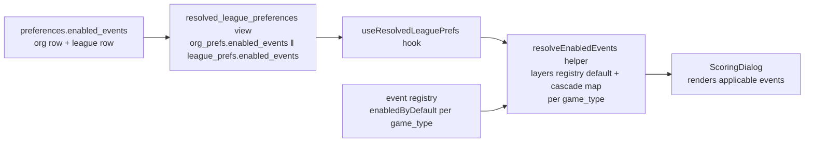
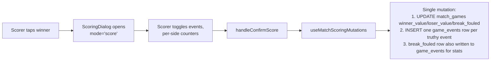
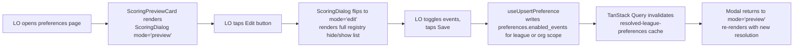
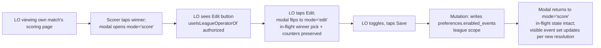

# Scoring Event Registry — game_events Table, LO-Toggleable Events, Multi-Mode Modal

## Overview

Branch B of the scoring modal rework. Replaces the four boolean-event columns on `match_games` with a generalized `game_events` row table backed by a TypeScript event registry. Adds an `enabled_events jsonb` column on `preferences` so league operators (LOs) can toggle which events render in the modal per org or per league. Reworks `ScoringDialog` to accept a `mode` prop (`'score' | 'edit' | 'preview'`) so the same component is the scoring surface, the LO inline-edit surface, and the operator-office preview surface — three modes, one rendering, one persistence path.

Branch A (PR #104) already shipped the calculator-driven modal, the `AdaptiveCounter` primitive, the generalized `winner_value` / `loser_value` columns, the `ResolveCalculatorParams` shared helper, and modal accessibility groundwork. Branch B builds on that foundation; nothing in Branch A is reworked.

## Problem Frame

Today the modal hardcodes a fixed set of trackable events as boolean columns on `match_games`: `break_and_run`, `golden_break`, `runout`, `win_by_forfeit`, plus `break_fouled` as a state modifier. Adding any new event (Early 8, Scratch on 8, 8 in Wrong Pocket, eventually 9-on-the-snap, three-foul forfeits) requires a schema migration, modal edits, and consumer migrations across ~10 files. Every league plays slightly differently — BCA does not count 8-on-the-break as a win, APA counts it, many bar leagues call it an auto-win — and there is no per-league toggle, so the modal cannot adapt to local rules without code changes.

The fix is structural: events become rows in a child table keyed by `event_name`, defined in a TypeScript registry whose entries declare display labels, applicable game types, attribution rules, mutual exclusion, role-conditional gating, and per-game-type defaults. League operators flip events on or off through a `preferences.enabled_events jsonb` column whose org-then-league cascade extends the existing `resolved_league_preferences` view. Adding a new event becomes a one-line registry change.

The same modal that scorers tap winners on becomes the operator's preview-and-edit surface — an LO viewing their own match (or the office preferences page) sees an Edit button on the modal, taps it, sees the full registry as a hide/show list, saves, and the modal returns to its post-Save shape. One component, three modes, the same persistence path. (See origin: `docs/brainstorms/2026-05-05-scoring-modal-rework-requirements.md` and `LIST_FOR_ED.md` #25.)

## Requirements Trace

(see origin: `docs/brainstorms/2026-05-05-scoring-modal-rework-requirements.md`, requirements B1–B15)

**Event registry**
- B1. TypeScript event registry at `src/systems/game-events/` declares each tracked event with: stable `name`, display `label`, optional `abbreviation`, applicable `gameTypes`, optional `winnerRequired`, `attributedTo`, `mutuallyExclusiveWith`, `enabledByDefault` per game type, `suppressesRoleConditionalEvents`. `scheduled-breaker` is a distinct attribution target from `breaker`.
- B2. Seed events at launch: `break_and_run`, `golden_break`, `runout`, `early_8`, `scratch_on_8`, `eight_wrong_pocket`, `win_by_forfeit`, `break_fouled`. (9-ball / 10-ball events deferred to first activation.)
- B3. Modal renders the set of events whose `gameTypes` match the active game type, whose `winnerRequired` matches the actual breaker (post break-fault flip), AND whose name is in the league's resolved enabled-events set.
- B4. Mutual exclusion enforced declaratively from the registry; aria-live announce on auto-uncheck (reuses Branch A's pattern).
- B5. Forfeit (and any "no game played" loss-cause) suppresses role-conditional event rendering — registry expresses via `suppressesRoleConditionalEvents: true`.
- B6. Registry supports `breaker` and `scheduled-breaker` as distinct attribution targets.

**Event storage**
- B7. New `game_events` table: `(id uuid PK, game_id uuid FK match_games ON DELETE CASCADE, match_id uuid FK matches NOT NULL, event_name text NOT NULL, attributed_player_id uuid FK members NULL, value integer NULL, created_at, updated_at)`. The `match_id` denormalization is for realtime subscription filtering.
- B8. Drop 4 flat boolean columns from `match_games`: `break_and_run`, `golden_break`, `runout`, `win_by_forfeit`. Disposable test data — no backfill.
- B9. Keep `break_fouled` as a flat column (state-modifier, read on every modal render). Also writes a row to `game_events` for stat attribution. Both written atomically in the scoring mutation.
- B10. Vacate cascade: the vacate-accept mutation explicitly DELETEs `game_events` rows for the vacated game (primary path). FK ON DELETE CASCADE on `game_id` is a safety net for the rare case where a `match_games` row is itself deleted.
- B11. Realtime subscription extension. The hooks that drive live B&R / runout / golden-break indicators today read the dropped boolean columns from `match_games` realtime payloads; after Branch B those reads come from a `game_events` realtime channel filtered by `match_id`.

**Org/league override**
- B12. New `enabled_events jsonb NOT NULL DEFAULT '{}'::jsonb` column on `preferences`. Stores partial map `{ event_name: boolean }`. Absent key means inherit. NEVER stores NULL (per `feedback_string_sentinels_not_null`).
- B13. `resolved_league_preferences` view extended with `COALESCE(org_prefs.enabled_events, '{}'::jsonb) || COALESCE(league_prefs.enabled_events, '{}'::jsonb)`. League wins per key. Layered over registry's `enabledByDefault` per game type at the resolver layer.
- B14. LO admin surface ships in Branch B. Implemented as the new modal `'edit'` mode (the modal IS the surface — no separate tri-state Select section). The operator-office preferences page mounts the modal in `'preview'` mode with an Edit button visible to LOs.

**Consumer migration**
- B15. The following surfaces migrate to read events from `game_events`: `src/api/queries/featsStats.ts`, `src/realtime/useMatchRealtime.ts`, `src/realtime/useMatchGamesRealtime.ts` (verify whether still in use), `src/hooks/useMatchScoringMutations.ts`, `src/components/scoring/ConfirmationDialog.tsx`, `src/types/match.ts`, `src/api/queries/matchGames.ts`, `src/api/mutations/matches.ts`, characterization tests, and the existing RLS test at `src/__tests__/database/matchGames.rls.test.ts`. (Note: the brainstorm listed `UnifiedScoreboard.tsx`, `GamesList.tsx`, `GameButtonRow.tsx` for B11 — research verified these do NOT actually read the dropped columns. Removed from scope.)

**Hard architectural requirement (LIST_FOR_ED #25)**
- LE25. `ScoringDialog` accepts a `mode` prop (`'score' | 'edit' | 'preview'`) from day one. Same component, same rendering pipeline, three interaction shapes. Authorization (LO-of-this-league) gates the `'edit'` entry point.

## Scope Boundaries

### Developer-owned configuration (not LO-toggleable)
- Editing event names / labels in the registry (calculator-params territory; `label` already exists on calculator params).
- Editing event applicability rules (registry definition territory; developer-owned).

### Future event types
- 9-ball / 10-ball events (`nine_on_snap`, `ten_on_break`, `three_consecutive_fouls`) — deferred to first 9/10-ball league activation.
- Counter event types beyond per-game scoring (APA innings, defensive shots) — registry pattern needs a `kind: 'flag' | 'counter'` discriminator added when first counter event ships.

### Future UI / feature work
- AdaptiveCounter slider / numeric-input modes (deferred until a calculator with range > 8 ships).
- Stats page build-out (Branch B ships clean queryable data; stats consumes later).
- Calculator-side formula evolution.

### Architectural scope deferred
- Season-scope on `preferences` (org → league cascade only; season-scope deferred).
- Live-page loss-cause as alternative entry path.
- Double break-foul cascade.
- House Rules system coupling.

### Related but separate
- LIST_FOR_ED #24 (Fargo initial-points confirmation removal) — independent, separate planning.

### Deferred to Separate Tasks

- Personal stats page consuming `game_events` queries — separate brainstorm + plan.
- Operator-office preferences page general restructure — separate branch (mobile-friendly LO pages, per `project_mobile_lo_pages` memory).
- LIST_FOR_ED #24 Fargo initial-points confirmation removal — separate planning.

## Context & Research

### Relevant Code and Patterns

**Calculator registry pattern (template for event registry)**
- `src/systems/calculators/index.ts` — module-private `Map<string, PointsCalculator<unknown>>`, `registerCalculator()`, `getCalculator()`, `listCalculators()`, `clearRegistry()`. Self-registers on module load (lines 141–147). Note the bug-fix comment about empty-registry crashing production (the 2026-05-02 silent-zero-points incident). Branch B's event registry must mirror this self-registration to avoid the same shape of bug.
- `src/systems/calculators/types.ts` — `ScoringPopupSideSpec` discriminated union (`'fixed'` | `'counter'`) is the canonical pattern for the registry's `attributedTo` and `kind` fields.

**Preferences cascade infrastructure**
- `supabase/migrations/20260429000001_extend_preferences_phase2_modular_axes.sql` — Phase 2 added the only existing jsonb column on preferences (`points_calculator_params`). Use the same shape for `enabled_events`: `JSONB NOT NULL DEFAULT '{}'::jsonb`. Always include `COMMENT ON COLUMN`.
- `supabase/migrations/20260429000002_resolved_view_phase2_modular_axes.sql` — current resolved view; every column wraps `COALESCE(league, org, default)`. Branch B extends with the first per-key jsonb merge in the codebase. View must be `DROP VIEW IF EXISTS ... ; CREATE VIEW ...` to add a column.
- `src/api/hooks/useResolvedLeaguePrefs.ts` — TanStack Query resolver hook (cache key `['resolved-league-preferences', leagueId]`, 5-min stale time). Currently does not select `points_calculator_params` despite it being in the type interface — minor existing gap to fix in passing.
- `src/api/hooks/usePreferenceMutations.ts` — generic `useUpsertPreference` works for any field; no per-field mutation hooks needed.

**LO admin UI mount pattern**
- `src/operator/LeagueSettings.tsx` line 119 mounts `<PreferencesCard entityType="league" entityId={leagueId} />`.
- `src/operator/OrganizationSettings.tsx` line 106 mounts `<OrganizationPreferencesCard organizationId={...} />` (a thin wrapper).
- `src/components/operator/PreferencesCard.tsx` — currently 524 lines, well over the 100-line target. Branch B does NOT add another section here directly; instead mounts the `ScoringDialog` in `'preview'` mode as a new card on these pages.
- `src/components/operator/preferences/MatchRulesSection.tsx` — tri-state precedent (Select with three options where one maps to NULL/inherit at write time). Reference only — Branch B's modal-edit mode uses Switch + per-row Reset rather than a Select per row, but the persistence semantics (presence-vs-absence in the row) match.

**Authorization helpers**
- `src/api/hooks/useUserProfile.ts:137` — `useIsOperator()` returns true for global `member.role === 'league_operator' || 'developer'`. Not per-league.
- `src/api/hooks/useOperatorId.ts:72` — `useOperatorIdValue()` returns the user's `organization_id` (the codebase calls this "operator id"; it's the org).
- No `useIsLeagueOperatorOf(leagueId)` exists. Branch B builds it as `useIsOperator() && currentUserOrgId === match.league.organization_id`.
- RLS pattern: `supabase/migrations/20260419120000_house_rules.sql` (`can_write_house_rule_org` SECURITY DEFINER), `supabase/migrations/20260429000004_threshold_charts_rls_production.sql`, `supabase/migrations/20260429000005_rating_mutation_rpcs.sql`. Use the `can_write_X(target_org_id UUID) RETURNS BOOLEAN SECURITY DEFINER` helper-function shape.

**Modal current state (post-Branch-A)**
- `src/components/scoring/ScoringDialog.tsx` — 451 lines, 24 props. Sections: aria-live region, game number + winner name, role-conditional achievements (currently three independent `Checkbox` components for B&R / Golden Break / Runout, NOT a single RadioGroup as Branch A's plan intended — verified during research; either reverted or never landed), state modifier `Switch`es with attribution disclosure, per-side `<AdaptiveCounter>`, footer.
- Single mount site (post-Branch-A, pre-Branch-B): `src/player/ScoreMatch.tsx:849`. Branch B adds office-page preview mounts (Unit 9).

**Realtime subscription pattern**
- `src/realtime/useMatchRealtime.ts` (290 lines) — unified hook. Subscribes to `matches`, `match_lineups`, `match_games` in one channel `match_${matchId}`. Filters on `match_id=eq.${matchId}`. Reads boolean fields from `payload.new` to drive the confirmation queue at lines 230–237 and 259–269.
- `src/realtime/useMatchGamesRealtime.ts` (215 lines) — older narrower hook (legacy). Verify mount sites before duplicating Branch B changes.
- LIST_FOR_ED #12 storm risk: per-game writes can cause callback identity changes → realtime resubscription cascade. The `stableMatchForMutations` memo (commit `825e90f`) was the partial fix. Any new fields Branch B reads off the resolved match must flow through that memoization boundary.

**Vacate flow**
- `src/hooks/useMatchScoringMutations.ts` — vacate-accept resets `match_games` columns to NULL in a single mutation. The row stays. Branch B extends this mutation to also DELETE `game_events` rows for the vacated `game_id`.

**Migration template**
- `supabase/migrations/20260501000000_matches_modular_columns.sql` — gold-standard hard-rename precedent. Heavy header, transaction-wrapped, `COMMENT ON COLUMN` for every column.
- `supabase/migrations/20260505000000_match_games_value_columns.sql` — Branch A's drop-and-add migration; shorter, no transaction wrapper. Branch B uses the longer transaction-wrapped template since it touches multiple objects.
- Filename convention: `YYYYMMDDHHMMSS_snake_case_description.sql`. No `BEGIN/COMMIT` is technically required (Supabase CLI runs in implicit transaction); use it anyway because Branch B's migration touches multiple objects (new table + drop columns + extend view + RLS) and explicit transaction makes the all-or-nothing intent obvious.

### Institutional Learnings

`docs/solutions/` does not exist in this repo — institutional memory lives in plan documents, brainstorm documents, `LIST_FOR_ED.md`, and the user's auto-memory.

**Direct-hit memory items**
- `feedback_string_sentinels_not_null` — for `enabled_events jsonb`, never store NULL to mean "off." Use absent-key for inherit, `false` for explicit-off, `true` for explicit-on. The 2026-05-03 `points_calculator` silent-default-collapse incident is the canonical "NULL got swallowed by the cascade" bug.
- `feedback_two_paths_audit_pattern` — the `break_fouled` column-AND-event-row dual-write means two paths can drift. Mitigation: write both atomically in the same mutation; document which side reads from which (column for state-modifier reads on every modal render; event row for stat queries).
- `feedback_consolidate_migrations_in_pr` — Branch B's migration trail (drop 4 columns + new game_events table + new enabled_events column + view rebuild + RLS) lands as ONE migration. Never edit history post-merge.
- `feedback_dev_data_disposable` — no backfill plumbing for the 4 dropped booleans. `db reset` rebuilds.
- `feedback_list_for_ed_travels_with_commits` — LIST_FOR_ED.md updates ride with the working branch's commits.
- `project_scoring_accountability` — vacate-and-rescore is the only fix path; `game_events` cascade-on-vacate respects this.
- `project_operator_org_membership_shape` — operators are scoped to their organization (typically 1 owned org). Authorization helper builds on this.

**Past plan precedents**
- `docs/plans/2026-05-01-001-feat-modular-league-system-v2-plan.md` — hard-rename / hard-drop migration pattern (lines 273, 288, 296, 673). Same shape Branch B follows for the 4-column drop.
- `docs/plans/2026-05-03-001-feat-unified-scoreboard-plan.md` — the `displayHints` calculator-driven rendering pattern is the analog for the event registry. The plan's lesson on dispatching by capability rather than by mode-string applies to Branch B's mode prop (the three modes truly differ; the prop is justified — but per-section rendering should still dispatch on the underlying registry data, not on the mode string itself).
- `docs/plans/2026-05-05-001-feat-scoring-modal-plumbing-plan.md` — Branch A. Unit 2 is the migration template Branch B mirrors.

### External References

None — codebase has strong local patterns for every Branch B concern. Postgres jsonb merge (`||`) is a documented operator; no external research warranted.

## Key Technical Decisions

**Architecture**
- **Modal IS the LO admin surface.** The original brainstorm B14 envisioned a separate "EventsSection with tri-state Select per event" inside `PreferencesCard`. Per the user's clarification on 2026-05-09, the cleaner shape is to mount `ScoringDialog` in `'preview'` mode on the operator office preferences page, with an Edit button that flips it to `'edit'` mode. The modal IS both the preview AND the configuration surface. One rendering, three interaction modes (`'score'` | `'edit'` | `'preview'`), one persistence path. Avoids building a parallel control surface that could drift from the actual modal rendering.
- **Mode prop is a string discriminator, not a capability flag.** The three modes truly differ in interaction shape (mutations land in score/edit; preview is read-only). Per-section rendering inside the modal still dispatches on registry data (event applicability, role-gating, mutual exclusion) — the mode string only gates outer behaviors (which buttons render, where toggles persist).
- **Authorization gates the `'edit'` entry point, not the mode prop itself.** The pencil/Edit button only renders when the current user is an LO of the relevant scope (league for live-game inline edit; org or league for office preview). The mode prop is internal; nothing renders the LO edit button without authorization having already passed.
- **`game_events.match_id` is denormalized.** Postgres realtime can only filter on direct columns. Without `match_id` on `game_events`, spectators must subscribe per-`game_id` (25 channels per active 5v5 match) or the hook must do a join-then-fanout that is fragile under the existing realtime resubscription storm risk (LIST_FOR_ED #12). One denormalized FK is cheap and matches existing parent-keyed-child patterns.
- **`enabled_events` resolution: server-side jsonb `||` merge in the resolved view.** Mirrors brainstorm B13. Keeps every existing axis cascade in the same layer; client-side merge would split the resolution logic and grow drift risk.
- **`enabled_events` shape: absent-key = inherit, `false` = explicit-off, `true` = explicit-on. NEVER NULL.** Per `feedback_string_sentinels_not_null`. The cascade `org_prefs.enabled_events || league_prefs.enabled_events` is right-wins-per-key in Postgres; an absent key in the league map preserves the org's setting (or its absence inherits the registry default).
- **Locked-by-org-set is a documented limitation.** If org sets `{ early_8: false }`, the league's `enabled_events` map cannot express "use registry default again" without removing the key — but removing the league's key just inherits the org's `false`. To revert to registry default, the org admin must remove the org-level key. Branch B does NOT introduce a sentinel value (e.g., `"registry"`) to express this — the cost (resolver complexity, view rewrite, more code paths) is not justified for a corner case. Documented in the plan and surfaced in the LO admin UI copy.
- **LO toggle propagation: defer to next-modal-open.** Resolved 2026-05-09 with the user. Modal reads resolved enabled-events when it opens (TanStack Query cache invalidation on the preferences write triggers a fresh fetch on the resolver hook). UI copy on the office preferences page informs LOs that "changes apply when scorers open their next game modal." No new realtime channel for `preferences`. Eliminates mid-modal flicker risk.

**Schema**
- **Single consolidated migration.** Drops the 4 boolean columns, creates `game_events` (with denormalized `match_id` + RLS policies + indexes), adds `enabled_events jsonb` on `preferences`, drops and recreates `resolved_league_preferences` with the jsonb merge included. Wrapped in an explicit transaction. Per `feedback_consolidate_migrations_in_pr`.
- **`game_events` indexes**: `(game_id)`, `(match_id)`, `(attributed_player_id, event_name)` composite. The first two for filter performance (vacate DELETE, realtime channel filter); the composite for stats COUNT-by-player-and-event queries (which is the actual shape of every sample stats query in Unit 1, e.g., `WHERE attributed_player_id = ? AND event_name = 'break_and_run'`). A standalone `(event_name)` index is NOT added — full-table count-by-event queries with no player filter aren't a documented use case yet, and the composite serves the listed queries with index-only access for the player-side filter. Add as part of the migration; do not defer.
- **`preferences` table currently has NO RLS.** Verified: `supabase/migrations/20251130010824_baseline.sql:3504` grants ALL on preferences to authenticated; no policies exist. This means the new `enabled_events jsonb` column would be writable by any authenticated user via direct PostgREST upsert, bypassing the UI's `useIsLeagueOperatorOf` gate entirely. **Branch B's migration MUST add RLS to `preferences` as part of the same migration** — write policies must require `organization_staff.position IN ('owner', 'admin')` matching the row's `(entity_type, entity_id)`: org rows require admin of that org; league rows require admin of the league's organization. SELECT can stay open (matches `match_games` posture). Use a `can_write_preferences(target_entity_type, target_entity_id) SECURITY DEFINER` helper. Without this, Branch B ships a security bug on day one.
- **`game_events` RLS: novel two-tier check (scorer-or-LO).** No existing precedent in the codebase for this exact shape — `can_write_house_rule_org` and `can_write_threshold_chart` are single-tier (org-admin only). Branch B builds `can_write_game_event(target_game_id uuid) RETURNS BOOLEAN SECURITY DEFINER` that returns true when EITHER: (a) caller is on the locked match lineup as an active player — `EXISTS (SELECT 1 FROM matches m JOIN match_lineups ml ON ml.id IN (m.home_lineup_id, m.away_lineup_id) WHERE m.id = (SELECT match_id FROM match_games WHERE id = target_game_id) AND (ml.player1_id = caller_member_id OR ml.player2_id = caller_member_id OR ml.player3_id = caller_member_id OR ml.player4_id = caller_member_id OR ml.player5_id = caller_member_id) AND ml.locked = true)`, OR (b) caller has `organization_staff.position IN ('owner', 'admin')` joined via `members.user_id = auth.uid()` AND `organization_staff.organization_id = league.organization_id` (mirrors `can_write_house_rule_org` for the org-admin branch). Tests must explicitly cover the wrong-team case (member of team A blocked from writing events for team B's match) and the unlocked-lineup case (writes blocked while lineup is in setup).
- **No backfill.** The 4 dropped columns held disposable test data per `feedback_dev_data_disposable`. `db reset` rebuilds; production has no live data on staging.
- **`break_fouled` stays as a flat column.** Reads on every modal render to drive role-conditional gating for B&R / runout. ALSO writes a row to `game_events` for stat attribution. The mutation writes both atomically. The column is the source-of-truth for state-modifier reads (synchronous); the event row is the source-of-truth for stat queries (queryable surface).

**Registry shape**
- **Self-registering Map mirrors `src/systems/calculators/index.ts` exactly.** Verified pattern: definition files export their `GameEventDefinition` constant; `index.ts` statically imports each definition module then calls `registerSeedEvents()` which walks them and calls `registerGameEvent(def)` for each. **Do NOT use side-effect-only imports** (where each definition file calls `registerGameEvent` at module-eval time) — those differ from the calculator pattern in tree-shaking behavior, HMR behavior under Vite, and break unit tests that import a single definition file directly without going through `index.ts`. Module-private `Map<string, GameEventDefinition>`. Public API: `getGameEvent(name)`, `listGameEvents()`, `clearRegistry()` (tests). Hermetic test setup: `beforeEach(() => { clearRegistry(); registerSeedEvents(); })` — same as `src/utils/match/__tests__/computeMatchRunningTotals.test.ts:60-68`. The 2026-05-02 silent-zero-points incident is the canonical "registry was empty at module load" bug; do not introduce alternative lookup paths.
- **`attributedTo` is per-event, not per-game-type.** All seed events have a single attribution rule across applicable game types. If a future event needs per-game-type override, the registry entry can switch to a `Record<GameType, AttributedTo>` shape — backward-compatible at the type level. Keep simple now.
- **`suppressesRoleConditionalEvents` is a separate flag from `mutuallyExclusiveWith`.** Different semantics: mutual exclusion only un-checks a peer; suppression also hides the peer's checkbox entirely. Separate flag keeps the modal logic clear (un-check vs hide-and-un-check are different DOM transitions).
- **`scheduled-breaker` is a distinct attribution target.** Used by `break_fouled` (offender is whoever was scheduled to break before the fault, not the post-flip actual breaker). Branch B supports both `breaker` and `scheduled-breaker` from day one.
- **Mode-prop edit-rendering: 2-state Switch per event + per-row Reset button.** When the league has an explicit override on an event, a small "Reset to default" button shows next to the row. Tapping it removes that key from the league's `enabled_events` (so the row reverts to inheriting org or registry default). This is simpler than a tri-state Select per row, matches the user's mental model ("opt in or opt out, save"), and exposes the inherit-default capability without a third visible state.

**Scope adjustments from research**
- B11 dropped `UnifiedScoreboard.tsx`, `GamesList.tsx`, `GameButtonRow.tsx` — research verified they don't read the dropped columns.
- `featsStats` lives at `src/api/queries/featsStats.ts`, not `src/utils/featsStats.ts` (brainstorm path was wrong).
- `database.types.ts` is generated by `pnpm db:types`, not hand-maintained (Branch A's plan note was wrong). Run regeneration after the migration.
- `useMatchGamesRealtime.ts` may be legacy; Unit 7 verifies before duplicating changes there.

## Open Questions

### Resolved During Planning

- **LO toggle propagation timing.** Defer to next-modal-open. Office preferences page UI informs LOs of this timing.
- **Override authority.** League overrides org. Mirrors existing scalar cascade.
- **LO admin UI shape.** The modal IS the surface (mounted in `'preview'` mode on office preferences page; Edit button flips to `'edit'` mode showing the full registry). No separate tri-state Select section.
- **jsonb merge layer.** Server-side `||` in the resolved view. First per-key jsonb cascade in this codebase; documented as a new pattern in the view's `COMMENT`.
- **Realtime filter strategy.** Denormalize `match_id` onto `game_events`; per-match channel filter, mirrors existing parent-keyed-child pattern.
- **All 4 booleans drop in one migration.** Single consolidated migration per project policy.
- **`forfeit suppresses role-conditional events`.** Separate `suppressesRoleConditionalEvents` flag distinct from `mutuallyExclusiveWith`.
- **`scheduled-breaker` vs `breaker`.** Distinct attribution targets supported from day one.
- **`attributedTo` per-game-type override.** Not built. Per-event for now; expand to `Record<GameType, AttributedTo>` if a future event needs it.
- **Edit-mode write timing.** Save-button-based (matches existing PreferencesCard pattern; explicit confirmation; safer per Ed's "rock solid no bugs" priority). Modal accumulates toggles in local state; Save commits all to `preferences.enabled_events` in one mutation; Cancel discards.
- **Inline-pencil + in-flight winner-tap interaction.** Modal flips to `'edit'` mode preserving the in-flight scoring state (the winner pick, any per-side counter values). On Save (or Cancel), modal returns to `'score'` mode with the same in-flight state intact. Per LIST_FOR_ED #25's "modal returns to scoring shape with the new visibility set."

### Deferred to Implementation

- **`enabledByDefault` matrix — Phase 1 vs Phase 2 scoping.** **Phase 1** ships defaults that match today's modal behavior **exactly** — no behavior change for users. The 4 dropped boolean columns (`break_and_run`, `golden_break`, `runout`, `win_by_forfeit`) are currently always rendered when their role conditions match; Phase 1's registry defaults preserve that. The 4 net-new events (`early_8`, `scratch_on_8`, `eight_wrong_pocket`, `break_fouled`) — only `break_fouled` exists today as a column; the other three are introduced in Phase 1 but `enabledByDefault: false` in the registry across all game types so they don't render in scoring modals until Phase 2 makes them LO-toggleable. **Phase 2** is when scoresheet verification matters — that's when LOs gain the ability to enable/disable events per league, and the registry's defaults become the floor instead of the actual rendering. Implementer verifies against APA / BCA / FargoRate scoresheets during Phase 2 planning, not Phase 1 execution.
- **Top-5 stats queries — schema-shape sanity check (not a hard gate).** Unit 1 documents 5 sample queries inline in the plan. The check is: do these query shapes look clean against the proposed `game_events` columns? Do they need columns I haven't added (e.g., season_id, team_id denormalization)? This is planning-time *readability* validation, not EXPLAIN-against-real-table validation (which can't happen until Unit 2 applies). If query design surfaces a missing column during this read, raise it before Unit 2 starts. Sample queries: (1) "B&Rs by player across season"; (2) "Multi-event leaderboard: combined B&R + golden break ranks"; (3) "Forfeit count by team"; (4) "Loss-cause breakdown for a player"; (5) "Per-match event log for a single match." Actual EXPLAIN/index-use validation happens in Unit 2's verification step after the migration applies.
- ~~Whether `useMatchGamesRealtime.ts` is dead code.~~ **Resolved during planning review:** verified dead — grep returned zero importers in `src/`. Channel name is distinct (`match_games_${matchId}` vs `match_${matchId}`), so no risk of channel deduplication. Unit 7 deletes it outright; no mirroring needed.
- **`points_calculator_params` missing from `useResolvedLeaguePrefs` SELECT.** Minor existing gap (the field is in the type interface but not selected). Fix in passing during Unit 3 or note as separate cleanup.
- **Final modal copy** for the inline Edit button label, the office-page mount-point copy, the "changes apply on next modal open" caption, the per-row Reset button label, and the aria-live announcement template for forfeit-suppression cascades. Implementer adjusts after seeing rendered layout.

## Output Structure

```
src/systems/game-events/
├── index.ts                       # registry, register/get/list/clear API; self-register block
├── types.ts                       # GameEventDefinition + AttributedTo + GameEventKind types
├── definitions/
│   ├── break_and_run.ts          # registers definition at module load
│   ├── golden_break.ts
│   ├── runout.ts
│   ├── early_8.ts
│   ├── scratch_on_8.ts
│   ├── eight_wrong_pocket.ts
│   ├── win_by_forfeit.ts
│   └── break_fouled.ts
├── resolveEnabledEvents.ts        # layers registry default + cascade-resolved enabled_events map
└── __tests__/
    ├── registry.test.ts
    ├── resolveEnabledEvents.test.ts
    └── definitions.test.ts        # smoke-tests every seed definition's invariants

supabase/migrations/
└── 2026MMDDHHMMSS_game_events_table_and_enabled_events.sql

src/hooks/
└── useIsLeagueOperatorOf.ts       # new authorization helper

src/components/scoring/
└── ScoringDialog.tsx              # rewritten with mode prop + section extraction
└── ScoringDialogEditMode.tsx      # extracted; renders the registry hide/show list
└── ScoringDialogPreviewMode.tsx   # extracted; read-only render

src/operator/
└── ScoringPreviewCard.tsx         # new card on LeagueSettings + OrganizationSettings
                                    # mounts ScoringDialog in 'preview' mode with Edit button
```

## High-Level Technical Design

> *This illustrates the intended approach and is directional guidance for review, not implementation specification. The implementing agent should treat it as context, not code to reproduce.*

### Data flow (read path)



### Data flow (write path — scoring)



### Data flow (write path — LO toggle, office page)



### Data flow (write path — LO toggle, inline during live match)



### Registry shape (directional)

```typescript
// src/systems/game-events/types.ts
type AttributedTo =
  | 'winner' | 'loser' | 'breaker' | 'non-breaker' | 'scheduled-breaker';

type GameEventDefinition = {
  name: string;                               // 'break_and_run', stable snake_case
  label: string;                              // 'Break & Run'
  abbreviation?: string;                      // 'B&R'
  gameTypes: GameType[];                      // ['8-ball', '9-ball']
  winnerRequired?: 'breaker' | 'non-breaker'; // role-gate; absent = no gate
  attributedTo: AttributedTo;
  mutuallyExclusiveWith?: string[];           // peer event_names
  enabledByDefault: Record<GameType, boolean>;
  suppressesRoleConditionalEvents?: boolean;  // forfeit
};
```

```typescript
// src/systems/game-events/index.ts
const registry = new Map<string, GameEventDefinition>();
export const registerGameEvent = (def: GameEventDefinition) => { ... };
export const getGameEvent = (name: string): GameEventDefinition | null;
export const listGameEvents = (): GameEventDefinition[];
export const clearRegistry = (): void;  // tests only

// Static imports + walker function — mirrors src/systems/calculators/index.ts:130-148 EXACTLY
// Do NOT use side-effect-only imports.
import { breakAndRun } from './definitions/break_and_run';
import { goldenBreak } from './definitions/golden_break';
import { runout } from './definitions/runout';
// ... etc

const seedEvents: GameEventDefinition[] = [breakAndRun, goldenBreak, runout, /* ... */];

export const registerSeedEvents = () => {
  seedEvents.forEach(def => registerGameEvent(def));
};

registerSeedEvents();  // self-register on module load
```

### Resolved enabled-events helper (directional)

```typescript
// src/systems/game-events/resolveEnabledEvents.ts
// Inputs:
//   - cascadeMap: Record<event_name, boolean>  (from resolved_league_preferences.enabled_events; absent key = inherit)
//   - gameType: GameType
// Returns: Set<event_name> of events the modal should render (subject to role-gating + mutual-exclusion at runtime)
//
// Logic:
//   - For each registered event:
//     - If gameType not in event.gameTypes → exclude
//     - If cascadeMap[event.name] === false → exclude
//     - If cascadeMap[event.name] === true → include
//     - If cascadeMap[event.name] is absent → fall back to event.enabledByDefault[gameType]
```

## Phased Delivery

The plan is one design but ships across **two PRs** — staged to keep each PR's blast radius reviewable and to address the document-review finding that 10 units of first-of-kind patterns on a single branch exceeds the user's "rock solid no bugs" risk tolerance.

**Phase 1 — Registry Foundation (ships first; this branch's PR)**

What lands: the durable architectural shape. After Phase 1, scoring stores events as rows in `game_events` driven by the TypeScript registry instead of as booleans on `match_games`. The modal renders ALL applicable events from the registry by default — behavior is identical to today's hardcoded rendering. No LO-facing configuration UI yet; no `enabled_events` column; no view rebuild; no mode prop.

Phase 1 units:
- **Unit 1** — Event registry module + seed events + stats query sketches
- **Unit 2 (Phase 1 portion)** — Schema migration: create `game_events` table with `match_id` denormalization + RLS via `can_write_game_event`; drop the 4 boolean columns from `match_games`. **Deferred to Phase 2:** `enabled_events` jsonb on preferences, `preferences` RLS, view rebuild
- **Unit 5 (Phase 1 portion)** — ScoringDialog rewrite from individual boolean props to a registry-driven events map (no mode prop yet — that's Phase 2)
- **Unit 6** — Scoring mutations rewrite: write `game_events` rows; `break_fouled` dual-write; vacate cascade
- **Unit 7** — Realtime extension + ConfirmationDialog rewrite (consumes events from `game_events` query); delete dead `useMatchGamesRealtime.ts`
- **Unit 8** — featsStats rewrite (B&R + golden_break paths only; Flawless Nights query unchanged) + type cleanup
- **Unit 10 (Phase 1 portion)** — Polish, RLS tests for `game_events`, characterization fixture sweep

**Phase 2 — LO Configuration Surface (follows in a separate PR)**

What lands: LOs can toggle which events render in the modal per org or per league. Same scoring modal becomes the office-page preview-and-edit surface via the `mode` prop. Phase 2 is layered on top of Phase 1 — it doesn't rework Phase 1's storage or registry; it adds a configuration cascade and authorization-gated entry points.

Phase 2 units (planned in this document for context; will land via a follow-up PR planned separately when Phase 1 is in flight or shipped):
- **Unit 2 (Phase 2 portion)** — Schema continuation: add `enabled_events jsonb` to `preferences`, enable RLS on `preferences` with `can_write_preferences`, drop+recreate `resolved_league_preferences` with the per-key jsonb merge
- **Unit 3** — `useResolvedLeaguePrefs` extended + `resolveEnabledEvents` helper
- **Unit 4** — `useIsLeagueOperatorOf` + `useIsOrganizationOperatorOf` authorization helpers
- **Unit 5 (Phase 2 portion)** — Mode prop (`'score' | 'edit' | 'preview'`) + section extraction (`ScoringDialogEditMode.tsx`, `ScoringDialogPreviewMode.tsx`)
- **Unit 9** — `ScoringPreviewCard` on `LeagueSettings.tsx` and `OrganizationSettings.tsx`
- **Unit 10 (Phase 2 portion)** — Office UI polish, RLS tests for `preferences`, mode-prop a11y tests

**Why this seam works:** Phase 1's registry is a TypeScript module independent of any database column; Phase 2's `enabled_events` is purely additive (a new column, new RLS, new view shape). Nothing in Phase 1 needs to be unwound for Phase 2. Phase 2's resolver layer (`resolveEnabledEvents`) defaults to "all registry events on" when called with an empty cascade map — which is exactly what Phase 1 ships (no resolver, no cascade, all-on-by-default). Same modal behavior, different code path, no rework.

**Document-review findings still owed for Phase 2:** the LO admin UX (Save failure state, loading state, edit-mode row layout at 320px, Reset button visual form, synthetic match context for preview, "modal IS the surface" coupling re-evaluation) is concentrated in Phase 2 units. Those findings will be addressed when Phase 2 is replanned closer to its execution date — by which time Phase 1 will be in production and we'll have lived with the registry pattern, which may surface additional design constraints.

## Implementation Units

Implementation units below are written for the full scope. Each unit is tagged with its **Phase**. Phase 1 units have full execution-ready detail; Phase 2 units are scoped here for context but will be re-detailed in a follow-up plan when Phase 2 is ready to start.

```
PHASE 1 (this PR — registry foundation):
Unit 1 (registry) ──┬─> Unit 5p1 (modal: events-map props)
                    ├─> Unit 6 (mutations)
Unit 2p1 (game_events table) ──┬─> Unit 6
                                ├─> Unit 7 (realtime)
                                └─> Unit 8 (featsStats)
Unit 6 ──> Unit 7
Unit 10p1 (polish) — independent

PHASE 2 (follow-up PR — LO configuration):
Unit 2p2 (enabled_events + preferences RLS + view) ──> Unit 3 (resolver) ──┐
Unit 4 (auth helper) ──┐                                                    ├──> Unit 5p2 ──> Unit 9
Unit 5p2 (mode prop) ──┴────────────────────────────────────────────────────┘
Unit 10p2 (polish) — independent
```

---

- [x] **Unit 1: Event registry module + seed events + stats query sketches** — **Phase 1**

**Goal:** Build the TypeScript event registry with self-registration, the resolveEnabledEvents helper (used by Phase 2 but cheap to ship in Phase 1 — it defaults to "all events on" when given an empty cascade map), and the eight seed event definitions. Document five sample stats queries inline in the plan to sanity-check schema shape before Unit 2 locks the table.

**Requirements:** B1, B2, B5, B6 (registry shape and seed events).

**Dependencies:** None.

**Files:**
- Create: `src/systems/game-events/types.ts` (`GameEventDefinition`, `AttributedTo`, helper types)
- Create: `src/systems/game-events/index.ts` (registry, register/get/list/clear API, self-register block importing every definition)
- Create: `src/systems/game-events/resolveEnabledEvents.ts` (layers registry default + cascade map per game type)
- Create: `src/systems/game-events/definitions/break_and_run.ts`
- Create: `src/systems/game-events/definitions/golden_break.ts`
- Create: `src/systems/game-events/definitions/runout.ts`
- Create: `src/systems/game-events/definitions/early_8.ts`
- Create: `src/systems/game-events/definitions/scratch_on_8.ts`
- Create: `src/systems/game-events/definitions/eight_wrong_pocket.ts`
- Create: `src/systems/game-events/definitions/win_by_forfeit.ts`
- Create: `src/systems/game-events/definitions/break_fouled.ts`
- Test: `src/systems/game-events/__tests__/registry.test.ts`
- Test: `src/systems/game-events/__tests__/resolveEnabledEvents.test.ts`
- Test: `src/systems/game-events/__tests__/definitions.test.ts`
- Doc: append to this plan a short "Stats query validation" section before Unit 2 lands, capturing the 5 sample queries

**Approach:**
- Mirror `src/systems/calculators/index.ts` exactly: module-private `Map<string, GameEventDefinition>`, `registerGameEvent`, `getGameEvent`, `listGameEvents`, `clearRegistry`. Self-register on module load via a series of side-effect-import statements at the bottom of `index.ts` (one per definition file).
- Each definition file is ~10 lines: imports the registry, calls `registerGameEvent({ ... })` at module top-level. No exports needed (self-registration is the contract).
- **Definition matrix — Phase 1 ships these defaults exactly. Goal: zero user-visible behavior change.** Today's modal renders B&R / Golden Break / Runout / Win-by-forfeit / Break-foul under their existing role-conditions. Phase 1 must preserve that exactly. The 3 net-new events (`early_8`, `scratch_on_8`, `eight_wrong_pocket`) are added to the registry but ship `enabledByDefault: false` everywhere — they don't render in scoring modals until Phase 2 makes them LO-toggleable. Scoresheet verification belongs to Phase 2 planning, not Phase 1 execution.
  - `break_and_run`: gameTypes 8-ball/9-ball/10-ball; attributedTo='winner'; winnerRequired='breaker'; enabledByDefault all `true`; mutuallyExclusiveWith=['golden_break']
  - `golden_break`: gameTypes 8-ball; attributedTo='winner'; winnerRequired='breaker'; enabledByDefault 8-ball=`true`; mutuallyExclusiveWith=['break_and_run']
  - `runout`: gameTypes 8-ball; attributedTo='winner'; winnerRequired='non-breaker'; enabledByDefault 8-ball=`true`
  - `early_8`: gameTypes 8-ball; attributedTo='loser'; enabledByDefault 8-ball=**`false`** (Phase 1 — net-new event, dormant until Phase 2 ships LO toggle)
  - `scratch_on_8`: gameTypes 8-ball; attributedTo='loser'; enabledByDefault 8-ball=**`false`** (Phase 1 — net-new, dormant)
  - `eight_wrong_pocket`: gameTypes 8-ball; attributedTo='loser'; enabledByDefault 8-ball=**`false`** (Phase 1 — net-new, dormant)
  - `win_by_forfeit`: gameTypes all; attributedTo='winner'; enabledByDefault all `true`; suppressesRoleConditionalEvents=true
  - `break_fouled`: gameTypes all; attributedTo='scheduled-breaker'; enabledByDefault all `true`
- `resolveEnabledEvents(cascadeMap, gameType)` returns a `Set<string>` of event names the modal renders (subject to role-gating and mutual-exclusion at modal-render time, not here). Logic per the directional sketch above.
- **Stats query validation gate:** before Unit 2's migration is finalized, draft the 5 SQL queries below (in plan comments or a separate scratch doc) against the proposed `game_events` schema. If any query needs a column not in the proposed table (e.g., a denormalized team_id, season_id, or org_id), surface it now and add to the table shape before locking. Sample queries: (1) `SELECT event_name, COUNT(*) FROM game_events WHERE attributed_player_id = ? AND event_name = 'break_and_run' GROUP BY event_name`; (2) Multi-event leaderboard `WHERE event_name IN ('break_and_run', 'golden_break')`; (3) Forfeit count by team (joins to match_games + match_lineups); (4) Loss-cause breakdown (`WHERE attributed_player_id = ? AND event_name IN ('early_8', 'scratch_on_8', 'eight_wrong_pocket')`); (5) Per-match event log (`WHERE match_id = ?`). The denormalized `match_id` answers query (5) without joining. Validate that queries 1-4 are clean against the proposed schema before locking.

**Patterns to follow:**
- `src/systems/calculators/index.ts` — registry shape and self-registration.
- `src/systems/calculators/types.ts` — discriminated-union and `Record<...>` typing patterns.
- `src/utils/match/__tests__/computeMatchRunningTotals.test.ts:60-68` — `clearRegistry()` + re-register pattern in `beforeEach`.

**Test scenarios:**
- Happy path: `getGameEvent('break_and_run')` returns the registered definition with the expected fields.
- Happy path: `listGameEvents()` returns all 8 seed definitions after module load.
- Happy path: `resolveEnabledEvents({}, '8-ball')` returns the set of events whose `enabledByDefault['8-ball']` is true (`break_and_run`, `golden_break`, `runout`, `early_8`, `scratch_on_8`, `eight_wrong_pocket`, `win_by_forfeit`, `break_fouled`).
- Happy path: `resolveEnabledEvents({ early_8: false }, '8-ball')` excludes `early_8`.
- Happy path: `resolveEnabledEvents({ runout: true }, '9-ball')` excludes `runout` because `gameTypes` does not include 9-ball (registry filter takes precedence over enabled_events override).
- Edge case: `resolveEnabledEvents({}, '9-ball')` includes `break_and_run` (registered for 9-ball) but excludes `golden_break` (8-ball only).
- Edge case: `getGameEvent('nonexistent')` returns null without throwing.
- Edge case: empty registry (after `clearRegistry()`) — `resolveEnabledEvents({}, '8-ball')` returns empty set; no throw.
- Integration: registry self-registers on first `import` of `src/systems/game-events` from any consumer — verify by clearing registry, re-importing the index module, and asserting all 8 definitions are present (mirrors the calculator-registry self-registration test).
- Smoke: every seed definition has a non-empty `name`, `label`, `gameTypes`, `attributedTo` (definition invariants).
- Smoke: no two definitions share a `name`.

**Verification:**
- `pnpm test` passes for the new tests.
- `pnpm run typecheck` passes.
- The 5 sample stats queries (drafted as part of this unit) execute cleanly against the proposed `game_events` schema (validated in Unit 2's migration test).

---

- [x] **Unit 2 (Phase 1): Schema migration — game_events table, drop 4 booleans, RLS** — **Phase 1**

**Goal:** Phase 1 migration creates `game_events` (with denormalized `match_id`, RLS via `can_write_game_event`, indexes), drops the 4 boolean columns from `match_games`. Regenerate `database.types.ts`.

**Phase 1 vs Phase 2 split:** Phase 1 ships steps 1–6 and 13 from the migration body below. Steps 7–12 (`preferences` RLS, `enabled_events` column, view rebuild) are Phase 2 — they ship in a separate migration in a follow-up PR.

**Phase 2 reference (do NOT include in Phase 1's migration):**

- [x] **Unit 2 (Phase 2): Schema continuation — enabled_events jsonb + preferences RLS + view rebuild** — **Phase 2**

Phase 2 migration adds `enabled_events jsonb` to `preferences`, enables RLS on `preferences` with `can_write_preferences`, drops and recreates `resolved_league_preferences` with the per-key `||` jsonb merge. Detailed planning lives in this plan's Architecture section but execution-level test scenarios for Phase 2 will be re-detailed when Phase 2 is replanned closer to its start date. The full migration body in the §Approach below shows ALL steps for context — implementer of Phase 1 uses only the labeled Phase 1 steps.

---

**Continuing Unit 2 (Phase 1) detail:**

**Requirements:** B7, B8, B9 (column kept), B10 (FK ON DELETE CASCADE), B12, B13.

**Dependencies:** Unit 1 (registry's seed event names confirm the migration's RLS policy doesn't need event-name allowlisting; registry validates the schema's column shape via the stats-query gate).

**Files:**
- Create: `supabase/migrations/2026MMDDHHMMSS_game_events_table_and_enabled_events.sql` (single migration)
- Modify (regenerate): `src/types/database.types.ts` via `pnpm db:types` after migration runs
- Modify: `src/types/match.ts` (drop the 4 boolean fields from `MatchGame` interface; add `MatchGameEvent` type for the new row shape; update `ConfirmationQueueItem`)
- Modify: `src/api/queries/matchGames.ts` (drop boolean fields from row type)
- Modify: `src/api/mutations/matches.ts` (drop boolean fields from insert type)
- Test: `src/__tests__/database/gameEvents.rls.test.ts` (new — mirrors `matchGames.rls.test.ts` shape)
- Test: `src/__tests__/database/matchGames.rls.test.ts` (modify — drop tests that exercise the 4 dropped columns; replace with tests for the equivalent event-row writes)

**Approach:**
- **Single migration, transaction-wrapped.** Use `BEGIN;` and `COMMIT;` because the migration touches multiple objects (new table + new column + view drop+recreate + drop columns + RLS + helper function). All-or-nothing intent makes the wrapper meaningful even though Supabase CLI runs in implicit transaction.
- **Heavy header comment** referencing this plan and the requirements (B7–B13).
- Migration body order (each step labeled by phase):
  1. **[Phase 1]** `CREATE TABLE game_events` with columns per B7 plus `match_id uuid NOT NULL REFERENCES matches(id)` (denormalized for realtime filter). Default `created_at` and `updated_at` to `now()`.
  2. **[Phase 1]** `CREATE INDEX` on `(game_id)`, `(match_id)`, and composite `(attributed_player_id, event_name)`. (No standalone `(event_name)` index — composite serves the listed stats queries.)
  3. **[Phase 1]** `COMMENT ON TABLE` and `COMMENT ON COLUMN` for every column explaining intent and the registry-name semantic. The `match_id` comment explicitly states "denormalized for realtime channel filtering — see plan 2026-05-09-001 §realtime."
  4. **[Phase 1]** `ALTER TABLE game_events ENABLE ROW LEVEL SECURITY`.
  5. **[Phase 1]** `CREATE OR REPLACE FUNCTION can_write_game_event(target_game_id uuid) RETURNS BOOLEAN SECURITY DEFINER` — two-tier check: (a) scorer on locked lineup branch — `EXISTS (SELECT 1 FROM matches m JOIN match_lineups ml ON ml.id IN (m.home_lineup_id, m.away_lineup_id) WHERE m.id = (SELECT match_id FROM match_games WHERE id = target_game_id) AND (ml.player1_id = caller_member_id OR ml.player2_id = caller_member_id OR ml.player3_id = caller_member_id OR ml.player4_id = caller_member_id OR ml.player5_id = caller_member_id) AND ml.locked = true)`; OR (b) org-admin branch — `EXISTS (SELECT 1 FROM organization_staff os JOIN members m ON m.id = os.member_id WHERE m.user_id = auth.uid() AND os.organization_id = (SELECT l.organization_id FROM matches mt JOIN seasons s ON s.id = mt.season_id JOIN leagues l ON l.id = s.league_id WHERE mt.id = (SELECT match_id FROM match_games WHERE id = target_game_id)) AND os.position IN ('owner', 'admin'))`. Mirrors `can_write_house_rule_org` for the org-admin branch; the scorer-on-lineup branch is novel.
  6. **[Phase 1]** `CREATE POLICY` for SELECT (open, matches existing `match_games` SELECT posture), INSERT/UPDATE/DELETE gated through `can_write_game_event`.
  7. **[Phase 2]** `ALTER TABLE preferences ENABLE ROW LEVEL SECURITY` (preferences currently has no RLS — verified at `supabase/migrations/20251130010824_baseline.sql:3504`).
  8. **[Phase 2]** `CREATE OR REPLACE FUNCTION can_write_preferences(target_entity_type text, target_entity_id uuid) RETURNS BOOLEAN SECURITY DEFINER` — for entity_type='organization', requires caller is owner/admin of that org via `organization_staff`; for entity_type='league', requires caller is owner/admin of the league's `organization_id`.
  9. **[Phase 2]** `CREATE POLICY` on `preferences`: SELECT open (matches existing posture), INSERT/UPDATE/DELETE gated through `can_write_preferences`. Without these policies, Phase 2's new `enabled_events` column would be writable by any authenticated user via direct PostgREST upsert, bypassing the UI gate entirely.
  10. **[Phase 2]** `ALTER TABLE preferences ADD COLUMN enabled_events jsonb NOT NULL DEFAULT '{}'::jsonb`. `COMMENT ON COLUMN` explaining the absent-key-is-inherit semantic and pointing at this plan.
  11. **[Phase 2]** `DROP VIEW IF EXISTS resolved_league_preferences;`
  12. **[Phase 2]** `CREATE VIEW resolved_league_preferences AS ...` reproducing all existing columns and adding `COALESCE(org_prefs.enabled_events, '{}'::jsonb) || COALESCE(league_prefs.enabled_events, '{}'::jsonb) AS enabled_events`. View created with `SECURITY INVOKER` (default) so it respects the new RLS on preferences. The view-comment notes this is the first per-key jsonb cascade and documents the `||` precedence (right operand wins per key).
  13. **[Phase 1]** `ALTER TABLE match_games DROP COLUMN break_and_run, DROP COLUMN golden_break, DROP COLUMN runout, DROP COLUMN win_by_forfeit;` (single statement; all 4 dropped together). (Safe in Phase 1 because Unit 5 Phase 1 + Units 6/7/8 update all consumers in the same PR.)
- After migration runs locally, run `pnpm db:types` to regenerate `database.types.ts`.
- `match.ts` interface updates: drop the 4 boolean fields from `MatchGame`; add a new `MatchGameEvent` interface mirroring the new table row; update `ConfirmationQueueItem` to carry `events: MatchGameEvent[]` instead of the 4 booleans (Unit 7 wires this).

**Patterns to follow:**
- `supabase/migrations/20260501000000_matches_modular_columns.sql` — header format, transaction wrapping, COMMENT ON COLUMN.
- `supabase/migrations/20260419120000_house_rules.sql` — `can_write_X(target_org_id)` SECURITY DEFINER + RLS policy template.
- `supabase/migrations/20260429000002_resolved_view_phase2_modular_axes.sql` — view drop+recreate pattern with COALESCE per column.

**Test scenarios:**
- Happy path: post-migration, `INSERT INTO game_events (game_id, match_id, event_name, attributed_player_id) VALUES (...)` succeeds when the caller is on the match lineup.
- Happy path: `SELECT enabled_events FROM resolved_league_preferences WHERE league_id = ?` returns `{}` when neither org nor league has set enabled_events.
- Happy path: org-level `{ early_8: false }` + league-level `{ }` → resolved `{ early_8: false }`.
- Happy path: org-level `{ early_8: false }` + league-level `{ early_8: true }` → resolved `{ early_8: true }` (league wins).
- Happy path: org-level `{ early_8: false }` + league-level `{ runout: false }` → resolved `{ early_8: false, runout: false }` (jsonb concat preserves both).
- Edge case: deleting a `match_games` row cascades to delete `game_events` rows (FK ON DELETE CASCADE).
- Edge case: setting `preferences.enabled_events` to non-jsonb shape rejected by the column type.
- Edge case: a user not on the match lineup AND not an LO of the league cannot INSERT into `game_events` (RLS blocks).
- Edge case: an LO of a different org cannot INSERT into `game_events` for this match (RLS blocks via `can_write_game_event`).
- Verification query (as part of stats-query gate from Unit 1): the 5 sample queries execute cleanly with EXPLAIN showing index use on `(attributed_player_id)`, `(event_name)`, and `(match_id)`.
- Schema verification: `match_games.break_and_run`, `golden_break`, `runout`, `win_by_forfeit` do not exist post-migration (introspection query).
- Schema verification: `game_events.match_id` exists and is NOT NULL.
- Schema verification: `resolved_league_preferences.enabled_events` exists and resolves correctly per the 4 happy-path scenarios above.

**Verification:**
- Migration applies cleanly on a fresh `supabase db reset`.
- `pnpm db:types` regenerates `database.types.ts` with new shapes; no manual edits needed.
- `pnpm run typecheck` passes after type updates.
- RLS test suite passes for both `matchGames.rls.test.ts` (updated) and the new `gameEvents.rls.test.ts`.

---

- [x] **Unit 3: useResolvedLeaguePrefs + enabled_events resolver helper** — **Phase 2**

**Goal:** Extend the resolver hook to expose `enabled_events` from the view; pair with the registry's `resolveEnabledEvents` helper from Unit 1. Fix the existing `points_calculator_params` SELECT gap in passing.

**Requirements:** B13 (consumer side).

**Dependencies:** Unit 2 (column exists).

**Files:**
- Modify: `src/api/hooks/useResolvedLeaguePrefs.ts` (add `enabled_events` to SELECT and to `ResolvedLeaguePrefs` interface; fix `points_calculator_params` gap)
- Test: `src/api/hooks/__tests__/useResolvedLeaguePrefs.test.ts` (extend if exists; otherwise add)

**Approach:**
- Add `enabled_events` to the SELECT list in the existing TanStack Query function. Add to `ResolvedLeaguePrefs` interface as `enabled_events?: Record<string, boolean>` (optional for graceful old-data handling, though the `NOT NULL DEFAULT '{}'::jsonb` migration ensures it's always present post-Unit-2).
- In the same edit, add `points_calculator_params` to the SELECT (it's already in the type interface — minor existing gap noted in research).
- Cache key stays `['resolved-league-preferences', leagueId]`. Stale time stays 5 minutes. Branch B writes to `preferences.enabled_events` invalidate this cache via `usePreferenceMutations`'s existing invalidation pattern — verify no extra wiring needed.
- Consumers that care about which events are enabled call: `const events = resolveEnabledEvents(prefs.enabled_events ?? {}, gameType)`. The helper from Unit 1 handles registry-default fallback per-event.

**Patterns to follow:**
- `src/api/hooks/useResolvedLeaguePrefs.ts` — existing hook shape; add the new field alongside existing axes.
- `src/api/hooks/usePreferenceMutations.ts` — invalidation pattern.

**Test scenarios:**
- Happy path: hook returns `enabled_events: {}` when neither org nor league has any enabled-events override.
- Happy path: hook returns `enabled_events: { early_8: false }` when org sets that and league has no overrides.
- Happy path: hook returns `enabled_events: { early_8: true }` when org sets `false` and league sets `true` (league wins via the view's `||`).
- Edge case: hook returns `enabled_events: {}` when the league row does not exist in `preferences` (only org row exists).
- Edge case: cache invalidates after `usePreferenceMutations.upsertPreference` writes a new `enabled_events` value (TanStack Query invalidation; verify via test that re-fetching the hook returns updated data).
- Integration: `resolveEnabledEvents(hookResult.enabled_events ?? {}, '8-ball')` returns the correct event set per the test scenarios in Unit 1.

**Verification:**
- `pnpm test` passes for the resolver tests.
- `pnpm run typecheck` passes.

---

- [x] **Unit 4: useIsLeagueOperatorOf authorization helper** — **Phase 2**

**Goal:** Build the missing per-league authorization hook used by the modal Edit-button gate and the office preview Edit gate.

**Requirements:** LE25 (authorization gating).

**Dependencies:** None (independent of Units 1–3; can be built in parallel).

**Files:**
- Create: `src/hooks/useIsLeagueOperatorOf.ts`
- Test: `src/hooks/__tests__/useIsLeagueOperatorOf.test.ts`

**Approach:**
- New hook signature: `useIsLeagueOperatorOf(leagueId: string | null | undefined): boolean`.
- Composes `useIsOperator()` (global role check) + `useOperatorIdValue()` (current user's `organization_id`) + a fetch of `leagues.organization_id` keyed on `leagueId`. Returns `true` only when both: (a) the current member's role is `league_operator` or `developer`, AND (b) the user's org id matches the league's org id.
- For the office-page case (LO viewing org-level preferences), pair with `useIsOrganizationOperatorOf(orgId)` — same pattern, simpler check (just role + org-id match). Build both in this unit since they share the underlying data.
- Hooks return `false` for null/undefined IDs (loading state) — never throw.
- Both hooks use the existing TanStack Query layer for the league-row fetch; no new realtime subscription.
- The pencil icon in `'score'` mode and the Edit button in `'preview'` mode call the appropriate hook to gate render. The mode-prop itself does NOT carry authorization — auth gates the entry, not the rendering.

**Patterns to follow:**
- `src/api/hooks/useUserProfile.ts:137` — `useIsOperator()` shape.
- `src/api/hooks/useOperatorId.ts:72` — `useOperatorIdValue()` shape.
- TanStack Query usage elsewhere in `src/api/hooks/`.

**Test scenarios:**
- Happy path: user is `league_operator` and their org_id matches league's org_id → returns true.
- Happy path: user is `developer` and their org_id matches → returns true (developers are LOs too).
- Edge case: user is a player (role !== league_operator/developer) → returns false even if org_id matches.
- Edge case: user is `league_operator` but their org_id does NOT match league's org_id → returns false.
- Edge case: `leagueId` is null/undefined → returns false (no throw).
- Edge case: `leagueId` is valid but the league row hasn't loaded yet → returns false (stale state, not a permission grant).
- Integration: `useIsOrganizationOperatorOf(orgId)` returns true when role matches and `useOperatorIdValue() === orgId`.

**Verification:**
- `pnpm test` passes.
- `pnpm run typecheck` passes.

---

- [x] **Unit 5 (Phase 1): ScoringDialog rewrite — registry-driven events map (no mode prop yet)** — **Phase 1**

**Phase 1 goal:** Rewrite `ScoringDialog` so its event handling is registry-driven instead of using individual `breakAndRun` / `goldenBreak` / `runout` / `winByForfeit` boolean props with separate `onXChange` callbacks. The modal accepts a single `events: Record<string, boolean>` prop and a single `onEventChange(name: string, checked: boolean)` callback. Mutual exclusion and forfeit suppression consume the registry's declarations at modal-render time. Score-mode behavior is unchanged for users — the same checkboxes appear in the same order, with the same handlers, just driven by registry data instead of hardcoded strings.

**No mode prop in Phase 1.** The modal stays single-purpose (scoring). Phase 2 adds `mode: 'score' | 'edit' | 'preview'` and the section extraction.

**Scope warning — the parent state restructure is comparable in size to the modal rewrite itself.** `src/player/ScoreMatch.tsx` currently holds 4 separate `useState<boolean>` calls (`breakAndRun`, `goldenBreak`, `runout`, `winByForfeit`) plus 4 `onXChange` handlers, all wired into the modal's prop surface AND the mutation payload at `mutations.handleConfirmScore(...)` (research located this at `ScoreMatch.tsx` lines 212-217 and the mutation call site ~line 904). Phase 1 collapses these to a single `events: Record<string, boolean>` state plus one `onEventChange(name, checked)` handler. Every read of the old booleans (mutation call, optimistic update payload, anything else that branches on these) must migrate to map reads. The implementer should treat the parent restructure as ~50% of Unit 5 Phase 1's effort, not a small edit.

**Phase 1 files:**
- Modify: `src/components/scoring/ScoringDialog.tsx` (replace 4 boolean props + 4 handlers with `events` map + single `onEventChange` callback; consume registry for applicability and mutual exclusion)
- Modify: `src/player/ScoreMatch.tsx` (parent state restructured from individual `useState<boolean>` calls to a single events map; `onEventChange` updates the map by event name; mutation call site refactored to read from the map)
- Test: `src/components/scoring/__tests__/ScoringDialog.registry.test.tsx`

---

- [x] **Unit 5 (Phase 2): mode prop + section extraction + edit-mode rendering** — **Phase 2**

**Phase 2 goal:** Add the `mode: 'score' | 'edit' | 'preview'` prop. Extract the existing scoring sections into a sub-component (or factor inline cleanly) so the modal stays under reasonable size with three modes. Build the edit-mode rendering: a hide/show list of every applicable registry event with per-row Switch + per-row Reset button. Build the preview-mode rendering: the score-mode UI but read-only (Save button hidden, all toggles disabled).

**Requirements:** LE25, B3, B4 (mutual exclusion at runtime), B5 (forfeit suppression at runtime).

**Dependencies:** Unit 1 (registry), Unit 4 (authorization helper).

**Files:**
- Modify (significant rewrite): `src/components/scoring/ScoringDialog.tsx`
- Create: `src/components/scoring/ScoringDialogEditMode.tsx` (extracted edit-mode body)
- Create: `src/components/scoring/ScoringDialogPreviewMode.tsx` (extracted preview-mode body OR a thin disabled-wrapper around score-mode body — implementer chooses the cleaner shape)
- Modify: `src/player/ScoreMatch.tsx` (pass `mode='score'` and pass an `onModeChange` callback the modal can call when the LO taps Edit/Save/Cancel)
- Test: `src/components/scoring/__tests__/ScoringDialog.modes.test.tsx` (new — covers the three modes, transitions between them, authorization gating)

**Approach:**
- New props: `mode: 'score' | 'edit' | 'preview'` (required), `onModeChange?: (next: 'score' | 'edit' | 'preview') => void` (optional — invoked when the user taps Edit/Save/Cancel buttons; parent owns the mode state).
- Score-mode behavior matches Branch A's current modal exactly — no behavior change for scorers.
- The Edit button is rendered when (a) mode is `'score'` AND `useIsLeagueOperatorOf(match.league_id)` is true, OR (b) mode is `'preview'` AND the user is authorized for the relevant scope (league or org).
- Edit-mode body (`ScoringDialogEditMode.tsx`): renders a vertically-scrolling list. One row per applicable event (filtered by `gameType`; ALL events that match `gameTypes` show, regardless of role-gating — LO is configuring, not scoring). Each row: event label (with abbreviation in muted text), event applicability summary (e.g., "Winner only when breaker"), a `<Switch>` reflecting current resolved state (or local edit state if user has toggled), a "Reset to default" small button visible only when the league has an explicit override on that event.
- Edit-mode toggles accumulate in local component state (`{ [eventName]: boolean | 'reset' }`). Save button calls `onSavePreferences(localOverrides)` which the parent wires to `usePreferenceMutations.upsertPreference` for the relevant scope.
- Preview-mode body: re-renders the score-mode body with `aria-disabled="true"` on all interactive elements; Save and Cancel buttons replaced with a single "Close" button. (Implementer may choose to extract a `<ScoringDialogScoreBody disabled={true} />` rather than a full second component, if cleaner.)
- Mutual exclusion (B4) and forfeit suppression (B5) consume the registry's declarations at modal-render time. The existing handler-driven mutex from Branch A becomes a thin wrapper around `event.mutuallyExclusiveWith` lookups. Forfeit's `suppressesRoleConditionalEvents: true` is read by the modal's role-gate logic to hide affected events when forfeit is checked.
- The aria-live region added in Branch A continues to announce auto-uncheck and forfeit-suppression cascades. Update the announcement template to read from the registry's `label` field rather than hardcoded strings.

**Patterns to follow:**
- `src/components/scoring/ScoringDialog.tsx` (Branch A) — score-mode is the existing implementation; preserve exactly.
- `src/components/operator/preferences/MatchRulesSection.tsx` — Edit/Cancel/Save section pattern (entry gate, local state accumulation, mutation on Save).
- `src/components/ui/switch.tsx`, `src/components/ui/button.tsx` — shadcn primitives.

**Test scenarios:**
- Happy path (score mode): all Branch A behaviors preserved — winner header, role-conditional achievements, state modifiers, AdaptiveCounter. No regression.
- Happy path (mode='score'): Edit button visible when `useIsLeagueOperatorOf` returns true; absent when it returns false.
- Happy path (mode='edit'): list renders one row per applicable event for the gameType; each row shows the resolved state (registry default + cascade); Switch toggles update local state.
- Happy path (mode='edit'): tapping Reset on an event with an explicit league override removes the override from local state; the row reverts to display the inherited (org or registry-default) state.
- Happy path (mode='edit'): Save calls onSavePreferences with the accumulated overrides; Cancel discards and calls onModeChange('score') without firing mutations.
- Happy path (mode='preview'): score-mode body renders fully, all interactive elements disabled; Close button replaces Save/Cancel.
- Edge case (mode='edit'): user with no overrides; toggling on then off (no net change); Save fires nothing.
- Edge case (mode='edit'): forfeit toggled in score mode is preserved when LO opens edit mode and saves — in-flight scoring state intact across the transition (per LIST_FOR_ED #25).
- Edge case (registry-driven mutex): toggling break_and_run while golden_break is checked auto-unchecks golden_break (registry mutuallyExclusiveWith); aria-live announces.
- Edge case (registry-driven suppression): toggling forfeit hides break_and_run, golden_break, runout from score-mode rendering; aria-live announces clearance of any previously-checked role-conditional events.
- Authorization: a player (non-LO) viewing a match in score mode does NOT see the Edit button, regardless of mode prop.
- Integration: parent (`ScoreMatch.tsx`) flips mode prop to `'edit'` on Edit-button click; modal renders edit-mode body without unmounting (in-flight state preserved).

**Verification:**
- `pnpm test` passes for the new mode-prop tests and existing score-mode tests.
- `pnpm run typecheck` passes.
- Manual visual review: score mode in dev environment matches Branch A exactly; edit mode lists 8 seed events with toggleable Switches; preview mode renders disabled.

---

- [x] **Unit 6: Scoring mutations rewrite — game_events insert + break_fouled dual-write + vacate cascade** — **Phase 1**

**Goal:** Rewrite `useMatchScoringMutations` to write `game_events` rows during scoring (one row per truthy event with attribution), keep `break_fouled` as a column-AND-event-row dual-write atomic in the same mutation, and extend the vacate-accept path to DELETE `game_events` rows for the vacated game.

**Requirements:** B7 (write path), B9 (break_fouled dual-write), B10 (vacate cascade).

**Dependencies:** Unit 1 (registry, for attribution lookup), Unit 2 (game_events table exists, 4 booleans dropped from match_games).

**Files:**
- Modify (significant): `src/hooks/useMatchScoringMutations.ts`
- Test: `src/hooks/__tests__/useMatchScoringMutations.test.ts` (new or extend existing)

**Approach:**
- Score mutation: instead of writing booleans on `match_games`, build a `game_events` insert payload — one row per truthy event from the modal's submission. Each row's `attributed_player_id` resolved via the registry's `attributedTo` field + the modal's winner/loser/breaker context: e.g., `attributedTo: 'winner'` → use winner's player_id; `'breaker'` → post-flip actual breaker; `'scheduled-breaker'` → pre-flip scheduled breaker.
- `break_fouled` written BOTH to `match_games.break_fouled` (column, for state-modifier reads) AND to a `game_events` row (`event_name='break_fouled'`, `attributed_player_id=scheduled_breaker_id`). Both writes happen atomically.
- **Atomicity is REQUIRED, not optional, and must be implemented via a stored procedure.** Two separate Supabase client calls cannot be made atomic — there is no client-side transaction primitive. The only ways to get atomicity are: (a) a single SQL statement with CTEs, (b) a stored procedure / rpc. Branch B uses option (b): build `score_game_with_events(p_game_id uuid, p_match_id uuid, p_winner_player_id uuid, p_break_fouled boolean, p_winner_value int, p_loser_value int, p_events jsonb)` SECURITY DEFINER. The function does the `match_games` UPDATE and the `game_events` INSERT(s) in one PL/pgSQL block; any `RAISE EXCEPTION` rolls back the whole block. Mirror `set_match_lineup_rating` shape from `supabase/migrations/20260429000005_rating_mutation_rpcs.sql`.
- **Verify rollback behavior with a concrete test before merging.** This codebase has not previously used PL/pgSQL transactional rollback for multi-table writes via Supabase rpc; assumed-but-untested rollback is exactly the failure mode the user's `feedback_two_paths_audit_pattern` memory warns about. Add an integration test (in `gameEvents.rls.test.ts` or a new `score_game_with_events.rls.test.ts`) that: (1) calls the rpc with a payload that includes a deliberately-invalid `attributed_player_id` (e.g., a UUID that doesn't exist in `members` — FK violation will trigger inside the events INSERT); (2) asserts the rpc call fails with a database error; (3) asserts the `match_games` row's columns (`winner_player_id`, `winner_value`, `loser_value`, `break_fouled`) were NOT updated. If the test passes, rollback works. If it fails, the dual-write atomicity guarantee is broken and the implementation needs fixing before merge — do not paper over the failure.
- Vacate-accept path: extend the existing column-reset mutation to ALSO DELETE FROM `game_events WHERE game_id = ?`. Same atomic guarantees — both succeed together or both fail together.
- Optimistic updates: where Branch A's mutation built optimistic boolean payloads, replace with optimistic `events: MatchGameEvent[]` arrays. The confirmation queue payload (Unit 7 wires this) consumes the new shape.
- The 6 sites in `useMatchScoringMutations.ts` identified in research (lines 143-149, 218-225, 305-315, 365-374, 417-427, 437-444) all touched. Some are insert paths, some are vacate paths, some are optimistic-update paths — distinguish carefully during execution.

**Patterns to follow:**
- `supabase/migrations/20260429000005_rating_mutation_rpcs.sql` — `SECURITY DEFINER` rpc shape for transactional multi-table writes.
- The Branch A mutation's existing optimistic-update pattern — extend, don't rewrite, where possible.
- Per `feedback_two_paths_audit_pattern`: `break_fouled` dual-write must be atomic. Document in the mutation's comment which side reads from which (column = state-modifier reads on every modal render; row = stat queries).

**Test scenarios:**
- Happy path: scoring a game with `break_and_run = true` writes ONE row to `game_events` with `event_name='break_and_run'`, `attributed_player_id=<winner_id>`, `value=NULL`.
- Happy path: scoring with `break_and_run + early_8` (impossible combination but for test rigor) writes TWO rows.
- Happy path: scoring with `break_fouled = true` writes BOTH `match_games.break_fouled = true` AND a `game_events` row with `event_name='break_fouled'`, `attributed_player_id=<scheduled_breaker_id>`.
- Happy path: scoring with no events writes ZERO `game_events` rows; just updates the `match_games` row with `winner_value`, `loser_value`, `winner_player_id`, etc.
- Edge case: `attributed_player_id` resolves to NULL when the registry's `attributedTo` is `'winner'` and the game has no winner yet (impossible at the modal-submit point, but defensive): mutation rejects rather than writes a NULL-attribution row. Branch B treats NULL `attributed_player_id` as a data-integrity violation for events declared to attribute, even though the column is nullable for future events that genuinely have no attribution.
- Edge case: scheduled-breaker attribution writes to the pre-flip player when `break_fouled = true` (this is the role-flip scenario — verify the breaker IDs are calculated correctly).
- Vacate path: vacate-accept on a game with 3 events DELETEs all 3 rows AND nulls the `match_games` row's relevant columns (winner_value, loser_value, winner_player_id, break_fouled). All in one transaction.
- Vacate path: vacate-accept with no associated events succeeds (DELETE affects 0 rows; not an error).
- Failure path: events insert fails (e.g., RLS violation) → match_games column update rolls back; user sees an error; no half-written state.
- Failure path: vacate succeeds on game_events DELETE but match_games nulling fails → rollback restores both.
- Integration: subsequent realtime payload (Unit 7) reflects the events; ConfirmationDialog shows the right event labels.

**Verification:**
- `pnpm test` passes.
- `pnpm run typecheck` passes.
- Manual: score a game with B&R; verify a `game_events` row exists; verify `match_games` does NOT have a `break_and_run` column (it was dropped in Unit 2). Vacate the game; verify the `game_events` row is gone.

---

- [x] **Unit 7: Realtime extension — game_events channel + ConfirmationDialog rewrite** — **Phase 1**

**Goal:** Extend the realtime hooks to subscribe to `game_events` filtered by `match_id`. Rewrite the confirmation queue payload to derive the event set from `game_events` queries rather than the dropped boolean columns from `match_games` payloads. Verify whether `useMatchGamesRealtime.ts` is still in use; if not, delete.

**Requirements:** B11.

**Dependencies:** Unit 2 (table exists with `match_id`), Unit 6 (writes happen).

**Files:**
- Modify: `src/realtime/useMatchRealtime.ts` (add `game_events` subscription on the existing channel; rewrite confirmation queue payload to derive events from a fresh `game_events` query rather than reading dropped boolean fields)
- Modify or delete: `src/realtime/useMatchGamesRealtime.ts` (if still in use, mirror the changes; if dead code, delete in this unit's commit)
- Modify: `src/components/scoring/ConfirmationDialog.tsx` (accept `events: MatchGameEvent[]` prop instead of the 4 booleans; render event labels from the registry rather than hardcoded strings)
- Test: `src/realtime/__tests__/useMatchRealtime.test.ts` (extend)
- Test: `src/components/scoring/__tests__/ConfirmationDialog.test.tsx` (extend)

**Approach:**
- Add a fourth subscription to `useMatchRealtime`'s existing channel (`match_${matchId}`): table `game_events`, filter `match_id=eq.${matchId}`, event `*`.
- On `INSERT` to `game_events`: invalidate the consumer's events query for that game; trigger the confirmation queue's payload-rebuild logic (see below).
- On `DELETE` (vacate): same invalidation.
- The current confirmation-queue logic reads boolean fields directly off `payload.new` (`useMatchRealtime.ts:230-237, 259-269`). Branch B replaces this: when a `match_games` UPDATE arrives (winner-confirmed), the hook fires a follow-up query for `game_events` rows for that `game_id`, then builds the confirmation payload as `{ ...gameRowFields, events: [...] }`. The follow-up query is cheap (single index lookup on `(game_id)`).
- **Cross-table realtime ordering risk — concrete handling.** Even though `score_game_with_events` rpc commits both the `match_games` UPDATE and the `game_events` INSERTs in one transaction, Supabase Realtime delivers per-table events independently. The opponent's client may receive the `match_games` UPDATE realtime event before its own local replica reflects the `game_events` INSERTs. The follow-up `SELECT ... FROM game_events WHERE game_id = ?` queries the live database (not the replica), so once the transaction is committed the SELECT sees the rows — but there is a window (millisecond-scale typically; potentially longer under load) where the SELECT could return zero rows if it races against replica catchup. **The risk is silent: an opponent could see a winner-confirmed payload with `events: []`, accept the score, and the B&R that the scorer recorded is silently confirmed as "no events." That violates `project_scoring_accountability` — the opponent should always see what the scorer claimed.** Mitigation: the rpc returns the inserted event rows in its response; the scoring side already has the events synchronously (no need for realtime payload-rebuild on the scorer's side). For the opponent's side, the realtime UPDATE handler issues the SELECT with a bounded retry — if the first SELECT returns zero rows AND the `match_games` UPDATE indicates a winner was set (winner_player_id IS NOT NULL), retry up to 3 times with 100ms backoff before showing the confirmation dialog. Add a test scenario: simulate a UPDATE realtime event firing immediately after rpc commit; assert the confirmation dialog never opens with `events: []` when the underlying game has events recorded.
- ConfirmationDialog now reads `props.game.events` instead of `props.game.breakAndRun`, etc. Renders one row per event using `getGameEvent(event.event_name).label` for display copy. Mutual-exclusion rendering (Branch A's "X cleared because Y was selected") becomes a registry lookup.
- LIST_FOR_ED #12 storm risk: any new identity-changing fields in the realtime callback (event arrays) must flow through `stableMatchForMutations` memo (or its equivalent in the confirmation-queue path). Verify during execution by checking the resubscription frequency under a single-game write.
- `useMatchGamesRealtime.ts`: research suggests it may be legacy. Verify import sites with `grep -rln 'useMatchGamesRealtime' src/`. If only `useMatchRealtime` is mounted in production, delete `useMatchGamesRealtime.ts` and any orphaned tests in this unit. If both are still mounted, mirror the Branch B changes in both.

**Patterns to follow:**
- `src/realtime/useMatchRealtime.ts` (existing 290-line hook) — add the fourth subscription using the same channel, callback ref, and resubscribe-protection patterns.
- LIST_FOR_ED #12 mitigation note in `docs/plans/2026-05-03-001-feat-unified-scoreboard-plan.md` line 135 — `stableMatchForMutations` memo precedent.

**Test scenarios:**
- Happy path: an INSERT into `game_events` for `match_id = X` triggers the realtime callback registered for match X; consumer's events query invalidates.
- Happy path: confirmation-queue payload after a winner-confirmed UPDATE includes the events array fetched from `game_events` for that game.
- Happy path: ConfirmationDialog renders "Break & Run" label when `events: [{ event_name: 'break_and_run', ... }]` is passed.
- Happy path: ConfirmationDialog renders nothing in the events section when `events: []`.
- Edge case: a vacate (DELETE on `game_events`) triggers the realtime callback; consumer's UI reflects the empty event set.
- Edge case: `useMatchGamesRealtime.ts` deletion does not break any consumer (verified via grep before deletion AND by `pnpm run typecheck` passing).
- Integration: scoring a game in dev → realtime fires → ConfirmationDialog shows the events (manual verification).
- Performance: opening a single match's scoring page does not exceed N realtime channels (where N is matched today by the existing 3-table subscription pattern). Branch B adds one channel-table-subscription, not a new channel.

**Verification:**
- `pnpm test` passes.
- `pnpm run typecheck` passes.
- Manual: confirmation queue badge updates when scoring lands events; vacate clears the badge.

---

- [x] **Unit 8: featsStats rewrite + type cleanup** — **Phase 1**

**Goal:** Rewrite `src/api/queries/featsStats.ts` to query `game_events` directly via COUNT-by-event_name. Update the per-row TypeScript types that previously carried the 4 dropped booleans. The consumer page (`FeatsOfExcellence.tsx`) consumes the same `FeatsStats` shape and should require zero changes.

**Requirements:** B15 (consumer migration).

**Dependencies:** Unit 2 (table exists), Unit 6 (writes happen).

**Files:**
- Modify (significant): `src/api/queries/featsStats.ts`
- Modify (light): `src/types/match.ts` (drop boolean field references that linger after Unit 2)
- Test: `src/api/queries/__tests__/featsStats.test.ts` (new or extend existing)
- Test: `src/utils/__tests__/fargoMatchTotals.characterization.test.ts` (update fixture builder to drop the 4 booleans from default `game()` output)
- Test: `src/types/__tests__/match-scoring.characterization.test.ts` (update fixture default similarly)

**Approach:**
- `featsStats.ts` currently returns three concepts: `breakAndRuns`, `goldenBreaks`, `flawlessNights`.
- **Only `breakAndRuns` and `goldenBreaks` migrate.** Their queries currently select rows from `match_games` filtered by `break_and_run = true` and `golden_break = true`. Rewrite to: `SELECT attributed_player_id, COUNT(*) FROM game_events WHERE event_name = 'break_and_run' AND <league/season scope> GROUP BY attributed_player_id`; same for `golden_break`.
- **`flawlessNights` query path stays unchanged.** It derives from per-game `winner_player_id` + `home_player_id` + `away_player_id` columns (verified at `src/api/queries/featsStats.ts:122-177`) and does NOT reference any of the dropped boolean columns. Keep this query as-is.
- Compose all three results into the existing `FeatsStats` shape so `FeatsOfExcellence.tsx` consumers stay untouched.
- Update `match.ts` interfaces to drop any straggler references to `break_and_run` / `golden_break` / `runout` / `win_by_forfeit` (Unit 2 removed most; Unit 8 sweeps the rest including `ConfirmationQueueItem` if Unit 7 didn't already).
- Test fixtures: characterization tests in `fargoMatchTotals.characterization.test.ts` (~17 references) and `match-scoring.characterization.test.ts` (~4 references) build `game()` rows with hardcoded `false` booleans. Update the fixture builders to drop the fields. Snapshot regeneration not needed — these are characterization tests where field-presence changes only the row shape, not the computed totals.

**Patterns to follow:**
- The existing `featsStats.ts` query shape — preserve the result interface `FeatsStats` so consumers are decoupled from the storage layer.
- COUNT-with-GROUP-BY queries elsewhere in `src/api/queries/`.

**Test scenarios:**
- Happy path: with 3 `game_events` rows of `event_name='break_and_run'` for the same player, `featsStats` returns that player's `breakAndRunCount = 3`.
- Happy path: zero events → empty `breakAndRuns` array.
- Happy path: events for a different league/season are excluded by the scope filter.
- Edge case: a player attributed to multiple events (e.g., both B&R and golden_break in different games) appears in both lists with correct counts.
- Edge case: `attributed_player_id IS NULL` rows (shouldn't happen for these events, but defensive) are excluded from the counts.
- Integration: `FeatsOfExcellence.tsx` renders identically against the rewritten query (visual regression check; consumer interface unchanged).

**Verification:**
- `pnpm test` passes.
- `pnpm run typecheck` passes.
- `grep -rln 'break_and_run\|golden_break\|runout\|win_by_forfeit' src/` returns only intended references (registry definitions, event_name string literals in queries, registry test scenarios, RLS test).

---

- [x] **Unit 9: Office-page integration — ScoringPreviewCard mounts ScoringDialog in 'preview' mode** — **Phase 2**

**Goal:** Add a "Scoring Preview" card to `LeagueSettings.tsx` and `OrganizationSettings.tsx` preferences pages that mounts `ScoringDialog` in `'preview'` mode with an Edit button. The Edit button flips to `'edit'` mode where the LO toggles events for the relevant scope (league or org). Save writes to the appropriate `preferences` row.

**Requirements:** B14, LE25 (office preview entry point).

**Dependencies:** Unit 5 (mode prop), Unit 4 (authorization), Unit 3 (resolver hook reads enabled_events).

**Files:**
- Create: `src/operator/ScoringPreviewCard.tsx` (new card component)
- Modify: `src/operator/LeagueSettings.tsx` (mount the card)
- Modify: `src/operator/OrganizationSettings.tsx` (mount the card)
- Test: `src/operator/__tests__/ScoringPreviewCard.test.tsx`

**Approach:**
- New `<ScoringPreviewCard scope='league' | 'organization' entityId={id} />` component.
- Card body: a "Preview the scoring modal" button. Tapping opens a modal-shaped pane containing `<ScoringDialog mode='preview' ... />`. The dialog renders a synthetic match context (a placeholder game with synthetic players for the preview render — implementer constructs these from minimal shape).
- Authorization: the card is rendered on the existing operator pages which are already gated by `useIsOperator()`. No additional gating needed at the card level. The Edit button INSIDE the modal calls `useIsLeagueOperatorOf(leagueId)` (for league scope) or `useIsOrganizationOperatorOf(orgId)` (for org scope) — re-gates at the modal level for defense-in-depth.
- When LO taps Edit, modal flips to `'edit'` mode (parent state `mode` flips). Save writes to `preferences` for the relevant `(entity_type, entity_id)` row via `usePreferenceMutations.upsertPreference`. Cancel discards local state and flips mode back to `'preview'`.
- UI copy on the card: "Configure which events scorers can record. Changes apply when scorers open their next game modal." (per LO toggle propagation timing decision).
- The preview render needs a `gameType` to filter applicable events. Source: `useResolvedLeaguePrefs` exposes the current resolved `system.game_type`. For org scope where there is no single league/system, default to '8-ball' for preview purposes (with a small caption explaining the preview is for 8-ball; future could let LO switch preview game-type).

**Patterns to follow:**
- `src/operator/LeagueSettings.tsx:119` — section-card mount pattern.
- `src/components/operator/PreferencesCard.tsx` — Card / CardHeader / CardContent shadcn shape.
- `src/api/hooks/usePreferenceMutations.ts` — upsert pattern.

**Test scenarios:**
- Happy path: card renders on `LeagueSettings` for a league operator; "Preview" button opens the dialog in `'preview'` mode.
- Happy path: in preview mode, score-mode UI is rendered with all controls disabled.
- Happy path: Edit button visible to LO, absent for non-LO (verified via mocking the auth hook).
- Happy path: tapping Edit flips to `'edit'` mode; toggling events accumulates in local state.
- Happy path: tapping Save writes the league-scope `preferences.enabled_events` row (verify via mock or integration); cache invalidates; preview re-renders with new resolution.
- Happy path: tapping Cancel reverts local state without firing the mutation; modal returns to `'preview'`.
- Edge case: card on `OrganizationSettings` with `scope='organization'` writes to the org-scope preferences row; also defaults preview to '8-ball' game type with copy explaining the choice.
- Integration: changes saved on the office page propagate to a fresh modal open in a separate tab/window (via TanStack Query cache invalidation; verify in dev environment).

**Verification:**
- `pnpm test` passes.
- `pnpm run typecheck` passes.
- Manual: open LeagueSettings as an LO; preview the modal; toggle Scratch on 8 off; Save; open the live scoring page for a match in that league; tap a winner; verify Scratch on 8 is no longer in the modal.

---

- [x] **Unit 10: Polish, characterization tests, RLS test, documentation** — **Phase 1 + Phase 2 (tagged below)**

**Goal:** Round out the branch. RLS test for `game_events` table, characterization-fixture cleanup, plan-document updates, and a final grep audit confirming the 4 dropped column names appear only in the registry and the migration.

**Requirements:** Branch-wide hygiene; no specific brainstorm requirement.

**Dependencies:** All prior units.

**Files:**
- Test: `src/__tests__/database/gameEvents.rls.test.ts` (already created in Unit 2; extend with end-to-end scenarios)
- Test: `src/__tests__/database/matchGames.rls.test.ts` (verify post-Unit-2 changes still pass)
- Modify: `src/components/scoring/ScoringDialog.tsx` `@fileoverview` — document the mode-prop pattern, the registry consumption pattern, the aria-live announcement template (so future modals mirror).
- Modify: `LIST_FOR_ED.md` — mark item #25 as resolved (LO inline-edit mode shipped); add any post-implementation observations.
- Modify (potentially): `CLAUDE.md` or `docs/plans/2026-05-09-001-feat-scoring-event-registry-plan.md` itself — capture any new institutional learnings worth preserving (jsonb merge cascade, registry-self-registration repeated).
- Final: grep audit — `grep -rln 'break_and_run\|golden_break\|runout\|win_by_forfeit' src/ supabase/` returns expected references only (registry definitions, event_name string literals, tests).

**Approach:**
- RLS test extension: cover the four primary scenarios — (a) scorer on lineup writes own event row; (b) scorer not on lineup blocked from writing; (c) LO of the league's org writes events; (d) LO of a different org blocked.
- Characterization test sweep: run `pnpm test` and confirm the entire suite passes. Any test with a `game()` fixture that still references the 4 dropped columns gets updated. Search via `grep -rn "break_and_run\|golden_break\|runout\|win_by_forfeit" src/`.
- Documentation pass on `ScoringDialog.tsx`'s `@fileoverview` block.
- LIST_FOR_ED update — mark #25 as resolved and ride this commit into the PR (per `feedback_list_for_ed_travels_with_commits`).

**Test scenarios:**
- Happy path (RLS): scorer-on-lineup writes a `game_events` row successfully.
- Edge case (RLS): user not on lineup AND not LO blocked from INSERT.
- Edge case (RLS): LO of another org blocked from INSERT.
- Edge case (RLS): user on team A's lineup blocked from writing events for team B's match (cross-team protection).
- Edge case (RLS): writes blocked while match lineup is unlocked (locked = true requirement).
- Edge case (RLS): regular player blocked from upserting `preferences.enabled_events` via direct PostgREST call (verifies the new preferences RLS works).
- Edge case (RLS): LO of another org blocked from upserting `preferences` for this org/league.
- Edge case (RLS): SELECT is open per match_games visibility (existing pattern).

**Verification:**
- Full `pnpm test` suite passes.
- `pnpm run lint` passes.
- `pnpm run typecheck` passes.
- `pnpm run build` passes.
- Grep audit returns only intended references for the dropped column names.
- LIST_FOR_ED #25 marked resolved.

---

## System-Wide Impact

- **Interaction graph:** The new `ScoringDialog` mode prop reaches `src/player/ScoreMatch.tsx` (live game), `src/operator/LeagueSettings.tsx` (preview card), and `src/operator/OrganizationSettings.tsx` (preview card). The mutation chain `useMatchScoringMutations` writes to BOTH `match_games` (for `winner_value`, `loser_value`, `break_fouled`, etc.) AND `game_events` (one row per truthy event); these writes must be atomic. The realtime channel `match_${matchId}` gains a fourth table subscription (`game_events`).
- **Error propagation:** A failed `game_events` INSERT during scoring rolls back the `match_games` UPDATE (see Unit 6 transactional rpc). A failed `preferences.enabled_events` write surfaces a UI error in the office page's Edit-mode Save flow without changing the modal's preview rendering. Vacate failures (game_events DELETE or match_games column nulling) roll back together.
- **State lifecycle risks:** The `break_fouled` dual-write (column + event row) can drift if writes are not atomic. Mitigated by the transactional rpc shape and tests asserting both sides of the write succeed-or-fail together.
- **API surface parity:** Consumers of the dropped columns (featsStats, ConfirmationDialog, realtime hooks, characterization fixtures) all migrate in this branch. Post-Branch-B, no production code reads `match_games.break_and_run` etc. The registry defines the contract; SQL queries against `game_events` are the read surface.
- **Integration coverage:** The mode-prop pattern is novel in this codebase. Test scenarios in Unit 5 explicitly cover all three modes plus transitions between them. The realtime extension's interaction with the confirmation queue is integration-tested in Unit 7 (mock realtime payload → confirmation queue payload assertion).
- **Unchanged invariants:**
  - Branch A's calculator-driven modal behavior in `'score'` mode (winner header, role-conditional achievements, state modifiers, AdaptiveCounter) is preserved exactly. Branch B only adds modes; it does not change score-mode rendering.
  - The vacate-and-rescore flow remains the only fix path for completed games (`project_scoring_accountability`).
  - The `winner_value` / `loser_value` columns from Branch A are unchanged.
  - The `points_calculator_params jsonb` precedent on `preferences` is mirrored, not replaced — `enabled_events` joins it as the second jsonb column.

## Risks & Dependencies

| Risk | Mitigation |
|------|------------|
| `break_fouled` dual-write drifts (column says one thing, event row says another). | Transactional rpc writes both; tests assert atomicity; document which side reads from which (`feedback_two_paths_audit_pattern`). |
| Locked-by-org-set surprises an LO (org sets `early_8 = false`, league cannot revert to registry default through league-level controls alone). | Documented as known limitation in plan AND in the office-page UI copy. Org admin must remove the org-level key to fully revert; common case (LO is also org admin) is not blocked. |
| Realtime resubscription storm reawakens (LIST_FOR_ED #12) when adding the fourth subscription. | Mirror `stableMatchForMutations` memo pattern; verify resubscription frequency under a single write during execution. |
| `useMatchGamesRealtime.ts` is dead code AND was supposed to be the source of truth for some surface — accidental deletion regresses something. | Pre-deletion grep audit. If grep shows current import sites, mirror the changes; only delete if zero imports remain. |
| jsonb `||` merge precedence is unfamiliar — reviewers may misread the cascade direction. | Inline COMMENT in the view documenting "right operand wins per key" + plan-internal example happy paths. |
| `enabledByDefault` matrix for the seed events doesn't match real APA / BCA / FargoRate scoresheets. | Implementer verifies during Unit 1 against actual scoresheets. Brainstorm flagged this as deferred-to-planning; this plan defers the final numbers to Unit 1 execution because the scoresheet review is short and is best done by the implementer with the scoresheets in hand. |
| Stats-query schema gate finds an unaccounted-for column requirement (e.g., needs season_id denormalized). | Unit 1's stats-query-validation step runs BEFORE Unit 2's migration locks. If a column is needed, add to `game_events` table now. |
| Mode-prop authorization slip — somewhere the Edit button renders for a non-LO. | Tests in Unit 5 explicitly cover the un-authorized case. Authorization gates are also enforced at the RLS layer (writes blocked even if UI slips), defense-in-depth. |
| Preview-mode rendering looks confusingly "interactive" to LOs. | UI copy + visual styling: muted controls, prominent "Preview" label, single Close button replacing Save/Cancel. Manual UX review during Unit 9. |
| Event registry consumption order surprises (a definition file imports another module that registers calculators... cyclic import scenarios). | Definition files are leaf modules — they import from `./types` and `./index` only, no cross-imports. Self-registration order is deterministic by import order in `index.ts`. Mirror calculator-registry's structure exactly. |
| Vacate cascade fires before all event-row consumers have updated, leaving stale UI badges. | TanStack Query invalidation on the events query fires from the vacate mutation; ConfirmationDialog re-renders with empty events; manual verification during Unit 7. |

## Documentation / Operational Notes

- Update `LIST_FOR_ED.md` #25 to "resolved" status with a one-line note pointing at this plan and the merged PR.
- Update `ScoringDialog.tsx`'s `@fileoverview` to document: (1) the mode-prop pattern with three values; (2) registry consumption via `getGameEvent` and `resolveEnabledEvents`; (3) the aria-live announcement template (reused from Branch A, extended to read registry labels). Future modals can mirror this.
- Document in the migration's view-COMMENT that the jsonb `||` merge for `enabled_events` is the first per-key cascade in this view; future jsonb cascades should follow this precedent.
- Office preferences page UI copy: include the "changes apply on next modal open" caption near the Edit button so LOs understand the timing.
- Any institutional learning surfaced during execution (e.g., the registry self-registration order issue, if it bites) gets captured in a memory entry per the user's auto-memory pattern.
- Branch B's PR description references this plan and the origin brainstorm. Mark Branch A's PR (#104) as the precursor.

## Sources & References

- **Origin document:** [docs/brainstorms/2026-05-05-scoring-modal-rework-requirements.md](../brainstorms/2026-05-05-scoring-modal-rework-requirements.md)
- **Precursor plan:** [docs/plans/2026-05-05-001-feat-scoring-modal-plumbing-plan.md](2026-05-05-001-feat-scoring-modal-plumbing-plan.md) (Branch A — shipped via PR #104)
- **Architectural requirement:** `LIST_FOR_ED.md` #25 — Inline LO-Edit Mode in Scoring Modal
- **Related backlog (NOT bundled):** `LIST_FOR_ED.md` #24 — Fargo Initial-Points Confirmation Removal (separate planning)
- **Calculator registry pattern (template):** `src/systems/calculators/index.ts`
- **Preferences cascade:** `supabase/migrations/20260429000001_extend_preferences_phase2_modular_axes.sql`, `supabase/migrations/20260429000002_resolved_view_phase2_modular_axes.sql`
- **RLS gating pattern:** `supabase/migrations/20260419120000_house_rules.sql`, `supabase/migrations/20260429000004_threshold_charts_rls_production.sql`
- **Hard-rename migration precedent:** `supabase/migrations/20260501000000_matches_modular_columns.sql`, `docs/plans/2026-05-01-001-feat-modular-league-system-v2-plan.md`
- **Realtime storm note:** `docs/plans/2026-05-03-001-feat-unified-scoreboard-plan.md` line 135 + commit `825e90f` (`stableMatchForMutations` memo)
- **Memory items applied:** `feedback_string_sentinels_not_null`, `feedback_two_paths_audit_pattern`, `feedback_consolidate_migrations_in_pr`, `feedback_dev_data_disposable`, `feedback_list_for_ed_travels_with_commits`, `project_scoring_accountability`, `project_operator_org_membership_shape`, `feedback_one_thing_at_a_time` (communication style)
