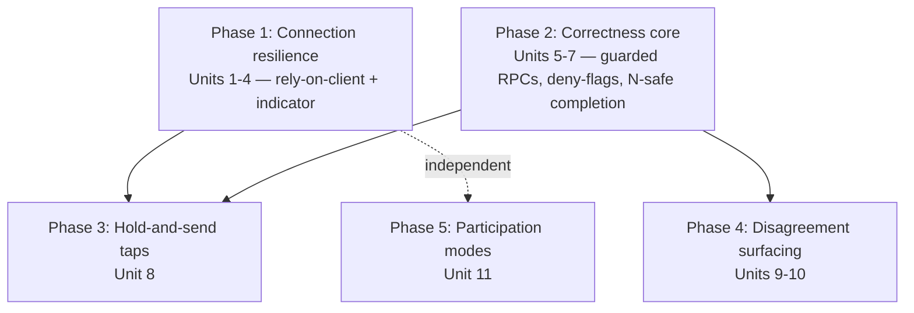
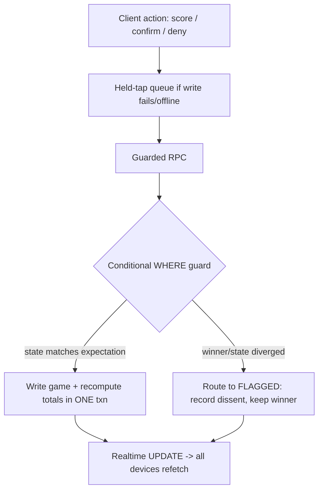

# feat: Robust Multi-Device Live Scoring — Connection Resilience + Concurrency Correctness

## Overview

Harden live match scoring so 30+ co-located phones can score a match over flaky pool-hall wifi without anyone resorting to paper or manually refreshing, and so concurrent actions can never lose a score, silently overwrite a winner, or finalize a wrong total. The work splits into a **connection-resilience** half (detect/recover from drops, hold taps, stay in sync) and a **concurrency-correctness** half (race-safe writes, deny-flags-not-wipes, N-device-safe completion). North star carried from the origin doc: *invisible robustness* — it just works and looks like nothing is ever wrong; the app only interrupts a human when one must decide, and even then calmly (smoke-detector, not judge).

A key research finding shrinks the work: **the Supabase JS client already reconnects the socket and auto-rejoins channels with backoff** — so we lean on the client and build only a thin catch-up/indicator/fallback layer, not a reconnect engine. On the write side, the existing **`prep_match` RPC** (conditional `WHERE` guards + `ON CONFLICT DO NOTHING` + unique constraint) is the exact model to extend for race-safe scoring writes.

## Problem Frame

Live scoring is the most-used, most load-bearing feature (see origin: `docs/brainstorms/2026-05-24-live-scoring-resilience-requirements.md`). Today:
- A device can silently fall out of sync after a drop until a manual refresh; `useMatchRealtime` logs connection status but takes no action, and there is no scoring-data polling fallback or indicator.
- The scoring write path (`confirmOpponentScore`, `denyOpponentScore`, `handleConfirmScore`, `updateMatchRunningTotals`) is bare client `.update().eq('id', …)` — last-writer-wins, no conditional guards. A winner can be silently overwritten; concurrent totals recompute can persist a wrong number to match-end.
- A "deny" **wipes** the game today; the design requires it to **flag** instead.
- Completion is 2-team-safe (`MatchEndVerification` first-verifier), not N-device-safe.

## Requirements Trace

Carried from the origin requirements doc (R1–R21). This plan satisfies:

- R1. Detect realtime-down vs server-unreachable → Unit 3
- R2. Keep scoring + stay in sync via polling when realtime-only is down → Units 2, 3
- R3. Hold a tap during a drop, auto-send on reconnect, "saving→saved" → Unit 8
- R4. Self-recover with no manual refresh → Units 1, 2
- R5. Subscription survives teardown→re-setup; StrictMode double-mount stops breaking the handshake → Unit 2
- R6. As-invisible-as-possible status; calm note only on sustained outage → Unit 4
- R7. Official the instant one-per-side confirms → Unit 6 (preserve existing rule)
- R8. Never silently overwrite a winner → Unit 6
- R9. Record who-said-what **only on a disagreement** (full many-eyes deferred to Layer 2) → Units 5, 6, 9
- R10. Disagreement → not-settled + visibly flagged → Units 6, 9
- R11. Alert the whole scoring group on the affected team; show the split → Unit 9
- R12. Humans resolve; a single dissent never wipes input → Units 6, 9
- R13. Captain final-say when present (no delegation chain) → Unit 10
- R14. Settled-game changes reuse vacate-and-rescore → preserved (Units 6, 9 do not add a second undo)
- R15. Deny wins any race within an unsettled game → Unit 6
- R16. Totals always correct; race-safe recompute → Units 6, 7
- R17. N-device-safe completion, exactly once, no error noise → Unit 7
- R18. Preserve pre-created-rows + recompute-from-confirmed + two-path audit, **extended so the counting filter excludes flagged games** → Units 5, 6, 7 (constraint; see System-Wide Impact "Flag blast-radius")
- R19. Sticky "I'm not scoring" + auto-confirm modes → Unit 11
- R20. A popup is dismissable with no effect → Unit 11 (preserve existing queue behavior)
- R21. Asymmetric mode lifetimes (auto-confirm clears on background/leave; "not scoring" survives, match-scoped) → Unit 11

## Scope Boundaries

- **Full "many-eyes" layer** (record *every* confirmer when all agree, a "3 confirmed" count, standing audit trail) — deferred to a Layer-2 follow-up. This plan records who-said-what *only* to surface a disagreement.
- **Full offline scoring** of a whole match (per-phone local records + LO reconciliation) — separate future brainstorm.
- **Auth / RLS** — separate pre-launch pass (RLS intentionally off today; do not add policies here).
- **Rewriting `useMatchRealtime`** — extend it, do not rewrite (its churn-hardening is load-bearing).
- **A StrictMode on/off test toggle** — testing chore, not built here.
- **Rejected as fragility:** pause-to-gather-deciders, clear-and-revote loops, a second undo system, app-side auto-adjudication, and an authority-delegation chain for an absent captain.

### Deferred to Separate Tasks

- The Layer-2 many-eyes confidence/audit layer: a future plan, once Layer-1 is stable.
- **RLS / authz pass (pre-production) — notes for the new write surface:** when RLS is turned on, the scoring writes and completion need caller-authz that this plan intentionally omits (RLS is off in staging — no real users/data, and RLS has historically failed silently and eaten debugging hours). At that pass: derive the actor from `auth.uid()` and verify they are a participant on the match / on the side they act for (pattern: `set_match_lineup_rating`, **not** `prep_match`); the captain-resolve path must verify the caller is the team captain **server-side** (not just hide the UI); if any of these writes are promoted to `SECURITY DEFINER` RPCs at that point, the migration must `REVOKE EXECUTE … FROM anon, PUBLIC`. Until then, staging trusts the client.

## Context & Research

### Relevant Code and Patterns

- **Race-safe write model:** `supabase/migrations/20260504000000_harden_prep_match_write_guards.sql` — `SECURITY DEFINER` PL/pgSQL, conditional `WHERE … status='scheduled'`, `IF FOUND` gating, `INSERT … ON CONFLICT (match_id, game_number) DO NOTHING`. Unique constraint `match_games_match_id_game_number_key` in `supabase/migrations/20251130010824_baseline.sql`. **This is the template for Units 6 and 7.**
- **Client conditional-write precedent:** `populateMatchSnapshotIfNeeded` in `src/api/queries/matches.ts` — `.update(...).eq('id', …).is('system_snapshot', null)` (write-if-still-null). Lighter-weight "never overwrite" pattern.
- **Realtime hook:** `src/realtime/useMatchRealtime.ts` — single `match_${matchId}` channel, deps `[matchId]` only, callbacks in refs (churn-hardened). `.subscribe((status, err) => …)` is currently log-only — the lift point for Unit 2.
- **Polling precedent:** `src/api/hooks/useMatchPhase.ts` `computePhaseRefetchInterval` (function-form `refetchInterval`, returns interval only while `status='scheduled'`) + `src/components/match/MatchPhaseGuard.tsx` ("Defense 7"). Template for Unit 3; note it stops at `in_progress`, so an in-progress scoring poll is net-new.
- **Scoring writes:** `src/hooks/useMatchScoringMutations.ts` (`handleConfirmScore`, `confirmOpponentScore`, `denyOpponentScore`); totals `updateMatchRunningTotals` + reference auditor `auditMatchScoringConsistency` in `src/api/queries/matches.ts`; both-confirmed counting filter in `src/types/match.ts` (`getTeamStats`/`getPlayerStats`/`getCompletedGamesCount`).
- **Completion guard:** `src/components/scoring/MatchEndVerification.tsx` (first-verifier + item-15 status guard).
- **Persistence:** `src/hooks/useLocalStorage.ts` (template for sticky modes). `autoConfirm` is plain `useState(false)` in `src/player/ScoreMatch.tsx`. **No `sessionStorage` hook, and zero use of `visibilitychange`/`document.hidden`/`navigator.onLine`/focus-blur anywhere — all net-new.**
- **Toasts:** `sonner` via `src/components/ui/sonner.tsx`; only one-shot `toast.success/error/info` used today. `toast.loading`→update (for "saving→saved") is available but unused.
- **Confirmation queue:** `src/hooks/useMatchScoring.ts` (`confirmationQueue`, `addToConfirmationQueue`, dedupe by `gameNumber`); drained in `src/player/ScoreMatch.tsx`.

### Institutional Learnings

- **`project_match_realtime_resilience_gap`** (user memory): the hook is hardened vs churn — recurring CLOSED/TIMED_OUT loops are usually the local Supabase container, not app code. Extend, don't rewrite.
- **"Seven Defenses"** — `docs/plans/2026-05-04-001-fix-lineup-to-scoring-transition-stability-plan.md`: Defense 5 (use `STALE_TIME.MATCH_LIVE`/`staleTime:0` for live reads; invalidate with the *exact* query key — a partial key was a silent no-op for 6 months), Defense 6 (guard *all* RPC writes with `WHERE`, not just the status column, for idempotency), Defense 7 (polling backstop), Defense 2 (compound `key` remount to reset poisoned component state — relevant to R5).
- **Lineup race-condition fix** — `docs/plans/2026-04-24-001-fix-lineup-race-condition-plan.md`: `ON CONFLICT DO NOTHING` + unique constraint to let Postgres serialize concurrent writers (the held-tap/completion idempotency model).
- **Two-path audit must stay** (`feedback_two_paths_audit_pattern`): keep `auditMatchScoringConsistency` as the reference recompute; do not "consolidate to one source of truth."
- **Supabase container restart on realtime-table schema changes** (`feedback_new_edge_functions_need_supabase_restart`): adding columns to `match_games` may cause WebSocket close-loops locally until `supabase stop && supabase start`.

### External References

- Supabase Realtime (supabase-js 2.57.4 / realtime-js 2.15.5):
  - Client auto-reconnects the socket (`RECONNECT_INTERVALS = [1000,2000,5000,10000]`) and per-channel auto-rejoins. **Do not tear down/recreate channels on transient errors.** Realtime does **not** replay missed rows → the app must **catch up via refetch on re-`SUBSCRIBED`**.
  - `REALTIME_SUBSCRIBE_STATES` enum: `SUBSCRIBED | CHANNEL_ERROR | TIMED_OUT | CLOSED`. A drop fires multiple callbacks → **debounce**. `CHANNEL_ERROR` with a "mismatch between server and client bindings" message is terminal (config/publication bug), not transient.
  - Background-tab survival: `createClient({ realtime: { worker: true, heartbeatCallback } })` runs the 25s heartbeat in a Web Worker (not throttled when backgrounded); `supabase.realtime.onHeartbeat(status)` reports `'disconnected'|'timeout'` → call `supabase.realtime.connect()`.
  - Socket health: `supabase.realtime.connectionState()` / `isConnected()`. Realtime health is independent of PostgREST reachability — classify "realtime-down vs offline" with one cheap HTTP probe fired only when realtime reports trouble.
  - Page lifecycle: use the **Page Visibility API** (`visibilitychange` + `document.visibilityState`), not focus/blur. `pagehide` (not `unload`/`beforeunload`, which break bfcache) for best-effort teardown; `pageshow`/return-to-visible as the reliable reconnect+resync action point. **iOS Safari often fires no teardown events** → make *return-to-visible* the action point, teardown best-effort.
- `navigator.onLine` is a hint only (false negatives/positives); use to short-circuit, corroborate "online" with a real request.

## Key Technical Decisions

- **Rely on the Supabase client for reconnect + auto-rejoin; build only the thin catch-up layer.** Rationale: the client already does backoff reconnect and channel rejoin; the real gap is that missed rows aren't replayed. Catch-up-refetch-on-re-`SUBSCRIBED` is the highest-value, smallest change.
- **Serialize the scoring writes with lightweight conditional-`WHERE` guards; games-won race-safety via a DB trigger (DECIDED: leaner).** The sacred write path must be race-safe and never-overwrite; conditional guards (`.is(null)`/`.eq(expected)`, the `populateMatchSnapshotIfNeeded` precedent) plus a games-won trigger deliver that without a `SECURITY DEFINER` RPC layer. Caller-authz is deferred to the dedicated pre-production RLS pass (RLS is deliberately off in staging because it fails silently and eats debugging hours; no real users/data yet) — see "RLS / authz pass" under Deferred to Separate Tasks.
- **Totals: games-won is the only number that goes race-safe server-side; points stay a JS recompute (review).** Games-won is the sacred number and a trivial server-side count. Points totals **cannot** move into SQL — `computeMatchRunningTotals` dispatches to a TypeScript points-calculator registry (`getCalculator`, per-calculator `compute`), so porting it to PL/pgSQL would mean reimplementing the calculator system and maintaining two copies. Points are derived/recoverable and stay a JS recompute cross-checked by the two-path audit, so a brief points lag self-heals while games-won is always correct. This keeps R16's "always correct" honest where it matters most.
- **Deny flags, never wipes.** Behavior change from today's reset. The game holds its picked winner + records the dissent, enters a not-settled state, and surfaces the split; resolution is human.
- **Completion via a conditional-guarded `UPDATE`** (status-guarded; first device wins, losers match zero rows) so exactly one completion happens regardless of device count, with no `409` noise; both the Verify action and the finalize write are blocked while any game is flagged.
- **Held taps carry the game-state token they were based on** and are rejected/re-routed by the same conditional guards if state changed while held — never a blind write by id.
- **Participation modes use `useLocalStorage`/`sessionStorage` + Page Visibility, with an asymmetric, fail-safe lifetime.** Auto-confirm (dangerous: acts for you) clears aggressively on background/navigate-away and clears when uncertain; "I'm not scoring" (harmless: only hides your popups) is match-scoped and survives refresh+background.
- **`worker: true` heartbeat** so backgrounded phones don't silently drop.
- **Preserve the two-path audit** (`auditMatchScoringConsistency`); the both-confirmed counting filter is preserved but **extended to exclude flagged games** (review P0).

## Open Questions

### Resolved During Planning

- *Build vs rely on client for reconnect?* → Rely on the client; build catch-up/indicator/fallback only (research-grounded).
- *How to make writes race-safe?* → Lightweight conditional-`WHERE` guards on the writes + a DB trigger for games-won (leaner than a full RPC layer); authz deferred to the RLS pass. (Decided with Ed.)
- *Deny behavior?* → Flag, not wipe (origin decision R10–R12).
- *Detect realtime-down vs offline?* → realtime signals (`isConnected`/`onHeartbeat`) trigger a single cheap PostgREST probe to classify (research-grounded).

### Deferred to Implementation

- Exact storage shape for the not-settled flag + minimal who-said-what (a `match_games` boolean/state column + a small `jsonb` dissent record vs dedicated columns) — decide against the real schema; keep minimal (Layer-1).
- Staleness token for held taps (`updated_at` guard vs a new version column vs guarding on expected `winner_player_id`).
- Games-won recompute is a DB trigger (decided); confirm it reads confirmed-and-not-flagged rows and matches the existing count semantics. Points recompute stays in JS (`computeMatchRunningTotals`), now excluding flagged games.
- R21 reload-vs-background disambiguation (browser events can't cleanly separate them, esp. iOS) — safe default: **when uncertain, clear auto-confirm** (fail-safe; the scorer re-taps). Exact event wiring deferred.
- Polling cadence for the in-progress fallback, the reachability-probe query, and the "sustained outage" threshold for the calm note — tune during implementation.
- The cheapest reachability probe (HEAD to REST base vs `select … limit 1` on a tiny table vs a constant-returning RPC).
- **Commit a DB-test serialization mechanism in Unit 5, before any write-test is authored (review).** The actual `vitest.config.ts` is a single happy-dom project — the unit/db split described in CLAUDE.md does **not** exist, so there is no sequential db runner today (fix that CLAUDE.md section as housekeeping). Without serialization, the concurrency tests for Units 6–7 will race each other on the shared local DB and flake. Pick one: a dedicated db project/workspace with `singleThread`/`fileParallelism:false`, a `--no-file-parallelism` script for the db suite, or per-file match-id/schema isolation. Place DB tests under `src/__tests__/database/` with the `*.db.test.ts` + env-override + `src/test/dbTestUtils.ts` (`pg.Pool`) convention.
- **No-opposing-confirmer / silence path (review — 4 reviewers).** A game where the other side never responds (all dismissed / all "I'm not scoring" / short-handed) is never official and never flagged, so it must not silently count AND must not soft-deadlock completion. Define a visible "waiting for the other team" state, make it resolvable by captain-resolve (Unit 10) or vacate, and ensure "all games done" / the completion gate treat it as non-terminal-but-resolvable. Sticky "I'm not scoring" (Unit 11) makes this more likely, not less.
- **Held-tap staleness token decided in Unit 5/6, not Unit 8 (review).** The token the guards check (`updated_at` vs a new version column vs expected `winner_player_id`) must land in Unit 5's migration and Unit 6's RPC/guard signatures, since Unit 8 depends on it. Note: expected-`winner_player_id` only catches winner changes, not confirm/deny/vacate transitions — pick accordingly. Also store the actor member id with each held action and discard on identity drift (different signed-in user at flush time).
- **Completion winner is client-derived (review).** The winner/result/status is computed client-side (points tiebreak + Win Calculator); the completion write (RPC or guarded update) must accept it as a parameter and reconcile it against the "no flagged games" gate — a held/stale device must not finalize a winner derived before a game was flagged.
- **Write-path architecture — DECIDED (leaner):** lightweight client conditional-`WHERE` guards for never-overwrite + deny-flag, plus a DB trigger for games-won race-safety. No `SECURITY DEFINER`/authz layer now (RLS deliberately off in staging). Authz captured under "RLS / authz pass" in Deferred to Separate Tasks.

## High-Level Technical Design

> *This illustrates the intended approach and is directional guidance for review, not implementation specification. The implementing agent should treat it as context, not code to reproduce.*

**Phase dependencies (each phase is independently shippable; Phase 1 ships first — highest value, zero write-path risk):**



**Scoring write path, after Phase 2 (directional):**



The guard is the single chokepoint that delivers R8 (no silent overwrite), R10/R15 (deny/disagreement flags), and R16 (atomic totals) together.

## Implementation Units

### Phase 1 — Connection Resilience (no write-path risk; ship first)

- [ ] **Unit 1: Realtime client survival config**

**Goal:** Keep the realtime socket alive when a phone is backgrounded and force a reconnect when the heartbeat reports it died.

**Requirements:** R4

**Dependencies:** None

**Files:**
- Modify: `src/supabaseClient.ts`
- Test: `src/supabaseClient.test.ts`

**Approach:**
- Pass `realtime: { worker: true, heartbeatCallback }` to `createClient`. `worker: true` runs the 25s heartbeat in a Web Worker so background-tab timer throttling can't silently starve it.
- In `heartbeatCallback`, on `'disconnected'`/`'timeout'`, call `supabase.realtime.connect()` (idempotent) to force re-establish.

**Patterns to follow:** existing `createClient` setup in `src/supabaseClient.ts`.

**Test scenarios:**
- Happy path: client is created with `worker: true` and a `heartbeatCallback` registered.
- Error path: heartbeat callback invoked with `'disconnected'` → triggers a `realtime.connect()` call (spy/mock).
- Edge case: heartbeat `'ok'` → no reconnect attempt.

**Verification:** A backgrounded tab (or simulated hidden state) keeps its subscription; on a forced socket drop the client re-establishes without a manual refresh.

- [ ] **Unit 2: Expose connection status + catch-up refetch on re-subscribe**

**Goal:** Turn `useMatchRealtime`'s log-only status callback into (a) a surfaced connection status and (b) a full catch-up refetch whenever the channel re-subscribes after a drop. Confirm the handshake survives StrictMode double-mount.

**Requirements:** R2, R4, R5

**Dependencies:** Unit 1

**Files:**
- Modify: `src/realtime/useMatchRealtime.ts`
- Modify: `src/hooks/useMatchScoring.ts` (surface status to the scoring screen)
- Test: `src/realtime/useMatchRealtime.test.ts`

**Approach:**
- Use the `REALTIME_SUBSCRIBE_STATES` enum (imported from `@supabase/supabase-js`) in the `.subscribe` callback. Map to a small status: `live | reconnecting | error`. **Debounce** (a drop fires `CHANNEL_ERROR`→`CLOSED`→`TIMED_OUT`).
- Track whether a `SUBSCRIBED` is the *first* subscribe or a *re*-subscribe; on re-subscribe, call the existing `onMatchUpdate`/`onLineupUpdate`/`onGamesUpdate` refetch callbacks to close the missed-rows gap (realtime does not replay).
- Special-case the binding-mismatch `CHANNEL_ERROR` as a non-transient/error status (don't spin retries).
- Keep the `[matchId]`-only effect deps and ref pattern intact (do not rewrite the hook).

**Execution note:** Add a characterization test of the current subscribe/teardown behavior before changing it; verify StrictMode double-mount (dev) leaves a working handshake.

**Patterns to follow:** existing ref/callback structure in `src/realtime/useMatchRealtime.ts`; status-derivation style from `MatchPhaseGuard`.

**Test scenarios:**
- Happy path: first `SUBSCRIBED` → status `live`, no extra refetch.
- Integration: `CHANNEL_ERROR`→`CLOSED`→`SUBSCRIBED` sequence → status returns to `live` AND a catch-up refetch fires exactly once (debounced).
- Edge case: rapid duplicate `CLOSED` callbacks → only one reconnect/refetch scheduled.
- Error path: binding-mismatch `CHANNEL_ERROR` → status `error`, no retry storm.
- Integration (R5): mount→unmount→remount (StrictMode double-invoke) → channel cleanly removed and re-subscribed; confirm queue/handshake still functions.

**Verification:** After a simulated drop+restore, the scoreboard reflects writes that happened during the outage with no manual refresh; StrictMode dev mode no longer breaks the propose/confirm handshake.

- [ ] **Unit 3: Failure classification + in-progress polling fallback**

**Goal:** When realtime is unhealthy, classify realtime-down vs offline and keep data fresh via a polling fallback that runs *only while degraded*.

**Requirements:** R1, R2

**Dependencies:** Unit 2

**Files:**
- Create: `src/realtime/useConnectionHealth.ts`
- Modify: `src/api/hooks/useMatchPhase.ts` or the live match query hook (add function-form `refetchInterval` gated on degraded status)
- Test: `src/realtime/useConnectionHealth.test.ts`

**Approach:**
- Derive health from `supabase.realtime.isConnected()`/`connectionState()` + the Unit 2 status. When realtime reports trouble, fire **one** cheap PostgREST probe (deferred: exact query) to classify: realtime-down-but-reachable vs offline; corroborate offline with `navigator.onLine`.
- While degraded, enable a function-form `refetchInterval` (modeled on `computePhaseRefetchInterval`) for match detail + games so scoring stays in sync without realtime. Disable polling when `live` returns.
- Do not poll a health endpoint on a timer — realtime signals are the trigger.

**Patterns to follow:** `computePhaseRefetchInterval` in `src/api/hooks/useMatchPhase.ts`; `STALE_TIME.MATCH_LIVE` from `src/api/client.ts`.

**Test scenarios:**
- Happy path: realtime `live` → health `live`, no polling, no probe.
- Integration: realtime trouble + probe succeeds → health `realtime-down`, polling enabled.
- Integration: realtime trouble + probe fails (and/or `navigator.onLine` false) → health `offline`, polling paused/handled.
- Edge case: health returns to `live` → polling disabled (no leftover interval).

**Verification:** With realtime forced down but the server reachable, scoring continues and the board updates via polling; when realtime returns, polling stops.

- [ ] **Unit 4: Calm connection indicator**

**Goal:** Show the least-alarming feedback that satisfies "looks like nothing is wrong": a subtle indicator for the active scorer; a single calm note only on a sustained outage; watchers see nothing alarming.

**Requirements:** R6

**Dependencies:** Units 2, 3

**Files:**
- Create: `src/components/match/ConnectionIndicator.tsx`
- Modify: `src/player/ScoreMatch.tsx` (mount the indicator for the active scorer)
- Test: `src/components/match/ConnectionIndicator.test.tsx`

**Approach:**
- `live` → no indicator (or an unobtrusive dot). `reconnecting`/`realtime-down` → a quiet "catching up…" pill. `offline` sustained beyond a threshold (deferred) → one calm note for the person trying to score.
- Watchers (non-active devices) never see alarms; the board just quietly catches up.

**Patterns to follow:** layout precedent `src/components/EnvironmentBanner.tsx`; styling reference `MatchTransitionRecovery`. Use `sonner` only for the sustained-outage calm note if a toast fits better than an inline pill.

**Test scenarios:**
- Happy path: status `live` → no alarming UI rendered.
- Edge case: status `reconnecting` → quiet pill shown, not a red banner.
- Edge case: `offline` below threshold → still no scary note; beyond threshold → single calm note.

**Verification:** During a brief drop the screen stays calm; only a prolonged real outage shows one composed message.

### Phase 2 — Correctness Core (server-side; high-risk; characterization-first)

- [ ] **Unit 5: Schema + characterization tests for the scoring write path**

**Goal:** Add the minimal schema to represent a not-settled (flagged) game plus who-said-what on a disagreement, and lock current confirm/deny/score/totals/completion behavior with characterization tests before changing it.

**Requirements:** R8, R10, R16, R18

**Dependencies:** None (can run parallel to Phase 1)

**Files:**
- Create: `supabase/migrations/<ts>_add_game_dispute_state.sql`
- Create: `src/__tests__/database/scoringWritePath.characterization.db.test.ts`
- Modify: `src/types/match.ts` (types for the new state; also fix the `confirmed_by_*` boolean-vs-string type mismatch noted in research)

**Approach:**
- Add a minimal not-settled marker to `match_games` (e.g., a state/flag column) and a minimal dissent record (small `jsonb` or columns) — used *only* when flagged (Layer-1; not the full multi-confirmer shape).
- Characterize today's behavior: deny wipes; totals recompute is last-writer-wins; completion is first-verifier. These tests are the safety net for Units 6–7.
- Schema change is on a realtime-published table → expect a local `supabase stop && supabase start` (see learnings).

**Execution note:** Characterization-first — capture current behavior as passing tests before any behavior change.

**Patterns to follow:** `supabase/migrations/20251130010824_baseline.sql` (constraints); `src/__tests__/database/ratingMutationAtomicity.db.test.ts` (db-test harness via `src/test/dbTestUtils.ts`).

**Test scenarios:**
- Characterization (Happy path): both sides confirm same winner → game counts; totals reflect it.
- Characterization (current deny): deny → game returns to unscored (documents the behavior Unit 6 will change).
- Characterization (totals): two confirmed games → totals equal the recompute-from-confirmed result.
- Edge case: migration applies cleanly; new column defaults leave existing rows in the normal (non-flagged) state.

**Verification:** Migration applies; characterization suite passes against the current code and pins the behaviors Units 6–7 must preserve or deliberately change.

- [ ] **Unit 6: Guarded scoring writes (score / confirm / deny) + games-won trigger**

**Goal:** Add conditional-`WHERE` guards to the three game writes so a winner is never silently overwritten, a disagreement **flags** (deny no longer wipes), and a deny wins any race; keep **games-won** race-safe via a DB trigger. **Leaner approach (per decision):** no `SECURITY DEFINER`/authz layer now — caller-authz is deferred to the dedicated RLS pass (RLS is deliberately off in staging). See Open Questions "RLS-pass notes."

**Requirements:** R7, R8, R9 (minimal), R10, R12, R15, R16, R18

**Dependencies:** Unit 5

**Files:**
- Create: `supabase/migrations/<ts>_games_won_recompute_trigger.sql` (trigger recomputes `home_games_won`/`away_games_won` from confirmed, non-flagged rows on any `match_games` change — atomic, no client race; the sacred count only)
- Modify: `src/hooks/useMatchScoringMutations.ts` (replace bare `.update().eq('id')` with conditional-guarded updates: `.is(null)` / `.eq(expected winner)` guards; on a 0-row result set the flag + record dissent instead of overwriting/wiping)
- Modify: `src/api/queries/matches.ts` (points recompute stays JS — exclude flagged games; keep `auditMatchScoringConsistency` as the reference auditor)
- Modify (flag exclusion — see System-Wide Impact): `src/utils/match/computeMatchRunningTotals.ts`, `src/utils/match/fargoMatchTotals.ts`, `src/types/match.ts` (`getTeamStats`/`getPlayerStats`/`getCompletedGamesCount`), `src/hooks/useSpectateMatch.ts`
- Test: `src/__tests__/database/scoringWriteGuards.db.test.ts`

**Approach:**
- **Score (propose):** guarded `.update(...)` that sets winner + scorer-side confirm only `WHERE` the winner is null-or-equal AND not flagged; if 0 rows changed, a different winner already exists → set the flag + record dissent (never overwrite).
- **Confirm:** set this side's confirm only `WHERE` the recorded winner matches the confirmer's implied winner; on mismatch → set the flag + record dissent. A clean confirm completing one-per-side counts (preserve R7).
- **Deny:** set the flag + record dissent (who + their claimed winner); keep the winner. Deny wins races because once flagged, the confirm guard won't count the row (deny → flagged → never clean-official, R15).
- **Games-won** stays correct via the trigger (recompute from confirmed, non-flagged rows). **Points** recompute in JS as today, now excluding flagged games, cross-checked by the two-path audit (a brief points lag self-heals; games-won is always correct).

**Execution note:** Characterization-first (Unit 5 net) — including a concurrent-writer baseline that documents today's last-writer-wins overwrite as the known-bad behavior Unit 6 must flip — then change deny behavior and add guards.

**Technical design:** *(directional, not implementation)*

```
-- score (client, guarded update):
--   .update({ winner, confirmed_by_<side>: memberId })
--   .eq('id', gameId)
--   .or('winner_player_id.is.null,winner_player_id.eq.<proposed>')   -- never overwrite a different winner
--   .eq('is_flagged', false)
--   -> if 0 rows returned: a conflicting winner exists -> second call sets is_flagged + dissent record.
-- games-won trigger (DB): AFTER INSERT/UPDATE/DELETE ON match_games
--   -> recompute home/away_games_won from rows where confirmed both sides AND NOT is_flagged.
```

**Patterns to follow:** `populateMatchSnapshotIfNeeded` `.is(null)` conditional-write guard (`src/api/queries/matches.ts`); `prep_match` `WHERE`-guard idea (`supabase/migrations/20260504000000_harden_prep_match_write_guards.sql`); existing trigger style in `supabase/migrations/`.

**Test scenarios:**
- Happy path: one-per-side confirm same winner → counts; totals correct.
- Error/Integration (R8): two devices score the same game with different winners (concurrent) → no silent overwrite; game ends flagged with both picks recorded; sacred count unaffected.
- Integration (R10/R12): deny → game flagged, winner + dissent retained, NOT wiped; totals exclude the flagged game; nothing destroyed.
- Edge case (R15): simultaneous confirm + deny on one unsettled game → lands flagged (deny wins), never clean-official.
- Integration (R16): N concurrent confirms on different games (driven via `pg.Pool`) → final totals equal the recompute-from-confirmed result, no last-writer-wins drift.
- Integration (R18): both-confirmed counting filter still yields the same official-game set; `auditMatchScoringConsistency` reports no divergence.

**Verification:** Concurrency tests pass under parallel writers; deny flags instead of wiping; totals never settle on a stale value; the reference auditor agrees with the live totals.

- [ ] **Unit 7: N-device-safe completion (guarded conditional write)**

**Goal:** Replace the client first-verifier write with a conditional-guarded `UPDATE` so exactly one completion happens no matter how many devices fire, with no error noise — and block the **Verify action** (not just the final write) while any game is flagged, so the match can't stall in a "completing…" limbo. Leaner approach: a guarded conditional update, not a new RPC; no authz now (RLS pass).

**Requirements:** R16, R17 (and the completion-gate edge case)

**Dependencies:** Unit 6

**Files:**
- Modify: `src/components/scoring/MatchEndVerification.tsx` (guarded conditional completion update; disable/explain the Verify action while any game is flagged; keep all-games-done detection + navigation)
- Modify (if a guard column/constraint helps): `supabase/migrations/<ts>_completion_guard.sql` (optional — only if a status/`completed_at` guard column is needed beyond the conditional `WHERE`)
- Test: `src/__tests__/database/completion.db.test.ts`

**Approach:**
- Finalize via a conditional update: `.update({ status:'completed', result, … }).eq('id', matchId).eq('status','in_progress')`. The first device's update matches one row and wins; concurrent losers match **zero** rows → silent no-op, no `409` noise. Idempotent on re-call (already `completed` → 0 rows).
- The winner/`result`/target status is computed **client-side** (points tiebreak + Win Calculator) and passed into the update; reconcile it against the gate so a held/stale device can't finalize a winner derived before a game was flagged.
- **"All games done" = every game official AND not flagged.** Gate the Verify action while any game is flagged (tell the team "resolve game N first") rather than letting both teams verify and then silently stalling.

**Patterns to follow:** `populateMatchSnapshotIfNeeded` conditional-update guard; existing `MatchEndVerification` flow and item-15 status guard (`if status === 'completed' return`).

**Test scenarios:**
- Happy path: all games official → single device completes; status `completed`, totals frozen correct.
- Integration (R17): multiple same-team devices finalize simultaneously → exactly one completion, others no-op, no `409`/error noise.
- Edge case (completion gate): a game is flagged → Verify is disabled/explained AND the finalize update is a no-op until resolved (no "completing…" stall).
- Edge case: re-call after completion → idempotent no-op.

**Verification:** Parallel completion attempts yield one completion and clean logs; a flagged game blocks both Verify and finalize until resolved.

### Phase 3 — Hold-and-Send Taps

- [ ] **Unit 8: Held-and-send tap queue**

**Goal:** Never lose a tap to a wifi blip — hold the action on-device, auto-send on reconnect, show "saving→saved", and reject a stale held action via the Unit 6 guards.

**Requirements:** R3

**Dependencies:** Units 2, 6

**Files:**
- Create: `src/hooks/useHeldActions.ts`
- Modify: `src/hooks/useMatchScoringMutations.ts` (enqueue on write failure/offline; flush on reconnect/visible)
- Test: `src/hooks/useHeldActions.test.ts`

**Approach:**
- On a failed/offline scoring write, persist the action to `sessionStorage` with the game-state token it was based on (deferred: token choice). Flush on `live`/return-to-visible.
- Each held action is replayed through the Unit 6 conditional guards, so a held tap that no longer matches current state is rejected/re-routed (never a blind overwrite). **De-dupe across the three paths that can fire together on reconnect** — the held-action replay, the catch-up refetch (Unit 2), and realtime-driven auto-confirm (Unit 11) can otherwise act on the same game at once: key idempotency on (game, side, expected-winner), and store the actor member id so a different signed-in user at flush time is discarded (review).
- "saving…" via `toast.loading`, updated to "saved" by id on success (sonner supports this; unused today).

**Patterns to follow:** `useLocalStorage` structure (for the `sessionStorage` variant); the confirmation-queue dedupe pattern in `useMatchScoring.ts`.

**Test scenarios:**
- Happy path: offline tap → queued + "saving…"; on reconnect → sent, "saved", queue cleared.
- Edge case: same tap fired twice (scorer unsure) → de-duped, single write.
- Integration (staleness): held tap for a game that was vacated/rescored while held → guard rejects/re-routes; no wrong winner written.
- Error path: replay fails server-side → action stays queued and is retried, not silently dropped.

**Verification:** A tap made during a forced drop appears on the board after reconnect with no duplicate; a stale held tap never corrupts a settled game.

### Phase 4 — Disagreement Surfacing

- [ ] **Unit 9: Flagged-game UI + whole-team alert + split**

**Goal:** Make a disagreement impossible to miss for the right people and trivial to resolve in person, without alarming everyone else.

**Requirements:** R10, R11, R12

**Dependencies:** Unit 6

**Files:**
- Modify: the live scoreboard component(s) under `src/components/scoring/` (render the flagged state on the game row for all devices)
- Modify: `src/player/ScoreMatch.tsx` / `src/hooks/useMatchScoring.ts` (alert everyone who scored for the affected team; show the split)
- Create: `src/components/scoring/DisagreementAlert.tsx`
- Test: `src/components/scoring/DisagreementAlert.test.tsx`

**Approach:**
- A flagged game shows a new fifth row state, distinct from the existing ones (unscored / pending-yellow / vacate-red / confirmed-green). **Per viewer:** the flagging team sees the split + a resolve affordance; the opposing team and non-scoring watchers see a calm neutral "pending resolution" marker (no split, no alarm).
- The disagreement alert is a **persistent inline element, not an auto-dismissing toast** — the dispute must stay visible until resolved. It's shown to everyone who scored for the affected team, with the split ("Sarah said John, Mike said Jack"). The dissenter can switch to agree (flag clears via the confirm guard) or the result is redone via the existing vacate-and-rescore (no new undo path).
- **The realtime handler must learn the flag** (also modify `src/realtime/useMatchRealtime.ts`): on a flagged-row update, route to the disagreement path and skip the normal confirm-popup branch.

**Patterns to follow:** confirmation-queue/dialog flow in `ScoreMatch.tsx`; `sonner` for the alert if a toast fits; existing scoreboard row rendering.

**Test scenarios:**
- Happy path: game flagged → board shows the not-settled state on every device.
- Integration (R11): disagreement → everyone who scored for that team gets the alert with the correct names/picks; other devices stay calm.
- Integration (R12): dissenter switches to agree → flag clears, game counts; no input was wiped.
- Edge case: a flagged game is resolved via vacate-and-rescore → returns to the normal flow (no second undo mechanism introduced).

**Verification:** A forced disagreement lights up the right phones with the split and clears cleanly when the table agrees.

- [ ] **Unit 10: Captain final-say (when present)**

**Goal:** Give the captain a final-say action on a flagged game when they're present, as an additive backstop — with no delegation machinery when absent.

**Requirements:** R13

**Dependencies:** Units 6, 9

**Files:**
- Modify: `src/components/scoring/DisagreementAlert.tsx` (captain-only resolve action)
- Modify: `src/api/mutations/scoringMutations.ts` (a captain-resolve path that settles the flagged game to a chosen winner)
- Test: `src/components/scoring/DisagreementAlert.test.tsx`

**Approach:**
- When the viewer is the team captain (`captain_id` on the match — verified present), a flagged game offers a "captain decides" resolve that settles it to the captain's chosen winner.
- No authority-delegation chain when the captain is absent — the in-person agreement path (Unit 9) remains the resolution; the captain action simply isn't shown.
- **Visually distinct from a normal resolve:** the captain action sits below a divider labeled "Captain override" and requires the captain to pick the imposed winner (from the two proposed), not a single ambiguous "captain decides" tap — so an accidental tap can't impose a result.
- Authz note: the captain check is client-side/UI for now; server-side captain verification is deferred to the RLS pass (see Deferred to Separate Tasks).

**Patterns to follow:** captain checks via `captain_id` from `src/types/match.ts`; the Unit 6 conditional settle path.

**Test scenarios:**
- Happy path: captain present on a flagged game → captain-resolve settles it to the chosen winner; counts.
- Edge case: non-captain on a flagged game → no captain action shown; normal resolution only.
- Edge case: captain absent/offline → no captain action; game stays flagged for in-person resolution (no error, no deadlock-handling code path).

**Verification:** A captain can break a stalemate when present; nothing breaks or blocks when no captain is around.

### Phase 5 — Participation Modes

- [ ] **Unit 11: Sticky participation modes + asymmetric lifetimes**

**Goal:** Persist "I'm not scoring" and auto-confirm with the asymmetric, safety-first lifetimes from R21.

**Requirements:** R19, R20, R21

**Dependencies:** Phase 1 (for visibility/online plumbing reuse); otherwise independent

**Files:**
- Create: `src/hooks/useParticipationMode.ts`
- Modify: `src/hooks/useLocalStorage.ts` to accept a `storage` arg (default `localStorage`), then add a one-line `useSessionStorage` that passes `sessionStorage` — don't duplicate the sync/parse/error logic into a separate file (review)
- Modify: `src/player/ScoreMatch.tsx` (replace `useState(false)` auto-confirm; add the "I'm not scoring" control)
- Test: `src/hooks/useParticipationMode.test.ts`

**Approach:**
- "I'm not scoring": match-scoped sticky toggle in `sessionStorage`; survives refresh and backgrounding; ends when the match ends or the person leaves the match. Only suppresses that person's popups (no score risk), so no aggressive auto-off.
- Auto-confirm: survives a refresh but clears on navigate-away (route change) and on real backgrounding (`visibilitychange`→hidden / `pagehide`). Because browser events can't cleanly tell a reload from a background (esp. iOS), the **safe default is to clear auto-confirm when uncertain** — it acts on the person's behalf and must never run unattended; the scorer just re-enables it.
- R20 dismiss behavior: note today's `ConfirmationDialog` actually blocks outside/Escape dismissal (`onInteractOutside`/`onEscapeKeyDown` prevented), so a true "sit this one out" dismissal must be reconciled, not just "preserved." Define mid-match mode switches with an open popup: toggling "I'm not scoring" closes the open popup silently (no effect); toggling auto-confirm on does NOT retroactively auto-confirm the already-open game (the human resolves it normally) (review).

**Patterns to follow:** `src/hooks/useLocalStorage.ts`; Page Visibility wiring introduced in Phase 1; `autoConfirm` threading through `useMatchScoring`→`useMatchRealtime`/`useMatchScoringMutations`.

**Test scenarios:**
- Happy path: set "I'm not scoring" → no confirm popups for that person; survives a simulated refresh; still set after backgrounding.
- Happy path: enable auto-confirm → survives a simulated refresh.
- Edge case (R21): auto-confirm on → navigate away (route change) → cleared.
- Edge case (R21): auto-confirm on → `visibilitychange` hidden/return → cleared (fail-safe).
- Edge case: "I'm not scoring" is match-scoped → not present on a different match.
- Edge case: dismissing a popup has no effect on the game (preserved).

**Verification:** Auto-confirm can only be active while the scorer is actually on the foregrounded scoring screen; "I'm not scoring" reliably keeps a non-scorer un-bugged for the match.

## System-Wide Impact

- **Interaction graph:** the realtime handler in `src/realtime/useMatchRealtime.ts` embeds the confirm-popup decision logic — flag-state and held-tap changes thread through here; `useMatchScoring` surfaces status + queue to `ScoreMatch`.
- **Error propagation:** scoring RPC failures must surface as ret(held-tap) or a calm toast — never a hard crash mid-match (sacred). Bad math/guards log and no-op rather than throw.
- **State lifecycle risks:** the deny-flags-not-wipes change alters a long-standing behavior; the flagged state must be excluded from counting but retained for display; held taps in `sessionStorage` must be cleared on match completion.
- **API surface parity:** the three write paths (score/confirm/deny) get the same guard treatment so guarantees are uniform; completion follows the same conditional-guard model. (Whether that treatment is full RPCs or lighter client guards is an open decision — see Open Questions.)
- **Integration coverage:** concurrency (N parallel writers), reconnect catch-up, and completion races need real-DB tests — unit mocks won't prove them.
- **Flag blast-radius (review P0/P1):** the new not-settled flag must be threaded through EVERY reader of the both-confirmed rule, because a flagged game can hold a winner *and* both confirmations (two-different-winners case) and would otherwise count as clean-official:
  - Counting sites to exclude flagged games: `src/utils/match/computeMatchRunningTotals.ts`, `src/utils/match/fargoMatchTotals.ts`, `getTeamStats`/`getPlayerStats`/`getCompletedGamesCount` in `src/types/match.ts`, and `src/hooks/useSpectateMatch.ts`.
  - The realtime confirm-popup branch in `src/realtime/useMatchRealtime.ts` must short-circuit to the disagreement path on a flagged row instead of firing a normal confirm popup. **Audit the near-duplicate `src/realtime/useMatchGamesRealtime.ts`** — delete if dead, or mirror the same flag-aware + catch-up changes.
  - "All games done" must mean "every game official **and not flagged**"; the completion gate must block the **Verify action** (not just the final RPC write) while any game is flagged, so the match can't stall in a "completing…" limbo.
- **Unchanged invariants:** pre-created game rows + the two-path audit (`auditMatchScoringConsistency`) keep their meaning; vacate-and-rescore stays the only settled-game undo; RLS stays off (separate pass). The both-confirmed counting filter changes only by *adding* the flag exclusion.

## Risks & Dependencies

| Risk | Mitigation |
|------|------------|
| Changing the sacred scoring write path could break games-won | Characterization-first (Unit 5), phase it, guarded RPCs that fail to no-ops not exceptions, two-path audit stays, concurrency tests before cutover |
| Schema change on a realtime-published table causes local WebSocket close-loops | Expect it; `supabase stop && supabase start` after the migration (documented learning) |
| iOS Safari fires no teardown events / freezes pages | Make return-to-visible the reliable action point; teardown best-effort; auto-confirm fail-safe-clears when uncertain |
| Reconnect catch-up refetch storms (a drop fires multiple status callbacks) | Debounce; only refetch on a true re-`SUBSCRIBED` |
| happy-dom can't run supabase-js insert paths; concurrency tests race the shared DB | Put DB tests under `src/__tests__/database/` with the env override + `pg.Pool`; verify `vitest.config.ts` parallelism first |
| Polling fallback across 30+ devices adds load | Poll only while degraded; match-scoped queries; reasonable cadence (tune) |

## Documentation / Operational Notes

- Update `TABLE_OF_CONTENTS.md` as files are added.
- Note the deny behavior change (wipe→flag) wherever scorekeeper accountability is documented.
- After Phase 1 and Phase 2 ship, re-test the StrictMode double-mount and a forced `supabase stop/start` cycle as smoke checks.
- Recreate or fix the dangling `memory/project_happy_dom_supabase_insert_limit.md` reference noted in research (separate housekeeping).

## Sources & References

- **Origin document:** [docs/brainstorms/2026-05-24-live-scoring-resilience-requirements.md](docs/brainstorms/2026-05-24-live-scoring-resilience-requirements.md)
- Race-safe write model: `supabase/migrations/20260504000000_harden_prep_match_write_guards.sql`
- Prior art: `docs/plans/2026-05-04-001-fix-lineup-to-scoring-transition-stability-plan.md` (Seven Defenses), `docs/plans/2026-04-24-001-fix-lineup-race-condition-plan.md` (idempotent inserts)
- Realtime hook: `src/realtime/useMatchRealtime.ts`; scoring writes: `src/hooks/useMatchScoringMutations.ts`; totals: `src/api/queries/matches.ts`; completion: `src/components/scoring/MatchEndVerification.tsx`
- Supabase realtime: [silent disconnections](https://supabase.com/docs/guides/troubleshooting/realtime-handling-silent-disconnections-in-backgrounded-applications-592794), [heartbeat monitoring](https://supabase.com/docs/guides/troubleshooting/realtime-heartbeat-messages), [TIMED_OUT](https://supabase.com/docs/guides/troubleshooting/realtime-connections-timed_out-status); [MDN Page Visibility](https://developer.mozilla.org/en-US/docs/Web/API/Page_Visibility_API)
