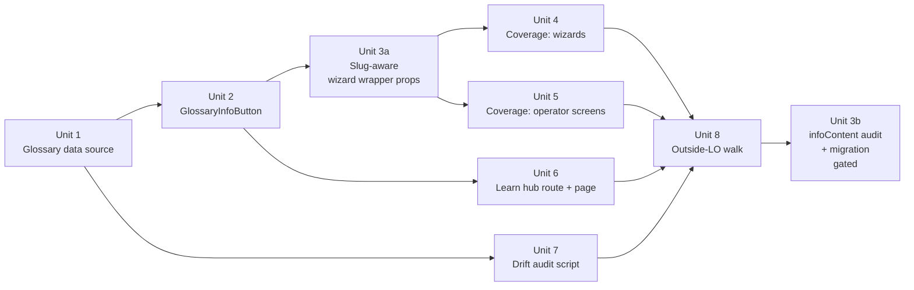

# Operator Help & Learn System — Phase 1

## Overview

Phase 1 of the operator-facing help system. Ships a single glossary data source, a `GlossaryInfoButton` wrapper, InfoButton coverage across the league-v2 + season-v2 wizards and operator-area screens, a Glossary-only Learn hub at `/operator-learn`, and a drift-detection audit that fails CI when a glossary entry's L1 anchor breaks. The persistent Help button, Walkthroughs, and Concepts pages are Phase 2 and gated behind Phase 1 evidence.

## Design Principles (north star)

Every implementation decision below answers to these four UX rules (see auto-memory: `feedback_help_ux_principles`):

1. **EASY to use.** Zero friction to get an answer.
2. **NOT invasive.** Help does not crowd the working UI. Don't "?" every word.
3. **Short by default.** The InfoButton popover gives a 1–2 sentence plain-language answer. No long diatribes for small questions.
4. **Deep dives on demand — super-explanatory.** When the user clicks "Learn more →", the Learn hub holds the thorough version — examples, bullet lists, formatting, context. High quality bar.

If a technical decision below conflicts with one of these rules, the rule wins.

Three load-bearing decisions are already settled by the brainstorm and research:

1. **Storage = TS module registry.** Compile-time slug-union enforcement is the primary defense against the drift R-INFRA1 prevents. (See origin: brainstorm `[Affects R4][Technical]`; research precedent: `src/systems/handicap-systems/index.ts`.)
2. **`GlossaryInfoButton` wraps the existing `InfoButton` additively.** No existing call site breaks. (See origin: R-INFRA1.)
3. **R5's "single source" is operationally violated TODAY by `src/constants/infoContent/*.tsx`.** Migration is in-scope for Phase 1; we cannot ship the glossary alongside three parallel TS-module info-content files and claim R5 is met.

## Problem Frame

A new league operator (LO) knows pool, has played in a league before, but has never run a league or used this app. They arrive with their own vocabulary ("golden break," "8 on the snap") and zero familiarity with this app's screens, dials, or canonical terms. Two failure modes today: stuck-on-screen confusion and vocabulary collisions. Phase 1 delivers the inline-answer layer (InfoButtons backed by a single glossary) plus the Glossary section of the Learn hub. (See origin: Problem Frame.)

No production LOs exist yet — this is a forward-looking bet, not a fix for observed pain. Phase 1 acceptance includes an outside-LO usability walk-through of the league-v2 wizard (Unit 8). (See origin: Evidence basis paragraph.)

## Requirements Trace

Phase 1 must satisfy these origin-doc requirements:

- **R1 (Phase 1 scope)** — Glossary + `GlossaryInfoButton` + InfoButton coverage on league-v2/season-v2/operator dashboard area + Learn hub with Glossary section only.
- **R2** — A first-time LO never has to leave the screen to answer a known question.
- **R3** — Always available, never forced.
- **R4** — Glossary schema contract: `canonicalName`, `aliases`, `shortDef`, `longDef`, `l1_anchor`, `related`.
- **R5** — Single shared source within operator help; no parallel copies.
- **R6** — Aliases are first-class search keys; seed sources named.
- **R7 + R7a** — InfoButton coverage on Phase 1 surfaces; coverage rubric defines "needs an InfoButton."
- **R8** — Phase 1 surfaces are the league-v2 + season-v2 wizards, operator dashboard, league settings, venue management, player management, and the Learn hub itself. `withMember` shared routes excluded.
- **R-INFRA1** — `GlossaryInfoButton` is the only sanctioned mount for glossary terms in Phase 1 code.
- **R11 (Phase 1 cut)** — Learn hub at `/operator-learn` with Glossary section only.
- **R13** — Drift-detection audit on `l1_anchor` references.

Out of scope (Phase 2):

- **R9, R9-OQ, R10** — Persistent Help button + context-aware suggestions.
- **R11 (Walkthroughs, Concepts)** — Two non-glossary Learn hub sections.
- **R12** — Concepts-page authoring.

## Scope Boundaries

- **Phase 2 work** (persistent Help button, Walkthroughs, Concepts) is excluded per the brainstorm's phasing decision (R1).
- **L1 edits** — nothing under `docs/league-system/` is touched. `PRINCIPLES.md §7` policy gate honored.
- **`withMember` shared routes** (Standings, ScoreMatch, TeamStats) — excluded per R8 (audience-leakage risk).
- **Player-facing help / L4** — separate future branch.
- **Other wizards** (`src/wizards/teams-v2/`, `src/wizards/matchups-v2/`, `src/wizards/schedule-v2/`) — not in the brainstorm's Phase 1 surface list; future-branch candidates.
- **AI / chat assistant** — explicitly excluded.

### Deferred to Separate Tasks

- **Phase 2 brainstorm + plan**: Persistent Help button + Walkthroughs + Concepts. Gated on Phase 1 evidence (InfoButton CTR, outside-LO interview, settled `R9-OQ` granularity).
- **L1 `glossary.md`** (the dev-audience glossary): tracked in the L1 docs plan; not a blocker for Phase 1.

## Context & Research

### Relevant Code and Patterns

- **InfoButton component** — `src/components/InfoButton.tsx` (~170 lines). Viewport-aware popover, free-form `title + children`. ~62 call sites today. `GlossaryInfoButton` wraps it additively.
- **Existing InfoButton content centralization** — `src/constants/infoContent/seasonWizardInfoContent.tsx`, `profileInfoContent.tsx`, `operatorApplicationInfoContent.tsx`. These are TS modules exporting `{ title, content: ReactNode }` blobs. **They are the parallel-copy violation R5 forbids; Unit 3 migrates them.**
- **Wizard prop-bag wrappers** — `src/components/wizard/SelectableCard.tsx` (`infoButton: { title, content }` per option), `src/components/wizard/CardSelector.tsx` (`labelInfoButton: { title, content }` per group). Need discriminated-union upgrade to also accept `{ slug }`.
- **Registry precedent** — `src/systems/handicap-systems/index.ts` (typed switch-throw registry with exhaustive union). Tests in `src/systems/handicap-systems/__tests__/registry.test.ts`. Glossary mirrors this shape.
- **Closest end-to-end precedent — the rulebook reader**:
  - `src/rules/resolveRuleId.ts` — slug-based lookup pattern returning `Rule | null`.
  - `src/rules/useRulebookSearch.ts` — pure `searchRulebook(query, filter)` + `useMemo` hook wrapper. Plain `toLowerCase + includes`. Documented upgrade path to Fuse.js. **Adopt verbatim for glossary search.**
  - `src/rules/SearchSnippet.tsx` — snippet rendering with match highlighting.
  - `scripts/clean-rulebook/verifyRulebook.ts` — audit script returning `{ ok, violations, samples }`. **Adopt verbatim for the drift audit.**
- **Routing** — `src/navigation/NavRoutes.tsx`. Add lazy import + `{ path: 'operator-learn', element: withOperator(OperatorLearn) }` in the operator routes block (~line 231). Operator-routes convention is flat-hyphenated.
- **Nav menu** — `src/components/layout/AppSidebar.tsx` (`SidebarOperatorSection`) + `src/components/layout/AppDrawer.tsx`. Add "Learn" link as a peer to the per-org `<details>` blocks.
- **Existing "Need Help?" card** — `src/operator/OperatorDashboard.tsx:126-149`. Four placeholder `<Link to="#">` entries. Repoint the "Operator Handbook" entry to `/operator-learn`.
- **Audit script convention** — `scripts/audit-scan.sh` (bash) and `scripts/clean-rulebook/verifyRulebook.ts` (TS via `tsx`). New audit goes TS-via-`tsx`, wired as `pnpm glossary:verify`.
- **Test placement** — `src/__tests__/unit/` for pure-data and pure-function tests; co-located `__tests__/` for component tests (per `CLAUDE.md` and `feedback_test_placement`).

### Institutional Learnings

- **`feedback_overhaul_includes_cleanup`** — On a subsystem-overhaul branch, dead code and parallel patterns inside that subsystem are in scope. The `src/constants/infoContent/*.tsx` migration is the explicit application of this rule.
- **`feedback_tooltips_use_infobutton`** — InfoButton is the only sanctioned tooltip. `GlossaryInfoButton` extending it is correct compounding.
- **`feedback_file_size_limit`** — Target ~100 lines per file. Glossary is split by domain (per-area `entries/*.ts` files) merged in `src/glossary/index.ts`.
- **`feedback_dark_mode_fixed_bg_text_colors`** — Learn hub page must use semantic tokens, not literal Tailwind shades. Run `pnpm audit:scan` before declaring Unit 7 done.
- **`feedback_table_of_contents_always`** — Update `TABLE_OF_CONTENTS.md` in the same commit as every new file.
- **`feedback_ask_before_pr` + `feedback_no_solo_doc_prs`** — Phase 1 PR does not open until the outside-LO walk (Unit 8) is complete or the documented fallback applies.
- **`feedback_branch_per_feature`** — Phase 1 code goes on its own branch (`feat/operator-help-phase-1`), not the brainstorm branch.

## Key Technical Decisions

- **Storage: TS module registry, slug-keyed** — Compile-time exhaustive checking via the slug union. Strongest defense against missing-slug references. Mirrors `src/systems/<module>/index.ts` precedent. (Resolves brainstorm `[Affects R4][Technical]`.)
- **Slug scheme: kebab-case** — e.g., `break-and-run`, `fargorate`, `race-to`, `points-handicap`. Stable, URL-safe (works as deep-link fragments), readable.
- **Entry shape encodes the short/deep split (Design Principle 3 + 4):** `shortDef: string` is plain text, **max 1–2 sentences**. This is what the popover shows. `longDef: React.ReactNode` allows rich formatting — bullet lists, bold, links, multiple paragraphs, examples. This is what the Learn hub shows when the user clicks "Learn more →". The schema makes brevity-by-default mechanical: an author can't accidentally pour a paragraph into the popover because the type is a short string.
- **Density rule (Design Principle 2):** Don't `?` every word. When 3+ options in a group share a concept, prefer a single group-level `labelInfoButton` (via `CardSelector`) over per-option `infoButton`s. Aim for **no more than ~3 InfoButtons in one card's vertical space.** Applied during Units 4 + 5 coverage.
- **`l1_anchor` shape: `{ path: string; anchor?: string }`** — `path` is repo-relative under `docs/league-system/`, `anchor` matches the `{#fragment}` convention already in L1 README and the handicap-systems README. Audit validates both.
- **`GlossaryInfoButton` is a wrapper, not a sibling** — Internally renders the existing `InfoButton`. Adds slug lookup + dev-mode loud failure + "Learn more →" link. The base `InfoButton` component API is unchanged — its existing direct call sites need no migration. Wizard wrapper prop shapes (`SelectableCard.infoButton`, `CardSelector.labelInfoButton`) become discriminated unions in Unit 3; the bulk of Phase 1's file changes (Units 4 + 5) are wrapper-prop migrations to the slug variant, not InfoButton API changes. (Resolves brainstorm `[Affects R-INFRA1][Technical]`.)
- **Wizard wrapper props gain discriminated-union slug variant** — `SelectableCardOption.infoButton: { slug: string } | { title: string; content: ReactNode }`. Same for `CardSelector.labelInfoButton`. Type checker catches missed migrations.
- **Search: substring on canonical + aliases, `useMemo`-wrapped** — No fuzzy library in Phase 1. Mirrors `useRulebookSearch.ts` exactly, including the "upgrade path" comment for future Fuse.js swap. Returns structured `{ entry, matchType: 'canonical' | 'alias', matchIndex }` for snippet rendering.
- **"Learn more →" opens in a new tab** — `target="_blank" rel="noopener noreferrer"`. Preserves wizard state regardless of which context the InfoButton fires from. Single default avoids per-context branching. (Resolves brainstorm `[Affects R7, R11][Technical]`.)
- **Audit script returns object, never throws** — Mirrors `verifyRulebook`'s `{ ok, violations, samples }`. CLI wrapper checks `result.ok`, calls `process.exit(1)` on failure. Same verifier reachable from a vitest unit test for hot-path coverage.
- **Audit validates file existence AND anchor existence** — File-only validation does not catch L1 section renames, which is the actual silent-drift failure mode.
- **Glossary file split: per-domain** — `src/glossary/entries/handicap.ts`, `scoring.ts`, `match-format.ts`, `standings.ts`, `general.ts`. Per-file ~100 lines each, merged in `src/glossary/index.ts`. Mirrors `src/constants/infoContent/*` per-area convention.
- **`src/constants/infoContent/*.tsx` migration in-scope** — Per R5 and `feedback_overhaul_includes_cleanup`. Done as Unit 3 (alongside the wizard-wrapper prop upgrade) so the cutover lands atomically.
- **Migration strategy: in-place repoint, not rewrite** — Existing `infoContent` exports retained as thin re-exports of glossary entries during transition. Wizard step files keep their import names; only the underlying data source changes. Files removed once all imports resolved through glossary.

## Open Questions

### Resolved During Planning

- **Storage shape (brainstorm R4)** → TS module registry (precedent + compile-time enforcement).
- **`GlossaryInfoButton` wrapper vs sibling (R-INFRA1)** → wrapper around `InfoButton`, additive.
- **`l1_anchor` schema** → `{ path: string; anchor?: string }`, anchor matches `{#fragment}` convention.
- **"Learn more →" open behavior (R7, R11)** → new tab, default everywhere.
- **Audit script form (R13)** → TS via `tsx`, returns `{ ok, violations, samples }`, exposed as `pnpm glossary:verify` + reused in a vitest unit test.
- **Search library** → none in Phase 1; substring with documented upgrade path, mirroring `useRulebookSearch.ts`.
- **`src/constants/infoContent/*.tsx` overlap** → migrate as Unit 3 (R5 cannot be satisfied without it).
- **Glossary file split** → per-domain `entries/*.ts` files, merged via `src/glossary/index.ts`.

### Deferred to Implementation

- **Exact slug naming for ambiguous cases** — e.g., "Points" handicap collides with "Points" scoring. Plan adopts `points-handicap` and `points-scoring` as disambiguated slugs; implementer confirms on first authoring pass.
- **Initial seed term count** — Phase 1 seeds the league-v2 + season-v2 wizard term set first. Operator-area screens (LeagueSettings, VenueManagement, PlayerManagement) seed second pass, possibly within Unit 5. Implementer scopes the exact term list after walking the wizards.
- **Scroll-into-view behavior on deep-link** — Smooth scroll vs jump; implementer picks based on visual feel during Unit 6.
- **Whether Unit 3's prop change needs a codemod helper** — Depends on call-site count discovered while migrating; if >20 mechanical edits, write a tiny `tsx scripts/migrate-info-button-slugs.ts` helper.

## High-Level Technical Design

> *This illustrates the intended approach and is directional guidance for review, not implementation specification. The implementing agent should treat it as context, not code to reproduce.*

```mermaid
graph TB
  subgraph DataLayer["Data layer"]
    G[src/glossary/index.ts<br/>slug-keyed registry]
    GE[src/glossary/entries/*.ts<br/>per-domain entries]
    GE --> G
  end

  subgraph Render["UI / Render layer"]
    GIB[GlossaryInfoButton<br/>by slug]
    IB[InfoButton<br/>existing, base]
    GIB --> IB
  end

  subgraph WizardSurfaces["Phase 1 coverage surfaces"]
    SCO[SelectableCard.tsx<br/>infoButton: slug | content]
    CSE[CardSelector.tsx<br/>labelInfoButton: slug | content]
    L2[league-v2 steps]
    S2[season-v2 steps]
    OP[operator/* screens]
    SCO -.uses.-> GIB
    CSE -.uses.-> GIB
    L2 -.uses.-> SCO
    L2 -.uses.-> CSE
    S2 -.uses.-> SCO
    OP -.uses.-> GIB
  end

  subgraph LearnHub["Learn hub at /operator-learn"]
    OL[OperatorLearn.tsx page]
    GV[GlossaryView<br/>list + search]
    GVE[GlossaryEntry<br/>deep-link target #slug]
    OL --> GV
    GV --> GVE
    GV -.queries.-> G
  end

  GIB -- 'Learn more →' new tab --> OL

  subgraph Audit["Drift audit (CI / pre-commit)"]
    SCR[scripts/audit-glossary.ts]
    L1[docs/league-system/<br/>locked, read-only]
    SCR -.reads.-> G
    SCR -.verifies path+anchor.-> L1
  end

  G -- slug union type --> GIB
```

**Dependency direction summary:**
- Glossary is the single content source. Render-layer (`GlossaryInfoButton`), wizard-wrapper props, Learn hub, and audit script all consume it.
- The base `InfoButton` is unchanged and continues to serve non-glossary inline help (one-off page guidance).
- `docs/league-system/` is read by the audit script only — never written to by Phase 1 code.

## Implementation Units



### Unit 1: Glossary data source — schema, per-domain entries, registry

- [ ] **Unit 1**

**Goal:** Stand up the single glossary data source. Define the `GlossaryEntry` type, seed initial per-domain entries (the league-v2 + season-v2 wizard term coverage), and expose a slug-keyed lookup.

**Requirements:** R4, R5, R6

**Dependencies:** None

**Files:**
- Create: `src/glossary/types.ts` (the `GlossaryEntry` interface; `GlossarySlug` string union derived from entries)
- Create: `src/glossary/entries/handicap.ts` (handicap-related terms)
- Create: `src/glossary/entries/scoring.ts` (scoring-related terms)
- Create: `src/glossary/entries/match-format.ts` (race, pairing, lineup terms)
- Create: `src/glossary/entries/standings.ts` (standings, tiebreaker terms)
- Create: `src/glossary/entries/general.ts` (Division, Module, Spot, Win, etc.)
- Create: `src/glossary/index.ts` (registry merge, `getGlossaryEntry(slug)`, `searchGlossary(query)`)
- Create: `src/glossary/__tests__/glossary.test.ts`
- Modify: `TABLE_OF_CONTENTS.md` (add new directory)

**Approach:**
- `GlossaryEntry` fields: `slug` (kebab-case), `canonicalName` (string), `aliases` (string[]), `shortDef` (**string**, max 1–2 sentences, plain text — Design Principle 3), `longDef` (**`React.ReactNode`**, rich content — bullet lists, bold, links, examples — Design Principle 4), `l1_anchor` (`{ path: string; anchor?: string }`), `related` (string[] of related slugs).
- Each `entries/*.ts` file exports a typed `const entries = { [slug]: GlossaryEntry } satisfies Record<string, GlossaryEntry>`.
- `src/glossary/index.ts` merges all per-domain entries, exports `GlossarySlug` as the union of all keys, exports `getGlossaryEntry(slug: GlossarySlug): GlossaryEntry` (no `| null` — slug is type-checked).
- `searchGlossary` is a pure function: lowercase + substring on canonical names and aliases, returns `{ entry, matchType, matchIndex }[]`. Mirrors `searchRulebook` shape.
- Seed sources for the initial entries (per R6): Ed's experience + BCAPL LO Handbook 2020 (already cited in L1) + FargoRate glossary references already in L1 + the planned outside-LO interview (informs alias backlog post-launch).
- Initial term scope: cover every glossary-eligible term in the league-v2 + season-v2 wizard steps (per R7a rubric). Operator-area screen terms get a second pass during Unit 5.

**Patterns to follow:**
- Registry shape: `src/systems/handicap-systems/index.ts` (typed switch-with-throw — but here we use a record lookup since slugs are type-checked).
- Test shape: `src/systems/handicap-systems/__tests__/registry.test.ts`.
- Lookup function shape: `src/rules/resolveRuleId.ts`.
- Search function shape: `src/rules/useRulebookSearch.ts` (`searchRulebook` pure function).
- Per-area file split: `src/constants/infoContent/*.tsx`.

**Test scenarios:**
- *Happy path:* Every `entries/*.ts` file's exports compile under `satisfies Record<string, GlossaryEntry>` — TypeScript catches schema violations at build time.
- *Schema completeness:* For every entry, assert all required fields present and non-empty (`canonicalName`, `shortDef`, `longDef`, `l1_anchor.path`).
- *Slug uniqueness:* Iterate the merged registry; assert no duplicate slugs across entry files (a JS object key collision would have happened, but we still test the merge result).
- *Alias collisions:* For every entry, assert no alias matches another entry's `canonicalName` (ambiguous search) and no alias is duplicated across entries.
- *Related-dial integrity:* Every slug in any entry's `related` array exists in the merged registry.
- *Search happy path:* `searchGlossary('golden break')` returns the `break-and-run` entry with `matchType: 'alias'`. `searchGlossary('FargoRate')` returns the `fargorate` entry with `matchType: 'canonical'`.
- *Search edge cases:* Empty query returns empty array. Mixed-case query matches (`'FARGORATE'`). Query with no matches returns empty array.

**Verification:**
- `pnpm test:run` passes the new test file.
- `pnpm typecheck` (via `pnpm build`) passes — the `GlossarySlug` union compiles and resolves to the merged entry keys.
- `getGlossaryEntry('break-and-run')` returns the canonical entry from any importing module.

---

### Unit 2: GlossaryInfoButton wrapper

- [ ] **Unit 2**

**Goal:** Build the slug-bound InfoButton wrapper. Looks up the glossary entry, renders `InfoButton` with canonical title + short definition + "Learn more →" link to `/operator-learn#<slug>`, fails loudly on missing slugs (dev-mode visible error; production console warning + literal-slug fallback).

**Requirements:** R-INFRA1, R2, R7

**Dependencies:** Unit 1

**Files:**
- Create: `src/components/GlossaryInfoButton.tsx`
- Create: `src/components/__tests__/GlossaryInfoButton.test.tsx`
- Modify: `TABLE_OF_CONTENTS.md`

**Approach:**
- Props: `{ slug: GlossarySlug; size?: 'sm' | 'default'; align?: 'left' | 'right' | 'center' }`. Size/align passed through to the underlying `InfoButton`.
- Internally calls `getGlossaryEntry(slug)`. Type-checked slug means the only failure mode is a programmer error in raw-string usage (e.g., from migrated content). In dev mode (`import.meta.env.DEV === true` — Vite's canonical dev check), log `console.error` and render a visible red badge with the literal slug. In production, log `console.warn` and render the literal slug as a fallback title.
- Body renders the `shortDef` paragraph + a `<a href="/operator-learn#<slug>" target="_blank" rel="noopener noreferrer">Learn more →</a>` link on its own line below the definition. Visual hierarchy: definition (foreground), link (subdued, smaller).
- **Click propagation guard.** The trigger button and the "Learn more →" anchor both call `e.stopPropagation()` in their `onClick`/`onPointerDown` handlers. Reason: `SelectableCard` wraps its content in an outer `<button onClick={...}>`, so any click inside would bubble up and toggle card selection unexpectedly. The guard MUST be on both the trigger and the link.
- No state of its own; pure composition.

**Patterns to follow:**
- Underlying component: `src/components/InfoButton.tsx` (unchanged).
- Lookup shape: `src/rules/resolveRuleId.ts` + rulebook reader's unknown-ID toast pattern.
- "Loud failure" pattern: the rulebook reader's two-layer approach (runtime visible error + build-time verify).

**Test scenarios:**
- *Happy path:* `<GlossaryInfoButton slug="fargorate" />` renders with title "FargoRate" and short definition body. Open the popover; verify "Learn more →" link `href="/operator-learn#fargorate"` and `target="_blank"`.
- *Happy path:* `size="sm"` and `align="right"` pass through to the underlying `InfoButton`.
- *Edge case (dev-mode loud failure):* When `slug` cannot be resolved (e.g., via type-cast bypass), the component renders a visible error indicator and calls `console.error`.
- *Edge case (production fallback):* In production mode, the same unresolved slug renders a fallback title (the literal slug) and `console.warn` is called.
- *Integration:* `GlossaryInfoButton` mounted inside a `MemoryRouter` does not navigate the current tab when "Learn more →" is clicked (target="_blank" verified).

**Verification:**
- All Unit 2 tests pass.
- TypeScript blocks `<GlossaryInfoButton slug="totally-fake" />` at the call site (slug union enforcement).

---

### Unit 3a: Slug-aware wizard wrapper props (additive)

- [ ] **Unit 3a**

**Goal:** Extend `SelectableCard`, `CardSelector`, and any other wizard wrappers that carry `infoButton`-style props to ALSO accept a `{ slug }` variant. **Additive only — no existing call site changes, no `infoContent` files touched.** This unit ships independently and is fully reversible.

**Requirements:** R-INFRA1 (the slug-binding mechanism)

**Dependencies:** Units 1, 2

**Files:**
- Modify: `src/components/wizard/SelectableCard.tsx` (prop type → discriminated union; render branches on shape)
- Modify: `src/components/wizard/CardSelector.tsx` (same)
- Modify: `src/components/wizard/NumberStepper.tsx`, `src/components/wizard/DateStepper.tsx` — apply the same pattern ONLY IF a Phase 1 step file actually passes an `infoButton` to them. Otherwise defer. (Verified by grep before editing.)
- Test: `src/components/wizard/__tests__/SelectableCard.test.tsx` and equivalent for `CardSelector` — verify both shapes render correctly.

**Approach:**
- Prop shape: `infoButton?: { slug: GlossarySlug } | { title: string; content: ReactNode }`. Inside the component, runtime check `'slug' in infoButton` → render `<GlossaryInfoButton slug={infoButton.slug} />`. Else render existing `<InfoButton title content />`.
- Slug field is typed `GlossarySlug`, not raw string — compile-time enforcement at the prop boundary.

**Patterns to follow:**
- Discriminated-union prop pattern: standard TS shape.

**Test scenarios:**
- *Happy path (slug variant):* `<SelectableCard option={{ id, label, infoButton: { slug: 'fargorate' } }} />` renders `GlossaryInfoButton` with `slug="fargorate"`.
- *Happy path (backwards-compatible):* `<SelectableCard option={{ id, label, infoButton: { title: 'X', content: <p>Y</p> } }} />` renders base `InfoButton` exactly as before — no regression.
- *Edge case:* TS compile-error fixtures verify the union is enforced.

**Verification:**
- Every existing wizard step file (17 league-v2 + 5 season-v2) still compiles and renders unchanged.
- `pnpm typecheck` passes.
- `pnpm test:run` passes.

---

### Unit 3b: `infoContent` audit + selective migration (gated on Unit 8)

- [ ] **Unit 3b**

**Goal:** Audit the operator-scoped entries in `src/constants/infoContent/*.tsx`. Sort each entry into **vocabulary** (canonical term + definition — belongs in the glossary) vs **page-specific help** (instructions for one screen — stays in its own home). Migrate only the vocabulary set. **Gated:** this unit lands AFTER Unit 8's outside-LO walk validates that the help system works as designed. If validation fails, 3b is held while the bet is re-examined; Unit 3a alone is reversible and ships independently.

**Requirements:** R5 (single source for glossary terms)

**Dependencies:** Units 1, 2, 3a, 4, 5, 8

**Files in scope (operator-facing only — `profileInfoContent.tsx` is explicitly EXCLUDED because its consumers are player-facing forms outside Phase 1 scope):**
- Modify: `src/constants/infoContent/seasonWizardInfoContent.tsx` — vocabulary entries become thin re-exports of the matching glossary entry; page-help entries stay in the file (file may be renamed to `seasonWizardPageHelp.tsx` to reflect its post-migration purpose).
- Modify: `src/constants/infoContent/operatorApplicationInfoContent.tsx` — same approach.
- Untouched: `src/constants/infoContent/profileInfoContent.tsx` — out of Phase 1 scope; revisit in a future L4 player-facing branch.

**Approach (audit-first):**
- For each exported const, classify:
  - **Vocabulary** = the content defines what a term means (canonical name + 1–2 sentence definition + optional deep explanation). Examples likely include "FargoRate," "Race To," league-format names.
  - **Page-specific help** = instructions tied to one screen ("Choose the first match night of this season," "Shorter seasons pay out more often..."). These have no canonical term, no aliases, no L1 anchor. Keep in their own file under a clearer name.
- Vocabulary entries get migrated to `src/glossary/entries/*.ts` (new entries or merged into existing) and the original `infoContent` export becomes a thin re-export: `export const fargoRateInfo = glossaryToInfoButtonProps('fargorate')` where the helper renders title + shortDef using the glossary entry. Rich `longDef` content goes into the glossary's `longDef: ReactNode` field so deep-dive content survives migration intact.
- Page-help entries are left as-is in their file. R5 is satisfied because each glossary term lives in exactly one place; non-glossary help content was never duplicated.
- File deletion only happens when ALL exports in a file are migrated. Mixed files keep their non-vocabulary residual.

**Patterns to follow:**
- Thin re-export shim pattern.
- `glossaryToInfoButtonProps(slug)` helper lives in `src/glossary/index.ts` so it's reusable.

**Test scenarios:**
- *Audit deliverable:* A markdown table (one row per existing `infoContent` export, columns: name, classification, action taken, target slug if migrated) committed at `docs/audits/2026-MM-DD-infocontent-audit.md`. Reviewer can verify the sort.
- *Happy path:* Existing wizard step imports of migrated consts resolve to the glossary entry's content (title + shortDef in the popover, longDef on the Learn hub).
- *Happy path:* Existing wizard step imports of page-help consts resolve to their original prose, unchanged.
- *Integration:* `pnpm typecheck` passes; no dangling imports.
- *Regression check:* visual smoke of season-v2 wizard + operator-application flow shows InfoButton popovers render identically to pre-migration (same content, same formatting — `longDef`'s ReactNode preserves any bullet lists / bold / paragraphs the original entries had).

**Verification:**
- Audit markdown file committed.
- `pnpm test:run` and `pnpm typecheck` pass.
- Visual smoke confirms no popover-content regressions.

---

### Unit 4: InfoButton coverage — league-v2 + season-v2 wizards

- [ ] **Unit 4**

**Goal:** Apply the R7a coverage rubric across every step file in `src/wizards/league-v2/steps/` (17 files) and `src/wizards/season-v2/steps/` (5 files: `SeasonIntroStep.tsx`, `SeasonLengthStep.tsx`, `SeasonStartDateStep.tsx`, `PlayoffFormatStep.tsx`, `PlayoffWeeksStep.tsx`). For every term/dial that meets the rubric: either point an existing `infoButton` at the matching glossary slug, OR add a new slug-bound `GlossaryInfoButton`. Every step file's terms must be covered.

**Requirements:** R7, R7a, R8

**Dependencies:** Units 1, 2, 3a

**Files:**
- Modify: every file under `src/wizards/league-v2/steps/` (17 step files) — survey + apply coverage
- Modify: every file under `src/wizards/season-v2/steps/` (5 step files) — survey + apply coverage
- Modify: `src/wizards/league-v2/leagueFormatOptions.ts`, `src/wizards/season-v2/playoffFormatOptions.ts` (data files that drive the steps; may carry `infoButton` prop bags that need slug migration)
- Modify: `TABLE_OF_CONTENTS.md` if new files added

**Approach:**
- Per step file: walk every term, dial, field label, status badge. Apply R7a (rubric: not-a-plain-English-noun OR has-aliases OR badge-meaning-not-literal-word). For each match, ensure a glossary slug exists (add to Unit 1's entries if missing — this is the bulk of the seed-list authoring work).
- **Density check (Design Principle 2):** when 3+ options in a group share a concept, attach a single group-level `labelInfoButton` on the `CardSelector` instead of a per-option `infoButton`. Don't `?` every word. Visual target: no more than ~3 InfoButtons in one card's vertical space.
- Where existing `InfoButton` / `infoButton: { title, content }` already covers the term, replace with `{ slug }` and verify the glossary entry's `shortDef` reads at least as well as the existing copy. Improve glossary copy if the prior inline copy was better.
- New coverage: add `GlossaryInfoButton slug={...}` directly, or use the slug variant of the wizard wrappers (SelectableCard / CardSelector).

**Patterns to follow:**
- Live call-site examples (research summary): `src/wizards/league-v2/steps/QualifierStep.tsx`, `HandicapSystemStep.tsx`.
- Glossary slug consumption shape from Unit 2.

**Test scenarios:**
- *Coverage assertion test (Unit 4 deliverable):* mount-and-render integration test in `src/__tests__/integration/wizardGlossaryCoverage.test.tsx`. For each step file, mount the step inside a test harness, query all rendered `GlossaryInfoButton` instances via test-id or component-name, and assert each instance's resolved slug exists in the registry. (Replaces an earlier grep-based approach — runtime rendering catches dynamic slug usage that grep misses.)
- *Integration:* Mount a representative step (`HandicapSystemStep`) in a test, verify GlossaryInfoButton renders for each slug-bound term, verify "Learn more →" links to `/operator-learn#<slug>`.
- *Density check:* one snapshot or assertion-count test per step asserting the InfoButton count stays at or below the density target.
- *Smoke:* `pnpm test:run` passes the full suite after migration (no existing wizard test breaks).

**Verification:**
- Every wizard step file's InfoButton-bearing terms resolve to a glossary slug (verified by coverage test).
- `pnpm typecheck` passes.
- `pnpm test:run` passes.
- Visual smoke walk of league-v2 wizard in dev: every InfoButton opens with the expected glossary entry; "Learn more →" opens `/operator-learn#<slug>` in a new tab.

---

### Unit 5: InfoButton coverage — operator-area screens

- [ ] **Unit 5**

**Goal:** Apply R7a coverage across the operator-area screens named in R8: `OperatorDashboard.tsx`, `LeagueDetail.tsx`, `LeagueSettings.tsx`, `VenueManagement.tsx`, `PlayerManagement.tsx`, plus the operator-component cards used inside them. Delete the now-orphaned `src/constants/infoContent/*.tsx` files (if fully unused after migration).

**Requirements:** R7, R7a, R8

**Dependencies:** Units 1, 2, 3a, 4

**Files:**
- Modify: `src/operator/OperatorDashboard.tsx`, `LeagueDetail.tsx`, `LeagueSettings.tsx`, `VenueManagement.tsx`, `PlayerManagement.tsx`, `LeagueRules.tsx`, `OrganizationSettings.tsx`
- Modify: relevant `src/components/operator/*.tsx` cards (per research: ~29 files in `src/components/operator/`, many already host InfoButtons)
- Modify: relevant `src/components/operator/preferences/*.tsx` (5 files)
- Modify: `TABLE_OF_CONTENTS.md` if new files added
- **`infoContent` file deletion happens in Unit 3b, not here** — Unit 5 only adds coverage; the migration + deletion is gated on Unit 8 validation.

**Approach:**
- Same survey-and-apply pattern as Unit 4, applied to operator-area screens. Same density rule applies — don't crowd a card with `?` icons; prefer group-level help.
- Operator-component cards (e.g., `LeagueOverviewCard`, `OrganizationStaffCard`, `TeamsCard`) often render status badges and threshold values that meet R7a's badge clause; these need slug-bound InfoButtons.
- Coverage uses the Unit 3a slug-variant wizard wrappers and `GlossaryInfoButton` directly. No `infoContent` files are touched in Unit 5 — they stay until Unit 3b decides what to migrate vs keep.

**Patterns to follow:**
- Same as Unit 4.

**Test scenarios:**
- *Coverage assertion test extension:* Extend the Unit 4 coverage test to also walk operator-area screens listed in R8 — every InfoButton-shaped prop resolves to a glossary slug.
- *Integration:* `OperatorDashboard.tsx` renders without referencing any deleted `infoContent` import (compile-time check).
- *Smoke:* `pnpm test:run` passes after the cleanup.

**Verification:**
- `pnpm typecheck` passes (no dangling imports).
- `pnpm test:run` passes.
- Visual smoke of `OperatorDashboard` and one league-detail screen: InfoButtons open with glossary entries.

---

### Unit 6: Learn hub route, page, and Glossary view

- [ ] **Unit 6**

**Goal:** Add the `/operator-learn` route, build the page chrome, and render the Glossary section: alphabetical browse + alias-aware search + deep-linkable entries by slug fragment. Wire nav entry in `AppSidebar` + `AppDrawer`, and repoint the "Need Help?" placeholder card on `OperatorDashboard`.

**Requirements:** R11 (Phase 1 cut)

**Dependencies:** Units 1, 2

**Files:**
- Create: `src/operator/OperatorLearn.tsx` (page shell — chrome, route header, Glossary section mount)
- Create: `src/operator/learn/GlossaryView.tsx` (search input + alphabetical list)
- Create: `src/operator/learn/GlossaryEntry.tsx` (single-entry display + scroll-into-view on deep-link match)
- Create: `src/operator/learn/__tests__/GlossaryView.test.tsx`
- Modify: `src/navigation/NavRoutes.tsx` — add lazy import + `{ path: 'operator-learn', element: withAuth(<OperatorLearn />) }`. **Use `withAuth`, NOT `withOperator`**: the glossary content is non-sensitive and the "Learn more →" link is reachable from operator-application contexts where the user isn't yet a `league_operator`. Gating on operator role would 403 them and break Design Principle 1 (EASY).
- Modify: `src/components/layout/AppSidebar.tsx` (add "Learn" link in operator section)
- Modify: `src/components/layout/AppDrawer.tsx` (mirror sidebar)
- Modify: `src/operator/OperatorDashboard.tsx` (repoint the "Operator Handbook" link in the "Need Help?" card from `to="#"` to `to="/operator-learn"`; consider repointing all four placeholder entries appropriately)
- Modify: `TABLE_OF_CONTENTS.md`

**Approach:**
- Route under `withAuth(...)`, mounted under `MemberLayout`'s `<Outlet />`. Flat-hyphenated path matches operator route convention. Lazy-loaded.
- `OperatorLearn.tsx` shell uses semantic Tailwind tokens (per `feedback_dark_mode_fixed_bg_text_colors`). shadcn primitives only. Page heading: "Learn" (sidebar label matches).
- `GlossaryView` reads from `searchGlossary()` for the search results, and `getAllGlossaryEntries()` for the alphabetical browse.

**Search state model (Design Principles 1 + 3):**

| State | Trigger | What renders |
|---|---|---|
| **Empty query** | search box is blank | Full alphabetical glossary, grouped by first-letter headers (A, B, C…). A jump-to-letter strip at the top for quick navigation. |
| **Query with results** | substring matches ≥ 1 entry | Filtered results only (alphabetical browse hidden). Each result row shows canonical name + shortDef. Alias matches render the alias inline: `"golden break" → **Break and Run**`. |
| **Query with no results** | substring matches 0 entries | One-line message: `No glossary terms match "<query>". Try a shorter search or browse below.` Alphabetical browse stays visible underneath so the user can keep looking. |

**Deep-link behavior (Design Principles 1 + 4):**
- On mount AND on `hashchange`, read the slug from `window.location.hash`. Use `requestAnimationFrame` to wait one frame for layout, then call `scrollIntoView({ block: 'start', behavior: 'smooth' })` on the matching `GlossaryEntry`'s root element.
- Apply a 1.5s highlight pulse using a semantic token (e.g., `bg-accent/30` fading to transparent) — `transition-colors duration-1500`. Never a literal Tailwind shade.
- If no entry matches the hash, fall back to top-of-page; no error toast (LO arrived from a legitimate link to a slug that may have been retired — graceful fallback).

**Entry display (Design Principle 4 — super-explanatory when asked):**
- Always visible: `canonicalName` (heading), `shortDef` (lead paragraph), aliases as a small subtitle ("also called: …").
- Below that: `longDef` (rich ReactNode) — bullet lists, bold, paragraphs render as-authored. No collapse-by-default; this IS the deep-dive surface so the user just clicked into it.
- Footer: `related` slugs render as inline links (`href="#<slug>"`). `l1_anchor` is NOT shown to the user — it's an internal audit field, not a UX surface.

- The "Need Help?" card already exists on `OperatorDashboard.tsx:126-149` with four placeholder entries — repoint "Operator Handbook" to `/operator-learn`. Leave the other three placeholders as `#` until their target features exist.

**Patterns to follow:**
- Search pattern: `src/rules/useRulebookSearch.ts` + `SearchSnippet.tsx`.
- Route addition: existing operator route block in `NavRoutes.tsx:231+`.
- Nav addition: existing `SidebarOperatorSection` in `AppSidebar.tsx`.
- Page chrome: any operator page in `src/operator/` (`OperatorDashboard.tsx` is a good model).

**Test scenarios:**
- *Happy path:* `/operator-learn` renders, search input present, alphabetical list of glossary entries visible.
- *Happy path:* Typing "fargo" into the search filters the list to the FargoRate entry; the entry shows `matchType: 'canonical'`.
- *Happy path:* Typing "golden break" filters to the Break and Run entry; shows `matchType: 'alias'` rendering with the alias inline.
- *Edge case:* Empty query shows the full alphabetical list.
- *Edge case:* Query with no matches shows a "no results" message with copy suggesting `?` panel use (Phase 2) — Phase 1 just shows "no results."
- *Deep link:* Navigating to `/operator-learn#break-and-run` scrolls the Break and Run entry into view and applies the highlight.
- *Integration:* Clicking a `GlossaryInfoButton`'s "Learn more →" link (rendered in a wizard step in a separate test) opens `/operator-learn#<slug>` in a new tab. Verified via `target="_blank"` assertion in Unit 2's test.

**Verification:**
- `pnpm test:run` passes.
- `pnpm typecheck` passes.
- `pnpm audit:scan` reports no dark-mode / semantic-token violations on the new page.
- Manual smoke in dev: navigate to `/operator-learn`, see the page; sidebar shows "Learn"; type queries; deep-link from a wizard's InfoButton lands on the right entry.

---

### Unit 7: Drift-detection audit script (`pnpm glossary:verify`)

- [ ] **Unit 7**

**Goal:** Ship the L1-anchor drift audit. Scans every glossary entry's `l1_anchor.path` + `l1_anchor.anchor` against the actual `docs/league-system/` file structure. Returns `{ ok, violations, samples }`. Wired as `pnpm glossary:verify` and as a vitest unit test.

**Requirements:** R13

**Dependencies:** Unit 1

**Files:**
- Create: `scripts/audit-glossary.ts` (the verifier — pure function returning `{ ok, violations, samples }`)
- Create: `scripts/audit-glossary-cli.ts` (thin CLI wrapper that calls the verifier, prints a report, `process.exit(1)` on failure)
- Create: `src/__tests__/unit/glossaryDriftAudit.test.ts` (vitest test that calls the verifier and asserts `ok: true` for the shipped glossary)
- Modify: `package.json` — add `"glossary:verify": "tsx scripts/audit-glossary-cli.ts"` to the scripts block
- Modify: `TABLE_OF_CONTENTS.md`

**Approach:**
- The verifier `auditGlossary(): { ok: boolean; violations: Violation[]; warnings: Warning[]; samples: SampleEntry[] }`:
  - For each entry: resolve `path` relative to repo root; assert file exists.
  - If `anchor` set: read file content; assert either `{#anchor}` literal substring appears, OR a Markdown heading whose `github-slugger`-derived slug matches the anchor.
  - Collect violations as `{ slug, l1_anchor, reason: 'missing_file' | 'missing_anchor' }`.
  - Return all violations, plus a small `samples` array of verified-OK entries for sanity output.
- **Use the `github-slugger` npm package** (dev dependency) for anchor matching. Hand-rolling GitHub's slug algorithm is brittle — Unicode, emoji, duplicate-heading suffixing, code-fence content all have edge cases. The library is the standard reference implementation and matches what GitHub actually renders, which is the link an LO would follow.
- The CLI prints a markdown-formatted report and exits with `1` on any violation (warnings do NOT cause exit 1). Output prints to stdout (mirrors `audit-scan.sh` shape).
- The vitest test calls `auditGlossary()` and asserts `result.ok === true`. This means the audit runs on every `pnpm test:run`.
- **Pending-file source (single source of truth):** parse `docs/league-system/implementation-status.md` directly. Look for a fenced YAML block named `pending_paths` at the top of the file (if it doesn't exist, this unit adds it — the file is unlocked sidecar content per L1 PRINCIPLES, so editing it is allowed). Glossary entries whose `l1_anchor.path` matches a pending path produce a `warning` rather than a `violation`. No hardcoded constant in `scripts/audit-glossary.ts` — that would create a second source.

**Patterns to follow:**
- Verifier return shape and "doesn't throw" posture: `scripts/clean-rulebook/verifyRulebook.ts`.
- Tsx-via-`pnpm` script wiring: existing `pnpm e2e:verify-auth`, `pnpm db:types`, etc. (See `package.json`.)
- Markdown report output: `scripts/audit-scan.sh`.

**Test scenarios:**
- *Happy path:* Shipped glossary entries all resolve. `auditGlossary().ok === true`.
- *Edge case (missing file):* Inject a temporary fixture entry pointing at `docs/league-system/does-not-exist.md`. Assert verifier reports a `missing_file` violation for that slug.
- *Edge case (missing anchor):* Fixture entry with valid path but `anchor: 'totally-not-there'`. Assert `missing_anchor` violation.
- *Edge case (anchor via heading):* Fixture entry with valid path and anchor matching a Markdown heading's GitHub-style slug (no `{#anchor}` literal). Assert verifier accepts it.
- *Edge case (pending-file allowlist):* Fixture entry pointing at a path listed in the pending allowlist. Assert verifier emits a `warning`, not a `violation`.
- *CLI smoke:* Run `pnpm glossary:verify` against a known-broken glossary fixture. Assert exit code 1.

**Verification:**
- `pnpm glossary:verify` runs cleanly on the shipped glossary.
- `pnpm test:run` includes the audit test and passes.
- Manual: edit a glossary entry to break its anchor; rerun `pnpm glossary:verify`; observe failure and the markdown report identifying the broken slug.

---

### Unit 8: Outside-LO usability walk-through (Phase 1 acceptance gate)

- [ ] **Unit 8**

**Goal:** Conduct the brainstorm-required outside-LO walk-through of the league-v2 wizard. Capture every "what does this mean?" moment, validate R7a coverage, expand the glossary or correct copy where the walk surfaces gaps. This is the PR-blocking gate before Phase 1 opens for review.

**Requirements:** Brainstorm Success Criteria (Phase 1 outcome test), R7a verification clause.

**Dependencies:** Units 1, 2, 3, 4, 5, 6, 7 must be complete and shipped to the working branch before the walk.

**Files:**
- Create: `docs/audits/2026-MM-DD-operator-help-phase1-walkthrough.md` (the walk-through report — what they saw, what they asked, what was missing, what was added)
- Modify (as needed): `src/glossary/entries/*.ts` (add/fix entries surfaced by the walk)
- Modify (as needed): Wizard step files for any newly-discovered uncovered terms
- Modify: `TABLE_OF_CONTENTS.md` (add walk-through doc)

**Approach:**
- **Primary validator (required, PR-blocking):** a pool player who has played in leagues but has never run one — Ed's friend Jack is the named candidate; any friend matching this profile is acceptable. This validator IS the target audience. They walk the league-v2 wizard end-to-end. Ed observes silently. Every "I have no idea what this means" moment is logged. Acceptance threshold: no more than two unhandled moments (per brainstorm Success Criteria).
- **Stretch validator (recommended, not PR-blocking):** a non-pool-player — Ed's wife is the named candidate. If she can understand the wizard with the InfoButton + Learn hub help layer, the help system is robust well beyond Phase 1's scope. Gaps she hits get logged for future L4 player-facing help work but do not block Phase 1 ship.
- **No Ed-simulation fallback.** Ed is the product author and cannot simulate first-time confusion; that path was reviewed out. If Jack-tier and friend-tier are unreachable inside the planned window, Phase 1 ship is delayed rather than gated on a simulated walk.
- Post-walk: add/fix glossary entries to cover gaps; rerun `pnpm glossary:verify` + `pnpm test:run` + `pnpm audit:scan`.
- Document the walk in `docs/audits/...` so future walks have a baseline.

**Patterns to follow:**
- Audit report shape: existing `docs/audits/` directory pattern (verify it exists; if not, this is the seed file).

**Test expectation:** none — this is a process/acceptance unit, not a behavior change. Code changes that result from the walk are tested under their originating units (Unit 1 / Unit 4).

**Verification:**
- Walk-through report committed at `docs/audits/...`.
- All gaps surfaced during the walk are addressed in glossary entries or wizard coverage.
- Phase 1 PR opens only after this unit's report is committed.

---

## System-Wide Impact

- **Interaction graph:**
  - **New flow path** — Wizard step renders → `SelectableCard` or `CardSelector` with slug → `GlossaryInfoButton` (lookup via `getGlossaryEntry`) → `InfoButton` popover → user clicks "Learn more →" → new-tab navigation to `/operator-learn#<slug>` → Learn hub scrolls to entry.
  - **Existing flow path** — Base `InfoButton` with inline `title + children` continues to work for non-glossary one-off page guidance (e.g., a temporary system status note).
- **Error propagation:**
  - Missing slug at runtime → `GlossaryInfoButton` dev-mode visible error + `console.error`, production console.warn + literal-slug fallback (does not crash the page).
  - Broken `l1_anchor` → Unit 7 audit catches at build/test time; CI gate fails. No runtime error path.
  - `GlossaryView` search with no matches → "no results" UI, no crash.
- **State lifecycle risks:**
  - Glossary is a static module-level constant — no state, no cache, no concurrency concerns.
  - `GlossaryView`'s search is `useMemo`-wrapped; re-renders are tied to query state only.
- **API surface parity:**
  - `SelectableCard` and `CardSelector` `infoButton` props remain backwards compatible (existing `{ title, content }` shape still works). The added `{ slug }` variant is additive.
  - Base `InfoButton` API is unchanged.
- **Integration coverage:**
  - The Unit 4 + Unit 5 coverage tests are the cross-layer scenario tests — they walk wizard/screen files, extract slug references, and assert they resolve in the registry.
  - The Unit 6 deep-link test verifies the cross-boundary flow (`GlossaryInfoButton` → URL fragment → `GlossaryEntry` scroll-into-view).
- **Unchanged invariants:**
  - `docs/league-system/` content remains untouched. L1 policy gate (`PRINCIPLES.md §7`) is honored.
  - `src/components/InfoButton.tsx` API is unchanged; the 62 existing call sites continue to work without migration.
  - `src/wizards/teams-v2/`, `matchups-v2/`, `schedule-v2/` — not in Phase 1 scope; no changes.
  - `withMember` shared routes (Standings, ScoreMatch, TeamStats) — not in Phase 1 scope; no operator-voice content added.

## Risks & Dependencies

| Risk | Mitigation |
|------|------------|
| Outside LO not reachable during Phase 1 timeline | Documented fallback per brainstorm: Ed simulates a first-time walk with written disclaimer. Unit 8 still produces an audit doc. |
| `src/constants/infoContent/*.tsx` migration breaks an unknown wizard import path | Unit 3 keeps re-export shims under the same const names; `pnpm typecheck` catches any missed import before merge. |
| Glossary entry copy quality is uneven (Ed authoring + outside LO seed) | Unit 8 walk surfaces low-quality entries empirically; iterate in-branch before opening PR. |
| Coverage rubric (R7a) interpretation drifts as multiple agents author entries | The rubric is in code-review reach (cited in the brainstorm and the plan); the outside-LO walk is the empirical check. |
| Wizard wrapper prop change (Unit 3) breaks an undiscovered call site shape | Discriminated union in TS makes missed migrations compile errors; no silent breakage path. |
| Glossary registry grows past ~100 lines per per-domain file | Already split by domain (`entries/handicap.ts`, `scoring.ts`, etc.). Further split is a follow-up if any single file balloons. |
| Audit script (Unit 7) false positives when L1 maintainers move sections legitimately | Pending-file allowlist tolerates documented L1 pending state. For real moves, the audit failure IS the signal — L1 maintainer updates the `l1_anchor`. This is the intended behavior. |
| Phase 1 PR opens before Unit 8 walk completes | Plan's Unit 8 explicitly gates PR opening; this plan and `feedback_ask_before_pr` aligned. |
| New `/operator-learn` page violates dark-mode token rules | `pnpm audit:scan` run as part of Unit 6 verification. |

## Documentation / Operational Notes

- **`TABLE_OF_CONTENTS.md`** updated in every unit's commit per `feedback_table_of_contents_always`.
- **No L1 edits.** Plan never touches `docs/league-system/`. The audit script is the only code that reads L1, and it reads only.
- **Branch:** create `feat/operator-help-phase-1` from `main` (NOT from the brainstorm branch) before starting Unit 1. Phase 1 code does not commingle with the brainstorm doc commit.
- **PR opening posture:** Per `feedback_ask_before_pr`, do not open the Phase 1 PR until Unit 8 is complete (or its documented fallback applies). Confirm with Ed before opening.
- **`pnpm audit:scan`** must pass before declaring Unit 6 done (dark-mode + semantic-token check on the new `/operator-learn` page).
- **`pnpm glossary:verify`** runs as part of the test suite (Unit 7's vitest test calls the same verifier); CI gate is automatic from that point.

## Sources & References

- **Origin document:** [docs/brainstorms/2026-05-28-operator-help-system-requirements.md](docs/brainstorms/2026-05-28-operator-help-system-requirements.md)
- **Related earlier brainstorm:** [docs/brainstorms/2026-05-12-league-system-documentation-requirements.md](docs/brainstorms/2026-05-12-league-system-documentation-requirements.md) — L1/L2/L3/L4 framing.
- **Related code:**
  - `src/components/InfoButton.tsx`
  - `src/components/wizard/SelectableCard.tsx`, `CardSelector.tsx`
  - `src/constants/infoContent/seasonWizardInfoContent.tsx`, `operatorApplicationInfoContent.tsx`, `profileInfoContent.tsx`
  - `src/systems/handicap-systems/index.ts` + `__tests__/registry.test.ts` (registry precedent)
  - `src/rules/resolveRuleId.ts`, `useRulebookSearch.ts`, `SearchSnippet.tsx` (lookup + search precedent)
  - `scripts/clean-rulebook/verifyRulebook.ts` (audit return-shape precedent)
  - `scripts/audit-scan.sh` (script-wiring precedent)
  - `src/navigation/NavRoutes.tsx`, `src/components/layout/AppSidebar.tsx`, `src/components/layout/AppDrawer.tsx` (routing + nav)
  - `src/operator/OperatorDashboard.tsx:126-149` (existing "Need Help?" card)
- **L1 reference:** `docs/league-system/README.md`, `docs/league-system/modules/handicap-systems/README.md`, `docs/league-system/implementation-status.md`
- **Auto-memory entries cited:** `feedback_tooltips_use_infobutton`, `feedback_overhaul_includes_cleanup`, `feedback_file_size_limit`, `feedback_dark_mode_fixed_bg_text_colors`, `feedback_table_of_contents_always`, `feedback_ask_before_pr`, `feedback_no_solo_doc_prs`, `feedback_branch_per_feature`, `feedback_test_placement`
