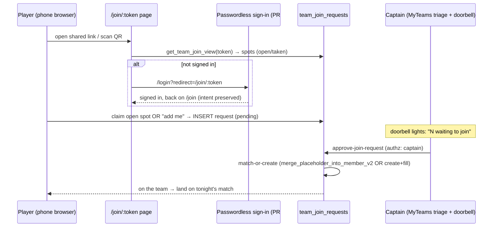

# feat: Player/captain onboarding cold-start cascade

## Overview

Give every team a **persistent, forwardable join link/QR** ("the address"). A
player opens it, sees the team's roster (open spots claimable, taken spots
shown), claims their spot — or taps "I'm not listed, add me" — and lands on a
**captain approve list**. The captain taps **approve** ("the door") and the
player is on the team, looking at tonight's match. The captain's job collapses
to *share one link + tap approve*; no typing emails, no per-player data entry.

This is **additive** — the existing per-placeholder email invite / QR / device-
handoff flows (`InvitePlayerModal`, `send-invite`, `ClaimPlayer.tsx`) stay
untouched. It reuses the shipped merge plumbing (`merge_placeholder_into_member_v2`)
at approval time, and **builds on the just-shipped passwordless sign-in** (PR
#159): because the player types a code in-page instead of chasing an email link,
the join intent rides the existing `?redirect`/`location.state` machinery
straight back to the join — no fragile cross-device token needed.

## Problem Frame

Getting 60–70 non-tech players onto the correct team at a brand-new league's
cold start is the product's #1 friction, and today it routes through the LO as a
one-to-one "type every email" help desk. The cascade distributes that load: the
LO onboards ~10 captains; each captain self-serves their own ~5–8 players via one
shared link + approve taps. (See origin:
`docs/brainstorms/2026-05-28-player-onboarding-cold-start-requirements.md`.)

## Requirements Trace

- R1. **Persistent, roster-aware team join link/QR** — lives with the team all
  season; on open, reads the **live roster** (open placeholder spots claimable,
  claimed spots visible-but-taken).
- R2. **Self-claim an open spot** — a player claims an existing open placeholder
  spot; the claim is a **request until the captain approves**.
- R3. **"I'm not listed — add me"** — the player provides their own name;
  approval creates *and* fills the spot in one tap (match-or-create).
- R4. **Captain approval is the gate** — every claim (in-person or remote) is a
  request; one approve tap per claim. No bulk action; no in-person auto-approve.
- R5. **Approval is match-or-create** — the captain can link a self-add to an
  existing placeholder / returning player (reusing the merge path) instead of
  creating a duplicate, preventing split stats.
- R6. **Team page is the triage board** — per-team: claimed / waiting-for-
  approval / open spots, with the approve action inline.
- R7. **The "doorbell"** — pending claims surface where the captain is: a
  "N waiting to join" home card + a menu count + a mobile bottom-bar indicator;
  shown only while pending, cleared when handled (act-now signal, not permanent
  chrome).
- R8. **Land on tonight's match** — once approved/on the team, the player lands
  on their team with tonight's match front-and-center + a one-tap path to scoring.
- R9. **Thin first-run wizard** — captain: 3 cards (get/copy link → share → approve
  people as they appear), reusing the Wizard 2.0 scaffold.
- R10. **Join intent survives sign-in** — a not-yet-authenticated visitor who
  opens the link signs in (passwordless) and lands back on the join, never a
  generic home page.
- R11. **Additive** — nothing that works today (email/QR/device-handoff, manual
  placeholders) is removed.

## Scope Boundaries

- **Steady-state / returning-player onboarding** — handled by season carryover.
- **Public "Find a League" discovery**, **LO/captain lost-player *search***,
  **just-in-time at-the-table claim as a distinct flow** — deferred follow-ons
  (origin Non-Goals).
- **Reworking auth/registration** — done separately (passwordless, PR #159);
  this plan assumes it exists.

### Deferred to Separate Tasks

- **LO → captains mirror cascade** (org-level join link + captain self-claim):
  the same primitive one level up. The LO load is small (~10 captains, already
  served by the teams-v2 wizard + `InvitePlayerModal`), so the org-level link is
  a fast-follow phase. *This plan ships the captain's first-run wizard (R9) but
  scopes the org→captain link to a later task.*
- **`send-invite` caller-authz hole** (any authed user can fire invites for any
  team) — a pre-existing bug, not introduced here; fix on its own small PR
  (noted in Risks).
- **Per-token request rate-limiting / captcha** on the public join page — a
  hardening fast-follow (the approval gate is the functional safety net now;
  see Risks).

## Context & Research

### Relevant Code and Patterns

- **Invite/merge substrate (reuse at approval time, do not rebuild):**
  - `supabase/migrations/20251217144653_invite_tokens.sql` + the auto-invite
    trigger `ensure_placeholder_invite_token()` (`20260422000007`).
  - `merge_placeholder_into_member_v2` RPC (params: `p_placeholder_member_id`,
    `p_target_member_id`, `p_actor_member_id`, `p_actor_role`,
    `p_organization_id`) — called by `supabase/functions/claim-placeholder/`.
  - `placeholder_has_stats(member_id)` predicate; `lo-merge-placeholder` /
    `lo-undo-merge` edge functions; `archived_placeholders` (PII, deny-all RLS).
  - `src/api/mutations/members.ts` `createPlaceholderMember`; `src/login/ClaimPlayer.tsx`;
    `src/components/modals/PendingInvitesModal.tsx`; `src/api/hooks/{useInviteStatuses,useOrganizationInvites,usePendingInvites}.ts`.
- **Roster model:** `teams` + `team_players` (join table; `member_id` → a
  placeholder member with `user_id IS NULL` = an "open spot"). `src/hooks/useRosterEditor.ts`,
  `src/wizards/teams-v2/steps/CaptainsTeamsStep.tsx`, `src/api/mutations/teams.ts` `createTeam`.
- **Triage-board home:** `src/player/MyTeams.tsx` (per-team accordion, readiness,
  `PlayerRoster`, captain-only "Edit Team"). No `team/:teamId` index route exists — free for use.
- **Doorbell surfaces:** `src/player/MyTeams.tsx` (home card), `src/components/layout/{AppDrawer,AppSidebar}.tsx`
  ("Messages (N)" label via `useUnreadMessageCount`), `src/components/layout/BottomTabBar.tsx`
  (`TabItem.badge` red pill — the exact count mechanism).
- **Wizard scaffold:** `src/components/wizard/` (Wizard 2.0 — `WizardShell`,
  `WizardConfig`, `WizardStepProps`, plain `useState`, zod-on-Next, string-ID step
  registry, files < 100 lines). Live example: `src/wizards/teams-v2/`.
- **Share/QR:** `src/components/invite/ShareLinkSection.tsx` (`QRCodeSVG` from
  `qrcode.react`); link composed in `src/components/InvitePlayerModal.tsx`.
- **Tonight's match:** `src/player/MyMatch.tsx` (placeholder stub), `matches` +
  `season_weeks.scheduled_date`, `src/api/hooks/useMatches.ts` `useMatchesByTeam`,
  `useMatchPhase` / `MatchPhaseGuard`, routes `/match/:matchId/{lineup,score}`.
- **Conventions:** `src/api/{mutations,queries,hooks}` split; `src/api/queryKeys.ts`
  (use `queryKeys.members.all` — avoids the R8 stale-cache bug); RPCs via
  `supabase.rpc`; migrations in **`supabase/migrations/`** (timestamped);
  edge functions in `supabase/functions/<name>/`; vitest `unit` vs `db` projects.

### Institutional Learnings

- `memory-bank/PLAN-email-invites.md` — the email-as-identity-anchor model and
  the **`userEmail === inviteEmail` 403** stolen-link guard. This cascade
  deliberately trades that guard away (shared link) and makes **captain approval
  the safety net** — so approval authz must be real (Unit 4).
- `docs/plans/2026-04-22-001-feat-placeholder-player-lifecycle-plan.md` — merge
  is schema-aware; **`match_lineups.playerN_id` are plain UUIDs, not FKs**, so the
  merge loop can miss them (the lifecycle plan declares the constraints — verify
  that fix landed before relying on merge). Org-scope chain
  `team_players → teams → seasons → leagues → organization_id`; match-or-create
  "link to existing" must be **hard-scoped to org**. The dead **`merge_requests`
  table** (`20251216121115`) is unwired — build the new requests table fresh.
- `docs/brainstorms/header-mobile-rework-requirements.md` R24 — the "you have
  mail" badge convention; the doorbell is its **act-now refinement** (surface
  where the captain is, clear when handled, never permanent chrome).
- Memory: RLS is disabled — authz lives in **edge functions / RPC args**, not
  RLS. Don't `supabase db reset` (live test data); migrations are additive.
  Localhost links can't be tested cross-device — link/QR verification needs staging.

### External References

- None needed — deep local prior art; no external research run.

## Key Technical Decisions

- **Persistent team link = a per-team `join_token` (UUID) on `teams`.** Stable
  for the season, forwardable; the route is `/join/:token`. Distinct from the
  per-placeholder `invite_tokens` (which stay for the email flow).
- **New `team_join_requests` table for the claim→approve lifecycle** — *not* the
  email-gated `invite_tokens`, and *not* the dead `merge_requests` table. Columns
  (directional): `id`, `team_id`, `requested_by_user_id`, `claimed_member_id`
  (nullable — the open placeholder being claimed), `provided_name` (nullable —
  for "add me"), `status` (`pending` | `approved` | `rejected` | `cancelled`),
  `created_at`, `resolved_at`, `resolved_by_member_id`.
- **Reading the join view is unauthenticated; claiming requires sign-in.** A
  public RPC `get_team_join_view(token)` returns team name + spots (open vs
  taken) — names only, no contact info. Submitting a claim requires an
  authenticated user (passwordless), so the request carries a real `user_id`.
- **Approval is an edge function, `approve-join-request`** — authz: the caller
  must be the team's captain (or org staff). It does **match-or-create**: if the
  request targets an existing placeholder (`claimed_member_id`) or the captain
  links it to one, route through `merge_placeholder_into_member_v2`; if "add me"
  with no target, create a member + `team_players` row. Marks the request
  resolved. (RLS-off → authz MUST be enforced here, not by RLS.)
- **The approval gate replaces link secrecy.** Because the link is forwardable,
  the email-match 403 guard cannot apply to shared-link claims — the captain's
  approve tap is the only gate, by design. (The per-placeholder email flow keeps
  its 403 guard untouched.)
- **Triage board lives on `MyTeams.tsx`**, in the existing per-team accordion —
  the captain already lands there. No new route needed.
- **Doorbell reuses existing badge mechanisms** — `BottomTabBar` `TabItem.badge`,
  the `AppDrawer`/`AppSidebar` "(N)" label, and a `MyTeams` home card; a single
  `usePendingJoinRequestCount(captainMemberId)` hook feeds all three.
- **"Open spot" = an unclaimed placeholder already on the roster** (the captain
  pre-makes name-only placeholders, as today). Claiming one targets that
  placeholder; "add me" creates a new one at approval. No new "spot" entity.

## Open Questions

### Resolved During Planning

- *Extend `invite_tokens` or new table?* New `team_join_requests` — `invite_tokens`
  is per-placeholder + email-gated; the team-link request is a different shape.
- *Revive `merge_requests`?* No — build fresh; that table is dead/unwired.
- *How does join intent survive sign-in?* Reuse PR #159's `?redirect`/`location.state`
  threading — the `/join/:token` route is the redirect target.
- *Is the join view a privacy risk?* It exposes roster **names** to anyone with
  the link — acceptable per the design (the link is shared within the team); no
  contact info exposed.

### Deferred to Implementation

- Exact `team_join_requests` columns/indexes and the `get_team_join_view` /
  `approve-join-request` signatures — finalize against the real schema while coding.
- Whether `approve-join-request` is a new edge function vs an extension of
  `claim-placeholder` — decide when wiring (lean: new function, single
  responsibility).
- The precise "tonight's match" predicate (today vs in-progress vs next-up) and
  how much of `MyMatch` to build here vs in its own effort — scope at Unit 8.
- Confirm the `match_lineups.playerN_id` FK fix from the lifecycle plan is live;
  if not, include it before relying on merge.

## High-Level Technical Design

> *This illustrates the intended approach and is directional guidance for review,
> not implementation specification. The implementing agent should treat it as
> context, not code to reproduce.*

## Implementation Units

### Phase 1 — Data model + read

- [ ] **Unit 1: Schema — team join token + join-request lifecycle**

**Goal:** A persistent per-team join token and a clean requests table for the
claim→approve lifecycle.

**Requirements:** R1, R2, R3, R4.

**Dependencies:** None (do first).

**Files:**
- Create: `supabase/migrations/<ts>_team_join_cascade.sql` (adds `teams.join_token`
  UUID default `gen_random_uuid()` unique; creates `team_join_requests`).
- Modify: `src/types/database.types.ts` (regenerate via `pnpm db:types`).
- Test: `src/__tests__/database/team-join-cascade.test.ts`.

**Approach:**
- `teams.join_token` — backfill existing teams; never regenerated (persistent).
- `team_join_requests` per Key Decisions; index on `(team_id, status)` for the
  triage/doorbell queries; FK `requested_by_user_id` → `auth.users`,
  `claimed_member_id` → `members` (nullable).
- Additive migration only — **do not** `supabase db reset`. Verify the
  `match_lineups.playerN_id` FK fix (lifecycle plan) is present; add if missing.

**Execution note:** DB-touching → goes in the `db` test project.

**Patterns to follow:** `supabase/migrations/20251217144653_invite_tokens.sql`,
`20260422000007_*` trigger style.

**Test scenarios:**
- Happy path: a new team gets a non-null unique `join_token`; existing teams are
  backfilled.
- Happy path: inserting a `team_join_requests` row with `claimed_member_id`
  (claim) and with `provided_name` (add-me) both persist with `status='pending'`.
- Edge: `status` CHECK rejects unknown values; `(team_id,status)` index exists.
- Integration: deleting a team cascades its join requests (or restricts —
  match the teams cascade policy).

**Verification:** Migration applies cleanly on top of current schema (no reset);
types regenerate; both request shapes insert.

- [ ] **Unit 2: `get_team_join_view(token)` RPC + read hook**

**Goal:** Resolve a join token to the team + its claimable/taken spots, readable
without authentication.

**Requirements:** R1.

**Dependencies:** Unit 1.

**Files:**
- Create: `supabase/migrations/<ts>_get_team_join_view.sql` (RPC).
- Create: `src/api/queries/teamJoin.ts`, `src/api/hooks/useTeamJoinView.ts`.
- Test: `src/__tests__/database/get-team-join-view.test.ts`, `src/api/hooks/useTeamJoinView.test.ts`.

**Approach:**
- RPC returns `{ team_name, org_name, spots: [{ member_id, display_name,
  is_open }] }` where `is_open` = placeholder (`user_id IS NULL`) not yet claimed.
  **Names only** — no email/phone.
- Invalid/unknown token → empty/error result the page renders as "link not valid."

**Patterns to follow:** `get_my_pending_invites` enriched-RPC style; the
`src/api/queries` + `src/api/hooks` split.

**Test scenarios:**
- Happy path: valid token returns the team with open placeholder spots flagged
  `is_open=true` and claimed/registered members `is_open=false`.
- Edge: unknown/garbage token returns no team (page shows invalid-link state).
- Edge: a team with a full roster returns all spots `is_open=false`.
- Integration: a placeholder that gets claimed (Unit 4) flips to `is_open=false`
  on the next read.

**Verification:** Opening the RPC with a real token lists the roster with correct
open/taken flags and no contact info.

### Phase 2 — Claim + approve (the cascade core)

- [ ] **Unit 3: The join page (`/join/:token`)**

**Goal:** The player-facing page: see spots, claim one or "add me," submit a
request — threading passwordless sign-in.

**Requirements:** R2, R3, R10.

**Dependencies:** Unit 2, passwordless sign-in (PR #159).

**Files:**
- Create: `src/onboarding/TeamJoinPage.tsx` (+ small sub-components if > ~100 lines).
- Create: `src/api/mutations/teamJoin.ts` (`submitJoinRequest`), `src/api/hooks/useSubmitJoinRequest.ts`.
- Modify: `src/navigation/NavRoutes.tsx` (public route `/join/:token`).
- Test: `src/onboarding/TeamJoinPage.test.tsx`, `src/api/hooks/useSubmitJoinRequest.test.ts`.

**Approach:**
- Reads `useTeamJoinView`. Shows open spots (tap "that's me") + an "I'm not
  listed — add me" affordance (name input).
- If not authenticated, route to `/login?redirect=/join/:token` (PR #159
  threading) and return here after sign-in.
- Submitting inserts a `team_join_requests` row (claim → `claimed_member_id`;
  add-me → `provided_name`). After submit, show "waiting for the captain" state.
- Use `queryKeys` for cache; invalidate the join-view + the captain's
  pending-count queries.

**Patterns to follow:** `src/login/ClaimPlayer.tsx` state-machine + sub-views;
`renderWithProviders` + the supabase mock pattern for tests.

**Test scenarios:**
- Happy path: signed-in user taps an open spot → `submitJoinRequest` called with
  `claimed_member_id`; UI shows "waiting for approval."
- Happy path: "add me" with a typed name → request with `provided_name`.
- Edge: unauthenticated visit → redirected to `/login?redirect=/join/:token`.
- Edge: a taken spot is not tappable.
- Error: submit failure surfaces a message and stays on the page.
- Integration: after submit, the join view reflects the pending claim.

**Verification:** A signed-out player opens the link, signs in, claims a spot,
and sees "waiting for the captain" — all on the join page.

- [ ] **Unit 4: Approve action — `approve-join-request` edge function (match-or-create)**

**Goal:** The captain's one-tap approve: authz-gated, match-or-create, resolves
the request and puts the player on the team.

**Requirements:** R4, R5.

**Dependencies:** Unit 1.

**Files:**
- Create: `supabase/functions/approve-join-request/index.ts`.
- Create: `src/api/mutations/teamJoin.ts` (`approveJoinRequest`, `rejectJoinRequest`),
  `src/api/hooks/useApproveJoinRequest.ts`.
- Test: `src/__tests__/database/approve-join-request.test.ts` (db project).

**Approach:**
- **Authz (load-bearing, RLS-off):** verify the Bearer-token caller is the
  team's captain (`teams.captain_id`) or org staff; 403 otherwise.
- **Match-or-create:** claim of an existing placeholder, or captain links to one →
  `merge_placeholder_into_member_v2` (org-scoped); "add me" with no target →
  create member + `team_players` row. Mark the request `approved`.
- Reject path flips to `rejected`, no roster change.
- New edge function → **full Supabase restart** to register locally.

**Execution note:** Start with a failing db-project test for the captain-authz
gate (security-critical) before the merge/create logic.

**Patterns to follow:** `supabase/functions/claim-placeholder/index.ts` (JWT gate,
service-role client, the merge RPC call, `archived_placeholders.transferred_rows`).

**Test scenarios:**
- Happy path (claim): approving a request targeting placeholder X merges X into
  the requesting user; the team_players row now points at the user; request
  `approved`.
- Happy path (add-me): approving creates a member + roster row; request `approved`.
- Edge (match-or-create): captain links an "add me" to an existing placeholder →
  merge instead of duplicate (no split stats).
- Error (authz): a non-captain / non-staff caller gets 403 and no mutation.
- Error: approving an already-resolved or expired request is a no-op/error.
- Integration: org-scope — cannot link to a placeholder outside the team's org.

**Verification:** Captain approval puts the player on the roster via merge-or-
create; non-captains are refused; no duplicate members on the match-or-create path.

- [ ] **Unit 5: Captain triage board on the team accordion**

**Goal:** Per-team claimed / waiting / open view with inline approve/reject.

**Requirements:** R6.

**Dependencies:** Unit 2, Unit 4.

**Files:**
- Create: `src/player/components/TeamTriageBoard.tsx` (or extend `TeamAccordionItem`).
- Create: `src/api/hooks/useTeamJoinRequests.ts`.
- Modify: `src/player/MyTeams.tsx` (mount the board in the captain's team item).
- Test: `src/player/components/TeamTriageBoard.test.tsx`.

**Approach:**
- Three groups: **claimed** (registered/real players), **waiting** (pending
  requests with an Approve + Reject button each), **open** (unclaimed
  placeholders). Captain-only.
- Approve/Reject call Unit 4; optimistic invalidate of the join-view, triage, and
  doorbell-count queries.

**Patterns to follow:** `MyTeams.tsx` `TeamAccordionItem` + `PlayerRoster`;
`useRosterEditor`; `placeholder_has_stats` to flag spots with stats.

**Test scenarios:**
- Happy path: a team with 2 pending requests shows them under "waiting" with
  Approve/Reject; non-captain viewer sees no approve controls.
- Happy path: approving removes the row from "waiting" and the player appears
  under "claimed."
- Edge: zero pending → no "waiting" group, board still shows claimed/open.
- Integration: approving updates the roster (claimed count) without a manual refresh.

**Verification:** The captain sees claimed/waiting/open at a glance and approves
inline; the board updates live.

### Phase 3 — Surfacing, guidance, landing

- [ ] **Unit 6: The "doorbell"**

**Goal:** Surface pending-claim counts where the captain is, cleared when handled.

**Requirements:** R7.

**Dependencies:** Unit 1.

**Files:**
- Create: `src/api/hooks/usePendingJoinRequestCount.ts`.
- Modify: `src/player/MyTeams.tsx` (a "N waiting to join" card), `src/components/layout/{AppDrawer,AppSidebar}.tsx`
  (a "(N)" on the My Teams entry), `src/components/layout/BottomTabBar.tsx` (`TabItem.badge` on My Teams).
- Test: `src/api/hooks/usePendingJoinRequestCount.test.ts`, plus assertions in the
  layout tests.

**Approach:**
- One hook summing pending requests across the captain's teams feeds all three
  surfaces. Appears only when count > 0; clears when handled. **Not** a permanent
  chrome badge (honors the "act-now, not always-on" rule).

**Patterns to follow:** `useUnreadMessageCount` + the `BottomTabBar` `TabItem.badge`
red-pill; the "Messages (N)" label in `AppDrawer`/`AppSidebar`.

**Test scenarios:**
- Happy path: count > 0 → home card + menu "(N)" + bottom-bar badge render.
- Happy path: count 0 → none of the three render.
- Edge: a non-captain (no teams they captain) never sees the doorbell.
- Integration: approving the last pending request clears all three surfaces.

**Verification:** A captain with pending claims sees the doorbell on home, menu,
and bottom bar; it disappears when the queue is empty.

- [ ] **Unit 7: Thin captain first-run wizard**

**Goal:** A 3-card guided intro that removes fear-of-the-unfamiliar.

**Requirements:** R9.

**Dependencies:** Unit 2 (the link), Unit 5 (the board).

**Files:**
- Create: `src/wizards/captain-onboarding-v2/` (`captainOnboardingConfig.ts` + 3
  step components) following the Wizard 2.0 contract.
- Modify: `src/player/MyTeams.tsx` (first-run entry for a captain who hasn't
  shared yet) + a dismissed/seen flag (localStorage or a `members` column).
- Test: `src/wizards/captain-onboarding-v2/captainOnboarding.test.tsx`.

**Approach:**
- Card 1: here's your team link + QR (reuse `ShareLinkSection` with the
  `/join/:token` URL). Card 2: share it (copy / show QR). Card 3: approve people
  as they appear (points at the triage board).
- Plain `useState`, < 100-line files, `WizardStepProps`. Use `queryKeys.members.all`
  if any member data is touched (avoid the R8 stale-cache bug).

**Patterns to follow:** `src/wizards/teams-v2/` config + `src/components/wizard/`
(`WizardShell`, `WizardConfig`).

**Test scenarios:**
- Happy path: the wizard renders 3 steps; Card 1 shows the team's `/join/:token`
  link + QR; Next/Back work.
- Happy path: completing/dismissing sets the seen flag so it doesn't reappear.
- Edge: a non-captain never sees the captain wizard.

**Verification:** A first-time captain is walked link → share → approve and lands
on the triage board.

- [ ] **Unit 8: Land on tonight's match**

**Goal:** After joining/approval, the player lands on their team with tonight's
match front-and-center + a one-tap path into scoring.

**Requirements:** R8.

**Dependencies:** Unit 4 (approval completes the join).

**Files:**
- Create: `src/api/hooks/useTonightsMatch.ts` (or extend `useMatchesByTeam`).
- Modify: `src/player/MyTeams.tsx` (surface tonight's match prominently),
  `src/player/MyMatch.tsx` (wire the detection stub into a real card).
- Test: `src/api/hooks/useTonightsMatch.test.ts`.

**Approach:**
- Detect a match for the player's team(s) scheduled today or `in_progress`
  (`season_weeks.scheduled_date` + `matches.status`); one-tap to
  `/match/:matchId/lineup` via the existing `useMatchPhase`/`MatchPhaseGuard`.
- Scope: build the detection + the MyTeams surfacing here; the full `MyMatch`
  page build can remain its own effort if it grows (note at implementation).

**Patterns to follow:** `useMatchesByTeam` (`scheduled_date` flatten),
`MyTeams.tsx` existing "match today / in-progress" inline filter, `MatchPhaseGuard`.

**Test scenarios:**
- Happy path: a team with a match scheduled today surfaces it with a "go" CTA to
  `/match/:id/lineup`.
- Happy path: an `in_progress` match is surfaced as "jump in."
- Edge: no match today → no tonight's-match card (no error).
- Edge: a player on multiple teams with matches today sees each.

**Verification:** A freshly-approved player lands on their team and sees tonight's
match with one tap into scoring.

## System-Wide Impact

- **Interaction graph:** approval mutates `team_players` (roster) + resolves
  `team_join_requests` + may run `merge_placeholder_into_member_v2` (touches
  stats/lineups). The doorbell, triage board, and join view all read
  `team_join_requests` — invalidate them together on approve/reject.
- **Error propagation:** edge functions throw → mutations throw → hooks surface a
  message; never silently drop a claim.
- **State lifecycle risks:** **two players claiming the same open spot** (race) —
  approval must be idempotent/guarded (first approve wins; second sees
  "already resolved"). A forwarded link inviting many requests — bounded by the
  approval gate.
- **Security invariants (must hold):** the per-placeholder `userEmail===inviteEmail`
  403 guard in `claim-placeholder` is **unchanged** (email flow). The new
  shared-link path is gated solely by **captain approval** + the
  `approve-join-request` captain-authz check (RLS-off, so authz lives there).
  Match-or-create is **org-scoped**.
- **Unchanged invariants:** existing `InvitePlayerModal` / `send-invite` /
  `ClaimPlayer` per-placeholder email + QR + device-handoff flows; manual
  placeholder creation; `invite_tokens` and its trigger. All additive.

## Risks & Dependencies

| Risk | Mitigation |
|------|------------|
| Forwardable link removes the email-match guard → wrong person claims a spot | Captain approval is the gate (R4); `approve-join-request` is captain-authz'd; names shown so the captain recognizes claimants. |
| Two players claim the same open spot (race) | Approval guarded/idempotent — first approve wins; second request shows "already resolved." |
| Match-or-create creates duplicate players / split stats | Approval routes through `merge_placeholder_into_member_v2`; captain can link an "add me" to an existing placeholder; org-scoped. |
| `match_lineups.playerN_id` not declared FK → merge misses lineup rows | Verify/include the lifecycle-plan FK fix before relying on merge (Unit 1). |
| Public join page spammed with requests | Approval gate absorbs it functionally; per-token rate-limit/captcha is a deferred hardening. |
| Pre-existing `send-invite` caller-authz hole | Out of scope here; flagged for its own fix (don't widen it). |
| Can't test links cross-device on localhost | Verify the full link/QR/device-switch flow on staging (same constraint as Facebook OAuth). |
| New edge function not registered locally | Full `db:stop && db:start` after adding `approve-join-request`. |

## Documentation / Operational Notes

- Update `TABLE_OF_CONTENTS.md` for new files (route, page, hooks, edge function,
  migrations, wizard).
- Dangling refs in the origin brainstorm to flag to Ed: `docs/brainstorms/2026-05-17-bca-pitch-strategy.md`
  and the `memory-bank/futureFeatures.md` "Affiliation/Find-a-League" section
  appear not to exist — harmless to the build, worth correcting in the doc.
- Staging/launch: link+QR+device-switch verification, and the join flow end-to-end,
  must be exercised on staging (localhost can't). Add to the onboarding go-live notes.

## Sources & References

- **Origin document:** `docs/brainstorms/2026-05-28-player-onboarding-cold-start-requirements.md`
- Companion (built first): `docs/plans/2026-05-28-001-feat-passwordless-sign-in-plan.md` (PR #159)
- Prior art: `memory-bank/PLAN-email-invites.md`, `docs/plans/2026-04-22-001-feat-placeholder-player-lifecycle-plan.md`
- Reuse: `merge_placeholder_into_member_v2`, `supabase/functions/claim-placeholder/`,
  `src/login/ClaimPlayer.tsx`, `src/player/MyTeams.tsx`, `src/components/wizard/`,
  `src/components/invite/ShareLinkSection.tsx`, `src/components/layout/BottomTabBar.tsx`
