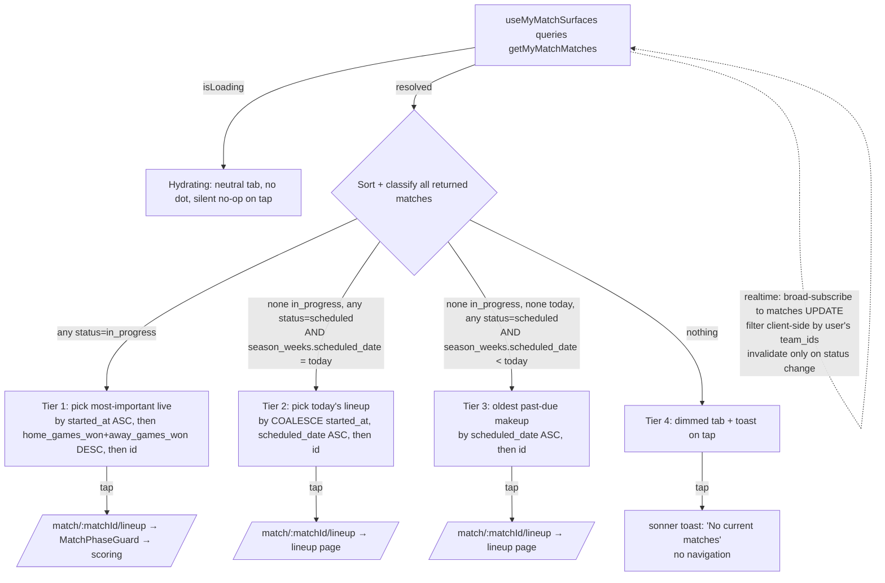

# feat: Live-match jump-in ("My Match" shortcut)

> **Revision note (2026-05-29):** This plan was rewritten the same day after a multi-persona review caught five schema/code-fact errors and several mechanism gaps. The structure is unchanged; the corrections (real column names, real route shape, real toast library, realtime strategy, existing static-link removal, hydrating posture, explicit status non-goals) are folded inline. See the bottom of this file for the diff summary.

## Overview

Build the "My Match" shortcut described in the brainstorm — two always-visible surfaces (bottom-nav tab on mobile, drawer section everywhere) that collapse the **My Teams → Schedule → match → lineup** chain to one tap. The bottom-nav resolves a four-tier ladder (`live → today → past-due makeup → no-current-matches toast`) into a single auto-routed destination; the drawer section lists every relevant match for the user to pick. Detection is team-scoped (matches the user is rostered on, not league-wide spectator scope). Routing is universal: every tap lands on the match's lineup page, which already auto-redirects to scoring when locked.

No database schema changes. No new migrations. All in-app frontend + a new team-scoped query + a new aggregate hook with realtime.

## Problem Frame

The "most used button in the game" doesn't exist yet — players walk a multi-step nav chain every league night to get to their active match, and the same chain to get *back* to scoring after a side trip (writing a message, checking standings). Two prior "quick jump" attempts on Teams/Schedule pages fell short because they're page-local rather than always-visible chrome. (See origin: `docs/brainstorms/2026-05-29-live-match-jumpin-requirements.md` — Problem Frame.)

## Requirements Trace

- **R1. Bottom-nav "My Match" tab (mobile).** Repurpose the existing Live tab slot in `src/components/layout/BottomTabBar.tsx`. Four-tier ladder + a fifth "hydrating" posture (loading) resolves to one auto-routed destination per tap. Accent-dot live indicator only on Tier 1. (Units 1, 2, 3.)
- **R2. Drawer "My Match" section.** New section in `src/components/layout/AppDrawer.tsx` mirroring `OperatorSection` (flat-when-1 / list-when-2+ / hidden-when-empty). Row format: `My Team · vs Opponent · {Live | Today | Makeup (date)}`. Replaces the existing static `DrawerLink to="/my-match"` in `PlayerSection`. (Units 1, 2, 4.)
- **R3. Desktop sidebar parity.** Update `src/components/layout/AppSidebar.tsx`'s existing static My Match `SidebarLink` to follow the same four-tier ladder as the bottom-nav (not the drawer's broader list). (Units 1, 2, 5.)
- **R4. Multi-live handling.** Bottom-nav auto-picks the most-important live match; drawer lists all so the user can pick. (Units 2, 3, 4.)
- **R5. Detection scope.** User is on `team_players` of either team (`home_team_id` OR `away_team_id`). Captains naturally covered when rostered. (Unit 1.)
- **R6. Routing destination is always the lineup page.** No per-surface routing logic; `MatchLineup`'s existing `MatchPhaseGuard` redirects to scoring when locked. (Units 3, 4, 5.)
- **R7. Realtime updates.** Surfaces stay fresh as matches transition (`scheduled → in_progress → completed`). (Unit 2.)

## Scope Boundaries

**Non-goals:**
- No changes to the scoring engine, match prep, `MatchPhaseGuard`, lineup-locking semantics, or `/live` (`SpectateLiveMatches`).
- No new database migrations or schema changes.
- No changes to the `/my-match` route's current placeholder file (`src/player/MyMatch.tsx`) — it stays a placeholder until the future Upcoming Matches brainstorm rebuilds it.
- No Dashboard card, sticky banner, or other competing always-visible chrome — bottom-nav + drawer are the only surfaces.
- No new visual chrome for the **future captain-doorbell indicator** that will also live on the bottom-bar (see `project_onboarding_cold_start_brainstorm`) — coordinate visual language only.
- **Status coverage is explicitly limited to `scheduled` + `in_progress`.** The schema defines four other statuses (`awaiting_verification`, `forfeited`, `postponed`, `completed`); none are actively written by current app code paths (verified by grep — only `scheduled`, `in_progress`, `completed` appear in `src/`). `completed` matches are filtered out of detection. `awaiting_verification`, `forfeited`, `postponed` are out of scope and will simply not surface in either nav until a follow-up brainstorm decides how they should — the brainstorm-mandated `feedback_forfeit_is_consequential` deserves its own UI treatment, not a passive nav-list slot.
- **Existing page-local "quick jump to" buttons on Teams + Schedule pages** stay where they are at v1. The brainstorm called them "fall short" — the new always-visible chrome is the strict improvement; the page-local buttons can be removed in a follow-up cleanup once the new chrome is in production and proven.

### Deferred to Separate Tasks

- **`/my-match` page redesign** → future "Upcoming Matches" brainstorm (cross-team week-at-a-glance).
- **Multi-live swap UI** → PR #157's scoring gear workstream (the natural "I'm on the wrong one, switch me" host).
- **Captain-not-rostered detection** → revisit if real use shows it bites.
- **Captain-doorbell indicator** → onboarding cascade workstream; coordinated visually but not built here.
- **Page-local quick-jump cleanup on Teams/Schedule pages** → small follow-up after the new chrome is proven.
- **`forfeited` / `awaiting_verification` / `postponed` status handling** → separate brainstorm when those statuses go live in app code.
- **Pre-launch RLS pass** → the realtime broad-subscribe strategy (see Unit 2) must be tightened or replaced with per-team_id channels as part of the pre-launch RLS scope (`PRE_LAUNCH_CHECKLIST.md`).

## Context & Research

### Relevant Code and Patterns

- `src/components/layout/BottomTabBar.tsx` — the tab slot being repurposed. Existing structure: 4 player tabs (My Teams, Live, Messages, Profile) + a conditional Manage tab for operators. The Live tab today routes to `/live` (spectator scoreboards); this plan repoints it.
- `src/components/layout/AppDrawer.tsx` — `OperatorSection` (lines 173–206) is the structural template for the new "My Match" section: section header, flat-when-1, list-when-2+, hidden-when-empty, border-separated. `pickVisibleOrgs` + 4-cap is operator-specific and does **not** apply here (My Match's realistic max is 2–3 matches; no overflow scaffolding needed). The drawer's exported function is `AppDrawer` itself (line 61), not a nested `Content`. **`PlayerSection` already contains a static `<DrawerLink to="/my-match" label="My Match" />` at line 163** — Unit 4 explicitly removes it (the new section replaces it).
- `src/components/layout/AppSidebar.tsx` — desktop counterpart; **`SidebarPlayerSection` already contains a static `<SidebarLink to="/my-match" label="My Match" />` at line 117** — Unit 5 replaces that static item with a state-driven entry.
- `src/api/queries/matches.ts` — has `getLiveMatchesForMember(memberId)` at line 249 which is **league-scoped** (returns all live matches in any league the member is on a team in; used by `SpectateMyLiveMatches`). Filters on `.eq('member_id', memberId)` against the `team_players` join (confirms the canonical column name is `member_id`, not `user_id`). The existing helper also demonstrates that `scheduled_date` lives on `season_weeks` (joined via `season_week_id`) and is hoisted client-side after the query (`match.season_week?.scheduled_date`, lines 175/184/228/295).
- `src/api/hooks/useMatchPhase.ts` — per-`matchId` hook for routing-destination freshness (e.g., the lineup page learning that the match transitioned). Useful for the destination side, not detection.
- `src/realtime/useMatchRealtime.ts` — per-match scoring-channel realtime, hardened in PR #143 (heartbeat reconnect, catch-up refetch, polling fallback). **Do not extend it** for chrome detection — it's tuned for single-match scoring; chrome detection is multi-match. Apply its lessons (minimal deps, ref-stored callbacks, classified subscribe events, calm UI) to the new aggregate hook in Unit 2.
- `src/player/MatchLineup.tsx` + `src/components/match/MatchPhaseGuard.tsx` — the universal routing destination. The guard already redirects `in_progress` matches to scoring.
- `src/player/SpectateMyLiveMatches.tsx` — exists, proves out the live-matches-for-this-member pattern on the spectator side; mirror its query shape for the new team-scoped variant.
- `src/navigation/NavRoutes.tsx` — line 219 confirms the lineup route is `match/:matchId/lineup` (not `:id`).
- **Toast library: `sonner`** (`package.json`'s `sonner ^2.0.7`, ~52 import sites across `src/`). Existing call sites include `src/operator/TeamManagement.tsx` (line 30: `import { toast } from 'sonner'`). The plan uses `sonner` throughout.

### Institutional Learnings

- **Act-now signals belong on always-visible chrome.** Refines the older "drawer-internal only" rule for messaging (see `project_messaging_low_priority` updated note). A live match is the canonical act-now signal — the bottom-bar tab is the correct surface, and the indicator must clear when handled (Tier 4 + match-completed states drop the dot).
- **Match realtime resilience is built, but per-match.** `useMatchRealtime` (PR #143) is for one match. Build a separate light hook for nav-chrome detection; do not thread chrome through the scoring-channel hook.
- **Schema changes on realtime-published tables require `supabase stop && supabase start`.** This plan does **not** add the `matches` table to any publication (it's already in there — proven by existing realtime). No restart step needed.
- **OperatorSection 4-cap pattern is operator-shape-specific.** My Match's realistic ceiling is 2–3 matches (regular + makeup, plus the rare 3-team-on-the-same-night case). Don't copy the cap or the (unbuilt) overflow link.
- **Coordinate bottom-bar visual language with the forthcoming captain-doorbell indicator.** Both want an "act-now" cue. The accent dot lives on the My Match tab; the doorbell will live on whichever tab the cascade picks. Keep the visual vocabulary aligned.

### External References

None — frontend nav repurpose + new team-scoped query inside well-established patterns. No external research warranted.

## Key Technical Decisions

| Decision | Rationale |
|---|---|
| **New team-scoped query** `getMyMatchMatches(memberId)` in `src/api/queries/matches.ts` | Cleaner than client-side filtering on the league-scoped helper, smaller payload, lets the SQL do the team-membership join once at the database. |
| **New aggregate hook** `useMyMatchSurfaces(memberId)` | Owns: (a) the query, (b) the realtime subscription, (c) the tier-resolution pure function, (d) the unfiltered drawer-list shape. Returns `{tier, destinationMatchId, showLiveDot, drawerItems, isHydrating, isError}`. BottomTabBar + AppSidebar consume the resolved tier state; AppDrawer consumes `drawerItems`. The hook is the single contract — consumers don't re-run tier-to-destination logic. |
| **Lightweight realtime, not `useMatchRealtime`** | The latter is per-match-tuned. The new hook subscribes broadly to `matches` UPDATE events, filters client-side by the user's team_ids, and invalidates ONLY when the payload's `status` field changed (compare `payload.new.status !== payload.old.status`). Reuse hardening lessons (minimal deps `[memberId]`, ref-callbacks, classified subscribe events, calm UI). |
| **Canonical "live" predicate: `status = 'in_progress'`** | Verified: `prep_match` RPC writes `status = 'in_progress'` to the DB (`supabase/migrations/20260502000002_prep_match_rpc_renamed_columns.sql` line 65; hardened in `20260504000000_harden_prep_match_write_guards.sql` line 71). The stale comment in `matches.ts:192–197` predates the hardened prep flow. `status = 'in_progress'` is the canonical app contract and matches Tier 1 cleanly. |
| **Multi-live tiebreak**: `started_at ASC NULLS LAST` → `(home_games_won + away_games_won) DESC` → `id ASC` | Deterministic and uses columns that **actually exist** on the matches table (verified — no `*_games_lost` columns). Primary key matches the user-facing rule ("oldest started"). Secondary uses `home_games_won + away_games_won` as the "total games scored on either side" proxy for "furthest along" (since each loss is the opponent's win). Tertiary `id` is a stable last-resort. The dominant captain-juggle case (regular + makeup starting within minutes of each other) is captured by the secondary. |
| **Past-due makeup predicate: `status = 'scheduled' AND season_weeks.scheduled_date < today`** | Simplest possible. Verified: there is no reschedule mechanism in the current codebase (no `reschedule` flows, no `rescheduled_from` column — grepped). If a `postponed`-based reschedule flow is built later, revisit. Note: `scheduled_date` lives on `season_weeks`, joined via `season_week_id`; the existing helper hoists it client-side. |
| **Routing destination is always the `/match/:matchId/lineup` route** | One universal rule across all three surfaces and all three actionable tiers. `MatchPhaseGuard` already redirects to scoring when locked. Single chokepoint for match-phase routing logic. |
| **Toast library: `sonner`** | The project's actual toast library (`package.json` + `src/operator/TeamManagement.tsx:30` model). On Tier 4 tap, fire `toast('No current matches')` and do not navigate. |
| **Accent dot, not pulse** | Default treatment; distinct from the Messages tab's count badge. Includes a visually-hidden screen-reader label (`aria-label` augmented with "Live match in progress" while Tier 1). Pulse can swap in later as a UI follow-up if needed. |
| **Realtime broad-subscribe + client-side filter** | Per Supabase realtime constraint: postgres_changes channels accept a single `eq`/`in`/etc. filter per binding, not a `team_id IN (...) OR ...` shape. Realistic per-user matches-row volume is tiny; broad-subscribe + client-side filter is the right tradeoff. Status-change guard in the callback drops ~99% of invalidation churn from per-game writes to `home_games_won`/`away_games_won` (which `updateMatchRunningTotals` does on every confirmed game). |
| **Loading state has its own posture (`hydrating`)** | While the hook's query is loading on first mount, the tab/sidebar render **neutral** (no dim, no dot) and tap is a silent no-op (no navigation, no toast). This prevents the reload-mid-match false-negative the adversarial review surfaced. Resolves to Tier 1–4 once loading completes. |

## Open Questions

### Resolved During Planning

- *Detection: new query vs filter on existing helper?* → New team-scoped query.
- *Hook architecture.* → New aggregate hook `useMyMatchSurfaces`; do not extend `useMatchPhase` or `useMatchRealtime`.
- *Canonical "live" predicate.* → `status = 'in_progress'` (verified against prep_match RPC writes).
- *Multi-live tiebreak.* → Pinned with real column names.
- *Past-due makeup predicate.* → Pinned simple; verified no reschedule mechanism exists.
- *Trigger asymmetry between surfaces?* → No asymmetric — both consume the same data; bottom-nav *resolves* the ladder, drawer *lists*.
- *Visual cue for live indicator.* → Accent dot + augmented `aria-label`.
- *DB schema changes?* → None.
- *Toast library.* → `sonner`.
- *Lineup route param.* → `:matchId`.
- *Loading state.* → New `hydrating` posture (neutral, silent no-op).
- *Realtime IN-filter constraint.* → Broad-subscribe + client-side filter + status-change guard.
- *Existing static My Match entries (`PlayerSection` in AppDrawer, `SidebarPlayerSection` in AppSidebar).* → Removed in Units 4 and 5 (the new section / state-driven entry replaces each).
- *Statuses out of scope.* → `awaiting_verification`, `forfeited`, `postponed` deferred to follow-up.

### Deferred to Implementation

- The exact channel subscription shape — `postgres_changes` event filter syntax for the broad-subscribe (no filter beyond `event: 'UPDATE'`, `table: 'matches'`). Implementer confirms against current `supabase-js` version.
- The exact `sonner` call (`toast`, `toast.info`, etc.) — match the project's existing tone.
- The exact accent-dot Tailwind token — pick something that doesn't collide with the Messages tab's `bg-destructive` badge palette.
- Whether to dedupe the realtime subscription across the three consumers via React context (one channel per `memberId`) or accept that BottomTabBar + AppSidebar may each open a channel on mobile (AppSidebar exists in the DOM under `lg:hidden`/`lg:flex` — depends on implementation). Judge at wiring time; the realistic subscription count is 1–2 and the cost is small.

## High-Level Technical Design

> *This illustrates the intended approach and is directional guidance for review, not implementation specification.*

**Four-tier ladder + hydrating posture (bottom-nav state machine):**



**Drawer IA after Unit 4 lands** (left-to-right top-to-bottom):

```
PlayerSection (nav links — My Match link REMOVED, others stay)
  ├── My Teams
  ├── Stats
  ├── Rules
  ├── Messages
  └── Profile

MyMatchSection (NEW — hidden when 0 matches)
  ├── Header: "My Match"
  ├── (rows: My Team · vs Opponent · {Live | Today | Makeup (Apr 7)})
  └── (1 → flat | 2+ → list | 0 → section omitted)

OperatorSection (operators only — unchanged)
  └── (orgs and their actions)
```

## Implementation Units

- [ ] **Unit 1: Team-scoped detection query**

**Goal:** Add `getMyMatchMatches(memberId)` to the queries layer — returns every match where the user is on `team_players` of the home or away team, filtered to the three actionable statuses (`in_progress` regardless of date, `scheduled` with `season_weeks.scheduled_date <= today`). Excludes future-scheduled matches and `completed`/`forfeited`/`awaiting_verification`/`postponed` matches.

**Requirements:** R5.

**Dependencies:** None.

**Files:**
- Modify: `src/api/queries/matches.ts`
- Test: `src/api/queries/__tests__/matches.test.ts` (the existing `__tests__/` subfolder is the project's queries convention; e.g., `src/api/queries/__tests__/thresholdLookup.test.ts`).

**Approach:**
- Query shape (mirror `getLiveMatchesForMember`'s structure):
  - SELECT matches with `home_team`, `away_team` (name), and `season_week` (`scheduled_date`) joined.
  - JOIN `team_players` on `team_players.team_id IN (matches.home_team_id, matches.away_team_id)`.
  - WHERE `team_players.member_id = memberId` (the actual column name — confirmed against schema + the existing helper).
  - WHERE `status IN ('in_progress', 'scheduled')`.
  - WHERE `status = 'in_progress' OR season_weeks.scheduled_date <= today` (the `<=` lets Tier 2 today's-scheduled and Tier 3 past-due makeups both flow through).
  - Use the existing helper's pattern for hoisting `scheduled_date` from `season_week` onto the row shape client-side (the existing query returns `season_week: {scheduled_date}`; the function spreads `scheduled_date: match.season_week?.scheduled_date` for downstream consumers).
- Return type: `MatchWithDetails[]` extended with explicit `home_team: { team_name }` and `away_team: { team_name }` (already present on the existing helper's join). Unit 4's drawer rows depend on these.
- Do **not** sort or classify in SQL — return the raw set; classification lives in Unit 2 (one logic source).
- Do **not** modify or deprecate the existing `getLiveMatchesForMember` — it remains the spectator-page query.

**Patterns to follow:**
- `getLiveMatchesForMember` in the same file (lines 249+) — same join shape, just team-scoped instead of league-scoped, and includes `scheduled` (not just `in_progress`).

**Test scenarios:**
- *Happy:* member on a team with one `in_progress` match → returns it.
- *Happy:* member on a team with `season_weeks.scheduled_date = today` and `status='scheduled'` → returns it.
- *Happy:* member on a team with a past-due (`scheduled_date < today`) `scheduled` match → returns it (makeup candidate).
- *Edge:* member on two teams both `in_progress` → returns both.
- *Edge:* match where user is rostered on NEITHER team → excluded.
- *Edge:* `status = 'completed'` with `scheduled_date = today` → excluded.
- *Edge:* `status = 'scheduled'` with `scheduled_date > today` (future) → excluded.
- *Edge:* `status = 'awaiting_verification'`, `'forfeited'`, `'postponed'` → all excluded (out of scope per Scope Boundaries).
- *Edge:* member with no `team_players` rows → returns empty.
- *Edge:* user on BOTH teams of the same match (theoretical double-duty) → returned once, not duplicated.
- *Error:* `memberId` is null/empty → returns empty without throwing.

**Verification:**
- New query is added next to `getLiveMatchesForMember`; the existing helper is unchanged.
- All test scenarios pass.

---

- [ ] **Unit 2: Aggregate hook `useMyMatchSurfaces`**

**Goal:** New aggregate hook that wraps Unit 1's query, owns the realtime subscription with a status-change guard, and resolves both:
- **Bottom-nav state**: `{tier: 1 | 2 | 3 | 4, destinationMatchId: string | null, showLiveDot: boolean, isHydrating: boolean, isError: boolean}`.
- **Drawer list**: `Array<{matchId, teamName, opponentName, label: 'Live' | 'Today' | 'Makeup (Apr 7)', destinationPath}>`, sorted by tier priority (live first, then today, then makeup), then by the same tiebreak used for bottom-nav.

**Requirements:** R1, R2, R3, R4, R7.

**Dependencies:** Unit 1.

**Files:**
- Create: `src/api/hooks/useMyMatchSurfaces.ts`
- Test: `src/api/hooks/__tests__/useMyMatchSurfaces.test.tsx` (the existing `__tests__/` subfolder is the hooks convention; e.g., `src/api/hooks/__tests__/computePhaseRefetchInterval.test.ts`).

**Approach:**
- **`memberId` short-circuit.** When `memberId` is null/undefined (logged-out or pre-hydration of `useUserProfile`), pass `enabled: false` to TanStack Query. Do NOT open a realtime channel. Return `{tier: 4, destinationMatchId: null, showLiveDot: false, isHydrating: false, isError: false, drawerItems: []}` so consumers render the no-match posture without firing the toast on tap (consumers gate the toast behind `isLoggedIn && !isHydrating && tier === 4`).
- **TanStack Query wrapper** around `getMyMatchMatches(memberId)`. Query key: `['myMatchMatches', memberId]`.
- **Tier resolution (pure exported function over the query result)**:
  1. Filter `status = 'in_progress'`. If any → Tier 1. Sort by `started_at ASC NULLS LAST`, then `(home_games_won + away_games_won) DESC`, then `id ASC`. Pick first.
  2. Else filter `status = 'scheduled' AND scheduled_date === today`. If any → Tier 2. Sort by `COALESCE(started_at, scheduled_date) ASC, id ASC` (so unstarted-today matches sort by their scheduled date, not last). Pick first.
  3. Else filter `status = 'scheduled' AND scheduled_date < today`. If any → Tier 3. Sort by `scheduled_date ASC` (oldest past-due first), then `id ASC`. Pick first.
  4. Else Tier 4.
- **Drawer list shape**: every result, sorted by `(tierOf(match) ASC, sameTiebreakKeysAsAbove)`. Each item gets a label derived from its tier (`'Live'`, `'Today'`, `'Makeup (Apr 7)'` — date formatted from `scheduled_date`) and a `destinationPath = `/match/${matchId}/lineup\``.
- **Hydrating posture.** When `isLoading && memberId` → return `{... isHydrating: true, tier: 4, drawerItems: [], showLiveDot: false}`. Consumers use `isHydrating` to render a neutral state (not dimmed) and treat tap as a silent no-op (no toast, no nav).
- **Realtime subscription**:
  - A Supabase channel subscribed to `postgres_changes` on the `matches` table, `event: 'UPDATE'`, no row filter (per the Supabase IN-filter constraint).
  - On each event, check the payload: only invalidate the query if `payload.new.status !== payload.old.status`. This drops invalidation churn from per-game `home_games_won`/`away_games_won` writes (`updateMatchRunningTotals` writes on every confirmed game).
  - Hard-won realtime lessons to mirror:
    - Subscription effect deps: `[memberId]` only.
    - Callbacks in refs to avoid re-subscription churn.
    - Classify subscribe events (SUBSCRIBED / CHANNEL_ERROR / TIMED_OUT / CLOSED). On `SUBSCRIBED`, do a catch-up refetch. On `CLOSED`/`TIMED_OUT`, the channel auto-retries via supabase-js; the next `SUBSCRIBED` catches up.
    - Cleanup unsubscribes on unmount.

**Execution note:** Test-first on the tier-resolution pure function — it's the heart of every consumer. Realtime wiring is integration-shaped and lands after the resolver is locked.

**Patterns to follow:**
- `src/api/hooks/useMatchPhase.ts` for the channel-setup primitives (event subscription + cleanup).
- `src/realtime/useMatchRealtime.ts` for the hardening lessons; **do not extend or import it**.

**Test scenarios:**
- *Happy:* 1 `in_progress` match → Tier 1, destination = its id, dot on.
- *Happy:* 0 `in_progress`, 1 today scheduled → Tier 2, destination = its id, dot off.
- *Happy:* 0 in_progress, 0 today, 1 past-due scheduled → Tier 3, destination = its id, dot off.
- *Happy:* nothing → Tier 4, destination null, dot off.
- *Edge:* 2 `in_progress` matches → Tier 1, destination = the oldest `started_at`. Drawer list has BOTH rows.
- *Edge:* 2 `in_progress` with identical `started_at` → tiebreak resolves on `(home_games_won + away_games_won) DESC`, then `id ASC`. Deterministic across multiple calls.
- *Edge:* `in_progress` match + today scheduled coexist → Tier 1 (live wins). Drawer shows BOTH (live row first, today row second).
- *Edge:* `in_progress` match + past-due makeup coexist → Tier 1. Drawer shows both.
- *Edge:* 1 today's + 1 past-due makeup, no live → Tier 2 (today wins over makeup). Drawer shows today first, makeup second.
- *Edge:* loading state with `memberId` set → returns `isHydrating: true`, Tier 4 posture but the consumer doesn't toast.
- *Edge:* `memberId` is null/undefined → returns Tier 4 posture WITHOUT firing the query or opening a channel.
- *Edge:* query error → returns `isError: true`, Tier 4 posture (no toast at hook level).
- *Integration:* realtime UPDATE on `matches` where `payload.new.status === payload.old.status` → no invalidation (status-change guard works).
- *Integration:* realtime UPDATE flipping a scheduled match to `in_progress` → query invalidates → next render flips Tier 2 → Tier 1.
- *Integration:* realtime UPDATE flipping an `in_progress` match to `completed` → query invalidates → if it was the destination, recompute (drop to next tier or Tier 4).
- *Integration:* `memberId` changes between renders → subscription tears down and re-subscribes once with the new id.
- *Integration:* member team membership changes mid-session (added to a new team's roster) → NOT auto-detected (the query key includes `memberId` only; team_players changes don't invalidate by themselves). Documented limitation: a roster add mid-session won't surface until the next realtime invalidation or a page reload. Acceptable at v1.

**Verification:**
- Tier-resolution is a pure exported function with isolated unit tests.
- Realtime subscription mounts once per `memberId`, cleans up on unmount, recovers from `CLOSED` events via supabase-js's auto-reconnect + the `SUBSCRIBED` catch-up.
- TanStack Query cache key is stable.

---

- [ ] **Unit 3: Repurpose BottomTabBar Live tab → My Match**

**Goal:** Rename the existing Live tab to "My Match," point its destination at the resolved match's lineup route, add the accent-dot live indicator (Tier 1 only), wire the hydrating posture, and dim + toast on Tier 4.

**Requirements:** R1, R3 (mobile half), R4 (auto-pick), R6.

**Dependencies:** Unit 2.

**Files:**
- Modify: `src/components/layout/BottomTabBar.tsx`
- Test: `src/components/layout/BottomTabBar.test.tsx` (co-located, following the `AppDrawer.test.tsx` precedent already in that folder; this file is new).

**Approach:**
- Consume `useMyMatchSurfaces(member?.id)` next to the existing `useUnreadMessageCount` call (same `member` source).
- Replace the existing Live tab entry. Behavior by state:
  - **Hydrating** (`isHydrating === true`): tab renders neutral (same opacity as other inactive tabs, no dot); tap is a silent no-op (`onClick={(e) => e.preventDefault()}`, no toast).
  - **Tier 1**: `<Link to={`/match/${destinationMatchId}/lineup`}>`; accent dot on icon; the icon's `<span>` gets a visually-hidden " Live match in progress" sr-only suffix (or the tab's `aria-label` is augmented).
  - **Tier 2 / 3**: `<Link to={`/match/${destinationMatchId}/lineup`}>`; no dot.
  - **Tier 4**: render as `<button>` (not `<Link>`); `onClick` fires `toast('No current matches')`; tab visually dimmed (`opacity-60`); `aria-disabled="true"`.
  - **Error** (`isError === true`): same posture as Tier 4 (silent dim + toast on tap with a different message, e.g., `toast.error('Couldn\\'t check your matches.')`).
- Active patterns retained (the tab highlights on `/my-match`, `/match/:matchId/lineup`, `/match/:matchId/score`).
- The `/live` route stays as `SpectateLiveMatches` — no changes there. The Live tab's old destination is no longer reachable from the bottom-nav; the route is preserved (direct URL, future Upcoming Matches page, and existing in-page links).

**Patterns to follow:**
- The existing `playerTabs` array structure + `TabItem` interface.
- The existing badge styling (for the dot positional reference — different palette so it doesn't read as a count).

**Test scenarios:**
- *Happy:* Tier 1 → tap navigates to the lineup page of the live match's id.
- *Happy:* Tier 2 → tap navigates to today's match lineup page.
- *Happy:* Tier 3 → tap navigates to past-due makeup's lineup page.
- *Happy:* Tier 4 → tap does NOT navigate; `sonner` `toast('No current matches')` fires.
- *Happy:* Tier 1 → accent dot is visible; `sr-only` augment is present.
- *Edge:* Tier 2 / 3 → no dot.
- *Edge:* Tier 4 → tab is visually dimmed (lower opacity than active tabs); `aria-disabled` is set.
- *Edge:* **Hydrating** → tab is neutral (not dimmed, no dot); tap is silent no-op (no toast).
- *Edge:* tier transitions live → today (match completes during session) → dot disappears, destination updates without page reload (via the realtime invalidation from Unit 2).
- *Edge:* hook returns `isError: true` → fall back to Tier 4 posture (no navigation, error-toast on tap); bar doesn't crash.
- *Integration:* tap navigates to `/match/:matchId/lineup` exactly (verify URL — don't re-verify `MatchPhaseGuard`'s redirect, that's its own coverage).
- *Integration:* operator users still get the Manage tab (the conditional 5th tab is unchanged).

**Verification:**
- Mobile tab bar shows "My Match" label.
- All five postures (T1, T2, T3, T4, Hydrating) verified.
- The existing `/live` route remains accessible via direct URL.

---

- [ ] **Unit 4: AppDrawer "My Match" section (replaces existing static link)**

**Goal:** Add a new "My Match" section to `AppDrawer.tsx`, structurally mirroring `OperatorSection`, and **remove the existing static `<DrawerLink to="/my-match" label="My Match" />` in `PlayerSection`** (line 163). The new section uses Unit 2's `drawerItems` + `isHydrating`. Single-purpose tap per row → that match's lineup page. Section hidden entirely when no items and not hydrating.

**Requirements:** R2, R4 (drawer half), R6.

**Dependencies:** Unit 2.

**Files:**
- Modify: `src/components/layout/AppDrawer.tsx`
- Test: `src/components/layout/AppDrawer.test.tsx` (exists).

**Approach:**
- **Remove** the existing line in `PlayerSection`: `<DrawerLink to="/my-match" label="My Match" />` (currently at line 163). The new section subsumes it.
- Add a new `MyMatchSection({ items, isHydrating }: { items: DrawerItem[]; isHydrating: boolean })` component co-located in the same file, structurally cloned from `OperatorSection`:
  - `if (!isHydrating && items.length === 0) return null;` (hidden when empty and not loading).
  - If `isHydrating` and `items.length === 0`: render the section header alone with no rows (gives a stable layout target during the brief loading window without a misleading "no matches" message).
  - Section header: "My Match" (uppercase muted, same chrome as Operator section header).
  - Border-separated section (`mt-6 border-t pt-4`).
  - 1 item → flat row.
  - 2+ items → list of rows.
- Each row: `<SheetClose asChild><Link to={item.destinationPath}>...</Link></SheetClose>` (taps auto-close the drawer per `DrawerLink` convention).
- Row content: `<My Team> · vs <Opponent> · <Label>` where label is `Live` / `Today` / `Makeup (Apr 7)`.
- Section placement: above `<OperatorSection>`, below the cleaned-up `PlayerSection`. Drawer IA after this lands is documented in the "High-Level Technical Design" section above.
- Consume `useMyMatchSurfaces(member?.id)` inside the `AppDrawer` exported function (line 61), next to `useOrganizations` (line 65) and `useUserProfile`.

**Patterns to follow:**
- `OperatorSection` in the same file (lines 173–206) — structural template.
- `DrawerLink` styling and `SheetClose` wrapping for rows.

**Test scenarios:**
- *Happy:* 1 item → section renders, flat row visible, shows team + opponent + label.
- *Happy:* 2 items → list of rows, all visible, ordered by tier (live first, then today, then makeup).
- *Happy:* 0 items and not hydrating → section is NOT rendered (no header, no border).
- *Happy:* clicking a row navigates to that match's lineup page and the drawer auto-closes (SheetClose).
- *Edge:* user on two teams playing the same night → both rows visible with different opponents (opponent disambiguates).
- *Edge:* row label reflects state: `"Live"` for `in_progress`, `"Today"` for today's scheduled, `"Makeup (Apr 7)"` for past-due (with the original `scheduled_date`).
- *Edge:* hydrating with 0 items → section header visible, no rows (stable layout during load).
- *Edge:* the existing static `<DrawerLink to="/my-match" />` is GONE from PlayerSection (verify by absence — the drawer doesn't show two "My Match" entries).
- *Integration:* Operator section still renders below My Match for operators (existing operator IA preserved).

**Verification:**
- Drawer shows the My Match section above Operator, with correct flat/list/hidden behavior.
- The old static `/my-match` link in `PlayerSection` is removed.
- Row taps land on the lineup page with the drawer closed.

---

- [ ] **Unit 5: AppSidebar parity (desktop) — replaces existing static link**

**Goal:** Replace the existing static `<SidebarLink to="/my-match" label="My Match" />` in `SidebarPlayerSection` (line 117) with a state-driven entry that follows the same four-tier ladder + hydrating posture as the bottom-nav (not the drawer's listing behavior — the sidebar is the desktop-shaped version of the tab, not of the section).

**Requirements:** R3, R6.

**Dependencies:** Unit 2.

**Files:**
- Modify: `src/components/layout/AppSidebar.tsx`
- Test: `src/components/layout/AppSidebar.test.tsx` (co-located, new).

**Approach:**
- In `SidebarPlayerSection` (the function that renders the player nav `<ul>`), **replace** the static `<SidebarLink to="/my-match" label="My Match" />` at line 117 with a new `<MyMatchSidebarEntry />` component (co-located in the same file).
- `MyMatchSidebarEntry` consumes `useMyMatchSurfaces(member?.id)` from the parent or pulls it via context; behavior:
  - **Hydrating**: render neutral (same visual as a regular `SidebarLink`), no dot, no `aria-disabled`. Click is a silent no-op.
  - **Tier 1**: state-driven `SidebarLink` with `to={`/match/${destinationMatchId}/lineup`}`; accent dot on; `sr-only` augment.
  - **Tier 2 / 3**: state-driven `SidebarLink` with `to={`/match/${destinationMatchId}/lineup`}`; no dot.
  - **Tier 4**: render as a `<button>` (NOT `<Link>` — `aria-disabled` on a `<Link>` does not prevent Enter-key activation in browsers). `aria-disabled="true"`, `opacity-60`; `onClick` fires `toast('No current matches')`.
- Sidebar keeps "My Match" label across all postures — desktop has more space than mobile, no dynamic label.
- Consumers (BottomTabBar in Unit 3 + this) read `destinationMatchId` directly from the hook — there is **no** shared `tierToDestination` helper to factor (the hook IS the contract).

**Patterns to follow:**
- The existing `SidebarLink` component shape (same file).
- Match BottomTabBar's Tier 4 = `<button>` pattern (don't use `<Link>` with `aria-disabled`).

**Test scenarios:**
- *Happy:* Tier 1 → link points to the lineup route of the live match; accent dot visible; sr-only label.
- *Happy:* Tier 2 / 3 → link points to the lineup route; no dot.
- *Happy:* Tier 4 → renders as `<button>`, dimmed + `aria-disabled`; click fires `sonner` toast, no navigation.
- *Edge:* Hydrating → renders neutral; click is silent no-op (no toast, no nav).
- *Edge:* `memberId` is null → renders Tier 4 posture (matches what consumers do when not signed in).
- *Integration:* realtime invalidation flips a scheduled match to `in_progress` → sidebar entry updates to Tier 1 + dot without page reload (driven by TanStack invalidation from Unit 2).

**Verification:**
- Desktop sidebar's My Match entry follows tier-driven behavior end-to-end.
- The static `SidebarLink to="/my-match"` is gone.
- Mobile bottom-nav and desktop sidebar agree on destination (no asymmetry).

## System-Wide Impact

- **Interaction graph:** Three nav components (BottomTabBar, AppDrawer, AppSidebar) all consume `useMyMatchSurfaces`. The hook owns the new team-scoped query + a broad `matches` UPDATE realtime channel with a status-change guard. `MatchLineup` + `MatchPhaseGuard` are the unchanged routing destinations.
- **Error propagation:** Hook-level error → Tier 4 posture across all three surfaces (no navigation, dim, toast on tap with the error-tone variant). Query layer errors propagate via TanStack `isError`; the tier resolver treats errors as empty.
- **Realtime / state lifecycle:** Broad subscription to `matches` UPDATE events, client-side filter by user's `team_ids`, invalidate only on status change. Subscription tears down on unmount and on `memberId` change. Multiple consumer instances may each open a channel — judged acceptable at v1 (1–2 channels per user). No global state.
- **API surface parity:** The existing `getLiveMatchesForMember` remains untouched and continues to serve the spectator page (`SpectateMyLiveMatches`). Two queries coexist with distinct purposes.
- **Integration coverage:** End-to-end mounting test (drawer + nav + sidebar against a mock Supabase client returning canned `matches` rows) proves the three-consumer contract that unit-mocking the hook alone cannot.
- **Unchanged invariants:** Scoring engine, match prep / `prep_match` RPC, `MatchPhaseGuard`'s redirect logic, `useMatchRealtime`'s scoring channel, `/live` route + `SpectateLiveMatches`, `/my-match` placeholder page, the `BottomTabBar`'s Manage tab + Messages badge.

## Risks & Dependencies

| Risk | Mitigation |
|------|------------|
| Broad realtime subscription invalidation noise from per-game `home_games_won` / `away_games_won` writes | Status-change guard in the callback (`payload.new.status !== payload.old.status`) drops ~99% of invalidation churn. Documented in Unit 2 Approach. |
| Pre-launch RLS-off + broad realtime subscription = client receives status-change events for matches across ALL orgs/leagues | Acceptable pre-launch (client-side filter restricts what actually triggers invalidation; server-side query is correctly team-scoped). **Add to `PRE_LAUNCH_CHECKLIST.md`: tighten realtime channel scope or replace with per-team_id channels as part of the RLS pass.** |
| Visual collision with the future captain-doorbell indicator (planned for the same bottom-bar) | Coordinate the accent-dot palette + slot now: the My Match dot lives on the My Match tab's icon; the doorbell will live on a different tab. Document the slot allocation in code comments when implementing Unit 3. Revisit when the cascade ships. |
| Member team membership changes mid-session (added to a new team's roster) are not auto-detected | Documented limitation: the query key is `memberId`-only; `team_players` changes do not invalidate. Surface on next realtime invalidation or page reload. Revisit only if real-world use shows it bites. |
| Tap-during-tier-transition lands on a `completed` match's lineup page | `MatchLineup`/`MatchPhaseGuard` should detect `completed` status and redirect to `/live` (existing fallback). Verify at integration test time. Not a new problem this plan introduces. |
| Multi-tab same-user realtime: two tabs each open a channel; UPDATE events fire twice per tab; tabs may briefly disagree on destination during transitions | Document as a known limitation. Each tab's hook is independently correct on next realtime tick. Singleton-by-context is a follow-up if it bites. |
| Static My Match link removal (Units 4 + 5) could break user muscle memory | The new section/state-driven entry is in the same drawer/sidebar position, with the same label. Visual disruption is minimal; the new behavior is strictly more useful (tap goes to your actual match). |

## Documentation / Operational Notes

- **No DB migration step.** No SQL changes; `matches` is already in the realtime publication. No `supabase stop && supabase start` required.
- **Placeholder file `src/player/MyMatch.tsx`** stays as-is — its file header already (correctly) tells the reader that the real feature lives in the bottom-nav + drawer. Optional light header refresh can ride with Unit 3.
- **Coordinate with PR #157 (scoring participation modes + gear).** The multi-live swap UI is deferred to that gear. When this plan ships and that PR is merged, a small follow-up wires the gear's "switch to my other live match" to the same `getMyMatchMatches` query.
- **Pre-launch follow-up:** add a `PRE_LAUNCH_CHECKLIST.md` entry to tighten the realtime channel scope (replace broad-subscribe with per-team_id channels, or apply the RLS publication filter) before going live.
- **Release note copy:** "Tap **My Match** in the bottom nav to jump straight into your live match. The drawer's **My Match** section lists tonight's matches if you're on more than one team."

## Sources & References

- **Origin document:** [`docs/brainstorms/2026-05-29-live-match-jumpin-requirements.md`](../brainstorms/2026-05-29-live-match-jumpin-requirements.md)
- **Related code:**
  - `src/components/layout/BottomTabBar.tsx` (the tab slot being repurposed)
  - `src/components/layout/AppDrawer.tsx` (`OperatorSection` is the structural template at lines 173–206; existing static `My Match` link in `PlayerSection` line 163 is removed by Unit 4)
  - `src/components/layout/AppSidebar.tsx` (`SidebarPlayerSection` line 117 — static link replaced by Unit 5)
  - `src/api/queries/matches.ts` (location for the new team-scoped query; existing `getLiveMatchesForMember` line 249 is the structural template)
  - `src/api/hooks/useMatchPhase.ts` (related but per-match, not detection)
  - `src/realtime/useMatchRealtime.ts` (hardening lessons; do not extend)
  - `src/player/MatchLineup.tsx` + `src/components/match/MatchPhaseGuard.tsx` (routing destination)
  - `src/player/SpectateMyLiveMatches.tsx` (live-matches-for-this-member pattern reference)
  - `src/navigation/NavRoutes.tsx` line 219 (route shape `match/:matchId/lineup` confirmed)
- **Related migrations:**
  - `supabase/migrations/20251130010824_baseline.sql` (schema baseline, including the 6-status `matches_status_check` constraint at line 1535 and the `scheduled_date` column on `season_weeks`)
  - `supabase/migrations/20260502000002_prep_match_rpc_renamed_columns.sql` line 65 — `prep_match` writes `status = 'in_progress'`
  - `supabase/migrations/20260504000000_harden_prep_match_write_guards.sql` line 71 — hardened prep flow writes `status = 'in_progress'`
- **Related PRs:**
  - PR #143 — live-scoring resilience (realtime hardening patterns to mirror; not files to extend)
  - PR #157 — scoring participation modes + gear (future host for multi-live swap)
- **Related memory notes:**
  - `project_live_match_jumpin` — placeholder + intent
  - `project_messaging_low_priority` — act-now signals belong on always-visible chrome
  - `project_match_realtime_resilience_gap` — per-match resilience is built; don't reuse for chrome
  - `project_operator_org_membership_shape` — OperatorSection's 4-cap doesn't apply here
  - `project_onboarding_cold_start_brainstorm` — captain-doorbell indicator coordination
  - `feedback_forfeit_is_consequential` — forfeit deserves its own treatment, not a passive nav slot
  - `project_rls_disabled_until_launch` — pre-launch RLS-off context for the realtime follow-up

---

## Revision diff summary (2026-05-29, post document-review)

Five schema/code-fact errors corrected:
1. Toast library: `react-hot-toast` → `sonner` (the project's actual library).
2. Detection column: `team_players.user_id` → `team_players.member_id`.
3. Date column: `matches.scheduled_date` → `season_weeks.scheduled_date` (joined via `season_week_id`).
4. Tiebreak formula: removed non-existent `*_games_lost` columns; secondary key is `(home_games_won + away_games_won) DESC`.
5. Route param: `/match/:id/lineup` → `/match/:matchId/lineup`.

Mechanism gaps closed:
- Realtime: pinned broad-subscribe + client-side filter + status-change guard (drops invalidation churn from per-game scoring writes).
- New "hydrating" posture for the loading window (prevents reload-mid-match wrong-toast).
- Explicit removal of existing static `<DrawerLink to="/my-match">` (Unit 4) and `<SidebarLink to="/my-match">` (Unit 5) — without this, the drawer/sidebar would show two "My Match" entries.
- `memberId` short-circuit (no query, no subscription when logged out / pre-hydration).
- Accent-dot accessibility (sr-only "Live match in progress" augment when Tier 1).
- Tier 4 sidebar uses `<button>` (not `<Link>` with `aria-disabled`) so keyboard Enter doesn't navigate.
- Tier 2 sort uses `COALESCE(started_at, scheduled_date)` so unstarted-today matches sort by their scheduled date, not last.
- Status non-goals (`awaiting_verification`, `forfeited`, `postponed`) made explicit.
- Speculative shared `tierToDestination` helper removed (the hook owns the contract).
- Unit 3 integration test narrowed (don't re-verify `MatchPhaseGuard`'s redirect — that's already covered).

Verified by codebase greps (not assumed):
- `prep_match` RPC writes `status = 'in_progress'` to the DB row.
- No reschedule mechanism currently exists in the codebase (no `rescheduled_from`, no reschedule UI); the simple makeup predicate is correct for v1.
- Active statuses in `src/`: `scheduled`, `in_progress`, `completed`. The other three are schema-defined but not actively used by app code.
