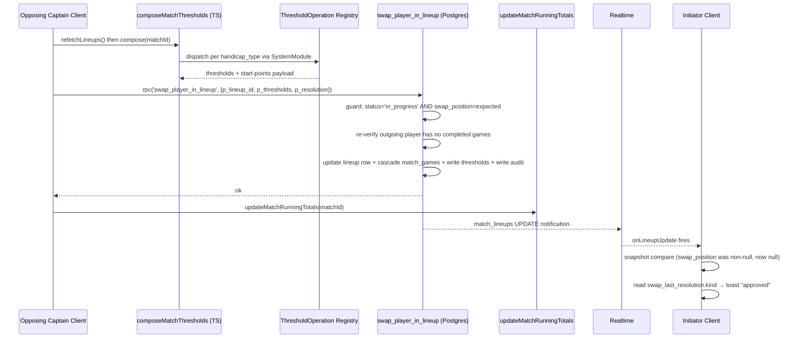

# Lineup Swap with Full Match Recalibration

## Overview

A captain initiates a player swap from the existing player popover on the
live scoreboard; opponent approves; the approved swap atomically updates
the lineup row, cascades the new player ID into unplayed `match_games`
rows, recomputes thresholds through a system-agnostic dispatcher, and
re-derives match totals via the existing `updateMatchRunningTotals`
pipeline so already-confirmed games are scored against the new bands.

A December 2025 implementation shipped the schema and modals but left
the recalibration partial (missing `updateMatchRunningTotals` call) and
leaked a handicap-type heuristic into operation-level code. This plan
finishes the work and fixes the leak.

## Problem Frame

Captains today have no path to swap a player after `matches.status =
'in_progress'`. The existing partial implementation cannot be left in
place once Fargo-handicap leagues actually use it: the threshold recalc
uses a brittle heuristic, never reconsiders Fargo start-points, and
skips the match-totals re-derivation every other mutation performs (see
origin: `docs/brainstorms/2026-06-02-lineup-swap-recalibration-requirements.md`).

## Requirements Trace

- **R1** Captain-initiated swap of an unplayed player (origin Goal 1)
- **R2** Universal opponent approval, no per-system branches (origin Goal 2)
- **R3** Full recalibration on approve — thresholds + Fargo start-points
  via SystemModule dispatch (origin Goal 3)
- **R4** Player cascade into unplayed `match_games` only (origin Goal 4)
- **R5** Audit trail on the lineup row (origin Goal 5)
- **R6** Initiator-side waiting state + resolution toast (origin Goal 6)
- **R7** Modularity leak fixed — no system-identity branches in
  operation-level code (origin Goal 7)

## Scope Boundaries

- Operator-forced swap (no captain present) — separate future feature
- Re-opening Fargo start-points negotiation after a swap — silent
  recompute only; captains do not re-confirm
- Visual redesign of `LineupChangeModal` / `LineupChangeRequestModal`
- Multiple concurrent pending swaps per lineup
- Cross-match swap history aggregation
- Cancel-pending-swap from initiator side
- Email/push notifications

### Deferred to Separate Tasks

- **Migrate `useMatchPreparation.ts:223-309` to use the new system-agnostic
  threshold composer.** The same modularity leak exists in the prep
  pipeline. Fixing it here would expand blast radius outside the swap
  subsystem. Future branch: a dedicated `refactor/prep-match-uses-threshold-registry`.
- **Approval modal threshold preview** ("this will change your
  games-to-win from X to Y"). Origin Open Question 5 — deferred.

## Context & Research

### Relevant Code and Patterns

- **RPC precedent:** `supabase/migrations/20260504000000_harden_prep_match_write_guards.sql`
  — `prep_match(p_match_id, p_thresholds JSONB, p_game_rows JSONB)`,
  `LANGUAGE plpgsql SECURITY DEFINER`, all writes guarded by `WHERE id
  = p_match_id AND status = 'scheduled'`. The new swap RPC mirrors this
  shape but guards on `status = 'in_progress'` plus a `swap_position`
  match to make double-approval a no-op.
- **RPC client invocation:** `src/api/mutations/ratingMutations.ts:51,99,146,183`
  and `src/hooks/lineup/useMatchPreparation.ts:382` — `await
  supabase.rpc('rpc_name', { p_param: value })`. Wrapped with 3-attempt
  exponential backoff in `useMatchPreparation.ts:375-442`.
- **SystemModule dispatch:** `src/systems/handicap-systems/index.ts:36`
  — `getHandicapSystem(handicapType)`. `ThresholdOperation` pattern:
  `src/systems/points-system/operations/fargo-start-points-for-side.ts:39-79`
  — self-registers via `registerThresholdOperation`, declares
  `consumesHandicapType` / `producesOutputType`, exposes
  `compute(args, inputs)`.
- **Inline branching to AVOID copying:** `src/hooks/lineup/useMatchPreparation.ts:223-309`
  — the existing prep-match caller branches on `handicapType === 'fargo'`
  plus `mechanism` / `winCondition`. New composer must dispatch through
  the registry instead of replicating this switch.
- **Match-totals re-derivation:** `src/api/queries/matches.ts:869`
  — `updateMatchRunningTotals(matchId)`. Called from
  `useMatchScoringMutations.ts:254,329,484` and
  `useMatchPreparation.ts:379`. Every state-changing mutation calls it
  except the existing partial swap implementation. Closing this gap is
  R3's payoff.
- **Banner pattern:** `src/components/lineup/PrepStatusBanner.tsx`
  — Card-based, fixed bg + fixed text per the dark-mode color rule.
  Mirror under `src/components/scoring/` for the new
  `LineupSwapWaitingBanner`.
- **Toast library:** `sonner` — `import { toast } from 'sonner'`.
- **Realtime callback:** `src/realtime/useMatchRealtime.ts:284-296`
  already fires `onLineupUpdateRef.current?.()` on every
  `match_lineups` change. The resolution-toast logic compares snapshots
  in the consumer's existing `onLineupUpdate` callback rather than
  adding a new typed callback.
- **Existing swap UI to keep:** `src/components/scoring/LineupChangeModal.tsx`,
  `src/components/scoring/LineupChangeRequestModal.tsx`, and the
  customActions registration at `src/components/scoring/UnifiedScoreboard.tsx:474-482`
  all ship as-is.
- **Existing eligibility-gate bug:** `src/components/scoring/UnifiedScoreboard.tsx:472`
  gates "Swap Player" on 0 wins AND 0 losses; the server guard at
  `src/api/mutations/matchLineups.ts:552-565` correctly checks "any
  match_games row where player is assigned AND winner_player_id IS NOT
  NULL." A loss counts as played; the popover gate misses that case.

### Institutional Learnings

- **`feedback_match_ops_system_agnostic.md`** — match-level operations
  must not branch on `handicap_type`. SystemModule dispatches. The
  recorded leak at `src/api/mutations/matchLineups.ts:458-460` is a
  real bug, not a style nit. This plan's Unit 2 closes it.
- **Race-condition plan (`docs/plans/2026-04-24-001-fix-lineup-race-condition-plan.md`),
  Unit 4** — `prep_match` design: single Postgres transaction, retry
  with exponential backoff, AWAIT `refetchLineups()` before composing
  thresholds. Never read from stale React Query cache when atomicity
  matters. Grep verification (zero `team_format` / `'5_man'` / `'8_man'`
  reads) is the modularity bar.
- **Placeholder-lifecycle plan (`docs/plans/2026-04-22-001-feat-placeholder-player-lifecycle-plan.md`)**
  — closest precedent for cascading `home_player_id` / `away_player_id`
  rewrites after a lineup-level state change.

### External References

None used. Local patterns are sufficient (RPC precedent, dispatch
registry, banner pattern, toast lib all established in-repo).

## Key Technical Decisions

- **Decision:** Single server-side RPC for the cascade + atomic writes.
  **Rationale:** Mirrors `prep_match`. Postgres auto-rollback gives the
  atomicity guarantee; a partial write (lineup updated but games not
  cascaded, or vice versa) is impossible. Resolves origin Open Question 3.
- **Decision:** Threshold composition stays client-side; RPC receives
  precomputed JSONB. **Rationale:** `ThresholdOperation`s are
  TypeScript modules in `src/systems/` and cannot run inside Postgres.
  Same split `prep_match` uses today.
- **Decision:** New `composeMatchThresholds(matchId)` helper dispatches
  ALL threshold + start-points math through SystemModule's
  `ThresholdOperation` registry, never branches on `handicap_type` at
  the operation level. **Rationale:** Hard architectural constraint
  per [[feedback-match-ops-system-agnostic]]. New handicap or scoring
  systems plugged in later work without touching this code.
- **Decision:** Delete `recalculateMatchThresholds` at
  `src/api/mutations/matchLineups.ts:424` entirely. **Rationale:** The
  new composer is the replacement. The heuristic at lines 458-460 is
  the modularity leak; deleting the function deletes the leak.
- **Decision:** Fargo start-points are silently recomputed after a
  swap; no re-negotiation. **Rationale:** The opponent's swap approval
  is the consent point; re-confirming would feel like a redundant
  modal. One-time "lineup recalibrated" toast keeps the change visible.
  Resolves origin Open Question 1 with Option (a).
- **Decision:** Keep the existing `swap_*` columns; add audit columns
  alongside them. **Rationale:** No rename churn; clean ALTER TABLE
  ADD COLUMN. Resolves origin Open Question 2.
- **Decision:** RPC enforces "caller is on the OPPOSING team" via a
  baked-in member check (mirrors `prep_match`'s SECURITY DEFINER + auth
  body). **Rationale:** Today's TypeScript mutation does not enforce
  this strongly enough; an attacker with a member's auth token could
  approve their own team's swap. Closes the gap at server boundary.
- **Decision:** Popover eligibility gate switches from "0W/0L" to
  reading a `hasCompletedGames` flag plumbed down from the parent's
  `match_games` query (already loaded for scoreboard render).
  **Rationale:** The current bug ships an inconsistent UX (offers swap
  to a player who lost). Plumbing the flag is a small prop addition;
  no new query. Resolves origin Open Question 4.

## Open Questions

### Resolved During Planning

- **Fargo start-points after swap:** silent recompute, no re-negotiation
  (Decision above).
- **RPC vs client-side orchestration:** server RPC (Decision above).
- **Swap_* column lifecycle:** keep + extend with audit (Decision above).
- **Popover eligibility gate fix mechanism:** plumb
  `hasCompletedGames` from parent (Decision above).
- **Approval modal threshold preview:** deferred (Scope Boundaries).
- **RPC auth-check shape:** SECURITY DEFINER + in-body member check
  against opposing team membership (Decision above).

### Deferred to Implementation

- **Exact name of the threshold composer.** Working name
  `composeMatchThresholds`; final name picked at implementation time.
- **Exact JSONB shape inside `swap_last_resolution`.** Brainstorm
  proposes `{kind, by_member_id, resolved_at, position, old_player_id,
  new_player_id}`; planning accepts. Final field naming locked at
  implementation.
- **Whether to migrate `useMatchPreparation.ts:223-309` to use the new
  composer in this branch.** Default NO (deferred per Scope Boundaries).
  If the implementer finds the call site is a trivial drop-in, they may
  promote it inline; otherwise defer to the follow-up branch.
- **Exact toast copy** for approval / denial / recalibration notice.
- **Whether the realtime resolution-toast logic needs a new typed
  callback on `useMatchRealtime` or fits inside the existing
  `onLineupUpdate` snapshot-compare.** Defaults to the latter; promoted
  to a typed callback only if the snapshot compare turns out to be
  awkward in the consumer.

## High-Level Technical Design

> *This illustrates the intended approach and is directional guidance
> for review, not implementation specification. The implementing agent
> should treat it as context, not code to reproduce.*

Flow on opponent-approve:

The RPC is the only atomic unit. `updateMatchRunningTotals` runs
post-RPC; if it fails the swap is still applied and the next scoring
mutation re-derives totals correctly (the function is idempotent).

## Implementation Units

- [ ] **Unit 1: Schema migration — swap audit columns**

**Goal:** Add `swap_requested_by_member_id` and `swap_last_resolution`
to `match_lineups`. Provides R5 substrate.

**Requirements:** R5

**Dependencies:** None

**Files:**
- Create: `supabase/migrations/20260602000000_add_swap_audit_columns.sql`
- Modify: `src/types/database.types.ts` (regenerate or hand-extend
  the `match_lineups` row type)

**Approach:**
- `ALTER TABLE match_lineups ADD COLUMN IF NOT EXISTS
  swap_requested_by_member_id UUID REFERENCES members(id)`
- `ALTER TABLE match_lineups ADD COLUMN IF NOT EXISTS
  swap_last_resolution JSONB`
- Add a brief COMMENT on each column explaining intent.
- No backfill needed; both columns are nullable.

**Patterns to follow:**
- `supabase/migrations/20251211000000_add_lineup_change_request.sql`
  — the original swap columns migration. Use the same column-comment
  style and `IF NOT EXISTS` guard.

**Test scenarios:**
- Test expectation: none — schema-only change, no behavior. Verification
  is via the migration applying cleanly and the type regeneration
  picking up the new columns.

**Verification:**
- Local migration applies clean against a fresh DB.
- `src/types/database.types.ts` includes the two new fields on the
  `match_lineups` Row type after regeneration.

---

- [ ] **Unit 2: System-agnostic threshold composer + delete heuristic leak**

**Goal:** Create `composeMatchThresholds(matchId)` that dispatches all
threshold + Fargo start-points math through SystemModule's
`ThresholdOperation` registry; delete `recalculateMatchThresholds` and
its handicap-type heuristic.

**Requirements:** R3, R7

**Dependencies:** None (independent of Unit 1)

**Files:**
- Create: `src/utils/match/composeMatchThresholds.ts`
- Modify: `src/api/mutations/matchLineups.ts` (delete
  `recalculateMatchThresholds` at lines 424-498 and the heuristic at
  458-460; remove the call from `approveLineupChange` at line 619 —
  it'll be replaced in Unit 4)
- Test: `src/__tests__/unit/composeMatchThresholds.test.ts`

**Approach:**
- Input: `matchId` (UUID), `prefs` (resolved league preferences with
  `handicap_type`, `lineup_size`, `points_calculator`, etc.).
- Read both lineup rows fresh (caller passes them in, or function does
  its own fetch — pick based on caller pattern; recommend caller-passes
  to mirror the existing `prep_match` caller shape).
- Dispatch through the existing `ThresholdOperation` registry. For
  Fargo points-mode this returns start-points via
  `fargo-start-points-for-side`. For other systems it returns
  threshold tables via the registered operation. Operation never
  branches on `handicap_type` at the function body; the registry does
  the routing.
- Output: the same JSONB shape `prep_match`'s caller already builds
  (`{home_to_win, home_to_tie, home_to_lose, away_to_win, away_to_tie,
  away_to_lose}`, plus Fargo-specific `*_to_tie` when applicable).
- Delete `recalculateMatchThresholds` entirely from
  `matchLineups.ts`; this also removes the
  `player4_handicap`-populated heuristic at lines 458-460.

**Execution note:** Implement test-first. The system-agnostic
contract is the central invariant; write the "never branches on
handicap_type" tests before the implementation.

**Patterns to follow:**
- `src/systems/points-system/operations/fargo-start-points-for-side.ts`
  for `ThresholdOperation` self-registration shape.
- `src/systems/handicap-systems/index.ts:36` for the `getHandicapSystem`
  dispatch entry point.

**Test scenarios:**
- Happy path: 5v5 Fargo match, function returns thresholds + start-points
  consistent with current `useMatchPreparation` output for the same
  lineup snapshot.
- Happy path: 3v3 BCA percentage match, function returns thresholds
  consistent with current `calculateHandicapThresholds` output.
- Happy path: 5v5 BCA points match, returns thresholds via the points
  system module.
- Happy path: `handicap_type = 'none'` returns the "no-handicap"
  defaults from the registry (no thresholds, no start-points).
- Integration: introduce a fake registered `ThresholdOperation` with a
  novel `consumesHandicapType` value; assert the composer routes to
  it without code changes — proves system-agnosticism.
- Edge case: lineup with all handicaps NULL or 0 — composer returns
  the registry's default for that case without throwing.
- Edge case: lineup with a different lineup_size than the prefs say —
  composer surfaces a clear error (not a silent miscalculation).
- Modularity grep: the new file contains zero literal strings
  `'fargo'`, `'points'`, `'percentage'`, `'none'`, `'skill_level'`,
  zero references to `player4_handicap` or `team_format`. Asserted
  via a unit test that reads the file source.

**Verification:**
- All tests above pass.
- Grep `src/api/mutations/matchLineups.ts` for the deleted function
  name — zero hits.
- Grep `src/utils/match/composeMatchThresholds.ts` for system identity
  strings — zero hits.

---

- [ ] **Unit 3: Server RPC — `swap_player_in_lineup`**

**Goal:** Atomic Postgres function that re-verifies the swap is still
safe, applies the lineup change, cascades the new player ID into
unplayed `match_games` rows, writes new thresholds, and stamps the
audit JSONB — all in one transaction.

**Requirements:** R3, R4, R5

**Dependencies:** Unit 1 (audit columns must exist)

**Files:**
- Create: `supabase/migrations/20260602000001_swap_player_in_lineup_rpc.sql`
- Test: `src/__tests__/database/swapPlayerInLineupRpc.db.test.ts`

**Approach:**
- Signature: `swap_player_in_lineup(p_lineup_id UUID, p_thresholds
  JSONB, p_resolution JSONB) RETURNS VOID`. `LANGUAGE plpgsql
  SECURITY DEFINER`.
- Auth check (in function body, before any writes): verify
  `auth.uid()` maps to a member who is on the OPPOSING team for this
  match (NOT the swapping team). Raise an exception with a clear
  `errcode` if not.
- Guard 1: `SELECT ... FROM match_lineups WHERE id = p_lineup_id AND
  swap_position IS NOT NULL FOR UPDATE`. If no row, raise "no pending
  swap" — handles the double-approve race (other captain already
  resolved).
- Guard 2: verify `matches.status = 'in_progress'` for this lineup's
  match. If not, raise "match no longer in progress."
- Guard 3: re-verify the outgoing player has no `match_games` row
  where they are assigned (in the appropriate `home_player_id` or
  `away_player_id` column based on this team's home/away role) AND
  `winner_player_id IS NOT NULL`. If any exists, raise "player has
  completed games — swap no longer possible."
- Write 1: update the lineup row — set `player{N}_id` and
  `player{N}_handicap` from `swap_new_player_id` / `swap_new_player_handicap`,
  clear all `swap_*` columns (swap_position, swap_new_player_id,
  swap_new_player_handicap, swap_requested_at, swap_requested_by_member_id),
  write `swap_last_resolution = p_resolution`.
- Write 2: cascade — `UPDATE match_games SET <playerField> = <new_player_id>
  WHERE match_id = <matchId> AND <playerField> = <old_player_id> AND
  winner_player_id IS NULL`.
- Write 3: apply thresholds — `UPDATE matches SET home_to_win = ...,
  home_to_tie = ..., home_to_lose = ..., away_to_win = ..., away_to_tie
  = ..., away_to_lose = ... WHERE id = <matchId>` using fields from
  `p_thresholds`.
- All four operations in the same implicit transaction (the function
  body). Postgres auto-rolls back on any error.

**Patterns to follow:**
- `supabase/migrations/20260504000000_harden_prep_match_write_guards.sql`
  for SECURITY DEFINER + guard structure + JSONB param shape.
- `supabase/migrations/20260429000005_rating_mutation_rpcs.sql` for
  in-body auth-check pattern (verify membership before mutating).
- `supabase/migrations/20251211000000_add_lineup_change_request.sql`
  for `swap_*` column semantics.

**Test scenarios:**
- Happy path: opposing captain calls RPC for a valid pending swap;
  lineup row updated, unplayed games cascaded, thresholds written,
  audit JSONB stamped. All in one tx.
- Edge case: double-approve race — two opposing-team captains call
  the RPC simultaneously; one succeeds, the other gets the "no
  pending swap" error. No partial state.
- Error path: caller is on the SWAPPING team (not opposing); RPC
  raises auth error and writes nothing.
- Error path: caller is not a member of either team; RPC raises auth
  error.
- Error path: outgoing player has a completed game (race-completed
  between request and approval); RPC raises "player has completed
  games" error and writes nothing.
- Error path: match status is `completed` or `forfeited`; RPC raises
  "match no longer in progress" and writes nothing.
- Edge case: outgoing player is assigned to an in-progress (scored
  but not confirmed) game — RPC succeeds (only `winner_player_id IS
  NOT NULL` blocks), and the in-progress game's player_id IS
  cascaded. (Test confirms this is the intended behavior — surfaces
  the question for code review.)
- Edge case: cascade matches zero rows (outgoing player was in the
  lineup but never assigned to any pending game); RPC still succeeds.
- Integration: after RPC success, `match_lineups` realtime channel
  fires an UPDATE notification to subscribers. (Asserted via the test
  client subscribing and waiting for the event.)

**Verification:**
- All tests pass.
- `EXPLAIN ANALYZE` of the RPC shows it acquires row locks before
  reading (`FOR UPDATE`); confirmed by intentionally racing two test
  client invocations and observing serialization.

---

- [ ] **Unit 4: Rewire client mutations to use the RPC + write audit data**

**Goal:** `approveLineupChange` orchestrates the fresh-read + compose
+ RPC + `updateMatchRunningTotals` sequence. `requestLineupChange`
writes `swap_requested_by_member_id`. `denyLineupChange` writes
`swap_last_resolution` with `{kind: 'denied', by_member_id,
resolved_at, position, old_player_id, new_player_id}`.

**Requirements:** R1, R2, R3, R5

**Dependencies:** Unit 1 (schema), Unit 2 (composer), Unit 3 (RPC)

**Files:**
- Modify: `src/api/mutations/matchLineups.ts`
  - `requestLineupChange` (lines 376-411): add
    `swap_requested_by_member_id` to the update payload; require
    `memberId` in the params type
  - `approveLineupChange` (lines 516-622): replace the inline lineup
    update + match_games cascade + recalculateMatchThresholds with a
    call sequence: refetchLineups → composeMatchThresholds → rpc →
    updateMatchRunningTotals. Build the `p_resolution` JSONB.
  - `denyLineupChange` (lines 634-668): write `swap_last_resolution`
    with `kind: 'denied'`; require `memberId` in the params type
- Modify: `src/player/ScoreMatch.tsx` (the mutation call sites at
  lines 539, 557, 565) — pass `memberId` through
- Test: `src/__tests__/database/lineupSwapMutations.db.test.ts`

**Approach:**
- For `approveLineupChange`:
  1. Caller provides `lineupId` and `memberId`.
  2. Refetch the lineup row (fresh, not from cache).
  3. Call `composeMatchThresholds(matchId, prefs)`.
  4. Build `p_resolution = {kind: 'approved', by_member_id: memberId,
     resolved_at: now, position, old_player_id, new_player_id}`.
  5. `supabase.rpc('swap_player_in_lineup', {p_lineup_id, p_thresholds,
     p_resolution})`. Wrap with retry/backoff matching
     `useMatchPreparation.ts:375-442`.
  6. On RPC success, call `updateMatchRunningTotals(matchId)`.
  7. Return the updated lineup.
- For `denyLineupChange`: write `swap_last_resolution` in the same
  UPDATE that clears the `swap_*` columns. No RPC needed (single-table
  write).
- For `requestLineupChange`: add `swap_requested_by_member_id` to the
  update payload. No other shape change.

**Patterns to follow:**
- `src/hooks/lineup/useMatchPreparation.ts:375-442` for RPC
  retry-with-backoff.
- `src/api/mutations/ratingMutations.ts:99` for `supabase.rpc(...)`
  invocation shape.

**Test scenarios:**
- Happy path: full request → approve cycle for `handicap_type =
  'points'`. Verify lineup row, all cascaded `match_games` rows, new
  thresholds, audit JSONB, and re-derived match totals.
- Happy path: same cycle parameterized over `handicap_type ∈
  {percentage, fargo, none}`. Each system produces the correct
  recalibration without operation-level branching.
- Happy path: request → deny cycle. Audit JSONB shows `kind:
  'denied'`; lineup unchanged.
- Happy path: Fargo match, swap shifts ratings significantly;
  `home_to_tie` / `away_to_tie` recompute via the composer. After
  approval the new value is in the DB. (Brainstorm Open Q 1 / Option a
  realized.)
- Edge case: swap a player from position 3 in a 5v5 lineup; only
  position 3 changes, positions 1/2/4/5 untouched in the lineup row.
- Error path: approval RPC throws "player has completed games"; the
  client mutation surfaces a user-readable error toast without
  mutating local state.
- Error path: RPC times out / network drops; retry/backoff kicks in;
  after exhaustion the client surfaces a clear error.
- Integration: after `approveLineupChange` resolves successfully,
  `home_games_won` / `home_points_earned` reflect the new thresholds
  re-tallied against confirmed games. (This is the bug the brainstorm
  was written to close.)

**Verification:**
- Modularity grep: `src/api/mutations/matchLineups.ts` contains zero
  literal `'fargo'`, `'points'`, `'percentage'`, `'none'`,
  `'skill_level'`, `player4_handicap`, `team_format`.
- All tests pass.

---

- [ ] **Unit 5: UI — popover gate fix, initiator waiting banner, resolution toast**

**Goal:** Fix the eligibility-gate mismatch; show the initiator a
"waiting for opponent" banner while the request is pending; show a
toast when the opponent resolves.

**Requirements:** R1, R6

**Dependencies:** Unit 4 (audit data must be written for the
resolution toast to read `swap_last_resolution.kind`)

**Files:**
- Modify: `src/components/scoring/UnifiedScoreboard.tsx`
  - Replace the 0W/0L gate (line 472) with a `hasCompletedGames` check
    against the parent's `match_games` query
  - Plumb `hasCompletedGames` map (player_id → boolean) from the
    scoreboard parent through `TeamCard` to the customActions
    registration
- Create: `src/components/scoring/LineupSwapWaitingBanner.tsx`
- Modify: `src/player/ScoreMatch.tsx` — render the banner when
  `userLineup.swap_position` is non-null; in the existing realtime
  `onLineupUpdate` callback, snapshot-compare prior `swap_position`
  vs new; on transition non-null → null, read
  `swap_last_resolution.kind` and fire the appropriate toast
- Test: co-located component tests
  - `src/components/scoring/__tests__/LineupSwapWaitingBanner.test.tsx`
  - extend `src/components/scoring/__tests__/UnifiedScoreboard.test.tsx`
    for the gate-fix
  - new `src/player/__tests__/ScoreMatch.swapResolutionToast.test.tsx`
    for the snapshot-compare logic

**Approach:**
- Eligibility gate: compute a `Map<player_id, hasCompletedGames>` in
  the scoreboard parent from `match_games` (one row per game; check
  `winner_player_id IS NOT NULL` for both home and away player IDs).
  Pass down. The popover's "Swap Player" entry registers only when the
  flag is false.
- Banner: card-based, mirrors `PrepStatusBanner.tsx`. Headline "Lineup
  change pending opponent approval." Body names the position and the
  new player. Uses fixed bg + fixed text colors per the dark-mode rule
  ([[feedback-dark-mode-fixed-bg-text-colors]]).
- Toast: detect "was non-null, now null" in the existing
  `onLineupUpdate` consumer at `ScoreMatch.tsx` (the consumer holds
  the prior lineup snapshot via React Query cache); read
  `swap_last_resolution.kind` from the new snapshot; fire
  `toast.success('Lineup change approved by {opponent name}')` or
  `toast.error('Lineup change declined by {opponent name}')`. Add a
  small "Lineup recalibrated" info toast when the kind is `'approved'`
  (one-shot, surfaces the Fargo silent-recompute).

**Patterns to follow:**
- `src/components/lineup/PrepStatusBanner.tsx` for banner shape +
  fixed-color discipline.
- `src/api/hooks/useOrganizationInvites.ts:17` for `sonner` toast
  import.
- `src/realtime/useMatchRealtime.ts:284-296` for the realtime
  callback already in place — no new subscription needed.

**Test scenarios:**
- Happy path: a player with 0W / 1L — popover does NOT offer "Swap
  Player." (Today's bug.)
- Happy path: a player with 0W / 0L — popover offers "Swap Player."
- Happy path: initiator submits a swap; the banner renders with the
  position and new player name; banner disappears on approve or deny.
- Happy path: opponent approves; initiator's client fires
  `toast.success` with the approver's name; "Lineup recalibrated"
  info toast follows.
- Happy path: opponent denies; initiator's client fires
  `toast.error` with the denier's name.
- Edge case: a 3rd captain on a multi-device session for the
  initiator — both their devices see the banner; both fire the toast
  on resolution. (Duplicate-toast suppression isn't required; users
  with two open sessions naturally see two toasts.)
- Edge case: a player_id present in lineup but not in any
  `match_games` row (data inconsistency) — `hasCompletedGames` defaults
  to false, popover offers swap. (Test asserts no crash.)
- Integration: full flow — captain clicks Swap Player on a 0W/1L
  player; popover does not show the option. Captain clicks on a 0W/0L
  player; modal opens; submits; banner appears; opponent approves;
  banner clears; toast fires. (One test exercises the whole UX.)

**Verification:**
- All tests pass.
- Manual: with two browser sessions open as opposing captains, the
  end-to-end flow shows banner → realtime resolution → toast without
  page reload.

## System-Wide Impact

- **Interaction graph:** The swap RPC mutates `match_lineups`,
  `match_games`, and `matches`. The post-RPC
  `updateMatchRunningTotals` mutates `matches`. Realtime fires on all
  three tables. Subscribers in `useMatchRealtime` will see all three
  channels tick.
- **Error propagation:** RPC errors raise Postgres exceptions; the
  client mutation catches them, classifies via `errcode`, and surfaces
  user-readable messages. The retry/backoff loop differentiates
  retryable (network, transient lock contention) from terminal
  (auth, completed-games guard, no-pending-swap).
- **State lifecycle risks:** The double-approve race is closed by the
  RPC's `FOR UPDATE` lock + `swap_position IS NOT NULL` guard. The
  request-vs-approval race (game completes in between) is closed by
  the in-RPC re-verification. No partial-write window (single tx).
  `updateMatchRunningTotals` failing post-RPC leaves the match in a
  benign state — the next scoring mutation re-derives correctly.
- **API surface parity:** No public API changes; all mutations remain
  internal. RPC is invokable only by authenticated members; not
  exposed via PostgREST surface.
- **Integration coverage:** Multi-system swap tests in Unit 4
  parameterize over all four `handicap_type` values; the modularity
  test in Unit 2 confirms a hypothetical new system added to the
  registry works without code changes.
- **Unchanged invariants:**
  - `match_games` row ordering, game_number, and confirmed-side
    semantics: unchanged.
  - `matches.status` lifecycle: unchanged (swap operates within
    `'in_progress'` only).
  - The Dec 2025 swap modals (`LineupChangeModal`,
    `LineupChangeRequestModal`) and their visual design: unchanged.
  - `useMatchRealtime` subscription shape: unchanged.
  - Operator-side surfaces (operator dashboards, edit-game dialog):
    untouched.
  - Score-entry, vacate, and confirm mutations: untouched.
  - `useMatchPreparation.ts:223-309` inline branching: untouched in
    this branch (Deferred to Separate Tasks).

## Risks & Dependencies

| Risk | Mitigation |
|------|------------|
| Double-approve race (opposing-team captain has two devices, both approve simultaneously) | RPC's `SELECT ... FOR UPDATE` lock + `swap_position IS NOT NULL` guard — second call is a no-op with a "no pending swap" error |
| Game completes between request submission and approval (the outgoing player wins a game in that window) | RPC re-verifies the "no completed games" guard server-side before any writes; raises if violated; client surfaces "swap no longer possible" |
| Modularity leak resurfaces (new code reintroduces `handicap_type === ...` somewhere) | Grep verification step in Unit 2 + Unit 4; the test in Unit 2 reads the file source and fails on forbidden literals |
| `updateMatchRunningTotals` fails post-RPC, leaving stale totals briefly | Idempotent — the next scoring mutation re-derives. Acceptable transient state |
| Adjacent leak in `useMatchPreparation.ts:223-309` continues to ship | Flagged as Deferred; this branch doesn't make it worse and Unit 2's helper is available for the follow-up |
| Auth gap: a swapping-team captain could approve their own team's swap by bypassing the UI | RPC enforces "caller is on opposing team" server-side; UI auth is no longer the only line of defense |
| Fargo silent recompute surprises a captain who confirmed a specific value pre-swap | One-time "Lineup recalibrated" toast after approval makes the change visible; future opt-in re-negotiation flow is in Adjacent / Future Work |
| `swap_last_resolution` JSONB shape drifts over time | Document the shape in a SQL comment on the column; adding fields is backward-compatible (JSONB) |

## Documentation / Operational Notes

- TABLE_OF_CONTENTS.md gets two new file entries (the plan and the new
  composer file) when implementation lands. Per the always-update-TOC
  rule ([[feedback-table-of-contents-always]]), each implementation
  commit updates TOC as it creates the file.
- No operational runbook impact. No feature flag (the feature is
  binary — once shipped, captains have access immediately, gated only
  by the eligibility check).
- The popover-gate fix is a small UX-visible behavior change: a
  player with 0W and 1L will stop seeing "Swap Player" in their
  team's popover. Note this in the PR description so reviewers know
  it's intentional (closes the divergence with the server guard).

## Sources & References

- **Origin document:** [docs/brainstorms/2026-06-02-lineup-swap-recalibration-requirements.md](../brainstorms/2026-06-02-lineup-swap-recalibration-requirements.md)
- **RPC pattern reference:** `supabase/migrations/20260504000000_harden_prep_match_write_guards.sql`
- **ThresholdOperation registry pattern:** `src/systems/points-system/operations/fargo-start-points-for-side.ts`
- **Match-totals re-derivation:** `src/api/queries/matches.ts:869`
  (`updateMatchRunningTotals`)
- **Banner pattern reference:** `src/components/lineup/PrepStatusBanner.tsx`
- **Existing swap modals to keep:**
  `src/components/scoring/LineupChangeModal.tsx`,
  `src/components/scoring/LineupChangeRequestModal.tsx`
- **Race-condition learnings:** `docs/plans/2026-04-24-001-fix-lineup-race-condition-plan.md`
- **Player-ID cascade precedent:** `docs/plans/2026-04-22-001-feat-placeholder-player-lifecycle-plan.md`
- **Architectural rule:** memory entry
  `feedback_match_ops_system_agnostic.md` —
  match-level operations are system-agnostic; SystemModule dispatches.
