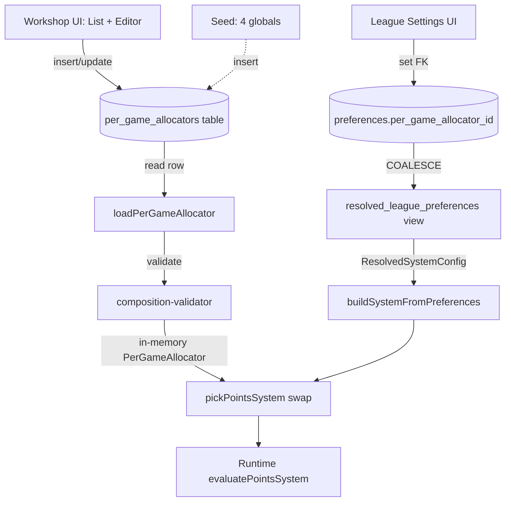

# Per-Game Allocator Workshop

## Overview

Make the Per-Game Allocator (sub-mechanism A of the Points System) authorable through a workshop UI, with per-league swap. Today the allocator is hardcoded in TypeScript factory files; the math engine already supports all three side kinds (fixed / range / formula) and formula access to other-side value, running state bag, and LO-set constants. What's missing is the **data layer + swap point + UI** that lets an LO actually use those capabilities. This is the first concrete application of the modules-as-data principle.

## Problem Frame

Changing `winner = 10` to `winner = 11` for one LO's league requires editing TS source today. That doesn't scale — and modules-as-data was explicitly chosen for this reason (see origin). The engine is already factored to consume data-shaped allocator definitions (`SideConfig`, `AllocatorFormulaRef`); only the persistence + authoring + swap surface is missing.

## Requirements Trace

- **R1.** A user can save a named per-game-allocator variation through the UI; no code change required (origin: "the dials a saved variation has to carry").
- **R2.** Each saved variation supports all three side kinds — fixed, range, formula — for both winner and loser independently (origin: "the four real cases").
- **R3.** Formulas can read the other side's value, the running match-state bag, and LO-set constants (origin: "a formula recipe can read from three sources").
- **R4.** A user sees only their own variations + a set of read-only globals; globals can be cloned as starting templates (origin: filing affordances).
- **R5.** An LO can point a league at a saved variation; the runtime uses the saved variation instead of the prepackaged composition's allocator slot, with everything else (triggers, thresholds) preserved (origin: "what's missing — per-league pointer + one swap point").
- **R6.** A NULL pointer = today's behavior (no behavior change for existing leagues) (origin: "what's missing — per-league pointer").
- **R7.** The 17-Point Scoring System's formula path is exercised end-to-end via a saved variation, proving the pipeline (origin: "wiring a 17-Point composition" open item).
- **R8.** When an LO picks a saved variation for a league, workshop runs a sanity preview against the league's prepackaged composition and flags obvious mismatches (origin: "Runtime trusts, Workshop validates").

## Scope Boundaries

- **Not** authoring new formula recipes — only the existing registered ones (`add_complement_of_other_side`, `state_diff_times_constant`) are LO-fillable.
- **Not** workshops for other modules (triggers, thresholds, win calculator, handicap) — same pattern, separate future plans.
- **Not** cross-user sharing beyond globals — colleague-to-colleague hand-off is future work.
- **Not** a "build a full Scoring System from scratch" surface — this plan covers ONE module slot.
- **Not** RLS enablement on the new table — per [[project_rls_disabled_in_dev]] dev convention, schema-only migrations ship; RLS is a separate planned effort.

### Deferred to Separate Tasks

- Workshop UI for trigger composition (a separate brainstorm + plan when its turn comes).
- Deprecating / removing the unused `SystemOverrides` JSONB + `leagues.system_overrides` column (separate cleanup once this workshop is the live path).
- Migrating the prepackaged compositions (Percent 5-Man, 10-Point) from `.ts` factories to seeded global rows. They can stay as code; their globals are seeded as data copies of the same dial values. A future cleanup unifies them.

## Context & Research

### Relevant Code and Patterns

- `src/systems/points-system/types.ts` — `PerGameAllocator`, `SideConfig`, `AllocatorFormulaRef`. Already discriminated-union shaped to mirror what gets stored.
- `src/systems/points-system/composition-validator.ts` — existing validator the loader will reuse.
- `src/systems/points-system/allocator-formula-registry.ts` + `allocator-formula-operations/*.ts` — registered formula recipes; the workshop's formula picker reads from this registry.
- `src/systems/points-system/runtime.ts` + `allocator-evaluator.ts` — runtime that consumes a `PerGameAllocator` object (unchanged by this plan).
- `src/systems/points-system/compositions/10-point.ts`, `percent-5-man.ts` — current hardcoded compositions; their default dials become seed values for the global rows.
- `src/systems/buildSystemFromPreferences.ts` — `pickPointsSystem()` is the single swap point that gains the variation lookup.
- `src/types/resolvedSystemConfig.ts` — gains the new `per_game_allocator_id` field.
- `supabase/migrations/20260518000010_league_finances.sql` — pattern for new-table migrations + org→league cascade (org-defaults table + league-overrides table joined via COALESCE in a resolved view). The workshop variation table is simpler (no cascade — variations are owned, not inherited), but the migration file style/comments mirror this.
- `supabase/migrations/20260429000002_resolved_view_phase2_modular_axes.sql` — the `resolved_league_preferences` view; gains a new COALESCE'd column for the pointer.
- `src/operator/LeagueSettings.tsx`, `LeagueFinancesPage.tsx` — convention for LO settings pages and their entry points from `LeagueDetail.tsx`. The workshop list page follows the same shadcn `Card` + `Button` + list-of-items pattern.

### Institutional Learnings

- [[project_rls_disabled_in_dev]] — schema-only migration; no RLS policies needed in this plan.
- [[feedback_test_placement]] — DB-touching tests under `src/__tests__/database/`; everything else co-located.
- [[project_happy_dom_supabase_insert_limit]] — supabase-js write-path tests need `// @vitest-environment jsdom` pragma.
- [[feedback_modules_are_data_not_code]] — the killer principle this plan is the first concrete implementation of. The saved row IS the module; the runtime reads + executes.
- [[feedback_runtime_trusts_workshop_validates]] — the sanity preview is the workshop-validates side; runtime stays zero-knowledge and just runs whatever it's handed.

## Key Technical Decisions

- **Sides stored as JSONB (`winner_side` + `loser_side`).** Each side is a `SideConfig` — a discriminated union of fixed / range / formula. Flat columns would force a 7-column-per-side spread with mostly-NULLs and lose the validator's structural check. JSONB matches the in-memory type exactly; the loader passes the JSONB through the existing `composition-validator` for shape correctness on read.
- **One table, scope column.** `per_game_allocators(id, name, description, scope, author_id, winner_side, loser_side, ...)`. `scope = 'global' | 'user'`; globals have `author_id IS NULL` and are inserted via seed. User rows have a non-null `author_id` and `scope = 'user'`. Avoids a separate "globals" table — the visibility filter is one WHERE clause.
- **Per-league pointer lives on `preferences`.** New column `preferences.per_game_allocator_id UUID NULL REFERENCES per_game_allocators(id)`. Sits beside `points_calculator` / `threshold_chart_id`. Cascades through `resolved_league_preferences` via `COALESCE(league_prefs.per_game_allocator_id, org_prefs.per_game_allocator_id)`. NULL = use prepackaged composition's allocator slot unchanged.
- **Swap point: `pickPointsSystem()`.** Single change site. If `prefs.per_game_allocator_id` is set, load the row, validate, and replace the prepackaged composition's `perGameAllocator` field with the loaded object. The composition's `name` is suffixed (`10_point__custom_<short_id>`) so logs and match snapshots stay honest.
- **Authorship: any authenticated user.** Per origin's open item — the brainstorm said "any user." Practically LOs are the primary authors, but the table doesn't restrict by role. The workshop entry point lives in the operator surface, so player-facing authoring is gated by where the link surfaces, not by the table.
- **Globals as seeded rows, not derived-from-code.** Day one, the four globals are inserted via the migration's seed block with the same dial values the current `.ts` factories produce. The factories stay in code for now — they're still the compositions whose allocator slot gets swapped. A later cleanup can read the factory dial values from the global rows; not in scope here.
- **Sanity preview is a real evaluation, not a heuristic.** When an LO picks a variation, run the existing `evaluatePointsSystem()` runtime against a synthetic 5-game sample match using the swapped composition. Flag if any of: result contains NaN/Infinity, any team's `_points` goes negative, the composition validator rejects shape, a registered formula op throws. Display a small "may behave unexpectedly" warning summary; LO can confirm or cancel. Concrete checks, not vibes.
- **17-Point wiring is the smoke test.** Seed a "17-Point" global variation (winner = `add_complement_of_other_side` formula with `{max:7, other_side:'loser'}`, loser = range 0-7). Provide a way to point a dev/test league at it. Verifies the full pipeline (seed → load → validate → swap → runtime → recorded scoring) end-to-end with the formula path.

## Open Questions

### Resolved During Planning

- **Sides as JSONB vs flat columns?** → JSONB (see Key Decisions).
- **Pointer column location?** → `preferences.per_game_allocator_id` (see Key Decisions).
- **Authorship model?** → Any authenticated user; UI gating by surface location (see Key Decisions).
- **17-Point wiring — include or defer?** → Include; it's the smoke test (Unit 7).
- **Sanity preview — heuristics or real eval?** → Real evaluation via existing runtime over a synthetic match (see Key Decisions).

### Deferred to Implementation

- Exact route path for the workshop list page (`/operator/scoring-workshop/allocators` vs nested under league settings) — small UX decision, surfaces during Unit 5.
- Whether the editor is a modal or full page — depends on how complex the formula picker UI feels in practice; small implementation-time call.
- Soft-delete vs hard-delete with "in-use" guard — start with hard-delete blocked by FK while in use (PostgreSQL `ON DELETE RESTRICT`); revisit if it bites.
- Whether to expose state-bag variable names to the LO as a dropdown or free-text — depends on how many viable state vars exist for the formula recipes; implementation-time call once `state_diff_times_constant` is the only state-aware op.

## High-Level Technical Design

> *This illustrates the intended approach and is directional guidance for review, not implementation specification. The implementing agent should treat it as context, not code to reproduce.*



Saved-variation row shape (JSONB structure mirrors `SideConfig`):

```text
per_game_allocators row:
  id, name, description, scope ('global'|'user'), author_id,
  winner_side: { base: <number | {min,max,label}>, formula: <null | {operationKind, operationArgs}> },
  loser_side:  { base: <number | {min,max,label}>, formula: <null | {operationKind, operationArgs}> },
  created_at, updated_at
```

## Implementation Units

- [ ] **Unit 1: DB schema — `per_game_allocators` table + preferences pointer + view update**

**Goal:** Land the persistence layer end to end (table, FK column on preferences, resolved view extension, seed of 4 globals + the 17-Point global).

**Requirements:** R1, R4, R5, R6, R7

**Dependencies:** None.

**Files:**
- Create: `supabase/migrations/20260604000000_per_game_allocators.sql`
- Test: `src/__tests__/database/per-game-allocators-schema.test.ts`

**Approach:**
- New table with PK, `name`, `description`, `scope CHECK IN ('global','user')`, `author_id UUID NULL`, `winner_side JSONB NOT NULL`, `loser_side JSONB NOT NULL`, timestamps.
- `ALTER TABLE preferences ADD COLUMN per_game_allocator_id UUID NULL REFERENCES per_game_allocators(id) ON DELETE RESTRICT`.
- Update `public.resolved_league_preferences` view: add `COALESCE(league_prefs.per_game_allocator_id, org_prefs.per_game_allocator_id) AS per_game_allocator_id`.
- Seed block at the bottom of the migration inserts the four globals (Percent-5-Man, 10-Point, 17-Point, plus an "Empty starter" template) with the SideConfig JSONB matching today's `.ts` factory defaults. Author_id NULL for all globals.

**Patterns to follow:**
- `supabase/migrations/20260518000010_league_finances.sql` for table style, `COMMENT ON TABLE/COLUMN`, and seed block structure.
- `supabase/migrations/20260429000002_resolved_view_phase2_modular_axes.sql` for the `CREATE OR REPLACE VIEW` pattern.

**Test scenarios:**
- Happy path: Insert a user row → verify default scope/owner constraints hold.
- Happy path: Read seeded globals → expect exactly 4 rows with scope='global' and author_id IS NULL.
- Edge case: Insert with scope='user' but author_id NULL → CHECK constraint rejects.
- Edge case: Insert with malformed JSONB (missing required `base` field) → loader-side validator rejects later; row may insert (DB is permissive), so the schema-level test confirms the JSONB is stored as-given.
- Integration: After migration, resolved_league_preferences view exposes `per_game_allocator_id` column; SELECT returns it for every league row.
- Integration: Deleting a `per_game_allocators` row referenced by `preferences.per_game_allocator_id` raises FK violation (`ON DELETE RESTRICT`).

**Verification:**
- `pnpm supabase db push` (or equivalent) applies cleanly against an existing local DB with sample league data.
- Resolved view query returns the new column for all leagues.

- [ ] **Unit 2: Loader — DB row → in-memory `PerGameAllocator`**

**Goal:** A pure function that takes a UUID, fetches the row, validates the JSONB shape, returns a `PerGameAllocator` object the runtime can consume (or throws / returns null with a logged warn on shape failure).

**Requirements:** R2, R3, R5, R8

**Dependencies:** Unit 1.

**Files:**
- Create: `src/systems/points-system/per-game-allocator-loader.ts`
- Test: `src/systems/points-system/__tests__/per-game-allocator-loader.test.ts`

**Approach:**
- Single exported async function `loadPerGameAllocator(id: string, supabase: SupabaseClient): Promise<PerGameAllocator | null>`.
- Fetches row, unmarshalls `winner_side` and `loser_side` JSONB into `SideConfig` shape, builds the `PerGameAllocator { name, winner, loser }` object.
- Runs the result through the existing `validatePointsSystem` (or a focused `validatePerGameAllocator` helper extracted from it) to catch malformed JSONB. On failure, console.warn with the row id and reason, return null. Never throw.
- Verifies any `AllocatorFormulaRef.operationKind` references a registered operation in `allocator-formula-registry`; warn + null on unknown.

**Patterns to follow:**
- `src/systems/points-system/threshold-resolver.ts` `buildThresholdRow()` — same data-shape pattern of "row in, validated object out, registry lookup for op refs."
- Never-throw discipline from `runtime.ts` and `allocator-evaluator.ts`.

**Test scenarios:**
- Happy path: Load a seeded global by id → returns a `PerGameAllocator` with matching name + sides.
- Happy path: Load a user row with the 17-Point formula → returns an allocator whose winner.formula references `add_complement_of_other_side`.
- Edge case: Unknown id → returns null (not throw).
- Error path: Row exists but `winner_side` JSONB is missing `base` → returns null + console.warn with row id.
- Error path: Formula `operationKind` references an unregistered op → returns null + console.warn.
- Edge case: Database error (mocked supabase throwing) → returns null + console.warn; caller sees the same null shape as "not found."

- [ ] **Unit 3: Wire the swap into `pickPointsSystem`**

**Goal:** When `prefs.per_game_allocator_id` is non-null, replace the prepackaged composition's `perGameAllocator` slot with the loaded variation. Triggers + thresholds preserved. NULL = unchanged behavior.

**Requirements:** R5, R6, R7

**Dependencies:** Units 1, 2.

**Files:**
- Modify: `src/types/resolvedSystemConfig.ts` (add `per_game_allocator_id: string | null`)
- Modify: `src/systems/buildSystemFromPreferences.ts` (`pickPointsSystem` + the call site)
- Modify: `src/systems/points-system/match-adapter.ts` if needed for the runtime entry
- Test: `src/systems/points-system/__tests__/per-game-allocator-swap.test.ts`

**Approach:**
- Add `per_game_allocator_id: string | null` to `ResolvedSystemConfig`.
- `pickPointsSystem` becomes async (or accepts a pre-loaded allocator) — easier: make it pre-loaded. `buildSystemFromPreferences` becomes async, awaits the loader if the FK is set, passes the loaded object into `pickPointsSystem`.
- Inside `pickPointsSystem`: build the prepackaged composition as today; if a loaded allocator was passed, replace `composition.perGameAllocator` with it and append `__custom_<id8>` to `composition.name`.
- Where the snapshot is produced for a match, include `per_game_allocator_id` so historical matches replay correctly post-swap.

**Patterns to follow:**
- Existing `pickPointsSystem` switch on `points_calculator`.
- Snapshot pattern in `match.system_snapshot` (see `buildSystemFromPreferences`'s use of `ResolvedSystemConfig`).

**Test scenarios:**
- Happy path: pref FK = null → returned composition is byte-equivalent to today's prepackaged (cross-audit'd via existing `cross-audit-*.test.ts` pattern).
- Happy path: pref FK = the seeded 10-Point global → swap is a no-op (rows match the factory defaults); same numeric output.
- Happy path: pref FK = a custom "winner = 11" variation → composition's allocator winner.base = 11; runtime over a 25-game sample shows winner total = 25 × 11 minus whatever the triggers do.
- Edge case: pref FK points at a deleted row → loader returns null → behavior falls back to prepackaged + console.warn.
- Edge case: pref FK points at a row whose formula references an unregistered op → loader returns null → fallback to prepackaged + console.warn.
- Integration: Match end-to-end with the swapped composition produces a valid `MatchResult` with non-NaN totals.

- [ ] **Unit 4: Workshop UI — list page + editor**

**Goal:** A new operator-surface page where users browse their saved variations + globals, clone a global as a starting template, and open an editor to set the dials. Save persists to the table.

**Requirements:** R1, R2, R3, R4

**Dependencies:** Units 1, 2.

**Files:**
- Create: `src/operator/scoring-workshop/AllocatorWorkshopPage.tsx`
- Create: `src/operator/scoring-workshop/AllocatorList.tsx`
- Create: `src/operator/scoring-workshop/AllocatorEditor.tsx`
- Create: `src/operator/scoring-workshop/SideEditor.tsx` (one component reused for winner + loser)
- Create: `src/operator/scoring-workshop/useAllocatorWorkshop.ts` (data hook)
- Modify: `src/navigation/` route registration (route added under operator surface)
- Modify: `src/operator/OperatorDashboard.tsx` (entry link to the workshop)
- Test: `src/operator/scoring-workshop/__tests__/AllocatorEditor.test.tsx` (component-level, mocked supabase)

**Approach:**
- List page: two sections — "Templates" (globals, read-only, each with "Make a copy I can edit") and "Yours" (user-owned, each with Edit / Duplicate / Delete). Both use shadcn `Card`. Each card shows name, short description, "Built from: X" hint when applicable.
- Editor: top-level form with `Input` for name + `Textarea` for description, then two `SideEditor` blocks (winner + loser). Each `SideEditor` has a `Select` for kind (fixed / range / formula) and renders dial inputs accordingly. Save writes the row; Cancel returns to list.
- Formula picker: `Select` populated from `registeredAllocatorFormulaOperationNames()`; selecting one shows the recipe's required args as `Input` fields per the op's documented args shape (op metadata table starts in code; future could promote to data).
- Reads + writes via `@/supabaseClient` directly; no new RPC needed for v1.

**Patterns to follow:**
- shadcn-only convention per CLAUDE.md user preferences (`Button`, `Input`, `Label`, `Select`, `Card`).
- `src/operator/LeagueFinancesPage.tsx` for page-level structure (header card + list cards + edit affordance).
- File-size rule (~100 lines per file): each sub-component in its own file rather than a god-component.

**Test scenarios:**
- Happy path: List renders globals from the table; clicking "Make a copy" creates a user row + opens the editor with prefilled values.
- Happy path: Editor saves a fixed-winner / fixed-loser variation → row inserted with expected JSONB.
- Happy path: Editor saves a fixed-winner / range-loser variation → loser_side JSONB carries `{base:{min,max,label}}`.
- Happy path: Editor saves a formula-winner variation referencing `add_complement_of_other_side` → winner_side JSONB carries `{base:10, formula:{operationKind:'add_complement_of_other_side', operationArgs:{max:7, other_side:'loser'}}}`.
- Edge case: Empty name → Save disabled + inline validation message.
- Edge case: Range with min > max → inline validation + Save disabled.
- Edge case: Editing a global → the "Save" button is hidden / disabled; only "Make a copy" is offered.
- Integration: Saving a user row appears in the "Yours" list immediately (refetch or local optimistic add).

- [ ] **Unit 5: League settings — picker + sanity preview**

**Goal:** Inside the league's scoring settings, an LO can pick one of their saved variations (or a global) to swap the per-game allocator. Picker triggers a sanity preview before committing; on confirm, the FK on `preferences` is set.

**Requirements:** R5, R8

**Dependencies:** Units 1, 2, 3.

**Files:**
- Modify: `src/operator/LeagueSettings.tsx` (or wherever the scoring section lives) — add the picker control.
- Create: `src/operator/scoring-workshop/AllocatorPicker.tsx` — reusable picker component.
- Create: `src/operator/scoring-workshop/sanityPreview.ts` — pure function that runs a synthetic match through `evaluatePointsSystem` and returns warnings.
- Test: `src/operator/scoring-workshop/__tests__/sanity-preview.test.ts` (unit-level, no DB)
- Test: `src/__tests__/database/league-allocator-pointer.test.ts` (DB-touching; verifies setting the FK persists + the view reflects it)

**Approach:**
- Picker: `Select` listing the current LO's variations + globals, plus a "Use the prepackaged default" option (NULL).
- On change, run `sanityPreview` against the league's current resolved composition with the swap applied. If warnings come back, render them in an inline panel with Cancel / Apply Anyway. Concrete checks: NaN/Infinity in any totals, negative `_points`, validator rejection, formula op throwing.
- On Apply, UPDATE `preferences` row's `per_game_allocator_id` (insert league-level prefs row if none exists; pattern already used by other modular fields).

**Patterns to follow:**
- Existing modular-field write pattern in `LeagueSettings` (whatever sets `points_calculator` / `mechanism` today).
- `validatePointsSystem` + `evaluatePointsSystem` as the eval kernel of the preview.

**Test scenarios:**
- Happy path: Pick a fixed-11 variation → preview shows no warnings → Apply persists the FK → resolved view returns the new id.
- Happy path: Pick "Use prepackaged default" → preview clean → Apply sets the FK to NULL.
- Edge case: Pick a 0.1-per-game variation while league prepackaged is 10-Point → preview returns warning about scale mismatch (very large or very small totals); LO can Apply Anyway.
- Error path: Variation references unregistered formula op → preview returns "this variation references a missing recipe; cannot be used" → Apply disabled.
- Integration: After Apply, the next match created for the league uses the swapped allocator in its system_snapshot.

- [ ] **Unit 6: 17-Point composition wiring + end-to-end smoke test**

**Goal:** Prove the whole pipeline works for the formula path by pointing a dev league at the seeded 17-Point global and confirming a match scores correctly (winner = 10 + (7 − loser) each game; total per game = 17).

**Requirements:** R7

**Dependencies:** Units 1, 2, 3, 5.

**Files:**
- Create: `src/systems/points-system/compositions/17-point.ts` (factory function mirroring `10-point.ts` but with the formula winner side — used as the prepackaged composition wrapper; the saved-row variation provides the same shape)
- Modify: `src/systems/buildSystemFromPreferences.ts` `pickPointsSystem` to recognize a new `points_calculator` value that maps to the 17-Point composition (e.g., `'accumulated_per_game_17pt'` — naming TBD per existing convention)
- Test: `src/systems/points-system/__tests__/17-point.test.ts` (composition correctness)
- Test: `src/__tests__/database/17-point-smoke.test.ts` (end-to-end: seed → set FK → run match → check totals)

**Approach:**
- 17-Point composition: same shape as 10-Point but winner side has `formula: {operationKind: 'add_complement_of_other_side', operationArgs: {max: 7, other_side: 'loser'}}` and base = 10. Loser side is range 0-7. No initial-points trigger (17-Point doesn't pair with Fargo start_points by default; that's a separate combo).
- Seed the 17-Point global in Unit 1's migration with this exact shape.
- Smoke test creates a league, sets `per_game_allocator_id = <17-point global id>`, simulates 5 games with varying loser values, asserts each game's winner_points = 17 - loser_points and total per game = 17.

**Patterns to follow:**
- `src/systems/points-system/compositions/10-point.ts` (the close sibling).
- `src/systems/points-system/__tests__/cross-audit-10-point.test.ts` for the math-correctness test style.

**Test scenarios:**
- Happy path: 17-Point composition built standalone → 5 sample games with loser=[0,3,5,7,2] → winner_points respectively [17,14,12,10,15], loser_points = those literal values, per-game total = 17 each.
- Integration: League pointed at 17-Point global via FK → full match through `buildSystemFromPreferences` → snapshot includes the FK → recomputing the match from snapshot reproduces totals.
- Edge case: Loser value 7 (boundary) → winner = 10, total = 17.
- Edge case: Loser value 0 (other boundary) → winner = 17, total = 17.

- [ ] **Unit 7: TABLE_OF_CONTENTS + LIST_FOR_ED entry + final cleanup**

**Goal:** Update the project index, add a LIST_FOR_ED pointer for visibility, and confirm the `SystemOverrides` JSONB column is flagged for future cleanup.

**Requirements:** Project standards (see [[feedback_table_of_contents_always]]).

**Dependencies:** All previous units.

**Files:**
- Modify: `TABLE_OF_CONTENTS.md`
- Modify: `LIST_FOR_ED.md` (optional pointer; bundled with code per [[feedback_no_solo_doc_prs]])

**Approach:**
- Add entries for the new files (migration, loader, workshop UI components, 17-Point composition, tests) in TOC.
- One-line LIST_FOR_ED bullet linking to this plan as completed; note `system_overrides` JSONB + `SystemOverrides` type are deprecated but not deleted (future cleanup PR).

**Test scenarios:** None — pure documentation.

**Verification:**
- TOC contains every new file path; grep for orphans returns none.

## System-Wide Impact

- **Interaction graph:** `pickPointsSystem` is the single swap site; `buildSystemFromPreferences` becomes async (calling sites in match creation + snapshot read need to await). Live-scoring uses the snapshot, not the live builder, so live matches are unaffected by post-snapshot variation edits.
- **Error propagation:** Loader is never-throw (returns null + warn). Sanity preview surfaces failures to the LO before Apply. Runtime stays zero-knowledge per [[feedback_runtime_trusts_workshop_validates]].
- **State lifecycle risks:** A match's `system_snapshot` captures the resolved allocator at match-creation time. Editing a saved variation AFTER a match is created does NOT retroactively change that match's scoring. This is intentional and matches how other modular axes already snapshot.
- **API surface parity:** `ResolvedSystemConfig` gains one optional field; existing consumers that don't read it are unaffected.
- **Integration coverage:** End-to-end smoke test in Unit 6 covers migration → seed → loader → swap → runtime → match result.
- **Unchanged invariants:** Existing prepackaged compositions remain byte-equivalent when `per_game_allocator_id IS NULL` (today's behavior); cross-audit tests in `src/systems/points-system/__tests__/cross-audit-*.test.ts` should continue to pass without modification.

## Risks & Dependencies

| Risk | Mitigation |
|------|------------|
| Swapping an allocator with wildly different scale (0.1 vs 10) into a composition whose triggers expect specific scale produces nonsense numbers | Sanity preview (Unit 5) runs a real evaluation and surfaces NaN/Infinity/negative warnings before Apply; LO can confirm or cancel |
| `buildSystemFromPreferences` becoming async ripples through call sites | Audit all callers in Unit 3; the live-scoring path reads `system_snapshot` (sync), so the async change only affects match-creation paths |
| Stale JSONB shape (older row written before a SideConfig field was added) | Loader runs full `composition-validator` on read; failure is a logged warn + null, fallback to prepackaged. New required fields land with a migration backfill |
| 17-Point global seeded but no LO has a 17-Point league to test against | Smoke test in Unit 6 creates a synthetic league pointing at it; doesn't require a real LO to use it for the pipeline to be verified |
| User row deleted while a league still points at it | `ON DELETE RESTRICT` on the FK forces explicit unlinking before delete |

## Documentation / Operational Notes

- Update `docs/league-system/implementation-status.md` to note that the per-game allocator workshop is the first modules-as-data application shipped.
- The locked `docs/league-system/modules/points-system/README.md` already anticipates this work in its "Future possibilities → LO-customizable per-game allocations" section. No edit to the locked doc is needed; this plan is its realization.

## Sources & References

- **Origin document:** `docs/brainstorms/2026-06-04-per-game-allocator-workshop-requirements.md`
- Locked spec: `docs/league-system/modules/points-system/README.md`, `docs/league-system/modules/points-system/trigger.md`
- Related code: `src/systems/points-system/types.ts`, `src/systems/buildSystemFromPreferences.ts`, `src/systems/points-system/composition-validator.ts`
- Migration pattern: `supabase/migrations/20260518000010_league_finances.sql`, `supabase/migrations/20260429000002_resolved_view_phase2_modular_axes.sql`
- Branch: `feat/per-game-allocator-workshop`
