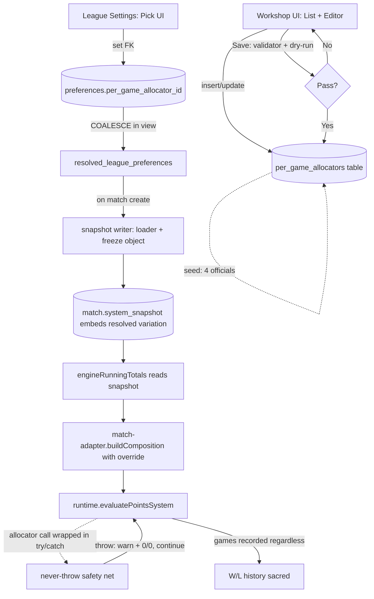

# Per-Game Allocator Room — Workshop's First Room

## Overview

Build the first room of the Scoring System Workshop building: the **per-game point allocator room**. This room lets a user author variations of how points are awarded per game (winner side + loser side), save them as data rows in the database, and pick one to apply to a league. The runtime executes whatever variation it is handed without checking — the room guarantees what leaves it. The patterns set here become the precedent every later room reuses.

## Foundation (from the framing)

This plan is written from the building framing in the origin doc. Two ground rules are non-negotiable:

1. **The lineup page and the scoring page must always render.** No variation, no matter how broken, can block them.
2. **Each game's winner and loser must be recorded** at the time the game finishes. No variation can prevent that recording.

A variation's derived output (points, jumps, calcs) can be wrong if the variation is buggy — that's the author's mess to fix. The two ground rules above are the floor that never gives way.

## Problem Frame

The per-game allocator's runtime engine already exists in code (`src/systems/points-system/runtime.ts`, `src/systems/points-system/allocator-evaluator.ts`). The engine was designed to accept a data-shaped variation object and execute it. What's missing is everything else: a place for variations to live (table), a way to author them (UI), a way to load them (loader), a way to pick one for a league (pointer + UI), a way to swap it into the LIVE scoring path (not the test-only path), and a safety net so a bad variation can't reach the floor (the two ground rules).

The existing prepackaged scoring systems (Percent 5-Man, 10-Point) stay as code factories for v1. The room's official variations are seeded copies of their default dials, used as cloneable templates.

## Requirements Trace

- **R1.** A user can author variations of the per-game allocator through a UI; no code change.
- **R2.** Variations support all three side shapes from the engine: fixed number, scorer-input range, formula. (Origin: workroom contract.)
- **R3.** Variations are stored as data rows; the room owns the table; the runtime reads only validated rows.
- **R4.** A user sees their own variations + read-only official ones; official ones can be cloned as starting templates.
- **R5.** A user picks one variation to apply to a specific league; the LIVE scoring path honors the pick.
- **R6.** No pick = today's behavior. Existing leagues with no pick continue to score exactly as they do now. (Origin: ground rules — backward compat.)
- **R7.** The room enforces its contract at SAVE time AND at READ time. The runtime never sees a variation the room hasn't already certified.
- **R8.** A variation that fails or throws at runtime cannot stop the lineup page rendering, the scoring page rendering, or a game's W/L being recorded. Failures stay trapped in the variation's slot.
- **R9.** A match started while pointing at variation X continues to score with variation X's dials AS THEY WERE AT MATCH START, even if the variation row is edited later. History is frozen at match creation.
- **R10.** The 17-point formula variant — winner = `10 + (7 − loser)`, loser is scorer-input 0-7 — works end-to-end through the LIVE scoring path. This is the room's acceptance test.

## Scope Boundaries

- **Not** the other rooms of the building (triggers, thresholds, win calculator, handicap mechanism). Same pattern, separate future rooms.
- **Not** the building's assembly surface (the "pick one from each room, compose a Scoring System" UI). That gets built after three or four rooms exist.
- **Not** authoring new formula recipes. The two registered recipes (`add_complement_of_other_side`, `state_diff_times_constant`) are LO-fillable; new recipes are a developer task.
- **Not** retiring the existing `.ts` factory compositions. Official seeded variations are 1:1 copies of factory defaults; a future cleanup unifies them.
- **Not** table-level access controls. Per [[project_rls_disabled_in_dev]] RLS is a separate planned effort. This plan adds **app-layer guards** that hold until RLS lands.
- **Not** retiring the old `SystemOverrides` JSONB column. Stays unused; future cleanup PR.

### Deferred to Separate Tasks

- Table-level RLS on `per_game_allocators`: separate RLS-enablement effort.
- The assembly-surface building UI: after 3-4 rooms.
- Migrating prepackaged compositions from `.ts` to seeded data rows: future cleanup.

## Context & Research

### Where the existing code is in the right shape

- `src/systems/points-system/types.ts` — `PerGameAllocator`, `SideConfig`, `AllocatorFormulaRef`. Already data-shaped. Database rows will mirror these types 1:1; no translation layer.
- `src/systems/points-system/runtime.ts` (`evaluatePointsSystem`) + `allocator-evaluator.ts` — the engine. Takes a variation object, runs it. The room's loader produces objects of exactly this shape.
- `src/systems/points-system/allocator-formula-registry.ts` + `allocator-formula-operations/*` — the recipes a formula can reference. Workshop UI's formula picker reads this registry.
- `src/systems/points-system/composition-validator.ts` — the validator we tighten and reuse.
- `supabase/migrations/20260518000010_league_finances.sql` — house style for new-table migrations + table comments + seed blocks. Mirror this.

### Where the existing code is in the wrong shape (needs to bend)

- **The actual live-scoring path is `match-adapter.ts`, not `buildSystemFromPreferences.ts`.** `engineRunningTotals.ts` → `computeMatchRunningTotalsViaEngine` → `match-adapter.ts`'s internal `buildComposition()` is the path that runs whenever a game gets scored in a real match. `buildSystemFromPreferences` exists but has no production callers (tests only). The swap point belongs in `match-adapter.ts`.
- **`evaluateAllocator` can throw, and its call site in `runtime.ts` is not wrapped in a safety net.** Triggers ARE wrapped (`fireTrigger` has the never-throw discipline). The allocator path does not. A bad variation propagates up into the scoring loop. Plan adds a backstop around the allocator call mirroring the trigger pattern.
- **`composition-validator.ts` checks formula NAMES but not formula ARGUMENTS.** A row with `operationArgs: { max: "seven" }` passes validation and throws at compute time. Plan tightens the validator.
- **`compositions/17-point.ts` already exists.** It is not wired into the resolver dispatch. Plan wires it up; does not re-create it.
- **`system_snapshot` stores resolved values at match-start.** Today it captures the modular axes; the new fields the snapshot needs are the picked variation's id (for audit) AND the resolved variation object (for replay stability per R9).

### Institutional Learnings

- [[project_rls_disabled_in_dev]] — schema-only migrations; RLS deferred.
- [[feedback_test_placement]] — DB-touching tests under `src/__tests__/database/`; everything else co-located.
- [[project_happy_dom_supabase_insert_limit]] — supabase-js write tests need `// @vitest-environment jsdom` pragma.
- [[feedback_modules_are_data_not_code]] — this plan is the first concrete realization of the killer principle.
- [[feedback_runtime_trusts_workshop_validates]] — the safety net is the runtime's last-resort defense; the workshop's save-time + read-time validation is the primary guard.
- [[feedback_state_bag_starts_empty]] — the runtime is zero-knowledge; the framing's "plug and play by id" is exactly this.

## Key Technical Decisions

- **Storage:** one table `per_game_allocators`. Columns: `id`, `name`, `description`, `scope CHECK IN ('official','user')`, `author_id UUID NULL REFERENCES auth.users(id) ON DELETE SET NULL`, `winner_side JSONB NOT NULL`, `loser_side JSONB NOT NULL`, timestamps. Sides as JSONB mirroring `SideConfig` exactly.
- **Pointer:** `preferences.per_game_allocator_id UUID NULL REFERENCES per_game_allocators(id) ON DELETE RESTRICT`. Lives alongside the other modular axes (`points_calculator`, `threshold_chart_id`). NULL = no pick, today's behavior.
- **Resolved-view extension:** `resolved_league_preferences` gains `COALESCE(league_prefs.per_game_allocator_id, org_prefs.per_game_allocator_id) AS per_game_allocator_id`.
- **Loader stays sync at the live-scoring call site.** The loader fetch happens UPSTREAM at match-creation time (when the snapshot is built), not inside the runtime's per-game loop. Snapshot embeds the resolved variation object. Live scoring reads the snapshot — no DB round-trip per game.
- **Snapshot extension:** the match `system_snapshot` JSONB gains `per_game_allocator_id` (audit) AND `per_game_allocator` (the resolved object, frozen at match start, used for replay).
- **Swap point in the live path:** `match-adapter.ts`'s `buildComposition` accepts an optional `perGameAllocatorOverride: PerGameAllocator | null`. When non-null, it replaces the slot in whatever prepackaged composition `buildComposition` would have returned. `engineRunningTotals.ts` reads the snapshot's resolved variation and passes it in.
- **`buildSystemFromPreferences.pickPointsSystem` ALSO gets the swap, for parity** with snapshot-write paths and future consumers — but it is no longer claimed as "the single swap point." Live scoring uses match-adapter's swap.
- **Validator hardening:** each registered `AllocatorFormulaOperation` declares an `argsShape` describing its required args (name, type, optional/required). `validatePointsSystem` runs the args through the shape on read. Same shape is exposed to the workshop UI for input rendering.
- **Save-time guard:** the editor's Save button runs the validator AND a dry-run evaluation against a small synthetic match. Rejection blocks the save. This is the room's primary contract enforcement.
- **Read-time guard:** the loader runs the same validator on every read. A row that somehow slipped past Save (e.g., direct DB edit) is rejected at load. Falls back to the prepackaged composition with a console.warn. Never throws.
- **Runtime safety net:** the call to `evaluateAllocator` in `runtime.ts` is wrapped in try/catch. On any throw: console.warn, fall back to `{ winnerContribution: 0, loserContribution: 0 }` for that game, continue. Identical to the existing `fireTrigger` discipline.
- **Authorship: any authenticated user can write rows; the workshop UI route is gated to operator-context users only.** App-layer guard until RLS lands. The four official rows have `scope='official'` and `author_id IS NULL`; the editor never lets a user save with `scope='official'` and the load path never lets a user EDIT an official row (it forces a clone).
- **Official-row tamper guard:** a DB trigger blocks UPDATE on rows where `scope='official'` (DELETE also blocked while RLS is off). Until RLS, this is the only thing preventing a logged-in user with the supabase client from rewriting the seeded officials.
- **Seeded officials:** four rows — Percent-5-Man allocator, 10-Point allocator, 17-Point allocator, "Empty starter" template. Their dial values are byte-equivalent to the current `.ts` factory defaults.

## Open Questions

### Resolved During Planning

- **Where does the swap live in code?** → `match-adapter.ts` (live path) AND `pickPointsSystem` (parity / snapshot-write path).
- **Snapshot stores pointer or resolved object?** → Both. Pointer for audit; resolved object for replay stability.
- **Where is the per-league pointer?** → `preferences.per_game_allocator_id`.
- **Sides as JSONB or flat?** → JSONB; mirrors `SideConfig`.
- **Authorship?** → Any authenticated user writes rows; UI route gated to operators.
- **Sanity check at save or at apply?** → Both. Save is the room's primary guard. Apply re-runs against the league's composition to flag scale mismatches.
- **Globals as code or data?** → For v1, both — `.ts` factories stay as the runtime path when no pointer is set; seeded official rows are the cloneable templates. Reconciliation is a future cleanup.

### Deferred to Implementation

- Exact route path for the workshop UI (`/operator/scoring-workshop/per-game-allocator` vs nested under league settings).
- Editor as modal or full page — depends on how the formula picker UI feels in practice.
- Free-text vs dropdown for state-bag variable names in formula args.
- Exact wording of the "scale mismatch" warning in the apply preview.

## High-Level Technical Design

> *Directional guidance for review, not implementation specification.*



Variation row JSONB shape (mirrors `SideConfig`):

```text
winner_side / loser_side:
  { base: <number> | { min, max, label },
    formula: null | { operationKind, operationArgs } }
```

## Implementation Units

- [ ] **Unit 1: DB schema — table + pointer + view + seeded officials**

**Goal:** Land the room's storage in one atomic migration. Table created, pointer column added to `preferences`, view extended, four official rows seeded, official-row tamper trigger installed.

**Requirements:** R1, R3, R4, R6, R10.

**Dependencies:** None.

**Files:**
- Create: `supabase/migrations/20260604000000_per_game_allocator_room.sql`
- Test: `src/__tests__/database/per-game-allocator-schema.test.ts`

**Approach:**
- New table per Key Decisions. `scope CHECK IN ('official','user')`. `author_id` nullable; non-null required when `scope='user'` (CHECK constraint).
- `ALTER preferences ADD COLUMN per_game_allocator_id UUID NULL REFERENCES per_game_allocators(id) ON DELETE RESTRICT`.
- `CREATE OR REPLACE VIEW resolved_league_preferences` with the COALESCE'd column added.
- Seed block inserts four rows: Percent-5-Man (winner fixed 0.1, loser fixed 0), 10-Point (winner fixed 10, loser range 0-7), 17-Point (winner formula `add_complement_of_other_side` args `{max:7, other_side:'loser'}`, loser range 0-7), Empty Starter (winner fixed 0, loser fixed 0). All have `scope='official'`, `author_id IS NULL`.
- Trigger `BEFORE UPDATE ON per_game_allocators FOR EACH ROW WHEN (OLD.scope='official') RAISE EXCEPTION`. Same for DELETE.

**Patterns to follow:**
- `supabase/migrations/20260518000010_league_finances.sql` for table style.
- `supabase/migrations/20260429000002_resolved_view_phase2_modular_axes.sql` for the view's CREATE OR REPLACE pattern.

**Test scenarios:**
- Happy path: After migration, `SELECT * FROM per_game_allocators WHERE scope='official'` returns 4 rows.
- Happy path: Insert user row with valid JSONB succeeds.
- Edge case: Insert with `scope='user'` and NULL `author_id` → CHECK rejects.
- Edge case: UPDATE on a `scope='official'` row → trigger raises.
- Edge case: DELETE on a `scope='official'` row → trigger raises.
- Integration: `resolved_league_preferences` returns `per_game_allocator_id` column for every league row (NULL by default).
- Integration: Deleting a user row referenced by `preferences.per_game_allocator_id` raises FK violation.

**Verification:**
- Migration applies cleanly.
- Seeded officials are present.
- Tamper trigger fires on update and delete attempts.

---

- [ ] **Unit 2: Loader — row → in-memory `PerGameAllocator`**

**Goal:** Pure function: `id` in, validated `PerGameAllocator` out (or `null` + warn). Never throws.

**Requirements:** R3, R7, R8.

**Dependencies:** Unit 1, Unit 3 (uses tightened validator).

**Files:**
- Create: `src/systems/points-system/per-game-allocator-loader.ts`
- Test: `src/systems/points-system/__tests__/per-game-allocator-loader.test.ts`

**Approach:**
- `async function loadPerGameAllocator(id, supabase): Promise<PerGameAllocator | null>`.
- Fetch row, unmarshal `winner_side` / `loser_side` JSONB into `SideConfig` shape, assemble `PerGameAllocator { name, winner, loser }`.
- Run through `validatePointsSystem` (or a focused `validatePerGameAllocator` extracted in Unit 3) wrapped in try/catch. On failure → console.warn with row id + reason, return null.
- Verify `operationKind` references a registered op. Verify args shape via Unit 3's hardened validator. Both warn + null on failure.

**Patterns to follow:**
- `src/systems/points-system/threshold-resolver.ts` `buildThresholdRow` shape pattern.
- Never-throw discipline from `runtime.ts`.

**Test scenarios:**
- Happy path: Load seeded 10-Point official → returns allocator with winner.base=10, loser.base={min:0,max:7,label:'Balls pocketed by loser'}.
- Happy path: Load seeded 17-Point official → returns allocator with winner.formula referencing `add_complement_of_other_side`.
- Edge case: Unknown id → null (not throw).
- Error path: Row with malformed JSONB (missing `base`) → null + console.warn.
- Error path: Row referencing unregistered formula op → null + console.warn.
- Error path: Row with args type mismatch (max: "seven") → null + console.warn (this is the bug the old plan would have shipped).
- Error path: Supabase throws → null + console.warn.

---

- [ ] **Unit 3: Validator hardening — formula args shape check**

**Goal:** Each registered `AllocatorFormulaOperation` declares the shape of its required args. The validator runs args through that shape on read. Same shape powers the UI's input rendering in Unit 6.

**Requirements:** R7.

**Dependencies:** None (other than knowing what ops exist).

**Files:**
- Modify: `src/systems/points-system/types.ts` — extend `AllocatorFormulaOperation` with optional `argsShape: { [argName]: ArgKind }`.
- Modify: `src/systems/points-system/allocator-formula-operations/add-complement-of-other-side.ts` — declare argsShape.
- Modify: `src/systems/points-system/allocator-formula-operations/state-diff-times-constant.ts` — declare argsShape.
- Modify: `src/systems/points-system/composition-validator.ts` — `validateAllocatorSide` checks `operationArgs` against the op's `argsShape`; extract a public `validatePerGameAllocator` for the loader.
- Test: `src/systems/points-system/__tests__/composition-validator-args.test.ts`

**Approach:**
- `ArgKind` is a small enum: `'number' | 'state_var_name' | 'side_name'`. Add others later as recipes need them.
- `argsShape` is `{ [argName]: { kind: ArgKind; required: boolean } }`.
- Validator iterates the shape, checks each declared arg's presence + type. Extra args allowed (forward-compat). Missing required args → reject.
- Public `validatePerGameAllocator` is what the loader calls. Internal `validateAllocatorSide` stays for the full `validatePointsSystem`.

**Patterns to follow:**
- `src/systems/points-system/operations/read-pref.ts` for in-file metadata co-located with the operation.

**Test scenarios:**
- Happy path: Valid 17-Point args (`max:7, other_side:'loser'`) → validator passes.
- Edge case: Extra arg present → validator passes (forward-compat).
- Error path: Missing required arg (`max` omitted) → validator returns failure with arg name.
- Error path: Type mismatch (`max: "seven"`) → validator returns failure with arg name and expected kind.
- Error path: `other_side: 'banana'` (wrong side_name value) → validator returns failure.

---

- [ ] **Unit 4: Runtime safety net around allocator call**

**Goal:** Wrap the `evaluateAllocator` call site in `runtime.ts` so any throw is caught. On error: console.warn, fall back to zero contributions for that game, continue. The ground rules (page renders, W/L recorded) survive any variation failure.

**Requirements:** R8.

**Dependencies:** None.

**Files:**
- Modify: `src/systems/points-system/runtime.ts` — wrap `evaluateAllocator` call (around line 230-240 today).
- Test: `src/systems/points-system/__tests__/runtime-allocator-safety.test.ts`

**Approach:**
- Mirror the `fireTrigger` try/catch pattern (lines 96-140 today).
- On catch: console.warn with composition name + game index + error message. Continue the per-game loop. The state bag's `_points` totals freeze where they were; future games still tick.
- W/L counters (`home_wins`/`away_wins`) are already incremented BEFORE the allocator call — confirm this is the order. If not, ensure the order so a thrown allocator can't lose the W/L tick.

**Patterns to follow:**
- `fireTrigger` in `runtime.ts`.

**Test scenarios:**
- Happy path: Normal allocator → contributions added, totals advance.
- Error path: Allocator throws on game 3 of 25 → warn logged, games 1-2 contributions preserved, games 4-25 continue (with zero contributions for game 3 only, OR with all subsequent games also zero — pick one and document).
- Error path: Allocator throws on EVERY game → all 25 W/L counts still recorded, `home_points`/`away_points` stay at 0, runtime returns a valid `MatchStateBag` with correct W/L totals.
- Integration: A purposely-broken variation drives a synthetic match end-to-end; `MatchResult.winner` still computable from games-won; no exception escapes.

**Verification:**
- `evaluatePointsSystem` cannot throw under any allocator failure. Test asserts this explicitly.

---

- [ ] **Unit 5: Snapshot extension + live-path swap in match-adapter**

**Goal:** When a match is created, the snapshot embeds the resolved variation object (frozen at match start). When the live-scoring path runs, `match-adapter.ts` honors that embedded variation. Also wires `pickPointsSystem` for parity.

**Requirements:** R5, R6, R9, R10.

**Dependencies:** Units 1, 2, 4.

**Files:**
- Modify: `src/types/resolvedSystemConfig.ts` — add `per_game_allocator_id: string | null`.
- Modify: `src/types/match.ts` — `MatchSystemSnapshot` gains `per_game_allocator_id` and `per_game_allocator` (resolved object) fields.
- Modify: `src/api/queries/matches.ts` `populateMatchSnapshotIfNeeded` — when writing the snapshot, if `per_game_allocator_id` is set, call the loader and embed the resolved object.
- Modify: `src/systems/points-system/match-adapter.ts` — `buildComposition` accepts an optional `perGameAllocatorOverride: PerGameAllocator | null`. When non-null, replaces the composition's `perGameAllocator` slot and suffixes the composition name with `__custom_<id8>`.
- Modify: `src/utils/match/engineRunningTotals.ts` — read `snapshot.per_game_allocator` and pass to `match-adapter`.
- Modify: `src/systems/buildSystemFromPreferences.ts` `pickPointsSystem` — parity swap when an override is passed.
- Test: `src/systems/points-system/__tests__/snapshot-and-swap.test.ts`
- Test: `src/__tests__/database/match-snapshot-allocator.test.ts`

**Approach:**
- Snapshot writer becomes the single async load point. Runtime reads sync from the snapshot.
- `buildComposition` override is a thin replacement of the `perGameAllocator` field on the returned composition. Triggers and thresholds are untouched.
- When no FK is set: snapshot embeds null/absent, builders skip the override, behavior is byte-equivalent to today.

**Patterns to follow:**
- Snapshot writer pattern at `src/api/queries/matches.ts:758-822`.
- `buildComposition` pattern in `src/systems/points-system/match-adapter.ts`.

**Test scenarios:**
- Happy path: League with no FK → snapshot has null allocator field → `buildComposition` returns prepackaged composition unchanged → games score identically to today (cross-audit pattern).
- Happy path: League with FK to 11-point variation → snapshot embeds the resolved object → live scoring uses 11 as winner.base.
- Happy path: League with FK to 17-point official → snapshot embeds the 17-point shape → live scoring's winner = 17 - loser per game.
- Edge case: FK set but loader fails (row deleted between FK-set and snapshot-write) → snapshot embeds null → falls back to prepackaged + console.warn.
- Integration (R9): League FK = variation V; match started; THEN V is edited (winner base changed from 10 to 5); the in-flight match continues to score with 10, not 5; a NEW match created after the edit uses 5.
- Integration: `pickPointsSystem` with override passed → composition has the swapped allocator slot; without override → unchanged.

---

- [ ] **Unit 6: Workshop room UI — list + editor + save-time guard**

**Goal:** The room's user-facing surface. List shows officials + user's own. Editor sets the dials. Save runs validator + dry-run; rejects bad variations.

**Requirements:** R1, R2, R4, R7.

**Dependencies:** Units 1, 2, 3.

**Files:**
- Create: `src/operator/scoring-workshop/per-game-allocator/AllocatorRoomPage.tsx`
- Create: `src/operator/scoring-workshop/per-game-allocator/AllocatorList.tsx`
- Create: `src/operator/scoring-workshop/per-game-allocator/AllocatorEditor.tsx`
- Create: `src/operator/scoring-workshop/per-game-allocator/SideEditor.tsx` (reused for winner + loser)
- Create: `src/operator/scoring-workshop/per-game-allocator/useAllocatorRoom.ts` (data hook)
- Create: `src/operator/scoring-workshop/per-game-allocator/saveTimeGuard.ts` (runs validator + dry-run)
- Modify: `src/App.tsx` (or wherever operator routes register) — add the room's route, gated to operator-context users.
- Modify: `src/operator/OperatorDashboard.tsx` — entry link to the room.
- Test: `src/operator/scoring-workshop/per-game-allocator/__tests__/AllocatorEditor.test.tsx` (jsdom pragma needed if exercising supabase write paths)
- Test: `src/operator/scoring-workshop/per-game-allocator/__tests__/saveTimeGuard.test.ts`

**Approach:**
- Two sections in list: "Templates" (officials, read-only, each with "Make a copy I can edit") and "Yours" (user's, with Edit / Duplicate / Delete).
- Editor: `Input` for name, `Textarea` for description, two `SideEditor` blocks (winner + loser). `SideEditor` has a `Select` for kind (fixed / range / formula) and renders inputs per kind. Formula picker reads `registeredAllocatorFormulaOperationNames()`; selecting one renders inputs from the op's `argsShape` (Unit 3).
- Save flow: build the in-memory `PerGameAllocator`, run `validatePerGameAllocator`, run `saveTimeGuard` (synthetic 5-game dry-run via `evaluatePointsSystem` against a stub composition with only this allocator + a no-op thresholds/triggers slot), block save on failure with inline error.
- Route is gated: a non-operator user navigating to the URL gets redirected (app-layer guard; RLS is the eventual real protection).

**Patterns to follow:**
- shadcn-only convention (`Button`, `Input`, `Label`, `Select`, `Card`).
- `src/operator/LeagueFinancesPage.tsx` for page-level structure.
- File size ~100 lines per file per [[feedback_file_size_limit]].

**Test scenarios:**
- Happy path: List renders officials from DB + user's own. "Make a copy" creates a user row + opens editor prefilled.
- Happy path: Save a fixed/fixed variation → row inserted with expected JSONB.
- Happy path: Save a fixed/range variation → loser_side JSONB has `{base:{min,max,label}}`.
- Happy path: Save a 17-point formula variation → winner_side JSONB has formula ref + args.
- Edge case: Empty name → Save disabled.
- Edge case: Range with min > max → Save disabled.
- Edge case: Trying to Save while editing an official → Save hidden; only "Make a copy" surfaced.
- Error path: Save attempt with args type error (e.g., max blank) → save-time guard rejects with the validator's message.
- Error path: Save attempt with a divide-by-zero formula → dry-run throws inside synthetic match → guard rejects with the runtime error message.
- Integration: Non-operator user navigates to route → redirected away.

---

- [ ] **Unit 7: League settings pick UI + apply-time preview**

**Goal:** In a league's scoring settings, the LO can pick one of their variations (or an official). The pick triggers a preview against the league's current composition; on confirm, the FK is set.

**Requirements:** R5, R6.

**Dependencies:** Units 1, 2, 3, 5.

**Files:**
- Create: `src/operator/scoring-workshop/per-game-allocator/AllocatorPicker.tsx`
- Create: `src/operator/scoring-workshop/per-game-allocator/applyTimePreview.ts`
- Modify: `src/operator/LeagueSettings.tsx` (or the scoring-section component within it) — host the picker.
- Test: `src/operator/scoring-workshop/per-game-allocator/__tests__/applyTimePreview.test.ts`
- Test: `src/__tests__/database/league-allocator-pick.test.ts`

**Approach:**
- Picker: `Select` listing the LO's variations + officials + "Use prepackaged default" (NULL).
- On change, run `applyTimePreview` against the league's prepackaged composition with the picked variation swapped in. The preview is `evaluatePointsSystem` over a synthetic match using the league's actual prep state (lineup size, handicap diffs as zero placeholders). Surface warnings: NaN, Infinity, negative totals, scale mismatch (e.g., variation produces <1 per game but league composition expects 10+).
- On Apply: UPDATE `preferences.per_game_allocator_id`. Insert league-level prefs row if none exists (existing pattern).

**Patterns to follow:**
- Modular-field write pattern in `LeagueSettings` (the path that sets `points_calculator` today).

**Test scenarios:**
- Happy path: Pick a fixed-11 variation → preview clean → Apply persists FK → resolved view returns it.
- Happy path: Pick "Use prepackaged default" → FK set to NULL → behavior reverts.
- Edge case: Variation with scale mismatch (0.1-per-game into a 10-Point league) → preview warns; LO can Apply Anyway with explicit confirm.
- Error path: Variation passed Save-time guard but apply-time preview throws (e.g., specific to the league's threshold setup) → preview reports the throw → Apply disabled.
- Integration: After Apply, the NEXT match created by that league embeds the variation in its snapshot.

---

- [ ] **Unit 8: 17-point smoke test through the LIVE scoring path**

**Goal:** The room's acceptance test. A league pointed at the 17-Point official scores a real (test) match through the LIVE scoring mutation path (not just `evaluatePointsSystem` standalone) and produces the expected per-game totals.

**Requirements:** R10.

**Dependencies:** Units 1, 2, 4, 5.

**Files:**
- Modify: `src/systems/points-system/compositions/17-point.ts` if any wiring is needed (file exists per Context). Add to `pickPointsSystem`'s dispatch by recognizing FK presence (no new `points_calculator` enum value needed — the variation IS the 17-Point shape via the FK).
- Test: `src/__tests__/database/17-point-smoke.test.ts` (jsdom pragma)
- Test: `src/systems/points-system/__tests__/17-point-via-match-adapter.test.ts`

**Approach:**
- DB-touching smoke test: create a league row, insert preferences pointing at the seeded 17-Point official, run the match-creation flow (populates snapshot), simulate 5 games via the match-mutation seam with loser values `[0, 3, 5, 7, 2]`, assert each game's stored `winner_points` and `loser_points` plus running totals match the recipe (winner = 17 - loser_value).
- Adapter-level test: build the snapshot in-memory, pass through `engineRunningTotals` / `match-adapter`, assert totals.

**Patterns to follow:**
- `src/systems/points-system/__tests__/cross-audit-10-point.test.ts` for math-correctness shape.
- DB test placement per [[feedback_test_placement]].

**Test scenarios:**
- Happy path: 5 games with loser=[0,3,5,7,2] → winner_points=[17,14,12,10,15], per-game total = 17.
- Edge case: loser=0 → winner=17.
- Edge case: loser=7 → winner=10.
- Integration: Full match through the live mutation seam → recorded per-game records reflect the 17-point recipe; `home_points`/`away_points` totals match expected.
- Integration: Mid-match, edit the 17-Point official → fails (tamper trigger). Verifies the seed protection.

---

- [ ] **Unit 9: TOC + cleanup notes**

**Goal:** Update project index. Note the `SystemOverrides` JSONB as deprecated.

**Requirements:** Project standards ([[feedback_table_of_contents_always]], [[feedback_commit_planning_docs]]).

**Dependencies:** All previous units.

**Files:**
- Modify: `TABLE_OF_CONTENTS.md`
- Modify: `docs/league-system/implementation-status.md` — note the per-game allocator room is the first room of the Scoring System Workshop building.

**Test scenarios:** None — documentation.

**Verification:**
- Every new file path is listed in TOC.

## System-Wide Impact

- **Interaction graph:** snapshot writer is the single async DB-read entry point for the variation. Live scoring stays sync via the snapshot. `match-adapter.ts` and `pickPointsSystem` both accept the override; consistency between them is enforced by an integration test in Unit 5.
- **Error propagation:** loader never-throw, validator never-throw, runtime allocator call wrapped. The ground rules (page renders + W/L recorded) survive any variation failure.
- **State lifecycle:** snapshot freezes the variation at match start (R9). Editing a variation never retroactively rewrites in-flight or completed matches.
- **API surface parity:** `MatchSystemSnapshot` gains two optional fields; existing consumers that don't read them are unaffected.
- **Integration coverage:** Unit 8's live-mutation smoke test is what proves the room works end-to-end, not just at the engine boundary.
- **Unchanged invariants:** when `preferences.per_game_allocator_id IS NULL`, every code path produces byte-equivalent output to today's runtime. Cross-audit tests in `src/systems/points-system/__tests__/cross-audit-*.test.ts` continue to pass without modification.

## Risks & Dependencies

| Risk | Mitigation |
|------|------------|
| Variation throws at runtime → live scoring crashes | Unit 4 safety net + Unit 3 args validation + Unit 6 save-time dry-run + Unit 2 read-time validation. Four layers; runtime never sees an uncertified row. |
| Variation row edited mid-season → historical replay rewrites | Unit 5 snapshot embeds resolved object, not just FK. |
| Variation deleted while old matches reference it | FK has `ON DELETE RESTRICT` on `preferences`; snapshot holds resolved object so historical matches don't depend on the row existing. |
| Logged-in user tampers with official rows | Unit 1 tamper trigger blocks UPDATE/DELETE on `scope='official'`. App-layer guard until RLS lands. |
| Non-operator user reaches the room's UI | Unit 6 route gate (redirect non-operators). RLS is the eventual real protection. |
| `match-adapter.ts` and `pickPointsSystem` diverge over time | Unit 5 includes an integration test that runs the same league through both paths and asserts equal output. |
| `buildSystemFromPreferences` becoming async (if we go that route) ripples | We chose NOT to make it async. The loader runs upstream at snapshot-write time; builders stay sync. |
| Workshop UI ships with happy-dom breaking supabase writes in tests | Editor tests use `// @vitest-environment jsdom` pragma per [[project_happy_dom_supabase_insert_limit]]. |

## Documentation / Operational Notes

- Update `docs/league-system/implementation-status.md` to declare the per-game allocator room as the first realized room of the workshop building.
- The locked `docs/league-system/modules/points-system/README.md` already anticipates LO-customizable per-game allocations as a "future possibility." This plan is its realization; no locked-doc edit needed.

## Sources & References

- **Origin document:** `docs/brainstorms/2026-06-04-scoring-system-workshop-building-requirements.md`
- Superseded plan: `docs/plans/2026-06-04-001-feat-per-game-allocator-workshop-plan.md`
- Live scoring path: `src/utils/match/engineRunningTotals.ts`, `src/systems/points-system/match-adapter.ts`
- Runtime engine: `src/systems/points-system/runtime.ts`, `src/systems/points-system/allocator-evaluator.ts`
- Validator: `src/systems/points-system/composition-validator.ts`
- Migration pattern: `supabase/migrations/20260518000010_league_finances.sql`, `supabase/migrations/20260429000002_resolved_view_phase2_modular_axes.sql`
- Snapshot writer: `src/api/queries/matches.ts`
- Branch: `feat/per-game-allocator-workshop`
