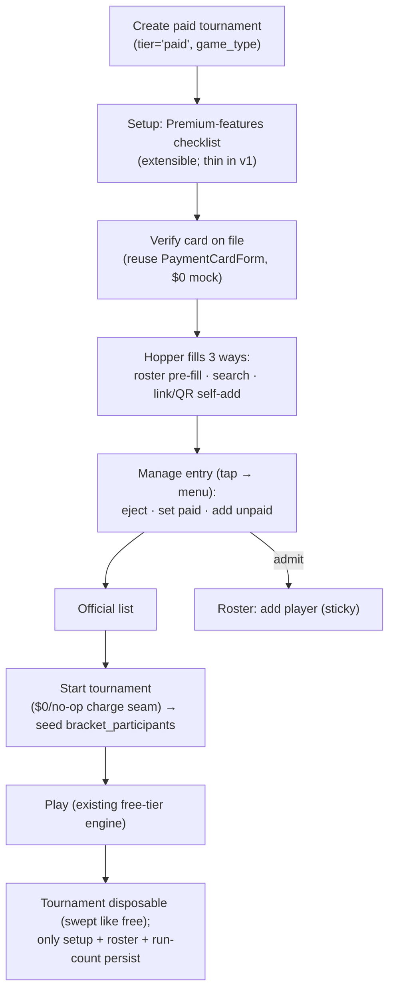
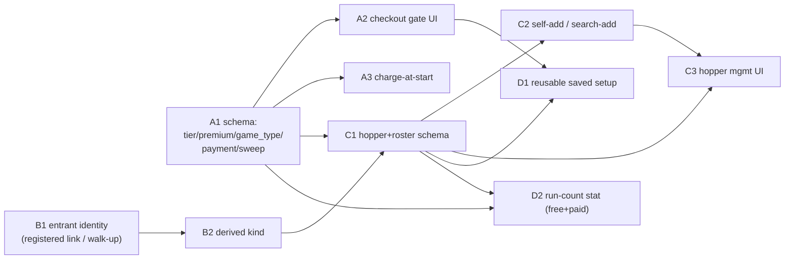

# feat: Tournament Paid Tier — Foundation

## Overview

Turn the free "just names" Tournaments tool into a **paid tier with real players**.
This is roadmap item #1 — the identity foundation the other paid features
(self-scoring, handicap races, venue/tables, alerts, payout) stand on. It adds:

- A **tier gate**: a "Premium features" checklist in setup + a **$0 checkout**
  reusing the existing `PaymentCardForm` (verify-at-setup / charge-at-start).
- **Real identity** on participants (the already-present but unused
  `bracket_participants.member_id` hook), with a first-class **kind** (registered
  vs placeholder) that later features branch on.
- **Tournament-scoped walk-up entrants** — registered players link to their real
  account; walk-ups are disposable tournament records that never touch the league
  placeholder/merge system (see Resolved Decision).
- An **organizer roster** of "past players" that pre-fills a **hopper**; three
  ways in (search / share link / QR); a tap-name **manage menu** (eject / set
  paid / add unpaid) that admits players to the **official list**.
- A **reusable saved setup** (per player), the **roster**, and a per-user
  **"tournaments run" count** (free + paid stat). The tournament itself is
  **disposable** (swept like free); if handicap-feedback (#5) is ever on, a
  *registered* player's outcomes go to their own record — not kept on the
  tournament.

**Target branch note:** this builds directly on the free-tier bracket work
(PR #264, branch `feat/tournament-bracket-free-tier`) — the `brackets` /
`bracket_participants` / `bracket_matches` tables, `src/api/{mutations,queries,hooks}`
bracket layer, and the `BRACKETS_ENABLED` flag. Implementation should branch off
that work (or off `main` once #264 merges), not off this docs branch.

## Resolved Decision — Walk-up identity splits by actor (Ed, 2026-09-04)

The brainstorm's "full app placeholders" line conflated two different organizers.
Resolved:

- **LO running a tournament** → already has merge powers and an org, so a walk-up
  can become a real, permanent, mergeable **league placeholder** through the tools
  the LO **already has**. The tournament flow builds **nothing new** for this;
  it simply doesn't prevent it.
- **Normal user (non-LO) running a tournament** → walk-ups are **tournament-scoped
  entrant records** — disposable, invisible to league operations, **never merged**.
  If that person registers later, they become a **brand-new player** with no link
  back. When an entrant leaves the hopper, it's **gone**.

**Why this is the model:** normal users never merge, so **the foundation never
touches the shared league merge code** — the single riskiest piece of the earlier
draft (NULL-org owner, `merge_placeholder_into_member_v2` surgery, undo/audit
gymnastics) is **eliminated**. LOs use the merge machinery they already own;
normal users get a lightweight record that never enters it.

**Mechanism (Claude's call, Ed to veto):** a walk-up is **not** a protected global
placeholder (those carry a never-hard-delete / BCA-findability guardrail, which
contradicts "just gone"). It's a **tournament-scoped entrant** on the hopper
(`member_id` NULL + `display_name`). Registered players link to their real
`members` row via `member_id`. Result: kind is derived from `member_id` presence,
not from a placeholder join.

**Deferred (Ed: "a problem for the future"):** what happens to a disposed
entrant's **game records** (orphaned when the entrant is gone). Parked, not solved
here — see Scope Boundaries → Deferred.

## Other review outcomes (applied to this plan)

- **Scope trims (align with "default to simpler"):** dropped the `VerifyCardStep`
  wrapper (use `PaymentCardForm` directly); the charge-at-start seam is a **pure
  $0 no-op** (removed the speculative, gameable first-run-free *counter* — first-
  free becomes a later pricing decision with Stripe); trimmed `bracket_saved_setups`
  to the fields with real v1 content; D2 is **persistence-only** (the results
  *read surface* is deferred to #5, which will shape it).
- **Security hardening:** the payment **token is written straight to the bracket
  row, never held in component/localStorage** (unlike the `questionDefinitions.tsx`
  pattern — only `card_last4`/`card_brand` display fields stay client-side); the
  organizer **hopper read is a column-projected SECURITY DEFINER RPC** (caller =
  `created_by`), not a client `.select()` on PII with RLS off; the join link uses a
  **distinct `join_token`**, not the public `share_token`.
- **Verified technical gaps folded in:** `start_bracket` seed-assignment +
  `participantCount` source is specified (C1); walk-ups are tournament-scoped so
  **no league merge-code work at all** (Resolved Decision eliminated the earlier
  draft's biggest risk); A1/A3/D1 use **sibling migrations** with fresh timestamps
  (never edit a merged one); a `tier ⇔ premium_features` **invariant** is enforced,
  not just documented.
- **Design states to specify (deferred to implementation, listed so they aren't
  invented):** the unauthenticated **cold-scanner** join flow (headline adoption
  moment — depends on the passwordless branch; sequence it), closed/started-
  tournament join state, the free-vs-paid **entry point** from `BracketsIndexPage`,
  roster pre-fill **opt-in vs opt-out**, the empty-checklist content, card
  re-verify/change, and a two-click **eject confirmation** (project precedent).
- **Note:** the parent roadmap + free-tier plan cited in Sources live on the
  free-tier branch (PR #264), not this docs branch — reviewers on this branch
  couldn't see them; they exist.

## Problem Frame

The free tier (built) uses plain typed names purged on close — correct for the
funnel, but a returning organizer restarts from a blank page and nothing a player
does is real or durable. The paid promise is **"set it up once, then it mostly
runs itself"**: real players self-add, the tool runs the event, and games count.
Every downstream paid feature needs one thing that does not exist yet — **real
players with durable identity inside a tournament** — which this foundation
delivers. (See origin: `docs/brainstorms/2026-09-04-tournament-paid-foundation-requirements.md`.)

## Requirements Trace

Traces to the origin doc's `PF*` requirements.

- **Tier gate:** PF0a–PF0f — premium-features checklist; tier derived; foundation
  is the baseline; $0 checkout reusing `PaymentCardForm` (verify-at-setup +
  charge-at-start); flag on the tournament; per-feature dependencies deferred.
- **Player-run + pricing:** model #0b/#0c — any player runs one (no org);
  per-tournament pricing, first run free; "own the setup" = it's saved for reuse.
- **Identity:** PF1, PF2, PF4 — registered players link to their `members` row
  (`member_id`); kind (`registered` vs `walkup`) derived from `member_id` presence.
  **PF3/PF3a revised** (Resolved Decision): normal-user walk-ups are
  **tournament-scoped disposable entrants**, not full app placeholders; LOs use
  their existing placeholder/merge tools separately.
- **Roster:** PF5–PF7 — organizer roster of past players pre-fills the hopper;
  no consent gate for your own past players; no global-stranger reach.
- **Hopper/official list + self-add:** PF8–PF13 — hopper vs official list; three
  ways in (search/link/QR); tap-name menu (eject / set paid / add unpaid);
  same-name via nickname + player number + home; eject ≠ persistent ban.
- **Reusable setup:** PF14, PF14a — per-player saved setup, reused/edited next
  time; owned after first paid run.
- **Persistence (revised — Ed 2026-09-05):** tournaments are **disposable** (both
  tiers); the durable footprint is per-player — saved **setup** (PF14), **roster**
  (PF5), and a **run-count** stat (new). PF16–PF17 "durable results" is
  **superseded**: results aren't kept on the tournament; #5 extracts a registered
  player's outcomes to their own handicap history if/when enabled.

## Scope Boundaries

- **Only the identity foundation.** No self-scoring trust model, no handicap
  race math, no venue/tables/alerts, no payout — those are their own brainstorms.
- **No real payment.** Checkout reuses the existing mock `PaymentCardForm` at
  **$0**; no Stripe wiring, charge, escrow, or refunds in this plan.
- **Free tier unchanged** — plain names, purged on close.
- **RLS stays off** (project-wide, deferred to the pre-launch pass). Write RPCs
  are authenticated-only; `created_by`/owner authorization is deferred to that
  pass, mirroring the free tier.
- Internal code/routes stay `bracket*`.

### Deferred to Separate Tasks

- **Winner self-scoring** (organizer policy toggle) → paid roadmap #4. **Steer
  captured for that brainstorm (Ed, 2026-09-05):** how individual game records get
  saved is TBD there; a tournament may need a **"team"-style record** so scoring
  reuses the league's team-based model, and the tournament scoring system should
  **translate to the league scoring** (shared, not a tournament-only duplicate).
- **Handicap races + the handicap cascade / "tournament handicap"** → paid
  roadmap #5, which owns extracting a registered player's outcomes to their own
  handicap history (tournaments themselves are disposable here).
- **Real per-tournament price + Stripe connectivity** → Jack's revenue work;
  this plan leaves the single charge-at-start seam.
- **Money semantics of paid/unpaid** (entry-fee amounts, tracking) → roadmap #3;
  this plan builds only the paid/unpaid *flag* structure + the admit actions.
- **Transferable setups + starter templates** → later (PF15).
- **Persistent "ban from all my tournaments"** → later nicety (PF11a).
- **Orphaned game records of disposed walk-ups** (a walk-up entrant removed/gone
  leaves its game rows dangling) → explicitly **future** (Ed: "a problem for the
  future"); not solved here.
- **Cross-tournament walk-up name reuse** (walk-ups in the sticky roster) → future
  refinement; v1 walk-ups are tournament-local.
- **LO merge from within the tournament flow** → out; LOs use existing placeholder
  tools separately.

## Context & Research

### Relevant Code and Patterns

- **Bracket schema + RPCs:** `supabase/migrations/20260904160417_tournament_brackets.sql`
  — `brackets`, `bracket_participants` (has the nullable, unused `member_id` FK →
  `members(id) ON DELETE SET NULL`), `bracket_matches`; RPCs `start_bracket`,
  `advance_bracket_winner`, `reopen_bracket_match`, `sweep_stale_brackets`,
  `get_bracket_share` (anon, column-projected — the authz boundary with RLS off).
- **Bracket data layer (mirror these):** `src/api/mutations/brackets.ts` (plain
  async fns using `@/supabaseClient`; simple CRUD = direct `.from()`, atomic =
  `supabase.rpc()`; `createBracket` awaits `sweepStaleBrackets()` first;
  `touchBracket()` bumps `last_activity_at`), `src/api/queries/brackets.ts`
  (`Tables<'brackets'>` types; public read via `get_bracket_share` RPC),
  `src/api/hooks/useBrackets.ts` (TanStack Query; central `queryKeys.brackets.*`
  factory in `src/api/queryKeys.ts`; `onSuccess` invalidates specific keys).
- **Members / placeholders:** baseline `members` in
  `supabase/migrations/20251130010824_baseline.sql` (~line 1653). **Placeholder =
  `user_id IS NULL`** (no `is_placeholder` column). Ownership columns added later:
  `members.created_by_member_id` (`20260422000010`), `members.organization_id`
  (`20260422000011`, set by BEFORE INSERT trigger `set_placeholder_organization_id()`
  → `resolve_member_primary_org(created_by_member_id)`), `members.archived_at`
  (`20260422000018`). Create via `createPlaceholderMember()` in
  `src/api/mutations/members.ts` + `src/components/CreatePlaceholderModal.tsx`.
- **Merge machinery:** `merge_placeholder_into_member_v2(...)`
  (`20260422000020` — org-scope check via `members.organization_id` OR team→org
  chain), `undo_merge_placeholder` (`20260422000005`),
  `get_org_placeholders_for_merge` (`20260422000018`), `archived_placeholders`,
  `placeholder_audit_log`. Merge RPC discovers member FK columns dynamically —
  **declare any new member FK so it auto-enrolls.**
- **Payment surface:** `src/components/PaymentCardForm.tsx` — props
  `onVerificationSuccess(cardData)`, `onVerificationError?`, `verifyButtonText`
  (default `"Verify Card ($0.00 Authorization)"`); `PaymentCardData` =
  `{ paymentToken, cardLast4, cardBrand, expiryMonth, expiryYear, billingZip,
  paymentVerified }`; **mock** (1.5s, always succeeds, `tok_mock_<ts>`). One
  existing use: `src/leagueOperator/questionDefinitions.tsx` (stores flat fields
  in a reducer). Note: it uses raw HTML inputs, not shadcn.
- **Member search (for search-add):** `enhanced_placeholder_search` /
  member-search RPCs (`20251216180000_enhanced_placeholder_search.sql`) return
  `first_name, last_name, nickname, system_player_number, city/state` — the
  fields needed for same-name disambiguation.
- **Feature flag:** `src/config/featureFlags.ts` (`BRACKETS_ENABLED`); consumers
  `src/navigation/NavRoutes.tsx`, `src/components/layout/AppDrawer.tsx`,
  `AppSidebar.tsx`.
- **Tests:** `db` vitest project → `src/__tests__/database/*.db.test.ts`
  (sequential, real Postgres; supabase-js write tests need `// @vitest-environment
  jsdom` first line). Examples: `brackets.schema.db.test.ts`,
  `brackets.lifecycle.db.test.ts`. Pure logic + components co-located.

### Institutional Learnings

- **Public reads must be a SECURITY DEFINER RPC granted to `anon`,
  column-projected** — with RLS off, the RPC *is* the boundary; a client
  `.select()` is bypassable (from `docs/plans/2026-08-26-001-...` + placeholder
  lifecycle plan).
- **New realtime tables need `REPLICA IDENTITY FULL` + publication add**, then a
  full `supabase stop && supabase start` (free-tier plan + memory notes).
- **Placeholder = `members` row with `user_id IS NULL`**; org scope enforced in
  RPC args (RLS off), belt-and-suspenders (`docs/plans/2026-04-22-001-...`).
- **Migrations use real UTC `YYYYMMDDHHMMSS` timestamps**; run
  `ls supabase/migrations | sed 's/_.*//' | sort | uniq -d` before commit (project
  CLAUDE.md — the Sept-2026 8-day dead-staging incident).
- **Ed's product decisions this session:** walk-ups are **tournament-scoped
  disposable entrants** (not app placeholders — this refines the brainstorm's
  "full placeholders" line; see Resolved Decision); tournaments are player-run;
  per-tournament pricing, first free; roster grows on admission, sticky
  (registered players).

### External References

None — all internal patterns; the payment surface is the existing mock, no new
external integration.

## Key Technical Decisions

- **`kind` is derived, not a new column.** A participant's kind (`registered` vs
  `walkup`) comes from whether a `member_id` is present on the entry. PF2's
  "first-class kind" is a derived/typed helper, not schema.
- **Walk-ups are tournament-scoped, not app placeholders** (Resolved Decision).
  A walk-up is a hopper row (`member_id` NULL + `display_name`) — disposable,
  invisible to league operations, never merged. This **eliminates** all
  shared-merge-code work: `merge_placeholder_into_member_v2`, the org trigger, and
  the undo/audit/list RPCs are untouched. LOs who want a real, mergeable league
  placeholder use their existing tools, outside the tournament flow.
- **Tier is an explicit `brackets.tier` column, with `premium_features` as the
  à-la-carte set.** In v1 the checklist has ~no feature rows yet (all deferred),
  so "any box checked ⇒ paid" can't be the sole signal. Entering paid mode
  (baseline: real players/pool/self-add) sets `tier='paid'`; `premium_features`
  (extensible `text[]`) records checked features as they ship. This honors both
  "derived from the checklist" and "foundation is the baseline." *(Reconciles
  PF0a/PF0b for a v1 with no feature rows.)*
- **Hopper is a staging table, official list is a status on it.** A new
  `bracket_hopper` (candidates) with a `status` (`hopper` | `official`) +
  `paid_status`; `start_bracket` converts `official` rows into seeded
  `bracket_participants`. Keeps `bracket_participants` as the started-bracket,
  seeded set (its `UNIQUE(bracket_id, seed)` is incompatible with unseeded
  candidates).
- **Roster is its own small table, not a derived query.** A `bracket_roster`
  (organizer → player, first_seen_at) makes "added on admission, sticky even
  after eject" honest — deleting a hopper row on eject must not erase the roster.
- **Self-add is an authenticated write RPC** recording only the caller's own
  identity; the join link/QR encodes only the tournament; revoke `anon`
  (mirrors the free-tier write-RPC posture). Any public participant read stays a
  column-projected SECURITY DEFINER RPC.
- **Tournaments are disposable — both tiers** (Ed, 2026-09-05, reverses the
  earlier "paid persists" backbone). A tournament (bracket, results, winner) is
  swept like the free tier. The **only durable things** are per-player: the saved
  **setup**, the **roster** (past registered players), and a **"tournaments run"
  count** (a stat, free + paid). Individual game records are **not** durably kept
  here; if handicap-feedback (#5) is ever on, a *registered* player's outcomes are
  extracted to **their own** handicap history at completion — the foundation only
  keeps registered games tied to `member_id` **during play** so #5 can do that.
  A disposed walk-up never blanks a record because `display_name` is copied onto
  the participant/match row (denormalized).
- **Everything ships behind `BRACKETS_ENABLED`** (route + every entry point
  together) and lands in `LIST_FOR_ED.md`'s gated section.

## Open Questions

### Resolved During Planning

- *How is participant kind stored?* → Derived from `member_id` presence; no column.
- *How do walk-ups avoid entangling the league placeholder/merge system?* →
  They're tournament-scoped hopper records (`member_id` NULL + `display_name`),
  never merged (Resolved Decision) — no merge-code changes at all.
- *Hopper vs official list shape?* → One `bracket_hopper` table, `status` flips;
  `start_bracket` seeds `official` rows into `bracket_participants`.
- *What makes a v1 tournament "paid" with no feature rows?* → explicit
  `tier='paid'` set at paid-mode entry; `premium_features` extensible for later.

### Deferred to Implementation

- **Walk-up entrant persistence detail** — whether a walk-up is purely a hopper
  row (`member_id` NULL + `display_name`) or gets a light per-tournament entrant id
  for within-tournament references; settle when wiring C1/C3. (No merge-RPC work —
  walk-ups never merge.)
- **Whether the join link reuses `brackets.share_token` or gets a distinct
  `join_token`** — decide when wiring the self-add route (the view-only share
  route already consumes `share_token`; a separate token avoids overloading it).
- **`premium_features` as `text[]` vs `jsonb`** — pick when the first real
  feature contributes settings; `text[]` is enough for v1's flag list.

## High-Level Technical Design

> *This illustrates the intended approach and is directional guidance for review,
> not implementation specification. The implementing agent should treat it as
> context, not code to reproduce.*

**Paid tournament lifecycle (foundation surfaces only):**

**Unit dependency graph:**

## Implementation Units

Grouped into 4 phases; phase boundaries are natural PR seams (split before
shared-file edits tangle).

### Phase A — Tier gate + paid-tournament backbone

- [ ] **Unit A1: Paid-tournament schema (tier, premium features, payment, game type)**

**Goal:** Extend `brackets` so a tournament can be paid, carry its premium-feature
selections + verified card, and be tagged by game type. Tournaments stay
**disposable (swept like free)** — no persistence change here.

**Requirements:** PF0a–PF0e, model #0c.

**Dependencies:** Free-tier bracket schema (PR #264).

**Files:**
- Create: `supabase/migrations/<real-utc-ts>_bracket_paid_foundation.sql`
- Create: `src/__tests__/database/brackets.paid.schema.db.test.ts`
- Modify: `src/types/database.types.ts` (regenerate after migration)

**Approach:**
- Add to `brackets`: `tier text NOT NULL DEFAULT 'free'` (CHECK in
  `('free','paid')`); `premium_features text[] NOT NULL DEFAULT '{}'`;
  `game_type text` (nullable; the tournament's game type for result tagging);
  `payment_token text`, `card_last4 text`, `card_brand text`,
  `payment_verified_at timestamptz` (verify-at-setup, from `PaymentCardData`).
- **No sweep change** — paid tournaments are swept like free (disposable, Ed
  2026-09-05). `sweep_stale_brackets` is untouched.
- Keep all new columns nullable/defaulted so existing free brackets are unaffected.
- **Enforce the tier invariant** (not just documented): a CHECK/trigger so
  `premium_features` non-empty ⇒ `tier='paid'`. Downstream (charge, feature
  gating) branches on `tier` alone, so the two must never drift.
- **Migration hygiene:** A3 and D1 add their columns/tables as **sibling
  migrations with fresh UTC timestamps**, never by editing this file once it could
  be merged (project rule: no post-merge history edits; run the `uniq -d` check).

**Patterns to follow:** the free-tier migration's structure + comments
(`20260904160417_tournament_brackets.sql`); real-UTC-timestamp rule.

**Test scenarios:**
- Happy path: insert a `tier='paid'` bracket with `premium_features='{}'` and a
  `game_type` → row persists with defaults applied.
- Edge case: both `tier='free'` and `tier='paid'` brackets past the idle threshold
  are swept the same way (disposable — no tier divergence in the sweep).
- Edge case: `premium_features` accepts an array (`{'self_scoring'}`) and empty.
- Error path: `tier` CHECK rejects an unknown value.
- Integration: existing free-tier brackets/participants/matches inserts still
  succeed unchanged (columns defaulted).

**Verification:** migration applies clean; `uniq -d` check empty; the two sweep
scenarios pass; free-tier db tests still green.

---

- [ ] **Unit A2: Checkout gate — premium-features checklist + verify card on file**

**Goal:** A setup step where the organizer picks premium features (extensible,
thin now) and verifies a card on file via the reused `PaymentCardForm`.

**Requirements:** PF0a, PF0b, PF0c (verify half), PF0e.

**Dependencies:** A1.

**Files:**
- Create: `src/brackets/paid/PremiumFeaturesStep.tsx` (checklist surface)
- Create: `src/brackets/paid/premiumFeatures.ts` (a simple constant list of paid
  features — one entry per feature; v1 has none/placeholder. Keep it a plain
  constant, not a framework — YAGNI until a second real feature exists)
- Modify: `src/api/mutations/brackets.ts` (persist `tier`, `premium_features`,
  card fields), `src/api/hooks/useBrackets.ts`, `src/api/queryKeys.ts` if needed
- Modify: the paid create flow entry (parallel to `src/brackets/CreateBracketFlow.tsx`)
- Create: `src/brackets/paid/PremiumFeaturesStep.test.tsx`

**Approach:**
- The premium-features list is a **plain constant** driving rendered rows (a future
  feature adds an entry — the seam — without a registry abstraction). v1 renders
  the list (empty/"coming soon" — specify the empty content, don't ship a bare
  blank).
- Use `PaymentCardForm` **directly** (no wrapper); on `onVerificationSuccess`,
  write the token **straight to the bracket row via the mutation** — do **not**
  hold `paymentToken`/`billingZip` in component state or localStorage (unlike the
  `questionDefinitions.tsx` reducer/localStorage pattern). Only `card_last4` /
  `card_brand` / verified-state stay client-side for display.
- Checking any feature sets `tier='paid'` (enforced by the A1 invariant).
- Specify: card **re-verify/change** affordance (the component's success state is
  static — allow re-entry), and the **free-vs-paid entry point** from
  `BracketsIndexPage` (how the organizer chooses paid).

**Patterns to follow:** `CreateBracketFlow.tsx` step flow; `PaymentCardForm`
usage in `src/leagueOperator/questionDefinitions.tsx`; bare shadcn components.

**Test scenarios:**
- Happy path: toggling a premium feature adds its key to `premium_features` and
  marks the tournament paid.
- Happy path: completing `PaymentCardForm` stores `payment_token` + `card_last4`
  and shows the verified state.
- Edge case: an empty premium-features list still renders and allows proceeding
  (baseline paid).
- Error path: `onVerificationError` surfaces a message and leaves the card
  unverified.
- Integration: the registry drives the rendered rows (adding a registry entry
  shows a new row) — proves the extensibility seam.

**Verification:** organizer can create a paid tournament, see the checklist, and
put a (mock) card on file; the bracket row reflects `tier='paid'` + card fields.

---

- [ ] **Unit A3: Charge-at-start seam ($0 now; first-run-free)**

**Goal:** The "start tournament" action performs the (currently $0/no-op) charge —
the single clean seam Jack later swaps for a real Stripe charge — and encodes
first-run-free.

**Requirements:** PF0c (charge half), PF0d, model #0c.

**Dependencies:** A1, A2.

**Files:**
- Modify: `supabase/migrations/<real-utc-ts>_bracket_paid_foundation.sql` (same
  migration or a sibling) — a `bracket_charges` record (bracket_id, member_id,
  amount, status, created_at) OR `charged_at`/`charge_amount` on `brackets`
- Modify: `src/api/mutations/brackets.ts` (start flow records a $0 charge),
  `src/api/hooks/useBrackets.ts`
- Modify: the start action in the paid view
- Create/Modify: `src/__tests__/database/brackets.paid.charge.db.test.ts`

**Approach:**
- A single `chargeForStart(bracketId)` seam that **always records $0** now and
  returns — the whole point is one isolated function Jack swaps for the real
  Stripe charge + price later. **Do not** build the first-run-free *counter* now:
  it's speculative, and "count the organizer's prior starts" is gameable + racy —
  first-free is a pricing rule that belongs with the real charge (Jack).
- **Decide the no-verified-card behavior** (block start vs allow) — a required
  product call, not a "confirm later." Recommend: block start until a card is on
  file (mirror the gate intent), with a clear UI state.
- **Ordering hazard for later real money:** the safe seam charges **after** a
  successful start, not before — so a failed start can't leave a charged-but-not-
  started bracket. Note this in the seam so Jack's swap inherits the right order.

**Patterns to follow:** `start_bracket` call in `useStartBracket`; swallow/guard
style of `sweepStaleBrackets`.

**Test scenarios:**
- Happy path: starting a paid tournament records a `$0` charge and transitions the
  bracket to live.
- Error path: a start with no verified card on file is **blocked** with a clear
  state (decided behavior, not ambiguous).
- Edge case: a failed `start_bracket` does not leave a recorded charge (ordering).
- Integration: charge + go-live happen together; neither lands without the other.

**Verification:** starting a paid tournament writes a $0 charge and goes live; the
amount lives in one swappable function; no charge without a successful start.

### Phase B — Real identity (registered link + tournament-scoped walk-ups)

> **Reshaped by the Resolved Decision (top of doc).** No shared-merge-code
> surgery, no player-owner generalization, no NULL-org undo/audit work. Registered
> players link to their real `members` row; walk-ups are disposable
> tournament-scoped entrants that never enter the league merge system.

- [ ] **Unit B1: Tournament entrant identity (registered link + walk-up record)**

**Goal:** Represent a tournament participant as either a **registered member**
(linked to a real account) or a **tournament-scoped walk-up entrant** (disposable,
never merged, invisible to league operations).

**Requirements:** PF1, PF3 (revised — see Resolved Decision), PF4.

**Dependencies:** none new (registered link uses existing `members`; walk-up is a
tournament-scoped record defined with the hopper schema in C1).

**Files:**
- (Schema for the walk-up entrant lives with the hopper in C1 — a hopper row with
  `member_id` NULL + `display_name` is the walk-up; no separate migration here.)
- Create: `src/brackets/paid/participantIdentity.ts` (the registered-vs-walk-up
  model + helpers)
- Modify: `src/api/queries/brackets.ts` (registered rows join `members` for
  `nickname`, `system_player_number`, `city`/`state`; walk-ups read
  `display_name` off the hopper row)
- Create: `src/brackets/paid/participantIdentity.test.ts`

**Approach:**
- **Registered player** → `member_id` set, real account, identity travels.
- **Walk-up** → `member_id` NULL + `display_name` on the tournament record.
  **Not** a global `members`/placeholder row (so it dodges the never-hard-delete
  guardrail and the merge system entirely) — disposable by design.
- **LOs are unchanged:** an LO who wants a walk-up to become a real, mergeable
  league placeholder does that through their **existing** placeholder tools,
  outside the tournament flow. This plan neither builds nor blocks that.
- **No merge-code changes at all.** `merge_placeholder_into_member_v2`, the org
  trigger, undo/audit/list RPCs are **untouched**.

**Test scenarios:**
- Happy path: a registered participant resolves to their `members` row
  (`nickname`, number, home).
- Happy path: a walk-up participant carries a `display_name` and no `member_id`.
- Edge case: a missing/absent linked member is guarded (never throws — live
  scoring safety ethos).

**Verification:** both identity kinds represent + render correctly; no change to
any league placeholder/merge behavior (existing merge db tests untouched + green).

---

- [ ] **Unit B2: Derived participant kind**

**Goal:** A typed `kind` (`registered` vs `walkup`) derived from whether a
`member_id` is present — the branch point every later feature reads.

**Requirements:** PF2.

**Dependencies:** B1.

**Files:**
- Create: `src/brackets/paid/participantKind.ts` (derive kind from a hopper/entry
  row: `member_id` present → `registered`, else `walkup`)
- Create: `src/brackets/paid/participantKind.test.ts`

**Approach:**
- No stored kind column — one helper maps an entry to a kind; later features
  (scoring, alerts, races) import it. (When a future feature needs to distinguish
  a *registered placeholder-origin* player, that's still a `members` question, not
  a tournament one.)

**Test scenarios:**
- Happy path: an entry with `member_id` → `registered`; without → `walkup`.
- Edge case: guard an entry with neither a member nor a display name (never
  throws).

**Verification:** kind is correctly derived across both entry types.

### Phase C — Roster, hopper/official list, self-add

- [ ] **Unit C1: Hopper + roster schema, start conversion**

**Goal:** The staging model — a hopper (candidates), an official list (a status),
a sticky organizer roster, and start-time conversion into seeded participants.

**Requirements:** PF5, PF6, PF8, PF11 (structure).

**Dependencies:** A1, B2.

**Files:**
- Create: `supabase/migrations/<real-utc-ts>_bracket_hopper_roster.sql`
- Modify (CREATE OR REPLACE): `start_bracket` (seed `official` hopper rows into
  `bracket_participants`)
- Create: `src/__tests__/database/bracket.hopper.db.test.ts`
- Modify: `src/types/database.types.ts` (regenerate)

**Approach:**
- `bracket_hopper`: `id`, `bracket_id` (FK), `member_id` (FK → `members(id)`,
  **declared, NULLABLE**), `display_name` (always set; the whole identity for a
  walk-up), `status text` CHECK (`hopper`|`official`), `paid_status text` CHECK
  (`paid`|`unpaid`) NULL, `added_via text` CHECK (`search`|`link`|`qr`),
  `created_at`.
  - **Registered player** → `member_id` set; **walk-up** → `member_id` NULL +
    `display_name` (a disposable tournament-scoped entrant, per the Resolved
    Decision — never a global placeholder).
  - `UNIQUE(bracket_id, member_id)` enforces "one registered identity at most
    once" (PF9); NULLs are exempt, so multiple walk-ups are allowed (walk-up
    de-dup is the organizer's judgment, not a DB constraint).
- `bracket_roster` (registered players only): `id`, `organizer_member_id` (FK),
  `player_member_id` (FK), `first_seen_at`;
  `UNIQUE(organizer_member_id, player_member_id)`. **Add on admission**
  (status→official), **never removed on eject** (sticky). Walk-ups are **not** in
  the sticky roster (they're disposable/tournament-scoped) — cross-tournament
  walk-up name reuse is a **future** refinement, consistent with "just gone."
- `start_bracket` change: convert `status='official'` hopper rows into seeded
  `bracket_participants` (carry `member_id` **and** `display_name` — walk-ups have
  only the name), then build the tree.
  **Specify the seam** (the existing free flow generates the tree client-side from
  a participant count + seeded rows *before* the RPC): decide where seeds are
  assigned to official rows and how `participantCount` is derived. Cleanest: an
  **admit/finalize step assigns contiguous seeds** to official rows (so the client
  can read the count + seed→member map and generate the tree exactly as today),
  and `start_bracket` just materializes them into `bracket_participants`. Resolve
  this before coding C1 — it's the load-bearing integration point.
- **Organizer hopper read is a SECURITY DEFINER RPC** (`get_bracket_hopper`,
  authenticated, returns only UI columns, validates caller = `brackets.created_by`)
  — not a client `.select()` on PII with RLS off. Realtime still delivers UPDATEs
  via the table publication; the initial fetch goes through the RPC.
- Realtime: publish `bracket_hopper` + `REPLICA IDENTITY FULL` (organizer + joins
  watch it live); note the required `supabase stop && start` after publishing
  (else filtered UPDATEs silently don't fire).

**Test scenarios:**
- Happy path: insert hopper rows; flip one to `official` → a roster row appears
  for (organizer, player).
- Edge case: ejecting (deleting) an official hopper row leaves the roster row
  intact (sticky).
- Edge case: the same member cannot be added to one bracket's hopper twice
  (unique).
- Integration: `start_bracket` seeds only `official` rows into
  `bracket_participants` (hopper-only candidates are excluded), and the resulting
  seeds are contiguous/unique.

**Verification:** hopper/official/roster transitions behave; start seeds the
official list correctly; sticky-roster holds after eject.

---

- [ ] **Unit C2: Self-add (link/QR) + organizer search-add**

**Goal:** The three ways into the hopper — an authenticated self-add join
(link/QR, records only the caller) and organizer search-add.

**Requirements:** PF9, PF10, PF6 (roster pre-fill source).

**Dependencies:** C1.

**Files:**
- Modify: `supabase/migrations/<real-utc-ts>_bracket_hopper_roster.sql` — add
  `join_bracket_hopper(p_bracket_id_or_token)` (SECURITY DEFINER; inserts the
  **caller's own** member into the hopper as `added_via='link'|'qr'`; revoke
  `anon`, grant `authenticated`)
- Modify: `src/api/mutations/brackets.ts` (`joinHopper`, `searchAddToHopper`,
  `prefillHopperFromRoster`), `src/api/queries/brackets.ts` (roster query,
  member search passthrough), `src/api/hooks/useBrackets.ts`
- Create: `src/brackets/paid/JoinHopperPage.tsx` (authed join route behind
  `BRACKETS_ENABLED`)
- Modify: `src/navigation/NavRoutes.tsx` (gated join route)
- Create: `src/__tests__/database/bracket.join.db.test.ts`

**Approach:**
- Self-add join = authenticated RPC that resolves the caller's member from
  `auth.uid()` and inserts **only that identity** (PF9/PF24 posture). The link/QR
  encodes only the tournament via a **distinct `join_token`** (DB-generated),
  **not** the public `share_token` — reusing `share_token` would let anyone
  holding the view-only link self-add. Two orthogonal tokens: `share_token`
  (anon, view-only) and `join_token` (authenticated join).
- **Cold-scanner flow (headline adoption moment):** an unauthenticated scanner
  must be routed through sign-in with the join intent (`join_token`) **preserved
  across the round-trip**, then land in the hopper. This depends on the
  passwordless sign-in work (`feat/passwordless-sign-in`) — **sequence it
  explicitly**; specify what `JoinHopperPage` renders pre-auth and for a
  closed/started tournament.
- Search-add reuses the existing member-search RPC to find **registered** players;
  organizer picks a result and inserts a hopper row (`added_via='search'`,
  `member_id` set). **Typing a new name** creates a **walk-up** hopper row
  (`member_id` NULL + `display_name`) — no global member/placeholder row created.
- Roster pre-fill lists the organizer's `bracket_roster` (registered past players)
  for one-tap add.

**Patterns to follow:** free-tier write-RPC posture (`REVOKE ... FROM PUBLIC,
anon; GRANT ... TO authenticated`), `enhanced_placeholder_search` shape,
`useBrackets` hook/invalidation conventions.

**Test scenarios:**
- Happy path: an authenticated user hits the join RPC → their own member lands in
  the hopper as `link`/`qr`.
- Edge case: a second join by the same user is a no-op (unique), not an error.
- Error path: `join_bracket_hopper` is **not** callable by `anon` (permission
  denied).
- Error path: joining a closed/started tournament is rejected.
- Integration: search-add inserts the chosen member; roster pre-fill lists prior
  players and adding one creates a hopper row.

**Verification:** all three entry paths land a player in the hopper; the join RPC
records only the caller and is authenticated-only.

---

- [ ] **Unit C3: Hopper management UI (tap-name menu) + same-name disambiguation**

**Goal:** The organizer's hopper screen — tap a name for a menu (eject / set paid
/ add unpaid), with same-name players always distinguishable.

**Requirements:** PF11, PF11a, PF12, PF13, PF7.

**Dependencies:** C1, C2.

**Files:**
- Create: `src/brackets/paid/HopperView.tsx`, `src/brackets/paid/HopperEntryMenu.tsx`
- Modify: the paid bracket view to host the hopper before start
- Create: `src/brackets/paid/HopperView.test.tsx`

**Approach:**
- Each entry shows **nickname + player number + home city** (PF12/PF13); when two
  same-name players collide, nicknames must differ (enforce/validate).
- Tap → menu: **Eject** (delete the hopper row; roster untouched — **two-click
  confirm** per project precedent, copy noting they stay in the roster), **Set as
  paid** (status→official, paid_status='paid'), **Add as unpaid** (status→official,
  paid_status='unpaid'; the latter two are non-destructive, no confirm).
- Two lists: hopper (candidates) and official list; admitted players move between.
  **Specify the mobile IA** (stacked vs tabbed; where the three add-entry points
  live) and the **roster pre-fill model** — decide opt-in (tap roster players to
  add) vs opt-out (all past players pre-loaded, drop absentees); opt-in scales
  better for an organizer with many past players.
- **Same-name enforcement:** decide where the "distinct nicknames" rule is checked
  (admit-time validation vs a surfaced warning) and what the organizer sees; guard
  the display when nickname/number/home are missing (likely for fresh walk-ups).

**Patterns to follow:** shadcn `DropdownMenu`/`AlertDialog`; nickname-primary
display (memory: nickname is the mobile display primary); free-tier
`BracketView` structure.

**Test scenarios:**
- Happy path: "Set as paid" moves an entry to the official list flagged paid;
  "Add as unpaid" flags unpaid.
- Happy path: "Eject" removes from the hopper but the player remains searchable
  (roster intact).
- Edge case: two identical names render distinct player numbers + home; a nickname
  collision is surfaced.
- Edge case: empty hopper shows a clear pre-fill / add prompt.
- Integration: menu actions reflect live (realtime) as players self-add.

**Verification:** organizer can fill, disambiguate, admit (paid/unpaid), and eject
from the hopper; official list is what start seeds.

### Phase D — What persists: setup + roster + run-count (tournaments are disposable)

- [ ] **Unit D1: Reusable saved setup (per player)**

**Goal:** Save a player's tournament setup (tier + premium selections + defaults)
and offer it pre-filled next time.

**Requirements:** PF14, PF14a, model #0c.

**Dependencies:** A2, C1.

**Files:**
- Create: `supabase/migrations/<real-utc-ts>_bracket_saved_setups.sql` (a **sibling**
  migration, fresh timestamp) — a `bracket_saved_setups` table (owner_member_id,
  `premium_features`, `game_type`, timestamps) keyed to the player
- Modify: `src/api/mutations/brackets.ts` (save/apply setup),
  `src/api/queries/brackets.ts`, `src/api/hooks/useBrackets.ts`
- Modify: the paid create flow to offer "start from my last setup"
- Create: `src/__tests__/database/bracket.saved_setup.db.test.ts`

**Approach:**
- **v1 stores only the fields with real content** — the `premium_features`
  selection + `game_type`. **No `settings jsonb` and no `name`** yet (YAGNI — the
  features that populate rich settings are deferred; add the jsonb when the first
  one lands). New tournament = pre-fill from the saved record; player list is
  re-picked.
- **Owner-scoped read:** filter/guard reads by
  `owner_member_id = (member for auth.uid())` (a one-line guard that closes a
  cross-user enumeration gap without waiting for RLS).
- "Owned once they pay" = saved for reuse (per-player asset); it does **not** grant
  free runs (A3/PF0d).
- Specify the "start from my last setup" **offer UI** (where it appears, skippable).

**Test scenarios:**
- Happy path: saving a setup then creating a new tournament pre-fills
  `premium_features` + `game_type`.
- Edge case: a player with no saved setup gets the default blank flow.
- Edge case: editing an applied setup does not mutate the saved original until
  re-saved.

**Verification:** a returning organizer starts from their last setup, edits, and
proceeds; the saved record is per-player.

---

- [ ] **Unit D2: Per-user "tournaments run" count (free + paid stat)**

**Goal:** A durable per-user count of tournaments that person has **run** — a stat
Ed wants across **both tiers** (a light statistical footprint that survives the
disposable tournament itself).

**Requirements:** new (Ed, 2026-09-05).

**Dependencies:** none hard (free-tier create path exists; this is additive).

**Files:**
- Create: `supabase/migrations/<real-utc-ts>_member_tournament_stats.sql` — a
  small durable counter keyed to the organizer (e.g. `member_tournament_stats`
  with `member_id`, `tournaments_run`, or an append-only run log summed on read)
- Modify: the bracket create/run path (`src/api/mutations/brackets.ts`) to
  increment when a tournament is actually **run** (decide the trigger point —
  on start is cleanest; a created-but-never-started draft shouldn't count)
- Create: `src/__tests__/database/member_tournament_stats.db.test.ts`

**Approach:**
- **Must survive the sweep.** Because tournaments are disposable (swept),
  `COUNT(brackets WHERE created_by=…)` would lose history — so the count is its
  **own durable row**, incremented at run-time, not derived from bracket rows.
- **Both tiers** increment it — this touches the already-built **free-tier**
  create/start path too (a small additive change; note it lands against PR #264's
  code, gated the same way).
- Keep it minimal: a single integer per user is enough for v1. (Richer stats —
  tournaments *played in*, wins, etc. — are future.)

**Test scenarios:**
- Happy path: running a tournament increments the organizer's `tournaments_run`.
- Edge case: the count **persists after the tournament is swept** (durability —
  the whole point).
- Edge case: a created-but-never-run draft does not increment (trigger point).
- Integration: both a free and a paid tournament increment the same counter.

**Verification:** a user's run-count reflects tournaments they've run and survives
tournament disposal; free + paid both count.

## System-Wide Impact

- **Interaction graph:** `sweep_stale_brackets` (unchanged — both tiers swept),
  `start_bracket` (now seeds from `bracket_hopper`), the bracket data layer
  (`src/api/*/brackets.ts`), nav routes + `AppDrawer`/`AppSidebar` (join route
  gating). **The league placeholder/merge machinery is deliberately NOT touched**
  (walk-ups are tournament-scoped, never merged — Resolved Decision).
- **Error propagation:** write RPCs authenticated-only; live/scoring paths never
  throw (guard unknown members). Charge-at-start isolates failures so a failed
  charge blocks start rather than corrupting state.
- **State lifecycle risks:** hopper→official→seeded-participant conversion at
  start; sticky roster vs ejected hopper rows; the **run-count must survive the
  sweep** (own durable row, not derived from bracket count);
  `UNIQUE(bracket_id, member_id)` prevents duplicate hopper identities.
- **API surface parity:** any public/participant read must stay a column-projected
  SECURITY DEFINER RPC (like `get_bracket_share`); the self-add join mirrors the
  free-tier write-RPC revoke-anon posture.
- **Integration coverage:** realtime needs publication + `REPLICA IDENTITY FULL`
  + a `supabase stop && start`; `bracket_hopper.member_id` is a declared FK for
  referential integrity (not for merge enrollment — walk-ups aren't merged).
- **Unchanged invariants:** the free tier (plain names, purge-on-close) and **all
  league placeholder/merge/org-scoping code** are untouched **by design** (walk-ups
  are tournament-scoped, never enter the merge system) — the strongest form of
  "provably unchanged." A1 free-bracket regression still applies.

## Risks & Dependencies

| Risk | Mitigation |
|------|------------|
| Touching shared league merge/placeholder code (the earlier draft's biggest risk) | **Eliminated by the Resolved Decision** — walk-ups are tournament-scoped and never merged; the league merge machinery is not modified at all |
| Walk-up game records orphaned when the entrant is disposed | **Deferred** (Ed: "a problem for the future") — parked, not solved in v1 |
| `start_bracket` hopper→participant conversion collides with the client-side tree-generation seed map | Assign seeds at admit/finalize so the client generates the tree as today; `start_bracket` only materializes (C1) |
| `tier` and `premium_features` drift (two write paths) | A1 invariant (CHECK/trigger): features non-empty ⇒ paid |
| Payment token persisted in localStorage (if the `questionDefinitions.tsx` pattern is copied) | Write token straight to the row; keep only display fields client-side (A2) |
| Charge-before-start ordering becomes a double-charge hazard once money is real | Charge after a successful start; test the failed-start-no-charge path (A3) |
| Run-count derived from bracket rows would be lost when tournaments are swept | Count is its own durable row, incremented at run-time (D2) — not a `COUNT(brackets)` |
| Tier "derived from checklist" vs "foundation is baseline" ambiguity with no v1 feature rows | Explicit `tier` column + extensible `premium_features`; documented reconciliation |
| Public exposure of participant PII via a client `.select()` with RLS off | All participant/hopper public reads go through column-projected SECURITY DEFINER RPCs; writes revoke `anon` |
| Realtime UPDATE events silently not firing on new tables | `REPLICA IDENTITY FULL` + publication add + `supabase stop && start` (documented in the migration header) |
| Migration version collision across branches | Real UTC timestamps + `uniq -d` check before commit (project rule) |
| Depends on unmerged free-tier PR #264 | Branch implementation off #264 (or `main` post-merge); this plan references those paths as targets |

## Documentation / Operational Notes

- **Gating:** all new paid surfaces + the join route go behind `BRACKETS_ENABLED`
  (route AND every entry point together); add a `LIST_FOR_ED.md` gated-feature
  entry (feature, gate location + every door, what Ed verifies on staging).
- **PRE_LAUNCH_CHECKLIST.md:** extend the bracket RLS spec — paid write RPCs must
  require `created_by`/owner = caller; participant/hopper reads stay
  member-projected; the merge player-owner branch needs an RLS review.
- **TABLE_OF_CONTENTS.md:** update for every new file (per project rule).
- **db:types:** regenerate to a temp file after each migration (CLI-version drift
  caveat) and diff in.
- **Notes files** (LIST_FOR_ED / TOC / memory-bank) ride with their related
  working commit.

## Sources & References

- **Origin document:** `docs/brainstorms/2026-09-04-tournament-paid-foundation-requirements.md`
- Parent roadmap: `docs/brainstorms/2026-08-26-tournament-bracket-requirements.md`
- Free-tier plan: `docs/plans/2026-08-26-001-feat-tournament-bracket-free-tier-plan.md`
- Free-tier schema: `supabase/migrations/20260904160417_tournament_brackets.sql`
- Placeholder lifecycle: `docs/plans/2026-04-22-001-feat-placeholder-player-lifecycle-plan.md`
- Payment surface: `src/components/PaymentCardForm.tsx`
- Handicap sourcing (deferred to #5): `src/utils/calculatePlayerHandicap.ts`,
  `src/api/queries/matchGames.ts`
- Related PR: #264 (free tier)
</content>
