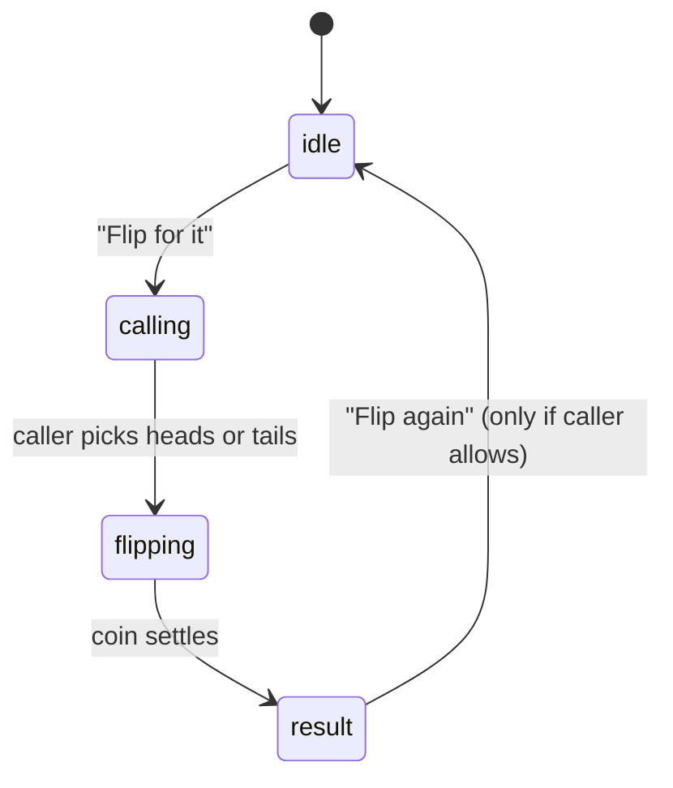

# feat: Reusable coin flip component

## Overview

A self-contained coin flip: two participants in, one winner out. It knows
nothing about matches, leagues, breaks, or ties — callers bring two names and
receive a result. No schema change, no persistence, no realtime.

## Problem Frame

The app has no way to produce a 50/50 decision between two sides. Deciding who
breaks and settling a tie both need one, and so will the tournament and
individual-race formats now being introduced. Building it as a module rather
than as part of any one of those means the first caller pays for it and every
caller after gets it free.

See origin: `docs/brainstorms/2026-09-08-coin-flip-component-requirements.md`

## Requirements Trace

- R1. Accepts two participants of shape `{ id, name }` — players and teams alike
- R2. The call is captured before the result exists
- R3. Produces exactly one winner; a flip cannot tie
- R4. Reports the result via callback; writes and persists nothing
- R5. Runs standalone with no surrounding context
- R6. Accepts externally supplied state, including a supplied result
- R7. Announces the winner by name, not by coin face alone
- R8. Result is legible without color carrying meaning

## Scope Boundaries

- No persistence, no table, no migration
- No cross-device sync or realtime subscription
- No timeout or no-response handling
- No preference or league configuration
- No changes to `match_games`, `home_action` / `away_action`, or the
  `prep_match` RPC

### Deferred to Separate Tasks

- **Break-first assignment** — belongs to the Pairings Generator's break/rack
  stage; `docs/league-system/modules/pairings-generator.md:133` already lists
  `coin-flip-then-alternating` as a future variant. Separate work.
- **Tie resolution** — `docs/league-system/modules/tiebreak-system/coin-flip.md`
  (locked) specifies `coin_flip` as an atomic Tiebreak Mechanism. Blocked behind
  Win Calculator's metric precedence stack, which is not built.
- **Tamper resistance** — a caller needing the outcome beyond one device's
  influence supplies the result via R6. Not this component's problem.

## Context & Research

### Relevant Code and Patterns

- `src/components/InfoButton.tsx` — the house pattern for a small self-contained
  reusable component: `@fileoverview` header explaining role and reasoning,
  documented props interface, named export.
- `src/components/ui/button.tsx`, `card.tsx`, `dialog.tsx` — shadcn primitives.
  Per project standards, every button and container uses these; no bare
  `<button>` elements.
- `src/components/COMPONENTS_INDEX.md` — the reusable-component catalog; new
  reusable components are listed here.
- `src/components/scoring/ConfirmationDialog.tsx` — precedent for a deliberately
  "dumb" component that renders what it is given and delegates every decision to
  its caller. Same posture applies here.

### Institutional Learnings

- Break/rack is currently assigned per round at lineup lock
  (`src/systems/pairings/stages/breakRackAssignment.ts:45`) and all game rows are
  written upfront by `prep_match`. Confirms this component must not attempt to
  set a breaker itself.
- Test placement drives vitest scheduling. Nothing here touches Postgres, so
  every test in this plan is co-located with its source and runs in the parallel
  `unit` project. No `src/__tests__/database/` files, no jsdom pragma.

## Key Technical Decisions

- **Randomness is injected, not imported.** The coin-tossing function takes an
  optional random source. This makes tests deterministic without mocking
  globals, and it is the same seam that lets a caller supply a result from
  elsewhere (R6). One decision serves both needs.
- **Logic is separated from React.** The resolution rules live in a plain module
  so they can be tested without a DOM and reused by a non-visual caller.
- **The component is uncontrolled by default.** The standalone case is the
  common one and should require no wiring. External control is opt-in via a
  supplied result.
- **A four-state machine, not booleans.** `idle → calling → flipping → result`
  makes "the call precedes the flip" (R2) structural rather than a convention a
  caller could violate.
- **Participants stay generic.** No `playerId` or `teamId` anywhere in the
  component. `{ id, name }` is the whole contract.

## Open Questions

### Resolved During Planning

- *Does the component sync across devices?* No. It exposes a controlled seam and
  lets callers own transport.
- *Does it persist the result?* No. Callers persist in their own shape.
- *Who makes the call?* Configurable, defaulting to the second participant, on
  the reasoning that the side that did not initiate should call.

### Deferred to Implementation

- Exact animation timing and easing — needs to be seen moving before it can be
  judged.
- Whether the coin visual warrants its own file or stays inside the component —
  depends on how large the animation markup turns out.

## High-Level Technical Design

> *This illustrates the intended approach and is directional guidance for
> review, not implementation specification. The implementing agent should treat
> it as context, not code to reproduce.*

```
Participant { id, name }
Call        = 'heads' | 'tails'
Face        = 'heads' | 'tails'
FlipResult  { winner, loser, face, call, callerId }

tossCoin(random?)            -> Face
resolveFlip(call, face, caller, other) -> FlipResult
                                 winner = (call === face) ? caller : other
```

State machine inside the component:



A supplied result (R6) enters at `flipping`, replacing the local toss. Every
other transition is identical, so the controlled and uncontrolled paths share
one code path rather than branching.

## Implementation Units

- [ ] **Unit 1: Flip logic and types**

**Goal:** The rules of a coin flip, with no React and no randomness baked in.

**Requirements:** R1, R2, R3, R6

**Dependencies:** None

**Files:**
- Create: `src/components/coinflip/types.ts`
- Create: `src/components/coinflip/flipCoin.ts`
- Test: `src/components/coinflip/flipCoin.test.ts`

**Approach:**
- `types.ts` holds `Participant`, `Call`, `Face`, `FlipResult`. Participant is
  `{ id: string; name: string }` and nothing more.
- `tossCoin` takes an optional random source defaulting to `Math.random`, so
  tests inject a stub instead of monkey-patching a global.
- `resolveFlip` is total and pure: given a call, a face, and both participants,
  it always names a winner.
- Keep both functions in one small file; splitting two functions across two
  files would be ceremony.

**Execution note:** Implement test-first. The rules are small enough to state as
tests before code, and doing so pins the winner-selection rule before any UI
exists to obscure it.

**Patterns to follow:**
- `src/utils/formatters` for the shape of a plain, dependency-free utility module

**Test scenarios:**
- Happy path: call `heads`, face `heads` → caller wins
- Happy path: call `heads`, face `tails` → other participant wins
- Happy path: call `tails`, face `tails` → caller wins
- Happy path: call `tails`, face `heads` → other participant wins
- Happy path: result carries the face, the call, and the caller's id back to the
  reader, so a caller can display "called heads, landed tails"
- Edge case: injected random source returning exactly `0` → one specific face;
  returning a value just under `1` → the other. Pins the boundary rather than
  asserting "it's random"
- Edge case: two participants with identical names but different ids resolve to
  the correct one by id, not by name
- Edge case: over many tosses with a real random source, both faces occur —
  guards against a `<` / `<=` slip that makes the coin one-sided. Assert both
  faces appear, not a specific ratio, so the test cannot flake

**Verification:**
- Winner selection is provable without rendering anything
- No import of React, no import of `Math.random` at module scope

---

- [ ] **Unit 2: The coin flip component**

**Goal:** A component that runs the whole flip and hands back a result.

**Requirements:** R1, R2, R3, R4, R5, R7, R8

**Dependencies:** Unit 1

**Files:**
- Create: `src/components/coinflip/CoinFlip.tsx`
- Test: `src/components/coinflip/CoinFlip.test.tsx`

**Approach:**
- Props: the two participants, an optional caller id defaulting to the second
  participant, an `onResult` callback, and an optional flag for whether
  re-flipping is offered.
- Drives the four-state machine. The call is recorded in state before
  `tossCoin` is invoked — R2 is enforced by ordering, not by comment.
- `onResult` fires once per flip, when the coin settles.
- Announces the outcome as the winner's name (R7). The face is shown as
  supporting detail, never as the answer by itself.
- The result state pairs its color with a text label so the outcome reads
  without color vision (R8).
- shadcn `Button` for every control, `Card` for the container. No bare elements.

**Patterns to follow:**
- `src/components/InfoButton.tsx` — file header, props documentation, export style
- `src/components/scoring/ConfirmationDialog.tsx` — dumb component, caller owns
  the decisions

**Test scenarios:**
- Happy path: renders both participant names in the idle state
- Happy path: pressing "Flip for it" moves to the call state and offers heads
  and tails
- Happy path: choosing heads with a stubbed toss of heads announces the caller
  as winner by name
- Happy path: choosing heads with a stubbed toss of tails announces the other
  participant as winner by name
- Happy path: `onResult` fires exactly once, carrying the same result the UI
  displays
- Edge case: the caller defaults to the second participant when no caller id is
  given
- Edge case: an explicit caller id of the first participant makes that side call
- Edge case: no heads/tails choice is reachable before "Flip for it" is pressed
  — the call cannot be made after the coin is already in the air
- Edge case: with re-flip disabled, no re-flip control renders in the result
  state
- Error path: a caller id matching neither participant does not crash and does
  not silently pick a winner at random — it falls back to the documented default
- Integration: a full pass through all four states leaves the component in the
  result state with the winner still displayed, not reset

**Verification:**
- The component renders and completes a flip on a bare page with two names and
  no other context (R5)
- Nothing in the file references match, league, game, team, or player

---

- [ ] **Unit 3: Coin animation**

**Goal:** Make the coin visibly travel so the result feels decided rather than
asserted.

**Requirements:** R7, R8

**Dependencies:** Unit 2

**Files:**
- Modify: `src/components/coinflip/CoinFlip.tsx`
- Create: `src/components/coinflip/Coin.tsx` *(only if the markup outgrows the
  component; see deferred questions)*

**Approach:**
- CSS transform animation only — no animation library, no new dependency.
- The `flipping` state holds until the animation completes, then transitions to
  `result`. The delay is the animation, not an arbitrary timer competing with it.
- Respect `prefers-reduced-motion`: the flip still resolves and still announces
  the same winner, it just does not spin.

**Patterns to follow:**
- Tailwind utilities and existing project animation conventions rather than a
  new library

**Test scenarios:**
- Happy path: the result state is not reached before the flipping state has
  been entered
- Edge case: under reduced-motion, the flip still produces and announces a
  winner
- Edge case: unmounting mid-flight does not fire `onResult` or update state
  after unmount

**Verification:**
- A flip reads as an event rather than an instant state change
- No new package added to `package.json`

---

- [ ] **Unit 4: External control seam**

**Goal:** Let a caller supply the result instead of the component generating it.

**Requirements:** R6

**Dependencies:** Unit 2

**Files:**
- Modify: `src/components/coinflip/CoinFlip.tsx`
- Test: `src/components/coinflip/CoinFlip.test.tsx`

**Approach:**
- An optional supplied face prop. When present, the component uses it instead of
  tossing. Every other transition is unchanged, so both paths share one code
  path.
- This is the seam a future caller uses for a server-generated or cross-device
  result. It is deliberately the smallest thing that makes those possible — no
  transport, no async, no subscription.
- Document on the prop *why* it exists, so the next reader understands it is a
  seam and not dead weight.

**Test scenarios:**
- Happy path: a supplied face of tails with a call of tails makes the caller win,
  regardless of what the random source would have returned
- Happy path: a supplied face is reflected in the announced result
- Edge case: with a face supplied, the injected random source is never consulted
- Edge case: with no face supplied, behavior is identical to Unit 2

**Verification:**
- A caller can fully determine the outcome without the component changing
- The uncontrolled path still needs no props beyond the two participants

---

- [ ] **Unit 5: Catalog and documentation**

**Goal:** Make the component discoverable so the next feature reuses it instead
of rebuilding it.

**Requirements:** R5

**Dependencies:** Units 1–4

**Files:**
- Modify: `src/components/COMPONENTS_INDEX.md`
- Modify: `TABLE_OF_CONTENTS.md`

**Approach:**
- Add a `CoinFlip` entry to the component catalog following the existing
  purpose / use cases / key features / props format.
- Add every new file to the table of contents and update its "Last Updated"
  date, per project standards.

**Test expectation:** none — documentation only, no behavioral change.

**Verification:**
- The component is findable by someone who does not already know it exists

## System-Wide Impact

- **Interaction graph:** None. Nothing existing imports this component; it
  introduces no new call into any current flow.
- **Error propagation:** Contained. The component reports through `onResult`
  and throws nothing at its caller.
- **State lifecycle risks:** Only the in-flight unmount case, covered in Unit 3.
  There is no persisted state to leave half-written.
- **API surface parity:** None — no API, no route, no exported type consumed
  elsewhere yet.
- **Unchanged invariants:** `match_games.home_action` / `away_action` remain
  written solely by the Pairings Generator at lineup lock via `prep_match`. This
  plan does not read them, write them, or change who owns them. The locked
  Tiebreak System and Pairings Generator docs are untouched.

## Risks & Dependencies

| Risk | Mitigation |
|------|------------|
| The seam in Unit 4 is speculative and never gets used | It is one optional prop reusing the same code path, not a parallel implementation. If no caller ever supplies a face, the carrying cost is a prop and a paragraph. |
| A one-sided coin ships unnoticed because "random" is hard to assert | Unit 1 pins both boundary values of the injected source and asserts both faces occur across many tosses — a `<` / `<=` slip fails the test. |
| A future caller reaches for this to decide breaks and wires it straight into game rows | Scope boundaries name the Pairings Generator as the owner, and the component exposes no way to write anything. |
| Result readable only by color | R8 is a stated requirement with a test-visible consequence: the winner is announced by name. |

## Documentation / Operational Notes

- No migration, no deploy step, no rollout concern.
- Not user-visible until a caller mounts it, so no feature gate and no
  `LIST_FOR_ED.md` entry is needed.

## Sources & References

- **Origin document:** `docs/brainstorms/2026-09-08-coin-flip-component-requirements.md`
- Break/rack assignment: `src/systems/pairings/stages/breakRackAssignment.ts:45`
- Future break variants: `docs/league-system/modules/pairings-generator.md:133`
- Locked tiebreak spec: `docs/league-system/modules/tiebreak-system/coin-flip.md`
- Component conventions: `src/components/InfoButton.tsx`,
  `src/components/COMPONENTS_INDEX.md`
