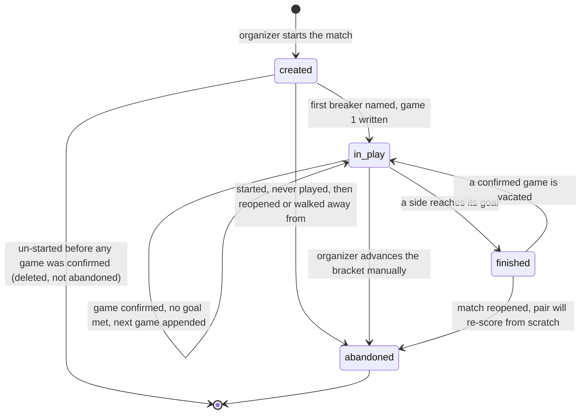

# feat: Self-scoring for individual races

## Overview

Build the **race** — two individual players, first to a per-side goal number — as a
standalone primitive with its own storage, its own scoring RPCs, and its own small
room. Tournament brackets consume it first. Individual-race leagues consume the same
code later, unchanged.

The race is built and tested **with no parent at all** before anything points at it
(see origin: R8). That isolation is the method, not a feature: it keeps the primitive
from absorbing tournament concerns it will have to shed again for leagues.

## Problem Frame

One person records every result today — the organizer in a tournament, the captains in
a league. `self_scoring` is a premium tournament feature already in the catalog
(`src/brackets/paid/premiumFeatures.ts`), but the durable target is larger: leagues
where each team puts up one player at a time and that pair plays a race.

Two things make a race unlike anything the app scores today, and neither is about teams:

1. **The game count is not known in advance.** A race to 5 takes 5–9 games. Every match
   scored today has a fixed, pre-written game list built by `prep_match`.
2. **A player may have no account.** A tournament walk-in has no login and, today, no
   server-side identity at all.

**Why this one first, of four sold-but-unbuilt features.** `handicap_races`, `venue_tables` and
`notifications` are also in the catalog and also unbuilt. Self-scoring goes first for one reason
that does not apply to the others: it is the only one whose design must also serve individual-race
leagues, so getting the primitive right early has compounding value the others do not have. Be
honest about the cost of that choice — the organizer's workload benefit is **partial** until
`venue_tables` ships (he still taps Start on every match) and `notifications` ships (Confirm mode
has no way to reach him, so this plan substitutes an in-app queue). This is a deliberate bet on
the primitive, not on the fastest workload win.

Full requirements: `docs/brainstorms/2026-09-09-self-scoring-requirements.md`.

## Requirements Trace

Every requirement below is from the origin document. Grouped by the unit that delivers it.

| Requirements | Delivered by |
|---|---|
| Prerequisite for R38 (a hopper row for a latecomer to carry a ticket from) | Unit 1 — late-entry hopper gap |
| R1, R2 (constraint half), R4, R5, R35, R40, R43 (storage half) | Unit 2 — race schema |
| R2 (serialization), R3, R4, R5, R6, R11, R46 | Unit 3 — race engine RPCs |
| R9, R10 | Unit 4 — widen the shared confirmation helpers |
| R18, R19, R20, R43 | Unit 5 — ticket issuance |
| R21, R38, R39, R44 | Unit 6 — validate |
| R11, R29, R30, R31, R41, R42 | Unit 7 — bracket integration |
| R22–R28 | Unit 8 — the Scoring tab |
| R3, R10 (UI half), R16, R34, R37, R45 | Unit 9 — the race scoring room |
| R32, R37, R42 (player side) | Unit 10 — player entry + league walkthrough |
| R8 | Structural — Units 2 and 3 build and test the race with no parent; Unit 7 is the first thing to point at one |
| R12–R15, R17 | Unit 3 resolves the list at creation; Unit 6 re-resolves it when a participant gains an identity |
| R36 | Unit 3 (organizer may always score) + Unit 6 (list re-resolves on identity gain) |
| R7, R33 | Structural — no parent pointer anywhere in Unit 2; verified against a league night by Unit 10 |

## Scope Boundaries

- **No user-facing practice mode.** Parentless races work by construction; no button ships.
- **No notifications, no venue/tables, no handicapped races.** Separate premium features.
  This design leaves sockets for them and builds none.
- **No break-and-run / golden-break tracking inside a race.** Later.
- **No modular scoreboard.** Unit 9 ships the agreed placeholder.
- **No Phase D saved setups.**
- **`ScoreMatch.tsx`, `useMatchScoringMutations.ts`, and the `matches` / `match_games`
  write paths gain no changes.** Unit 4 widens two shared helpers additively and keeps
  every existing signature green.

### Deferred to Separate Tasks

- **League individual-race play** (schedule shape, standings, stats reads): its own phase.
  Unit 10 only proves the race primitive can serve it without change.
- **Tournament game history / disposability**: Ed has explicitly tabled this for its own
  brainstorm because it reaches into the league side. Unit 2 gives a race its own
  `last_activity_at` so orphans can age out; it designs no history feature.
- **`brackets.game_type` on the Info tab**: stays as-is. Unit 8 adds per-side overrides
  that fall back to it.

## Context & Research

### Relevant Code and Patterns

**The anon-write template — copy wholesale.**
`supabase/migrations/20260906181438_bracket_walkup_self_add.sql`. `SECURITY DEFINER`,
`SET search_path`, token-addressed (never takes a raw id), reads the purchased-feature
gate *inside the function*, enforces every cap in SQL, returns
`jsonb {ok:false, reason:'...'}` rather than throwing. Its header is a written threat
model. This answers the origin document's deferred question about where the anon path
reads the feature gate: **in the function.**

**The table template.** `supabase/migrations/20260525000000_game_confirmations.sql` —
result-snapshot columns deliberately kept FK-free so a later delete cannot mutate
history, realtime publication + `REPLICA IDENTITY FULL`, `COMMENT ON` prose.

**Serialization.** The repo's existing idiom is
`SELECT … INTO v_row FROM … WHERE id = … FOR UPDATE;` followed by re-checking the guard.

**Grant posture.** Supabase auto-grants EXECUTE on new functions to `anon`. Every
bracket write RPC therefore carries an explicit
`REVOKE EXECUTE … FROM PUBLIC, "anon"`. **An omitted REVOKE is an accidental anon grant.**

**Client call path, three hops, no exceptions.** Component → `src/api/hooks/useBrackets.ts`
→ `src/api/mutations/brackets.ts` / `src/api/queries/brackets.ts` → `supabase.rpc()`.
Each RPC's `reason` union is mirrored as a TypeScript type client-side
(`SelfWalkupResult`, `LateEntryResult` are the templates).

**Realtime.** `src/brackets/useBracketRealtime.ts` — one hook, every handler is the same
`invalidate()`, never applies payloads to state. Its contract: *"State is data-derived,
so a missed event only delays an update; it never corrupts the view."*

**The confirmation layer.** `src/utils/match/deriveDissents.ts` defines
`ConfirmationWithResult`, whose `confirmer_id` is **already nullable** and whose malformed
rows are skipped rather than thrown on. `src/api/hooks/useGameConfirmations.ts` (58 lines,
`staleTime: 0`, `refetchOnMount: 'always'`) is the template for `useRaceConfirmations`.

**Storage-consequence principle.** `src/hooks/useScoringParticipationModes.ts` — persistence
scales with consequence, and it carries a StrictMode-safe deferred-clear mechanic
(module-scoped timer, not a ref) worth copying rather than reinventing.

### Institutional Learnings

- **Migration filenames need a real UTC `YYYYMMDDHHMMSS`.** The legacy all-zeros form
  collided across branches and cost 8 days of dead staging in Sept 2026. Before commit,
  `ls supabase/migrations | sed 's/_.*//' | sort | uniq -d` must return empty (currently clean).
- **`supabase migration up`, never `db reset`.** A reset wipes Ed's local test data
  including the mock card the paid tournament flow needs.
- **Publishing tables to realtime requires `supabase stop && supabase start` locally**
  before events actually arrive. After a `db reset`, `realtime.subscription` silently stays
  at zero rows and only a full stop/start fixes it. Say this in the unit body, not a footnote.
- **Every premium feature gates independently** via `hasPremiumFeature`. Ed caught a real
  leak on 2026-09-06 where payment-tracker UI shipped gated under `real_players`. Each unit
  adds tests pinning **both** postures.
- **CI does not run the `db` vitest project.** `.github/workflows/checks.yml` runs `unit`
  only. Database tests here are only as good as someone running them; do not claim CI
  coverage for the RPC guards.
- **Build the confirm loop data-derived, not event-derived.** `pendingConfirmations.ts`
  re-scans on every load/refetch/poll, so a missed realtime event delays a prompt but can
  never lose it. This is the fix that made two-device scoring reliable.
- **Vacate-and-rescore is the only correction path.** No per-field edits on completed games,
  no edit affordance, and no surfacing "should we follow it?".
- **The scoring path must never throw.** Log and bypass; games won/lost are sacred.

### External References

Researched narrowly, for the claim-ticket mechanism only.

- [W3C TAG — Good Practices for Capability URLs](https://w3ctag.github.io/capability-urls/) —
  a ticket is a **capability**, not a session. It should encode access to a resource, not
  actions on it, and should expire. 120+ bits; a v4 UUID suffices.
- [RFC 8628 §6.1 (OAuth Device Grant)](https://www.rfc-editor.org/rfc/rfc8628.html) — a
  short human-typed code is safe only *in combination with* an attempt cap. Structurally our
  exact problem: a human reads a code aloud to bind a device.
- [NIST SP 800-63B](https://pages.nist.gov/800-63-4/sp800-63b.html) — out-of-band secrets:
  ≥6 decimal digits, invalid after ~10 minutes, rate limiting mandatory.
- [CERT VU#723755 (WPS PIN)](https://www.kb.cert.org/vuls/id/723755) — validating a code in
  separable parts, or returning distinguishable errors, collapses the search space. Validate
  as one check with one generic failure.
- [Supabase — Securing your API](https://supabase.com/docs/guides/api/securing-your-api) —
  there is **no platform rate limiting on RPC calls**; it is our job.
- Prior art: [Score7](https://kb.score7.io/blog/guides/let-participants-report-their-own-match-results/)
  runs participant self-reporting on per-participant links with no account, and treats the
  organizer override as the security model. Same posture as ours.

## Key Technical Decisions

**Tickets and validation codes live in a schema PostgREST does not expose.**
This is the single most important decision in the plan. The baseline carries 78 statements
of the form `GRANT ALL ON TABLE "public"."<table>" TO "anon"`, and RLS is off. The anon key
ships in the client bundle. So **any ticket column on a public table is publicly
downloadable in one REST request** — the "non-enumerable uuid" becomes a list. Tickets and
codes go in a private schema with grants revoked from `anon` and `authenticated`, reachable
only through `SECURITY DEFINER` functions. This is correct independently of the pre-launch
RLS pass, and it does not depend on it.

**A race carries an explicit status.** `created | in_play | finished | abandoned`. Three
separate requirements need it and none named it: R21's write guard ("live and not
complete"), R46's abandoned race, and R5's finished race being reopened by a vacate. Without
a status field those are transitions between states that do not exist.

**The append is one serialized server-side operation.** `FOR UPDATE` on the race row, then
re-check the gate, then write — all in the transaction that records the confirmation
satisfying the gate. Plus a uniqueness constraint on (race, game number). Both phones
evaluate the gate at the same instant; a client-side append would write two game 6s.

**`start_bracket_match` becomes an RPC.** Setting `in_progress` is a plain
`.from('bracket_matches').update()` today (`src/api/mutations/brackets.ts:183`). Since that
flip now *creates the race*, the two must happen atomically or a started match can exist
with no race. An RPC rather than a database trigger — triggers hide behavior, and every
other bracket write here is an RPC.

**`reopen_bracket_match` clears `in_progress` and detaches the race.** Nothing clears that
flag today — not `advance_bracket_winner`, not `reopen_bracket_match` — and `MatchCell` only
offers the toggle while `status = 'ready'`. So a reopened match would sit at `in_progress =
true` forever, the creation trigger would never fire again, and R41's "they score it again
from scratch" would be dead on arrival. Reopen marks the old race `abandoned` and clears the
flag so a fresh Start makes a fresh race.

**One ticket binds to at most one participant per bracket.** Otherwise Joe validates his own
code, later enters Bob's (overheard, or forwarded), and one phone holds both sides of a race
— satisfying "both must agree" alone, from credentials the server legitimately issued.

**The validation code's safety comes from the attempt cap, not its length.** Six digits is
~20 bits, about a millionth of the ticket's strength. Five attempts per code, ~10 minute TTL,
burned on success and on reissue, one generic failure message that never reveals a code was
real but belonged to someone else. **The attempt is recorded before the check runs** — if the
counter increments in the same transaction as a failure, the failure rolls the counter back
and a brute-force loop never trips the limit.

**No IP-based rate limiting.** A bar is one NAT; every player shares an address, so IP limits
punish the tournament rather than an attacker. Limit per code and per bracket instead. (Also:
Supabase's documented `x-forwarded-for` extraction is client-spoofable.)

**Race confirmations get their own table, mapped onto the existing derive contract.**
`game_confirmations.confirmer_id` is NOT NULL with a foreign key to `members`; a ticket holder
has none. The race's table mirrors its shape and semantics and is projected onto
`ConfirmationWithResult` to feed `deriveDissents` / `deriveDisputes` unchanged.

**The concurrency protocol is reimplemented server-side, not reused.** The components are
genuinely reusable, but the correctness guarantees of league scoring live in
`src/hooks/useMatchScoringMutations.ts` — the re-read-before-write, the conditional
`.is(officialityColumn, null)` update, the both-initiators auto-clear. R9 forbids editing that
file, and R2 already requires the race's append to be a serialized RPC. So the race's RPC owns
its own version. This is the largest sizing correction the research produced: R10's reuse is
real for UI, not for the protocol.

**A disagreement is made visible, never adjudicated.** Everyone is standing at the table. A
disputed rack shows loudly on both phones; the players call the organizer over and he settles
it in person and scores it under his existing authority. No new mechanism, no arbitration
flow, and deliberately no attempt to resolve remotely a problem that is never remote.

**The organizer gets no self-scoring carve-out.** He is usually entered in his own tournament.
Confirming his own win with his opponent standing beside him is not a fraud vector — but it is
a one-eye result, so it carries the same single-vouch mark as any other. Visible, not blocked.

**`VacateModal.tsx` is dead code** (zero callers; `ScoreMatch.tsx` uses `EditGameDialog`). The
race room uses `ConfirmationDialog`'s existing `isVacateRequest` mode rather than adopting an
orphaned component.

## Open Questions

### Resolved During Planning

- *Where does the anon write path read the purchased-feature gate?* Inside the RPC, exactly as
  `add_self_as_walkup` reads `real_players`.
- *Does the race carry its parent?* No — parents point at the race. Orphan cleanup is solved by
  giving the race its own `last_activity_at` rather than a back-pointer.
- *New table or widened `game_confirmations`?* New table; the existing one's NOT NULL member
  foreign key forecloses the alternative.
- *`VacateModal` or `EditGameDialog`?* Neither — `ConfirmationDialog`'s vacate mode.
- *Trigger or RPC for race creation?* RPC.

### Deferred to Implementation

- Exact `reason` string set for each RPC — settles while writing the guards.
- Whether `useRaceRealtime` can subscribe to all three race tables on one channel or needs two.
- Whether the ticket lives in `sessionStorage` or `localStorage`. It is the highest-consequence
  thing we would ever put in browser storage; the walk-in who closes their tab between rounds
  is a real argument for `localStorage`, and the decision should be stated in the file header
  rather than defaulted into.
- Final shape of the minimal row interface in Unit 4, which falls out of making the existing
  test file pass unchanged.

### Deferred to Ed (not blocking)

- The Scoring tab's name (provisional: "Scoring").
- Shipped defaults for break rule, race length per side, and game type per side.
- Whether the `self_scoring` catalog blurb — which promises buyers "You'll pick one thing" —
  gets reworded, or the four format settings get folded behind an "Advanced" disclosure.

## High-Level Technical Design

> *This illustrates the intended approach and is directional guidance for review, not
> implementation specification. The implementing agent should treat it as context, not code to
> reproduce.*

The race's state machine — several requirements describe transitions across it, so it is worth
seeing whole:



Writes are accepted only in `created` and `in_play`. `abandoned` is terminal and keeps the games
actually played, as history — whereas un-starting a race that has no confirmed game *deletes* it,
because nothing happened worth keeping.

One transition needs naming because it is the awkward one: a vacate-and-re-score can take a race
`finished → in_play → finished` **with a different winner**, while its parent already advanced on
the old one. `advance_bracket_winner` no-ops once a winner is set, so the tree will not correct
itself. The race room must say plainly that the bracket disagrees and name reopen as the path
(R41), rather than displaying a result the bracket never took.

The one loop that matters, all inside a single transaction:

```
record the confirmation
  lock the race row
  is every game confirmed?           no  -> stop
  has a side reached its goal?       yes -> mark finished, announce
                                     no  -> append the next game,
                                            breaker per the race's break rule
```

## Delivery Increments

The units below are ordered so that **a slip still ships a working feature**, which matters more
than usual here: one developer, and the security-dense identity work is the most likely thing to
run long.

- **Increment A — registered players score their own races.** Units 0–4, 7, 8, 9. R13 says two
  identity-holding players run the identical path, and member identity already exists, so this
  is a complete, sellable feature on its own: *each pair confirms their own winner from their
  phones*. Unit 3's identity check still resolves **member OR ticket** from the first line of
  code — that boundary is written once, as agreed — there is simply no ticket to hand it yet.
- **Increment B — walk-ups.** Units 5, 6, 10. Issuance, the Validate code, and player entry for
  ticket holders.

If Increment B slips, Increment A is still a shipped feature rather than a settings tab for
something that does not work. **Do not expose the Scoring tab before the room exists** — a
paying organizer finding settings for a feature that does nothing is worse than finding nothing.

## Implementation Units

### Phase 0 — check the design before pouring concrete

- [ ] **Unit 0: Walk a league night against the designed race**

**Goal:** Run R32's acceptance test **before** the schema exists, while its output can still
change column shapes for free.

**Requirements:** R32, R7, R33.

**Dependencies:** None. This is the first thing done.

**Files:**
- Create: `docs/plans/2026-09-09-002-league-race-walkthrough.md`

**Approach:**
- No code. Walk one 5v5 individual-race league night against the race **as designed in this
  plan**: five races under one matchup, who sits on each race's scoring list, how home/away
  identity resolves for standings, what a forfeit or a substitution does, and how a league
  `matches` row — which already carries its own end-of-night verification — relates to five
  child races.
- Answer three specific questions the design has not yet been tested against:
  1. Which seat holds a **placeholder** player (a league member with no account)?
  2. **Where do a league race's per-side goals come from?** The locked Match Format Module
     (`docs/league-system/modules/match-format.md`) already owns `raceLength` and is
     season-stable. If that mapping is not written down, the bracket's per-side race length
     becomes a second source of truth for race length — exactly what the project's canon rules
     against.
  3. Where does R17's neutral scorekeeper sit in the scoring list?
  4. **How does a league forfeit end a race?** The tournament posture is "someone who leaves is
     simply gone" and produces no result. A league forfeit is the opposite — a *recorded* result
     with credited games, possibly carrying dues and handicap consequences. The race has no state
     meaning "ended without play, with a result." That may be a fifth status, and finding out now
     is free.
  5. **What does a substitution do to a seat?** R1 stamps participants at creation and no
     transition changes them; abandon-and-recreate strands the games already played.
  6. **What marks the parent `matches` row complete** when a league race night creates no
     `match_games` rows? R33 calls the league gap "read-side only," but `matches.status` is driven
     by machinery those rows feed — and R9 forbids touching that write path. Both cannot be true;
     this question decides which gives.
- Output is either confirmation, or a list of gaps that changes Unit 2's schema.

**Execution note:** This is prose and costs a day. R32 calls the league case "the acceptance
test for the whole design," and a test run after nine units of committed migrations is not a
test — it is an autopsy. Running it first is the single cheapest risk reduction in the plan.

**Test scenarios:** Test expectation: none — this is an analysis artifact, not code. Its
verification is that a reader can trace all five races of a league night through the designed
tables without inventing a field.

**Verification:** Either the design is confirmed against a league night, or Unit 2 starts from
an amended schema.

---

### Phase 1 — the race, standalone

- [ ] **Unit 1: Close the late-entry hopper gap**

**Goal:** A walk-in seated into a bye by `add_late_entry` keeps their identity on their own
phone. Today they lose it and are locked out of the tournament page entirely.

**Requirements:** Prerequisite for R38.

**Dependencies:** None. Independently correct; land it first.

**Files:**
- Create: `supabase/migrations/<real UTC stamp>_bracket_late_entry_hopper_row.sql`
- Test: `src/__tests__/database/bracket.lateEntry.db.test.ts` (extend)

**Approach:**
- `get_bracket_player_view` builds `waiting` and `official` from `bracket_hopper`, but
  `add_late_entry` inserts into `bracket_participants` only. `JoinHopperPage.tsx` calls
  `forgetWalkupName` when a remembered name is not backed by those lists — so the latecomer's
  stored name is erased, they are shown `AddMyNameCard` again, and `add_self_as_walkup` refuses
  with `not_accepting` because the bracket is `live`. They cannot get back in.
- Have `add_late_entry` write the matching hopper row — but it is writing into a table with two
  unique indexes its existing guards never had to satisfy. `name_taken` and `already_in` both
  query `bracket_participants` only, while the hopper carries
  `bracket_hopper_bracket_name_key` on (bracket_id, lower(btrim(display_name))) and
  `bracket_hopper_bracket_member_key` on (bracket_id, member_id). Someone who joined the hopper
  during setup and was never admitted has a hopper row and no participant row — so a latecomer
  with that name passes the check and then hits an unhandled unique violation, turning a
  documented refusal into a thrown exception. **Extend both checks to cover the hopper.**
- State the new row's `status` and `seed` explicitly. `bracket_hopper.status` defaults to
  `'hopper'`, which renders the latecomer under *waiting* rather than *official* — and setting
  `'official'` on a row carrying a `member_id` fires the existing bracket-roster trigger, quietly
  adding them to the organizer's saved roster. Pick deliberately and say which.
- This is a pre-existing bug, not new scope — but R38 has nothing to carry a ticket *from*
  without it.

**Patterns to follow:** `supabase/migrations/20260907182857_bracket_late_entry.sql`.

**Test scenarios:**
- Happy path: a late entry into a bye produces a `bracket_hopper` row whose name matches the
  participant row.
- Integration: after a late entry, `get_bracket_player_view` returns that player under
  `official`, so the browser's remembered name survives the settled-fetch check.
- Edge case: a late entry for a registered member (member id supplied, name null) also produces
  a coherent hopper row.
- Error path: existing refusals (`already_played`, `already_started`, `name_taken`) still return
  their same reasons and write nothing.
- Error path: a late entry whose name matches an **un-admitted hopper** candidate returns
  `name_taken` and writes nothing (today this would throw a unique violation).
- Error path: a registered member with an un-admitted hopper row returns `already_in`.
- Edge case: the new hopper row lands in the intended list, and an organizer's saved roster gains
  no unintended entry.

**Verification:** A walk-in added after start can reload the tournament page and still see
themselves as entered.

---

- [ ] **Unit 2: Race schema**

**Goal:** The tables a race needs, plus the private schema that makes tickets safe.

**Requirements:** R1, R2 (constraint half), R4, R5, R35, R40, R7 (no parent pointer).

**Dependencies:** None.

**Files:**
- Create: `supabase/migrations/<real UTC stamp>_races.sql`
- Modify: `src/types/database.types.ts` (regenerate)
- Test: `src/__tests__/database/race.schema.db.test.ts`

**Approach:**
- `races` — the two participants (each a member id **or** a bracket participant id, both
  nullable, exactly one set per side), `goal_home` / `goal_away`, break rule, game type,
  `status`, `last_activity_at`, `created_at`. **No parent pointer** (R7). The scoring list is
  its own child table so it can hold a member, a ticket holder, or the organizer, and can grow
  later for a neutral scorekeeper (R17).
- `race_games` — game number, breaker, winner, the result-snapshot columns matching
  `match_games`' vocabulary, confirmation columns. Unique on (race, game number).
- `race_confirmations` — mirrors `game_confirmations`' shape and semantics (`action`,
  `is_initiator`, `auto_confirmed`, `reason`, result snapshot) but with the confirmer expressed
  as a member id **or a bracket participant id** — never the raw ticket — and `side` as the
  literal text `'home'` / `'away'`. Snapshot columns stay FK-free so a later delete cannot
  mutate history.
- **Two shape rules that silently break the reused layer if missed.** `deriveDissents` skips any
  row whose `side` is not exactly `'home'` or `'away'` and never throws — a participant uuid
  there means every dissent and dispute is dropped forever, invisibly, which is the precise
  failure the many-eyes layer exists to catch. And a raw ticket value must never be written to a
  public-schema table: the scoring RPC resolves the ticket inside the private schema to the
  participant it is bound to and persists only that. Writing the ticket here would hand every
  live bearer credential to anyone with the anon key in one REST request, defeating the reason
  the private schema exists at all.
- **Revoke writes on the race tables themselves.** This is not optional and it is easy to miss:
  the baseline runs `ALTER DEFAULT PRIVILEGES … IN SCHEMA "public" GRANT ALL ON TABLES TO "anon"`,
  so a table created in `public` is born **anon-writable** — that is why `setMatchInProgress` can
  update `bracket_matches` straight from the client today. Left alone, the anon key in the client
  bundle could insert a game 6, flip a winner, or forge a confirmation directly, bypassing the
  serialized append, the scoring-list check and the unique constraint the whole design rests on.
  `REVOKE INSERT, UPDATE, DELETE ON races, race_games, race_confirmations FROM "anon",
  "authenticated"` — all writes go through the RPCs. Keep SELECT (realtime and the room read
  these tables directly). The exposure comes from **default privileges**, not from an explicit
  grant, so there is nothing to find by grepping for GRANT.
- A **private schema** (not in PostgREST's exposed list) holding `race_tickets` and
  `validation_codes`, with `REVOKE ALL … FROM anon, authenticated`. See Key Technical Decisions
  — a public-schema ticket column is downloadable with the anon key.
- Publish `races`, `race_games`, `race_confirmations` **and `bracket_participants`** to
  `supabase_realtime` with `REPLICA IDENTITY FULL`. The last one is easy to miss: R36's list
  re-resolution and R39's revoke both write there, and without publication the opponent's phone
  never learns.
- **The bracket's Scoring settings columns live here too.** Unit 7 stamps a race from them and
  Unit 8 edits them, but neither creates them — so Unit 2 does: break rule, per-side race length,
  per-side game type, single-player policy, advance policy, on `brackets`. Per-side values are
  nullable overrides; null means "fall back" (to `brackets.game_type`, or to the winners side for
  the grand final). Explicit nullable columns rather than a jsonb blob, so the fallback is
  expressible in SQL and the generated types stay useful.
- `COMMENT ON` every table and every non-obvious column, ending with this plan's path.

**Execution note:** After applying, Ed must run a full `supabase stop && supabase start` — a
publication change leaves the realtime container serving the old schema, and the symptom is
WebSocket close-before-established loops that look like application bugs. Say so when handing
this over.

**Patterns to follow:**
- `supabase/migrations/20260525000000_game_confirmations.sql` — table shape, snapshot columns,
  publication block, comment style.
- `supabase/migrations/20260904160417_tournament_brackets.sql` — numbered section banners,
  named CHECK constraints, index-per-FK.

**Test scenarios:**
- Happy path: inserting a race with equal goals, then unequal goals, both satisfy their checks.
- Edge case: a race side with **both** a member id and a participant id is rejected; a side with
  neither is rejected.
- Edge case: two `race_games` rows with the same (race, game number) is rejected by the unique
  constraint.
- Error path: the anon role cannot `SELECT` from the private ticket table (this is the test that
  proves the central security decision — assert permission denied, do not assert an empty result).
- Integration: all four tables appear in `pg_publication_tables` for `supabase_realtime` and
  report `REPLICA IDENTITY FULL`.
- Edge case: deleting a race cascades its games and confirmations but touches no bracket row.

**Verification:** `pnpm db:types` (to a temp file first — the `>` redirect blanks the target on a
hang) produces a purely additive diff, and `npx tsc --noEmit` is clean.

---

- [ ] **Unit 3: The race engine**

**Goal:** The loop — create, name the first breaker, score, confirm, append or finish, vacate,
abandon — as serialized `SECURITY DEFINER` functions. This is the heart of the feature and the
only place race correctness lives.

**Requirements:** R2, R3, R4, R5, R6, R11, R12–R15, R36, R46.

**Dependencies:** Unit 2.

**Files:**
- Create: `supabase/migrations/<real UTC stamp>_race_engine.sql`
- Create: `src/api/mutations/races.ts`, `src/api/queries/races.ts`, `src/api/hooks/useRaces.ts`
- Modify: `src/api/queryKeys.ts`
- Test: `src/__tests__/database/race.engine.db.test.ts`,
  `src/__tests__/database/race.append.db.test.ts`

**Approach:**
- `create_race(...)` — stamps the complete self-sufficient record (R1): participants, per-side
  goals, break rule, game type, and the resolved scoring list. Refuses when either seat is empty.
  The **single-player policy (R26) is stamped too**, and its middle position needs a shape: "allow,
  but confirm with me" is not expressible as a scoring list, because the player's write is accepted
  yet not *official* until the organizer okays it. Model it as the list holding both the player and
  the organizer plus a `requires_organizer_vouch` flag the append gate reads — otherwise whoever
  builds this invents a second officialdom gate inside the one function the plan calls the only
  place race correctness lives.
- `set_first_breaker(race, who)` — accepted once, in `created`, serialized so two simultaneous
  taps cannot disagree; writes game 1 and moves to `in_play`. **Gated on the scoring list**, the
  same check `score_race_game` uses — otherwise a spectator, or the walk-up R14 deliberately
  excluded, decides who breaks.
- `score_race_game(...)` — the loop. Resolves identity (member **or** ticket), checks the caller
  is **on the scoring list** — not merely a participant in the race, which is the distinction
  that stops the excluded walk-up scoring anyway — appends the confirmation, locks the race
  `FOR UPDATE`, re-checks the gate, then either appends the next game with the correct breaker
  or marks the race finished.
- `vacate_race_game(...)` — clears the result, appends a vacate marker, and un-finishes the race
  by falling out of the same gate. Games after it remain; they were really played.
- `abandon_race(...)` — for R46, when the organizer advances the bracket manually.
- **When the scoring list has exactly one member** (R15's organizer-only case, or R14 with
  one-sided scoring allowed) there is nobody to prompt: the claim makes the game official in one
  step, and it carries the single-vouch mark (R16) precisely because only one person saw it.
- **Result rule for a re-scored race that runs past a goal** (R5): the winner is the side that
  first reached its goal in game order; later games are retained as history and excluded from
  the announced score.
- Every function: `SET search_path`, `jsonb {ok, reason}` returns, **never throws into the
  scoring path**. Every function except the ticket-facing ones gets an explicit
  `REVOKE EXECUTE … FROM PUBLIC, "anon"`.

**Execution note:** Write the append-gate tests first. The double-append race and the
vacate-un-finishes case are the two behaviors most likely to be wrong and least likely to be
noticed by hand-testing.

**Patterns to follow:**
- `supabase/migrations/20260906181438_bracket_walkup_self_add.sql` — refusal-shape and
  guard-ordering.
- `advance_bracket_winner`'s `SELECT … FOR UPDATE` then re-check idiom.
- `src/api/mutations/brackets.ts` — the `reason` union mirrored as a TypeScript type; throw only
  on transport errors.

**Test scenarios:**
- Happy path: race to 5, one side wins 5–3; exactly 8 game rows exist and the race is `finished`.
- Happy path: unequal goals (5 vs 3) — the side needing 3 wins after 3 wins, not 5.
- Edge case: two simultaneous confirmations of the goal-reaching game produce **one** finish and
  one announce, not two.
- Edge case: two simultaneous appends of game 6 produce one row (the unique constraint holds and
  the second call returns a refusal, not an exception).
- Edge case: no next game is written while any existing game is unconfirmed.
- Edge case: vacating game 3 of 8 returns the race to `in_play`, leaves games 4–8 in place, and
  writes no new game until game 3 is re-scored.
- Edge case: re-scoring a vacated mid-list game so the other player reaches their goal earlier —
  the winner is whoever first reached it in game order, and trailing games are excluded from the
  announced score.
- Error path: a caller who is a race participant but **not** on the scoring list is refused.
- Error path: writes to a `finished` or `abandoned` race are refused.
- Happy path: all three single-player policy positions behave distinctly — allow (one vouch is
  official), confirm-with-me (official only after the organizer's vouch), manual (the player is
  not on the list at all).
- Error path: `set_first_breaker` called twice returns a refusal and does not rewrite game 1.
- Integration: a confirmed game bumps `last_activity_at` on the race.

**Verification:** A full race can be played end to end through the RPCs alone, with no UI.

---

- [ ] **Unit 4: Widen the shared confirmation helpers**

**Goal:** Let a race feed `pendingConfirmations.ts` without a race-local copy of the predicates,
and without changing behavior for league scoring.

**Requirements:** R10, R9.

**Dependencies:** Unit 2 (for the row shape).

**Files:**
- Modify: `src/utils/match/pendingConfirmations.ts`
- Test: `src/utils/match/__tests__/pendingConfirmations.test.ts` (must stay green **unchanged**)
- Test: `src/utils/match/__tests__/pendingConfirmations.race.test.ts`

**Approach:**
- The widening is **two axes**, not one. First, the three predicates take `userTeamId` and
  `homeTeamId` only to compute `mySide` on a single line — so accept a caller-supplied side.
  Second, they type the game as `MatchGame`, which demands `home_position`, `away_position`,
  `is_tiebreaker` and `winner_team_id` that a race row does not have — so accept a minimal row
  interface covering only the fields actually read.
- Keep the existing team-based signatures as thin wrappers. The existing test file passing
  **unchanged** is the acceptance criterion for R9.
- `buildConfirmationItem` / `buildVacateConfirmationItem` take `players: Map<string, Player>` and
  resolve names via `getPlayerNicknameById`. A ticket-holding walk-up has no `Player` row, so
  these need a name-resolver-callback variant — the same seam `DisputeDetailModal` already uses
  via its `getPlayerDisplayName` prop.
- Blast radius, stated honestly: `gameNeedsMyConfirmation` and `gameHasPendingVacateForMe` have
  no production callers, but `ScoreMatch.tsx` imports **four** of these — `decidePendingAction`,
  `buildConfirmationItem`, `buildVacateConfirmationItem` and `buildPersonalConfirmContext` — and
  the latter two are exactly the ones gaining a name-resolver variant.
- **The byte-identical test file is a necessary regression check, not sufficient evidence for R9.**
  It is a pure-function suite; it cannot see the live call site, and the widening's risk runs the
  other way — replacing `MatchGame` with a looser structural interface *weakens* the type
  ScoreMatch binds to, and a passing unit test proves nothing about a signature that now admits
  rows it used to reject. Mitigate by keeping the `MatchGame`-typed overload as the signature
  `ScoreMatch.tsx` binds to, and add a ScoreMatch-level render test covering the confirm and
  vacate prompts as the actual evidence.

**Execution note:** Characterization-first. The existing 433-line test file is the contract;
make it pass untouched before adding the race-shaped cases.

**Patterns to follow:** `DisputeDetailModal`'s injected name resolver.

**Test scenarios:**
- Happy path (regression): every existing assertion in `pendingConfirmations.test.ts` passes with
  no edit to that file.
- Happy path: a race-shaped row with a caller-supplied side yields the same `PendingAction` a
  team-shaped row would.
- Edge case: a race row with no positions and no `winner_team_id` does not throw.
- Edge case: the name resolver returns a walk-up's display name where no `Player` row exists.
- Error path: an unresolvable participant id yields a placeholder name rather than an exception.

**Verification:** `pnpm test:run` green, with the pre-existing test file byte-identical in the diff.

---

### Phase 2 — identity

- [ ] **Unit 5: Ticket issuance**

**Goal:** Scanning the QR mints a ticket that says "this device is somebody," before any name is
typed.

**Requirements:** R18, R19, R20, R43.

**Dependencies:** Units 1, 2.

**Files:**
- Create: `supabase/migrations/<real UTC stamp>_race_tickets.sql`
- Create: `src/brackets/paid/raceTicket.ts`
- Modify: `src/brackets/paid/walkupMemory.ts`, `src/brackets/paid/JoinHopperPage.tsx`
- Modify (SQL): `add_self_as_walkup`, `finalize_bracket_hopper` — the ticket carry-over
- Modify: `src/brackets/paid/JoinQrPoster.tsx` — open the QR door for `self_scoring` (below)
- Test: `src/__tests__/database/race.tickets.db.test.ts`,
  `src/brackets/paid/raceTicket.test.ts`

**Approach:**
- `issue_race_ticket(join_token)` — anon-callable by design, mints a v4 uuid via
  `gen_random_uuid()` into the private schema. **Not UUIDv7** — v7 encodes a timestamp and is
  partially predictable, which silently destroys the property the whole design rests on.
- The ticket is minted **server-side per scan** and never travels in the QR or a URL; the poster
  is public and shared, and a ticket in a URL leaks through history, screenshots and `Referer`.
- Issuance must work on a **live** bracket, unlike `add_self_as_walkup` which is setup-only —
  walk-ins scan at 8pm. That widens the anon surface deliberately, so it gets its own per-bracket
  mint cap (the existing 128-entry cap governs hopper rows, not tickets).
- Tickets expire with the tournament and are swept with it. The **mint cap counts unbound
  tickets**, not all-time mints, and an unbound ticket expires on a short TTL so the pool
  self-heals — otherwise anyone with a photo of the poster loops the RPC until the cap trips and
  no real walk-in can get a ticket at 8pm, which is a denial of service against the feature's own
  headline scenario. The organizer sees a reason string and can reset the cap.
- **Open the QR door for `self_scoring`.** Three places check `real_players` today and each makes
  the feature unreachable on its own: `JoinQrPoster.tsx:45` (no poster), `BracketSetupPage.tsx:101`
  (no setup page, so no Scoring tab), and `add_self_as_walkup`'s own
  `premium_features @> ARRAY['real_players']` check (no waiting room). Each becomes an **OR** of
  the two features. The origin document decided this; no unit owned the work until now.
- **Bind the ticket at the hopper, and carry it across.** A walk-up who scans, types their own
  name and is admitted at Start is the flagship scenario, and nothing currently carries their
  ticket to the participant row: `add_self_as_walkup` writes only a hopper row, and
  `finalize_bracket_hopper` copies hopper rows into `bracket_participants` carrying nothing else.
  So this unit also modifies both — `add_self_as_walkup` (or a small `bind_ticket_to_hopper_entry`)
  records which ticket owns the hopper row, and `finalize_bracket_hopper` copies that binding onto
  the participant it creates. Without this, every self-added walk-up degrades to Unit 6's
  organizer-reads-a-code path, which is the fallback, not the headline.
- Storage: extend `walkupMemory.ts` rather than writing a second storage module, keyed per
  bracket, every access in `try/catch`. State the session-vs-local choice in the file header with
  its reason — this is the highest-consequence thing the app puts in browser storage.
- **Re-scan reuses the ticket already in this browser** rather than minting a second one.
  Note honestly in the header that a scan opening inside an Instagram/Snapchat in-app browser
  lands in a separate storage jar, so the same person on the same phone can end up ticketless —
  that person goes through Unit 6's validation flow, which is the graceful path, not a failure.

**Patterns to follow:** `add_self_as_walkup` for the RPC; `walkupMemory.ts` for storage and its
"convenience, never a source of truth" framing.

**Test scenarios:**
- Happy path: scanning issues a ticket; scanning again in the same browser returns the same one.
- Happy path: a ticket can be issued while the bracket is `live`, not only during `setup`.
- Edge case: the per-bracket mint cap refuses further issuance with a stated reason.
- Error path: `anon` cannot read the ticket table directly — permission denied, not empty rows.
- Error path: an unknown join token is refused without revealing whether the bracket exists.
- Edge case: storage throwing (private mode) leaves the page working, ticketless.

**Verification:** A phone with no account holds a ticket the server recognises, and no REST query
with the anon key can enumerate tickets.

---

- [ ] **Unit 6: Validate — binding a ticket to a name the organizer typed**

**Goal:** Joe Smith, entered by the organizer, gets connected to his own spot.

**Requirements:** R21 (list check on the write guard), R38, R39, R44, R36 (list re-resolution).

**Dependencies:** Units 1 and 5. Unit 1 is a hard dependency, not a nicety — R38 carries the
ticket from the hopper row onto the participant row, and a latecomer seated by `add_late_entry`
has no hopper row to carry from until Unit 1 lands.

**Files:**
- Create: `supabase/migrations/<real UTC stamp>_race_ticket_validation.sql`
- Create: `src/brackets/paid/ValidateParticipantDialog.tsx`,
  `src/brackets/paid/ClaimCodeCard.tsx`
- Modify: `src/brackets/paid/HopperEntryMenu.tsx`, `src/brackets/paid/JoinHopperPage.tsx`,
  `src/api/mutations/brackets.ts`, `src/api/hooks/useBrackets.ts`
- Test: `src/__tests__/database/race.validation.db.test.ts`,
  `src/brackets/paid/ValidateParticipantDialog.test.tsx`,
  `src/brackets/paid/ClaimCodeCard.test.tsx`

**Approach:**
- Organizer taps a participant → **Validate** → a **large** 6-digit code for that participant
  specifically, which he can show, read aloud, or text. Tapping again issues a fresh code and
  kills the previous one.
- Redemption binds the caller's ticket to that participant. **One ticket binds to at most one
  participant per bracket** — otherwise one phone accumulates both sides of a race and satisfies
  "both must agree" by itself.
- Guards, in this order: **record the attempt first**, then validate. If the counter increments
  in the same transaction as a failing check, the failure rolls the increment back and the cap
  never trips. Five attempts, ~10 minute TTL, burned on success and on reissue.
- **One check, one generic failure message** for every *wrong-code* outcome. Never reveal that a
  code was valid but belonged to someone else — separable validation with distinguishable errors
  is exactly how the WPS PIN fell.
- **Exhaustion is allowed to say so.** "Too many tries — ask for a new code" leaks nothing about
  which code was correct, so it does not violate the rule above, and without it a locked-out
  walk-in sees "wrong code" forever even after typing the right digits and has no way to know the
  answer is to go find the organizer.
- The organizer's code card shows its **remaining validity**. A code sitting open on his screen
  while he racks a table goes stale silently otherwise, and both sides then get an unexplained
  failure.
- The `name_taken` dead end becomes the door: today `JoinHopperPage` tells a walk-up to change
  their nickname on their profile, which is nonsense for someone with no account and is
  backwards under this design. It should say "you're already entered — ask the organizer for a
  code." That message is the mechanism that prevents a second Joe Smith.
- Revocation (R39) is the same write in reverse and resets the attempt counter.

**Patterns to follow:** `AddWalkupForm.tsx` for the dialog shape; `PastPlayerMenu.tsx` for a
per-participant menu action; **`src/login/EmailCodeStep.tsx` for the code input itself** — it
already carries `inputMode="numeric"`, `autoComplete="one-time-code"`, `pattern="[0-9]*"` and
`maxLength={6}`, which is exactly the one-handed-in-a-bar affordance set. Do not reinvent it.

**Test scenarios:**
- Happy path: organizer issues a code, the holder redeems it, the ticket binds, and the scoring
  list re-resolves to include them.
- Edge case: a second Validate tap invalidates the first code — redeeming the old one fails.
- Edge case: the code expires after its TTL and is refused.
- Edge case: a ticket already bound to one participant cannot bind to a second in the same bracket.
- Error path: five wrong attempts kill the code; the sixth attempt fails **even with the correct
  code**.
- Error path: the attempt counter survives a failed redemption — five failures in a row do trip
  the cap (this is the rollback bug; test it explicitly).
- Error path: a wrong code and a valid-code-for-another-participant return the *same* message.
- Error path: an exhausted code says so distinctly ("ask for a new code") without revealing
  anything about the correct value.
- Edge case: the organizer's code card shows remaining validity and restyles once expired.
- Integration: after binding, `bracket_participants` emits a realtime update the opponent's room
  observes.
- Happy path: the "already entered — ask for a code" message replaces the nickname advice.

**Verification:** A walk-in the organizer typed in can score their own match; five bad guesses
lock the code.

---

### Phase 3 — the tournament consumes the race

- [ ] **Unit 7: Bracket integration**

**Goal:** Starting a match creates its race; finishing one moves the tree per the organizer's dial.

**Requirements:** R29, R30, R31, R41, R42, R11.

**Dependencies:** Units 3, 5.

**Files:**
- Create: `supabase/migrations/<real UTC stamp>_bracket_race_integration.sql`
- Modify: `src/api/mutations/brackets.ts`, `src/api/hooks/useBrackets.ts`,
  `src/brackets/BracketView.tsx`, `src/brackets/MatchCell.tsx`
- Test: `src/__tests__/database/bracket.raceIntegration.db.test.ts`,
  `src/__tests__/database/brackets.reopen.db.test.ts` (extend)

**Approach:**
- `start_bracket_match(match_id)` replaces the plain `.update()` in
  `src/api/mutations/brackets.ts:183` — sets `in_progress` **and** creates the race atomically,
  reading the bracket's Scoring settings to stamp the race's goals, break rule, game type **and
  single-player policy**. Refuses on an empty seat, so byes and unfilled slots never get a race.
- **It creates a race only when the bracket carries `self_scoring`.** `MatchCell` renders the
  Start toggle for every `ready` match with no feature check, free tier included, so without this
  the RPC would mint races and server-side advance paths for tournaments that never bought the
  feature. Without the feature it behaves exactly as today's flag flip. Both postures get tests —
  this is the same shape as the 2026-09-06 leak.
- **Un-starting**: refuses once the race has a confirmed game (a mis-tap on a 176px-wide tree is
  routine); before that it removes the race cleanly. Re-tapping Start never creates a second race.
- Under **Automatic**, the advance runs **inside** the race-scoring function in the same
  transaction — `advance_bracket_winner` is `REVOKE`d from `anon`, so the walk-up finishing the
  flagship scenario cannot call it from the client. But it runs in a **nested block whose failure
  is caught, logged and swallowed**, so the confirmation and the finish commit regardless. That
  function contains `RAISE EXCEPTION 'Winner % is not a participant in match %'` (line 364 of the
  bracket migration), and the branch is reachable: reopen NULLs seats out of downstream matches
  while a race still holds the participant id it was stamped with at creation. Without the nested
  block a player watches the rack they just confirmed vanish — breaking both "games won/lost are
  sacred" and "the scoring path never throws".
- It also `RETURN false`s silently on an already-decided or non-`ready` match. A finished race
  whose advance returned false must **say so** rather than announce a result the tree never took.
- **Confirm** mode queues the finished race as a pending organizer action on the bracket he
  already has open. No notification feature exists; this is the honest substitute.
- `reopen_bracket_match` gains two changes: it **clears `in_progress`** (nothing clears it today,
  so the creation path would never fire again and R41's recovery would be dead on arrival), and
  it **marks the attached race `abandoned`** so a fresh Start makes a fresh race.
- Its guard extends from "downstream match is `complete`" to "downstream match has a **live**
  race" — meaning `status IN ('created','in_play')`, not "has a confirmed game", so a pair who
  have only just started are protected too. A race four games into a race to five leaves the
  match at `ready`, so today reopen would happily NULL a live opponent out of a match two people
  are mid-race in.
- **Reopen writes to three places, not one.** It NULLs the winner out of `next_match_id`, NULLs
  the **loser** out of `loser_next_match_id`, and empties or re-creates the grand-final reset row
  (lines 528, 538 and 394/397). The live-race guard and the abandon-plus-clear-`in_progress`
  cleanup apply to **all three**. Otherwise double elimination breaks: A beats B in winners round
  one, B drops to the losers side and starts a race there, the organizer reopens the winners
  match, and B is NULLed out of a match they are actively playing — the exact stuck state this
  unit exists to prevent.
- **`add_late_entry` calls `PERFORM reopen_bracket_match(p_match_id)` and discards the result**
  (line 142 of the late-entry migration). So the new guard must not simply raise: capture reopen's
  boolean and return a new `downstream_live` reason on the documented `{ok, reason}` union, adding
  it to the function COMMENT and the client-side `LateEntryResult` type. If it raises instead, a
  documented refusal becomes a transport throw; if it returns false and stays discarded, the
  latecomer is seated into a bye whose winner was never un-advanced — silent corruption.

**Test scenarios:**
- Happy path: starting a ready match creates exactly one race carrying the bracket's settings.
- Edge case: starting a match with an empty seat is refused; a bye never gets a race.
- Edge case: un-starting before any confirmed game removes the race; after one, it is refused.
- Edge case: re-tapping Start does not create a second race.
- Happy path: under Automatic, the goal-reaching confirmation advances the tree in the same
  transaction.
- Edge case: under Confirm and Manual, the tree does **not** move on race completion.
- Error path: reopen refuses when the downstream match has a live race with a confirmed game.
- Happy path: reopen clears `in_progress`, abandons the old race, and a fresh Start produces a
  new race with no games.
- Integration: after reopen, `add_late_entry` into the feeding bye is no longer blocked by a
  stale `in_progress`.
- Edge case: two simultaneous advances — the second returns false and the bracket is unchanged.
- Error path: an advance that raises (seat NULLed by an upstream reopen) still commits the
  confirmation and the race's `finished` status; the failure is logged, not propagated.
- Error path: an advance that returns false leaves a visible "the bracket did not move" signal
  rather than silence.
- Error path: a late entry whose bye winner's next match holds a live race refuses with
  `downstream_live` and writes nothing.
- Edge case (double elim): reopening a winners match whose loser is mid-race on the losers side
  is refused; with no live race it abandons that race and clears its `in_progress` too.
- Edge case: without `self_scoring`, Start flips the flag and writes no race row.

**Verification:** A race played to completion moves the bracket under Automatic and sits waiting
under Confirm, and a reopened match can genuinely be re-played.

---

### Phase 3b — the organizer's settings

- [ ] **Unit 8: The Scoring tab**

**Goal:** Where the organizer sets how matches are played and how involved he is.

**Requirements:** R22–R28.

**Dependencies:** Unit 2 (settings columns).

**Files:**
- Create: `src/brackets/paid/BracketScoringTab.tsx`, `src/brackets/paid/scoringSettings.ts`
- Modify: `src/brackets/paid/BracketSetupPage.tsx`, `src/brackets/paid/tournamentRules.ts`
- Test: `src/brackets/paid/BracketScoringTab.test.tsx`,
  `src/brackets/paid/scoringSettings.test.ts`
- Test: `src/brackets/paid/BracketSetupPage.test.tsx` (extend)

**Approach:**
- Third tab; `TabsList` goes `grid-cols-2` → `grid-cols-3`, tab body a sibling of
  `BracketInfoTab.tsx` (139 lines, the size template). Pure resolution logic in
  `scoringSettings.ts`, per the repo's helper-plus-component split.
- Settings: break rule; race length per side; game type per side; single-player scoring policy
  (allow / allow-but-confirm-with-me / manual, default manual); advance policy (automatic /
  confirm / manual). Per-side values are **optional overrides** that fall back to
  `brackets.game_type` and to the winners side for the grand final — never a rival source of truth.
- **Build it with the format settings collapsed behind an "Advanced" disclosure**, leaving the
  single-player policy as the one visible choice. The catalog already promises buyers "You'll
  pick one thing" (`src/brackets/paid/premiumFeatures.ts:65`), and this shape honours that
  without a copy change. The asymmetry is what decides it: expanding a disclosure later is
  trivial, collapsing a flat tab that has already been built and tested is rework. If Ed prefers
  everything visible, that is the cheap direction to move in.
- **Show which entrants hold an identity** on the Players list — one mark per entrant. Otherwise
  the organizer only discovers match by match how much of his night will actually self-score,
  instead of seeing it before play starts and topping up the stragglers with Validate at his own
  pace.
- Gate on `hasPremiumFeature(features, 'self_scoring')` **independently**, even though the QR door
  ships with it. Ed caught this exact leak on 2026-09-06 when payment-tracker UI shipped gated
  under `real_players`.
- **Reachable while the bracket is live, but the settings split in two.** `BracketSetupPage`
  short-circuits for any non-`setup` bracket today. Relax that **per tab**, not for the whole
  page — opening the Players tab on a live bracket exposes hopper admit, sweep and Start, which
  is a much larger blast radius than exposing one tab.
  - **Locked once play starts** — race length, game type, break rule. These are the terms the
    players agreed to; changing them mid-tournament means two adjacent matches ran different
    rules with nothing on screen explaining why. Read-only after the first match starts, shown
    with the reason.
  - **Still adjustable** — advance policy and single-player policy. Pure organizer workflow: they
    change how involved he is, never how a played game is judged. These are the two dials he
    actually wants at 11pm.
- Extend `tournamentRules.ts` so players see their race length, game and break rule before they
  walk in. R6's "nobody is asked again" quietly depends on them knowing.

**Patterns to follow:** `BracketInfoTab.tsx`; `PremiumFeaturesSection.tsx` for gating; shadcn
`Select` / `Label` / `Card` throughout — never a bare `<select>`.

**Test scenarios:**
- Happy path: each setting persists and reads back.
- Error path: a save that fails on bad wifi surfaces a toast and leaves the control showing its
  last-saved value rather than an optimistic lie — this tab is explicitly used mid-tournament at
  11pm, which is when the connection is worst.
- Happy path: a bracket with no Scoring settings touched produces a runnable race (R28).
- Edge case: per-side game type falls back to `brackets.game_type` when unset; the grand final
  falls back to the winners side.
- Edge case: the tab is reachable on a `live` bracket, and a change affects only races created
  after it.
- Error path: without `self_scoring`, the tab is absent — and with it but without other features,
  the tab is present (both postures pinned, per the 2026-09-06 leak).
- Happy path: `tournamentRules` renders race length, game and break rule; a losers-side player
  sees the losers-side game.

---

### Phase 4 — the room

- [ ] **Unit 9: The race scoring room**

**Goal:** The page two players actually use.

**Requirements:** R3, R16, R34, R37, R45, R10 (UI reuse).

**Dependencies:** Units 3, 4, 6. Unit 6 must also ship the **viewer-to-seat resolution** — a
`resolve_race_viewer(race, ticket)` RPC, since a ticket holder's binding lives in the private
schema and is unreadable from the client. The room cannot render `ReportingAsBanner`, decide
read-only vs scoring (R37), or compute `mySide` without it, so it cannot wait for Unit 10.

**Files:**
- Create: `src/player/ScoreRace.tsx`, `src/components/race/RaceScoreboard.tsx`,
  `src/components/race/RaceGamesList.tsx`, `src/components/race/FirstBreakerPrompt.tsx`,
  `src/components/race/ReportingAsBanner.tsx`, `src/hooks/useRaceRealtime.ts`,
  `src/api/hooks/useRaceConfirmations.ts`
- Modify: `src/navigation/NavRoutes.tsx`
- Test: co-located `.test.tsx` for each, plus
  `src/__tests__/integration/raceScoring.test.tsx`

**Approach:**
- A small room, not a generalisation of `ScoreMatch.tsx` (1,485 lines, 87 lines mentioning teams,
  118 lineups, 34 positions — a race needs none of it). Target the repo's 100–230 line norm.
- Reuse `ConfirmationDialog`, `ScoringDialog`, `DissentFlag`, `DisputeBanner`,
  `DisputeDetailModal`, `PeekConfirmDialog` as-is. Vacate uses `ConfirmationDialog`'s existing
  `isVacateRequest` mode — `VacateModal.tsx` is dead code with zero callers.
- Project `race_confirmations` onto `ConfirmationWithResult` (its `confirmer_id` is already
  nullable) so `deriveDissents` / `deriveDisputes` work untouched.
- **Data-derived, not event-derived.** Re-scan for pending confirmations on every load, refetch
  and poll; realtime is an accelerant. Add the degraded-poll fallback from
  `useConnectionHealth` — `useBracketRealtime` has none, and bad bar wifi is the ambient
  condition, not an edge case.
- Scoreboard: two names, games won, each side's goal. Games list: game number, breaker, winner —
  and **rows must be tappable**, because re-scoring through the games list is the only recovery
  path the reused dispute layer offers.
- R16's single-vouch mark is **a word plus an icon on the game row** — "one confirm" with a
  single-eye glyph — colour optional and never load-bearing. Ed is colour blind, and commit
  `6c7f76e8` ("rooms must read apart without colour") is the recent precedent for getting this
  wrong. It should read as quieter than `DissentFlag`'s Alert: a single vouch is not a
  disagreement, just thinner evidence.
- A `ReportingAsBanner` — "you're scoring as **Dave** — not you?" — **persistently at the top of
  the room**, not a per-write interstitial; a confirm dialog on every rack would be dismissed
  blind by the third game. One phone gets passed around a bar, and this single control does more
  real work than any cryptography in this plan.
  - Tapping "not you" does **not** silently switch identity — a browser holds one ticket (Unit 5),
    so there is nothing to switch to. It explains the situation and routes to the fix: the other
    player scans the poster themselves, or asks the organizer for a validation code. Silently
    reattributing writes is the exact misattribution this banner exists to prevent.
- A participant not on the scoring list still sees the race read-only, told who is scoring it
  (R37). Otherwise someone who just won a game sees nothing and assumes the app is broken.
- A rejected stale write ("the score changed since you opened this") toasts and refetches rather
  than failing silently.
- **A `!isProduction`-gated route that starts a parentless race**, so two phones can actually be
  sat on a table and a race played before a paying customer's tournament night. This is **not** a
  user-facing practice mode — it is the only way to exercise the append gate, the dispute surface
  and the vacate path on real devices, and without it R8's isolation is asserted rather than
  demonstrated. Follow the project's gating workflow: gate the route **and every door into it**
  with the same condition, and add it to `LIST_FOR_ED.md` under the gated section.

**Patterns to follow:** `useBracketRealtime.ts` for subscribe-and-invalidate;
`useGameConfirmations.ts` for the query hook; `ScoreMatch.tsx`'s derive-scan `useEffect` for the
self-healing prompt, without its team plumbing.

**Test scenarios:**
- Happy path: scoring a game claims it and prompts the opponent; confirming makes it official and
  the next game appears.
- Happy path: reaching the goal ends the race and shows the result.
- Edge case: the first-breaker prompt appears only in `created` and only once.
- Edge case: a single-vouch game renders its mark with a non-colour carrier.
- Edge case: a viewer not on the scoring list gets a read-only room naming the scorer.
- Edge case: a one-member scoring list (R15) makes a game official in one step and marks it
  single-vouch, with no confirm prompt shown to anyone.
- Edge case: "not you" explains and routes to scan-or-ask-the-organizer; it never reattributes
  the write.
- Edge case: a vacated game re-opens the race and the games list offers a re-score.
- Error path: a stale write is rejected with a toast and a refetch, not a silent failure.
- Error path: realtime down but server reachable degrades to polling rather than freezing.
- Integration: two simulated clients scoring the same game converge on one official result and
  surface the disagreement.

---

- [ ] **Unit 10: Player entry**

**Goal:** Players get into the room from the tournament page — including ticket holders, who
today cannot be resolved to a seat at all.

**Requirements:** R37, R42 (player side).

**Dependencies:** Units 7, 9.

**Files:**
- Create: `supabase/migrations/<real UTC stamp>_bracket_player_view_ticket.sql`
- Modify: `src/brackets/paid/PlayerTournamentView.tsx`, `src/brackets/paid/JoinHopperPage.tsx`
- Test: `src/__tests__/database/bracket.playerView.db.test.ts`,
  `src/brackets/paid/PlayerTournamentView.test.tsx` (extend)

**Approach:**
- `get_bracket_player_view` resolves the viewer from `auth.uid()` only and returns no
  `participant_id`. It needs both a ticket parameter and that identifier, so the room can map a
  viewer to a seat without matching on names.
- This is the most widely-consumed read on the player side, so the widening is additive: the
  existing no-ticket call keeps its current behavior exactly. Note `CREATE OR REPLACE` **cannot**
  change a signature — it creates an overload, and PostgREST then cannot choose between candidates
  for a single-argument call. Drop and recreate, re-granting afterwards (there is precedent in
  `supabase/migrations/20260422000013`).
- The player page watches `in_progress` — already published with `REPLICA IDENTITY FULL`, so the
  flip arrives live — and offers the way into the room.

**Three views, and where this unit stops.** The shape Ed wants is three tabs a player or organizer
lives in all night. This unit builds only what self-scoring needs and leaves the rest reachable:

| View | Holds | Status |
|---|---|---|
| **Home** | the rules, who is still alive on each side, how many players remain, who is on deck and the order pairs get called, payouts | Rules and counts are cheap now (`tournamentRules.ts` already renders rules). Payouts need `payment_tracker` data, which exists. Call order is the paid sequencing feature. |
| **Bracket** | the tree, who is playing, their live scores, which table | The tree and live scores land with this feature. Table numbers need `venue_tables`, unbuilt. |
| **Organizer** | the setup pages, still reachable mid-tournament | Unit 8's split: locked settings read-only once play starts, workflow dials still adjustable. |

**In scope here:** the player's route into the room, and live race scores appearing on the bracket.
**Not in scope:** the richer home screen. It is a real direction and the data mostly exists, but it
is its own piece of work and folding it in would put a dashboard on the critical path to scoring.

**Patterns to follow:** `supabase/migrations/20260906172524_bracket_player_view.sql`.

**Test scenarios:**
- Happy path: an entered player sees their match go live and can open the room.
- Happy path: a ticket holder is resolved to their seat without name matching.
- Happy path (regression): calling with no ticket returns exactly what it returns today.
- Edge case: a player in no live match sees the tournament view unchanged.
- Edge case: identity resolution shows a loading state between tap and room, and a ticket that
  fails to resolve (expired, revoked, or minted in a different storage jar by an in-app browser)
  lands on the "ask your organizer for a code" path rather than an error.
- Error path: an unknown or malformed ticket resolves no seat and reveals nothing about whether
  that ticket ever existed.
- Error path: a ticket revoked or reissued since (R39) no longer resolves its old seat.
- Edge case: a ticket bound to a participant whose match has not started yet resolves the seat
  but offers no room to enter.

**Verification:** A walk-in with a ticket lands in the right seat; an account holder's existing
experience is unchanged.

---

## System-Wide Impact

- **Interaction graph:** `reopen_bracket_match` and `add_late_entry` both gain race-awareness.
  `setMatchInProgress` becomes an RPC, so `MatchCell` → `BracketTree` → `BracketView` →
  `useSetMatchInProgress` all thread the new call. `pendingConfirmations.ts` is shared with
  `ScoreMatch.tsx`.
- **Error propagation:** every race RPC returns `jsonb {ok, reason}` and never throws into the
  scoring path. The client mirrors each `reason` union as a type and throws only on transport
  errors.
- **State lifecycle risks:** a race orphaned by a bracket sweep (the cascade cannot reach it,
  because parents point at races) ages out on its own `last_activity_at`. A stale `in_progress`
  is fixed by Unit 7 rather than inherited.
- **API surface parity:** none — there is no second interface.
- **Integration coverage:** the two-client convergence test in Unit 9 and the append-race tests in
  Unit 3 are the scenarios unit tests alone cannot prove.
- **Unchanged invariants:** `matches`, `match_games`, `game_confirmations`, `ScoreMatch.tsx` and
  `useMatchScoringMutations.ts` keep their current behavior. `pendingConfirmations.ts` is widened
  additively, and its existing 433-line test file passing **unchanged** is the evidence.

## Risks & Dependencies

| Risk | Mitigation |
|---|---|
| A ticket column on a public table would be readable by anyone holding the anon key | Private schema PostgREST does not expose, grants revoked; Unit 2 tests permission-denied explicitly |
| Six-digit codes brute-forced | Five attempts per code, short TTL, burned on success and reissue, one generic failure message |
| The attempt counter rolls back with the failure it was counting | Record the attempt before the check; tested explicitly in Unit 6 |
| Two phones append the same next game | Server-side serialized append under `FOR UPDATE` plus a unique constraint on (race, game number) |
| Realtime silently not delivering after publishing new tables | Unit 2 hands over with an explicit `supabase stop && supabase start` instruction |
| A migration version collides with parallel branch work | Real UTC timestamps; `uniq -d` check before commit |
| Widening shared helpers regresses live league scoring | Existing test file must pass byte-identical; characterization-first execution note on Unit 4 |
| DB tests silently rot — CI runs only the `unit` project | Plan states `pnpm test:run --project db` as an explicit pre-PR step; do not claim CI coverage |
| A feature surface ships ungated | Every unit pins both `hasPremiumFeature` postures |
| A claim ticket later reaches a real member record, dues, ratings, or a BCA number | Tripwire: that changes the stake level and the identity model must be revisited, not extended |

## Documentation / Operational Notes

- **`TABLE_OF_CONTENTS.md` is mandatory** on every file created. Sections touched: Database
  Schema & Migrations, Pages & Routes, Components, Hooks, Utilities, API Layer, Tests, Types —
  plus the "Last Updated" summary at line 3 and the Find-By-Feature index. Per the notes-files
  rule these edits **ride with the working commit**, never a separate one.
- **`LIST_FOR_ED.md`** gets an entry if any surface ships gated, naming the gate location and
  **every entry point** gated — the 2026-06-21 production 404s came from a gated route with an
  ungated button.
- Every file needs an `@fileoverview` explaining its role in the larger system, JSDoc on every
  exported function, and per-field prop documentation.
- Hand-over instruction for Ed after Unit 2: run `supabase stop && supabase start`, then
  `pnpm test:run --project db`.

## Sources & References

- **Origin document:** `docs/brainstorms/2026-09-09-self-scoring-requirements.md`
- Predecessor primer: `docs/brainstorms/2026-09-08-self-scoring-primer.md`
- Related plan: `docs/plans/2026-09-04-001-feat-tournament-paid-foundation-plan.md`
- Anon-write precedent: `supabase/migrations/20260906181438_bracket_walkup_self_add.sql`
- Table precedent: `supabase/migrations/20260525000000_game_confirmations.sql`
- Bracket engine: `supabase/migrations/20260904160417_tournament_brackets.sql`
- [W3C TAG — Capability URLs](https://w3ctag.github.io/capability-urls/)
- [RFC 8628 — OAuth Device Authorization Grant](https://www.rfc-editor.org/rfc/rfc8628.html)
- [NIST SP 800-63B](https://pages.nist.gov/800-63-4/sp800-63b.html)
- [Supabase — Securing your API](https://supabase.com/docs/guides/api/securing-your-api)
